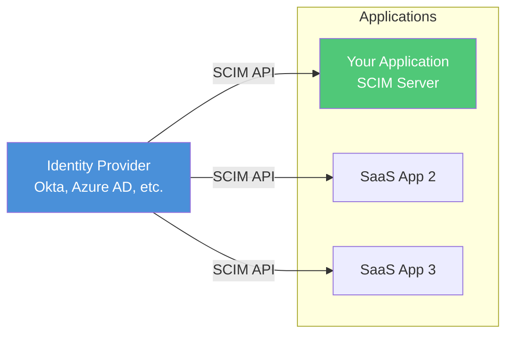
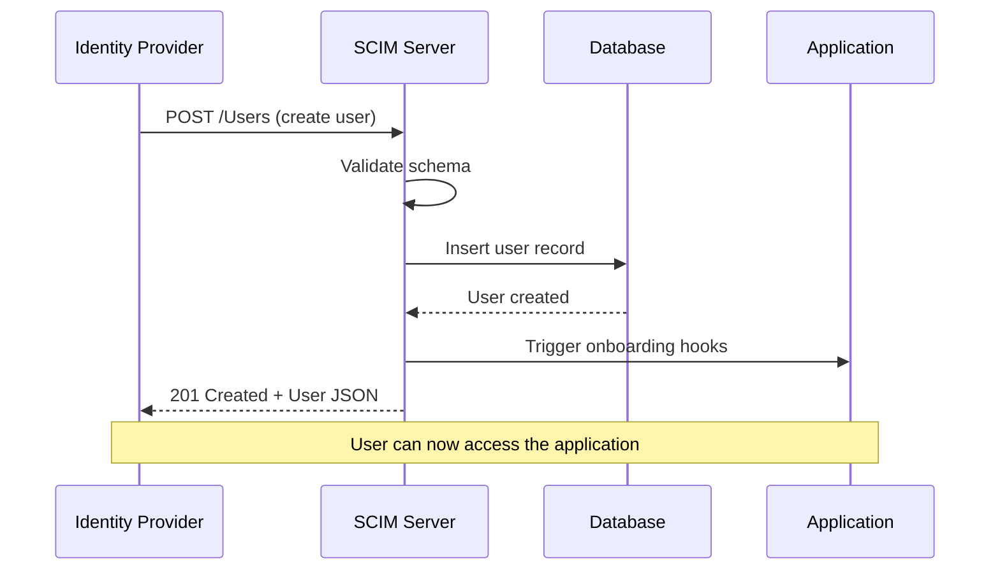

# How to Create SCIM Provisioning

Author: [nawazdhandala](https://github.com/nawazdhandala)

Tags: Security, SCIM, User Provisioning, Identity

Description: Learn to create SCIM provisioning for automated user lifecycle management across systems.

---

Managing user accounts manually across multiple applications becomes unsustainable as organizations grow. SCIM (System for Cross-domain Identity Management) solves this problem by providing a standardized protocol for automating user provisioning, updates, and deprovisioning. This guide walks through building a SCIM server from scratch.

## What is SCIM?

SCIM is an open standard (RFC 7643 and RFC 7644) that defines a REST API for managing identity data. When your HR system adds a new employee, SCIM automatically creates accounts in all connected applications. When someone leaves, SCIM disables or removes their access everywhere.

The following diagram shows how SCIM fits into an identity architecture:



## SCIM Core Concepts

Before writing code, understand these core SCIM concepts:

| Concept | Description |
|---------|-------------|
| **Resources** | Objects managed by SCIM (Users, Groups) |
| **Schemas** | Define attributes for each resource type |
| **Endpoints** | REST URLs like `/Users` and `/Groups` |
| **Operations** | CRUD operations plus bulk and search |
| **Filters** | Query syntax for searching resources |

## SCIM Request Flow

Here is how a typical SCIM provisioning request flows through your system:



## Building the SCIM Server

Start by setting up the project structure. The SCIM server handles HTTP requests from identity providers and translates them into database operations.

```bash
npm init -y
npm install express body-parser uuid
```

### Project Structure

```
scim-server/
├── src/
│   ├── server.js           # Express server setup
│   ├── routes/
│   │   ├── users.js        # /Users endpoint
│   │   └── groups.js       # /Groups endpoint
│   ├── middleware/
│   │   └── auth.js         # Bearer token validation
│   └── utils/
│       └── scim.js         # Schema helpers
└── package.json
```

### Server Setup

Create the main Express server with SCIM-specific middleware. SCIM requires specific content types and response formats.

```javascript
// src/server.js
const express = require('express');
const bodyParser = require('body-parser');
const authMiddleware = require('./middleware/auth');
const usersRouter = require('./routes/users');
const groupsRouter = require('./routes/groups');

const app = express();

// SCIM uses application/scim+json content type
app.use(bodyParser.json({ type: ['application/json', 'application/scim+json'] }));

// All SCIM endpoints require authentication
app.use('/scim/v2', authMiddleware);

// Mount SCIM resource endpoints
app.use('/scim/v2/Users', usersRouter);
app.use('/scim/v2/Groups', groupsRouter);

// Service Provider Configuration endpoint
// Identity providers call this to discover capabilities
app.get('/scim/v2/ServiceProviderConfig', (req, res) => {
  res.json({
    schemas: ['urn:ietf:params:scim:schemas:core:2.0:ServiceProviderConfig'],
    documentationUri: 'https://docs.yourapp.com/scim',
    patch: { supported: true },
    bulk: { supported: false, maxOperations: 0, maxPayloadSize: 0 },
    filter: { supported: true, maxResults: 100 },
    changePassword: { supported: false },
    sort: { supported: false },
    etag: { supported: false },
    authenticationSchemes: [{
      type: 'oauthbearertoken',
      name: 'OAuth Bearer Token',
      description: 'Authentication using OAuth 2.0 Bearer Token'
    }]
  });
});

const PORT = process.env.PORT || 3000;
app.listen(PORT, () => {
  console.log(`SCIM server running on port ${PORT}`);
});
```

### Authentication Middleware

SCIM endpoints must be protected. Identity providers authenticate using bearer tokens that you generate and share during setup.

```javascript
// src/middleware/auth.js
module.exports = function authMiddleware(req, res, next) {
  const authHeader = req.headers.authorization;

  // Verify bearer token format
  if (!authHeader || !authHeader.startsWith('Bearer ')) {
    return res.status(401).json({
      schemas: ['urn:ietf:params:scim:api:messages:2.0:Error'],
      detail: 'Missing or invalid authorization header',
      status: '401'
    });
  }

  const token = authHeader.substring(7);

  // Validate token against your stored tokens
  // In production, use a secure token store
  if (!isValidToken(token)) {
    return res.status(401).json({
      schemas: ['urn:ietf:params:scim:api:messages:2.0:Error'],
      detail: 'Invalid bearer token',
      status: '401'
    });
  }

  next();
};

function isValidToken(token) {
  // Compare against stored SCIM tokens for this tenant
  const validTokens = process.env.SCIM_TOKENS?.split(',') || [];
  return validTokens.includes(token);
}
```

### Users Endpoint

The Users endpoint handles the full lifecycle of user accounts. This is where most SCIM operations occur.

```javascript
// src/routes/users.js
const express = require('express');
const { v4: uuidv4 } = require('uuid');
const router = express.Router();

// In-memory store (use a database in production)
const users = new Map();

// GET /Users - List users with optional filtering
router.get('/', (req, res) => {
  const { filter, startIndex = 1, count = 100 } = req.query;

  let results = Array.from(users.values());

  // Apply SCIM filter if provided
  // Common filter: userName eq "john@example.com"
  if (filter) {
    results = applyFilter(results, filter);
  }

  // Paginate results
  const start = parseInt(startIndex) - 1;
  const pageSize = parseInt(count);
  const paged = results.slice(start, start + pageSize);

  res.json({
    schemas: ['urn:ietf:params:scim:api:messages:2.0:ListResponse'],
    totalResults: results.length,
    startIndex: parseInt(startIndex),
    itemsPerPage: paged.length,
    Resources: paged.map(formatUserResponse)
  });
});

// POST /Users - Create a new user
router.post('/', (req, res) => {
  const { userName, name, emails, active } = req.body;

  // Check for duplicate userName
  const existing = Array.from(users.values())
    .find(u => u.userName === userName);

  if (existing) {
    return res.status(409).json({
      schemas: ['urn:ietf:params:scim:api:messages:2.0:Error'],
      detail: `User with userName ${userName} already exists`,
      status: '409',
      scimType: 'uniqueness'
    });
  }

  // Create user record
  const user = {
    id: uuidv4(),
    userName,
    name: name || {},
    emails: emails || [],
    active: active !== false,
    meta: {
      resourceType: 'User',
      created: new Date().toISOString(),
      lastModified: new Date().toISOString()
    }
  };

  users.set(user.id, user);

  // Return created user with 201 status
  res.status(201).json(formatUserResponse(user));
});

// GET /Users/:id - Get a specific user
router.get('/:id', (req, res) => {
  const user = users.get(req.params.id);

  if (!user) {
    return res.status(404).json({
      schemas: ['urn:ietf:params:scim:api:messages:2.0:Error'],
      detail: 'User not found',
      status: '404'
    });
  }

  res.json(formatUserResponse(user));
});

// PUT /Users/:id - Replace user entirely
router.put('/:id', (req, res) => {
  const user = users.get(req.params.id);

  if (!user) {
    return res.status(404).json({
      schemas: ['urn:ietf:params:scim:api:messages:2.0:Error'],
      detail: 'User not found',
      status: '404'
    });
  }

  // Update all fields from request
  const { userName, name, emails, active } = req.body;

  user.userName = userName;
  user.name = name || {};
  user.emails = emails || [];
  user.active = active !== false;
  user.meta.lastModified = new Date().toISOString();

  users.set(user.id, user);
  res.json(formatUserResponse(user));
});

// PATCH /Users/:id - Update specific attributes
router.patch('/:id', (req, res) => {
  const user = users.get(req.params.id);

  if (!user) {
    return res.status(404).json({
      schemas: ['urn:ietf:params:scim:api:messages:2.0:Error'],
      detail: 'User not found',
      status: '404'
    });
  }

  // Process SCIM PATCH operations
  const { Operations } = req.body;

  for (const op of Operations) {
    applyPatchOperation(user, op);
  }

  user.meta.lastModified = new Date().toISOString();
  users.set(user.id, user);

  res.json(formatUserResponse(user));
});

// DELETE /Users/:id - Remove user
router.delete('/:id', (req, res) => {
  if (!users.has(req.params.id)) {
    return res.status(404).json({
      schemas: ['urn:ietf:params:scim:api:messages:2.0:Error'],
      detail: 'User not found',
      status: '404'
    });
  }

  users.delete(req.params.id);
  res.status(204).send();
});

// Helper: Format user for SCIM response
function formatUserResponse(user) {
  return {
    schemas: ['urn:ietf:params:scim:schemas:core:2.0:User'],
    id: user.id,
    userName: user.userName,
    name: user.name,
    emails: user.emails,
    active: user.active,
    meta: user.meta
  };
}

// Helper: Apply SCIM filter
function applyFilter(users, filter) {
  // Parse simple filters like: userName eq "value"
  const match = filter.match(/(\w+)\s+eq\s+"([^"]+)"/);
  if (match) {
    const [, attr, value] = match;
    return users.filter(u => u[attr] === value);
  }
  return users;
}

// Helper: Apply PATCH operation
function applyPatchOperation(user, operation) {
  const { op, path, value } = operation;

  switch (op.toLowerCase()) {
    case 'replace':
      if (path === 'active') {
        user.active = value;
      } else if (path === 'name.givenName') {
        user.name.givenName = value;
      } else if (path === 'name.familyName') {
        user.name.familyName = value;
      }
      break;
    case 'add':
      if (path === 'emails') {
        user.emails.push(value);
      }
      break;
    case 'remove':
      if (path === 'emails') {
        user.emails = user.emails.filter(e => e.value !== value);
      }
      break;
  }
}

module.exports = router;
```

## Testing Your SCIM Server

Test the endpoints using curl to verify they work before connecting an identity provider.

```bash
# Get service provider config
curl http://localhost:3000/scim/v2/ServiceProviderConfig \
  -H "Authorization: Bearer your-token"

# Create a user
curl -X POST http://localhost:3000/scim/v2/Users \
  -H "Authorization: Bearer your-token" \
  -H "Content-Type: application/scim+json" \
  -d '{
    "schemas": ["urn:ietf:params:scim:schemas:core:2.0:User"],
    "userName": "jane.doe@example.com",
    "name": {
      "givenName": "Jane",
      "familyName": "Doe"
    },
    "emails": [{
      "value": "jane.doe@example.com",
      "primary": true
    }],
    "active": true
  }'

# Deactivate user via PATCH (common for offboarding)
curl -X PATCH http://localhost:3000/scim/v2/Users/{user-id} \
  -H "Authorization: Bearer your-token" \
  -H "Content-Type: application/scim+json" \
  -d '{
    "schemas": ["urn:ietf:params:scim:api:messages:2.0:PatchOp"],
    "Operations": [{
      "op": "replace",
      "path": "active",
      "value": false
    }]
  }'
```

## Connecting to Identity Providers

Different identity providers have their own SCIM configuration interfaces. Here is what you typically need to provide:

| Setting | Value |
|---------|-------|
| SCIM Base URL | `https://yourapp.com/scim/v2` |
| Authentication | Bearer Token |
| Token | Generated unique token per tenant |
| Unique Identifier | `userName` (usually email) |

Most providers will test the connection by calling your ServiceProviderConfig endpoint, then perform an initial sync by listing and creating users.

## Security Best Practices

When deploying SCIM in production, follow these security guidelines:

1. **Use HTTPS only** - SCIM transmits sensitive identity data
2. **Rotate tokens periodically** - Generate new bearer tokens every 90 days
3. **Log all operations** - Maintain audit trails of provisioning events
4. **Rate limit endpoints** - Prevent abuse and accidental bulk operations
5. **Validate input strictly** - Sanitize all fields before database storage

## Summary

SCIM provisioning automates the tedious work of managing user accounts across applications. By implementing the SCIM protocol, your application integrates with any identity provider that supports the standard. The key components are the Users endpoint for account lifecycle, Groups endpoint for permissions, and ServiceProviderConfig for discovery.

Start with the basic CRUD operations shown here, then expand to support Groups and more advanced features like bulk operations as your needs grow.

**Related Reading:**

- [Stop Paywalling Security: SSO Is a Basic Right, Not an Enterprise Perk](https://oneuptime.com/blog/post/2025-08-19-sso-is-a-security-basic-not-an-enterprise-perk/view)
- [Secure Your Status Page: Authentication Options](https://oneuptime.com/blog/post/2025-11-20-secure-your-status-page-authentication-options/view)
