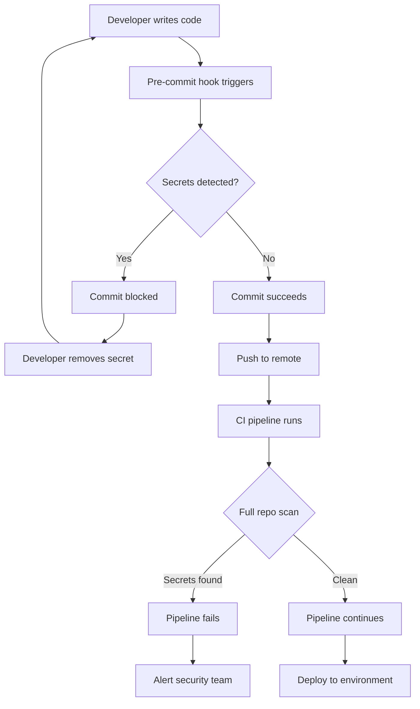

# How to Implement Secret Detection

Author: [nawazdhandala](https://github.com/nawazdhandala)

Tags: Testing, Security, Secrets, CICD

Description: Prevent credentials from leaking into your repositories by integrating secret detection tools into your CI/CD pipeline.

---

Leaked secrets are one of the most common security incidents in software development. API keys, database passwords, and tokens accidentally committed to Git can expose your infrastructure within minutes. Secret detection tools scan your codebase for patterns that look like credentials and block commits before they reach your repository.

## Why Secret Detection Matters

A single leaked AWS key can cost thousands of dollars in minutes. Bots constantly scan public repositories for credentials. Even private repositories are at risk if a developer's machine is compromised or if the repo is accidentally made public. The only safe approach is to prevent secrets from entering version control in the first place.

## Secret Detection Tools

Two popular open-source tools dominate this space:

### Gitleaks

Gitleaks is a fast, lightweight scanner written in Go. It uses regex patterns to detect secrets in Git history and can run as a pre-commit hook or in CI pipelines.

Install gitleaks:

```bash
# macOS with Homebrew
brew install gitleaks

# Linux (download binary)
wget https://github.com/gitleaks/gitleaks/releases/download/v8.18.0/gitleaks_8.18.0_linux_x64.tar.gz
tar -xzf gitleaks_8.18.0_linux_x64.tar.gz
sudo mv gitleaks /usr/local/bin/
```

Run a basic scan on your repository:

```bash
# Scan the current directory for secrets
# --verbose shows detailed output for each finding
gitleaks detect --source . --verbose
```

### detect-secrets

Yelp's detect-secrets takes a different approach. It maintains a baseline file of known secrets (false positives you have reviewed) and only alerts on new findings.

Install detect-secrets:

```bash
# Install via pip
pip install detect-secrets

# Create initial baseline by scanning all files
# This baseline tracks known findings so you can ignore false positives
detect-secrets scan > .secrets.baseline
```

Audit existing findings to mark false positives:

```bash
# Interactive audit walks through each finding
# Mark each as true/false positive to build your baseline
detect-secrets audit .secrets.baseline
```

## Detection Workflow

The secret detection workflow integrates at multiple points to catch leaks early:



## Pre-commit Hook Configuration

Pre-commit hooks catch secrets before they enter your local Git history. This is the most effective prevention point because secrets never leave the developer's machine.

Create a `.pre-commit-config.yaml` file in your repository root:

```yaml
# .pre-commit-config.yaml
# Run 'pre-commit install' to enable hooks after creating this file

repos:
  # Gitleaks hook scans staged changes for secrets
  - repo: https://github.com/gitleaks/gitleaks
    rev: v8.18.0
    hooks:
      - id: gitleaks
        # Only scan staged files, not entire history
        args: ["protect", "--staged"]

  # detect-secrets hook checks against baseline
  - repo: https://github.com/Yelp/detect-secrets
    rev: v1.4.0
    hooks:
      - id: detect-secrets
        # Reference the baseline file to ignore known false positives
        args: ["--baseline", ".secrets.baseline"]
        # Exclude test fixtures that contain fake secrets
        exclude: ".*/tests/fixtures/.*"
```

Install and activate the hooks:

```bash
# Install pre-commit framework
pip install pre-commit

# Install hooks defined in config file
# This creates .git/hooks/pre-commit
pre-commit install

# Run against all files to verify setup
pre-commit run --all-files
```

## CI Pipeline Integration

Pre-commit hooks can be bypassed. Always run secret detection in CI as a second layer of defense.

### GitHub Actions

```yaml
# .github/workflows/security.yaml
name: Security Scan

on:
  push:
    branches: [main, develop]
  pull_request:
    branches: [main]

jobs:
  secret-scan:
    runs-on: ubuntu-latest
    steps:
      - name: Checkout code
        uses: actions/checkout@v4
        with:
          # Fetch full history to scan all commits in PR
          fetch-depth: 0

      - name: Run Gitleaks
        uses: gitleaks/gitleaks-action@v2
        env:
          # Token needed to post findings as PR comments
          GITHUB_TOKEN: ${{ secrets.GITHUB_TOKEN }}
          # Fail the workflow if secrets are found
          GITLEAKS_ENABLE_COMMENTS: true
```

### GitLab CI

```yaml
# .gitlab-ci.yml
secret_detection:
  stage: test
  image: zricethezav/gitleaks:latest
  script:
    # Scan commits between origin/main and current HEAD
    # This catches secrets introduced in the merge request
    - gitleaks detect --source . --log-opts="origin/main..HEAD" --verbose
  rules:
    # Run on merge requests and main branch pushes
    - if: $CI_PIPELINE_SOURCE == "merge_request_event"
    - if: $CI_COMMIT_BRANCH == "main"
```

## Custom Pattern Definitions

Default patterns catch common secrets, but your organization likely has custom formats. Define additional patterns in a gitleaks config file.

Create `.gitleaks.toml` in your repository root:

```toml
# .gitleaks.toml
# Custom rules extend the default ruleset

title = "Custom Secret Detection Rules"

# Rule for internal API keys with specific prefix
[[rules]]
id = "internal-api-key"
description = "Internal API Key"
# Matches keys starting with 'INT_' followed by 32 hex characters
regex = '''INT_[a-fA-F0-9]{32}'''
# Tags help categorize findings in reports
tags = ["internal", "api-key"]

# Rule for JWT tokens (common in microservices)
[[rules]]
id = "jwt-token"
description = "JSON Web Token"
# JWT format: header.payload.signature (base64 encoded parts)
regex = '''eyJ[A-Za-z0-9_-]*\.eyJ[A-Za-z0-9_-]*\.[A-Za-z0-9_-]*'''
tags = ["jwt", "auth"]

# Rule for custom database connection strings
[[rules]]
id = "database-url"
description = "Database Connection String"
# Matches postgres/mysql URLs with credentials
regex = '''(postgres|mysql):\/\/[^:]+:[^@]+@[^\/]+\/\w+'''
tags = ["database", "credentials"]

# Rule for Stripe API keys (live and test)
[[rules]]
id = "stripe-api-key"
description = "Stripe API Key"
# Stripe keys start with sk_live_ or sk_test_
regex = '''sk_(live|test)_[a-zA-Z0-9]{24,}'''
tags = ["stripe", "payment"]

# Allowlist paths that should be skipped
[allowlist]
# Paths matching these patterns are ignored
paths = [
  '''\.secrets\.baseline''',
  '''tests/fixtures/.*''',
  '''docs/examples/.*'''
]
# Specific regex patterns that are allowed (e.g., placeholder values)
regexes = [
  '''EXAMPLE_API_KEY''',
  '''your-api-key-here''',
  '''sk_test_PLACEHOLDER'''
]
```

Run gitleaks with your custom config:

```bash
# Use custom config file for scanning
gitleaks detect --config .gitleaks.toml --source . --verbose
```

## False Positive Handling

False positives are inevitable. High entropy strings, test fixtures, and example code often trigger alerts. Handle them systematically to avoid alert fatigue.

### Inline Allowlisting

Add comments to suppress specific lines:

```python
# This is a test fixture, not a real secret
# gitleaks:allow
TEST_API_KEY = "sk_test_1234567890abcdefghijklmnop"

def get_api_key():
    # Real keys are loaded from environment variables
    return os.environ.get("API_KEY")
```

### Baseline Management with detect-secrets

```bash
# Scan and create baseline file
detect-secrets scan > .secrets.baseline

# Audit findings interactively
# Press 'n' for false positives, 'y' for true positives
detect-secrets audit .secrets.baseline

# Update baseline after adding new code
# Only new findings will be flagged
detect-secrets scan --baseline .secrets.baseline
```

### Gitleaks Allowlist in Config

```toml
# .gitleaks.toml
[allowlist]
# Ignore specific commits (useful for historical leaks already rotated)
commits = [
  "abc123def456...",
  "789xyz000111..."
]

# Ignore files by path pattern
paths = [
  '''test_.*\.py''',
  '''.*_test\.go''',
  '''fixtures/.*'''
]

# Ignore specific string patterns
regexes = [
  '''FAKE_SECRET_FOR_TESTING''',
  '''example\.com'''
]
```

## Secret Scanning in Git History

Secrets might already exist in your Git history. Scan the full history and remediate exposed credentials.

```bash
# Scan entire Git history with gitleaks
# This checks every commit, not just the current state
gitleaks detect --source . --log-opts="--all" --verbose

# Output findings to JSON for processing
gitleaks detect --source . --log-opts="--all" --report-format json --report-path findings.json
```

Process findings and rotate exposed secrets:

```bash
# Parse findings and extract unique secrets
# This helps identify which credentials need rotation
cat findings.json | jq -r '.[] | "\(.RuleID): \(.Secret | .[0:20])..."' | sort -u
```

If you find exposed secrets:

1. Immediately rotate the compromised credential
2. Check logs for unauthorized access
3. Consider using git-filter-repo to remove the secret from history (only for private repos)
4. Never assume a secret is safe just because the repo is private

## Putting It All Together

A complete secret detection setup includes:

```bash
# Repository structure
project/
  .gitleaks.toml           # Custom detection rules
  .secrets.baseline        # detect-secrets baseline
  .pre-commit-config.yaml  # Pre-commit hook config
  .github/
    workflows/
      security.yaml        # CI pipeline with secret scanning
```

Initialize the full setup:

```bash
# Install tools
pip install pre-commit detect-secrets
brew install gitleaks

# Create baseline (audit false positives)
detect-secrets scan > .secrets.baseline
detect-secrets audit .secrets.baseline

# Install pre-commit hooks
pre-commit install

# Verify setup works
pre-commit run --all-files
gitleaks detect --source . --verbose
```

---

Secret detection is not optional. Implement pre-commit hooks for immediate feedback, run CI scans as a safety net, and maintain your baseline to reduce noise. The few minutes spent setting this up will save you from the hours (or days) spent responding to a credential leak incident.
