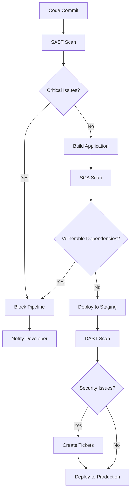
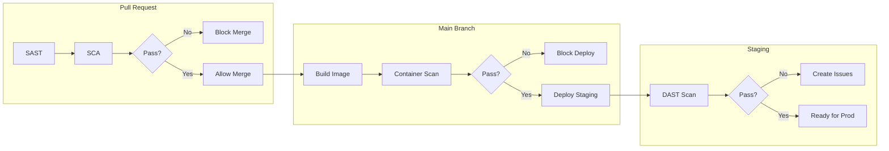
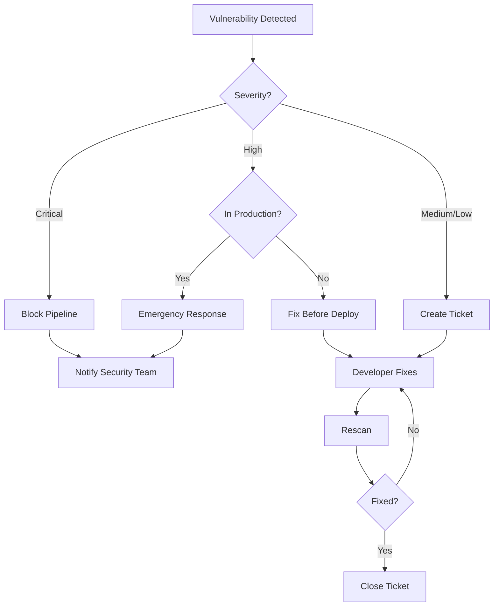

# How to Create Security Testing Integration

Author: [nawazdhandala](https://github.com/nawazdhandala)

Tags: Testing, Security, DevSecOps, CICD

Description: A practical guide to integrating SAST, DAST, and SCA security testing into CI/CD pipelines with automated vulnerability management and security gates.

---

Security testing should happen in your pipeline, not after deployment. By integrating SAST, DAST, and SCA scans into your CI/CD workflow, you catch vulnerabilities before they reach production. Here is how to build a secure pipeline from scratch.

## Understanding Security Testing Types

Three main categories of security testing fit into modern pipelines:

### Static Application Security Testing (SAST)

SAST analyzes source code without executing it. It finds vulnerabilities like SQL injection, XSS, and hardcoded secrets by examining code patterns.

**Strengths:**
- Runs early in the pipeline (shift left)
- Finds issues in code you write
- No running application required

**Limitations:**
- High false positive rate
- Cannot find runtime configuration issues
- Language and framework specific

### Dynamic Application Security Testing (DAST)

DAST tests running applications by sending malicious inputs and observing responses. It simulates real attacks against your deployed application.

**Strengths:**
- Finds runtime vulnerabilities
- Technology agnostic
- Low false positive rate

**Limitations:**
- Requires running application
- Cannot pinpoint vulnerable code line
- Slower than SAST

### Software Composition Analysis (SCA)

SCA scans your dependencies for known vulnerabilities. Most applications use hundreds of third-party libraries, each a potential attack vector.

**Strengths:**
- Catches vulnerable dependencies
- Tracks license compliance
- Generates Software Bill of Materials (SBOM)

**Limitations:**
- Only finds known CVEs
- Cannot assess custom code
- Requires vulnerability database updates

## Security Scan Flow in CI/CD

Here is how security scans integrate into a typical pipeline:



## Setting Up SAST in Your Pipeline

### GitHub Actions with Semgrep

Semgrep is an open-source SAST tool that supports multiple languages. This workflow runs on every pull request and blocks merging if critical issues are found.

```yaml
# .github/workflows/sast.yml
name: SAST Security Scan

on:
  pull_request:
    branches: [main]
  push:
    branches: [main]

jobs:
  semgrep:
    runs-on: ubuntu-latest
    steps:
      # Check out the repository code
      - uses: actions/checkout@v4

      # Run Semgrep with security-focused rules
      - name: Run Semgrep
        uses: returntocorp/semgrep-action@v1
        with:
          # Use security audit ruleset for comprehensive coverage
          config: p/security-audit
        env:
          # Optional: connect to Semgrep Cloud for team dashboards
          SEMGREP_APP_TOKEN: ${{ secrets.SEMGREP_APP_TOKEN }}

      # Upload results to GitHub Security tab
      - name: Upload SARIF
        uses: github/codeql-action/upload-sarif@v3
        with:
          sarif_file: semgrep.sarif
        if: always()
```

### GitLab CI with Semgrep

```yaml
# .gitlab-ci.yml
sast:
  stage: test
  image: returntocorp/semgrep
  script:
    # Run scan and output SARIF format for GitLab integration
    - semgrep scan --config p/security-audit --sarif > gl-sast-report.sarif
  artifacts:
    reports:
      # GitLab parses SARIF and shows results in merge request
      sast: gl-sast-report.sarif
  rules:
    # Run on merge requests and main branch
    - if: $CI_MERGE_REQUEST_ID
    - if: $CI_COMMIT_BRANCH == $CI_DEFAULT_BRANCH
```

### Custom SAST Rules

Create custom rules for your codebase patterns. This example detects hardcoded API keys in JavaScript.

```yaml
# .semgrep/custom-rules.yml
rules:
  - id: hardcoded-api-key
    # Match string assignments that look like API keys
    patterns:
      - pattern-either:
          - pattern: |
              $VAR = "sk_live_..."
          - pattern: |
              $VAR = "pk_live_..."
          - pattern: |
              apiKey: "..."
    # Exclude test files from this rule
    paths:
      exclude:
        - "*_test.go"
        - "*.test.js"
    message: "Hardcoded API key detected. Use environment variables."
    severity: ERROR
    languages:
      - javascript
      - typescript
```

## Implementing SCA Scanning

### Trivy for Container and Dependency Scanning

Trivy scans container images, filesystems, and git repositories for vulnerabilities. This workflow scans both your code dependencies and the final Docker image.

```yaml
# .github/workflows/sca.yml
name: SCA Vulnerability Scan

on:
  push:
    branches: [main]
  pull_request:
    branches: [main]
  # Run daily to catch newly disclosed CVEs
  schedule:
    - cron: '0 6 * * *'

jobs:
  dependency-scan:
    runs-on: ubuntu-latest
    steps:
      - uses: actions/checkout@v4

      # Scan filesystem for vulnerable dependencies
      - name: Scan dependencies
        uses: aquasecurity/trivy-action@master
        with:
          scan-type: 'fs'
          # Scan from repository root
          scan-ref: '.'
          # Report critical and high severity only
          severity: 'CRITICAL,HIGH'
          # Output in SARIF format for GitHub integration
          format: 'sarif'
          output: 'trivy-results.sarif'

      # Upload to GitHub Security tab
      - name: Upload Trivy scan results
        uses: github/codeql-action/upload-sarif@v3
        with:
          sarif_file: 'trivy-results.sarif'

  container-scan:
    runs-on: ubuntu-latest
    needs: build
    steps:
      - uses: actions/checkout@v4

      # Build the Docker image first
      - name: Build image
        run: docker build -t myapp:${{ github.sha }} .

      # Scan the built image for OS and app vulnerabilities
      - name: Scan container image
        uses: aquasecurity/trivy-action@master
        with:
          image-ref: 'myapp:${{ github.sha }}'
          severity: 'CRITICAL,HIGH'
          # Fail pipeline if critical vulnerabilities found
          exit-code: '1'
          # Ignore unfixed vulnerabilities (no patch available)
          ignore-unfixed: true
```

### Generating SBOM

Software Bill of Materials documents all components in your application. Required for compliance in many industries.

```yaml
# Generate SBOM during build
- name: Generate SBOM
  uses: anchore/sbom-action@v0
  with:
    # Scan the built Docker image
    image: myapp:${{ github.sha }}
    # Output in CycloneDX format (industry standard)
    format: cyclonedx-json
    output-file: sbom.json

# Upload SBOM as build artifact
- name: Upload SBOM
  uses: actions/upload-artifact@v4
  with:
    name: sbom
    path: sbom.json
```

## Setting Up DAST Scanning

### OWASP ZAP Baseline Scan

ZAP is an open-source DAST tool. The baseline scan is fast and suitable for CI/CD pipelines. Run it against your staging environment.

```yaml
# .github/workflows/dast.yml
name: DAST Security Scan

on:
  # Trigger after staging deployment
  workflow_run:
    workflows: ["Deploy to Staging"]
    types: [completed]

jobs:
  zap-scan:
    runs-on: ubuntu-latest
    # Only run if deployment succeeded
    if: ${{ github.event.workflow_run.conclusion == 'success' }}
    steps:
      # ZAP baseline scan for quick results
      - name: ZAP Baseline Scan
        uses: zaproxy/action-baseline@v0.10.0
        with:
          # Target your staging URL
          target: 'https://staging.example.com'
          # Fail on high or medium severity alerts
          fail_action: true
          # Rules file for customization
          rules_file_name: '.zap/rules.tsv'

      # Upload HTML report as artifact
      - name: Upload ZAP Report
        uses: actions/upload-artifact@v4
        with:
          name: zap-report
          path: report_html.html
```

### ZAP Full Scan for Deeper Analysis

For release branches, run a full active scan that tests more attack vectors.

```yaml
# Full scan job - runs longer but finds more issues
zap-full-scan:
  runs-on: ubuntu-latest
  # Only on release branches
  if: startsWith(github.ref, 'refs/heads/release/')
  steps:
    - name: ZAP Full Scan
      uses: zaproxy/action-full-scan@v0.8.0
      with:
        target: 'https://staging.example.com'
        # Custom context file with authentication
        context_file: '.zap/context.xml'
        # Wait up to 60 minutes for scan
        cmd_options: '-T 60'
```

### Authenticated DAST Scanning

Most applications require authentication. Configure ZAP with login credentials to test authenticated endpoints.

```yaml
# .zap/context.xml
<?xml version="1.0" encoding="UTF-8" standalone="no"?>
<configuration>
  <context>
    <name>Authenticated Context</name>
    <!-- Include all paths under /app -->
    <incregexes>https://staging.example.com/app/.*</incregexes>
    <!-- Authentication configuration -->
    <authentication>
      <type>2</type> <!-- Form-based authentication -->
      <loginurl>https://staging.example.com/login</loginurl>
      <loginpageurl>https://staging.example.com/login</loginpageurl>
      <!-- Form parameters for login -->
      <formparam>username=&amp;password=</formparam>
    </authentication>
    <!-- User credentials (use secrets in CI) -->
    <users>
      <user>testuser</user>
    </users>
  </context>
</configuration>
```

## Complete Security Pipeline

Here is a complete workflow that orchestrates all three scan types with proper gating.



### Unified Security Workflow

```yaml
# .github/workflows/security-pipeline.yml
name: Security Pipeline

on:
  push:
    branches: [main]
  pull_request:
    branches: [main]

jobs:
  # SAST runs first and fastest
  sast:
    runs-on: ubuntu-latest
    steps:
      - uses: actions/checkout@v4

      - name: Run Semgrep
        uses: returntocorp/semgrep-action@v1
        with:
          config: >-
            p/security-audit
            p/secrets
            p/owasp-top-ten

      - name: Upload SARIF
        uses: github/codeql-action/upload-sarif@v3
        with:
          sarif_file: semgrep.sarif
        if: always()

  # SCA runs in parallel with SAST
  sca:
    runs-on: ubuntu-latest
    steps:
      - uses: actions/checkout@v4

      - name: Scan dependencies
        uses: aquasecurity/trivy-action@master
        with:
          scan-type: 'fs'
          scan-ref: '.'
          severity: 'CRITICAL,HIGH'
          exit-code: '1'
          format: 'sarif'
          output: 'trivy-fs.sarif'

      - name: Upload SARIF
        uses: github/codeql-action/upload-sarif@v3
        with:
          sarif_file: 'trivy-fs.sarif'
        if: always()

  # Build only after SAST and SCA pass
  build:
    needs: [sast, sca]
    runs-on: ubuntu-latest
    outputs:
      image-tag: ${{ steps.meta.outputs.tags }}
    steps:
      - uses: actions/checkout@v4

      - name: Set up Docker Buildx
        uses: docker/setup-buildx-action@v3

      - name: Build image
        uses: docker/build-push-action@v5
        with:
          context: .
          push: false
          load: true
          tags: myapp:${{ github.sha }}

      # Scan the container image
      - name: Scan container
        uses: aquasecurity/trivy-action@master
        with:
          image-ref: 'myapp:${{ github.sha }}'
          severity: 'CRITICAL,HIGH'
          exit-code: '1'
          ignore-unfixed: true

      # Generate SBOM for compliance
      - name: Generate SBOM
        uses: anchore/sbom-action@v0
        with:
          image: myapp:${{ github.sha }}
          format: cyclonedx-json
          output-file: sbom.json

      - name: Upload SBOM
        uses: actions/upload-artifact@v4
        with:
          name: sbom
          path: sbom.json

  # Deploy to staging (main branch only)
  deploy-staging:
    needs: build
    if: github.ref == 'refs/heads/main'
    runs-on: ubuntu-latest
    environment: staging
    steps:
      - name: Deploy to staging
        run: |
          # Your deployment script here
          echo "Deploying to staging..."

  # DAST runs against staging
  dast:
    needs: deploy-staging
    runs-on: ubuntu-latest
    steps:
      - uses: actions/checkout@v4

      # Wait for staging to be ready
      - name: Wait for deployment
        run: |
          for i in {1..30}; do
            if curl -s https://staging.example.com/health | grep -q "ok"; then
              echo "Staging is ready"
              exit 0
            fi
            sleep 10
          done
          echo "Staging not ready"
          exit 1

      - name: ZAP Scan
        uses: zaproxy/action-baseline@v0.10.0
        with:
          target: 'https://staging.example.com'
          fail_action: true

      - name: Upload ZAP Report
        uses: actions/upload-artifact@v4
        with:
          name: zap-report
          path: report_html.html
        if: always()
```

## Vulnerability Management Workflow

Security scans find issues. You need a process to handle them.



### Automated Issue Creation

Create GitHub issues automatically when vulnerabilities are found.

```yaml
# Create issues for vulnerabilities that don't block the pipeline
- name: Create vulnerability issues
  if: failure()
  uses: actions/github-script@v7
  with:
    script: |
      const fs = require('fs');
      // Read scan results
      const results = JSON.parse(fs.readFileSync('trivy-results.json'));

      for (const vuln of results.Results[0].Vulnerabilities || []) {
        // Create an issue for each vulnerability
        await github.rest.issues.create({
          owner: context.repo.owner,
          repo: context.repo.repo,
          title: `Security: ${vuln.VulnerabilityID} in ${vuln.PkgName}`,
          body: `
## Vulnerability Details

- **CVE**: ${vuln.VulnerabilityID}
- **Package**: ${vuln.PkgName}
- **Installed Version**: ${vuln.InstalledVersion}
- **Fixed Version**: ${vuln.FixedVersion || 'Not available'}
- **Severity**: ${vuln.Severity}

## Description
${vuln.Description}

## References
${vuln.References?.map(r => '- ' + r).join('\n') || 'None'}
          `,
          labels: ['security', vuln.Severity.toLowerCase()]
        });
      }
```

### Vulnerability Exception Process

Not all vulnerabilities require immediate action. Create an exception file for accepted risks.

```yaml
# .trivyignore
# False positive - this CVE does not affect our usage
CVE-2023-12345

# Accepted risk - mitigated by network policy
# Approved by: security@example.com
# Expires: 2026-03-01
CVE-2024-67890

# No fix available - monitoring for updates
CVE-2024-11111
```

## Security Gates and Thresholds

Define clear policies for what blocks the pipeline.

### Threshold Configuration

```yaml
# security-policy.yml
thresholds:
  sast:
    # Block on any critical SAST findings
    critical: 0
    high: 0
    # Allow some medium findings (tech debt)
    medium: 10
  sca:
    # Block on critical CVEs
    critical: 0
    # Allow high if no fix available
    high: 5
  dast:
    # DAST findings create tickets, not blocks
    critical: 0
    high: 5

# Exemptions require approval
exemptions:
  require_approval: true
  approvers:
    - security-team
  max_duration_days: 30
```

### Enforcing Thresholds

```yaml
# Check scan results against policy
- name: Evaluate security policy
  run: |
    CRITICAL=$(jq '.Results[].Vulnerabilities | map(select(.Severity == "CRITICAL")) | length' trivy-results.json)
    HIGH=$(jq '.Results[].Vulnerabilities | map(select(.Severity == "HIGH")) | length' trivy-results.json)

    echo "Critical: $CRITICAL, High: $HIGH"

    # Load thresholds from policy file
    CRITICAL_THRESHOLD=$(yq '.thresholds.sca.critical' security-policy.yml)
    HIGH_THRESHOLD=$(yq '.thresholds.sca.high' security-policy.yml)

    if [ "$CRITICAL" -gt "$CRITICAL_THRESHOLD" ]; then
      echo "::error::Critical vulnerabilities ($CRITICAL) exceed threshold ($CRITICAL_THRESHOLD)"
      exit 1
    fi

    if [ "$HIGH" -gt "$HIGH_THRESHOLD" ]; then
      echo "::error::High vulnerabilities ($HIGH) exceed threshold ($HIGH_THRESHOLD)"
      exit 1
    fi
```

## Secrets Scanning

Prevent secrets from entering your repository.

### Pre-commit Hook with Gitleaks

```yaml
# .pre-commit-config.yaml
repos:
  - repo: https://github.com/gitleaks/gitleaks
    rev: v8.18.0
    hooks:
      - id: gitleaks
        # Scan staged changes before commit
        args: ['--staged']
```

### CI Integration

```yaml
# Scan for secrets in CI
- name: Gitleaks scan
  uses: gitleaks/gitleaks-action@v2
  env:
    GITHUB_TOKEN: ${{ secrets.GITHUB_TOKEN }}
    # Report format for GitHub Security tab
    GITLEAKS_ENABLE_UPLOAD_ARTIFACT: true
```

### Custom Secret Patterns

```toml
# .gitleaks.toml
title = "Custom Gitleaks Config"

# Add patterns for internal secret formats
[[rules]]
id = "internal-api-key"
description = "Internal API Key"
regex = '''internal_key_[a-zA-Z0-9]{32}'''
tags = ["api", "internal"]

# Allowlist for false positives
[allowlist]
paths = [
  '''test/fixtures/.*''',
  '''docs/examples/.*'''
]
```

## Best Practices

### 1. Fail Fast, Fail Early

Run SAST and SCA on every commit. Catch issues before code review.

### 2. Tune Your Tools

Default rules generate noise. Customize for your stack and accept that initial setup takes time.

### 3. Make Fixes Easy

When scans fail, provide clear remediation guidance. Link to documentation.

### 4. Track Metrics

Monitor:
- Mean time to remediate by severity
- False positive rate
- Scan duration
- Vulnerability escape rate (found in production)

### 5. Regular Updates

- Update scanning tools monthly
- Refresh vulnerability databases daily
- Review and update custom rules quarterly

## Security Checklist

- [ ] SAST runs on every pull request
- [ ] SCA scans dependencies and container images
- [ ] DAST tests staging environment before production
- [ ] Secrets scanning prevents credential leaks
- [ ] Security gates block critical and high findings
- [ ] Vulnerability management process documented
- [ ] Exception process requires approval and expiration
- [ ] SBOM generated for every release
- [ ] Results visible in GitHub Security tab
- [ ] Metrics tracked and reviewed monthly

---

Security testing in CI/CD is not optional. Start with SAST and SCA, add DAST when you have staging, and iterate on your rules. The goal is not zero findings but zero surprises in production.
