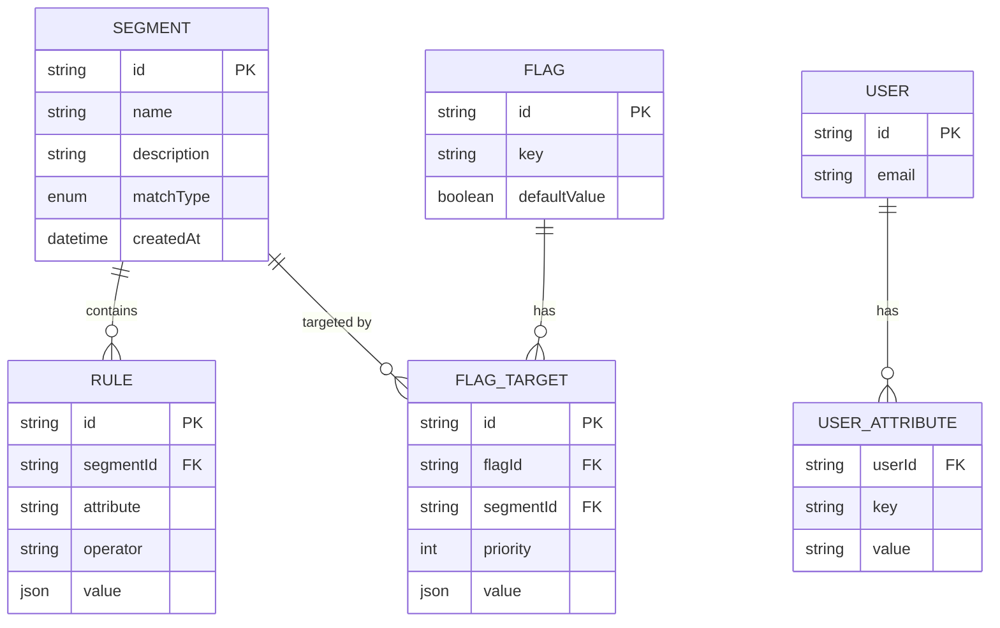
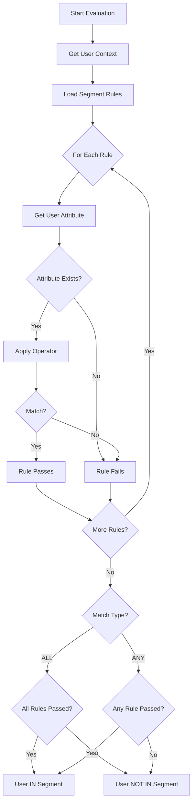
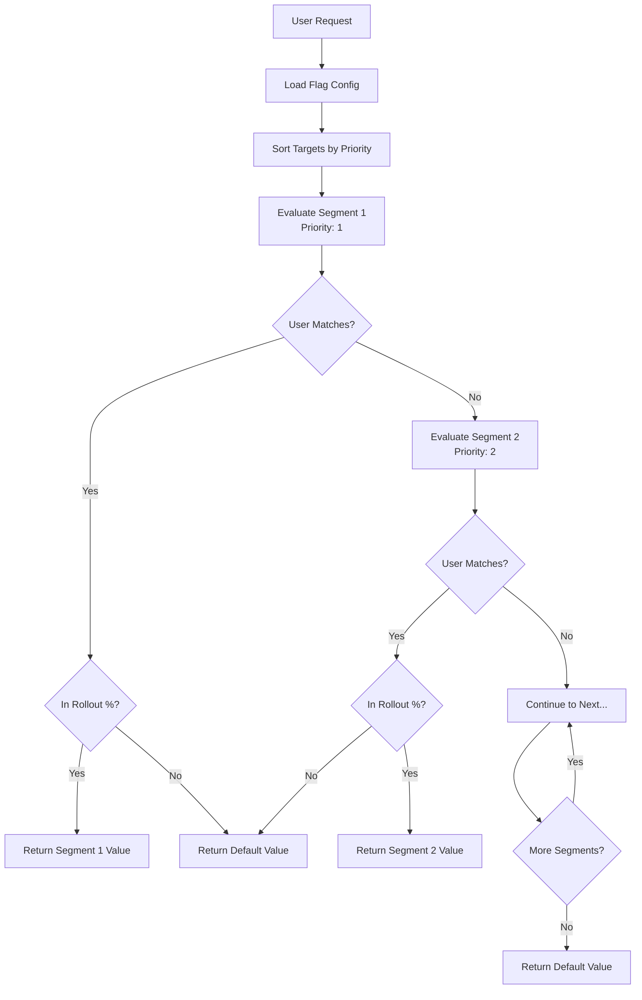
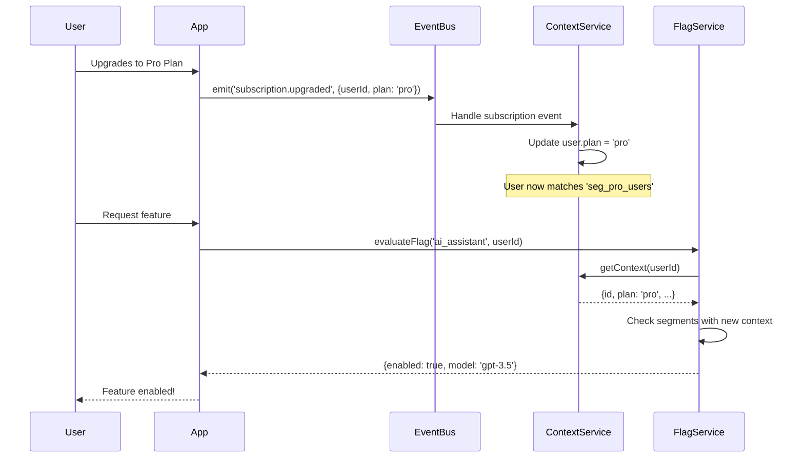
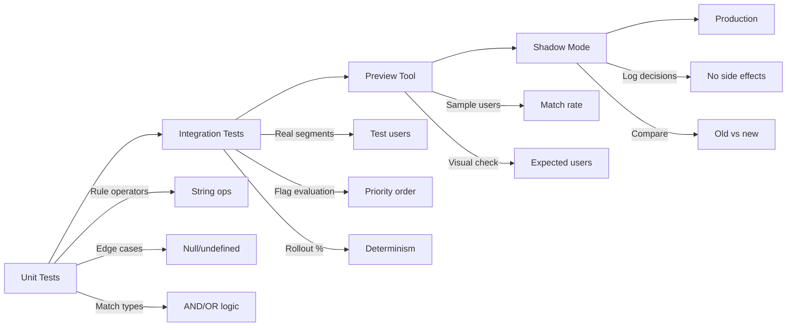

# How to Build Segment Targeting

Author: [nawazdhandala](https://github.com/nawazdhandala)

Tags: Feature Flags, Targeting, Segmentation, Personalization

Description: Learn how to target feature flags to specific user segments.

---

> Feature flags become truly powerful when you can target specific groups of users. **Segment targeting lets you roll out features to beta testers, enable premium functionality for paying customers, or gradually release changes by geography, plan, or behavior.**

At its core, segment targeting answers one question: *Should this user see this feature?*

This guide walks through how to build a complete segment targeting system for feature flags, from defining segments to evaluating rules, handling priorities, and testing your logic.

---

## Table of Contents

1. What is Segment Targeting?
2. Segment Definition
3. Rule-Based Targeting
4. Multiple Segment Evaluation
5. Segment Priority Ordering
6. Dynamic Segment Membership
7. Testing Segment Rules
8. Complete Implementation Example
9. Best Practices
10. Common Pitfalls

---

## 1. What is Segment Targeting?

Segment targeting is the practice of grouping users based on shared characteristics and controlling feature availability per group. Instead of a simple on/off switch, you get granular control.

| Concept | Description |
|---------|-------------|
| Segment | A named group of users defined by rules (e.g., "Beta Users", "Enterprise Customers") |
| Rule | A condition that determines segment membership (e.g., `plan == "enterprise"`) |
| Targeting | The process of evaluating which segments a user belongs to |
| Flag Evaluation | Determining the feature flag value based on segment membership |

Real-world examples:
- **Beta testing**: Roll out to employees first, then early adopters
- **Tiered features**: Premium features for paid plans only
- **Regional rollouts**: Launch in specific countries before going global
- **A/B testing**: Split users into test groups for experimentation

---

## 2. Segment Definition

A segment needs three things: an identifier, a name, and rules that define membership.

### Data Model

```typescript
// segment.ts
interface Rule {
  attribute: string;      // User attribute to check (e.g., "email", "plan", "country")
  operator: Operator;     // Comparison operator
  value: string | number | boolean | string[];  // Value(s) to compare against
}

type Operator =
  | 'equals'           // Exact match
  | 'not_equals'       // Not equal
  | 'contains'         // String contains
  | 'starts_with'      // String prefix
  | 'ends_with'        // String suffix
  | 'in'               // Value in list
  | 'not_in'           // Value not in list
  | 'greater_than'     // Numeric comparison
  | 'less_than'        // Numeric comparison
  | 'regex'            // Regular expression match
  | 'semver_gt'        // Semantic version greater than
  | 'semver_lt';       // Semantic version less than

interface Segment {
  id: string;
  name: string;
  description?: string;
  rules: Rule[];
  matchType: 'all' | 'any';  // AND vs OR for multiple rules
  createdAt: Date;
  updatedAt: Date;
}
```

### Example Segments

```typescript
const betaUsersSegment: Segment = {
  id: 'seg_beta_users',
  name: 'Beta Users',
  description: 'Internal employees and early adopter program members',
  rules: [
    { attribute: 'email', operator: 'ends_with', value: '@company.com' },
  ],
  matchType: 'all',
  createdAt: new Date(),
  updatedAt: new Date(),
};

const enterpriseSegment: Segment = {
  id: 'seg_enterprise',
  name: 'Enterprise Customers',
  description: 'Users on enterprise plans',
  rules: [
    { attribute: 'plan', operator: 'in', value: ['enterprise', 'enterprise_plus'] },
    { attribute: 'account_status', operator: 'equals', value: 'active' },
  ],
  matchType: 'all',  // Must match ALL rules
  createdAt: new Date(),
  updatedAt: new Date(),
};

const euUsersSegment: Segment = {
  id: 'seg_eu_users',
  name: 'European Users',
  description: 'Users located in EU countries',
  rules: [
    { attribute: 'country', operator: 'in', value: ['DE', 'FR', 'IT', 'ES', 'NL', 'BE', 'AT', 'PL'] },
  ],
  matchType: 'all',
  createdAt: new Date(),
  updatedAt: new Date(),
};
```

### Architecture Diagram



---

## 3. Rule-Based Targeting

The heart of segment targeting is the rule evaluation engine. Each rule compares a user attribute against an expected value using an operator.

### Rule Evaluator Implementation

```typescript
// rule-evaluator.ts
interface UserContext {
  id: string;
  email?: string;
  [key: string]: any;  // Dynamic attributes
}

function evaluateRule(rule: Rule, user: UserContext): boolean {
  const userValue = user[rule.attribute];

  // Handle missing attributes
  if (userValue === undefined || userValue === null) {
    return false;
  }

  switch (rule.operator) {
    case 'equals':
      return userValue === rule.value;

    case 'not_equals':
      return userValue !== rule.value;

    case 'contains':
      return typeof userValue === 'string' &&
             userValue.includes(rule.value as string);

    case 'starts_with':
      return typeof userValue === 'string' &&
             userValue.startsWith(rule.value as string);

    case 'ends_with':
      return typeof userValue === 'string' &&
             userValue.endsWith(rule.value as string);

    case 'in':
      return Array.isArray(rule.value) &&
             rule.value.includes(userValue);

    case 'not_in':
      return Array.isArray(rule.value) &&
             !rule.value.includes(userValue);

    case 'greater_than':
      return typeof userValue === 'number' &&
             userValue > (rule.value as number);

    case 'less_than':
      return typeof userValue === 'number' &&
             userValue < (rule.value as number);

    case 'regex':
      try {
        const regex = new RegExp(rule.value as string);
        return regex.test(String(userValue));
      } catch {
        return false;  // Invalid regex
      }

    case 'semver_gt':
      return compareSemver(String(userValue), rule.value as string) > 0;

    case 'semver_lt':
      return compareSemver(String(userValue), rule.value as string) < 0;

    default:
      return false;
  }
}

// Helper for semantic version comparison
function compareSemver(a: string, b: string): number {
  const parseVersion = (v: string) => v.split('.').map(Number);
  const [aMajor, aMinor = 0, aPatch = 0] = parseVersion(a);
  const [bMajor, bMinor = 0, bPatch = 0] = parseVersion(b);

  if (aMajor !== bMajor) return aMajor - bMajor;
  if (aMinor !== bMinor) return aMinor - bMinor;
  return aPatch - bPatch;
}
```

### Segment Membership Check

```typescript
// segment-evaluator.ts
function isUserInSegment(segment: Segment, user: UserContext): boolean {
  if (segment.rules.length === 0) {
    return false;  // Empty segments match no one
  }

  const results = segment.rules.map(rule => evaluateRule(rule, user));

  if (segment.matchType === 'all') {
    // AND logic: all rules must pass
    return results.every(Boolean);
  } else {
    // OR logic: at least one rule must pass
    return results.some(Boolean);
  }
}
```

### Evaluation Flow Diagram



---

## 4. Multiple Segment Evaluation

In real applications, feature flags target multiple segments with different values or rollout percentages.

### Flag Configuration Model

```typescript
// flag-config.ts
interface FlagTarget {
  segmentId: string;
  value: any;           // The flag value for this segment
  rolloutPercentage: number;  // 0-100, for gradual rollouts
  priority: number;     // Lower number = higher priority
}

interface FeatureFlag {
  id: string;
  key: string;
  defaultValue: any;
  enabled: boolean;
  targets: FlagTarget[];
}

const newDashboardFlag: FeatureFlag = {
  id: 'flag_new_dashboard',
  key: 'new_dashboard',
  defaultValue: false,
  enabled: true,
  targets: [
    { segmentId: 'seg_beta_users', value: true, rolloutPercentage: 100, priority: 1 },
    { segmentId: 'seg_enterprise', value: true, rolloutPercentage: 50, priority: 2 },
    { segmentId: 'seg_eu_users', value: false, rolloutPercentage: 100, priority: 3 },
  ],
};
```

### Multi-Segment Evaluator

```typescript
// flag-evaluator.ts
interface EvaluationResult {
  value: any;
  matchedSegment: string | null;
  reason: 'segment_match' | 'rollout_excluded' | 'default';
}

function evaluateFlag(
  flag: FeatureFlag,
  user: UserContext,
  segments: Map<string, Segment>
): EvaluationResult {
  // Flag disabled = return default
  if (!flag.enabled) {
    return { value: flag.defaultValue, matchedSegment: null, reason: 'default' };
  }

  // Sort targets by priority (lower number = higher priority)
  const sortedTargets = [...flag.targets].sort((a, b) => a.priority - b.priority);

  for (const target of sortedTargets) {
    const segment = segments.get(target.segmentId);
    if (!segment) continue;

    // Check if user is in segment
    if (isUserInSegment(segment, user)) {
      // Check rollout percentage
      if (isInRollout(user.id, flag.key, target.rolloutPercentage)) {
        return {
          value: target.value,
          matchedSegment: target.segmentId,
          reason: 'segment_match',
        };
      } else {
        return {
          value: flag.defaultValue,
          matchedSegment: target.segmentId,
          reason: 'rollout_excluded',
        };
      }
    }
  }

  // No segment matched
  return { value: flag.defaultValue, matchedSegment: null, reason: 'default' };
}

// Deterministic rollout based on user ID and flag key
function isInRollout(userId: string, flagKey: string, percentage: number): boolean {
  if (percentage >= 100) return true;
  if (percentage <= 0) return false;

  const hash = hashString(`${userId}:${flagKey}`);
  const bucket = hash % 100;
  return bucket < percentage;
}

// Simple string hash function
function hashString(str: string): number {
  let hash = 0;
  for (let i = 0; i < str.length; i++) {
    const char = str.charCodeAt(i);
    hash = ((hash << 5) - hash) + char;
    hash = hash & hash;  // Convert to 32-bit integer
  }
  return Math.abs(hash);
}
```

---

## 5. Segment Priority Ordering

Priority ordering determines which segment "wins" when a user matches multiple segments. This is critical for predictable behavior.

### Priority Resolution Logic



### Priority Configuration Example

```typescript
// Example: Premium feature with tiered access
const premiumFeatureFlag: FeatureFlag = {
  id: 'flag_ai_assistant',
  key: 'ai_assistant',
  defaultValue: { enabled: false, model: null },
  enabled: true,
  targets: [
    // Priority 1: Internal testing (full access)
    {
      segmentId: 'seg_internal_testers',
      value: { enabled: true, model: 'gpt-4', rateLimit: 1000 },
      rolloutPercentage: 100,
      priority: 1,
    },
    // Priority 2: Enterprise Plus (premium model)
    {
      segmentId: 'seg_enterprise_plus',
      value: { enabled: true, model: 'gpt-4', rateLimit: 500 },
      rolloutPercentage: 100,
      priority: 2,
    },
    // Priority 3: Enterprise (standard model)
    {
      segmentId: 'seg_enterprise',
      value: { enabled: true, model: 'gpt-3.5', rateLimit: 100 },
      rolloutPercentage: 100,
      priority: 3,
    },
    // Priority 4: Pro users (limited rollout)
    {
      segmentId: 'seg_pro_users',
      value: { enabled: true, model: 'gpt-3.5', rateLimit: 50 },
      rolloutPercentage: 25,
      priority: 4,
    },
  ],
};
```

### Priority Best Practices

| Priority Level | Use Case | Example |
|----------------|----------|---------|
| 1-10 | Override / Kill switches | Disable for specific users causing issues |
| 11-50 | Internal testing | Employees, QA team |
| 51-100 | Beta programs | Early adopters, design partners |
| 101-500 | Tiered features | Enterprise > Pro > Free |
| 501+ | Gradual rollouts | Geographic, percentage-based |

---

## 6. Dynamic Segment Membership

Segments become powerful when membership updates automatically based on user behavior or external data.

### Real-Time Attribute Updates

```typescript
// user-context-service.ts
class UserContextService {
  private userAttributes: Map<string, UserContext> = new Map();
  private attributeProviders: AttributeProvider[] = [];

  registerProvider(provider: AttributeProvider): void {
    this.attributeProviders.push(provider);
  }

  async getContext(userId: string): Promise<UserContext> {
    // Start with cached attributes
    let context: UserContext = this.userAttributes.get(userId) || { id: userId };

    // Enrich with real-time attributes from providers
    for (const provider of this.attributeProviders) {
      try {
        const attrs = await provider.getAttributes(userId);
        context = { ...context, ...attrs };
      } catch (error) {
        console.error(`Provider ${provider.name} failed:`, error);
      }
    }

    // Cache the enriched context
    this.userAttributes.set(userId, context);
    return context;
  }

  // Update attributes in real-time (e.g., from events)
  updateAttributes(userId: string, attributes: Partial<UserContext>): void {
    const existing = this.userAttributes.get(userId) || { id: userId };
    this.userAttributes.set(userId, { ...existing, ...attributes });
  }
}

interface AttributeProvider {
  name: string;
  getAttributes(userId: string): Promise<Partial<UserContext>>;
}

// Example providers
const subscriptionProvider: AttributeProvider = {
  name: 'subscription',
  async getAttributes(userId: string) {
    // Fetch from billing system
    const subscription = await billingService.getSubscription(userId);
    return {
      plan: subscription.plan,
      subscription_status: subscription.status,
      mrr: subscription.monthlyRevenue,
    };
  },
};

const behaviorProvider: AttributeProvider = {
  name: 'behavior',
  async getAttributes(userId: string) {
    // Fetch from analytics
    const stats = await analyticsService.getUserStats(userId);
    return {
      login_count_30d: stats.loginCount,
      feature_usage_score: stats.engagementScore,
      last_active: stats.lastActiveDate,
    };
  },
};
```

### Event-Driven Segment Updates



### Computed Attributes

```typescript
// computed-attributes.ts
interface ComputedAttribute {
  name: string;
  dependencies: string[];
  compute: (context: UserContext) => any;
}

const computedAttributes: ComputedAttribute[] = [
  {
    name: 'is_power_user',
    dependencies: ['login_count_30d', 'feature_usage_score'],
    compute: (ctx) =>
      (ctx.login_count_30d || 0) > 20 && (ctx.feature_usage_score || 0) > 80,
  },
  {
    name: 'account_age_days',
    dependencies: ['created_at'],
    compute: (ctx) => {
      if (!ctx.created_at) return 0;
      const created = new Date(ctx.created_at);
      const now = new Date();
      return Math.floor((now.getTime() - created.getTime()) / (1000 * 60 * 60 * 24));
    },
  },
  {
    name: 'risk_level',
    dependencies: ['failed_payments', 'support_tickets_30d'],
    compute: (ctx) => {
      const failedPayments = ctx.failed_payments || 0;
      const tickets = ctx.support_tickets_30d || 0;
      if (failedPayments > 2 || tickets > 5) return 'high';
      if (failedPayments > 0 || tickets > 2) return 'medium';
      return 'low';
    },
  },
];

function enrichWithComputedAttributes(context: UserContext): UserContext {
  const enriched = { ...context };

  for (const attr of computedAttributes) {
    // Only compute if dependencies are present
    const hasDeps = attr.dependencies.every(dep => enriched[dep] !== undefined);
    if (hasDeps) {
      enriched[attr.name] = attr.compute(enriched);
    }
  }

  return enriched;
}
```

---

## 7. Testing Segment Rules

Robust testing ensures your targeting logic works correctly before affecting real users.

### Unit Tests for Rule Evaluation

```typescript
// rule-evaluator.test.ts
import { describe, it, expect } from 'vitest';
import { evaluateRule, isUserInSegment } from './segment-evaluator';

describe('Rule Evaluator', () => {
  describe('equals operator', () => {
    it('matches exact string values', () => {
      const rule = { attribute: 'plan', operator: 'equals' as const, value: 'enterprise' };
      expect(evaluateRule(rule, { id: '1', plan: 'enterprise' })).toBe(true);
      expect(evaluateRule(rule, { id: '1', plan: 'pro' })).toBe(false);
    });

    it('handles missing attributes', () => {
      const rule = { attribute: 'plan', operator: 'equals' as const, value: 'enterprise' };
      expect(evaluateRule(rule, { id: '1' })).toBe(false);
    });
  });

  describe('in operator', () => {
    it('matches values in array', () => {
      const rule = { attribute: 'country', operator: 'in' as const, value: ['US', 'CA', 'UK'] };
      expect(evaluateRule(rule, { id: '1', country: 'US' })).toBe(true);
      expect(evaluateRule(rule, { id: '1', country: 'DE' })).toBe(false);
    });
  });

  describe('ends_with operator', () => {
    it('matches email domains', () => {
      const rule = { attribute: 'email', operator: 'ends_with' as const, value: '@company.com' };
      expect(evaluateRule(rule, { id: '1', email: 'alice@company.com' })).toBe(true);
      expect(evaluateRule(rule, { id: '1', email: 'bob@gmail.com' })).toBe(false);
    });
  });

  describe('semver comparison', () => {
    it('compares semantic versions correctly', () => {
      const rule = { attribute: 'app_version', operator: 'semver_gt' as const, value: '2.0.0' };
      expect(evaluateRule(rule, { id: '1', app_version: '2.1.0' })).toBe(true);
      expect(evaluateRule(rule, { id: '1', app_version: '1.9.9' })).toBe(false);
      expect(evaluateRule(rule, { id: '1', app_version: '2.0.0' })).toBe(false);
    });
  });
});

describe('Segment Evaluation', () => {
  const enterpriseSegment: Segment = {
    id: 'seg_enterprise',
    name: 'Enterprise',
    rules: [
      { attribute: 'plan', operator: 'equals', value: 'enterprise' },
      { attribute: 'account_status', operator: 'equals', value: 'active' },
    ],
    matchType: 'all',
    createdAt: new Date(),
    updatedAt: new Date(),
  };

  it('requires all rules to match when matchType is "all"', () => {
    expect(isUserInSegment(enterpriseSegment, {
      id: '1',
      plan: 'enterprise',
      account_status: 'active',
    })).toBe(true);

    expect(isUserInSegment(enterpriseSegment, {
      id: '1',
      plan: 'enterprise',
      account_status: 'suspended',
    })).toBe(false);
  });

  it('requires any rule to match when matchType is "any"', () => {
    const anyMatchSegment = { ...enterpriseSegment, matchType: 'any' as const };

    expect(isUserInSegment(anyMatchSegment, {
      id: '1',
      plan: 'pro',
      account_status: 'active',
    })).toBe(true);
  });
});
```

### Integration Tests with Test Users

```typescript
// flag-evaluation.integration.test.ts
import { describe, it, expect, beforeAll } from 'vitest';
import { FlagService } from './flag-service';

describe('Flag Evaluation Integration', () => {
  let flagService: FlagService;

  beforeAll(async () => {
    flagService = new FlagService();
    await flagService.initialize();
  });

  const testCases = [
    {
      name: 'Enterprise user gets premium feature',
      user: { id: 'user_1', email: 'alice@bigcorp.com', plan: 'enterprise', account_status: 'active' },
      flag: 'ai_assistant',
      expected: { enabled: true, model: 'gpt-3.5' },
    },
    {
      name: 'Internal tester gets full access',
      user: { id: 'user_2', email: 'dev@company.com', plan: 'free' },
      flag: 'ai_assistant',
      expected: { enabled: true, model: 'gpt-4', rateLimit: 1000 },
    },
    {
      name: 'Free user gets default',
      user: { id: 'user_3', email: 'bob@gmail.com', plan: 'free', account_status: 'active' },
      flag: 'ai_assistant',
      expected: { enabled: false, model: null },
    },
  ];

  testCases.forEach(({ name, user, flag, expected }) => {
    it(name, async () => {
      const result = await flagService.evaluate(flag, user);
      expect(result.value).toEqual(expected);
    });
  });
});
```

### Segment Preview Tool

```typescript
// segment-preview.ts
interface PreviewResult {
  segment: Segment;
  matchedUsers: UserContext[];
  unmatchedUsers: UserContext[];
  matchRate: number;
}

async function previewSegment(
  segment: Segment,
  sampleUsers: UserContext[]
): Promise<PreviewResult> {
  const matchedUsers: UserContext[] = [];
  const unmatchedUsers: UserContext[] = [];

  for (const user of sampleUsers) {
    if (isUserInSegment(segment, user)) {
      matchedUsers.push(user);
    } else {
      unmatchedUsers.push(user);
    }
  }

  return {
    segment,
    matchedUsers,
    unmatchedUsers,
    matchRate: sampleUsers.length > 0
      ? (matchedUsers.length / sampleUsers.length) * 100
      : 0,
  };
}

// CLI usage example
async function runPreview() {
  const segment = await loadSegment('seg_power_users');
  const sampleUsers = await getSampleUsers(1000);

  const preview = await previewSegment(segment, sampleUsers);

  console.log(`Segment: ${preview.segment.name}`);
  console.log(`Match rate: ${preview.matchRate.toFixed(1)}%`);
  console.log(`Matched: ${preview.matchedUsers.length} users`);
  console.log(`Sample matched users:`, preview.matchedUsers.slice(0, 5));
}
```

### Testing Checklist



---

## 8. Complete Implementation Example

Here is a production-ready implementation tying everything together.

### Flag Service

```typescript
// flag-service.ts
import { createHash } from 'crypto';

export class FlagService {
  private segments: Map<string, Segment> = new Map();
  private flags: Map<string, FeatureFlag> = new Map();
  private contextService: UserContextService;

  constructor() {
    this.contextService = new UserContextService();
  }

  async initialize(): Promise<void> {
    // Load segments and flags from database
    const segments = await this.loadSegments();
    const flags = await this.loadFlags();

    segments.forEach(s => this.segments.set(s.id, s));
    flags.forEach(f => this.flags.set(f.key, f));
  }

  async evaluate(flagKey: string, userId: string): Promise<EvaluationResult>;
  async evaluate(flagKey: string, context: UserContext): Promise<EvaluationResult>;
  async evaluate(
    flagKey: string,
    userOrContext: string | UserContext
  ): Promise<EvaluationResult> {
    const flag = this.flags.get(flagKey);

    if (!flag) {
      return {
        value: null,
        matchedSegment: null,
        reason: 'default'
      };
    }

    // Get or build user context
    let context: UserContext;
    if (typeof userOrContext === 'string') {
      context = await this.contextService.getContext(userOrContext);
    } else {
      context = userOrContext;
    }

    // Enrich with computed attributes
    context = enrichWithComputedAttributes(context);

    // Evaluate the flag
    return evaluateFlag(flag, context, this.segments);
  }

  async evaluateBatch(
    flagKeys: string[],
    context: UserContext
  ): Promise<Map<string, EvaluationResult>> {
    const enrichedContext = enrichWithComputedAttributes(context);
    const results = new Map<string, EvaluationResult>();

    for (const key of flagKeys) {
      const flag = this.flags.get(key);
      if (flag) {
        results.set(key, evaluateFlag(flag, enrichedContext, this.segments));
      }
    }

    return results;
  }

  // For debugging and testing
  explainEvaluation(flagKey: string, context: UserContext): EvaluationExplanation {
    const flag = this.flags.get(flagKey);
    if (!flag) {
      return { flag: null, steps: [], result: null };
    }

    const enrichedContext = enrichWithComputedAttributes(context);
    const steps: EvaluationStep[] = [];

    // Check if flag is enabled
    steps.push({
      type: 'flag_check',
      description: `Flag "${flagKey}" enabled: ${flag.enabled}`,
      result: flag.enabled,
    });

    if (!flag.enabled) {
      return {
        flag,
        steps,
        result: { value: flag.defaultValue, matchedSegment: null, reason: 'default' },
      };
    }

    // Evaluate each segment in priority order
    const sortedTargets = [...flag.targets].sort((a, b) => a.priority - b.priority);

    for (const target of sortedTargets) {
      const segment = this.segments.get(target.segmentId);
      if (!segment) {
        steps.push({
          type: 'segment_missing',
          description: `Segment "${target.segmentId}" not found`,
          result: false,
        });
        continue;
      }

      const ruleResults = segment.rules.map(rule => ({
        rule,
        userValue: enrichedContext[rule.attribute],
        result: evaluateRule(rule, enrichedContext),
      }));

      const segmentMatch = segment.matchType === 'all'
        ? ruleResults.every(r => r.result)
        : ruleResults.some(r => r.result);

      steps.push({
        type: 'segment_evaluation',
        description: `Segment "${segment.name}" (priority ${target.priority})`,
        result: segmentMatch,
        details: { ruleResults, matchType: segment.matchType },
      });

      if (segmentMatch) {
        const inRollout = isInRollout(context.id, flagKey, target.rolloutPercentage);
        steps.push({
          type: 'rollout_check',
          description: `Rollout check: ${target.rolloutPercentage}%`,
          result: inRollout,
        });

        if (inRollout) {
          return {
            flag,
            steps,
            result: { value: target.value, matchedSegment: segment.id, reason: 'segment_match' },
          };
        } else {
          return {
            flag,
            steps,
            result: { value: flag.defaultValue, matchedSegment: segment.id, reason: 'rollout_excluded' },
          };
        }
      }
    }

    steps.push({
      type: 'default',
      description: 'No segment matched, returning default value',
      result: true,
    });

    return {
      flag,
      steps,
      result: { value: flag.defaultValue, matchedSegment: null, reason: 'default' },
    };
  }

  private async loadSegments(): Promise<Segment[]> {
    // In production, load from database
    return [];
  }

  private async loadFlags(): Promise<FeatureFlag[]> {
    // In production, load from database
    return [];
  }
}

interface EvaluationStep {
  type: string;
  description: string;
  result: boolean;
  details?: any;
}

interface EvaluationExplanation {
  flag: FeatureFlag | null;
  steps: EvaluationStep[];
  result: EvaluationResult | null;
}
```

### Express API

```typescript
// api.ts
import express from 'express';
import { FlagService } from './flag-service';

const app = express();
const flagService = new FlagService();

app.use(express.json());

// Evaluate a single flag
app.post('/api/flags/evaluate', async (req, res) => {
  const { flagKey, context } = req.body;

  if (!flagKey || !context?.id) {
    return res.status(400).json({ error: 'flagKey and context.id are required' });
  }

  const result = await flagService.evaluate(flagKey, context);
  res.json(result);
});

// Evaluate multiple flags
app.post('/api/flags/evaluate-batch', async (req, res) => {
  const { flagKeys, context } = req.body;

  if (!Array.isArray(flagKeys) || !context?.id) {
    return res.status(400).json({ error: 'flagKeys array and context.id are required' });
  }

  const results = await flagService.evaluateBatch(flagKeys, context);
  res.json(Object.fromEntries(results));
});

// Debug endpoint for testing
app.post('/api/flags/explain', async (req, res) => {
  const { flagKey, context } = req.body;

  if (!flagKey || !context?.id) {
    return res.status(400).json({ error: 'flagKey and context.id are required' });
  }

  const explanation = flagService.explainEvaluation(flagKey, context);
  res.json(explanation);
});

// Preview segment membership
app.post('/api/segments/:segmentId/preview', async (req, res) => {
  const { segmentId } = req.params;
  const { sampleUsers } = req.body;

  const segment = await getSegment(segmentId);
  if (!segment) {
    return res.status(404).json({ error: 'Segment not found' });
  }

  const preview = await previewSegment(segment, sampleUsers);
  res.json(preview);
});

app.listen(3000, () => {
  console.log('Flag service running on :3000');
});
```

---

## 9. Best Practices

### Segment Design

| Practice | Why |
|----------|-----|
| Keep segments focused | One segment = one purpose. Avoid "kitchen sink" segments |
| Use descriptive names | `enterprise_active_users` > `seg_1` |
| Document the intent | Future you will forget why a segment exists |
| Limit rule complexity | Max 5-7 rules per segment for maintainability |
| Version segments | Track changes for audit and rollback |

### Performance

| Practice | Why |
|----------|-----|
| Cache segment definitions | Avoid DB calls on every evaluation |
| Batch flag evaluations | Evaluate all flags for a user in one call |
| Use deterministic hashing | Consistent rollout behavior across requests |
| Precompute expensive attributes | Don't query databases during evaluation |

### Operations

| Practice | Why |
|----------|-----|
| Shadow mode for new segments | Log what would happen before affecting users |
| Gradual rollouts | Start at 5-10%, monitor, then increase |
| Kill switches at priority 1 | Fast disable for specific users if needed |
| Alert on evaluation errors | Catch rule misconfiguration early |

---

## 10. Common Pitfalls

### 1. Overlapping Segments Without Clear Priority

```typescript
// Bad: Which segment wins?
const targets = [
  { segmentId: 'premium_users', value: true, priority: 1 },
  { segmentId: 'beta_users', value: false, priority: 1 },  // Same priority!
];

// Good: Explicit priority order
const targets = [
  { segmentId: 'premium_users', value: true, priority: 10 },
  { segmentId: 'beta_users', value: false, priority: 20 },
];
```

### 2. Non-Deterministic Rollouts

```typescript
// Bad: Random each time = inconsistent experience
function isInRollout(percentage: number): boolean {
  return Math.random() * 100 < percentage;
}

// Good: Hash-based = same user always gets same result
function isInRollout(userId: string, flagKey: string, percentage: number): boolean {
  const hash = hashString(`${userId}:${flagKey}`);
  return (hash % 100) < percentage;
}
```

### 3. Missing Attribute Handling

```typescript
// Bad: Crashes on undefined
function evaluateRule(rule: Rule, user: UserContext): boolean {
  return user[rule.attribute].includes(rule.value);  // TypeError if undefined
}

// Good: Explicit null check
function evaluateRule(rule: Rule, user: UserContext): boolean {
  const value = user[rule.attribute];
  if (value === undefined || value === null) return false;
  return typeof value === 'string' && value.includes(rule.value as string);
}
```

### 4. Stale Context Data

```typescript
// Bad: Cache forever
const userContext = cache.get(userId);  // Could be days old

// Good: TTL + event-driven invalidation
const userContext = cache.get(userId, { ttl: '5m' });
eventBus.on('user.updated', (userId) => cache.invalidate(userId));
```

---

## Summary

| Component | Purpose |
|-----------|---------|
| Segment | Group users by shared characteristics |
| Rule | Define membership criteria with operators |
| Priority | Resolve conflicts when user matches multiple segments |
| Rollout % | Gradually expose features within a segment |
| Context | Real-time user attributes for evaluation |
| Testing | Validate rules before production impact |

Segment targeting transforms feature flags from simple toggles into a precision tool for controlled releases. Start with clear segment definitions, implement robust rule evaluation, and always test before shipping.

---

*Ready to implement segment targeting for your feature flags? [OneUptime](https://oneuptime.com) provides feature flag management with built-in segment targeting, rollout controls, and real-time evaluation, so you can focus on building features instead of flag infrastructure.*

---

### See Also

- [What are Feature Flags and Why Use Them](/blog/post/feature-flags-introduction/) - Understand the fundamentals before diving into targeting
- [Gradual Rollout Strategies](/blog/post/gradual-rollout-strategies/) - Combine segment targeting with percentage-based rollouts
- [A/B Testing with Feature Flags](/blog/post/ab-testing-feature-flags/) - Use segments to build experiment cohorts
