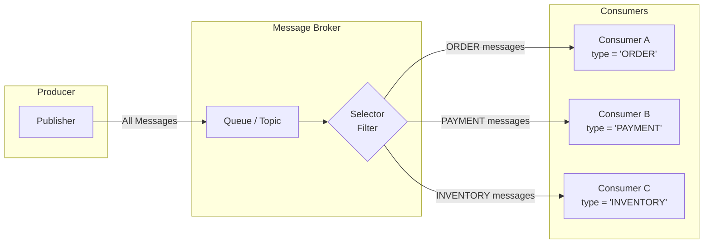
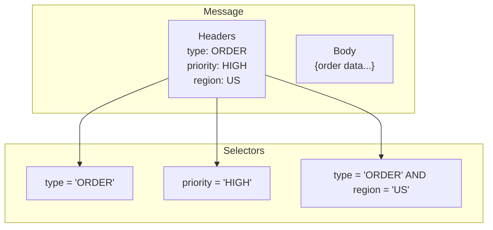
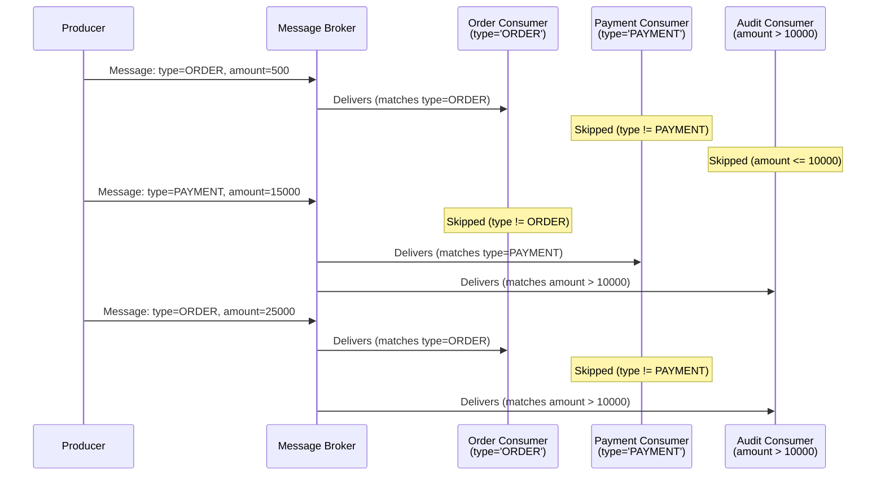

# How to Create a Selective Consumer

Author: [nawazdhandala](https://github.com/nawazdhandala)

Tags: Messaging, Patterns, Filtering, EIP

Description: Build message consumers that process only relevant messages using selectors, header filters, and SQL-like expressions.

---

In message-driven systems, not every consumer needs every message. A payment service does not care about user profile updates. An inventory service ignores password reset events. Broadcasting everything to everyone wastes compute, memory, and bandwidth.

The Selective Consumer pattern solves this by letting consumers declare what they want to receive. Messages that do not match the criteria never reach the consumer's processing logic.

This guide covers how to implement selective consumers using message selectors, header-based filtering, and SQL-like selector expressions across different messaging systems.

---

## What is a Selective Consumer?

A Selective Consumer is a message endpoint that filters incoming messages based on specified criteria before processing. Only messages matching the filter reach the consumer's business logic.



The broker evaluates each message against consumer selectors and routes accordingly. Consumers only see messages they care about.

---

## Why Use Selective Consumers?

| Benefit | Description |
|---------|-------------|
| Reduced Processing Load | Consumers skip irrelevant messages entirely |
| Cleaner Code | No need for if-else filtering in business logic |
| Better Resource Utilization | Less CPU, memory, and network waste |
| Simpler Scaling | Scale consumers independently based on their message volume |
| Separation of Concerns | Each consumer handles its specific domain |

---

## Message Selection Approaches

### 1. Header-Based Filtering

The most common approach. Messages carry metadata in headers, and consumers filter based on header values.



Headers are cheap to inspect. The broker can evaluate selectors without deserializing the message body.

### 2. SQL-Like Selector Expressions

JMS and many modern brokers support SQL-92 subset expressions for message selection:

```sql
-- Simple equality
type = 'ORDER'

-- Numeric comparisons
amount > 1000

-- Compound conditions
type = 'ORDER' AND priority = 'HIGH'

-- IN operator
region IN ('US', 'EU', 'APAC')

-- LIKE pattern matching
eventName LIKE 'user.%'

-- BETWEEN for ranges
timestamp BETWEEN 1706600000 AND 1706700000

-- IS NULL / IS NOT NULL
correlationId IS NOT NULL

-- Boolean logic
(type = 'PAYMENT' OR type = 'REFUND') AND amount > 500
```

### 3. Content-Based Filtering

Some systems filter on message body content. This requires deserializing each message, so it is slower than header filtering.

---

## Implementation Examples

### Java with JMS (ActiveMQ / RabbitMQ JMS)

JMS has built-in selector support. Define the selector when creating the consumer:

```java
import javax.jms.*;

public class SelectiveOrderConsumer {

    public void startConsumer(ConnectionFactory connectionFactory) throws JMSException {
        Connection connection = connectionFactory.createConnection();
        Session session = connection.createSession(false, Session.AUTO_ACKNOWLEDGE);

        // Create destination
        Queue queue = session.createQueue("events");

        // Define selector - only receive ORDER messages with HIGH priority
        String selector = "type = 'ORDER' AND priority = 'HIGH'";

        // Create consumer with selector
        MessageConsumer consumer = session.createConsumer(queue, selector);

        // Set message listener
        consumer.setMessageListener(message -> {
            try {
                if (message instanceof TextMessage) {
                    TextMessage textMessage = (TextMessage) message;
                    processHighPriorityOrder(textMessage.getText());
                }
            } catch (JMSException e) {
                e.printStackTrace();
            }
        });

        connection.start();
    }

    private void processHighPriorityOrder(String orderJson) {
        // Business logic here - guaranteed to be high priority orders only
        System.out.println("Processing high priority order: " + orderJson);
    }
}
```

Producer side - set headers that selectors will match:

```java
public void publishOrder(Session session, Queue queue, Order order) throws JMSException {
    MessageProducer producer = session.createProducer(queue);

    TextMessage message = session.createTextMessage(order.toJson());

    // Set properties that consumers can filter on
    message.setStringProperty("type", "ORDER");
    message.setStringProperty("priority", order.getPriority());
    message.setStringProperty("region", order.getRegion());
    message.setDoubleProperty("amount", order.getAmount());
    message.setLongProperty("timestamp", System.currentTimeMillis());

    producer.send(message);
}
```

### Python with RabbitMQ (Headers Exchange)

RabbitMQ supports header-based routing through the headers exchange type:

```python
import pika
import json

class SelectiveConsumer:
    def __init__(self, host='localhost'):
        self.connection = pika.BlockingConnection(
            pika.ConnectionParameters(host=host)
        )
        self.channel = self.connection.channel()

        # Declare headers exchange
        self.channel.exchange_declare(
            exchange='events',
            exchange_type='headers'
        )

    def start_order_consumer(self):
        """Consume only ORDER type messages"""

        # Declare queue for this consumer
        result = self.channel.queue_declare(queue='order_processor', durable=True)
        queue_name = result.method.queue

        # Bind with header matching
        # x-match: all = ALL headers must match
        # x-match: any = ANY header must match
        self.channel.queue_bind(
            exchange='events',
            queue=queue_name,
            arguments={
                'x-match': 'all',
                'type': 'ORDER',
                'priority': 'HIGH'
            }
        )

        def callback(ch, method, properties, body):
            order = json.loads(body)
            self.process_high_priority_order(order)
            ch.basic_ack(delivery_tag=method.delivery_tag)

        self.channel.basic_consume(
            queue=queue_name,
            on_message_callback=callback
        )

        print("Waiting for high priority orders...")
        self.channel.start_consuming()

    def process_high_priority_order(self, order):
        print(f"Processing order: {order['id']}")


class SelectiveProducer:
    def __init__(self, host='localhost'):
        self.connection = pika.BlockingConnection(
            pika.ConnectionParameters(host=host)
        )
        self.channel = self.connection.channel()
        self.channel.exchange_declare(exchange='events', exchange_type='headers')

    def publish_order(self, order):
        """Publish order with headers for selective routing"""

        headers = {
            'type': 'ORDER',
            'priority': order.get('priority', 'NORMAL'),
            'region': order.get('region', 'US')
        }

        self.channel.basic_publish(
            exchange='events',
            routing_key='',  # Ignored for headers exchange
            body=json.dumps(order),
            properties=pika.BasicProperties(
                headers=headers,
                delivery_mode=2  # Persistent
            )
        )
```

### Node.js with Apache Kafka

Kafka does not have built-in message selectors, but you can implement selective consumption at the application level or use Kafka Streams:

```javascript
const { Kafka } = require('kafkajs');

class SelectiveKafkaConsumer {
    constructor(brokers, groupId) {
        this.kafka = new Kafka({
            clientId: 'selective-consumer',
            brokers: brokers
        });
        this.consumer = this.kafka.consumer({ groupId });
    }

    async start(topic, selector) {
        await this.consumer.connect();
        await this.consumer.subscribe({ topic, fromBeginning: false });

        await this.consumer.run({
            eachMessage: async ({ topic, partition, message }) => {
                // Parse headers
                const headers = this.parseHeaders(message.headers);

                // Apply selector
                if (this.matchesSelector(headers, selector)) {
                    const value = JSON.parse(message.value.toString());
                    await this.processMessage(value, headers);
                }
                // Messages not matching selector are acknowledged but not processed
            }
        });
    }

    parseHeaders(kafkaHeaders) {
        const headers = {};
        for (const [key, value] of Object.entries(kafkaHeaders || {})) {
            headers[key] = value.toString();
        }
        return headers;
    }

    matchesSelector(headers, selector) {
        // Simple selector matching
        // selector: { type: 'ORDER', priority: 'HIGH' }
        for (const [key, value] of Object.entries(selector)) {
            if (headers[key] !== value) {
                return false;
            }
        }
        return true;
    }

    async processMessage(message, headers) {
        console.log('Processing:', message);
    }
}

// Usage
const consumer = new SelectiveKafkaConsumer(
    ['localhost:9092'],
    'order-processor-group'
);

consumer.start('events', {
    type: 'ORDER',
    priority: 'HIGH'
});
```

For production Kafka deployments, consider using separate topics per message type instead of client-side filtering. This moves the selection to the routing layer.

### Go with NATS JetStream

NATS supports subject-based filtering. Structure your subjects hierarchically:

```go
package main

import (
    "encoding/json"
    "fmt"
    "log"

    "github.com/nats-io/nats.go"
)

type Order struct {
    ID       string  `json:"id"`
    Type     string  `json:"type"`
    Priority string  `json:"priority"`
    Amount   float64 `json:"amount"`
}

func main() {
    nc, err := nats.Connect(nats.DefaultURL)
    if err != nil {
        log.Fatal(err)
    }
    defer nc.Close()

    js, err := nc.JetStream()
    if err != nil {
        log.Fatal(err)
    }

    // Create stream with subject hierarchy
    _, err = js.AddStream(&nats.StreamConfig{
        Name:     "ORDERS",
        Subjects: []string{"orders.>"},
    })
    if err != nil {
        log.Printf("Stream may already exist: %v", err)
    }

    // Subscribe to HIGH priority orders only
    // Subject pattern: orders.<type>.<priority>.<region>
    sub, err := js.Subscribe(
        "orders.*.HIGH.*",  // Wildcard for type and region, fixed HIGH priority
        func(msg *nats.Msg) {
            var order Order
            if err := json.Unmarshal(msg.Data, &order); err != nil {
                log.Printf("Failed to unmarshal: %v", err)
                return
            }

            fmt.Printf("Processing high priority order: %s\n", order.ID)
            msg.Ack()
        },
        nats.Durable("high-priority-processor"),
    )
    if err != nil {
        log.Fatal(err)
    }
    defer sub.Unsubscribe()

    // Keep running
    select {}
}

func publishOrder(js nats.JetStreamContext, order Order) error {
    data, err := json.Marshal(order)
    if err != nil {
        return err
    }

    // Subject encodes the filtering attributes
    // orders.<type>.<priority>.<region>
    subject := fmt.Sprintf("orders.%s.%s.US", order.Type, order.Priority)

    _, err = js.Publish(subject, data)
    return err
}
```

---

## Selector Expression Reference

Common SQL-92 subset expressions supported by JMS-compatible brokers:

| Expression | Example | Description |
|------------|---------|-------------|
| `=` | `type = 'ORDER'` | Equality |
| `<>` | `status <> 'CANCELLED'` | Not equal |
| `>`, `<`, `>=`, `<=` | `amount > 1000` | Numeric comparison |
| `AND` | `type = 'ORDER' AND priority = 'HIGH'` | Logical AND |
| `OR` | `type = 'ORDER' OR type = 'REFUND'` | Logical OR |
| `NOT` | `NOT processed = true` | Logical NOT |
| `IN` | `region IN ('US', 'EU')` | Set membership |
| `BETWEEN` | `amount BETWEEN 100 AND 500` | Range check |
| `LIKE` | `name LIKE 'user.%'` | Pattern match |
| `IS NULL` | `correlationId IS NULL` | Null check |
| `IS NOT NULL` | `replyTo IS NOT NULL` | Not null check |

---

## Flow: Multiple Selective Consumers



---

## Best Practices

### 1. Use Headers, Not Body Content

Filter on message headers, not body content. Header inspection is fast. Body parsing is slow and expensive.

```java
// Good - filter on header
String selector = "type = 'ORDER'";

// Avoid - requires body parsing
// This is not supported by most brokers anyway
```

### 2. Keep Selectors Simple

Complex selectors hurt broker performance. If you need intricate filtering logic, consider separate queues or topics.

```sql
-- Good: Simple, indexed
type = 'ORDER' AND region = 'US'

-- Questionable: Multiple ORs and nested logic
(type = 'ORDER' OR type = 'REFUND') AND (region = 'US' OR region = 'EU') AND amount > 100 AND NOT cancelled = true
```

### 3. Design Header Schemas Upfront

Document which headers exist and their possible values. Selectors depend on consistent header naming.

```yaml
# message-headers.yaml
headers:
  type:
    description: Message type
    values: [ORDER, PAYMENT, REFUND, INVENTORY, USER]
  priority:
    description: Processing priority
    values: [LOW, NORMAL, HIGH, CRITICAL]
  region:
    description: Geographic region
    values: [US, EU, APAC, LATAM]
```

### 4. Test Selectors in Isolation

Test your selector expressions before deploying:

```java
// Unit test selector logic
@Test
void testOrderSelector() {
    String selector = "type = 'ORDER' AND priority = 'HIGH'";

    // Mock message with matching headers
    Message matchingMessage = createMockMessage(Map.of(
        "type", "ORDER",
        "priority", "HIGH"
    ));
    assertTrue(evaluateSelector(selector, matchingMessage));

    // Mock message with non-matching headers
    Message nonMatchingMessage = createMockMessage(Map.of(
        "type", "ORDER",
        "priority", "LOW"
    ));
    assertFalse(evaluateSelector(selector, nonMatchingMessage));
}
```

### 5. Monitor Selector Performance

Track how many messages each consumer receives vs. total published. High rejection rates might indicate inefficient topic design.

```yaml
# Prometheus metrics to track
messaging_messages_published_total{topic="events"}
messaging_messages_consumed_total{consumer="order-processor"}
messaging_messages_filtered_total{consumer="order-processor"}
```

---

## When to Use Selective Consumers vs. Separate Queues

| Scenario | Recommendation |
|----------|----------------|
| Few message types, dynamic consumers | Selective consumers |
| Many message types, stable consumers | Separate queues/topics |
| Complex filtering logic | Separate queues + simple consumers |
| Need message replay by type | Separate topics |
| Consumer count changes frequently | Selective consumers |
| High throughput (>100k msg/sec) | Separate topics (less broker overhead) |

---

## Common Pitfalls

**1. Selector typos fail silently**

A misspelled header name means zero matches, not an error:

```sql
-- Typo: 'priorty' instead of 'priority'
priorty = 'HIGH'  -- Matches nothing, no error
```

**2. Case sensitivity varies by broker**

Some brokers are case-sensitive for header names, others are not. Test yours.

**3. Null header values**

If a message lacks a header, comparisons return unknown (not false). Use `IS NOT NULL` guards:

```sql
-- Safe: handles missing priority header
priority IS NOT NULL AND priority = 'HIGH'
```

**4. Selector changes require consumer restart**

Most brokers evaluate selectors at subscription time. Changing a selector requires reconnecting.

---

## Summary

Selective Consumers give you fine-grained control over which messages reach which consumers. Use header-based filtering with SQL-like selectors for clean separation of concerns. Keep selectors simple, design your header schema upfront, and monitor selector effectiveness.

The pattern works well when you have a shared channel with multiple consumer types. For high-throughput systems with stable consumer sets, consider separate topics instead.

Start with selective consumers for flexibility during development. Migrate to dedicated topics if selector overhead becomes measurable in production.

---

## Related Reading

- [Enterprise Integration Patterns: Selective Consumer](https://www.enterpriseintegrationpatterns.com/patterns/messaging/MessageSelector.html)
- [JMS Message Selectors Specification](https://javaee.github.io/jms-spec/)
- [RabbitMQ Headers Exchange](https://www.rabbitmq.com/tutorials/amqp-concepts.html#exchange-headers)
