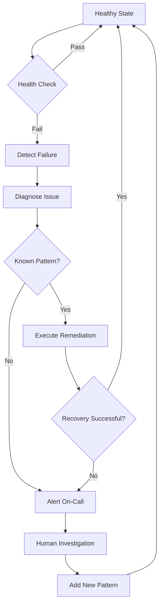
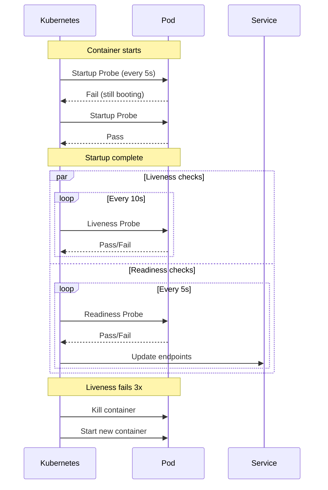
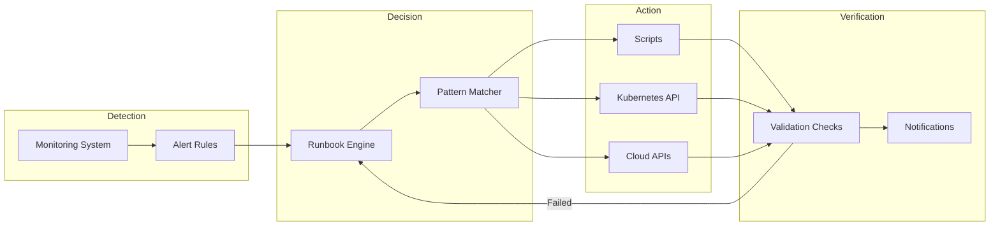
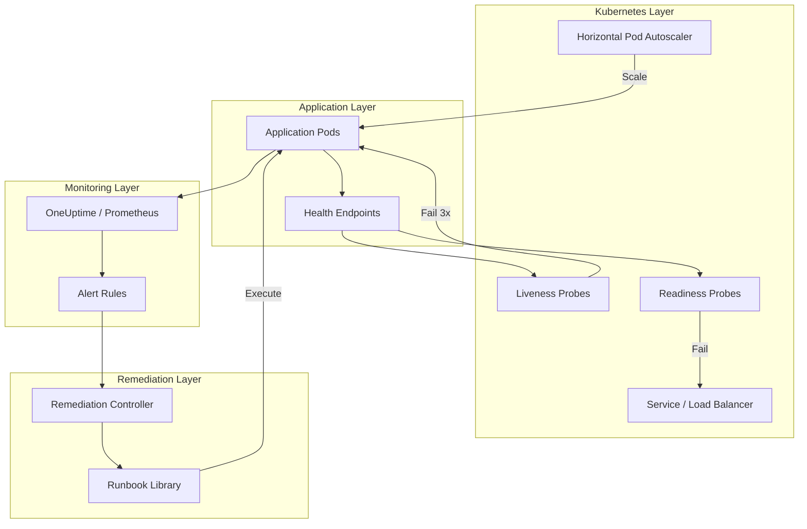

# How to Build Self-Healing Systems

Author: [nawazdhandala](https://github.com/nawazdhandala)

Tags: SRE, Self-Healing, Automation, Reliability

Description: A practical guide to building systems that detect failures and recover automatically without human intervention.

---

At 3 AM, nobody wants to wake up because a container crashed. Self-healing systems detect failures and fix themselves before anyone notices. This post covers the building blocks: health checks, automatic restarts, auto-scaling, and runbook automation.

## What Makes a System Self-Healing?

A self-healing system has four capabilities:

1. **Detection**: Continuously monitors its own health
2. **Diagnosis**: Identifies what went wrong
3. **Recovery**: Takes corrective action automatically
4. **Learning**: Adapts thresholds based on patterns

The goal is simple: reduce mean time to recovery (MTTR) to near zero for known failure modes.



## Health Checks: The Foundation

Your system cannot heal itself if it cannot detect problems. Health checks come in three flavors.

### Application-Level Health Endpoints

Every service should expose endpoints that verify actual functionality, not just "process is running."

```python
# health.py - Flask health check endpoints
from flask import Flask, jsonify
import redis
import psycopg2
from datetime import datetime

app = Flask(__name__)

def check_database():
    """Verify database connectivity and query execution."""
    try:
        conn = psycopg2.connect(
            host="localhost",
            database="app_db",
            user="app_user",
            password="secret"
        )
        cursor = conn.cursor()
        cursor.execute("SELECT 1")
        cursor.close()
        conn.close()
        return True, "connected"
    except Exception as e:
        return False, str(e)

def check_redis():
    """Verify cache connectivity."""
    try:
        r = redis.Redis(host='localhost', port=6379, db=0)
        r.ping()
        return True, "connected"
    except Exception as e:
        return False, str(e)

@app.route('/healthz')
def liveness():
    """Liveness probe: Is the process running and responsive?"""
    return jsonify({
        "status": "ok",
        "timestamp": datetime.utcnow().isoformat()
    }), 200

@app.route('/readyz')
def readiness():
    """Readiness probe: Can this instance serve traffic?"""
    db_ok, db_msg = check_database()
    redis_ok, redis_msg = check_redis()

    checks = {
        "database": {"healthy": db_ok, "message": db_msg},
        "redis": {"healthy": redis_ok, "message": redis_msg}
    }

    all_healthy = db_ok and redis_ok
    status_code = 200 if all_healthy else 503

    return jsonify({
        "status": "ready" if all_healthy else "not_ready",
        "checks": checks,
        "timestamp": datetime.utcnow().isoformat()
    }), status_code
```

### Kubernetes Probes

Configure Kubernetes to use your health endpoints for automated recovery.

`deployment-with-probes.yaml`

```yaml
apiVersion: apps/v1
kind: Deployment
metadata:
  name: api-server
  namespace: production
spec:
  replicas: 3
  selector:
    matchLabels:
      app: api-server
  template:
    metadata:
      labels:
        app: api-server
    spec:
      containers:
        - name: api
          image: myregistry/api-server:v2.1.0
          ports:
            - containerPort: 8080

          # Startup probe: Allow slow initialization
          startupProbe:
            httpGet:
              path: /healthz
              port: 8080
            initialDelaySeconds: 5
            periodSeconds: 5
            failureThreshold: 30    # 30 * 5s = 150s max startup time

          # Liveness probe: Restart if unresponsive
          livenessProbe:
            httpGet:
              path: /healthz
              port: 8080
            initialDelaySeconds: 0   # Start immediately after startup probe passes
            periodSeconds: 10
            timeoutSeconds: 3
            failureThreshold: 3      # Restart after 3 consecutive failures

          # Readiness probe: Remove from load balancer if unhealthy
          readinessProbe:
            httpGet:
              path: /readyz
              port: 8080
            periodSeconds: 5
            failureThreshold: 2      # Stop sending traffic after 2 failures
            successThreshold: 1

          resources:
            requests:
              cpu: 100m
              memory: 256Mi
            limits:
              cpu: 500m
              memory: 512Mi
```

The relationship between these probes creates a layered defense:



## Automatic Restarts and Recovery

Kubernetes restarts containers when liveness probes fail, but you can build smarter recovery patterns.

### Restart Policies and Backoff

Kubernetes uses exponential backoff for crash loops. Understand the defaults.

```yaml
apiVersion: v1
kind: Pod
metadata:
  name: worker
spec:
  restartPolicy: Always      # Options: Always, OnFailure, Never
  containers:
    - name: worker
      image: myregistry/worker:v1.0.0
```

When a container crashes repeatedly, Kubernetes delays restarts: 10s, 20s, 40s, 80s, up to 5 minutes. This prevents thrashing but also delays recovery for transient issues.

### Init Containers for Dependencies

Wait for dependencies before starting your main application.

```yaml
apiVersion: apps/v1
kind: Deployment
metadata:
  name: api-server
spec:
  template:
    spec:
      initContainers:
        # Wait for database to be reachable
        - name: wait-for-db
          image: busybox:1.36
          command: ['sh', '-c',
            'until nc -z postgres-service 5432; do
               echo "Waiting for database...";
               sleep 2;
             done']

        # Run database migrations
        - name: run-migrations
          image: myregistry/api-server:v2.1.0
          command: ['python', 'manage.py', 'migrate']
          env:
            - name: DATABASE_URL
              valueFrom:
                secretKeyRef:
                  name: db-credentials
                  key: url

      containers:
        - name: api
          image: myregistry/api-server:v2.1.0
```

### Self-Healing Script for Non-Kubernetes Environments

For VMs or bare metal, implement your own health monitor.

```bash
#!/bin/bash
# self-heal.sh - Monitor and restart services automatically

SERVICE_NAME="api-server"
HEALTH_URL="http://localhost:8080/healthz"
MAX_FAILURES=3
CHECK_INTERVAL=10
LOG_FILE="/var/log/self-heal.log"

failure_count=0

log() {
    echo "$(date '+%Y-%m-%d %H:%M:%S') - $1" >> "$LOG_FILE"
}

check_health() {
    response=$(curl -s -o /dev/null -w "%{http_code}" --max-time 5 "$HEALTH_URL")
    if [ "$response" = "200" ]; then
        return 0
    else
        return 1
    fi
}

restart_service() {
    log "Restarting $SERVICE_NAME after $failure_count consecutive failures"
    systemctl restart "$SERVICE_NAME"
    sleep 5

    if check_health; then
        log "Service recovered successfully"
        failure_count=0
    else
        log "Service failed to recover, escalating to on-call"
        # Send alert to monitoring system
        curl -X POST "https://oneuptime.com/api/webhooks/incident" \
            -H "Content-Type: application/json" \
            -d "{\"service\": \"$SERVICE_NAME\", \"message\": \"Failed to self-heal\"}"
    fi
}

log "Starting self-healing monitor for $SERVICE_NAME"

while true; do
    if check_health; then
        if [ $failure_count -gt 0 ]; then
            log "Health check passed, resetting failure count"
        fi
        failure_count=0
    else
        failure_count=$((failure_count + 1))
        log "Health check failed (attempt $failure_count/$MAX_FAILURES)"

        if [ $failure_count -ge $MAX_FAILURES ]; then
            restart_service
        fi
    fi

    sleep $CHECK_INTERVAL
done
```

Run this as a systemd service.

```ini
# /etc/systemd/system/self-heal.service
[Unit]
Description=Self-Healing Monitor
After=network.target

[Service]
Type=simple
ExecStart=/opt/scripts/self-heal.sh
Restart=always
RestartSec=10

[Install]
WantedBy=multi-user.target
```

## Auto-Scaling for Load-Based Healing

Sometimes "unhealthy" means "overwhelmed." Auto-scaling handles this by adding capacity.

### Horizontal Pod Autoscaler

Scale based on CPU, memory, or custom metrics.

```yaml
apiVersion: autoscaling/v2
kind: HorizontalPodAutoscaler
metadata:
  name: api-server
  namespace: production
spec:
  scaleTargetRef:
    apiVersion: apps/v1
    kind: Deployment
    name: api-server
  minReplicas: 3
  maxReplicas: 20
  metrics:
    # Scale on CPU utilization
    - type: Resource
      resource:
        name: cpu
        target:
          type: Utilization
          averageUtilization: 70

    # Scale on memory utilization
    - type: Resource
      resource:
        name: memory
        target:
          type: Utilization
          averageUtilization: 80

    # Scale on custom metric: requests per second
    - type: Pods
      pods:
        metric:
          name: http_requests_per_second
        target:
          type: AverageValue
          averageValue: "1000"

  behavior:
    scaleUp:
      stabilizationWindowSeconds: 0    # Scale up immediately
      policies:
        - type: Percent
          value: 100                   # Double capacity if needed
          periodSeconds: 60
    scaleDown:
      stabilizationWindowSeconds: 300  # Wait 5 min before scaling down
      policies:
        - type: Pods
          value: 2                     # Remove max 2 pods at a time
          periodSeconds: 60
```

### KEDA for Event-Driven Scaling

For queue-based workloads, scale on queue depth instead of CPU.

```yaml
apiVersion: keda.sh/v1alpha1
kind: ScaledObject
metadata:
  name: order-processor
  namespace: production
spec:
  scaleTargetRef:
    name: order-processor
  minReplicaCount: 1
  maxReplicaCount: 50
  pollingInterval: 15
  cooldownPeriod: 300
  triggers:
    - type: rabbitmq
      metadata:
        queueName: orders
        host: amqp://rabbitmq.production.svc.cluster.local
        queueLength: "100"    # Scale up when queue exceeds 100 messages
```

## Runbook Automation

The final piece: automatically execute runbooks when specific conditions occur.

### Architecture of Automated Remediation



### Remediation Controller

Build a controller that watches for specific events and executes remediation.

```python
# remediation_controller.py
import time
import json
import subprocess
from kubernetes import client, config, watch
from datetime import datetime
import requests

# Load Kubernetes config
config.load_incluster_config()
v1 = client.CoreV1Api()
apps_v1 = client.AppsV1Api()

# Define remediation rules
REMEDIATION_RULES = {
    "OOMKilled": {
        "action": "increase_memory",
        "params": {"increase_percent": 50},
        "max_attempts": 3
    },
    "CrashLoopBackOff": {
        "action": "rollback_deployment",
        "params": {},
        "max_attempts": 1
    },
    "ImagePullBackOff": {
        "action": "notify_and_wait",
        "params": {"wait_minutes": 5},
        "max_attempts": 2
    }
}

class RemediationController:
    def __init__(self):
        self.attempt_tracker = {}

    def increase_memory(self, namespace, deployment_name, increase_percent):
        """Increase memory limits for a deployment."""
        deployment = apps_v1.read_namespaced_deployment(deployment_name, namespace)

        for container in deployment.spec.template.spec.containers:
            if container.resources and container.resources.limits:
                current = container.resources.limits.get('memory', '256Mi')
                current_value = self.parse_memory(current)
                new_value = int(current_value * (1 + increase_percent / 100))
                container.resources.limits['memory'] = f"{new_value}Mi"
                container.resources.requests['memory'] = f"{int(new_value * 0.8)}Mi"

        apps_v1.patch_namespaced_deployment(
            deployment_name, namespace, deployment
        )
        return True

    def rollback_deployment(self, namespace, deployment_name):
        """Rollback deployment to previous revision."""
        # Get deployment history
        result = subprocess.run([
            "kubectl", "rollout", "undo",
            f"deployment/{deployment_name}",
            "-n", namespace
        ], capture_output=True, text=True)

        return result.returncode == 0

    def notify_and_wait(self, namespace, deployment_name, wait_minutes):
        """Send notification and wait for manual intervention."""
        self.send_notification(
            f"ImagePullBackOff in {namespace}/{deployment_name}. "
            f"Waiting {wait_minutes} minutes for manual fix."
        )
        time.sleep(wait_minutes * 60)
        return True

    def send_notification(self, message):
        """Send notification to monitoring system."""
        requests.post(
            "https://oneuptime.com/api/webhooks/alert",
            json={"message": message, "severity": "warning"},
            headers={"Authorization": "Bearer YOUR_API_KEY"}
        )

    def parse_memory(self, memory_str):
        """Convert memory string to Mi."""
        if memory_str.endswith('Gi'):
            return int(float(memory_str[:-2]) * 1024)
        elif memory_str.endswith('Mi'):
            return int(memory_str[:-2])
        else:
            return 256

    def handle_event(self, event):
        """Process a pod event and trigger remediation if needed."""
        pod = event['object']
        event_type = event['type']

        if event_type != 'MODIFIED':
            return

        # Check container statuses for issues
        if not pod.status.container_statuses:
            return

        for status in pod.status.container_statuses:
            if status.state.waiting:
                reason = status.state.waiting.reason
                if reason in REMEDIATION_RULES:
                    self.remediate(pod, reason)

    def remediate(self, pod, reason):
        """Execute remediation for a specific failure reason."""
        rule = REMEDIATION_RULES[reason]
        key = f"{pod.metadata.namespace}/{pod.metadata.name}/{reason}"

        # Check attempt count
        attempts = self.attempt_tracker.get(key, 0)
        if attempts >= rule['max_attempts']:
            self.send_notification(
                f"Max remediation attempts reached for {key}. "
                "Escalating to on-call."
            )
            return

        self.attempt_tracker[key] = attempts + 1

        # Get deployment name from pod
        deployment_name = self.get_deployment_name(pod)
        if not deployment_name:
            return

        # Execute remediation
        action = rule['action']
        params = rule['params']

        print(f"Executing {action} for {key} (attempt {attempts + 1})")

        if action == 'increase_memory':
            self.increase_memory(
                pod.metadata.namespace,
                deployment_name,
                params['increase_percent']
            )
        elif action == 'rollback_deployment':
            self.rollback_deployment(pod.metadata.namespace, deployment_name)
        elif action == 'notify_and_wait':
            self.notify_and_wait(
                pod.metadata.namespace,
                deployment_name,
                params['wait_minutes']
            )

    def get_deployment_name(self, pod):
        """Extract deployment name from pod owner references."""
        for owner in pod.metadata.owner_references or []:
            if owner.kind == 'ReplicaSet':
                # ReplicaSet name format: deployment-name-hash
                return '-'.join(owner.name.split('-')[:-1])
        return None

    def run(self):
        """Watch pod events and trigger remediations."""
        w = watch.Watch()
        print("Starting remediation controller...")

        for event in w.stream(v1.list_pod_for_all_namespaces):
            try:
                self.handle_event(event)
            except Exception as e:
                print(f"Error handling event: {e}")

if __name__ == '__main__':
    controller = RemediationController()
    controller.run()
```

### Deploy the Remediation Controller

```yaml
apiVersion: apps/v1
kind: Deployment
metadata:
  name: remediation-controller
  namespace: kube-system
spec:
  replicas: 1
  selector:
    matchLabels:
      app: remediation-controller
  template:
    metadata:
      labels:
        app: remediation-controller
    spec:
      serviceAccountName: remediation-controller
      containers:
        - name: controller
          image: myregistry/remediation-controller:v1.0.0
          resources:
            requests:
              cpu: 50m
              memory: 128Mi
            limits:
              cpu: 200m
              memory: 256Mi
---
apiVersion: v1
kind: ServiceAccount
metadata:
  name: remediation-controller
  namespace: kube-system
---
apiVersion: rbac.authorization.k8s.io/v1
kind: ClusterRole
metadata:
  name: remediation-controller
rules:
  - apiGroups: [""]
    resources: ["pods"]
    verbs: ["get", "list", "watch"]
  - apiGroups: ["apps"]
    resources: ["deployments", "replicasets"]
    verbs: ["get", "list", "patch", "update"]
---
apiVersion: rbac.authorization.k8s.io/v1
kind: ClusterRoleBinding
metadata:
  name: remediation-controller
roleRef:
  apiGroup: rbac.authorization.k8s.io
  kind: ClusterRole
  name: remediation-controller
subjects:
  - kind: ServiceAccount
    name: remediation-controller
    namespace: kube-system
```

## Putting It All Together

A complete self-healing architecture combines all these components.



## Best Practices

1. **Start with detection**: You cannot heal what you cannot see. Instrument everything before automating recovery.

2. **Limit blast radius**: Automated remediation should have guardrails. Set maximum attempts, timeouts, and escalation paths.

3. **Test failure scenarios**: Run chaos engineering exercises to verify your self-healing works before production incidents.

4. **Maintain audit logs**: Every automated action should be logged with timestamps, reasons, and outcomes.

5. **Escalate gracefully**: When automation fails, alert humans with context. Include what was tried and why it did not work.

6. **Review and improve**: Track which remediations fire most often. Frequent fixes indicate underlying problems to solve permanently.

## Conclusion

Self-healing systems are not magic. They are the result of deliberate engineering: comprehensive health checks, intelligent restart policies, load-responsive scaling, and automated runbooks. Start with basic probes and gradually add automation as you understand your failure modes.

The goal is not to eliminate incidents entirely. It is to handle the predictable ones automatically so your team can focus on the interesting problems.

**Related Reading:**

- [How to Add Liveness, Readiness, and Startup Probes So Kubernetes Auto-Heals Your Apps](https://oneuptime.com/blog/post/2025-11-27-probes-auto-healing/view)
- [How to Autoscale Deployments with the Horizontal Pod Autoscaler](https://oneuptime.com/blog/post/2025-11-27-hpa-autoscale/view)
- [The Five Stages of SRE Maturity](https://oneuptime.com/blog/post/2025-09-01-the-five-stages-of-sre-maturity/view)
