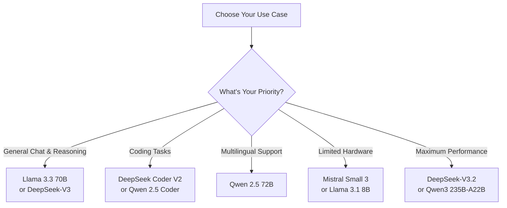
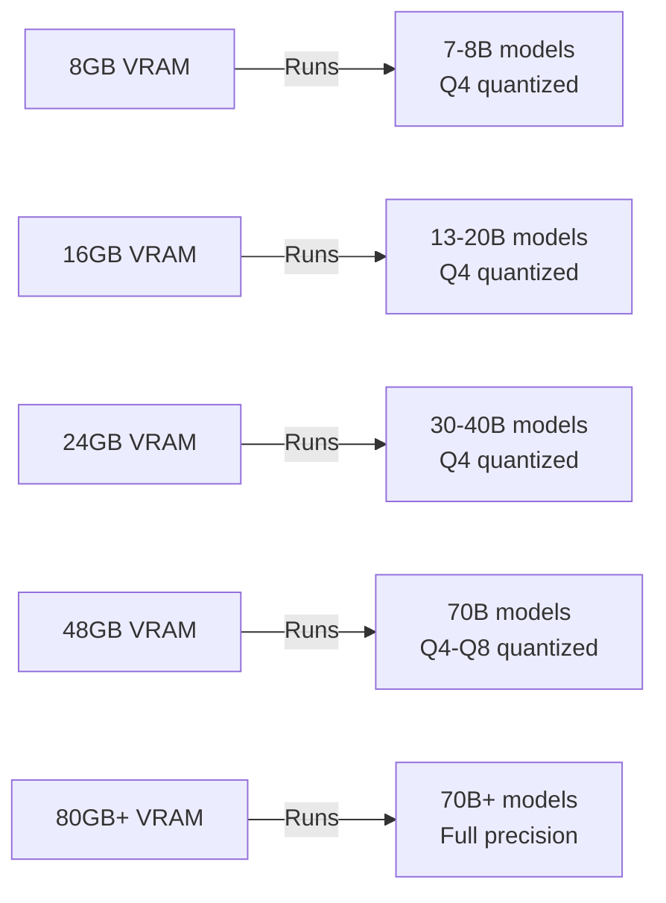
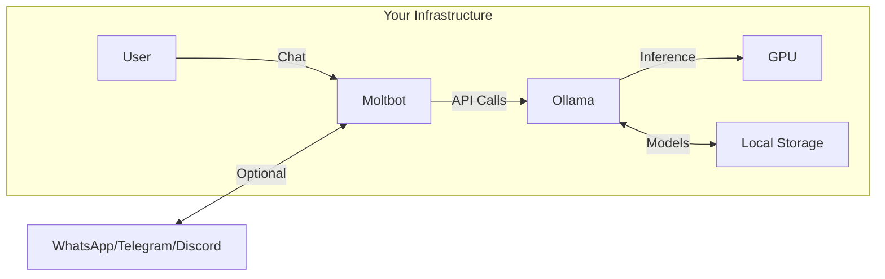

# Running Out of Claude Credits? How to Use Self-Hosted LLMs with Moltbot

Author: [nawazdhandala](https://www.github.com/nawazdhandala)

Tags: LLM, AI, Self-Hosting, Ollama, Moltbot, Machine Learning, Open Source, GPU

Description: A practical guide to running self-hosted open-source LLMs with Moltbot when you need an alternative to Claude or other API-based AI assistants. Covers model selection, hardware requirements, and step-by-step configuration.

---

If you've been using Claude, ChatGPT, or other API-based AI assistants, you've likely hit credit limits at the worst possible moment. Whether you're on a tight budget, need to process sensitive data that can't leave your infrastructure, or simply want predictable costs, self-hosting an LLM is now a viable option. In this guide, we'll walk through how to set up a self-hosted LLM and connect it to Moltbot, giving you a powerful AI assistant that runs entirely on your own hardware.

## Why Self-Host Your LLM?

Before diving into the setup, here's why self-hosting makes sense:

- **No Credit Limits**: Run as many queries as your hardware can handle
- **Predictable Costs**: One-time hardware investment vs. ongoing API fees
- **Data Privacy**: Your data never leaves your infrastructure
- **No Rate Limits**: No throttling during peak usage
- **Offline Access**: Works without internet connectivity
- **Customization**: Fine-tune models for your specific use case

## Choosing the Right Open-Source LLM

The open-source LLM landscape has matured significantly. Here are the top models to consider in 2026:



### Model Comparison

| Model | Parameters | VRAM Required | Best For | License |
|-------|-----------|---------------|----------|---------|
| **Llama 3.3 70B** | 70B | 40-48GB | General tasks, clean prose | Llama License |
| **DeepSeek-V3.2** | 685B (37B active) | 80GB+ | Reasoning, agentic workloads | MIT |
| **Qwen 2.5 72B** | 72.7B | 40-48GB | Multilingual, JSON formatting | Qwen License |
| **Mistral Small 3** | 24B | 16-24GB | Speed, efficiency | Apache 2.0 |
| **Llama 3.1 8B** | 8B | 6-8GB | Entry-level, limited hardware | Llama License |
| **DeepSeek Coder V2** | 236B (21B active) | 48GB+ | Code generation | MIT |

### My Recommendations

**For most users with a gaming GPU (8-16GB VRAM):**
- **Llama 3.1 8B** or **Mistral Small 3** with Q4_K_M quantization
- These run smoothly at 40+ tokens/second

**For users with prosumer hardware (24GB VRAM):**
- **Qwen 2.5 32B** or **Llama 3.3 70B** (quantized)
- Excellent balance of quality and speed

**For enterprise/serious users (80GB+ VRAM):**
- **DeepSeek-V3.2** or **Qwen 2.5 72B** at full precision
- Near-frontier model performance

## Hardware Requirements

### GPU VRAM Guide

The most critical factor for running LLMs is GPU VRAM. Here's what you need:



### Recommended Hardware by Budget

**Budget (~$300-500):**
- Used NVIDIA RTX 3060 12GB or RTX 3080 10GB
- Runs 7-13B parameter models comfortably
- Good for personal use and experimentation

**Mid-Range (~$800-1,500):**
- NVIDIA RTX 4070 Ti Super 16GB or RTX 4090 24GB
- AMD RX 7900 XTX 24GB (excellent value)
- Runs 20-40B parameter models with quantization

**Professional (~$2,000-5,000):**
- NVIDIA RTX A6000 48GB (used prices have dropped)
- Dual RTX 3090 24GB setup
- Runs 70B models comfortably

**Enterprise ($10,000+):**
- NVIDIA H100 80GB or A100 80GB
- Runs full-precision frontier models
- Suitable for serving multiple users

### System RAM Requirements

Your system RAM should be at least 2x your model size for smooth operation:

| Model Size | Minimum RAM | Recommended RAM |
|-----------|------------|-----------------|
| 7-8B | 16GB | 32GB |
| 13-20B | 32GB | 64GB |
| 30-40B | 64GB | 128GB |
| 70B+ | 128GB | 256GB |

### CPU Considerations

While GPU does the heavy lifting, a decent CPU helps with tokenization and data preprocessing:
- Minimum: 8 cores (Intel i7/AMD Ryzen 7)
- Recommended: 12+ cores for larger models
- Apple Silicon: M2 Pro/Max or M3 Pro/Max work excellently with unified memory

## Setting Up Ollama

Ollama is the easiest way to run LLMs locally. It handles model downloading, quantization, and provides an OpenAI-compatible API.

### Installation

**macOS:**

The following command installs Ollama using Homebrew:

```bash
brew install ollama
```

**Linux:**

This curl command downloads and runs the Ollama installer script:

```bash
curl -fsSL https://ollama.com/install.sh | sh
```

**Windows:**

Download the installer from [ollama.com](https://ollama.com) and run it.

### Starting the Ollama Service

After installation, start the Ollama service:

The following command starts Ollama in serve mode, which runs the API server:

```bash
ollama serve
```

For systems with systemd, Ollama typically starts automatically. You can check the status with:

```bash
systemctl status ollama
```

### Downloading Your First Model

Let's download Llama 3.1 8B, a great starting point:

This command pulls the Llama 3.1 8B model from the Ollama registry:

```bash
ollama pull llama3.1:8b
```

For coding tasks, try DeepSeek Coder:

```bash
ollama pull deepseek-coder-v2:16b
```

For a more powerful general model (requires 24GB+ VRAM):

```bash
ollama pull qwen2.5:32b
```

### Testing Your Model

Verify everything works by running a quick test:

This command starts an interactive chat session with your model:

```bash
ollama run llama3.1:8b "What is the capital of France?"
```

### Configuring for Remote Access

By default, Ollama only listens on localhost. To allow connections from other machines (like where Moltbot runs), set the host environment variable.

Create or edit the Ollama service configuration:

This command creates a systemd override file to configure Ollama's listening address:

```bash
sudo mkdir -p /etc/systemd/system/ollama.service.d
sudo tee /etc/systemd/system/ollama.service.d/override.conf << 'EOF'
[Service]
Environment="OLLAMA_HOST=0.0.0.0:11434"
EOF

sudo systemctl daemon-reload
sudo systemctl restart ollama
```

## Connecting Moltbot to Your Self-Hosted LLM

Moltbot is an open-source AI assistant that integrates with various messaging platforms. It supports Ollama out of the box, making it perfect for self-hosted setups.

### Installing Moltbot

**Using Docker (Recommended):**

This Docker Compose file sets up Moltbot with all necessary configurations:

```yaml
# docker-compose.yml
version: '3.8'
services:
  moltbot:
    image: moltbot/moltbot:latest
    ports:
      - "3000:3000"
    environment:
      # Point to your Ollama instance
      - OLLAMA_API_URL=http://host.docker.internal:11434
      - OLLAMA_API_KEY=ollama-local
      # Default model to use
      - DEFAULT_MODEL=llama3.1:8b
    volumes:
      - moltbot_data:/app/data
    restart: unless-stopped

volumes:
  moltbot_data:
```

Start Moltbot with:

```bash
docker-compose up -d
```

### Configuring the Ollama Provider

If Ollama runs on the same machine as Moltbot, it's typically auto-discovered. For remote Ollama instances, configure it explicitly.

**Via Environment Variables:**

These environment variables configure Moltbot to connect to a remote Ollama server:

```bash
export OLLAMA_API_KEY="ollama-local"
export OLLAMA_BASE_URL="http://your-ollama-host:11434/v1"
```

**Via Configuration File:**

Create or edit the Moltbot configuration file:

```yaml
# ~/.moltbot/config.yml
models:
  providers:
    ollama:
      apiKey: "ollama-local"
      baseUrl: "http://your-ollama-host:11434/v1"
      models:
        - name: "llama3.1:8b"
          contextWindow: 128000
        - name: "qwen2.5:32b"
          contextWindow: 32768
```

### Selecting Your Model in Moltbot

Once configured, you can select your self-hosted model in Moltbot's interface or via command:

This command sets the default model for Moltbot conversations:

```bash
moltbot config set model llama3.1:8b
```

### Architecture Overview

Here's how the components connect:



## Performance Optimization Tips

Running LLMs in production requires monitoring to ensure they're performing well. If you're self-hosting at scale, consider setting up observability for your inference servers—tools like [OneUptime](https://oneuptime.com/product/metrics) can track GPU utilization, inference latency, and alert you when models are underperforming or containers crash.

### 1. Use Appropriate Quantization

Ollama uses Q4_K_M by default, which offers a good balance. For better quality with more VRAM:

This command pulls a model with higher precision quantization:

```bash
# Higher quality, uses more VRAM
ollama pull llama3.1:8b-instruct-q8_0

# Lower quality, uses less VRAM
ollama pull llama3.1:8b-instruct-q4_0
```

### 2. Adjust Context Window

Longer contexts use more VRAM. If you hit memory limits, reduce the context:

This creates a custom model with a smaller context window:

```bash
# Create a Modelfile
cat << 'EOF' > Modelfile
FROM llama3.1:8b
PARAMETER num_ctx 4096
EOF

# Create the custom model
ollama create llama3.1-short -f Modelfile
```

### 3. Enable GPU Layers

Ensure Ollama uses your GPU. Check with:

```bash
ollama ps
```

You should see GPU memory being used. If not, verify your NVIDIA drivers:

```bash
nvidia-smi
```

### 4. Monitor Performance

Track your model's performance with these commands:

This command shows real-time GPU utilization:

```bash
# Watch GPU utilization
watch -n 1 nvidia-smi

# Check Ollama logs
journalctl -u ollama -f
```

## Cost Comparison

Let's compare the costs of API-based vs. self-hosted LLMs:

| Scenario | API Cost (Monthly) | Self-Hosted Cost |
|----------|-------------------|------------------|
| Light use (100K tokens/day) | $60-150 | $0 (after hardware) |
| Medium use (1M tokens/day) | $600-1,500 | $0 (after hardware) |
| Heavy use (10M tokens/day) | $6,000-15,000 | $0 (after hardware) |

**Break-even analysis:**
- RTX 4090 ($1,600) pays for itself in 1-3 months of medium use
- RTX 3060 12GB ($300 used) pays for itself in weeks

## Troubleshooting Common Issues

### Model Loading Fails

**Symptom:** "Error: model requires more memory than available"

**Solution:** Use a smaller model or more aggressive quantization:

```bash
ollama pull llama3.1:8b-q4_0
```

### Slow Generation Speed

**Symptom:** Tokens generate at < 10 tokens/second

**Solutions:**
1. Reduce context window
2. Close other GPU applications
3. Use a smaller model
4. Check GPU utilization with `nvidia-smi`

### Moltbot Can't Connect to Ollama

**Symptom:** "Connection refused" errors

**Checklist:**

```bash
# 1. Check if Ollama is running
curl http://localhost:11434/api/tags

# 2. Check firewall (if remote)
sudo ufw allow 11434

# 3. Verify Ollama is listening on all interfaces
ss -tlnp | grep 11434
```

### Out of Memory Errors

**Symptom:** System becomes unresponsive during inference

**Solutions:**
1. Add swap space (temporary fix)
2. Use smaller model
3. Reduce batch size in Ollama settings
4. Upgrade RAM

## Conclusion

Self-hosting LLMs has never been more accessible. With tools like Ollama and Moltbot, you can have a powerful AI assistant running on your own hardware in under an hour. While you won't get the absolute cutting-edge capabilities of Claude or GPT-4, modern open-source models like Llama 3.3 and DeepSeek-V3 come remarkably close for most tasks.

The key benefits are clear:
- **No more credit anxiety** - run unlimited queries
- **Complete data privacy** - nothing leaves your machine
- **Predictable costs** - pay once for hardware, run forever

Start with a modest setup like Llama 3.1 8B on a gaming GPU, and scale up as your needs grow. The open-source AI ecosystem is improving rapidly, and self-hosting is only going to get better.

## Further Reading

- [Running Self-Hosted LLMs on Kubernetes](https://oneuptime.com/blog/post/2026-01-29-self-hosted-llms-on-kubernetes/view) - Scale your LLM deployment with Kubernetes
- [Ollama Documentation](https://docs.ollama.com)
- [Moltbot Ollama Provider Docs](https://docs.molt.bot/providers/ollama)
- [Hugging Face Open LLM Leaderboard](https://huggingface.co/spaces/open-llm-leaderboard/open_llm_leaderboard)
