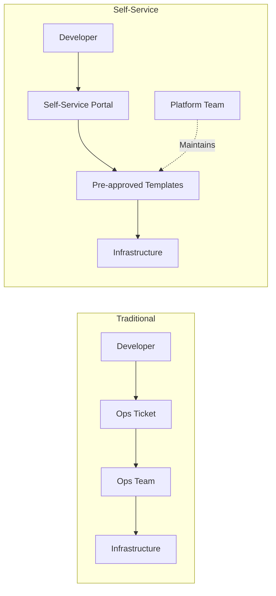
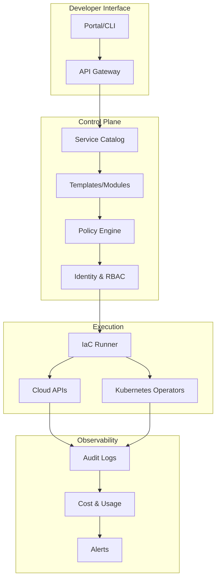
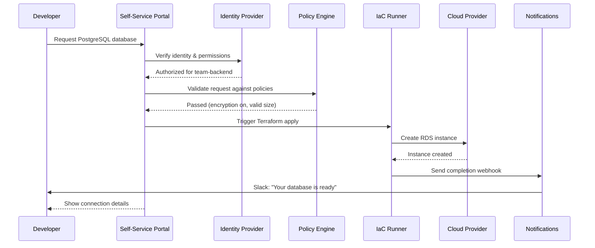
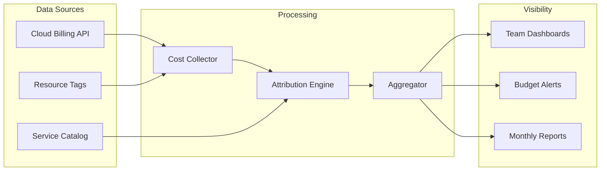
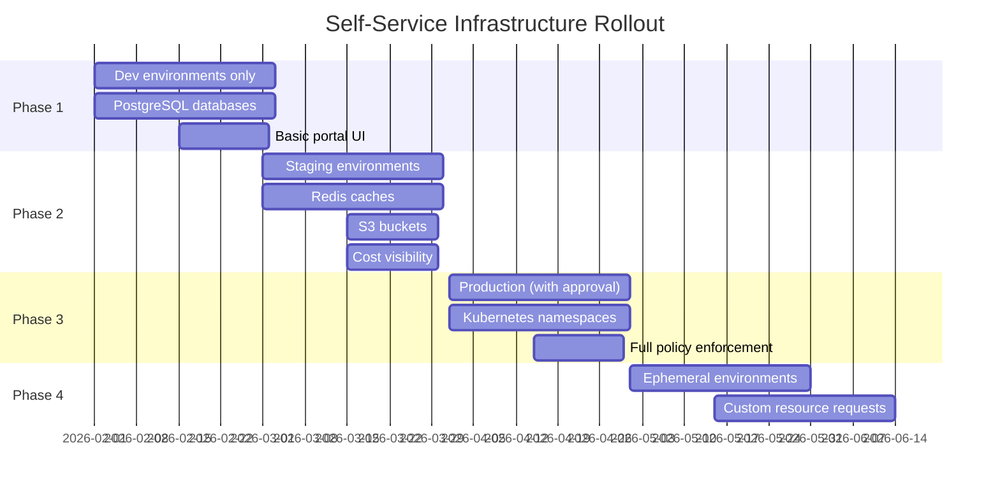

# How to Implement Self-Service Infrastructure

Author: [nawazdhandala](https://github.com/nawazdhandala)

Tags: Platform Engineering, DevOps, Infrastructure, IDP

Description: A practical guide to building self-service infrastructure that empowers developers to provision resources safely without waiting for ops tickets.

---

Every minute a developer waits for infrastructure is a minute they are not shipping features. Self-service infrastructure flips the traditional model: instead of filing tickets and waiting for ops, developers provision what they need through guardrailed interfaces. The platform team shifts from being gatekeepers to being enablers.

## What Is Self-Service Infrastructure?

Self-service infrastructure lets developers create, configure, and manage cloud resources without direct intervention from operations or platform teams. The key word is "guardrailed." Developers get freedom within boundaries that ensure security, cost control, and compliance.



## Why Self-Service Matters

| Problem | Impact | Self-Service Solution |
| --- | --- | --- |
| Ticket queues for infrastructure | Days or weeks to get a database | Provision in minutes via portal |
| Inconsistent configurations | Security gaps, debugging nightmares | Standardized templates with best practices baked in |
| Shadow IT | Teams spin up untracked resources | Sanctioned paths that are easier than workarounds |
| Ops bottleneck | Platform team becomes the blocker | Ops focuses on platform, not provisioning |
| Slow feedback loops | Developers cannot test infrastructure changes | Ephemeral environments on demand |

## Core Components of Self-Service Infrastructure

A mature self-service platform typically includes these building blocks:



## Building the Service Catalog

The service catalog is your curated menu of infrastructure offerings. Each entry should be:

- **Opinionated**: Sensible defaults that work for 80% of use cases
- **Parameterized**: Knobs for the 20% who need customization
- **Versioned**: Updates do not break existing deployments
- **Documented**: Clear descriptions, examples, and constraints

### Example Catalog Entry

Here is a Terraform module that creates a PostgreSQL database with sensible defaults. The module encapsulates security group rules, backup configuration, and monitoring setup.

```hcl
# modules/postgres/main.tf
# PostgreSQL module with security and backup defaults

variable "name" {
  description = "Database identifier"
  type        = string
}

variable "environment" {
  description = "Environment (dev, staging, prod)"
  type        = string
  validation {
    condition     = contains(["dev", "staging", "prod"], var.environment)
    error_message = "Environment must be dev, staging, or prod."
  }
}

variable "size" {
  description = "Instance size (small, medium, large)"
  type        = string
  default     = "small"
}

locals {
  # Map friendly sizes to instance types
  instance_map = {
    small  = "db.t3.micro"
    medium = "db.t3.small"
    large  = "db.t3.medium"
  }

  # Production gets stricter defaults
  backup_retention = var.environment == "prod" ? 30 : 7
  multi_az         = var.environment == "prod" ? true : false
}

resource "aws_db_instance" "this" {
  identifier     = "${var.name}-${var.environment}"
  engine         = "postgres"
  engine_version = "15.4"
  instance_class = local.instance_map[var.size]

  allocated_storage     = 20
  max_allocated_storage = 100

  # Security defaults
  storage_encrypted   = true
  deletion_protection = var.environment == "prod"

  # Backup configuration
  backup_retention_period = local.backup_retention
  backup_window           = "03:00-04:00"

  # High availability for production
  multi_az = local.multi_az

  # Networking
  db_subnet_group_name   = var.subnet_group
  vpc_security_group_ids = [aws_security_group.db.id]

  tags = {
    Environment = var.environment
    ManagedBy   = "self-service-platform"
    Owner       = var.requesting_team
  }
}

# Output connection details (password handled separately via secrets manager)
output "endpoint" {
  value = aws_db_instance.this.endpoint
}

output "port" {
  value = aws_db_instance.this.port
}
```

## Implementing Policy Guardrails

Guardrails prevent misconfigurations before they reach production. Open Policy Agent (OPA) is a popular choice for policy enforcement.

### OPA Policy Examples

This policy ensures all databases have encryption enabled. The policy runs before Terraform apply and blocks non-compliant resources.

```rego
# policies/database_encryption.rego
# Enforce encryption on all database instances

package terraform.database

# Deny unencrypted databases
deny[msg] {
    resource := input.resource_changes[_]
    resource.type == "aws_db_instance"
    resource.change.after.storage_encrypted != true

    msg := sprintf(
        "Database '%s' must have encryption enabled",
        [resource.address]
    )
}
```

This policy enforces tagging standards. Every resource must have an owner and environment tag.

```rego
# policies/required_tags.rego
# Ensure all resources have required tags

package terraform.tagging

required_tags := ["Owner", "Environment", "ManagedBy"]

deny[msg] {
    resource := input.resource_changes[_]
    resource.change.actions[_] == "create"

    tags := object.get(resource.change.after, "tags", {})
    missing := [tag | tag := required_tags[_]; not tags[tag]]
    count(missing) > 0

    msg := sprintf(
        "Resource '%s' is missing required tags: %v",
        [resource.address, missing]
    )
}
```

### Cost Guardrails

This policy prevents developers from accidentally provisioning expensive instances in non-production environments.

```rego
# policies/cost_limits.rego
# Prevent expensive instances in dev/staging

package terraform.cost

expensive_instances := [
    "db.r5.large", "db.r5.xlarge",
    "m5.xlarge", "m5.2xlarge",
    "c5.xlarge", "c5.2xlarge"
]

deny[msg] {
    resource := input.resource_changes[_]
    resource.type == "aws_db_instance"

    instance_class := resource.change.after.instance_class
    instance_class == expensive_instances[_]

    tags := resource.change.after.tags
    tags.Environment != "prod"

    msg := sprintf(
        "Instance class '%s' is only allowed in production. Resource: %s",
        [instance_class, resource.address]
    )
}
```

## Building the Developer Portal

The portal is where developers interact with your platform. It should feel as simple as ordering from a menu.

### Portal Architecture



### Example Portal Backend

This FastAPI endpoint handles database provisioning requests. It validates the request, checks policies, and triggers the IaC runner.

```python
# portal/api/databases.py
# API endpoint for self-service database provisioning

from fastapi import APIRouter, Depends, HTTPException
from pydantic import BaseModel, validator
from typing import Literal

router = APIRouter(prefix="/api/v1/databases", tags=["databases"])


class DatabaseRequest(BaseModel):
    """Request schema for database provisioning."""
    name: str
    environment: Literal["dev", "staging", "prod"]
    size: Literal["small", "medium", "large"] = "small"
    team: str

    @validator("name")
    def validate_name(cls, v):
        # Enforce naming conventions
        if not v.replace("-", "").isalnum():
            raise ValueError("Name must be alphanumeric with hyphens only")
        if len(v) > 32:
            raise ValueError("Name must be 32 characters or less")
        return v.lower()


class DatabaseResponse(BaseModel):
    """Response schema with provisioning details."""
    id: str
    status: str
    endpoint: str | None = None
    estimated_time_minutes: int


@router.post("/postgres", response_model=DatabaseResponse)
async def create_postgres_database(
    request: DatabaseRequest,
    current_user: User = Depends(get_current_user),
    policy_engine: PolicyEngine = Depends(get_policy_engine),
    iac_runner: IaCRunner = Depends(get_iac_runner),
):
    """
    Provision a new PostgreSQL database.

    The database will be created with encryption enabled, automated backups,
    and appropriate security groups for the specified environment.
    """
    # Check if user can provision in this environment
    if not current_user.can_provision(request.environment, request.team):
        raise HTTPException(
            status_code=403,
            detail=f"You don't have permission to provision in {request.environment}"
        )

    # Production requires additional approval
    if request.environment == "prod" and request.size == "large":
        return await create_approval_request(request, current_user)

    # Build Terraform variables
    tf_vars = {
        "name": request.name,
        "environment": request.environment,
        "size": request.size,
        "requesting_team": request.team,
        "requested_by": current_user.email,
    }

    # Validate against policies
    policy_result = await policy_engine.evaluate(
        module="postgres",
        variables=tf_vars
    )

    if not policy_result.passed:
        raise HTTPException(
            status_code=400,
            detail=f"Policy violation: {policy_result.message}"
        )

    # Trigger async provisioning
    job = await iac_runner.apply(
        module="postgres",
        variables=tf_vars,
        callback_url=f"/api/v1/databases/{request.name}/callback"
    )

    return DatabaseResponse(
        id=job.id,
        status="provisioning",
        estimated_time_minutes=5 if request.environment == "dev" else 15
    )
```

## GitOps Integration

For teams already using GitOps, self-service can work through pull requests. Developers fill out a form, and the portal creates a PR with the infrastructure definition.

### Crossplane for Kubernetes-Native Self-Service

Crossplane lets you define cloud resources as Kubernetes custom resources. Developers familiar with kubectl can provision infrastructure without learning Terraform.

This Crossplane CompositeResourceDefinition (XRD) defines a custom "Database" resource that developers can request.

```yaml
# crossplane/database-xrd.yaml
# Define a custom Database resource for self-service

apiVersion: apiextensions.crossplane.io/v1
kind: CompositeResourceDefinition
metadata:
  name: databases.platform.example.com
spec:
  group: platform.example.com
  names:
    kind: Database
    plural: databases
  claimNames:
    kind: DatabaseClaim
    plural: databaseclaims
  versions:
    - name: v1
      served: true
      referenceable: true
      schema:
        openAPIV3Schema:
          type: object
          properties:
            spec:
              type: object
              required:
                - environment
                - size
              properties:
                environment:
                  type: string
                  enum: [dev, staging, prod]
                  description: Target environment
                size:
                  type: string
                  enum: [small, medium, large]
                  default: small
                  description: Database instance size
            status:
              type: object
              properties:
                endpoint:
                  type: string
                port:
                  type: integer
                status:
                  type: string
```

This Composition defines how a DatabaseClaim maps to actual cloud resources.

```yaml
# crossplane/database-composition.yaml
# Map Database claims to AWS RDS instances

apiVersion: apiextensions.crossplane.io/v1
kind: Composition
metadata:
  name: database-aws
  labels:
    provider: aws
spec:
  compositeTypeRef:
    apiVersion: platform.example.com/v1
    kind: Database
  resources:
    - name: rds-instance
      base:
        apiVersion: rds.aws.crossplane.io/v1beta1
        kind: Instance
        spec:
          forProvider:
            engine: postgres
            engineVersion: "15"
            storageEncrypted: true
            publiclyAccessible: false
            autoMinorVersionUpgrade: true
            backupRetentionPeriod: 7
          providerConfigRef:
            name: aws-provider
      patches:
        # Map size to instance class
        - type: FromCompositeFieldPath
          fromFieldPath: spec.size
          toFieldPath: spec.forProvider.instanceClass
          transforms:
            - type: map
              map:
                small: db.t3.micro
                medium: db.t3.small
                large: db.t3.medium

        # Production gets longer backup retention
        - type: FromCompositeFieldPath
          fromFieldPath: spec.environment
          toFieldPath: spec.forProvider.backupRetentionPeriod
          transforms:
            - type: map
              map:
                dev: 7
                staging: 14
                prod: 30
```

Now developers can request a database with a simple YAML file.

```yaml
# teams/backend/database.yaml
# Developer request for a PostgreSQL database

apiVersion: platform.example.com/v1
kind: DatabaseClaim
metadata:
  name: orders-db
  namespace: backend-team
spec:
  environment: staging
  size: medium
```

## Handling Secrets and Credentials

Self-service must handle secrets safely. Never expose credentials in logs, outputs, or version control.

### External Secrets Operator Integration

This configuration automatically creates a Kubernetes secret with database credentials from AWS Secrets Manager.

```yaml
# secrets/database-credentials.yaml
# Automatically sync database password from Secrets Manager

apiVersion: external-secrets.io/v1beta1
kind: ExternalSecret
metadata:
  name: orders-db-credentials
  namespace: backend-team
spec:
  refreshInterval: 1h
  secretStoreRef:
    kind: ClusterSecretStore
    name: aws-secrets-manager

  target:
    name: orders-db-credentials
    creationPolicy: Owner

  data:
    - secretKey: password
      remoteRef:
        key: /databases/orders-db/credentials
        property: password

    - secretKey: username
      remoteRef:
        key: /databases/orders-db/credentials
        property: username
```

## Cost Visibility and Showback

Self-service without cost visibility leads to runaway spending. Build cost awareness into the platform.

### Cost Dashboard Architecture



### Budget Alerts

This script checks team spending against budgets and sends alerts when thresholds are crossed.

```python
# cost/budget_alerts.py
# Alert teams when they approach budget limits

from dataclasses import dataclass
from decimal import Decimal


@dataclass
class Budget:
    team: str
    monthly_limit: Decimal
    current_spend: Decimal
    alert_thresholds: list[int] = None

    def __post_init__(self):
        if self.alert_thresholds is None:
            self.alert_thresholds = [50, 75, 90, 100]

    @property
    def percentage_used(self) -> int:
        if self.monthly_limit == 0:
            return 0
        return int((self.current_spend / self.monthly_limit) * 100)

    def get_triggered_alerts(self, previously_alerted: list[int]) -> list[int]:
        """Return thresholds that should trigger alerts."""
        return [
            threshold for threshold in self.alert_thresholds
            if self.percentage_used >= threshold
            and threshold not in previously_alerted
        ]


async def check_budgets_and_alert(
    cost_api: CostAPI,
    notification_service: NotificationService,
    budget_store: BudgetStore,
):
    """
    Check all team budgets and send alerts for threshold breaches.
    Runs daily via scheduled job.
    """
    teams = await cost_api.get_all_teams()

    for team in teams:
        budget = await budget_store.get_budget(team.id)
        current_spend = await cost_api.get_month_to_date_spend(team.id)

        budget_status = Budget(
            team=team.name,
            monthly_limit=budget.limit,
            current_spend=current_spend,
        )

        previously_alerted = await budget_store.get_alerted_thresholds(
            team.id,
            month=current_month()
        )

        new_alerts = budget_status.get_triggered_alerts(previously_alerted)

        for threshold in new_alerts:
            await notification_service.send_budget_alert(
                team=team,
                threshold=threshold,
                current_spend=current_spend,
                limit=budget.limit,
            )
            await budget_store.record_alert(team.id, threshold, current_month())
```

## Rollout Strategy

Do not try to build everything at once. Start with the highest-pain, lowest-risk services.

### Phased Rollout



### Success Metrics

Track these metrics to measure the impact of self-service:

| Metric | Before | Target | How to Measure |
| --- | --- | --- | --- |
| Time to provision database | 3-5 days | < 15 minutes | Track from request to ready |
| Ops tickets for infrastructure | 50/week | < 10/week | Ticket system tags |
| Shadow IT resources | Unknown | Near zero | Cloud resource audits |
| Developer satisfaction | Survey baseline | +30% | Quarterly surveys |
| Cost attribution coverage | 40% | > 95% | Tagged vs untagged spend |

## Common Pitfalls and How to Avoid Them

**Pitfall 1: Building too much customization**
Start opinionated. Add knobs only when teams demonstrate real needs.

**Pitfall 2: Skipping policy enforcement**
Guardrails are not optional. Without them, self-service becomes self-harm.

**Pitfall 3: Forgetting about day-2 operations**
Provisioning is step one. Include visibility into upgrades, backups, and decommissioning.

**Pitfall 4: No escape hatch**
Some requests will not fit templates. Have a clear path for exceptions that involves human review.

**Pitfall 5: Poor documentation**
If developers cannot figure out how to use it, they will file tickets anyway. Invest in docs and examples.

## Summary

Self-service infrastructure is not about removing humans from the loop. It is about putting humans in the right part of the loop. Platform teams design guardrails and golden paths. Developers move fast within those boundaries. Everyone wins.

Start small:
1. Pick one high-pain service (usually databases)
2. Build an opinionated template with sensible defaults
3. Add policy guardrails before opening access
4. Measure time-to-provision and iterate

The goal is not to automate ops out of a job. The goal is to let ops focus on building leverage instead of processing tickets.

---
