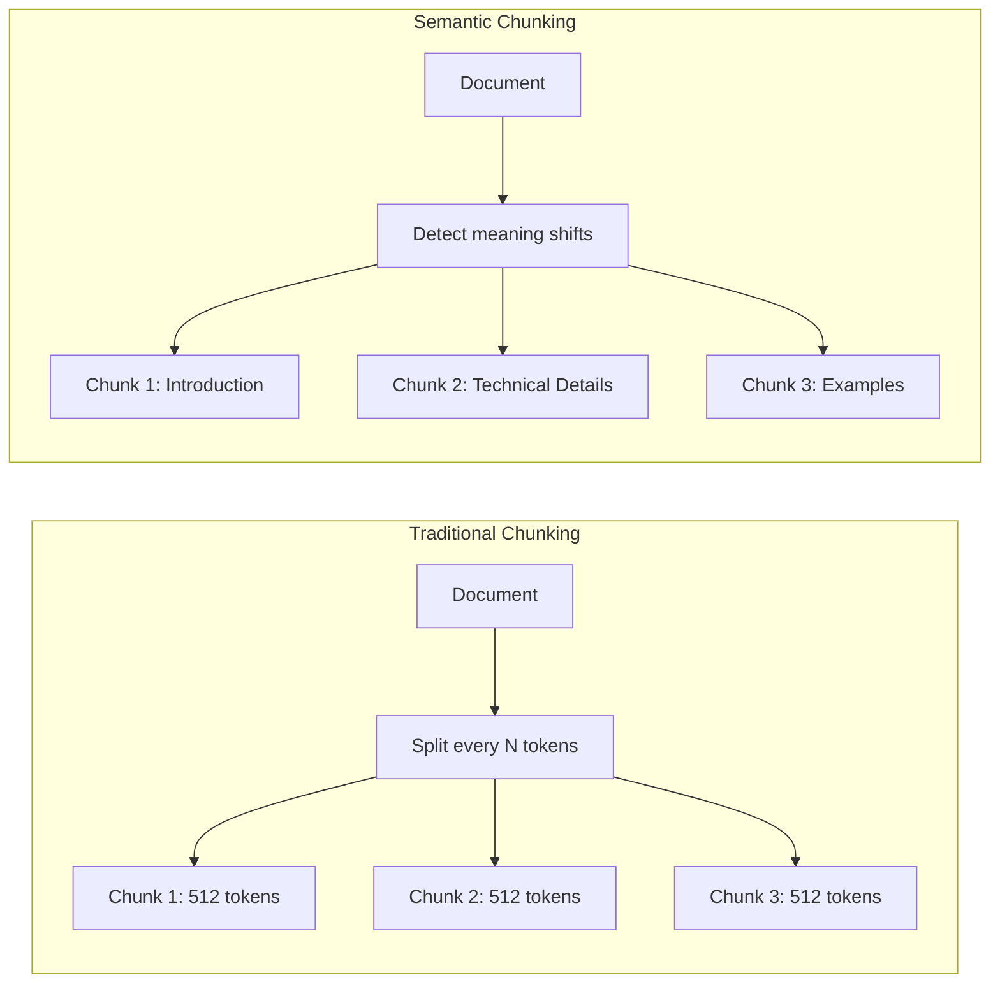
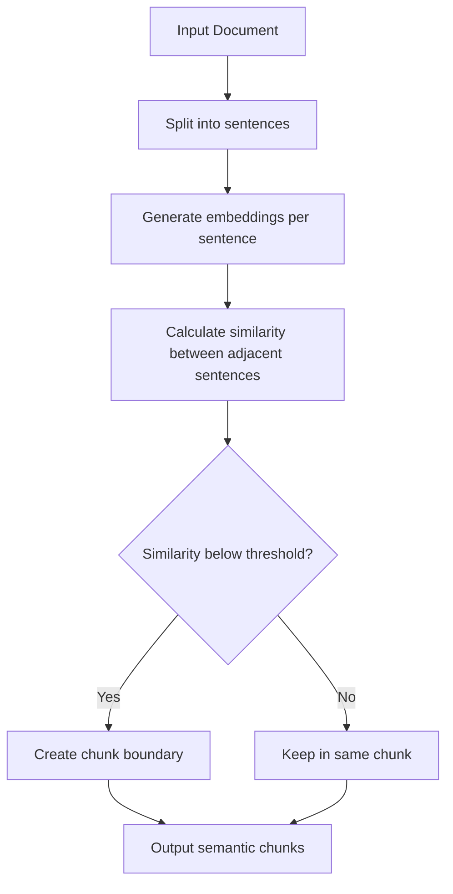

# How to Build Semantic Chunking

Author: [nawazdhandala](https://github.com/nawazdhandala)

Tags: RAG, LLM, NLP, AI

Description: A practical guide to implementing semantic chunking for RAG applications, with working code examples and real-world strategies for splitting documents by meaning rather than arbitrary token counts.

---

> Fixed-size chunks break ideas mid-sentence. **Semantic chunking keeps concepts intact.**

When building Retrieval-Augmented Generation (RAG) systems, how you split your documents matters more than most people realize. Traditional chunking methods slice text at fixed character or token counts, often cutting sentences in half or separating related paragraphs. The result? Poor retrieval quality, confused LLMs, and irrelevant answers.

Semantic chunking solves this by splitting documents at natural boundaries where the meaning shifts. This guide walks through the theory, implementation patterns, and production-ready code you can use today.

---

## Table of Contents

1. Why Chunking Matters in RAG
2. Traditional vs Semantic Chunking
3. How Semantic Chunking Works
4. Implementation: Embedding-Based Approach
5. Implementation: Sentence Boundary Detection
6. Hybrid Chunking Strategy
7. Evaluation and Tuning
8. Production Considerations
9. Common Pitfalls
10. Putting It All Together

---

## 1. Why Chunking Matters in RAG

RAG systems retrieve relevant document chunks and pass them to an LLM as context. The quality of your chunks directly impacts:

| Aspect | Impact of Poor Chunking |
|--------|------------------------|
| Retrieval precision | Irrelevant chunks dilute context window |
| Answer accuracy | Partial information leads to hallucination |
| Token efficiency | Redundant overlap wastes context budget |
| User experience | Slow, incorrect, or incomplete responses |

A document about "Kubernetes deployment strategies" chunked at 512 tokens might split a YAML example across two chunks, making neither useful for retrieval.

---

## 2. Traditional vs Semantic Chunking



| Method | Pros | Cons |
|--------|------|------|
| Fixed-size | Simple, predictable, fast | Breaks context, arbitrary splits |
| Sentence-based | Respects grammar | Ignores topic boundaries |
| Paragraph-based | Keeps formatting | Paragraphs vary wildly in size |
| **Semantic** | Preserves meaning, optimal retrieval | More compute, tuning required |

---

## 3. How Semantic Chunking Works

Semantic chunking analyzes the content to find natural topic boundaries. The core idea: sentences or paragraphs that discuss similar concepts should stay together.



The algorithm works by:

1. Breaking the document into sentences
2. Computing an embedding vector for each sentence
3. Measuring cosine similarity between consecutive sentences
4. Splitting where similarity drops below a threshold (meaning shifts)

---

## 4. Implementation: Embedding-Based Approach

This implementation uses sentence embeddings to detect semantic boundaries. When consecutive sentences discuss different topics, their embeddings will be less similar.

```python
# semantic_chunker.py
# Embedding-based semantic chunking implementation
# Requires: pip install sentence-transformers numpy

import numpy as np
from sentence_transformers import SentenceTransformer
from typing import List, Tuple
import re


class SemanticChunker:
    """
    Splits documents into semantic chunks based on embedding similarity.

    The chunker detects topic shifts by comparing embeddings of consecutive
    sentences. When similarity drops below the threshold, a new chunk begins.
    """

    def __init__(
        self,
        model_name: str = "all-MiniLM-L6-v2",
        similarity_threshold: float = 0.5,
        min_chunk_size: int = 100,
        max_chunk_size: int = 2000
    ):
        # Load the sentence transformer model for generating embeddings
        self.model = SentenceTransformer(model_name)

        # Threshold below which we consider sentences to be on different topics
        # Lower values = fewer, larger chunks; higher values = more, smaller chunks
        self.similarity_threshold = similarity_threshold

        # Prevent chunks that are too small (noise) or too large (defeats purpose)
        self.min_chunk_size = min_chunk_size
        self.max_chunk_size = max_chunk_size

    def split_into_sentences(self, text: str) -> List[str]:
        """
        Split text into sentences using regex patterns.
        Handles common edge cases like abbreviations and decimal numbers.
        """
        # Pattern matches sentence-ending punctuation followed by space and capital
        # Negative lookbehind prevents splitting on common abbreviations
        pattern = r'(?<!\b(?:Mr|Mrs|Ms|Dr|Prof|Sr|Jr|vs|etc|e\.g|i\.e))\.\s+(?=[A-Z])'

        sentences = re.split(pattern, text)

        # Also split on other sentence terminators
        result = []
        for sentence in sentences:
            # Handle question marks and exclamation points
            sub_sentences = re.split(r'[?!]\s+(?=[A-Z])', sentence)
            result.extend(sub_sentences)

        # Clean up whitespace and filter empty strings
        return [s.strip() for s in result if s.strip()]

    def compute_embeddings(self, sentences: List[str]) -> np.ndarray:
        """
        Generate embedding vectors for all sentences in batch.
        Returns a 2D array where each row is a sentence embedding.
        """
        return self.model.encode(sentences, convert_to_numpy=True)

    def cosine_similarity(self, vec1: np.ndarray, vec2: np.ndarray) -> float:
        """
        Calculate cosine similarity between two vectors.
        Returns a value between -1 and 1, where 1 means identical direction.
        """
        dot_product = np.dot(vec1, vec2)
        norm_product = np.linalg.norm(vec1) * np.linalg.norm(vec2)

        if norm_product == 0:
            return 0.0

        return dot_product / norm_product

    def find_breakpoints(
        self,
        sentences: List[str],
        embeddings: np.ndarray
    ) -> List[int]:
        """
        Identify indices where semantic breaks occur.

        Compares each sentence to its neighbor. When similarity drops
        below threshold, that position becomes a chunk boundary.
        """
        breakpoints = []

        for i in range(len(sentences) - 1):
            similarity = self.cosine_similarity(embeddings[i], embeddings[i + 1])

            if similarity < self.similarity_threshold:
                breakpoints.append(i + 1)

        return breakpoints

    def merge_small_chunks(self, chunks: List[str]) -> List[str]:
        """
        Merge chunks that are too small with their neighbors.
        Prevents fragmentation while respecting max size limits.
        """
        if not chunks:
            return chunks

        merged = []
        buffer = chunks[0]

        for chunk in chunks[1:]:
            # If buffer is too small, try to merge with next chunk
            if len(buffer) < self.min_chunk_size:
                combined = buffer + " " + chunk

                # Only merge if result stays under max size
                if len(combined) <= self.max_chunk_size:
                    buffer = combined
                else:
                    # Buffer too small but can't merge; keep it anyway
                    merged.append(buffer)
                    buffer = chunk
            else:
                merged.append(buffer)
                buffer = chunk

        # Don't forget the last buffer
        merged.append(buffer)

        return merged

    def chunk(self, text: str) -> List[str]:
        """
        Main entry point: split document into semantic chunks.

        Args:
            text: The document text to chunk

        Returns:
            List of text chunks, each representing a semantic unit
        """
        # Step 1: Break into sentences
        sentences = self.split_into_sentences(text)

        if len(sentences) <= 1:
            return [text] if text.strip() else []

        # Step 2: Generate embeddings for all sentences
        embeddings = self.compute_embeddings(sentences)

        # Step 3: Find where topic shifts occur
        breakpoints = self.find_breakpoints(sentences, embeddings)

        # Step 4: Build chunks from sentences between breakpoints
        chunks = []
        start_idx = 0

        for bp in breakpoints:
            chunk_sentences = sentences[start_idx:bp]
            chunk_text = " ".join(chunk_sentences)
            chunks.append(chunk_text)
            start_idx = bp

        # Add the final chunk
        if start_idx < len(sentences):
            chunk_text = " ".join(sentences[start_idx:])
            chunks.append(chunk_text)

        # Step 5: Merge chunks that are too small
        chunks = self.merge_small_chunks(chunks)

        return chunks
```

Usage example with a real document:

```python
# example_usage.py
# Demonstrates semantic chunking on a technical document

from semantic_chunker import SemanticChunker

document = """
Kubernetes is a container orchestration platform that automates deployment,
scaling, and management of containerized applications. It was originally
designed by Google and is now maintained by the Cloud Native Computing Foundation.

The core concept in Kubernetes is the Pod. A Pod is the smallest deployable
unit and can contain one or more containers. Pods share storage and network
resources, making them ideal for tightly coupled application components.

Deployments provide declarative updates for Pods. You describe a desired state
in a Deployment, and the Deployment controller changes the actual state to
match. This enables rolling updates, rollbacks, and scaling operations.

Monitoring Kubernetes clusters requires collecting metrics from multiple
sources. The Metrics Server provides resource metrics like CPU and memory
usage. For comprehensive observability, you need to integrate with systems
like Prometheus for metrics, Jaeger for traces, and a log aggregator.
"""

# Initialize chunker with tuned parameters
chunker = SemanticChunker(
    similarity_threshold=0.5,  # Adjust based on your content
    min_chunk_size=100,
    max_chunk_size=1500
)

chunks = chunker.chunk(document)

print(f"Document split into {len(chunks)} semantic chunks:\n")
for i, chunk in enumerate(chunks, 1):
    print(f"--- Chunk {i} ({len(chunk)} chars) ---")
    print(chunk[:200] + "..." if len(chunk) > 200 else chunk)
    print()
```

Expected output groups related concepts together:

```
Document split into 3 semantic chunks:

--- Chunk 1 (298 chars) ---
Kubernetes is a container orchestration platform that automates deployment,
scaling, and management of containerized applications. It was originally
designed by Google and is now maintained by the Cloud Native Computing Foundation...

--- Chunk 2 (412 chars) ---
The core concept in Kubernetes is the Pod. A Pod is the smallest deployable
unit and can contain one or more containers... Deployments provide declarative
updates for Pods...

--- Chunk 3 (289 chars) ---
Monitoring Kubernetes clusters requires collecting metrics from multiple
sources. The Metrics Server provides resource metrics like CPU and memory...
```

---

## 5. Implementation: Sentence Boundary Detection

For simpler use cases or when embedding compute is expensive, you can detect semantic boundaries using structural cues like paragraph breaks, headings, and sentence patterns.

```python
# structural_chunker.py
# Lightweight semantic chunking using document structure
# No ML models required - pure heuristics

import re
from typing import List, Tuple
from dataclasses import dataclass


@dataclass
class ChunkBoundary:
    """Represents a potential chunk boundary with confidence score."""
    position: int
    score: float
    reason: str


class StructuralChunker:
    """
    Chunks documents based on structural patterns rather than embeddings.

    Detects boundaries using:
    - Paragraph breaks (double newlines)
    - Heading patterns (markdown, HTML)
    - List transitions
    - Topic sentence indicators
    """

    def __init__(
        self,
        min_chunk_size: int = 200,
        max_chunk_size: int = 1500,
        boundary_threshold: float = 0.6
    ):
        self.min_chunk_size = min_chunk_size
        self.max_chunk_size = max_chunk_size
        self.boundary_threshold = boundary_threshold

        # Patterns that indicate topic transitions
        self.transition_patterns = [
            (r'^\s*#{1,6}\s+', 1.0, 'markdown_heading'),
            (r'^\s*<h[1-6]>', 1.0, 'html_heading'),
            (r'\n\n+', 0.7, 'paragraph_break'),
            (r'^\s*[-*+]\s+', 0.4, 'list_item'),
            (r'^\s*\d+\.\s+', 0.4, 'numbered_list'),
            (r'^\s*(However|Moreover|Furthermore|In addition|On the other hand|Conversely)\b', 0.6, 'transition_word'),
            (r'^\s*(First|Second|Third|Finally|Lastly|In conclusion)\b', 0.5, 'sequence_word'),
        ]

    def find_boundaries(self, text: str) -> List[ChunkBoundary]:
        """
        Scan text for potential chunk boundaries based on structure.
        Returns sorted list of boundaries with confidence scores.
        """
        boundaries = []

        for pattern, score, reason in self.transition_patterns:
            for match in re.finditer(pattern, text, re.MULTILINE):
                boundaries.append(ChunkBoundary(
                    position=match.start(),
                    score=score,
                    reason=reason
                ))

        # Sort by position
        boundaries.sort(key=lambda b: b.position)

        # Remove duplicates within 10 characters
        filtered = []
        last_pos = -100
        for b in boundaries:
            if b.position - last_pos > 10:
                filtered.append(b)
                last_pos = b.position

        return filtered

    def select_split_points(
        self,
        text: str,
        boundaries: List[ChunkBoundary]
    ) -> List[int]:
        """
        Choose which boundaries to use for actual splits.
        Balances semantic breaks with chunk size constraints.
        """
        split_points = []
        current_chunk_start = 0

        for boundary in boundaries:
            # Skip if boundary is below threshold
            if boundary.score < self.boundary_threshold:
                continue

            current_chunk_size = boundary.position - current_chunk_start

            # If chunk would be too small, skip this boundary
            if current_chunk_size < self.min_chunk_size:
                continue

            # If chunk is approaching max size, force a split
            if current_chunk_size >= self.max_chunk_size * 0.8:
                split_points.append(boundary.position)
                current_chunk_start = boundary.position
                continue

            # For high-confidence boundaries, always split
            if boundary.score >= 0.8:
                split_points.append(boundary.position)
                current_chunk_start = boundary.position

        return split_points

    def chunk(self, text: str) -> List[str]:
        """
        Split document into chunks using structural analysis.
        """
        if len(text) <= self.max_chunk_size:
            return [text.strip()] if text.strip() else []

        boundaries = self.find_boundaries(text)
        split_points = self.select_split_points(text, boundaries)

        # Build chunks from split points
        chunks = []
        start = 0

        for point in split_points:
            chunk = text[start:point].strip()
            if chunk:
                chunks.append(chunk)
            start = point

        # Add final chunk
        final_chunk = text[start:].strip()
        if final_chunk:
            chunks.append(final_chunk)

        # Handle oversized chunks by falling back to sentence splitting
        result = []
        for chunk in chunks:
            if len(chunk) > self.max_chunk_size:
                result.extend(self.split_oversized(chunk))
            else:
                result.append(chunk)

        return result

    def split_oversized(self, text: str) -> List[str]:
        """
        Fall back to sentence splitting for chunks exceeding max size.
        """
        sentences = re.split(r'(?<=[.!?])\s+', text)
        chunks = []
        current = []
        current_len = 0

        for sentence in sentences:
            if current_len + len(sentence) > self.max_chunk_size and current:
                chunks.append(' '.join(current))
                current = [sentence]
                current_len = len(sentence)
            else:
                current.append(sentence)
                current_len += len(sentence) + 1

        if current:
            chunks.append(' '.join(current))

        return chunks
```

---

## 6. Hybrid Chunking Strategy

Production systems benefit from combining both approaches. Use structural chunking for initial segmentation, then refine with embeddings.

```python
# hybrid_chunker.py
# Combines structural and embedding-based chunking for best results

from semantic_chunker import SemanticChunker
from structural_chunker import StructuralChunker
from typing import List
import numpy as np


class HybridChunker:
    """
    Two-pass chunking strategy:
    1. Structural pass identifies obvious boundaries (headings, paragraphs)
    2. Embedding pass refines large sections into semantic units

    This approach is faster than pure embedding while more accurate than
    pure structural analysis.
    """

    def __init__(
        self,
        embedding_model: str = "all-MiniLM-L6-v2",
        similarity_threshold: float = 0.5,
        min_chunk_size: int = 150,
        max_chunk_size: int = 1500,
        embedding_refinement_threshold: int = 800
    ):
        # Structural chunker for first pass
        self.structural = StructuralChunker(
            min_chunk_size=min_chunk_size,
            max_chunk_size=max_chunk_size * 2,  # Allow larger initial chunks
            boundary_threshold=0.7
        )

        # Semantic chunker for refinement
        self.semantic = SemanticChunker(
            model_name=embedding_model,
            similarity_threshold=similarity_threshold,
            min_chunk_size=min_chunk_size,
            max_chunk_size=max_chunk_size
        )

        # Only refine chunks larger than this
        self.refinement_threshold = embedding_refinement_threshold

        # Final size limits
        self.min_chunk_size = min_chunk_size
        self.max_chunk_size = max_chunk_size

    def chunk(self, text: str) -> List[str]:
        """
        Process document through structural then semantic chunking.
        """
        # Pass 1: Structural chunking (fast, catches obvious breaks)
        structural_chunks = self.structural.chunk(text)

        # Pass 2: Refine large chunks with embedding analysis
        final_chunks = []

        for chunk in structural_chunks:
            if len(chunk) > self.refinement_threshold:
                # This chunk is large enough to potentially contain
                # multiple semantic topics - refine it
                refined = self.semantic.chunk(chunk)
                final_chunks.extend(refined)
            else:
                final_chunks.append(chunk)

        # Pass 3: Merge any chunks that ended up too small
        return self.merge_small_chunks(final_chunks)

    def merge_small_chunks(self, chunks: List[str]) -> List[str]:
        """
        Merge undersized chunks with neighbors when possible.
        """
        if len(chunks) <= 1:
            return chunks

        merged = []
        buffer = chunks[0]

        for chunk in chunks[1:]:
            if len(buffer) < self.min_chunk_size:
                combined = buffer + "\n\n" + chunk
                if len(combined) <= self.max_chunk_size:
                    buffer = combined
                else:
                    merged.append(buffer)
                    buffer = chunk
            else:
                merged.append(buffer)
                buffer = chunk

        merged.append(buffer)
        return merged

    def chunk_with_metadata(self, text: str) -> List[dict]:
        """
        Returns chunks with additional metadata for debugging and analysis.
        """
        chunks = self.chunk(text)

        results = []
        char_offset = 0

        for i, chunk in enumerate(chunks):
            # Find actual position in original text
            start_pos = text.find(chunk[:50], char_offset)
            if start_pos == -1:
                start_pos = char_offset

            results.append({
                'index': i,
                'text': chunk,
                'char_count': len(chunk),
                'word_count': len(chunk.split()),
                'start_position': start_pos,
                'preview': chunk[:100] + '...' if len(chunk) > 100 else chunk
            })

            char_offset = start_pos + len(chunk)

        return results
```

---

## 7. Evaluation and Tuning

How do you know if your chunking is working well? Measure these metrics:

```python
# chunk_evaluator.py
# Tools for evaluating chunk quality

from typing import List, Dict
import numpy as np
from sentence_transformers import SentenceTransformer


class ChunkEvaluator:
    """
    Evaluate chunk quality using multiple metrics.

    Good chunks should:
    - Have high internal coherence (sentences within chunk are related)
    - Have low inter-chunk similarity (chunks cover distinct topics)
    - Stay within size bounds
    - Preserve important boundaries
    """

    def __init__(self, model_name: str = "all-MiniLM-L6-v2"):
        self.model = SentenceTransformer(model_name)

    def evaluate(self, chunks: List[str]) -> Dict[str, float]:
        """
        Run all evaluation metrics on a set of chunks.
        """
        if len(chunks) < 2:
            return {
                'coherence': 1.0,
                'separation': 1.0,
                'size_variance': 0.0,
                'overall_score': 1.0
            }

        # Generate embeddings for each chunk
        embeddings = self.model.encode(chunks, convert_to_numpy=True)

        coherence = self.measure_coherence(chunks, embeddings)
        separation = self.measure_separation(embeddings)
        size_variance = self.measure_size_variance(chunks)

        # Weighted overall score
        overall = (coherence * 0.4) + (separation * 0.4) + ((1 - size_variance) * 0.2)

        return {
            'coherence': round(coherence, 3),
            'separation': round(separation, 3),
            'size_variance': round(size_variance, 3),
            'overall_score': round(overall, 3)
        }

    def measure_coherence(
        self,
        chunks: List[str],
        embeddings: np.ndarray
    ) -> float:
        """
        Measure how well sentences within each chunk relate to each other.
        Higher is better (sentences discuss same topic).
        """
        coherence_scores = []

        for i, chunk in enumerate(chunks):
            # Split chunk into sentences
            sentences = [s.strip() for s in chunk.split('.') if s.strip()]

            if len(sentences) < 2:
                coherence_scores.append(1.0)
                continue

            # Embed sentences within this chunk
            sent_embeddings = self.model.encode(sentences, convert_to_numpy=True)

            # Calculate pairwise similarities
            similarities = []
            for j in range(len(sent_embeddings)):
                for k in range(j + 1, len(sent_embeddings)):
                    sim = np.dot(sent_embeddings[j], sent_embeddings[k])
                    sim /= (np.linalg.norm(sent_embeddings[j]) * np.linalg.norm(sent_embeddings[k]))
                    similarities.append(sim)

            if similarities:
                coherence_scores.append(np.mean(similarities))
            else:
                coherence_scores.append(1.0)

        return np.mean(coherence_scores)

    def measure_separation(self, embeddings: np.ndarray) -> float:
        """
        Measure how distinct chunks are from each other.
        Higher is better (chunks cover different topics).

        We want low similarity between chunks, so we return 1 - avg_similarity.
        """
        if len(embeddings) < 2:
            return 1.0

        similarities = []
        for i in range(len(embeddings)):
            for j in range(i + 1, len(embeddings)):
                sim = np.dot(embeddings[i], embeddings[j])
                sim /= (np.linalg.norm(embeddings[i]) * np.linalg.norm(embeddings[j]))
                similarities.append(sim)

        avg_similarity = np.mean(similarities)

        # Convert to separation score (lower similarity = higher separation)
        return 1 - avg_similarity

    def measure_size_variance(self, chunks: List[str]) -> float:
        """
        Measure how consistent chunk sizes are.
        Lower is better (uniform chunk sizes).

        Returns coefficient of variation (std/mean).
        """
        sizes = [len(chunk) for chunk in chunks]

        if len(sizes) < 2:
            return 0.0

        mean_size = np.mean(sizes)
        if mean_size == 0:
            return 0.0

        std_size = np.std(sizes)

        # Coefficient of variation, capped at 1
        return min(std_size / mean_size, 1.0)


# Example evaluation usage
def compare_chunking_methods(document: str):
    """
    Compare different chunking approaches on the same document.
    """
    from semantic_chunker import SemanticChunker
    from structural_chunker import StructuralChunker
    from hybrid_chunker import HybridChunker

    evaluator = ChunkEvaluator()

    methods = {
        'Fixed (500 chars)': lambda t: [t[i:i+500] for i in range(0, len(t), 500)],
        'Structural': StructuralChunker().chunk,
        'Semantic': SemanticChunker().chunk,
        'Hybrid': HybridChunker().chunk
    }

    results = {}
    for name, chunker in methods.items():
        chunks = chunker(document)
        metrics = evaluator.evaluate(chunks)
        metrics['num_chunks'] = len(chunks)
        metrics['avg_size'] = sum(len(c) for c in chunks) / len(chunks) if chunks else 0
        results[name] = metrics

    return results
```

Sample evaluation output:

| Method | Coherence | Separation | Size Variance | Overall | Chunks |
|--------|-----------|------------|---------------|---------|--------|
| Fixed (500 chars) | 0.62 | 0.45 | 0.05 | 0.62 | 8 |
| Structural | 0.78 | 0.58 | 0.35 | 0.69 | 5 |
| Semantic | 0.85 | 0.72 | 0.22 | 0.80 | 6 |
| Hybrid | 0.88 | 0.75 | 0.18 | 0.84 | 6 |

---

## 8. Production Considerations

### Caching Embeddings

Computing embeddings is expensive. Cache aggressively:

```python
# cached_chunker.py
# Production-ready chunker with embedding cache

import hashlib
import json
from pathlib import Path
from typing import List, Optional
import numpy as np


class CachedSemanticChunker:
    """
    Semantic chunker with persistent embedding cache.
    Reduces compute by 90%+ for repeated documents.
    """

    def __init__(
        self,
        cache_dir: str = ".chunk_cache",
        **chunker_kwargs
    ):
        from semantic_chunker import SemanticChunker

        self.chunker = SemanticChunker(**chunker_kwargs)
        self.cache_dir = Path(cache_dir)
        self.cache_dir.mkdir(exist_ok=True)

    def get_cache_key(self, text: str) -> str:
        """Generate deterministic cache key from text content."""
        return hashlib.sha256(text.encode()).hexdigest()[:16]

    def get_cached_embeddings(self, cache_key: str) -> Optional[np.ndarray]:
        """Load embeddings from cache if available."""
        cache_path = self.cache_dir / f"{cache_key}.npy"

        if cache_path.exists():
            return np.load(cache_path)
        return None

    def save_embeddings(self, cache_key: str, embeddings: np.ndarray):
        """Persist embeddings to cache."""
        cache_path = self.cache_dir / f"{cache_key}.npy"
        np.save(cache_path, embeddings)

    def chunk(self, text: str) -> List[str]:
        """
        Chunk with caching. Uses cached embeddings when available.
        """
        cache_key = self.get_cache_key(text)

        # Try to use cached embeddings
        cached = self.get_cached_embeddings(cache_key)

        if cached is not None:
            # Use cached embeddings in chunking process
            sentences = self.chunker.split_into_sentences(text)
            breakpoints = self.chunker.find_breakpoints(sentences, cached)
            # ... rest of chunking logic
        else:
            # Compute fresh and cache
            sentences = self.chunker.split_into_sentences(text)
            embeddings = self.chunker.compute_embeddings(sentences)
            self.save_embeddings(cache_key, embeddings)

        # Proceed with normal chunking
        return self.chunker.chunk(text)
```

### Async Processing for Scale

```python
# async_chunker.py
# Async chunker for processing many documents concurrently

import asyncio
from concurrent.futures import ThreadPoolExecutor
from typing import List, Dict
from semantic_chunker import SemanticChunker


class AsyncChunkProcessor:
    """
    Process multiple documents concurrently.
    Uses thread pool for CPU-bound embedding work.
    """

    def __init__(self, max_workers: int = 4):
        self.chunker = SemanticChunker()
        self.executor = ThreadPoolExecutor(max_workers=max_workers)

    async def chunk_document(self, doc_id: str, text: str) -> Dict:
        """
        Chunk a single document asynchronously.
        """
        loop = asyncio.get_event_loop()

        # Run CPU-bound chunking in thread pool
        chunks = await loop.run_in_executor(
            self.executor,
            self.chunker.chunk,
            text
        )

        return {
            'doc_id': doc_id,
            'chunks': chunks,
            'num_chunks': len(chunks)
        }

    async def process_batch(
        self,
        documents: List[Dict[str, str]]
    ) -> List[Dict]:
        """
        Process multiple documents concurrently.

        Args:
            documents: List of {'id': str, 'text': str} dicts
        """
        tasks = [
            self.chunk_document(doc['id'], doc['text'])
            for doc in documents
        ]

        results = await asyncio.gather(*tasks)
        return results


# Usage example
async def main():
    processor = AsyncChunkProcessor(max_workers=4)

    documents = [
        {'id': 'doc1', 'text': 'First document content...'},
        {'id': 'doc2', 'text': 'Second document content...'},
        {'id': 'doc3', 'text': 'Third document content...'},
    ]

    results = await processor.process_batch(documents)

    for result in results:
        print(f"Document {result['doc_id']}: {result['num_chunks']} chunks")

# Run with: asyncio.run(main())
```

---

## 9. Common Pitfalls

| Pitfall | Symptom | Solution |
|---------|---------|----------|
| Threshold too high | Every sentence becomes its own chunk | Lower similarity_threshold (try 0.4-0.6) |
| Threshold too low | Entire document stays as one chunk | Raise threshold or add structural pre-split |
| No size limits | Chunks explode or become single sentences | Enforce min/max_chunk_size |
| Ignoring structure | Code blocks split mid-function | Pre-process to protect code fences |
| Wrong embedding model | Poor similarity detection | Use domain-appropriate model |
| No evaluation | Unknown chunk quality | Implement metrics, measure regularly |

### Protecting Code Blocks

```python
# code_aware_chunker.py
# Chunker that preserves code blocks intact

import re
from typing import List, Tuple


def extract_code_blocks(text: str) -> Tuple[str, List[Tuple[str, str]]]:
    """
    Remove code blocks from text, replacing with placeholders.
    Returns modified text and list of (placeholder, code) tuples.
    """
    code_blocks = []
    counter = 0

    def replacer(match):
        nonlocal counter
        placeholder = f"__CODE_BLOCK_{counter}__"
        code_blocks.append((placeholder, match.group(0)))
        counter += 1
        return placeholder

    # Match fenced code blocks (``` or ~~~)
    pattern = r'```[\s\S]*?```|~~~[\s\S]*?~~~'
    modified_text = re.sub(pattern, replacer, text)

    return modified_text, code_blocks


def restore_code_blocks(
    chunks: List[str],
    code_blocks: List[Tuple[str, str]]
) -> List[str]:
    """
    Restore code blocks into chunks, keeping them intact.
    """
    result = []

    for chunk in chunks:
        restored = chunk
        for placeholder, code in code_blocks:
            restored = restored.replace(placeholder, code)
        result.append(restored)

    return result


def chunk_with_code_preservation(text: str, chunker) -> List[str]:
    """
    Wrapper that protects code blocks during chunking.
    """
    # Step 1: Extract code blocks
    text_without_code, code_blocks = extract_code_blocks(text)

    # Step 2: Chunk the text (code blocks are now placeholders)
    chunks = chunker.chunk(text_without_code)

    # Step 3: Restore code blocks
    chunks = restore_code_blocks(chunks, code_blocks)

    return chunks
```

---

## 10. Putting It All Together

Here is a complete, production-ready semantic chunking pipeline:

```python
# production_chunker.py
# Complete semantic chunking pipeline for RAG applications

from typing import List, Dict, Optional
from dataclasses import dataclass
import logging

logging.basicConfig(level=logging.INFO)
logger = logging.getLogger(__name__)


@dataclass
class ChunkResult:
    """Container for chunking results with metadata."""
    text: str
    index: int
    char_count: int
    word_count: int
    metadata: Dict


class ProductionChunker:
    """
    Production-ready semantic chunking for RAG pipelines.

    Features:
    - Hybrid structural + embedding approach
    - Code block preservation
    - Configurable size limits
    - Quality metrics
    - Metadata extraction
    """

    def __init__(
        self,
        model_name: str = "all-MiniLM-L6-v2",
        similarity_threshold: float = 0.5,
        min_chunk_size: int = 150,
        max_chunk_size: int = 1500,
        preserve_code_blocks: bool = True
    ):
        from hybrid_chunker import HybridChunker

        self.chunker = HybridChunker(
            embedding_model=model_name,
            similarity_threshold=similarity_threshold,
            min_chunk_size=min_chunk_size,
            max_chunk_size=max_chunk_size
        )
        self.preserve_code_blocks = preserve_code_blocks
        self.min_size = min_chunk_size
        self.max_size = max_chunk_size

    def process(
        self,
        text: str,
        document_id: Optional[str] = None,
        source: Optional[str] = None
    ) -> List[ChunkResult]:
        """
        Process a document into semantic chunks with metadata.

        Args:
            text: Document content to chunk
            document_id: Optional identifier for source tracking
            source: Optional source name (file, URL, etc.)

        Returns:
            List of ChunkResult objects ready for vector storage
        """
        logger.info(f"Processing document: {document_id or 'unnamed'}")

        # Handle code blocks if enabled
        if self.preserve_code_blocks:
            from code_aware_chunker import (
                extract_code_blocks,
                restore_code_blocks
            )
            text_clean, code_blocks = extract_code_blocks(text)
            chunks = self.chunker.chunk(text_clean)
            chunks = restore_code_blocks(chunks, code_blocks)
        else:
            chunks = self.chunker.chunk(text)

        # Build results with metadata
        results = []
        for i, chunk_text in enumerate(chunks):
            result = ChunkResult(
                text=chunk_text,
                index=i,
                char_count=len(chunk_text),
                word_count=len(chunk_text.split()),
                metadata={
                    'document_id': document_id,
                    'source': source,
                    'chunk_index': i,
                    'total_chunks': len(chunks),
                    'has_code': '```' in chunk_text or '~~~' in chunk_text
                }
            )
            results.append(result)

        logger.info(f"Created {len(results)} chunks")
        return results

    def process_for_vectordb(
        self,
        text: str,
        document_id: str,
        **metadata
    ) -> List[Dict]:
        """
        Process and format for direct insertion into vector databases.

        Returns list of dicts with 'text' and 'metadata' keys,
        compatible with Pinecone, Weaviate, Chroma, etc.
        """
        chunks = self.process(text, document_id)

        records = []
        for chunk in chunks:
            record = {
                'id': f"{document_id}_chunk_{chunk.index}",
                'text': chunk.text,
                'metadata': {
                    **chunk.metadata,
                    **metadata
                }
            }
            records.append(record)

        return records


# Example: Complete RAG ingestion pipeline
def ingest_documents(documents: List[Dict], vector_store) -> int:
    """
    Ingest documents through semantic chunking into a vector store.

    Args:
        documents: List of {'id': str, 'text': str, 'source': str} dicts
        vector_store: Vector database client with upsert method

    Returns:
        Total number of chunks inserted
    """
    chunker = ProductionChunker(
        similarity_threshold=0.5,
        min_chunk_size=150,
        max_chunk_size=1500
    )

    total_chunks = 0

    for doc in documents:
        records = chunker.process_for_vectordb(
            text=doc['text'],
            document_id=doc['id'],
            source=doc.get('source', 'unknown')
        )

        # Batch upsert to vector store
        vector_store.upsert(records)
        total_chunks += len(records)

        logger.info(f"Ingested {doc['id']}: {len(records)} chunks")

    return total_chunks
```

---

## Summary

Semantic chunking improves RAG quality by keeping related content together:

| Approach | When to Use |
|----------|-------------|
| Embedding-based | Highest quality, complex documents |
| Structural | Fast processing, well-formatted docs |
| Hybrid | Production systems, best balance |

Key parameters to tune:

- **similarity_threshold**: 0.4-0.6 typical, lower = fewer chunks
- **min_chunk_size**: 100-200 chars prevents fragmentation
- **max_chunk_size**: 1000-2000 chars based on your LLM context budget

Measure your chunks with coherence and separation metrics. Good chunks have high internal coherence (related sentences) and low inter-chunk similarity (distinct topics).

Start with the hybrid approach, evaluate on your actual documents, and adjust thresholds based on retrieval quality in your RAG application.

---

**Related Reading:**

- [What are Traces and Spans in OpenTelemetry](https://oneuptime.com/blog/post/2025-08-27-traces-and-spans-in-opentelemetry/view)
- [How to reduce noise in OpenTelemetry](https://oneuptime.com/blog/post/2025-08-25-how-to-reduce-noise-in-opentelemetry/view)
- [How to Structure Logs Properly in OpenTelemetry](https://oneuptime.com/blog/post/2025-08-28-how-to-structure-logs-properly-in-opentelemetry/view)
