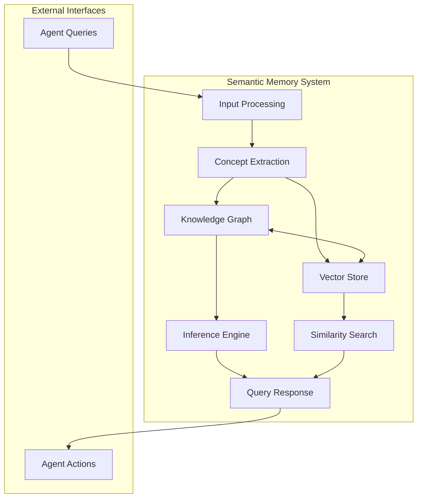
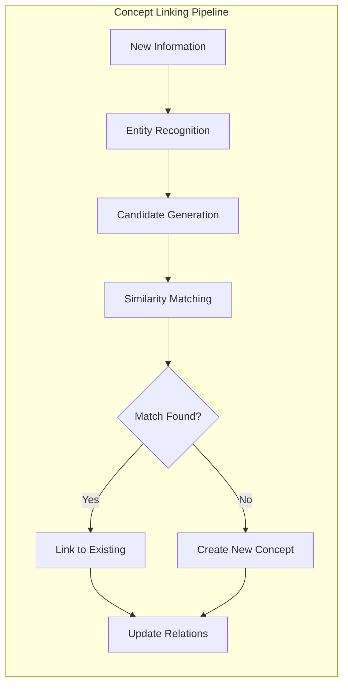
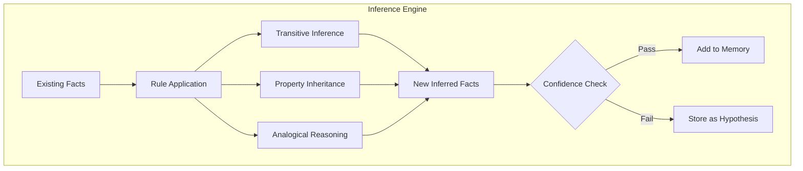
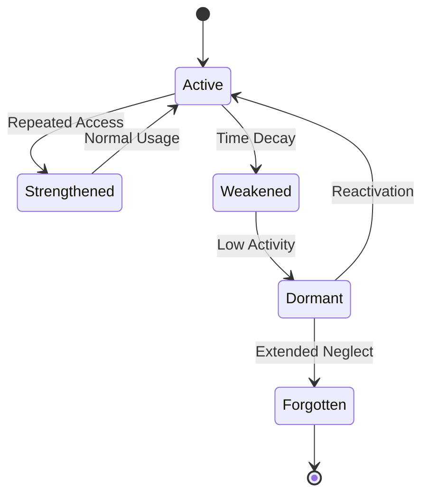
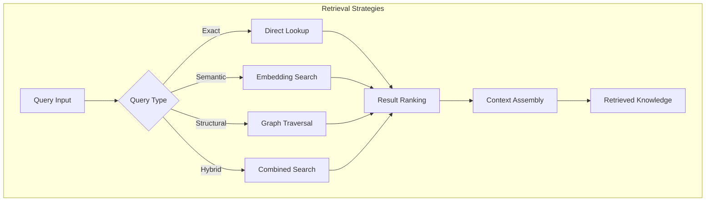

# How to Build Semantic Memory

Author: [nawazdhandala](https://github.com/nawazdhandala)

Tags: AI Agents, Semantic Memory, Knowledge Graphs, Vector Storage

Description: Learn to implement semantic memory for AI agents with concept representation, relationship modeling, and knowledge inference for intelligent reasoning.

---

## Introduction

Semantic memory is a core component of intelligent AI agents that enables them to store, organize, and retrieve knowledge about concepts, facts, and their relationships. Unlike episodic memory (which stores specific events) or procedural memory (which stores how to do things), semantic memory represents general world knowledge that agents can use for reasoning and decision-making.

In this guide, we will explore how to build a robust semantic memory system for AI agents, covering knowledge representation, concept linking, inference mechanisms, memory updates, and retrieval strategies.

## Understanding Semantic Memory Architecture

Before diving into implementation, let us understand the key components of a semantic memory system:



The architecture consists of:
- **Concept Extraction**: Identifies entities and concepts from input
- **Knowledge Graph**: Stores structured relationships between concepts
- **Vector Store**: Enables semantic similarity search
- **Inference Engine**: Derives new knowledge from existing facts
- **Query Interface**: Retrieves relevant information for agent decisions

## Part 1: Knowledge Representation

Effective knowledge representation is the foundation of semantic memory. We will use a hybrid approach combining knowledge graphs with vector embeddings.

### Defining the Concept Schema

First, let us define how concepts are represented in our system:

```python
from dataclasses import dataclass, field
from typing import List, Dict, Optional, Set
from enum import Enum
import uuid


class ConceptType(Enum):
    ENTITY = "entity"           # Concrete things (person, place, object)
    ABSTRACT = "abstract"       # Abstract concepts (love, justice, freedom)
    EVENT = "event"             # Things that happen
    ATTRIBUTE = "attribute"     # Properties of other concepts
    ACTION = "action"           # Things that can be done


class RelationType(Enum):
    IS_A = "is_a"               # Taxonomic relationship
    PART_OF = "part_of"         # Meronymic relationship
    HAS_PROPERTY = "has_property"
    CAUSES = "causes"
    RELATED_TO = "related_to"
    LOCATED_IN = "located_in"
    CREATED_BY = "created_by"
    USED_FOR = "used_for"


@dataclass
class Concept:
    """Represents a single concept in semantic memory."""

    id: str = field(default_factory=lambda: str(uuid.uuid4()))
    name: str = ""
    concept_type: ConceptType = ConceptType.ENTITY
    description: str = ""
    attributes: Dict[str, any] = field(default_factory=dict)
    embedding: Optional[List[float]] = None
    confidence: float = 1.0
    source: str = "direct_input"
    created_at: float = field(default_factory=lambda: __import__('time').time())
    last_accessed: float = field(default_factory=lambda: __import__('time').time())
    access_count: int = 0

    def to_dict(self) -> Dict:
        return {
            "id": self.id,
            "name": self.name,
            "type": self.concept_type.value,
            "description": self.description,
            "attributes": self.attributes,
            "confidence": self.confidence,
            "source": self.source
        }


@dataclass
class Relation:
    """Represents a relationship between two concepts."""

    id: str = field(default_factory=lambda: str(uuid.uuid4()))
    source_id: str = ""
    target_id: str = ""
    relation_type: RelationType = RelationType.RELATED_TO
    weight: float = 1.0
    confidence: float = 1.0
    evidence: List[str] = field(default_factory=list)
    bidirectional: bool = False
```

This schema captures:
- Unique identifiers for each concept
- Type classification for different kinds of knowledge
- Embeddings for semantic similarity
- Confidence scores for uncertain knowledge
- Temporal metadata for memory management

### Building the Knowledge Graph

Now let us implement the knowledge graph structure:

```python
import networkx as nx
from collections import defaultdict


class KnowledgeGraph:
    """Graph-based storage for concept relationships."""

    def __init__(self):
        self.graph = nx.DiGraph()
        self.concepts: Dict[str, Concept] = {}
        self.name_to_id: Dict[str, str] = {}
        self.type_index: Dict[ConceptType, Set[str]] = defaultdict(set)

    def add_concept(self, concept: Concept) -> str:
        """Add a concept to the knowledge graph."""
        self.concepts[concept.id] = concept
        self.name_to_id[concept.name.lower()] = concept.id
        self.type_index[concept.concept_type].add(concept.id)

        # Add node to graph with attributes
        self.graph.add_node(
            concept.id,
            name=concept.name,
            type=concept.concept_type.value,
            confidence=concept.confidence
        )

        return concept.id

    def add_relation(self, relation: Relation) -> bool:
        """Add a relationship between two concepts."""
        if relation.source_id not in self.concepts:
            return False
        if relation.target_id not in self.concepts:
            return False

        self.graph.add_edge(
            relation.source_id,
            relation.target_id,
            relation_type=relation.relation_type.value,
            weight=relation.weight,
            confidence=relation.confidence,
            evidence=relation.evidence
        )

        if relation.bidirectional:
            self.graph.add_edge(
                relation.target_id,
                relation.source_id,
                relation_type=relation.relation_type.value,
                weight=relation.weight,
                confidence=relation.confidence,
                evidence=relation.evidence
            )

        return True

    def get_concept_by_name(self, name: str) -> Optional[Concept]:
        """Retrieve a concept by its name."""
        concept_id = self.name_to_id.get(name.lower())
        if concept_id:
            concept = self.concepts.get(concept_id)
            if concept:
                concept.access_count += 1
                concept.last_accessed = __import__('time').time()
            return concept
        return None

    def get_related_concepts(
        self,
        concept_id: str,
        relation_type: Optional[RelationType] = None,
        max_depth: int = 1
    ) -> List[tuple]:
        """Get concepts related to a given concept."""
        if concept_id not in self.concepts:
            return []

        related = []
        visited = set()
        queue = [(concept_id, 0)]

        while queue:
            current_id, depth = queue.pop(0)

            if depth > max_depth:
                continue

            if current_id in visited:
                continue

            visited.add(current_id)

            # Get outgoing edges
            for neighbor in self.graph.neighbors(current_id):
                edge_data = self.graph.get_edge_data(current_id, neighbor)

                if relation_type and edge_data['relation_type'] != relation_type.value:
                    continue

                related.append((
                    self.concepts[neighbor],
                    edge_data['relation_type'],
                    depth + 1
                ))

                if depth + 1 < max_depth:
                    queue.append((neighbor, depth + 1))

        return related

    def find_path(
        self,
        source_name: str,
        target_name: str
    ) -> Optional[List[tuple]]:
        """Find the shortest path between two concepts."""
        source_id = self.name_to_id.get(source_name.lower())
        target_id = self.name_to_id.get(target_name.lower())

        if not source_id or not target_id:
            return None

        try:
            path = nx.shortest_path(self.graph, source_id, target_id)
            result = []

            for i in range(len(path) - 1):
                edge_data = self.graph.get_edge_data(path[i], path[i + 1])
                result.append((
                    self.concepts[path[i]],
                    edge_data['relation_type'],
                    self.concepts[path[i + 1]]
                ))

            return result
        except nx.NetworkXNoPath:
            return None
```

## Part 2: Concept Linking and Relationship Modeling

Concept linking connects new information to existing knowledge. This is crucial for building a coherent semantic memory.



### Implementing the Concept Linker

```python
import numpy as np
from typing import Tuple


class ConceptLinker:
    """Links new concepts to existing knowledge in semantic memory."""

    def __init__(
        self,
        knowledge_graph: KnowledgeGraph,
        embedding_model,
        similarity_threshold: float = 0.85
    ):
        self.kg = knowledge_graph
        self.embedding_model = embedding_model
        self.similarity_threshold = similarity_threshold

    def compute_embedding(self, text: str) -> List[float]:
        """Generate embedding for text using the embedding model."""
        return self.embedding_model.encode(text).tolist()

    def find_similar_concepts(
        self,
        query_embedding: List[float],
        top_k: int = 5
    ) -> List[Tuple[Concept, float]]:
        """Find concepts with similar embeddings."""
        similarities = []

        for concept_id, concept in self.kg.concepts.items():
            if concept.embedding is None:
                continue

            # Cosine similarity
            similarity = np.dot(query_embedding, concept.embedding) / (
                np.linalg.norm(query_embedding) * np.linalg.norm(concept.embedding)
            )
            similarities.append((concept, similarity))

        # Sort by similarity descending
        similarities.sort(key=lambda x: x[1], reverse=True)
        return similarities[:top_k]

    def link_concept(
        self,
        name: str,
        description: str,
        concept_type: ConceptType = ConceptType.ENTITY
    ) -> Tuple[Concept, bool]:
        """
        Link a concept to existing knowledge or create a new one.
        Returns the concept and a boolean indicating if it was newly created.
        """
        # Check for exact name match first
        existing = self.kg.get_concept_by_name(name)
        if existing:
            return existing, False

        # Generate embedding for similarity search
        combined_text = f"{name}: {description}"
        embedding = self.compute_embedding(combined_text)

        # Find similar concepts
        similar = self.find_similar_concepts(embedding, top_k=3)

        for concept, similarity in similar:
            if similarity >= self.similarity_threshold:
                # Found a match - update existing concept
                self._merge_concept_info(concept, name, description)
                return concept, False

        # No match found - create new concept
        new_concept = Concept(
            name=name,
            description=description,
            concept_type=concept_type,
            embedding=embedding
        )
        self.kg.add_concept(new_concept)

        # Create relations to similar concepts
        for concept, similarity in similar:
            if similarity > 0.5:  # Related but not identical
                relation = Relation(
                    source_id=new_concept.id,
                    target_id=concept.id,
                    relation_type=RelationType.RELATED_TO,
                    weight=similarity,
                    confidence=similarity
                )
                self.kg.add_relation(relation)

        return new_concept, True

    def _merge_concept_info(
        self,
        concept: Concept,
        new_name: str,
        new_description: str
    ):
        """Merge new information into an existing concept."""
        # Add alternative name if different
        if new_name.lower() != concept.name.lower():
            if 'aliases' not in concept.attributes:
                concept.attributes['aliases'] = []
            if new_name not in concept.attributes['aliases']:
                concept.attributes['aliases'].append(new_name)

        # Append to description if it adds new information
        if new_description and new_description not in concept.description:
            concept.description = f"{concept.description} {new_description}".strip()
```

### Extracting Relations from Text

```python
import re
from typing import List, Tuple


class RelationExtractor:
    """Extracts relationships between concepts from text."""

    # Pattern-based relation extraction rules
    RELATION_PATTERNS = [
        (r"(\w+)\s+is\s+a\s+(\w+)", RelationType.IS_A),
        (r"(\w+)\s+is\s+part\s+of\s+(\w+)", RelationType.PART_OF),
        (r"(\w+)\s+causes\s+(\w+)", RelationType.CAUSES),
        (r"(\w+)\s+is\s+located\s+in\s+(\w+)", RelationType.LOCATED_IN),
        (r"(\w+)\s+was\s+created\s+by\s+(\w+)", RelationType.CREATED_BY),
        (r"(\w+)\s+is\s+used\s+for\s+(\w+)", RelationType.USED_FOR),
    ]

    def __init__(self, concept_linker: ConceptLinker):
        self.linker = concept_linker

    def extract_relations(
        self,
        text: str
    ) -> List[Tuple[str, RelationType, str]]:
        """Extract concept relations from text using patterns."""
        relations = []

        for pattern, relation_type in self.RELATION_PATTERNS:
            matches = re.findall(pattern, text, re.IGNORECASE)
            for match in matches:
                source, target = match
                relations.append((source, relation_type, target))

        return relations

    def process_text(self, text: str) -> Dict:
        """Process text to extract and link concepts and relations."""
        extracted_relations = self.extract_relations(text)

        results = {
            "concepts_created": [],
            "concepts_linked": [],
            "relations_added": []
        }

        for source_name, relation_type, target_name in extracted_relations:
            # Link source concept
            source_concept, source_created = self.linker.link_concept(
                source_name,
                f"Extracted from: {text[:100]}"
            )

            if source_created:
                results["concepts_created"].append(source_concept.name)
            else:
                results["concepts_linked"].append(source_concept.name)

            # Link target concept
            target_concept, target_created = self.linker.link_concept(
                target_name,
                f"Extracted from: {text[:100]}"
            )

            if target_created:
                results["concepts_created"].append(target_concept.name)
            else:
                results["concepts_linked"].append(target_concept.name)

            # Create relation
            relation = Relation(
                source_id=source_concept.id,
                target_id=target_concept.id,
                relation_type=relation_type,
                evidence=[text[:200]]
            )

            if self.linker.kg.add_relation(relation):
                results["relations_added"].append(
                    f"{source_name} -{relation_type.value}-> {target_name}"
                )

        return results
```

## Part 3: Knowledge Inference

Inference allows the semantic memory to derive new knowledge from existing facts. This is where the memory becomes truly intelligent.



### Implementing the Inference Engine

```python
from typing import Generator
from dataclasses import dataclass


@dataclass
class InferredFact:
    """Represents a fact derived through inference."""
    source_concept: Concept
    relation: RelationType
    target_concept: Concept
    confidence: float
    reasoning_chain: List[str]
    inference_type: str


class InferenceEngine:
    """Derives new knowledge from existing facts in semantic memory."""

    def __init__(
        self,
        knowledge_graph: KnowledgeGraph,
        min_confidence: float = 0.5
    ):
        self.kg = knowledge_graph
        self.min_confidence = min_confidence

    def transitive_inference(
        self,
        relation_type: RelationType
    ) -> Generator[InferredFact, None, None]:
        """
        Apply transitive inference for hierarchical relations.
        If A -> B and B -> C, then A -> C
        """
        # Relations that support transitivity
        transitive_relations = {
            RelationType.IS_A,
            RelationType.PART_OF,
            RelationType.LOCATED_IN
        }

        if relation_type not in transitive_relations:
            return

        for concept_id in self.kg.concepts:
            # Get direct relations
            direct_targets = self._get_targets(concept_id, relation_type)

            for target_id, direct_confidence in direct_targets:
                # Get secondary relations
                secondary_targets = self._get_targets(target_id, relation_type)

                for final_target_id, secondary_confidence in secondary_targets:
                    # Skip if relation already exists
                    if self._relation_exists(concept_id, final_target_id, relation_type):
                        continue

                    # Skip self-references
                    if concept_id == final_target_id:
                        continue

                    # Calculate inferred confidence
                    inferred_confidence = direct_confidence * secondary_confidence * 0.9

                    if inferred_confidence >= self.min_confidence:
                        source = self.kg.concepts[concept_id]
                        intermediate = self.kg.concepts[target_id]
                        target = self.kg.concepts[final_target_id]

                        yield InferredFact(
                            source_concept=source,
                            relation=relation_type,
                            target_concept=target,
                            confidence=inferred_confidence,
                            reasoning_chain=[
                                f"{source.name} {relation_type.value} {intermediate.name}",
                                f"{intermediate.name} {relation_type.value} {target.name}",
                                f"Therefore: {source.name} {relation_type.value} {target.name}"
                            ],
                            inference_type="transitive"
                        )

    def property_inheritance(self) -> Generator[InferredFact, None, None]:
        """
        Inherit properties from parent concepts.
        If A is_a B and B has_property P, then A has_property P
        """
        for concept_id in self.kg.concepts:
            concept = self.kg.concepts[concept_id]

            # Get parent concepts via IS_A relation
            parents = self._get_targets(concept_id, RelationType.IS_A)

            for parent_id, is_a_confidence in parents:
                # Get properties of parent
                parent_properties = self._get_targets(parent_id, RelationType.HAS_PROPERTY)

                for property_id, property_confidence in parent_properties:
                    # Skip if concept already has this property
                    if self._relation_exists(concept_id, property_id, RelationType.HAS_PROPERTY):
                        continue

                    inferred_confidence = is_a_confidence * property_confidence * 0.85

                    if inferred_confidence >= self.min_confidence:
                        parent = self.kg.concepts[parent_id]
                        property_concept = self.kg.concepts[property_id]

                        yield InferredFact(
                            source_concept=concept,
                            relation=RelationType.HAS_PROPERTY,
                            target_concept=property_concept,
                            confidence=inferred_confidence,
                            reasoning_chain=[
                                f"{concept.name} is_a {parent.name}",
                                f"{parent.name} has_property {property_concept.name}",
                                f"Therefore: {concept.name} has_property {property_concept.name}"
                            ],
                            inference_type="property_inheritance"
                        )

    def analogical_reasoning(
        self,
        source_concept_name: str,
        analogy_concept_name: str
    ) -> List[InferredFact]:
        """
        Apply analogical reasoning between similar concepts.
        If A is similar to B and B has relation R to C,
        then A might have relation R to a similar concept C'.
        """
        source = self.kg.get_concept_by_name(source_concept_name)
        analogy = self.kg.get_concept_by_name(analogy_concept_name)

        if not source or not analogy:
            return []

        inferred = []

        # Get all relations of the analogy concept
        for neighbor_id in self.kg.graph.neighbors(analogy.id):
            edge_data = self.kg.graph.get_edge_data(analogy.id, neighbor_id)
            relation_type = RelationType(edge_data['relation_type'])

            # Calculate similarity between source and analogy
            if source.embedding and analogy.embedding:
                similarity = np.dot(source.embedding, analogy.embedding) / (
                    np.linalg.norm(source.embedding) * np.linalg.norm(analogy.embedding)
                )
            else:
                similarity = 0.5  # Default if no embeddings

            # Confidence decreases with lower similarity
            inferred_confidence = similarity * edge_data['confidence'] * 0.7

            if inferred_confidence >= self.min_confidence:
                neighbor = self.kg.concepts[neighbor_id]

                inferred.append(InferredFact(
                    source_concept=source,
                    relation=relation_type,
                    target_concept=neighbor,
                    confidence=inferred_confidence,
                    reasoning_chain=[
                        f"{source.name} is similar to {analogy.name} (similarity: {similarity:.2f})",
                        f"{analogy.name} {relation_type.value} {neighbor.name}",
                        f"By analogy: {source.name} might {relation_type.value} {neighbor.name}"
                    ],
                    inference_type="analogical"
                ))

        return inferred

    def _get_targets(
        self,
        concept_id: str,
        relation_type: RelationType
    ) -> List[Tuple[str, float]]:
        """Get all targets of a specific relation type from a concept."""
        targets = []

        for neighbor_id in self.kg.graph.neighbors(concept_id):
            edge_data = self.kg.graph.get_edge_data(concept_id, neighbor_id)
            if edge_data['relation_type'] == relation_type.value:
                targets.append((neighbor_id, edge_data['confidence']))

        return targets

    def _relation_exists(
        self,
        source_id: str,
        target_id: str,
        relation_type: RelationType
    ) -> bool:
        """Check if a specific relation already exists."""
        if not self.kg.graph.has_edge(source_id, target_id):
            return False

        edge_data = self.kg.graph.get_edge_data(source_id, target_id)
        return edge_data['relation_type'] == relation_type.value

    def run_inference_cycle(self) -> Dict:
        """Run a complete inference cycle and add new facts to memory."""
        results = {
            "transitive": [],
            "inheritance": [],
            "total_added": 0
        }

        # Run transitive inference for applicable relations
        for relation_type in [RelationType.IS_A, RelationType.PART_OF, RelationType.LOCATED_IN]:
            for inferred in self.transitive_inference(relation_type):
                self._add_inferred_fact(inferred)
                results["transitive"].append(inferred)
                results["total_added"] += 1

        # Run property inheritance
        for inferred in self.property_inheritance():
            self._add_inferred_fact(inferred)
            results["inheritance"].append(inferred)
            results["total_added"] += 1

        return results

    def _add_inferred_fact(self, fact: InferredFact):
        """Add an inferred fact to the knowledge graph."""
        relation = Relation(
            source_id=fact.source_concept.id,
            target_id=fact.target_concept.id,
            relation_type=fact.relation,
            confidence=fact.confidence,
            evidence=fact.reasoning_chain
        )
        self.kg.add_relation(relation)
```

## Part 4: Memory Updates and Maintenance

Semantic memory must evolve over time. This includes adding new knowledge, updating existing beliefs, and removing outdated information.



### Memory Update Manager

```python
import time
from typing import Callable


class MemoryUpdateManager:
    """Manages updates, decay, and consolidation of semantic memory."""

    def __init__(
        self,
        knowledge_graph: KnowledgeGraph,
        decay_rate: float = 0.01,
        strengthening_factor: float = 1.2,
        forget_threshold: float = 0.1
    ):
        self.kg = knowledge_graph
        self.decay_rate = decay_rate
        self.strengthening_factor = strengthening_factor
        self.forget_threshold = forget_threshold
        self.update_callbacks: List[Callable] = []

    def update_concept(
        self,
        concept_name: str,
        new_info: Dict
    ) -> bool:
        """Update an existing concept with new information."""
        concept = self.kg.get_concept_by_name(concept_name)

        if not concept:
            return False

        # Update attributes
        if 'attributes' in new_info:
            for key, value in new_info['attributes'].items():
                concept.attributes[key] = value

        # Update description
        if 'description' in new_info:
            if new_info['description'] not in concept.description:
                concept.description = f"{concept.description} {new_info['description']}"

        # Strengthen memory through access
        self._strengthen_concept(concept)

        # Notify callbacks
        for callback in self.update_callbacks:
            callback('update', concept)

        return True

    def strengthen_on_access(self, concept_name: str):
        """Strengthen a concept's memory when it is accessed."""
        concept = self.kg.get_concept_by_name(concept_name)
        if concept:
            self._strengthen_concept(concept)

    def _strengthen_concept(self, concept: Concept):
        """Increase concept confidence through repeated access."""
        concept.access_count += 1
        concept.last_accessed = time.time()

        # Asymptotic strengthening (approaches 1.0)
        concept.confidence = min(
            1.0,
            concept.confidence * self.strengthening_factor
        )

    def apply_time_decay(self):
        """Apply time-based decay to all concepts and relations."""
        current_time = time.time()
        concepts_to_remove = []

        for concept_id, concept in self.kg.concepts.items():
            # Calculate time since last access (in days)
            time_delta = (current_time - concept.last_accessed) / 86400

            # Apply exponential decay
            decay = np.exp(-self.decay_rate * time_delta)
            concept.confidence *= decay

            # Mark for removal if below threshold
            if concept.confidence < self.forget_threshold:
                concepts_to_remove.append(concept_id)

        # Remove forgotten concepts
        for concept_id in concepts_to_remove:
            self._forget_concept(concept_id)

        # Decay relation weights
        for u, v, data in self.kg.graph.edges(data=True):
            data['confidence'] *= 0.99  # Slower decay for relations

        return len(concepts_to_remove)

    def _forget_concept(self, concept_id: str):
        """Remove a concept from memory."""
        if concept_id not in self.kg.concepts:
            return

        concept = self.kg.concepts[concept_id]

        # Notify callbacks before removal
        for callback in self.update_callbacks:
            callback('forget', concept)

        # Remove from graph
        self.kg.graph.remove_node(concept_id)

        # Remove from indexes
        del self.kg.concepts[concept_id]
        self.kg.name_to_id = {
            k: v for k, v in self.kg.name_to_id.items()
            if v != concept_id
        }
        self.kg.type_index[concept.concept_type].discard(concept_id)

    def consolidate_similar_concepts(
        self,
        similarity_threshold: float = 0.95
    ) -> int:
        """Merge highly similar concepts to reduce redundancy."""
        merged_count = 0
        processed = set()

        concept_list = list(self.kg.concepts.values())

        for i, concept_a in enumerate(concept_list):
            if concept_a.id in processed:
                continue

            for concept_b in concept_list[i + 1:]:
                if concept_b.id in processed:
                    continue

                if concept_a.embedding is None or concept_b.embedding is None:
                    continue

                # Calculate similarity
                similarity = np.dot(concept_a.embedding, concept_b.embedding) / (
                    np.linalg.norm(concept_a.embedding) *
                    np.linalg.norm(concept_b.embedding)
                )

                if similarity >= similarity_threshold:
                    self._merge_concepts(concept_a, concept_b)
                    processed.add(concept_b.id)
                    merged_count += 1

        return merged_count

    def _merge_concepts(self, primary: Concept, secondary: Concept):
        """Merge secondary concept into primary."""
        # Transfer aliases
        if 'aliases' not in primary.attributes:
            primary.attributes['aliases'] = []
        primary.attributes['aliases'].append(secondary.name)

        # Merge descriptions
        if secondary.description not in primary.description:
            primary.description = f"{primary.description} {secondary.description}"

        # Transfer relations
        for neighbor in list(self.kg.graph.neighbors(secondary.id)):
            edge_data = self.kg.graph.get_edge_data(secondary.id, neighbor)
            if not self.kg.graph.has_edge(primary.id, neighbor):
                self.kg.graph.add_edge(primary.id, neighbor, **edge_data)

        for predecessor in list(self.kg.graph.predecessors(secondary.id)):
            edge_data = self.kg.graph.get_edge_data(predecessor, secondary.id)
            if not self.kg.graph.has_edge(predecessor, primary.id):
                self.kg.graph.add_edge(predecessor, primary.id, **edge_data)

        # Update confidence (take maximum)
        primary.confidence = max(primary.confidence, secondary.confidence)

        # Remove secondary concept
        self._forget_concept(secondary.id)

    def register_callback(self, callback: Callable):
        """Register a callback for memory updates."""
        self.update_callbacks.append(callback)
```

## Part 5: Retrieval Strategies

Effective retrieval is crucial for making semantic memory useful to AI agents. We will implement multiple retrieval strategies.



### Implementing the Retrieval System

```python
from typing import Union, Callable
from dataclasses import dataclass


@dataclass
class RetrievalResult:
    """Represents a retrieval result with relevance scoring."""
    concept: Concept
    relevance_score: float
    retrieval_method: str
    context: Dict = field(default_factory=dict)


class SemanticRetriever:
    """Multi-strategy retrieval system for semantic memory."""

    def __init__(
        self,
        knowledge_graph: KnowledgeGraph,
        embedding_model,
        update_manager: MemoryUpdateManager
    ):
        self.kg = knowledge_graph
        self.embedding_model = embedding_model
        self.update_manager = update_manager

    def retrieve(
        self,
        query: str,
        strategy: str = "hybrid",
        top_k: int = 10,
        include_context: bool = True
    ) -> List[RetrievalResult]:
        """
        Retrieve relevant concepts using the specified strategy.

        Strategies:
        - exact: Direct name matching
        - semantic: Embedding-based similarity
        - structural: Graph-based traversal
        - hybrid: Combination of all strategies
        """
        if strategy == "exact":
            results = self._exact_retrieval(query)
        elif strategy == "semantic":
            results = self._semantic_retrieval(query, top_k)
        elif strategy == "structural":
            results = self._structural_retrieval(query, top_k)
        elif strategy == "hybrid":
            results = self._hybrid_retrieval(query, top_k)
        else:
            raise ValueError(f"Unknown retrieval strategy: {strategy}")

        # Strengthen accessed concepts
        for result in results:
            self.update_manager.strengthen_on_access(result.concept.name)

        # Add context if requested
        if include_context:
            for result in results:
                result.context = self._gather_context(result.concept)

        return results

    def _exact_retrieval(self, query: str) -> List[RetrievalResult]:
        """Retrieve by exact name matching."""
        concept = self.kg.get_concept_by_name(query)

        if concept:
            return [RetrievalResult(
                concept=concept,
                relevance_score=1.0,
                retrieval_method="exact"
            )]

        return []

    def _semantic_retrieval(
        self,
        query: str,
        top_k: int
    ) -> List[RetrievalResult]:
        """Retrieve by semantic similarity using embeddings."""
        query_embedding = self.embedding_model.encode(query).tolist()

        similarities = []
        for concept in self.kg.concepts.values():
            if concept.embedding is None:
                continue

            similarity = np.dot(query_embedding, concept.embedding) / (
                np.linalg.norm(query_embedding) * np.linalg.norm(concept.embedding)
            )
            similarities.append((concept, similarity))

        similarities.sort(key=lambda x: x[1], reverse=True)

        return [
            RetrievalResult(
                concept=concept,
                relevance_score=score,
                retrieval_method="semantic"
            )
            for concept, score in similarities[:top_k]
        ]

    def _structural_retrieval(
        self,
        query: str,
        top_k: int
    ) -> List[RetrievalResult]:
        """Retrieve by graph structure - neighbors of matched concepts."""
        # First find starting concept
        start_concept = self.kg.get_concept_by_name(query)

        if not start_concept:
            return []

        results = [RetrievalResult(
            concept=start_concept,
            relevance_score=1.0,
            retrieval_method="structural"
        )]

        # Get related concepts with decreasing relevance by distance
        related = self.kg.get_related_concepts(start_concept.id, max_depth=2)

        for concept, relation_type, depth in related:
            relevance = 1.0 / (depth + 1)  # Decreasing relevance with distance
            results.append(RetrievalResult(
                concept=concept,
                relevance_score=relevance,
                retrieval_method="structural",
                context={"relation": relation_type, "depth": depth}
            ))

        # Sort by relevance and limit
        results.sort(key=lambda x: x.relevance_score, reverse=True)
        return results[:top_k]

    def _hybrid_retrieval(
        self,
        query: str,
        top_k: int
    ) -> List[RetrievalResult]:
        """Combine multiple retrieval strategies."""
        all_results = {}

        # Exact retrieval (highest priority)
        exact_results = self._exact_retrieval(query)
        for result in exact_results:
            result.relevance_score *= 1.5  # Boost exact matches
            all_results[result.concept.id] = result

        # Semantic retrieval
        semantic_results = self._semantic_retrieval(query, top_k * 2)
        for result in semantic_results:
            if result.concept.id in all_results:
                # Combine scores
                existing = all_results[result.concept.id]
                existing.relevance_score = max(
                    existing.relevance_score,
                    result.relevance_score
                )
                existing.retrieval_method = "hybrid"
            else:
                all_results[result.concept.id] = result

        # Structural retrieval from top semantic matches
        for result in semantic_results[:3]:
            structural = self._structural_retrieval(result.concept.name, 5)
            for struct_result in structural:
                if struct_result.concept.id not in all_results:
                    struct_result.relevance_score *= 0.5  # Lower weight
                    all_results[struct_result.concept.id] = struct_result

        # Sort and return top results
        sorted_results = sorted(
            all_results.values(),
            key=lambda x: x.relevance_score,
            reverse=True
        )

        return sorted_results[:top_k]

    def _gather_context(self, concept: Concept) -> Dict:
        """Gather contextual information about a concept."""
        context = {
            "attributes": concept.attributes,
            "relations": [],
            "path_to_roots": []
        }

        # Get immediate relations
        for neighbor_id in self.kg.graph.neighbors(concept.id):
            edge_data = self.kg.graph.get_edge_data(concept.id, neighbor_id)
            neighbor = self.kg.concepts.get(neighbor_id)
            if neighbor:
                context["relations"].append({
                    "target": neighbor.name,
                    "type": edge_data['relation_type'],
                    "confidence": edge_data['confidence']
                })

        # Get paths to root concepts (those with no incoming IS_A edges)
        roots = [
            cid for cid in self.kg.concepts
            if not any(
                self.kg.graph.get_edge_data(pred, cid, {}).get('relation_type') == 'is_a'
                for pred in self.kg.graph.predecessors(cid)
            )
        ]

        for root_id in roots[:3]:  # Limit to 3 roots
            root = self.kg.concepts[root_id]
            path = self.kg.find_path(concept.name, root.name)
            if path:
                context["path_to_roots"].append([
                    f"{s.name} -{r}-> {t.name}" for s, r, t in path
                ])

        return context


class QueryExpander:
    """Expands queries to improve retrieval coverage."""

    def __init__(
        self,
        knowledge_graph: KnowledgeGraph,
        embedding_model
    ):
        self.kg = knowledge_graph
        self.embedding_model = embedding_model

    def expand_query(self, query: str) -> List[str]:
        """Generate expanded query variations."""
        expanded = [query]

        # Add synonyms/aliases if query matches a concept
        concept = self.kg.get_concept_by_name(query)
        if concept and 'aliases' in concept.attributes:
            expanded.extend(concept.attributes['aliases'])

        # Add related concept names
        if concept:
            related = self.kg.get_related_concepts(concept.id, max_depth=1)
            for rel_concept, relation_type, depth in related[:3]:
                expanded.append(rel_concept.name)

        return list(set(expanded))
```

## Part 6: Putting It All Together

Let us create a complete semantic memory system that integrates all components:

```python
from sentence_transformers import SentenceTransformer


class SemanticMemory:
    """Complete semantic memory system for AI agents."""

    def __init__(
        self,
        embedding_model_name: str = "all-MiniLM-L6-v2"
    ):
        # Initialize embedding model
        self.embedding_model = SentenceTransformer(embedding_model_name)

        # Initialize core components
        self.knowledge_graph = KnowledgeGraph()
        self.concept_linker = ConceptLinker(
            self.knowledge_graph,
            self.embedding_model
        )
        self.relation_extractor = RelationExtractor(self.concept_linker)
        self.inference_engine = InferenceEngine(self.knowledge_graph)
        self.update_manager = MemoryUpdateManager(self.knowledge_graph)
        self.retriever = SemanticRetriever(
            self.knowledge_graph,
            self.embedding_model,
            self.update_manager
        )
        self.query_expander = QueryExpander(
            self.knowledge_graph,
            self.embedding_model
        )

    def learn(self, text: str) -> Dict:
        """Process new information and add to memory."""
        # Extract and link concepts and relations
        results = self.relation_extractor.process_text(text)

        # Run inference to derive new facts
        inference_results = self.inference_engine.run_inference_cycle()
        results["inferred_facts"] = inference_results["total_added"]

        return results

    def add_concept(
        self,
        name: str,
        description: str,
        concept_type: ConceptType = ConceptType.ENTITY,
        attributes: Dict = None
    ) -> Concept:
        """Directly add a concept to memory."""
        concept, created = self.concept_linker.link_concept(
            name,
            description,
            concept_type
        )

        if attributes:
            concept.attributes.update(attributes)

        return concept

    def add_relation(
        self,
        source_name: str,
        target_name: str,
        relation_type: RelationType,
        confidence: float = 1.0
    ) -> bool:
        """Add a relation between two concepts."""
        source = self.knowledge_graph.get_concept_by_name(source_name)
        target = self.knowledge_graph.get_concept_by_name(target_name)

        if not source or not target:
            return False

        relation = Relation(
            source_id=source.id,
            target_id=target.id,
            relation_type=relation_type,
            confidence=confidence
        )

        return self.knowledge_graph.add_relation(relation)

    def query(
        self,
        query: str,
        expand_query: bool = True,
        top_k: int = 10
    ) -> List[RetrievalResult]:
        """Query the semantic memory."""
        if expand_query:
            expanded_queries = self.query_expander.expand_query(query)
            all_results = {}

            for q in expanded_queries:
                results = self.retriever.retrieve(q, strategy="hybrid", top_k=top_k)
                for result in results:
                    if result.concept.id not in all_results:
                        all_results[result.concept.id] = result
                    else:
                        existing = all_results[result.concept.id]
                        existing.relevance_score = max(
                            existing.relevance_score,
                            result.relevance_score
                        )

            sorted_results = sorted(
                all_results.values(),
                key=lambda x: x.relevance_score,
                reverse=True
            )
            return sorted_results[:top_k]
        else:
            return self.retriever.retrieve(query, strategy="hybrid", top_k=top_k)

    def explain_relationship(
        self,
        concept_a: str,
        concept_b: str
    ) -> Optional[str]:
        """Explain how two concepts are related."""
        path = self.knowledge_graph.find_path(concept_a, concept_b)

        if not path:
            return None

        explanation = f"Connection between '{concept_a}' and '{concept_b}':\n"
        for i, (source, relation, target) in enumerate(path):
            explanation += f"  {i + 1}. {source.name} --[{relation}]--> {target.name}\n"

        return explanation

    def get_inferences_about(self, concept_name: str) -> List[InferredFact]:
        """Get potential inferences about a specific concept."""
        concept = self.knowledge_graph.get_concept_by_name(concept_name)
        if not concept:
            return []

        inferences = []

        # Get property inheritance inferences
        for inferred in self.inference_engine.property_inheritance():
            if inferred.source_concept.id == concept.id:
                inferences.append(inferred)

        return inferences

    def maintenance(self):
        """Run maintenance tasks on the memory."""
        # Apply time decay
        forgotten = self.update_manager.apply_time_decay()

        # Consolidate similar concepts
        merged = self.update_manager.consolidate_similar_concepts()

        # Run inference cycle
        inferred = self.inference_engine.run_inference_cycle()

        return {
            "concepts_forgotten": forgotten,
            "concepts_merged": merged,
            "facts_inferred": inferred["total_added"]
        }

    def export_graph(self) -> Dict:
        """Export the knowledge graph for visualization or backup."""
        return {
            "concepts": [c.to_dict() for c in self.knowledge_graph.concepts.values()],
            "relations": [
                {
                    "source": self.knowledge_graph.concepts[u].name,
                    "target": self.knowledge_graph.concepts[v].name,
                    "type": data['relation_type'],
                    "confidence": data['confidence']
                }
                for u, v, data in self.knowledge_graph.graph.edges(data=True)
            ]
        }

    def stats(self) -> Dict:
        """Get statistics about the semantic memory."""
        return {
            "total_concepts": len(self.knowledge_graph.concepts),
            "total_relations": self.knowledge_graph.graph.number_of_edges(),
            "concepts_by_type": {
                t.value: len(ids)
                for t, ids in self.knowledge_graph.type_index.items()
            },
            "average_confidence": np.mean([
                c.confidence for c in self.knowledge_graph.concepts.values()
            ]) if self.knowledge_graph.concepts else 0
        }
```

## Example Usage

Here is how to use the complete semantic memory system:

```python
# Initialize the semantic memory
memory = SemanticMemory()

# Add some foundational knowledge
memory.add_concept("Animal", "A living organism that can move", ConceptType.ABSTRACT)
memory.add_concept("Mammal", "Warm-blooded animal with fur or hair", ConceptType.ABSTRACT)
memory.add_concept("Dog", "A domesticated mammal known for loyalty", ConceptType.ENTITY)
memory.add_concept("Cat", "A small domesticated feline mammal", ConceptType.ENTITY)
memory.add_concept("Fur", "Soft hair covering mammals", ConceptType.ATTRIBUTE)

# Add relationships
memory.add_relation("Mammal", "Animal", RelationType.IS_A)
memory.add_relation("Dog", "Mammal", RelationType.IS_A)
memory.add_relation("Cat", "Mammal", RelationType.IS_A)
memory.add_relation("Mammal", "Fur", RelationType.HAS_PROPERTY)

# Learn from text
memory.learn("A German Shepherd is a dog that is used for police work.")
memory.learn("Cats are known for their independence and hunting skills.")

# Query the memory
results = memory.query("pets")
for result in results:
    print(f"- {result.concept.name} (relevance: {result.relevance_score:.2f})")

# Explain relationships
explanation = memory.explain_relationship("German Shepherd", "Animal")
print(explanation)

# Get inferred facts (e.g., Dog has_property Fur through inheritance)
inferences = memory.get_inferences_about("Dog")
for inference in inferences:
    print(f"Inferred: {inference.source_concept.name} {inference.relation.value} {inference.target_concept.name}")
    print(f"  Reasoning: {' -> '.join(inference.reasoning_chain)}")

# Run maintenance
maintenance_results = memory.maintenance()
print(f"Maintenance: {maintenance_results}")
```

## Best Practices

When building semantic memory for AI agents, keep these best practices in mind:

1. **Start with a clear ontology**: Define your concept types and relation types based on your domain requirements.

2. **Use confidence scores**: Not all knowledge is certain. Track confidence to enable probabilistic reasoning.

3. **Implement memory decay**: Real memory fades over time. Use decay to prioritize frequently accessed knowledge.

4. **Enable inference but verify**: Inferred facts should have lower confidence than directly observed facts.

5. **Optimize for retrieval patterns**: Structure your knowledge graph based on how your agent will query it.

6. **Regular maintenance**: Run consolidation and cleanup tasks to keep memory efficient.

7. **Version your knowledge**: Keep track of when and how knowledge was added for debugging and auditing.

## Conclusion

Building semantic memory for AI agents involves careful consideration of knowledge representation, relationship modeling, inference mechanisms, and retrieval strategies. The system we have built provides:

- Flexible concept representation with embeddings and attributes
- Graph-based relationship storage with confidence tracking
- Multiple inference mechanisms for deriving new knowledge
- Hybrid retrieval combining exact, semantic, and structural search
- Memory management with decay, strengthening, and consolidation

This foundation can be extended with more sophisticated inference rules, domain-specific ontologies, and integration with external knowledge bases. The key is to balance expressiveness with computational efficiency, ensuring your AI agent can reason effectively while maintaining responsive query times.
