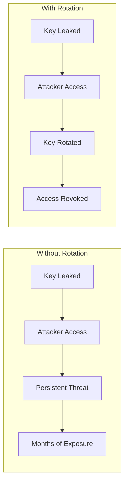
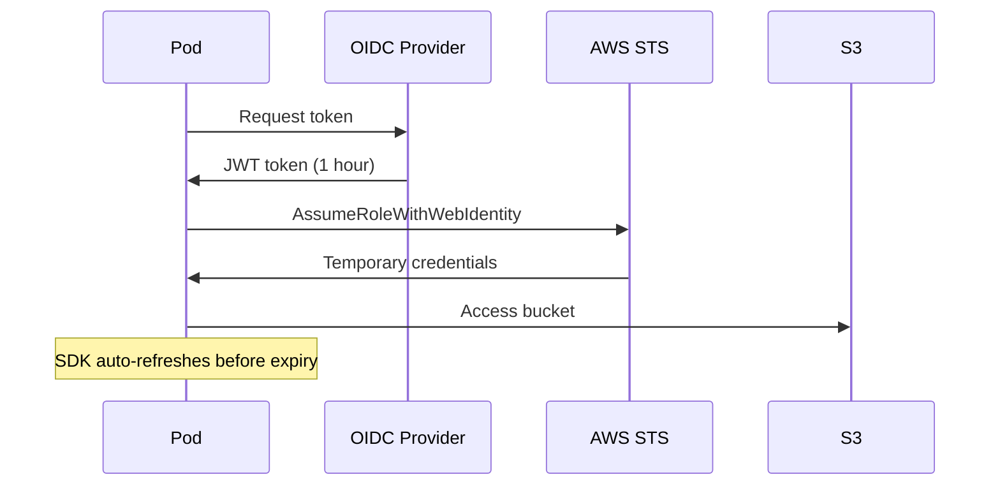
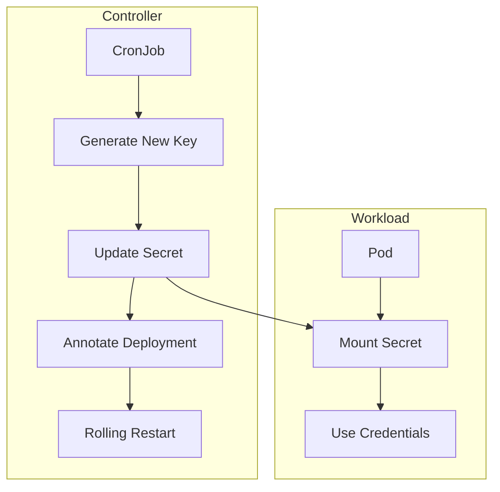

# How to Implement Service Account Rotation

Author: [nawazdhandala](https://github.com/nawazdhandala)

Tags: Security, Service Accounts, Kubernetes, Rotation

Description: Learn to implement service account rotation for workload identity management.

---

Service accounts are the identity backbone of workloads in Kubernetes and cloud environments. When a service account token gets compromised, attackers gain persistent access to your infrastructure. Rotating these credentials regularly limits the damage window and forces potential attackers to re-compromise your systems.

## Why Rotation Matters

Static credentials are a ticking time bomb. Consider what happens when a service account key leaks through a misconfigured CI/CD pipeline, a committed secret, or a compromised developer laptop. Without rotation, that key remains valid indefinitely.



Regular rotation transforms a potential long-term breach into a short-lived incident. Most compliance frameworks (SOC 2, PCI-DSS, HIPAA) require credential rotation as a baseline control.

## Kubernetes Service Account Token Rotation

Kubernetes 1.21+ introduced bound service account tokens with automatic expiration. These tokens are projected into pods and refreshed by the kubelet.

### Enable Bound Service Account Tokens

Check if your cluster supports bound tokens by examining the token mount in a running pod.

```bash
# Check the token projection in a pod
kubectl get pod <pod-name> -o yaml | grep -A 10 "serviceAccountToken"
```

For clusters running older versions or custom configurations, enable the feature flags on the API server.

```yaml
# kube-apiserver configuration
apiVersion: v1
kind: Pod
metadata:
  name: kube-apiserver
spec:
  containers:
    - name: kube-apiserver
      command:
        - kube-apiserver
        # Enable bound service account tokens
        - --service-account-issuer=https://kubernetes.default.svc
        - --service-account-signing-key-file=/etc/kubernetes/pki/sa.key
        # Set token expiration (default: 1 hour)
        - --service-account-max-token-expiration=3600s
```

### Configure Token Expiration Per Pod

Override the default expiration for specific workloads using projected volumes. This approach lets you set shorter lifetimes for sensitive workloads.

```yaml
apiVersion: v1
kind: Pod
metadata:
  name: secure-workload
spec:
  serviceAccountName: app-service-account
  containers:
    - name: app
      image: myapp:latest
      volumeMounts:
        - name: token
          mountPath: /var/run/secrets/tokens
          readOnly: true
  volumes:
    - name: token
      projected:
        sources:
          - serviceAccountToken:
              # Token valid for 10 minutes
              expirationSeconds: 600
              # Audience claim for token validation
              audience: api.mycompany.com
              path: token
```

### Handle Token Refresh in Applications

Applications must detect and reload tokens before expiration. The kubelet refreshes tokens at 80% of their lifetime, but your application needs to re-read the file.

```python
# Python example: Watch for token file changes
import os
import time
from watchdog.observers import Observer
from watchdog.events import FileSystemEventHandler

class TokenReloader(FileSystemEventHandler):
    def __init__(self, token_path):
        self.token_path = token_path
        self.token = self._read_token()

    def _read_token(self):
        """Read the current token from the projected volume."""
        with open(self.token_path, 'r') as f:
            return f.read().strip()

    def on_modified(self, event):
        """Reload token when the file changes."""
        if event.src_path == self.token_path:
            self.token = self._read_token()
            print("Token refreshed")

    def get_token(self):
        """Return the current valid token."""
        return self.token

# Set up the watcher
token_path = '/var/run/secrets/tokens/token'
reloader = TokenReloader(token_path)

observer = Observer()
observer.schedule(reloader, os.path.dirname(token_path), recursive=False)
observer.start()
```

## Cloud Provider Service Account Rotation

Cloud providers like AWS, GCP, and Azure have their own service account mechanisms. Each requires a different rotation strategy.

### AWS IAM Role Rotation with IRSA

AWS IAM Roles for Service Accounts (IRSA) uses short-lived tokens by default. The token refreshes automatically, but you should verify the configuration.

```yaml
# ServiceAccount with IRSA annotation
apiVersion: v1
kind: ServiceAccount
metadata:
  name: s3-reader
  annotations:
    # Link to IAM role for automatic credential injection
    eks.amazonaws.com/role-arn: arn:aws:iam::123456789012:role/s3-reader-role
    # Token expiration (optional, default 86400 seconds)
    eks.amazonaws.com/token-expiration: "3600"
```

The AWS SDK automatically handles token refresh through the credential chain.



### GCP Workload Identity Rotation

GCP Workload Identity provides automatic credential rotation through metadata server integration.

```yaml
# ServiceAccount with GCP Workload Identity
apiVersion: v1
kind: ServiceAccount
metadata:
  name: gcs-writer
  annotations:
    # Bind to GCP service account
    iam.gke.io/gcp-service-account: gcs-writer@project-id.iam.gserviceaccount.com
```

Configure the GCP service account to trust the Kubernetes service account.

```bash
# Allow the Kubernetes SA to impersonate the GCP SA
gcloud iam service-accounts add-iam-policy-binding \
  gcs-writer@project-id.iam.gserviceaccount.com \
  --role roles/iam.workloadIdentityUser \
  --member "serviceAccount:project-id.svc.id.goog[namespace/gcs-writer]"
```

## Implementing a Rotation Controller

For service accounts that cannot use workload identity, build an automated rotation controller. This controller generates new credentials, updates secrets, and triggers pod restarts.

### Rotation Architecture



### Rotation Script

This script rotates a service account key and updates the corresponding Kubernetes secret.

```bash
#!/bin/bash
# rotate-sa-key.sh - Rotate service account keys

set -euo pipefail

NAMESPACE="${NAMESPACE:-default}"
SECRET_NAME="${SECRET_NAME:-sa-credentials}"
SA_EMAIL="${SA_EMAIL:-myapp@project.iam.gserviceaccount.com}"

# Generate new key
echo "Creating new service account key..."
NEW_KEY=$(gcloud iam service-accounts keys create /dev/stdout \
  --iam-account="$SA_EMAIL" \
  --key-file-type=json 2>/dev/null)

# Extract key ID for tracking
KEY_ID=$(echo "$NEW_KEY" | jq -r '.private_key_id')

# Update Kubernetes secret
echo "Updating secret $SECRET_NAME..."
kubectl create secret generic "$SECRET_NAME" \
  --namespace="$NAMESPACE" \
  --from-literal=key.json="$NEW_KEY" \
  --dry-run=client -o yaml | kubectl apply -f -

# Annotate secret with rotation timestamp
kubectl annotate secret "$SECRET_NAME" \
  --namespace="$NAMESPACE" \
  --overwrite \
  rotation-timestamp="$(date -u +%Y-%m-%dT%H:%M:%SZ)" \
  key-id="$KEY_ID"

# List old keys and delete (keep only 2 most recent)
echo "Cleaning up old keys..."
OLD_KEYS=$(gcloud iam service-accounts keys list \
  --iam-account="$SA_EMAIL" \
  --format="value(name)" | tail -n +3)

for key in $OLD_KEYS; do
  gcloud iam service-accounts keys delete "$key" \
    --iam-account="$SA_EMAIL" --quiet
  echo "Deleted old key: $key"
done

echo "Rotation complete. New key ID: $KEY_ID"
```

### Deploy as CronJob

Schedule the rotation script to run regularly using a Kubernetes CronJob.

```yaml
apiVersion: batch/v1
kind: CronJob
metadata:
  name: sa-key-rotation
spec:
  # Run every 24 hours at midnight
  schedule: "0 0 * * *"
  jobTemplate:
    spec:
      template:
        spec:
          serviceAccountName: rotation-controller
          containers:
            - name: rotator
              image: gcr.io/google.com/cloudsdktool/cloud-sdk:slim
              command:
                - /scripts/rotate-sa-key.sh
              env:
                - name: NAMESPACE
                  valueFrom:
                    fieldRef:
                      fieldPath: metadata.namespace
                - name: SECRET_NAME
                  value: app-sa-credentials
                - name: SA_EMAIL
                  value: myapp@project.iam.gserviceaccount.com
              volumeMounts:
                - name: scripts
                  mountPath: /scripts
          volumes:
            - name: scripts
              configMap:
                name: rotation-scripts
                defaultMode: 0755
          restartPolicy: OnFailure
```

## Triggering Pod Restarts After Rotation

Pods do not automatically reload secrets. Use one of these strategies to pick up new credentials.

### Strategy 1: Deployment Annotation Trigger

Add a timestamp annotation to force a rolling restart.

```bash
# Trigger restart by updating annotation
kubectl patch deployment myapp \
  -p "{\"spec\":{\"template\":{\"metadata\":{\"annotations\":{\"rotation-trigger\":\"$(date +%s)\"}}}}}"
```

### Strategy 2: Reloader Controller

Deploy Stakater Reloader to watch for secret changes and automatically restart pods.

```yaml
# Annotate deployment to watch specific secret
apiVersion: apps/v1
kind: Deployment
metadata:
  name: myapp
  annotations:
    # Reloader watches this secret
    secret.reloader.stakater.com/reload: "app-sa-credentials"
spec:
  template:
    spec:
      containers:
        - name: app
          volumeMounts:
            - name: creds
              mountPath: /var/run/secrets/sa
      volumes:
        - name: creds
          secret:
            secretName: app-sa-credentials
```

## Monitoring Rotation Health

Track rotation metrics to catch failures early.

```yaml
# PrometheusRule for rotation monitoring
apiVersion: monitoring.coreos.com/v1
kind: PrometheusRule
metadata:
  name: sa-rotation-alerts
spec:
  groups:
    - name: sa-rotation
      rules:
        - alert: ServiceAccountKeyStale
          # Alert if key is older than 48 hours
          expr: |
            time() - kube_secret_annotations{
              annotation_rotation_timestamp!=""
            } > 172800
          for: 1h
          labels:
            severity: warning
          annotations:
            summary: "Service account key not rotated"
            description: "Secret {{ $labels.secret }} has not been rotated in 48+ hours"
```

## Rotation Checklist

Before implementing rotation, verify these prerequisites:

- Applications handle credential refresh without restart
- Monitoring alerts on rotation failures
- Old keys are cleaned up to prevent accumulation
- Rotation frequency meets compliance requirements
- Rollback procedure documented for failed rotations

---

Service account rotation is not a one-time setup. It requires ongoing attention to token lifetimes, application compatibility, and monitoring. Start with Kubernetes bound tokens for in-cluster communication, use workload identity for cloud resources, and build automation for everything else. The goal is making rotation so routine that a compromised credential becomes a minor incident rather than a major breach.
