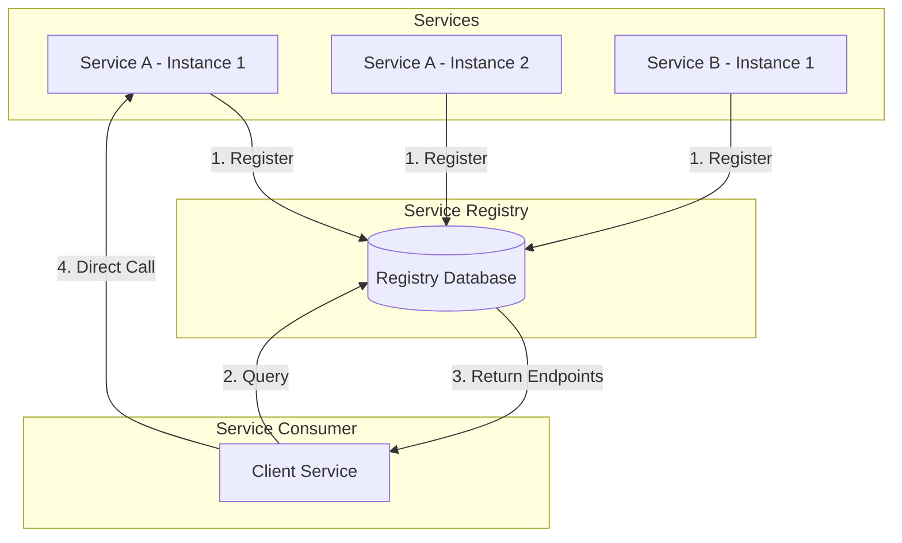
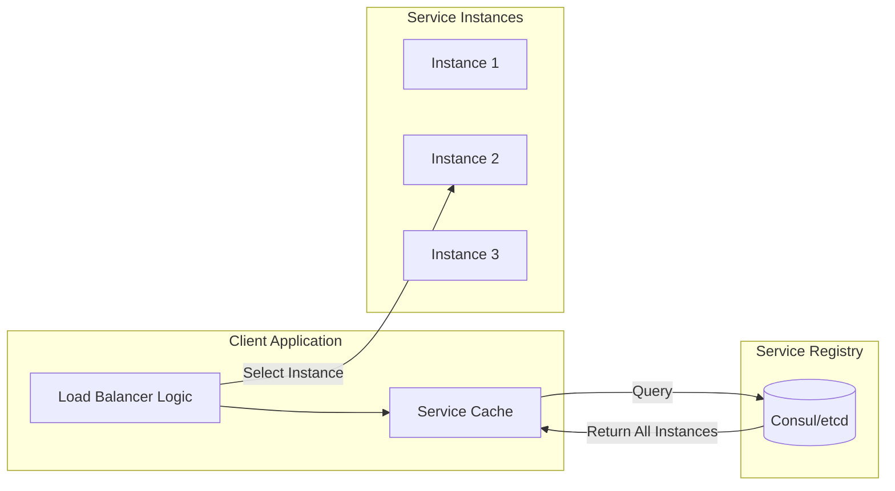
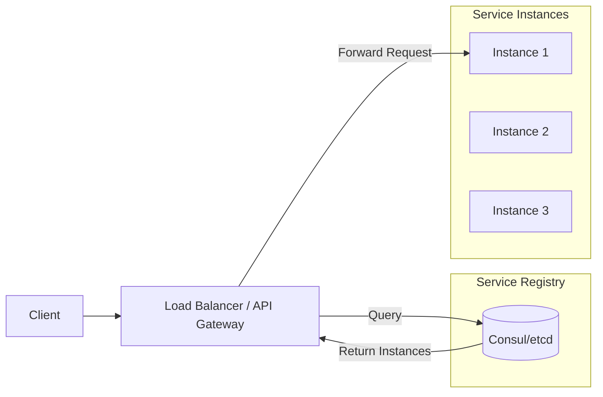
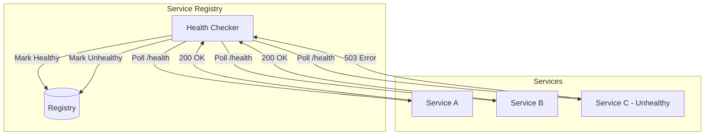
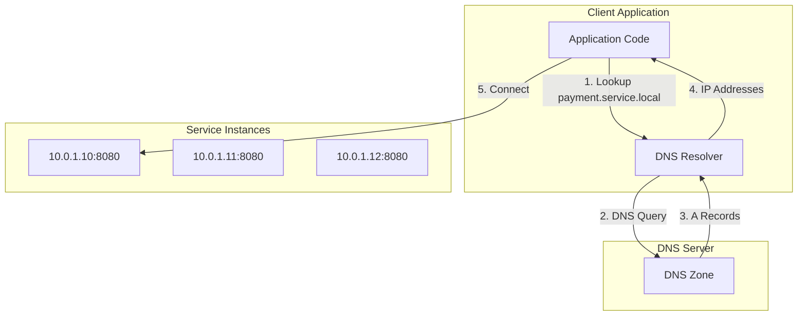

# How to Create Service Discovery Patterns

Author: [nawazdhandala](https://github.com/nawazdhandala)

Tags: Microservices, ServiceDiscovery, Architecture, Patterns

Description: A practical guide to implementing service discovery patterns in microservices architectures for reliable and scalable communication.

---

In a microservices architecture, services come and go. Instances scale up, scale down, fail, and restart. Hardcoding IP addresses and ports is a recipe for disaster. Service discovery solves this by providing a dynamic registry where services can find each other.

## Why Service Discovery Matters

Traditional monolithic applications communicate internally. Microservices communicate over the network. This creates challenges:

- Services have dynamic network locations
- Instances scale horizontally
- Failures happen constantly
- Load balancing must be dynamic

Service discovery addresses all of these by maintaining a real-time map of what services exist and where they live.

## Service Discovery Flow Overview



## Client-Side vs Server-Side Discovery

There are two fundamental patterns for service discovery. Each has trade-offs.

### Client-Side Discovery

In client-side discovery, the client queries the service registry directly and selects an available instance.



**Advantages:**
- Fewer network hops
- Client can implement custom load balancing
- No single point of failure at the load balancer

**Disadvantages:**
- Client logic becomes complex
- Each client language needs discovery implementation
- Tight coupling to registry

### Server-Side Discovery

In server-side discovery, the client sends requests to a load balancer, which queries the registry and forwards the request.



**Advantages:**
- Clients remain simple
- Centralized load balancing logic
- Language agnostic

**Disadvantages:**
- Additional network hop
- Load balancer can become a bottleneck
- Requires high availability for the load balancer

## Service Registry Patterns

The service registry is the heart of service discovery. Let's explore two popular options.

### HashiCorp Consul

Consul provides service discovery, health checking, and a distributed key-value store.

#### Registering a Service with Consul

```json
// service-definition.json
// This file defines how our service registers with Consul
{
  "service": {
    "name": "payment-service",
    "id": "payment-service-1",
    "port": 8080,
    "tags": ["v1", "production"],
    "check": {
      "http": "http://localhost:8080/health",
      "interval": "10s",
      "timeout": "5s"
    }
  }
}
```

```bash
# Register the service using Consul's HTTP API
curl --request PUT \
  --data @service-definition.json \
  http://localhost:8500/v1/agent/service/register
```

#### Querying Services from Consul

```javascript
// consul-client.js
// Node.js example for discovering services via Consul

const Consul = require('consul');

// Initialize the Consul client
// By default connects to localhost:8500
const consul = new Consul();

async function discoverService(serviceName) {
  try {
    // Query Consul for healthy instances of the service
    // The 'passing' option filters to only healthy instances
    const services = await consul.health.service({
      service: serviceName,
      passing: true  // Only return instances passing health checks
    });

    // Extract connection details from the response
    // Each entry contains the service address and port
    const instances = services.map(entry => ({
      address: entry.Service.Address,
      port: entry.Service.Port,
      tags: entry.Service.Tags
    }));

    return instances;
  } catch (error) {
    console.error(`Failed to discover ${serviceName}:`, error);
    throw error;
  }
}

// Example: Find all payment service instances
async function callPaymentService() {
  const instances = await discoverService('payment-service');

  if (instances.length === 0) {
    throw new Error('No payment service instances available');
  }

  // Simple round-robin: pick a random instance
  const instance = instances[Math.floor(Math.random() * instances.length)];

  // Make the actual HTTP call to the selected instance
  const url = `http://${instance.address}:${instance.port}/api/process`;
  console.log(`Calling payment service at ${url}`);

  // ... make HTTP request
}
```

#### Consul with Python

```python
# consul_discovery.py
# Python implementation of service discovery with Consul

import consul
import random

class ServiceDiscovery:
    def __init__(self, consul_host='localhost', consul_port=8500):
        # Create Consul client connection
        self.consul = consul.Consul(host=consul_host, port=consul_port)

    def register_service(self, name, service_id, port, health_endpoint):
        """
        Register this service instance with Consul.
        Called during application startup.
        """
        # Define the health check configuration
        # Consul will poll this endpoint to verify service health
        check = consul.Check.http(
            url=f'http://localhost:{port}{health_endpoint}',
            interval='10s',  # Check every 10 seconds
            timeout='5s'     # Timeout after 5 seconds
        )

        # Register the service with Consul
        self.consul.agent.service.register(
            name=name,
            service_id=service_id,
            port=port,
            check=check
        )
        print(f"Registered {name} ({service_id}) on port {port}")

    def deregister_service(self, service_id):
        """
        Remove this service from Consul.
        Called during graceful shutdown.
        """
        self.consul.agent.service.deregister(service_id)
        print(f"Deregistered {service_id}")

    def discover(self, service_name):
        """
        Find all healthy instances of a service.
        Returns a list of (address, port) tuples.
        """
        # Query the Consul catalog for the service
        # index is used for blocking queries (long polling)
        index, services = self.consul.health.service(
            service_name,
            passing=True  # Filter to healthy instances only
        )

        # Extract address and port from each service entry
        instances = []
        for service in services:
            address = service['Service']['Address']
            port = service['Service']['Port']
            instances.append((address, port))

        return instances

    def get_instance(self, service_name):
        """
        Get a single instance using round-robin selection.
        In production, consider more sophisticated load balancing.
        """
        instances = self.discover(service_name)

        if not instances:
            raise Exception(f"No healthy instances of {service_name}")

        # Random selection for basic load distribution
        return random.choice(instances)


# Usage example
if __name__ == '__main__':
    discovery = ServiceDiscovery()

    # Register ourselves
    discovery.register_service(
        name='order-service',
        service_id='order-service-1',
        port=8081,
        health_endpoint='/health'
    )

    # Discover another service
    address, port = discovery.get_instance('payment-service')
    print(f"Found payment service at {address}:{port}")
```

### etcd for Service Discovery

etcd is a distributed key-value store that can serve as a service registry.

#### Registering Services with etcd

```python
# etcd_discovery.py
# Service discovery implementation using etcd

import etcd3
import json
import threading
import time

class EtcdServiceRegistry:
    def __init__(self, host='localhost', port=2379):
        # Connect to the etcd cluster
        self.client = etcd3.client(host=host, port=port)
        self.lease = None
        self.keep_alive_thread = None

    def register(self, service_name, instance_id, host, port, ttl=30):
        """
        Register a service instance with etcd.
        Uses a lease to automatically remove the registration
        if the service stops sending heartbeats.
        """
        # Create a lease that expires after ttl seconds
        # The service must refresh this lease to stay registered
        self.lease = self.client.lease(ttl)

        # Build the key path: /services/{service_name}/{instance_id}
        key = f'/services/{service_name}/{instance_id}'

        # Store service metadata as JSON
        value = json.dumps({
            'host': host,
            'port': port,
            'registered_at': time.time()
        })

        # Put the key with the lease attached
        # When the lease expires, this key is automatically deleted
        self.client.put(key, value, lease=self.lease)

        # Start background thread to keep the lease alive
        self._start_keep_alive()

        print(f"Registered {service_name}/{instance_id} at {host}:{port}")

    def _start_keep_alive(self):
        """
        Start a background thread that refreshes the lease.
        This keeps the service registered as long as it's running.
        """
        def keep_alive():
            while self.lease:
                try:
                    # Refresh the lease before it expires
                    self.lease.refresh()
                    time.sleep(10)  # Refresh every 10 seconds
                except Exception as e:
                    print(f"Failed to refresh lease: {e}")
                    break

        self.keep_alive_thread = threading.Thread(target=keep_alive, daemon=True)
        self.keep_alive_thread.start()

    def deregister(self, service_name, instance_id):
        """
        Explicitly remove a service registration.
        Called during graceful shutdown.
        """
        key = f'/services/{service_name}/{instance_id}'
        self.client.delete(key)

        # Revoke the lease to clean up
        if self.lease:
            self.lease.revoke()
            self.lease = None

        print(f"Deregistered {service_name}/{instance_id}")

    def discover(self, service_name):
        """
        Find all registered instances of a service.
        Returns a list of instance metadata dictionaries.
        """
        # Get all keys under the service prefix
        prefix = f'/services/{service_name}/'

        instances = []
        # range_response returns all keys with the given prefix
        for value, metadata in self.client.get_prefix(prefix):
            if value:
                instance_data = json.loads(value.decode('utf-8'))
                instances.append(instance_data)

        return instances

    def watch(self, service_name, callback):
        """
        Watch for changes to a service's instances.
        Calls the callback function when instances are added or removed.
        """
        prefix = f'/services/{service_name}/'

        # watch_prefix returns an iterator of events
        events_iterator, cancel = self.client.watch_prefix(prefix)

        def watch_thread():
            for event in events_iterator:
                # Determine if this was an add or delete
                if isinstance(event, etcd3.events.PutEvent):
                    callback('added', json.loads(event.value.decode('utf-8')))
                elif isinstance(event, etcd3.events.DeleteEvent):
                    callback('removed', event.key.decode('utf-8'))

        thread = threading.Thread(target=watch_thread, daemon=True)
        thread.start()

        return cancel  # Return function to stop watching


# Usage example
if __name__ == '__main__':
    registry = EtcdServiceRegistry()

    # Register our service
    registry.register(
        service_name='user-service',
        instance_id='user-service-1',
        host='192.168.1.10',
        port=8080,
        ttl=30
    )

    # Discover other services
    instances = registry.discover('payment-service')
    for instance in instances:
        print(f"Found: {instance['host']}:{instance['port']}")
```

## Health Checking Integration

Health checks ensure the registry only returns healthy instances. There are two approaches: active and passive.

### Active Health Checks

The registry actively polls each service to check its health.



### Implementing Health Endpoints

```javascript
// health-endpoint.js
// Express.js health check endpoint implementation

const express = require('express');
const app = express();

// Track application state
let isReady = false;
let isHealthy = true;

// Dependencies we need to check
const dependencies = {
  database: null,
  cache: null
};

// Liveness probe: Is the process running?
// Kubernetes uses this to know if it should restart the container
app.get('/health/live', (req, res) => {
  // If we can respond at all, we're alive
  res.status(200).json({ status: 'alive' });
});

// Readiness probe: Can we accept traffic?
// Kubernetes uses this to know if it should route traffic to us
app.get('/health/ready', async (req, res) => {
  const checks = {
    database: false,
    cache: false
  };

  try {
    // Check database connectivity
    await dependencies.database.ping();
    checks.database = true;
  } catch (e) {
    console.error('Database health check failed:', e.message);
  }

  try {
    // Check cache connectivity
    await dependencies.cache.ping();
    checks.cache = true;
  } catch (e) {
    console.error('Cache health check failed:', e.message);
  }

  // Only ready if all dependencies are healthy
  const allHealthy = Object.values(checks).every(v => v === true);

  if (allHealthy && isReady) {
    res.status(200).json({ status: 'ready', checks });
  } else {
    res.status(503).json({ status: 'not ready', checks });
  }
});

// Detailed health check for monitoring systems
app.get('/health', async (req, res) => {
  const health = {
    status: 'healthy',
    timestamp: new Date().toISOString(),
    uptime: process.uptime(),
    checks: {}
  };

  // Check each dependency
  for (const [name, client] of Object.entries(dependencies)) {
    try {
      const start = Date.now();
      await client.ping();
      health.checks[name] = {
        status: 'healthy',
        latency_ms: Date.now() - start
      };
    } catch (error) {
      health.status = 'degraded';
      health.checks[name] = {
        status: 'unhealthy',
        error: error.message
      };
    }
  }

  const statusCode = health.status === 'healthy' ? 200 : 503;
  res.status(statusCode).json(health);
});

// Graceful shutdown handler
process.on('SIGTERM', () => {
  console.log('SIGTERM received, starting graceful shutdown');

  // Stop accepting new traffic
  isReady = false;

  // Give time for load balancer to stop sending traffic
  setTimeout(() => {
    // Close connections and exit
    process.exit(0);
  }, 10000);
});
```

### Passive Health Checks (Circuit Breaker Pattern)

Track request success/failure rates and remove unhealthy instances.

```python
# circuit_breaker.py
# Circuit breaker implementation for passive health checking

import time
from enum import Enum
from collections import deque

class CircuitState(Enum):
    CLOSED = 'closed'      # Normal operation
    OPEN = 'open'          # Failing, reject requests
    HALF_OPEN = 'half_open'  # Testing if service recovered

class CircuitBreaker:
    def __init__(
        self,
        failure_threshold=5,     # Failures before opening
        success_threshold=3,     # Successes to close from half-open
        timeout=30,              # Seconds before trying again
        window_size=10           # Number of requests to track
    ):
        self.failure_threshold = failure_threshold
        self.success_threshold = success_threshold
        self.timeout = timeout
        self.window_size = window_size

        self.state = CircuitState.CLOSED
        self.failures = 0
        self.successes = 0
        self.last_failure_time = None

        # Track recent request outcomes for metrics
        self.request_history = deque(maxlen=window_size)

    def can_execute(self):
        """
        Check if a request should be allowed through.
        """
        if self.state == CircuitState.CLOSED:
            return True

        if self.state == CircuitState.OPEN:
            # Check if timeout has elapsed
            if time.time() - self.last_failure_time >= self.timeout:
                # Transition to half-open to test the service
                self.state = CircuitState.HALF_OPEN
                self.successes = 0
                return True
            return False

        if self.state == CircuitState.HALF_OPEN:
            # Allow limited requests through for testing
            return True

        return False

    def record_success(self):
        """
        Record a successful request.
        """
        self.request_history.append(True)

        if self.state == CircuitState.HALF_OPEN:
            self.successes += 1
            if self.successes >= self.success_threshold:
                # Service has recovered, close the circuit
                self.state = CircuitState.CLOSED
                self.failures = 0
                print("Circuit breaker closed - service recovered")

    def record_failure(self):
        """
        Record a failed request.
        """
        self.request_history.append(False)
        self.last_failure_time = time.time()

        if self.state == CircuitState.HALF_OPEN:
            # Failed during recovery test, open again
            self.state = CircuitState.OPEN
            print("Circuit breaker opened - service still failing")

        elif self.state == CircuitState.CLOSED:
            self.failures += 1
            if self.failures >= self.failure_threshold:
                # Too many failures, open the circuit
                self.state = CircuitState.OPEN
                print("Circuit breaker opened - failure threshold reached")

    def get_stats(self):
        """
        Return current circuit breaker statistics.
        """
        if not self.request_history:
            return {'state': self.state.value, 'success_rate': 1.0}

        success_count = sum(1 for r in self.request_history if r)
        success_rate = success_count / len(self.request_history)

        return {
            'state': self.state.value,
            'success_rate': success_rate,
            'failures': self.failures,
            'total_requests': len(self.request_history)
        }


class ServiceClient:
    """
    HTTP client with circuit breaker integration.
    """
    def __init__(self, service_name, discovery_client):
        self.service_name = service_name
        self.discovery = discovery_client

        # Maintain a circuit breaker per instance
        self.circuit_breakers = {}

    def _get_circuit_breaker(self, instance_key):
        if instance_key not in self.circuit_breakers:
            self.circuit_breakers[instance_key] = CircuitBreaker()
        return self.circuit_breakers[instance_key]

    async def call(self, path, method='GET', **kwargs):
        """
        Make a request to the service with circuit breaker protection.
        """
        instances = self.discovery.discover(self.service_name)

        # Filter to instances with closed or half-open circuits
        available = []
        for instance in instances:
            key = f"{instance['host']}:{instance['port']}"
            cb = self._get_circuit_breaker(key)
            if cb.can_execute():
                available.append((instance, cb))

        if not available:
            raise Exception(f"No healthy instances of {self.service_name}")

        # Select an instance (round-robin, random, etc.)
        import random
        instance, circuit_breaker = random.choice(available)

        url = f"http://{instance['host']}:{instance['port']}{path}"

        try:
            # Make the actual HTTP request
            import aiohttp
            async with aiohttp.ClientSession() as session:
                async with session.request(method, url, **kwargs) as response:
                    if response.status >= 500:
                        circuit_breaker.record_failure()
                        raise Exception(f"Server error: {response.status}")

                    circuit_breaker.record_success()
                    return await response.json()

        except Exception as e:
            circuit_breaker.record_failure()
            raise
```

## DNS-Based Service Discovery

DNS provides a simple, universal mechanism for service discovery. Every programming language supports DNS lookups.

### How DNS Service Discovery Works



### Kubernetes DNS Service Discovery

Kubernetes provides built-in DNS for services.

```yaml
# payment-service.yaml
# Kubernetes Service creates DNS entries automatically
apiVersion: v1
kind: Service
metadata:
  name: payment-service
  namespace: production
spec:
  selector:
    app: payment
  ports:
    - port: 80
      targetPort: 8080
  # ClusterIP creates an internal DNS entry
  type: ClusterIP
```

```python
# kubernetes_dns_discovery.py
# Using Kubernetes DNS for service discovery

import socket
import os

class KubernetesDNSDiscovery:
    """
    Service discovery using Kubernetes DNS.
    No external dependencies required - uses built-in DNS.
    """

    def __init__(self, namespace=None):
        # Use current namespace if not specified
        self.namespace = namespace or self._get_current_namespace()

    def _get_current_namespace(self):
        """
        Read the namespace from the mounted service account.
        """
        try:
            with open('/var/run/secrets/kubernetes.io/serviceaccount/namespace') as f:
                return f.read().strip()
        except FileNotFoundError:
            return 'default'

    def get_service_url(self, service_name, port=80):
        """
        Get the URL for a service using Kubernetes DNS.

        DNS format: {service}.{namespace}.svc.cluster.local
        """
        # Short name works within the same namespace
        if self.namespace:
            hostname = f"{service_name}.{self.namespace}.svc.cluster.local"
        else:
            hostname = service_name

        return f"http://{hostname}:{port}"

    def resolve_service(self, service_name):
        """
        Resolve a service name to IP addresses.
        Returns all pod IPs for headless services.
        """
        hostname = f"{service_name}.{self.namespace}.svc.cluster.local"

        try:
            # getaddrinfo returns all IP addresses
            results = socket.getaddrinfo(
                hostname,
                None,
                socket.AF_INET,
                socket.SOCK_STREAM
            )

            # Extract unique IP addresses
            ips = list(set(result[4][0] for result in results))
            return ips

        except socket.gaierror as e:
            print(f"DNS resolution failed for {hostname}: {e}")
            return []

    def resolve_headless_service(self, service_name):
        """
        Resolve a headless service to get all pod IPs.
        Headless services return A records for each pod.
        """
        return self.resolve_service(service_name)


# Usage in a Kubernetes pod
if __name__ == '__main__':
    discovery = KubernetesDNSDiscovery()

    # Simple URL-based discovery
    payment_url = discovery.get_service_url('payment-service', port=8080)
    print(f"Payment service URL: {payment_url}")
    # Output: http://payment-service.production.svc.cluster.local:8080

    # Direct IP resolution for load balancing
    ips = discovery.resolve_headless_service('payment-service-headless')
    for ip in ips:
        print(f"Pod IP: {ip}")
```

### Headless Services for Direct Pod Access

```yaml
# headless-service.yaml
# Headless service returns pod IPs directly instead of a cluster IP
apiVersion: v1
kind: Service
metadata:
  name: payment-service-headless
  namespace: production
spec:
  # clusterIP: None makes this a headless service
  # DNS queries return all pod IPs instead of a single cluster IP
  clusterIP: None
  selector:
    app: payment
  ports:
    - port: 8080
      targetPort: 8080
```

```bash
# DNS lookup for headless service returns all pod IPs
# Regular service returns single cluster IP
# Headless service returns multiple pod IPs

# From inside a Kubernetes pod:
nslookup payment-service-headless.production.svc.cluster.local

# Output:
# Name:    payment-service-headless.production.svc.cluster.local
# Address: 10.244.1.5
# Address: 10.244.2.8
# Address: 10.244.3.12
```

### SRV Records for Port Discovery

SRV records include both host and port information.

```python
# srv_discovery.py
# Using SRV records for service discovery with port information

import dns.resolver

def discover_via_srv(service_name, namespace='production'):
    """
    Query SRV records to discover service instances with ports.

    SRV record format: _service._proto.name
    Returns: [(host, port, priority, weight), ...]
    """
    # Kubernetes SRV record format
    srv_name = f"_http._tcp.{service_name}.{namespace}.svc.cluster.local"

    try:
        # Query SRV records
        answers = dns.resolver.resolve(srv_name, 'SRV')

        instances = []
        for rdata in answers:
            instances.append({
                'host': str(rdata.target).rstrip('.'),
                'port': rdata.port,
                'priority': rdata.priority,
                'weight': rdata.weight
            })

        # Sort by priority (lower is better)
        instances.sort(key=lambda x: (x['priority'], -x['weight']))

        return instances

    except dns.resolver.NXDOMAIN:
        print(f"Service {service_name} not found")
        return []
    except dns.resolver.NoAnswer:
        print(f"No SRV records for {service_name}")
        return []


# Usage
instances = discover_via_srv('payment-service')
for instance in instances:
    print(f"Found: {instance['host']}:{instance['port']}")
```

## Putting It All Together

Here is a complete service discovery implementation combining multiple patterns.

```python
# service_discovery.py
# Complete service discovery implementation with fallback strategies

import os
import socket
import random
import time
from abc import ABC, abstractmethod
from typing import List, Dict, Optional

class ServiceInstance:
    """Represents a discovered service instance."""
    def __init__(self, host: str, port: int, metadata: Dict = None):
        self.host = host
        self.port = port
        self.metadata = metadata or {}
        self.healthy = True
        self.last_check = time.time()

    @property
    def url(self) -> str:
        return f"http://{self.host}:{self.port}"

    def __repr__(self):
        return f"ServiceInstance({self.host}:{self.port})"


class DiscoveryStrategy(ABC):
    """Abstract base class for discovery strategies."""

    @abstractmethod
    def discover(self, service_name: str) -> List[ServiceInstance]:
        pass

    @abstractmethod
    def register(self, service_name: str, instance: ServiceInstance):
        pass


class KubernetesDNSStrategy(DiscoveryStrategy):
    """Kubernetes DNS-based discovery."""

    def __init__(self):
        self.namespace = self._get_namespace()

    def _get_namespace(self) -> str:
        try:
            with open('/var/run/secrets/kubernetes.io/serviceaccount/namespace') as f:
                return f.read().strip()
        except FileNotFoundError:
            return os.environ.get('NAMESPACE', 'default')

    def discover(self, service_name: str) -> List[ServiceInstance]:
        hostname = f"{service_name}.{self.namespace}.svc.cluster.local"

        try:
            results = socket.getaddrinfo(hostname, None, socket.AF_INET)
            ips = list(set(r[4][0] for r in results))

            # Default port - in production, use SRV records or config
            return [ServiceInstance(ip, 8080) for ip in ips]
        except socket.gaierror:
            return []

    def register(self, service_name: str, instance: ServiceInstance):
        # Kubernetes handles registration via Pod/Service definitions
        pass


class ConsulStrategy(DiscoveryStrategy):
    """Consul-based discovery."""

    def __init__(self, consul_host='localhost', consul_port=8500):
        import consul
        self.client = consul.Consul(host=consul_host, port=consul_port)

    def discover(self, service_name: str) -> List[ServiceInstance]:
        _, services = self.client.health.service(service_name, passing=True)

        instances = []
        for svc in services:
            instances.append(ServiceInstance(
                host=svc['Service']['Address'],
                port=svc['Service']['Port'],
                metadata={'tags': svc['Service']['Tags']}
            ))

        return instances

    def register(self, service_name: str, instance: ServiceInstance):
        self.client.agent.service.register(
            name=service_name,
            address=instance.host,
            port=instance.port
        )


class ServiceDiscovery:
    """
    Main service discovery client with caching and load balancing.
    """

    def __init__(self, strategy: DiscoveryStrategy, cache_ttl: int = 30):
        self.strategy = strategy
        self.cache_ttl = cache_ttl
        self.cache: Dict[str, tuple] = {}  # service_name -> (instances, timestamp)

    def discover(self, service_name: str, use_cache: bool = True) -> List[ServiceInstance]:
        """
        Discover instances of a service.
        Uses cache if available and not expired.
        """
        # Check cache
        if use_cache and service_name in self.cache:
            instances, timestamp = self.cache[service_name]
            if time.time() - timestamp < self.cache_ttl:
                return instances

        # Fetch from registry
        instances = self.strategy.discover(service_name)

        # Update cache
        self.cache[service_name] = (instances, time.time())

        return instances

    def get_instance(self, service_name: str) -> Optional[ServiceInstance]:
        """
        Get a single healthy instance using round-robin.
        """
        instances = self.discover(service_name)
        healthy = [i for i in instances if i.healthy]

        if not healthy:
            return None

        return random.choice(healthy)

    def mark_unhealthy(self, instance: ServiceInstance):
        """
        Mark an instance as unhealthy after a failure.
        """
        instance.healthy = False
        instance.last_check = time.time()

    def mark_healthy(self, instance: ServiceInstance):
        """
        Mark an instance as healthy after successful request.
        """
        instance.healthy = True
        instance.last_check = time.time()


# Factory function to create appropriate strategy
def create_discovery() -> ServiceDiscovery:
    """
    Create a ServiceDiscovery instance based on environment.
    """
    # Detect environment and choose strategy
    if os.path.exists('/var/run/secrets/kubernetes.io/serviceaccount'):
        # Running in Kubernetes
        strategy = KubernetesDNSStrategy()
    elif os.environ.get('CONSUL_HTTP_ADDR'):
        # Consul available
        host, port = os.environ['CONSUL_HTTP_ADDR'].split(':')
        strategy = ConsulStrategy(host, int(port))
    else:
        # Default to Kubernetes DNS
        strategy = KubernetesDNSStrategy()

    return ServiceDiscovery(strategy)


# Usage example
if __name__ == '__main__':
    discovery = create_discovery()

    # Discover payment service
    instances = discovery.discover('payment-service')
    print(f"Found {len(instances)} instances")

    # Get a single instance for making a request
    instance = discovery.get_instance('payment-service')
    if instance:
        print(f"Using: {instance.url}")
```

## Summary

Service discovery is essential for microservices. Key takeaways:

- **Client-side discovery** gives you control but adds client complexity
- **Server-side discovery** keeps clients simple but adds infrastructure
- **Consul and etcd** are mature service registries with health checking
- **DNS-based discovery** works everywhere with zero dependencies
- **Health checks** ensure only healthy instances receive traffic
- **Circuit breakers** provide passive health detection and protect against cascading failures

Start simple with DNS in Kubernetes. Add Consul or etcd when you need cross-cluster discovery, advanced health checking, or configuration management. Always implement health endpoints and consider circuit breakers for resilience.
