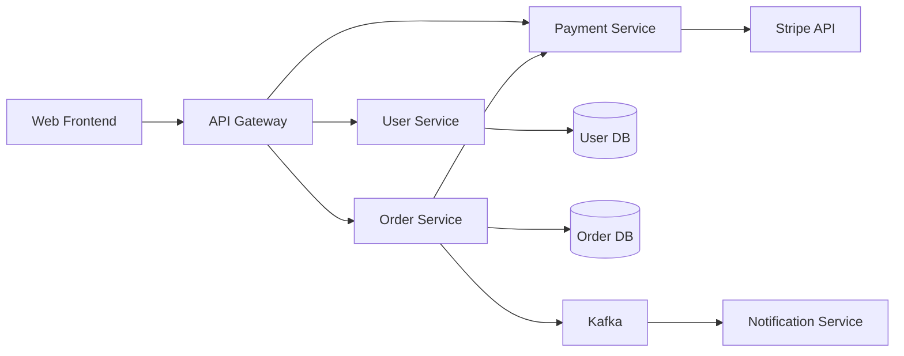
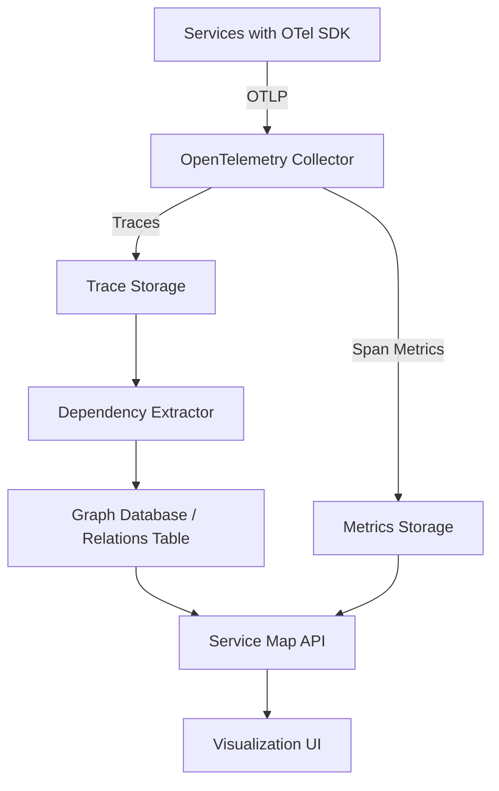
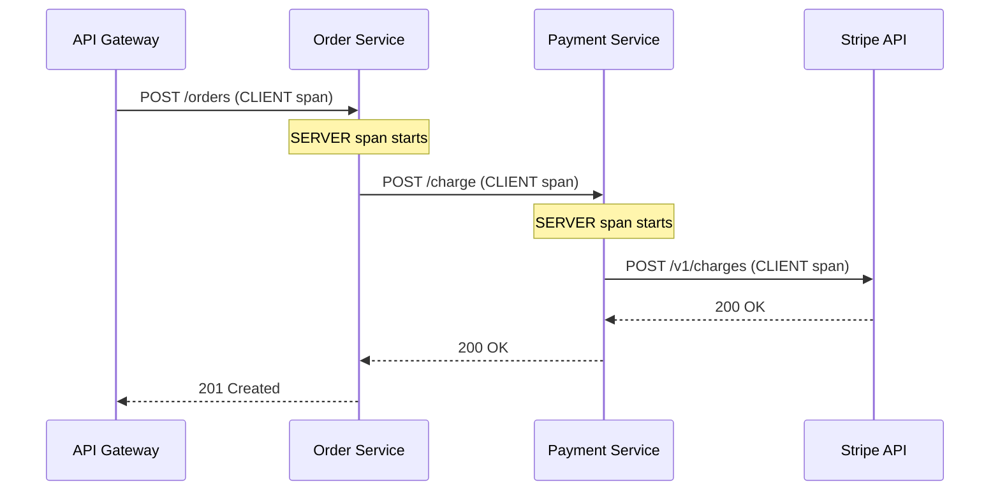

# How to Implement Service Maps

Author: [nawazdhandala](https://github.com/nawazdhandala)

Tags: Observability, Tracing, Microservices, DevOps

Description: A practical guide to building service maps that visualize your distributed system architecture, dependencies, and health in real time using OpenTelemetry and modern observability practices.

---

When an incident strikes, the first question is always: "What services are affected?" The second: "What depends on them?" Without a clear picture of your architecture, these questions turn into frantic Slack threads and tribal knowledge hunts. Service maps solve this by automatically visualizing how your services connect, communicate, and depend on each other.

This guide walks through what service maps are, why they matter, and how to implement them from scratch using OpenTelemetry traces, with practical code examples you can adapt for your own systems.

---

## Table of Contents

1. What is a Service Map?
2. Why Service Maps Matter
3. Data Sources for Service Maps
4. Architecture Overview
5. Setting Up OpenTelemetry for Service Discovery
6. Building the Service Map Data Model
7. Extracting Dependencies from Traces
8. Storing and Querying Service Relationships
9. Visualizing the Service Map
10. Adding Health and Metrics Overlays
11. Handling Dynamic and Ephemeral Services
12. Common Pitfalls and Best Practices
13. Putting It All Together

---

## 1. What is a Service Map?

A service map is a visual representation of your distributed system that shows:

- **Services**: The individual components of your application (APIs, databases, queues, third-party integrations)
- **Dependencies**: Which services call which other services
- **Traffic flow**: The direction and volume of requests between services
- **Health status**: Error rates, latency, and availability at each node and edge

Think of it as a live blueprint of your architecture that updates automatically as your system evolves.



---

## 2. Why Service Maps Matter

### Faster Incident Response

When the payment service starts timing out, a service map instantly shows you:
- Which upstream services are affected (Order Service, API Gateway, Web Frontend)
- Which downstream dependencies might be the cause (Stripe API, database)
- The blast radius of the issue

### Change Management

Before deploying changes to a service, you can see:
- Who consumes your API
- What will break if you change your contract
- Which teams need to be notified

### Architecture Documentation

Service maps are living documentation. They stay accurate because they are generated from real traffic, not outdated diagrams in Confluence.

### Capacity Planning

Traffic flow visualization helps identify:
- Hot paths that need scaling
- Underutilized services that could be consolidated
- Single points of failure

---

## 3. Data Sources for Service Maps

Service maps can be built from several data sources:

| Source | Pros | Cons |
|--------|------|------|
| Distributed Traces | Accurate, real-time, shows actual traffic patterns | Requires instrumentation, sampling affects completeness |
| Service Mesh (Istio, Linkerd) | No code changes, automatic discovery | Only captures network-level calls, misses in-process deps |
| APM Agents | Deep visibility, easy setup | Often proprietary, vendor lock-in |
| Manual Registration | Full control, can include non-instrumented services | Quickly becomes stale, maintenance burden |
| Infrastructure Scanning | Discovers unknown services | Surface-level, misses application semantics |

The most robust approach combines **distributed traces** (for application-level dependencies) with **service catalog entries** (for metadata like ownership and runbooks).

---

## 4. Architecture Overview

Here is how a typical service map pipeline works:



The key components:

1. **Instrumented Services**: Emit spans with service names and relationship data
2. **Collector**: Aggregates and processes telemetry
3. **Dependency Extractor**: Analyzes traces to discover service-to-service relationships
4. **Graph Storage**: Stores the service dependency graph
5. **API Layer**: Serves the map data with health overlays
6. **Visualization**: Renders the interactive map

---

## 5. Setting Up OpenTelemetry for Service Discovery

The foundation of automatic service maps is proper trace instrumentation. Each service must:

1. Identify itself with a consistent `service.name`
2. Propagate trace context to downstream calls
3. Record span kind (CLIENT/SERVER) to establish directionality

### Installing dependencies

```bash
npm install @opentelemetry/api \
            @opentelemetry/sdk-node \
            @opentelemetry/auto-instrumentations-node \
            @opentelemetry/exporter-otlp-http \
            @opentelemetry/resources \
            @opentelemetry/semantic-conventions
```

### Telemetry initialization (telemetry.ts)

This file sets up the OpenTelemetry SDK with proper service identification and exports traces to your backend.

```typescript
// telemetry.ts
import { NodeSDK } from '@opentelemetry/sdk-node';
import { getNodeAutoInstrumentations } from '@opentelemetry/auto-instrumentations-node';
import { OTLPTraceExporter } from '@opentelemetry/exporter-otlp-http';
import { Resource } from '@opentelemetry/resources';
import {
  ATTR_SERVICE_NAME,
  ATTR_SERVICE_VERSION,
  ATTR_DEPLOYMENT_ENVIRONMENT,
} from '@opentelemetry/semantic-conventions';

// Configure the OTLP exporter to send traces to your observability backend
const traceExporter = new OTLPTraceExporter({
  url: process.env.OTEL_EXPORTER_OTLP_ENDPOINT || 'https://oneuptime.com/otlp/v1/traces',
  headers: {
    'x-oneuptime-token': process.env.ONEUPTIME_TOKEN || '',
  },
});

// The service name is critical for service map generation
// Use a consistent naming convention across all services
const sdk = new NodeSDK({
  traceExporter,
  resource: new Resource({
    [ATTR_SERVICE_NAME]: process.env.SERVICE_NAME || 'unknown-service',
    [ATTR_SERVICE_VERSION]: process.env.SERVICE_VERSION || '1.0.0',
    [ATTR_DEPLOYMENT_ENVIRONMENT]: process.env.NODE_ENV || 'development',
  }),
  instrumentations: [
    getNodeAutoInstrumentations({
      // Enable HTTP instrumentation to capture inter-service calls
      '@opentelemetry/instrumentation-http': {
        enabled: true,
      },
      // Enable database instrumentation to capture DB dependencies
      '@opentelemetry/instrumentation-pg': {
        enabled: true,
      },
    }),
  ],
});

sdk.start();

// Graceful shutdown ensures all spans are flushed
process.on('SIGTERM', () => {
  sdk.shutdown().then(() => process.exit(0));
});
```

### Service naming conventions

Consistent naming is essential for clean service maps. Establish a convention like:

```
{team}-{domain}-{type}
```

Examples:
- `payments-checkout-api`
- `payments-stripe-worker`
- `users-auth-service`
- `orders-fulfillment-api`

---

## 6. Building the Service Map Data Model

A service map is fundamentally a directed graph. Here is a data model that captures the essential information:

### Core entities

```typescript
// types.ts

// Represents a single service in the map
interface Service {
  // Unique identifier (typically the service.name from OTel)
  id: string;

  // Human-readable display name
  name: string;

  // Service type helps with visualization grouping
  type: 'api' | 'worker' | 'database' | 'cache' | 'queue' | 'external';

  // Owning team for incident routing
  team?: string;

  // Current health status derived from metrics
  health: {
    status: 'healthy' | 'degraded' | 'unhealthy' | 'unknown';
    errorRate: number;      // Percentage of failed requests
    latencyP50: number;     // Median latency in ms
    latencyP99: number;     // 99th percentile latency in ms
    requestRate: number;    // Requests per second
  };

  // When this service was last seen in traces
  lastSeen: Date;
}

// Represents a dependency between two services
interface ServiceEdge {
  // Source service ID (the caller)
  source: string;

  // Target service ID (the callee)
  target: string;

  // Type of connection
  protocol: 'http' | 'grpc' | 'kafka' | 'redis' | 'postgres' | 'mysql' | 'unknown';

  // Traffic statistics for this edge
  traffic: {
    requestRate: number;    // Requests per second on this edge
    errorRate: number;      // Percentage of failed calls
    latencyP50: number;     // Median latency for this call
    latencyP99: number;     // 99th percentile latency
  };

  // When this edge was last observed
  lastSeen: Date;
}

// The complete service map
interface ServiceMap {
  services: Service[];
  edges: ServiceEdge[];
  generatedAt: Date;
}
```

---

## 7. Extracting Dependencies from Traces

The magic of automatic service maps comes from analyzing distributed traces. Each trace contains spans that reveal service-to-service relationships.

### How span relationships reveal dependencies



When we see a CLIENT span from Service A followed by a SERVER span in Service B with the same trace context, we know A calls B.

### Dependency extraction logic

This processor analyzes incoming spans and extracts service dependencies in real time.

```typescript
// dependency-extractor.ts
import { ReadableSpan, SpanKind } from '@opentelemetry/sdk-trace-base';

interface RawDependency {
  caller: string;
  callee: string;
  protocol: string;
  timestamp: Date;
  success: boolean;
  durationMs: number;
}

// Extract dependency information from a batch of spans
export function extractDependencies(spans: ReadableSpan[]): RawDependency[] {
  const dependencies: RawDependency[] = [];

  // Group spans by trace ID to analyze relationships
  const spansByTrace = new Map<string, ReadableSpan[]>();
  for (const span of spans) {
    const traceId = span.spanContext().traceId;
    if (!spansByTrace.has(traceId)) {
      spansByTrace.set(traceId, []);
    }
    spansByTrace.get(traceId)!.push(span);
  }

  // Analyze each trace for dependencies
  for (const [traceId, traceSpans] of spansByTrace) {
    // Find CLIENT spans - these represent outgoing calls
    const clientSpans = traceSpans.filter(s => s.kind === SpanKind.CLIENT);

    for (const clientSpan of clientSpans) {
      // The caller is the service that created the CLIENT span
      const caller = getServiceName(clientSpan);

      // Find the corresponding SERVER span in the same trace
      // It will have this span as its parent
      const serverSpan = traceSpans.find(s =>
        s.kind === SpanKind.SERVER &&
        s.parentSpanId === clientSpan.spanContext().spanId
      );

      // If we found a matching SERVER span, we have a confirmed dependency
      // If not, we can still infer from span attributes
      const callee = serverSpan
        ? getServiceName(serverSpan)
        : inferCalleeFromAttributes(clientSpan);

      if (caller && callee && caller !== callee) {
        dependencies.push({
          caller,
          callee,
          protocol: inferProtocol(clientSpan),
          timestamp: new Date(clientSpan.startTime[0] * 1000),
          success: isSuccessfulSpan(clientSpan),
          durationMs: calculateDurationMs(clientSpan),
        });
      }
    }
  }

  return dependencies;
}

// Extract service name from span resource attributes
function getServiceName(span: ReadableSpan): string | null {
  const serviceName = span.resource.attributes['service.name'];
  return typeof serviceName === 'string' ? serviceName : null;
}

// Infer the callee service from CLIENT span attributes when SERVER span is missing
// This happens with external services or unsampled downstream spans
function inferCalleeFromAttributes(span: ReadableSpan): string | null {
  const attrs = span.attributes;

  // For HTTP calls, use the peer service or host
  if (attrs['peer.service']) {
    return String(attrs['peer.service']);
  }
  if (attrs['server.address']) {
    return String(attrs['server.address']);
  }
  if (attrs['net.peer.name']) {
    return String(attrs['net.peer.name']);
  }

  // For database calls, use the database system
  if (attrs['db.system']) {
    const dbName = attrs['db.name'] || 'default';
    return `${attrs['db.system']}:${dbName}`;
  }

  // For messaging systems
  if (attrs['messaging.system']) {
    return String(attrs['messaging.system']);
  }

  return null;
}

// Determine the protocol/type of the dependency
function inferProtocol(span: ReadableSpan): string {
  const attrs = span.attributes;

  if (attrs['rpc.system'] === 'grpc') return 'grpc';
  if (attrs['http.method'] || attrs['http.request.method']) return 'http';
  if (attrs['db.system']) return String(attrs['db.system']);
  if (attrs['messaging.system']) return String(attrs['messaging.system']);

  return 'unknown';
}

// Check if the span represents a successful operation
function isSuccessfulSpan(span: ReadableSpan): boolean {
  // Check explicit status
  if (span.status.code === 2) return false; // ERROR status

  // Check HTTP status codes
  const httpStatus = span.attributes['http.status_code'] ||
                     span.attributes['http.response.status_code'];
  if (typeof httpStatus === 'number' && httpStatus >= 400) return false;

  return true;
}

// Calculate span duration in milliseconds
function calculateDurationMs(span: ReadableSpan): number {
  const startNanos = span.startTime[0] * 1e9 + span.startTime[1];
  const endNanos = span.endTime[0] * 1e9 + span.endTime[1];
  return (endNanos - startNanos) / 1e6;
}
```

---

## 8. Storing and Querying Service Relationships

Raw dependency events need to be aggregated into a queryable graph structure. Here is a storage approach using PostgreSQL.

### Database schema

```sql
-- Services table stores discovered services and their metadata
CREATE TABLE services (
    id VARCHAR(255) PRIMARY KEY,
    name VARCHAR(255) NOT NULL,
    type VARCHAR(50) DEFAULT 'unknown',
    team VARCHAR(255),
    first_seen TIMESTAMP NOT NULL DEFAULT NOW(),
    last_seen TIMESTAMP NOT NULL DEFAULT NOW(),
    metadata JSONB DEFAULT '{}'
);

-- Service edges store the relationships between services
CREATE TABLE service_edges (
    id SERIAL PRIMARY KEY,
    source_service_id VARCHAR(255) NOT NULL REFERENCES services(id),
    target_service_id VARCHAR(255) NOT NULL REFERENCES services(id),
    protocol VARCHAR(50) DEFAULT 'unknown',
    first_seen TIMESTAMP NOT NULL DEFAULT NOW(),
    last_seen TIMESTAMP NOT NULL DEFAULT NOW(),

    -- Unique constraint prevents duplicate edges
    UNIQUE(source_service_id, target_service_id, protocol)
);

-- Aggregated metrics for edges (rolled up hourly)
CREATE TABLE edge_metrics_hourly (
    edge_id INTEGER NOT NULL REFERENCES service_edges(id),
    hour TIMESTAMP NOT NULL,
    request_count BIGINT DEFAULT 0,
    error_count BIGINT DEFAULT 0,
    latency_sum_ms DOUBLE PRECISION DEFAULT 0,
    latency_count BIGINT DEFAULT 0,
    latency_p50_ms DOUBLE PRECISION,
    latency_p99_ms DOUBLE PRECISION,

    PRIMARY KEY (edge_id, hour)
);

-- Index for efficient time-range queries
CREATE INDEX idx_edge_metrics_hour ON edge_metrics_hourly(hour);
```

### Upserting dependencies

This function handles incoming dependency events and updates the graph accordingly.

```typescript
// dependency-store.ts
import { Pool } from 'pg';

interface DependencyEvent {
  caller: string;
  callee: string;
  protocol: string;
  timestamp: Date;
  success: boolean;
  durationMs: number;
}

export class DependencyStore {
  private pool: Pool;

  constructor(connectionString: string) {
    this.pool = new Pool({ connectionString });
  }

  // Process a batch of dependency events and update the graph
  async processDependencies(events: DependencyEvent[]): Promise<void> {
    const client = await this.pool.connect();

    try {
      await client.query('BEGIN');

      for (const event of events) {
        // Ensure both services exist in the services table
        await this.upsertService(client, event.caller);
        await this.upsertService(client, event.callee);

        // Upsert the edge between services
        const edgeId = await this.upsertEdge(
          client,
          event.caller,
          event.callee,
          event.protocol
        );

        // Update the hourly metrics for this edge
        await this.updateEdgeMetrics(client, edgeId, event);
      }

      await client.query('COMMIT');
    } catch (error) {
      await client.query('ROLLBACK');
      throw error;
    } finally {
      client.release();
    }
  }

  // Insert or update a service record
  private async upsertService(client: any, serviceId: string): Promise<void> {
    await client.query(
      `INSERT INTO services (id, name, last_seen)
       VALUES ($1, $1, NOW())
       ON CONFLICT (id) DO UPDATE SET last_seen = NOW()`,
      [serviceId]
    );
  }

  // Insert or update an edge between two services
  private async upsertEdge(
    client: any,
    source: string,
    target: string,
    protocol: string
  ): Promise<number> {
    const result = await client.query(
      `INSERT INTO service_edges (source_service_id, target_service_id, protocol, last_seen)
       VALUES ($1, $2, $3, NOW())
       ON CONFLICT (source_service_id, target_service_id, protocol)
       DO UPDATE SET last_seen = NOW()
       RETURNING id`,
      [source, target, protocol]
    );
    return result.rows[0].id;
  }

  // Update aggregated metrics for an edge
  private async updateEdgeMetrics(
    client: any,
    edgeId: number,
    event: DependencyEvent
  ): Promise<void> {
    // Truncate timestamp to the hour for aggregation
    const hour = new Date(event.timestamp);
    hour.setMinutes(0, 0, 0);

    await client.query(
      `INSERT INTO edge_metrics_hourly (edge_id, hour, request_count, error_count, latency_sum_ms, latency_count)
       VALUES ($1, $2, 1, $3, $4, 1)
       ON CONFLICT (edge_id, hour) DO UPDATE SET
         request_count = edge_metrics_hourly.request_count + 1,
         error_count = edge_metrics_hourly.error_count + $3,
         latency_sum_ms = edge_metrics_hourly.latency_sum_ms + $4,
         latency_count = edge_metrics_hourly.latency_count + 1`,
      [edgeId, hour, event.success ? 0 : 1, event.durationMs]
    );
  }

  // Query the complete service map with health data
  async getServiceMap(timeRangeHours: number = 24): Promise<ServiceMap> {
    const cutoff = new Date(Date.now() - timeRangeHours * 60 * 60 * 1000);

    // Get all active services
    const servicesResult = await this.pool.query(
      `SELECT id, name, type, team, last_seen
       FROM services
       WHERE last_seen > $1
       ORDER BY name`,
      [cutoff]
    );

    // Get all active edges with aggregated metrics
    const edgesResult = await this.pool.query(
      `SELECT
         e.source_service_id,
         e.target_service_id,
         e.protocol,
         e.last_seen,
         SUM(m.request_count) as total_requests,
         SUM(m.error_count) as total_errors,
         SUM(m.latency_sum_ms) / NULLIF(SUM(m.latency_count), 0) as avg_latency_ms
       FROM service_edges e
       LEFT JOIN edge_metrics_hourly m ON e.id = m.edge_id AND m.hour > $1
       WHERE e.last_seen > $1
       GROUP BY e.source_service_id, e.target_service_id, e.protocol, e.last_seen`,
      [cutoff]
    );

    // Transform results into ServiceMap structure
    const services: Service[] = servicesResult.rows.map(row => ({
      id: row.id,
      name: row.name,
      type: row.type,
      team: row.team,
      health: { status: 'unknown', errorRate: 0, latencyP50: 0, latencyP99: 0, requestRate: 0 },
      lastSeen: row.last_seen,
    }));

    const edges: ServiceEdge[] = edgesResult.rows.map(row => ({
      source: row.source_service_id,
      target: row.target_service_id,
      protocol: row.protocol,
      traffic: {
        requestRate: row.total_requests / (timeRangeHours * 3600),
        errorRate: row.total_requests > 0 ? (row.total_errors / row.total_requests) * 100 : 0,
        latencyP50: row.avg_latency_ms || 0,
        latencyP99: row.avg_latency_ms ? row.avg_latency_ms * 2 : 0, // Approximation
      },
      lastSeen: row.last_seen,
    }));

    return { services, edges, generatedAt: new Date() };
  }
}
```

---

## 9. Visualizing the Service Map

Once you have the data, you need to render it. Here is a React component using a graph visualization library.

### Service map visualization component

```typescript
// ServiceMap.tsx
import React, { useEffect, useRef, useState } from 'react';
import * as d3 from 'd3';

interface ServiceMapProps {
  services: Service[];
  edges: ServiceEdge[];
  onServiceClick?: (service: Service) => void;
}

// Color scale for health status
const healthColors = {
  healthy: '#22c55e',    // Green
  degraded: '#eab308',   // Yellow
  unhealthy: '#ef4444',  // Red
  unknown: '#6b7280',    // Gray
};

export function ServiceMap({ services, edges, onServiceClick }: ServiceMapProps) {
  const svgRef = useRef<SVGSVGElement>(null);
  const [dimensions, setDimensions] = useState({ width: 800, height: 600 });

  useEffect(() => {
    if (!svgRef.current || services.length === 0) return;

    const svg = d3.select(svgRef.current);
    svg.selectAll('*').remove();

    // Create the force simulation for automatic layout
    const simulation = d3.forceSimulation(services as any)
      .force('link', d3.forceLink(edges)
        .id((d: any) => d.id)
        .distance(150))
      .force('charge', d3.forceManyBody().strength(-400))
      .force('center', d3.forceCenter(dimensions.width / 2, dimensions.height / 2))
      .force('collision', d3.forceCollide().radius(60));

    // Create arrow markers for directed edges
    svg.append('defs').append('marker')
      .attr('id', 'arrowhead')
      .attr('viewBox', '-0 -5 10 10')
      .attr('refX', 25)
      .attr('refY', 0)
      .attr('orient', 'auto')
      .attr('markerWidth', 6)
      .attr('markerHeight', 6)
      .append('path')
      .attr('d', 'M 0,-5 L 10 ,0 L 0,5')
      .attr('fill', '#94a3b8');

    // Draw edges (links between services)
    const link = svg.append('g')
      .selectAll('line')
      .data(edges)
      .join('line')
      .attr('stroke', d => d.traffic.errorRate > 5 ? '#ef4444' : '#94a3b8')
      .attr('stroke-width', d => Math.max(1, Math.min(5, d.traffic.requestRate / 10)))
      .attr('marker-end', 'url(#arrowhead)');

    // Draw service nodes
    const node = svg.append('g')
      .selectAll('g')
      .data(services)
      .join('g')
      .attr('cursor', 'pointer')
      .on('click', (event, d) => onServiceClick?.(d))
      .call(d3.drag()
        .on('start', dragstarted)
        .on('drag', dragged)
        .on('end', dragended) as any);

    // Service circles
    node.append('circle')
      .attr('r', 25)
      .attr('fill', d => healthColors[d.health.status])
      .attr('stroke', '#1e293b')
      .attr('stroke-width', 2);

    // Service labels
    node.append('text')
      .text(d => d.name.length > 15 ? d.name.slice(0, 12) + '...' : d.name)
      .attr('text-anchor', 'middle')
      .attr('dy', 40)
      .attr('fill', '#e2e8f0')
      .attr('font-size', '12px');

    // Update positions on each tick of the simulation
    simulation.on('tick', () => {
      link
        .attr('x1', (d: any) => d.source.x)
        .attr('y1', (d: any) => d.source.y)
        .attr('x2', (d: any) => d.target.x)
        .attr('y2', (d: any) => d.target.y);

      node.attr('transform', (d: any) => `translate(${d.x},${d.y})`);
    });

    // Drag handlers for interactive repositioning
    function dragstarted(event: any) {
      if (!event.active) simulation.alphaTarget(0.3).restart();
      event.subject.fx = event.subject.x;
      event.subject.fy = event.subject.y;
    }

    function dragged(event: any) {
      event.subject.fx = event.x;
      event.subject.fy = event.y;
    }

    function dragended(event: any) {
      if (!event.active) simulation.alphaTarget(0);
      event.subject.fx = null;
      event.subject.fy = null;
    }

    return () => {
      simulation.stop();
    };
  }, [services, edges, dimensions, onServiceClick]);

  return (
    <svg
      ref={svgRef}
      width={dimensions.width}
      height={dimensions.height}
      style={{ background: '#0f172a', borderRadius: '8px' }}
    />
  );
}
```

---

## 10. Adding Health and Metrics Overlays

A static map is useful, but a map with real-time health data is powerful. Here is how to overlay metrics onto your service map.

### Health calculation logic

```typescript
// health-calculator.ts

interface HealthThresholds {
  errorRateDegraded: number;    // Error rate above this is "degraded"
  errorRateUnhealthy: number;   // Error rate above this is "unhealthy"
  latencyP99Degraded: number;   // P99 latency above this is "degraded" (ms)
  latencyP99Unhealthy: number;  // P99 latency above this is "unhealthy" (ms)
}

const defaultThresholds: HealthThresholds = {
  errorRateDegraded: 1,      // 1% error rate
  errorRateUnhealthy: 5,     // 5% error rate
  latencyP99Degraded: 500,   // 500ms p99
  latencyP99Unhealthy: 2000, // 2s p99
};

// Calculate health status based on error rate and latency
export function calculateHealthStatus(
  errorRate: number,
  latencyP99: number,
  thresholds: HealthThresholds = defaultThresholds
): 'healthy' | 'degraded' | 'unhealthy' {
  // Check error rate first (most critical)
  if (errorRate >= thresholds.errorRateUnhealthy) {
    return 'unhealthy';
  }
  if (errorRate >= thresholds.errorRateDegraded) {
    return 'degraded';
  }

  // Then check latency
  if (latencyP99 >= thresholds.latencyP99Unhealthy) {
    return 'unhealthy';
  }
  if (latencyP99 >= thresholds.latencyP99Degraded) {
    return 'degraded';
  }

  return 'healthy';
}

// Enrich services with health data from metrics
export async function enrichServicesWithHealth(
  services: Service[],
  metricsClient: MetricsClient
): Promise<Service[]> {
  const enrichedServices = await Promise.all(
    services.map(async (service) => {
      try {
        // Query metrics for this service over the last 5 minutes
        const metrics = await metricsClient.query({
          service: service.id,
          timeRange: '5m',
          metrics: ['error_rate', 'latency_p50', 'latency_p99', 'request_rate'],
        });

        return {
          ...service,
          health: {
            status: calculateHealthStatus(metrics.errorRate, metrics.latencyP99),
            errorRate: metrics.errorRate,
            latencyP50: metrics.latencyP50,
            latencyP99: metrics.latencyP99,
            requestRate: metrics.requestRate,
          },
        };
      } catch (error) {
        // If metrics are unavailable, mark as unknown
        return {
          ...service,
          health: {
            status: 'unknown' as const,
            errorRate: 0,
            latencyP50: 0,
            latencyP99: 0,
            requestRate: 0,
          },
        };
      }
    })
  );

  return enrichedServices;
}
```

### Visual indicators in the map

The health status affects multiple visual properties:

| Health Status | Node Color | Edge Color | Animation |
|---------------|------------|------------|-----------|
| Healthy | Green (#22c55e) | Gray | None |
| Degraded | Yellow (#eab308) | Yellow | Pulse |
| Unhealthy | Red (#ef4444) | Red | Flash |
| Unknown | Gray (#6b7280) | Gray | None |

---

## 11. Handling Dynamic and Ephemeral Services

Modern systems have services that come and go: serverless functions, autoscaled pods, and canary deployments. Here is how to handle them gracefully.

### Service lifecycle management

```typescript
// service-lifecycle.ts

interface LifecycleConfig {
  // How long before a service is considered "stale" and dimmed in the map
  staleThresholdMinutes: number;

  // How long before a service is removed from the map entirely
  removalThresholdHours: number;

  // Minimum number of requests before a service appears on the map
  minimumRequestsToShow: number;
}

const defaultLifecycleConfig: LifecycleConfig = {
  staleThresholdMinutes: 15,
  removalThresholdHours: 24,
  minimumRequestsToShow: 10,
};

// Filter and annotate services based on lifecycle rules
export function applyLifecycleRules(
  services: Service[],
  edges: ServiceEdge[],
  config: LifecycleConfig = defaultLifecycleConfig
): { services: Service[]; edges: ServiceEdge[] } {
  const now = new Date();
  const staleThreshold = new Date(now.getTime() - config.staleThresholdMinutes * 60 * 1000);
  const removalThreshold = new Date(now.getTime() - config.removalThresholdHours * 60 * 60 * 1000);

  // Filter out services that have not been seen recently
  const activeServices = services.filter(service => {
    return service.lastSeen > removalThreshold;
  });

  // Mark stale services
  const annotatedServices = activeServices.map(service => ({
    ...service,
    isStale: service.lastSeen < staleThreshold,
  }));

  // Keep only edges where both services are still active
  const activeServiceIds = new Set(activeServices.map(s => s.id));
  const activeEdges = edges.filter(edge =>
    activeServiceIds.has(edge.source) && activeServiceIds.has(edge.target)
  );

  return {
    services: annotatedServices,
    edges: activeEdges,
  };
}

// Group ephemeral services (like Lambda functions) by pattern
export function groupEphemeralServices(services: Service[]): Service[] {
  const patterns = [
    // AWS Lambda functions: my-function-dev, my-function-prod
    { regex: /^(.+)-(dev|staging|prod|test)$/, groupBy: 1 },
    // Kubernetes pods: my-service-abc123
    { regex: /^(.+)-[a-z0-9]{5,}$/, groupBy: 1 },
    // Canary deployments: my-service-canary
    { regex: /^(.+)-(canary|baseline)$/, groupBy: 1 },
  ];

  const grouped = new Map<string, Service[]>();
  const ungrouped: Service[] = [];

  for (const service of services) {
    let wasGrouped = false;

    for (const pattern of patterns) {
      const match = service.name.match(pattern.regex);
      if (match) {
        const groupKey = match[pattern.groupBy];
        if (!grouped.has(groupKey)) {
          grouped.set(groupKey, []);
        }
        grouped.get(groupKey)!.push(service);
        wasGrouped = true;
        break;
      }
    }

    if (!wasGrouped) {
      ungrouped.push(service);
    }
  }

  // Create aggregate services for each group
  const aggregatedServices: Service[] = [];

  for (const [groupName, groupServices] of grouped) {
    if (groupServices.length === 1) {
      // Single service, no need to aggregate
      aggregatedServices.push(groupServices[0]);
    } else {
      // Multiple services, create an aggregate
      aggregatedServices.push({
        id: groupName,
        name: `${groupName} (${groupServices.length} instances)`,
        type: groupServices[0].type,
        team: groupServices[0].team,
        health: aggregateHealth(groupServices),
        lastSeen: new Date(Math.max(...groupServices.map(s => s.lastSeen.getTime()))),
      });
    }
  }

  return [...aggregatedServices, ...ungrouped];
}

// Aggregate health across multiple service instances
function aggregateHealth(services: Service[]): Service['health'] {
  const healthyCount = services.filter(s => s.health.status === 'healthy').length;
  const degradedCount = services.filter(s => s.health.status === 'degraded').length;
  const unhealthyCount = services.filter(s => s.health.status === 'unhealthy').length;

  let status: Service['health']['status'];
  if (unhealthyCount > 0) {
    status = 'unhealthy';
  } else if (degradedCount > 0) {
    status = 'degraded';
  } else if (healthyCount > 0) {
    status = 'healthy';
  } else {
    status = 'unknown';
  }

  // Average the metrics across instances
  const avgErrorRate = services.reduce((sum, s) => sum + s.health.errorRate, 0) / services.length;
  const avgLatencyP50 = services.reduce((sum, s) => sum + s.health.latencyP50, 0) / services.length;
  const avgLatencyP99 = services.reduce((sum, s) => sum + s.health.latencyP99, 0) / services.length;
  const totalRequestRate = services.reduce((sum, s) => sum + s.health.requestRate, 0);

  return {
    status,
    errorRate: avgErrorRate,
    latencyP50: avgLatencyP50,
    latencyP99: avgLatencyP99,
    requestRate: totalRequestRate,
  };
}
```

---

## 12. Common Pitfalls and Best Practices

### Pitfalls to avoid

| Pitfall | Symptom | Solution |
|---------|---------|----------|
| Inconsistent service names | Same service appears multiple times | Enforce naming conventions, use OTel resource detectors |
| Missing context propagation | Gaps in the trace, orphaned spans | Verify W3C traceparent headers are forwarded |
| Over-sampling | Expensive storage, slow queries | Use tail sampling to keep interesting traces |
| Under-sampling | Missing dependencies, incomplete map | Ensure baseline sampling captures all code paths |
| Ignoring external services | Incomplete picture, "leaf" nodes with no explanation | Add manual entries or use peer.service attribute |
| Stale data | Map shows removed/renamed services | Implement TTL and lifecycle management |

### Best practices

1. **Start with auto-instrumentation**: Get basic coverage quickly, then add manual spans for business logic
2. **Use semantic conventions**: Stick to OTel semantic conventions so your data is portable
3. **Version your service names**: Include environment (dev/staging/prod) in resource attributes, not service names
4. **Set up alerts on topology changes**: Get notified when new services or dependencies appear
5. **Integrate with your service catalog**: Enrich automatically discovered services with ownership and runbook data
6. **Review the map weekly**: Use it in architecture reviews to spot drift and single points of failure

---

## 13. Putting It All Together

Here is a complete example that ties together all the components into a working service map pipeline.

### Main pipeline entry point

```typescript
// service-map-pipeline.ts
import { NodeSDK } from '@opentelemetry/sdk-node';
import { extractDependencies } from './dependency-extractor';
import { DependencyStore } from './dependency-store';
import { enrichServicesWithHealth } from './health-calculator';
import { applyLifecycleRules, groupEphemeralServices } from './service-lifecycle';

// Initialize the dependency store
const store = new DependencyStore(process.env.DATABASE_URL!);

// This function is called by your OTel Collector or trace processor
export async function processSpanBatch(spans: ReadableSpan[]): Promise<void> {
  // Extract dependency information from the spans
  const dependencies = extractDependencies(spans);

  if (dependencies.length > 0) {
    // Store the dependencies in the database
    await store.processDependencies(dependencies);
  }
}

// API endpoint to get the current service map
export async function getServiceMapHandler(req: Request, res: Response) {
  // Get the raw service map from storage
  const timeRangeHours = parseInt(req.query.hours as string) || 24;
  let serviceMap = await store.getServiceMap(timeRangeHours);

  // Enrich with real-time health data
  serviceMap.services = await enrichServicesWithHealth(
    serviceMap.services,
    metricsClient
  );

  // Apply lifecycle rules to hide stale services
  const filtered = applyLifecycleRules(
    serviceMap.services,
    serviceMap.edges
  );

  // Optionally group ephemeral services
  if (req.query.groupEphemeral === 'true') {
    filtered.services = groupEphemeralServices(filtered.services);
  }

  res.json({
    ...serviceMap,
    services: filtered.services,
    edges: filtered.edges,
  });
}
```

### Example output

When you query the `/api/service-map` endpoint, you get a response like this:

```json
{
  "services": [
    {
      "id": "api-gateway",
      "name": "api-gateway",
      "type": "api",
      "team": "platform",
      "health": {
        "status": "healthy",
        "errorRate": 0.12,
        "latencyP50": 45,
        "latencyP99": 180,
        "requestRate": 1250
      },
      "lastSeen": "2026-01-30T10:15:00Z"
    },
    {
      "id": "order-service",
      "name": "order-service",
      "type": "api",
      "team": "commerce",
      "health": {
        "status": "degraded",
        "errorRate": 2.5,
        "latencyP50": 120,
        "latencyP99": 850,
        "requestRate": 340
      },
      "lastSeen": "2026-01-30T10:15:00Z"
    }
  ],
  "edges": [
    {
      "source": "api-gateway",
      "target": "order-service",
      "protocol": "http",
      "traffic": {
        "requestRate": 340,
        "errorRate": 2.5,
        "latencyP50": 120,
        "latencyP99": 850
      },
      "lastSeen": "2026-01-30T10:15:00Z"
    }
  ],
  "generatedAt": "2026-01-30T10:15:30Z"
}
```

---

## Summary

| You Want To | Service Maps Help By |
|-------------|---------------------|
| Find affected services during incidents | Showing upstream/downstream dependencies at a glance |
| Understand blast radius of changes | Visualizing who depends on your service |
| Identify single points of failure | Highlighting services with many dependents |
| Track architecture drift | Automatically updating as traffic patterns change |
| Plan capacity | Showing traffic flow and hot paths |
| Onboard new engineers | Providing a living diagram of the system |

Service maps transform tribal knowledge into visible infrastructure. When built on distributed traces, they stay accurate without manual updates. Combine them with health metrics and you have a real-time operations dashboard that answers "what is connected to what" and "is it working" in a single view.

---

*Ready to visualize your architecture? OneUptime automatically generates service maps from your OpenTelemetry traces, with health overlays and drill-down to specific traces. Ship your telemetry via OTLP and see your dependencies light up.*

---

**Related Reading:**

- [What are Traces and Spans in OpenTelemetry](https://oneuptime.com/blog/post/2025-08-27-traces-and-spans-in-opentelemetry/view)
- [Organize Your Service Catalog with OneUptime](https://oneuptime.com/blog/post/2025-10-27-service-catalog-with-oneuptime/view)
- [Logs, Metrics and Traces: Turning Three Noisy Streams into One Story](https://oneuptime.com/blog/post/2025-08-20-three-pillars-of-observability-logs-metrics-traces/view)
