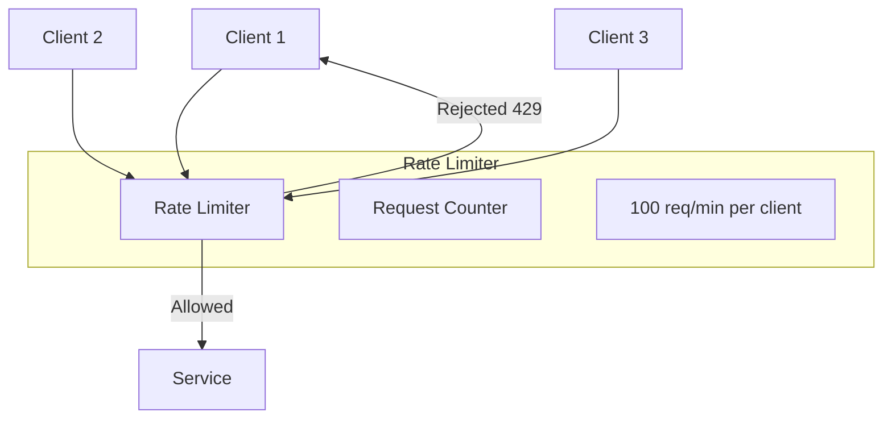

# How to Create Service Mesh Patterns

Author: [nawazdhandala](https://github.com/nawazdhandala)

Tags: Kubernetes, Service Mesh, Istio, Linkerd, Architecture, Microservices, DevOps, Networking

Description: A hands-on guide to implementing production-ready service mesh patterns including sidecar proxy, ambassador, adapter, circuit breaker, and traffic management patterns with Istio and Linkerd.

---

Service mesh patterns solve common microservices challenges like secure communication, traffic management, and observability. This guide walks you through implementing the most useful patterns with production-ready configurations.

## Understanding Service Mesh Architecture

Before diving into patterns, let's understand how service mesh components interact.


The control plane manages configuration, certificates, and service discovery. The data plane consists of sidecar proxies that handle all network traffic between services.

## Pattern 1: Sidecar Proxy Pattern

The sidecar pattern is the foundation of service mesh. A proxy container runs alongside your application container in the same pod, intercepting all network traffic.


### Manual Sidecar Injection

While automatic injection is preferred, understanding manual injection helps with debugging and special cases.

This deployment shows explicit sidecar configuration. The init container sets up iptables rules to redirect traffic through the proxy.

```yaml
apiVersion: apps/v1
kind: Deployment
metadata:
  name: api-service
  namespace: production
spec:
  replicas: 3
  selector:
    matchLabels:
      app: api-service
  template:
    metadata:
      labels:
        app: api-service
        # Labels used by mesh for service discovery
        version: v1
    spec:
      # Init container configures iptables for traffic interception
      initContainers:
        - name: init-networking
          image: istio/proxyv2:1.20.0
          securityContext:
            capabilities:
              add:
                - NET_ADMIN
            runAsUser: 0
          # Configure iptables to redirect traffic to proxy
          command:
            - /bin/sh
            - -c
            - |
              iptables -t nat -A PREROUTING -p tcp -j REDIRECT --to-port 15001
              iptables -t nat -A OUTPUT -p tcp -j REDIRECT --to-port 15001
      containers:
        # Your application container
        - name: api
          image: myregistry/api-service:v1.2.0
          ports:
            - containerPort: 8080
              name: http
          resources:
            requests:
              cpu: 100m
              memory: 128Mi
            limits:
              cpu: 500m
              memory: 512Mi
          # Health checks should bypass the proxy
          livenessProbe:
            httpGet:
              path: /health
              port: 8080
            initialDelaySeconds: 10
            periodSeconds: 10
          readinessProbe:
            httpGet:
              path: /ready
              port: 8080
            initialDelaySeconds: 5
            periodSeconds: 5
        # Sidecar proxy container
        - name: sidecar-proxy
          image: envoyproxy/envoy:v1.28.0
          ports:
            - containerPort: 15001
              name: proxy
            - containerPort: 15090
              name: metrics
          resources:
            requests:
              cpu: 50m
              memory: 64Mi
            limits:
              cpu: 200m
              memory: 256Mi
          volumeMounts:
            - name: proxy-config
              mountPath: /etc/envoy
            - name: certs
              mountPath: /etc/certs
              readOnly: true
      volumes:
        - name: proxy-config
          configMap:
            name: envoy-config
        - name: certs
          secret:
            secretName: service-certs
```

### Automatic Sidecar Injection with Istio

Automatic injection is cleaner and easier to maintain. Label the namespace and Istio injects sidecars into all new pods.

```bash
# Enable automatic sidecar injection for the namespace
kubectl label namespace production istio-injection=enabled

# Verify the label is applied
kubectl get namespace production --show-labels
```

For fine-grained control, use pod annotations to customize injection behavior.

```yaml
apiVersion: apps/v1
kind: Deployment
metadata:
  name: api-service
  namespace: production
spec:
  template:
    metadata:
      annotations:
        # Customize proxy resource allocation for high-traffic services
        sidecar.istio.io/proxyCPU: "200m"
        sidecar.istio.io/proxyMemory: "256Mi"
        # Exclude certain ports from proxy interception
        traffic.sidecar.istio.io/excludeInboundPorts: "9090"
        # Include specific outbound IP ranges
        traffic.sidecar.istio.io/includeOutboundIPRanges: "10.0.0.0/8"
    spec:
      containers:
        - name: api
          image: myregistry/api-service:v1.2.0
          ports:
            - containerPort: 8080
```

## Pattern 2: Traffic Splitting Pattern

Traffic splitting enables canary deployments, A/B testing, and gradual rollouts by distributing traffic across multiple service versions.


### Istio Traffic Splitting

Create two deployments with different version labels, then use VirtualService to control traffic distribution.

First, deploy both versions with appropriate labels for subset selection.

```yaml
# Stable deployment - receives majority of traffic
apiVersion: apps/v1
kind: Deployment
metadata:
  name: api-stable
  namespace: production
spec:
  replicas: 5
  selector:
    matchLabels:
      app: api
      version: stable
  template:
    metadata:
      labels:
        app: api
        version: stable
    spec:
      containers:
        - name: api
          image: myregistry/api-service:v1.0.0
          ports:
            - containerPort: 8080
---
# Canary deployment - receives small percentage for testing
apiVersion: apps/v1
kind: Deployment
metadata:
  name: api-canary
  namespace: production
spec:
  replicas: 1
  selector:
    matchLabels:
      app: api
      version: canary
  template:
    metadata:
      labels:
        app: api
        version: canary
    spec:
      containers:
        - name: api
          image: myregistry/api-service:v2.0.0
          ports:
            - containerPort: 8080
```

Define subsets in DestinationRule based on version labels.

```yaml
apiVersion: networking.istio.io/v1beta1
kind: DestinationRule
metadata:
  name: api-destination
  namespace: production
spec:
  host: api
  subsets:
    # Stable subset matches pods with version: stable label
    - name: stable
      labels:
        version: stable
    # Canary subset matches pods with version: canary label
    - name: canary
      labels:
        version: canary
```

Configure traffic distribution with VirtualService. Start with a small percentage to canary.

```yaml
apiVersion: networking.istio.io/v1beta1
kind: VirtualService
metadata:
  name: api-traffic-split
  namespace: production
spec:
  hosts:
    - api
  http:
    # Primary route with weighted traffic distribution
    - route:
        - destination:
            host: api
            subset: stable
          weight: 90
        - destination:
            host: api
            subset: canary
          weight: 10
```

### Progressive Canary Rollout

Gradually increase canary traffic as confidence grows. This script automates the progression.

This script incrementally shifts traffic from stable to canary, monitoring for errors at each step.

```bash
#!/bin/bash
# progressive-rollout.sh
# Gradually shift traffic from stable to canary

set -e

NAMESPACE="production"
VIRTUAL_SERVICE="api-traffic-split"

# Traffic percentages for each stage
STAGES=(10 25 50 75 100)

for canary_weight in "${STAGES[@]}"; do
    stable_weight=$((100 - canary_weight))

    echo "Setting traffic: stable=${stable_weight}%, canary=${canary_weight}%"

    # Update the VirtualService with new weights
    kubectl patch virtualservice ${VIRTUAL_SERVICE} -n ${NAMESPACE} \
        --type=json \
        -p="[
            {\"op\": \"replace\", \"path\": \"/spec/http/0/route/0/weight\", \"value\": ${stable_weight}},
            {\"op\": \"replace\", \"path\": \"/spec/http/0/route/1/weight\", \"value\": ${canary_weight}}
        ]"

    echo "Waiting 5 minutes to monitor error rates..."
    sleep 300

    # Check error rate using Prometheus query
    error_rate=$(kubectl exec -n istio-system deploy/prometheus \
        -- promtool query instant \
        'sum(rate(istio_requests_total{destination_service="api.production.svc.cluster.local",response_code=~"5.*"}[5m])) / sum(rate(istio_requests_total{destination_service="api.production.svc.cluster.local"}[5m])) * 100' \
        | grep -oP '\d+\.\d+' | head -1)

    # Rollback if error rate exceeds threshold
    if (( $(echo "$error_rate > 5" | bc -l) )); then
        echo "Error rate ${error_rate}% exceeds threshold. Rolling back..."
        kubectl patch virtualservice ${VIRTUAL_SERVICE} -n ${NAMESPACE} \
            --type=json \
            -p='[
                {"op": "replace", "path": "/spec/http/0/route/0/weight", "value": 100},
                {"op": "replace", "path": "/spec/http/0/route/1/weight", "value": 0}
            ]'
        exit 1
    fi

    echo "Error rate ${error_rate}% is acceptable. Continuing..."
done

echo "Canary rollout complete. All traffic now going to canary."
```

### Linkerd Traffic Split

Linkerd uses the SMI TrafficSplit resource for weighted traffic distribution.

```yaml
apiVersion: split.smi-spec.io/v1alpha1
kind: TrafficSplit
metadata:
  name: api-split
  namespace: production
spec:
  # Root service that receives traffic
  service: api
  backends:
    # Weight is specified in milliunits (1000m = 100%)
    - service: api-stable
      weight: 900m
    - service: api-canary
      weight: 100m
```

## Pattern 3: Circuit Breaker Pattern

Circuit breakers prevent cascading failures by stopping requests to unhealthy services. When failures exceed a threshold, the circuit opens and requests fail fast.


### Istio Circuit Breaker

Istio implements circuit breaking through outlier detection in DestinationRule. Unhealthy endpoints are ejected from the load balancing pool.

```yaml
apiVersion: networking.istio.io/v1beta1
kind: DestinationRule
metadata:
  name: api-circuit-breaker
  namespace: production
spec:
  host: api
  trafficPolicy:
    # Connection pool limits prevent overloading services
    connectionPool:
      tcp:
        maxConnections: 100
        connectTimeout: 5s
      http:
        http1MaxPendingRequests: 100
        http2MaxRequests: 1000
        maxRequestsPerConnection: 100
        maxRetries: 3
    # Outlier detection implements the circuit breaker
    outlierDetection:
      # Number of consecutive 5xx errors to trigger ejection
      consecutive5xxErrors: 5
      # How often to check for outliers
      interval: 10s
      # How long to eject the host (increases exponentially)
      baseEjectionTime: 30s
      # Maximum percentage of hosts that can be ejected
      maxEjectionPercent: 50
      # Minimum healthy hosts before ejection stops
      minHealthPercent: 30
      # Also consider gateway errors (connection failures)
      consecutiveGatewayErrors: 5
```

### Testing Circuit Breaker

Use fortio to generate load and observe circuit breaker behavior.

This test generates concurrent requests to trigger the circuit breaker.

```bash
# Deploy fortio load testing tool
kubectl apply -f - <<EOF
apiVersion: apps/v1
kind: Deployment
metadata:
  name: fortio
  namespace: production
spec:
  replicas: 1
  selector:
    matchLabels:
      app: fortio
  template:
    metadata:
      labels:
        app: fortio
    spec:
      containers:
        - name: fortio
          image: fortio/fortio:latest
          ports:
            - containerPort: 8080
EOF

# Generate load with more connections than the circuit breaker allows
kubectl exec -n production deploy/fortio -- \
    fortio load -c 150 -qps 0 -n 1000 \
    -loglevel Warning \
    http://api:8080/api/v1/health

# Check the output for "Code 503" responses indicating circuit breaker activation
```

## Pattern 4: Retry Pattern

Retries handle transient failures automatically. Configure carefully to avoid retry storms during outages.


### Istio Retry Configuration

Configure retries per-route with VirtualService. Include retry budgets to prevent overwhelming failing services.

```yaml
apiVersion: networking.istio.io/v1beta1
kind: VirtualService
metadata:
  name: api-retry-policy
  namespace: production
spec:
  hosts:
    - api
  http:
    # Route for idempotent read operations - safe to retry
    - match:
        - method:
            exact: GET
      route:
        - destination:
            host: api
      retries:
        attempts: 3
        perTryTimeout: 5s
        # Retry on server errors and connection failures
        retryOn: 5xx,reset,connect-failure,refused-stream
        # Add jitter to prevent thundering herd
        retryRemoteLocalities: true
      timeout: 20s

    # Route for write operations - limited retries
    - match:
        - method:
            exact: POST
      route:
        - destination:
            host: api
      retries:
        attempts: 2
        perTryTimeout: 10s
        # Only retry on gateway errors, not application 5xx
        retryOn: gateway-error,connect-failure
      timeout: 30s

    # Default route for other methods
    - route:
        - destination:
            host: api
      retries:
        attempts: 2
        perTryTimeout: 5s
        retryOn: gateway-error
```

### Linkerd Retry Configuration

Linkerd configures retries through ServiceProfile resources with per-route control.

```yaml
apiVersion: linkerd.io/v1alpha2
kind: ServiceProfile
metadata:
  name: api.production.svc.cluster.local
  namespace: production
spec:
  routes:
    # GET requests are safe to retry multiple times
    - name: GET /api/v1/users
      condition:
        method: GET
        pathRegex: /api/v1/users.*
      responseClasses:
        - condition:
            status:
              min: 500
              max: 599
          isFailure: true
      isRetryable: true
      timeout: 10s

    # POST requests get limited retries
    - name: POST /api/v1/orders
      condition:
        method: POST
        pathRegex: /api/v1/orders
      responseClasses:
        - condition:
            status:
              min: 500
              max: 599
          isFailure: true
      # Only retry if the response indicates it's safe
      isRetryable: false
      timeout: 30s
  retryBudget:
    # Maximum percentage of requests that can be retries
    retryRatio: 0.2
    # Minimum retries per second regardless of ratio
    minRetriesPerSecond: 10
    # Time window for calculating retry budget
    ttl: 10s
```

## Pattern 5: Timeout Pattern

Timeouts prevent requests from waiting indefinitely. Set appropriate timeouts based on service SLOs.


### Cascading Timeout Configuration

Configure timeouts to cascade properly through the call chain. Downstream timeouts should be shorter than upstream.

```yaml
# API Gateway timeout - longest in the chain
apiVersion: networking.istio.io/v1beta1
kind: VirtualService
metadata:
  name: api-gateway-timeout
  namespace: production
spec:
  hosts:
    - api-gateway
  http:
    - route:
        - destination:
            host: api-gateway
      timeout: 30s
---
# Order service timeout - shorter than gateway
apiVersion: networking.istio.io/v1beta1
kind: VirtualService
metadata:
  name: order-service-timeout
  namespace: production
spec:
  hosts:
    - order-service
  http:
    - route:
        - destination:
            host: order-service
      timeout: 20s
---
# Inventory service timeout - shorter than order service
apiVersion: networking.istio.io/v1beta1
kind: VirtualService
metadata:
  name: inventory-service-timeout
  namespace: production
spec:
  hosts:
    - inventory-service
  http:
    - route:
        - destination:
            host: inventory-service
      timeout: 10s
```

### Per-Route Timeout Configuration

Different endpoints may need different timeouts based on their complexity.

```yaml
apiVersion: networking.istio.io/v1beta1
kind: VirtualService
metadata:
  name: api-route-timeouts
  namespace: production
spec:
  hosts:
    - api
  http:
    # Health checks need fast timeouts
    - match:
        - uri:
            exact: /health
      route:
        - destination:
            host: api
      timeout: 2s

    # Report generation takes longer
    - match:
        - uri:
            prefix: /api/v1/reports
      route:
        - destination:
            host: api
      timeout: 60s

    # Default timeout for all other routes
    - route:
        - destination:
            host: api
      timeout: 15s
```

## Pattern 6: Rate Limiting Pattern

Rate limiting protects services from being overwhelmed by too many requests.



### Istio Rate Limiting with EnvoyFilter

Configure rate limiting using Envoy's rate limit filter. This requires a rate limit service.

First, deploy the rate limit service that tracks request counts.

```yaml
# Rate limit service deployment
apiVersion: apps/v1
kind: Deployment
metadata:
  name: ratelimit
  namespace: istio-system
spec:
  replicas: 2
  selector:
    matchLabels:
      app: ratelimit
  template:
    metadata:
      labels:
        app: ratelimit
    spec:
      containers:
        - name: ratelimit
          image: envoyproxy/ratelimit:latest
          ports:
            - containerPort: 8080
            - containerPort: 8081
            - containerPort: 6070
          env:
            - name: USE_STATSD
              value: "false"
            - name: LOG_LEVEL
              value: "debug"
            - name: REDIS_SOCKET_TYPE
              value: "tcp"
            - name: REDIS_URL
              value: "redis:6379"
            - name: RUNTIME_ROOT
              value: "/data"
            - name: RUNTIME_SUBDIRECTORY
              value: "ratelimit"
          volumeMounts:
            - name: config
              mountPath: /data/ratelimit/config
      volumes:
        - name: config
          configMap:
            name: ratelimit-config
---
apiVersion: v1
kind: Service
metadata:
  name: ratelimit
  namespace: istio-system
spec:
  ports:
    - port: 8080
      targetPort: 8080
      name: grpc
    - port: 8081
      targetPort: 8081
      name: http
  selector:
    app: ratelimit
```

Configure rate limit rules in a ConfigMap.

```yaml
apiVersion: v1
kind: ConfigMap
metadata:
  name: ratelimit-config
  namespace: istio-system
data:
  config.yaml: |
    domain: production-ratelimit
    descriptors:
      # Global rate limit for all requests
      - key: generic_key
        value: default
        rate_limit:
          unit: minute
          requests_per_unit: 1000

      # Per-client rate limit based on header
      - key: header_match
        value: api-key
        descriptors:
          - key: api_key
            rate_limit:
              unit: minute
              requests_per_unit: 100

      # Per-path rate limits
      - key: path
        descriptors:
          - key: path
            value: "/api/v1/expensive"
            rate_limit:
              unit: minute
              requests_per_unit: 10
```

Apply EnvoyFilter to enable rate limiting on the ingress gateway.

```yaml
apiVersion: networking.istio.io/v1alpha3
kind: EnvoyFilter
metadata:
  name: ratelimit-filter
  namespace: istio-system
spec:
  workloadSelector:
    labels:
      istio: ingressgateway
  configPatches:
    # Add rate limit filter to HTTP filter chain
    - applyTo: HTTP_FILTER
      match:
        context: GATEWAY
        listener:
          filterChain:
            filter:
              name: envoy.filters.network.http_connection_manager
              subFilter:
                name: envoy.filters.http.router
      patch:
        operation: INSERT_BEFORE
        value:
          name: envoy.filters.http.ratelimit
          typed_config:
            "@type": type.googleapis.com/envoy.extensions.filters.http.ratelimit.v3.RateLimit
            domain: production-ratelimit
            failure_mode_deny: false
            rate_limit_service:
              grpc_service:
                envoy_grpc:
                  cluster_name: rate_limit_cluster
                timeout: 0.25s
              transport_api_version: V3

    # Add rate limit cluster configuration
    - applyTo: CLUSTER
      match:
        context: GATEWAY
      patch:
        operation: ADD
        value:
          name: rate_limit_cluster
          type: STRICT_DNS
          connect_timeout: 1s
          lb_policy: ROUND_ROBIN
          http2_protocol_options: {}
          load_assignment:
            cluster_name: rate_limit_cluster
            endpoints:
              - lb_endpoints:
                  - endpoint:
                      address:
                        socket_address:
                          address: ratelimit.istio-system.svc.cluster.local
                          port_value: 8080
```

## Pattern 7: Header-Based Routing Pattern

Route traffic based on request headers for A/B testing, feature flags, or tenant isolation.


### Istio Header-Based Routing

Match specific headers to route to different service versions or backends.

```yaml
apiVersion: networking.istio.io/v1beta1
kind: VirtualService
metadata:
  name: api-header-routing
  namespace: production
spec:
  hosts:
    - api
  http:
    # Route enterprise customers to dedicated infrastructure
    - match:
        - headers:
            x-tenant-tier:
              exact: enterprise
      route:
        - destination:
            host: api-enterprise
            port:
              number: 8080

    # Route beta testers to beta version
    - match:
        - headers:
            x-beta-features:
              exact: "true"
      route:
        - destination:
            host: api
            subset: beta

    # Route by user region for compliance
    - match:
        - headers:
            x-user-region:
              exact: eu
      route:
        - destination:
            host: api-eu
            port:
              number: 8080

    # Route internal traffic differently
    - match:
        - headers:
            x-internal:
              exact: "true"
          sourceLabels:
            app: internal-service
      route:
        - destination:
            host: api
            subset: internal

    # Default route for all other traffic
    - route:
        - destination:
            host: api
            subset: stable
```

### Mirror Traffic for Testing

Mirror production traffic to a test environment without affecting users.

```yaml
apiVersion: networking.istio.io/v1beta1
kind: VirtualService
metadata:
  name: api-traffic-mirror
  namespace: production
spec:
  hosts:
    - api
  http:
    - route:
        - destination:
            host: api
            subset: stable
      # Mirror 10% of traffic to shadow service for testing
      mirror:
        host: api-shadow
        subset: test
      mirrorPercentage:
        value: 10.0
```

## Pattern 8: Fault Injection Pattern

Inject faults to test resilience and validate that error handling works correctly.


### Istio Fault Injection

Inject delays and errors to test client resilience.

```yaml
apiVersion: networking.istio.io/v1beta1
kind: VirtualService
metadata:
  name: api-fault-injection
  namespace: staging
spec:
  hosts:
    - api
  http:
    - fault:
        # Inject 5 second delay for 10% of requests
        delay:
          percentage:
            value: 10
          fixedDelay: 5s
        # Return 500 error for 5% of requests
        abort:
          percentage:
            value: 5
          httpStatus: 500
      route:
        - destination:
            host: api
```

### Targeted Fault Injection

Inject faults only for specific test scenarios using header matching.

```yaml
apiVersion: networking.istio.io/v1beta1
kind: VirtualService
metadata:
  name: api-targeted-faults
  namespace: staging
spec:
  hosts:
    - api
  http:
    # Only inject faults for chaos testing requests
    - match:
        - headers:
            x-chaos-test:
              exact: "delay"
      fault:
        delay:
          percentage:
            value: 100
          fixedDelay: 10s
      route:
        - destination:
            host: api

    - match:
        - headers:
            x-chaos-test:
              exact: "error"
      fault:
        abort:
          percentage:
            value: 100
          httpStatus: 503
      route:
        - destination:
            host: api

    # Normal traffic without faults
    - route:
        - destination:
            host: api
```

## Pattern 9: mTLS and Authorization Pattern

Secure service-to-service communication with mutual TLS and fine-grained authorization.


### Strict mTLS Configuration

Enable strict mTLS to require encrypted communication for all traffic.

```yaml
# Namespace-level strict mTLS
apiVersion: security.istio.io/v1beta1
kind: PeerAuthentication
metadata:
  name: default
  namespace: production
spec:
  mtls:
    mode: STRICT
---
# Cluster-wide strict mTLS
apiVersion: security.istio.io/v1beta1
kind: PeerAuthentication
metadata:
  name: default
  namespace: istio-system
spec:
  mtls:
    mode: STRICT
```

### Authorization Policies

Define which services can communicate with each other based on identity.

```yaml
# Deny all by default
apiVersion: security.istio.io/v1beta1
kind: AuthorizationPolicy
metadata:
  name: deny-all
  namespace: production
spec:
  {}
---
# Allow frontend to access API service
apiVersion: security.istio.io/v1beta1
kind: AuthorizationPolicy
metadata:
  name: allow-frontend-to-api
  namespace: production
spec:
  selector:
    matchLabels:
      app: api
  action: ALLOW
  rules:
    - from:
        - source:
            principals:
              - cluster.local/ns/production/sa/frontend
      to:
        - operation:
            methods: ["GET", "POST"]
            paths: ["/api/v1/*"]
---
# Allow API to access database
apiVersion: security.istio.io/v1beta1
kind: AuthorizationPolicy
metadata:
  name: allow-api-to-database
  namespace: production
spec:
  selector:
    matchLabels:
      app: database
  action: ALLOW
  rules:
    - from:
        - source:
            principals:
              - cluster.local/ns/production/sa/api
      to:
        - operation:
            ports: ["5432"]
---
# Allow monitoring to scrape metrics from all services
apiVersion: security.istio.io/v1beta1
kind: AuthorizationPolicy
metadata:
  name: allow-prometheus-scrape
  namespace: production
spec:
  action: ALLOW
  rules:
    - from:
        - source:
            namespaces: ["monitoring"]
      to:
        - operation:
            methods: ["GET"]
            paths: ["/metrics", "/health", "/ready"]
```

## Pattern 10: Observability Pattern

Implement comprehensive observability with distributed tracing, metrics, and logging.


### Telemetry Configuration

Configure Istio telemetry to export metrics and traces.

```yaml
apiVersion: telemetry.istio.io/v1alpha1
kind: Telemetry
metadata:
  name: mesh-telemetry
  namespace: istio-system
spec:
  # Configure tracing for all workloads
  tracing:
    - providers:
        - name: jaeger
      randomSamplingPercentage: 10
      customTags:
        environment:
          literal:
            value: production
        cluster:
          literal:
            value: us-east-1
  # Configure access logging
  accessLogging:
    - providers:
        - name: envoy
      filter:
        expression: response.code >= 400
```

### Custom Metrics with Telemetry API

Add custom dimensions to default metrics for better observability.

```yaml
apiVersion: telemetry.istio.io/v1alpha1
kind: Telemetry
metadata:
  name: custom-metrics
  namespace: production
spec:
  metrics:
    - providers:
        - name: prometheus
      overrides:
        - match:
            metric: REQUEST_COUNT
          tagOverrides:
            request_path:
              operation: UPSERT
              value: request.url_path
            api_version:
              operation: UPSERT
              value: request.headers["x-api-version"]
        - match:
            metric: REQUEST_DURATION
          tagOverrides:
            request_path:
              operation: UPSERT
              value: request.url_path
```

### Grafana Dashboard ConfigMap

Deploy a service mesh dashboard for Grafana.

```yaml
apiVersion: v1
kind: ConfigMap
metadata:
  name: service-mesh-dashboard
  namespace: monitoring
  labels:
    grafana_dashboard: "1"
data:
  service-mesh.json: |
    {
      "title": "Service Mesh Overview",
      "panels": [
        {
          "title": "Request Rate",
          "type": "graph",
          "targets": [
            {
              "expr": "sum(rate(istio_requests_total{reporter=\"source\"}[5m])) by (destination_service_name)",
              "legendFormat": "{{destination_service_name}}"
            }
          ]
        },
        {
          "title": "Error Rate",
          "type": "graph",
          "targets": [
            {
              "expr": "sum(rate(istio_requests_total{reporter=\"source\",response_code=~\"5.*\"}[5m])) by (destination_service_name) / sum(rate(istio_requests_total{reporter=\"source\"}[5m])) by (destination_service_name) * 100",
              "legendFormat": "{{destination_service_name}}"
            }
          ]
        },
        {
          "title": "P99 Latency",
          "type": "graph",
          "targets": [
            {
              "expr": "histogram_quantile(0.99, sum(rate(istio_request_duration_milliseconds_bucket{reporter=\"source\"}[5m])) by (destination_service_name, le))",
              "legendFormat": "{{destination_service_name}}"
            }
          ]
        }
      ]
    }
```

## Production Checklist

Before deploying service mesh patterns to production, verify these requirements.

### Resource Planning

Calculate sidecar overhead for your cluster.

```bash
#!/bin/bash
# calculate-mesh-overhead.sh
# Estimate resource overhead for service mesh sidecars

# Count total pods that will be meshed
TOTAL_PODS=$(kubectl get pods -A -l istio-injection=enabled --no-headers | wc -l)

# Sidecar resource estimates (Istio defaults)
SIDECAR_CPU_REQUEST="100m"
SIDECAR_MEMORY_REQUEST="128Mi"

# Calculate total overhead
echo "Total pods to mesh: ${TOTAL_PODS}"
echo "Per-sidecar CPU request: ${SIDECAR_CPU_REQUEST}"
echo "Per-sidecar memory request: ${SIDECAR_MEMORY_REQUEST}"
echo ""
echo "Total additional CPU: $((TOTAL_PODS * 100))m"
echo "Total additional memory: $((TOTAL_PODS * 128))Mi"
```

### Health Check Configuration

Ensure services have proper health checks that work with mesh.

```yaml
apiVersion: apps/v1
kind: Deployment
metadata:
  name: api-service
  namespace: production
spec:
  template:
    spec:
      containers:
        - name: api
          image: myregistry/api:v1.0.0
          ports:
            - containerPort: 8080
          # Liveness probe to restart unhealthy containers
          livenessProbe:
            httpGet:
              path: /health/live
              port: 8080
            initialDelaySeconds: 15
            periodSeconds: 10
            timeoutSeconds: 5
            failureThreshold: 3
          # Readiness probe to control traffic routing
          readinessProbe:
            httpGet:
              path: /health/ready
              port: 8080
            initialDelaySeconds: 5
            periodSeconds: 5
            timeoutSeconds: 3
            failureThreshold: 3
          # Startup probe for slow-starting containers
          startupProbe:
            httpGet:
              path: /health/startup
              port: 8080
            initialDelaySeconds: 0
            periodSeconds: 5
            timeoutSeconds: 3
            failureThreshold: 30
```

### Gradual Rollout Strategy

Roll out mesh incrementally to minimize risk.

```bash
#!/bin/bash
# mesh-rollout.sh
# Gradually enable service mesh across namespaces

NAMESPACES=("staging" "production-canary" "production")

for ns in "${NAMESPACES[@]}"; do
    echo "Enabling mesh for namespace: ${ns}"

    # Label namespace for automatic injection
    kubectl label namespace ${ns} istio-injection=enabled --overwrite

    # Restart deployments to inject sidecars
    kubectl rollout restart deployment -n ${ns}

    # Wait for rollout to complete
    kubectl rollout status deployment -n ${ns} --timeout=300s

    # Verify mesh connectivity
    echo "Verifying mesh connectivity in ${ns}..."
    istioctl analyze -n ${ns}

    # Check for errors before proceeding
    if [ $? -ne 0 ]; then
        echo "Issues detected in ${ns}. Pausing rollout."
        exit 1
    fi

    echo "Namespace ${ns} successfully meshed. Waiting before next namespace..."
    sleep 300
done

echo "Service mesh rollout complete."
```

---

Service mesh patterns provide powerful capabilities for managing microservices traffic, security, and observability. Start with the sidecar and mTLS patterns for immediate security benefits, then add traffic management patterns as your needs grow. Always test patterns in staging before production, and monitor the resource overhead carefully.
