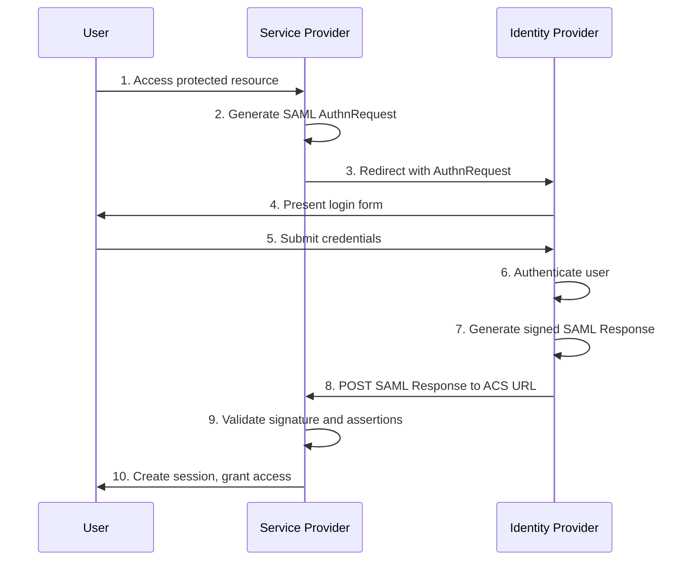
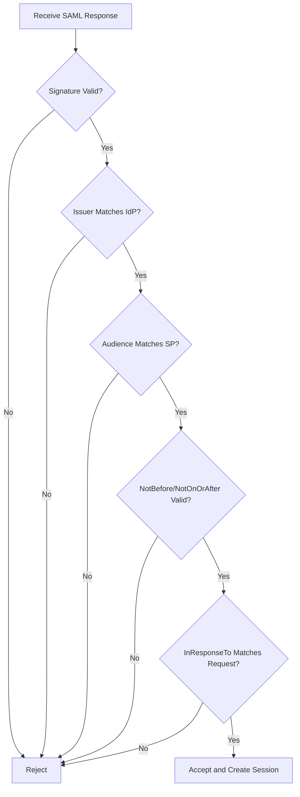

# How to Implement Service Provider Configuration

Author: [nawazdhandala](https://github.com/nawazdhandala)

Tags: Security, SAML, SP Configuration, SSO

Description: Learn to implement service provider configuration for SAML-based authentication.

---

Single Sign-On (SSO) has become a baseline security requirement for modern applications. When implementing SAML-based authentication, your application acts as a Service Provider (SP) that delegates authentication to an Identity Provider (IdP). Getting the SP configuration right is critical for secure, reliable authentication flows.

This guide walks through the core components of SP configuration, the SAML authentication flow, and practical implementation patterns you can apply to your own systems.

---

## What is a Service Provider?

A Service Provider is an application or service that relies on an external Identity Provider to authenticate users. Instead of managing passwords and credentials directly, the SP trusts assertions from the IdP about user identity.

| Term | Definition |
|------|------------|
| Service Provider (SP) | Your application that needs to authenticate users |
| Identity Provider (IdP) | The trusted source that authenticates users (Okta, Azure AD, Google Workspace) |
| SAML Assertion | A signed XML document containing user identity and attributes |
| ACS URL | Assertion Consumer Service URL where the IdP sends authentication responses |
| Entity ID | A unique identifier for your SP in the SAML trust relationship |
| Metadata | XML document describing SP or IdP endpoints and certificates |

---

## SAML Authentication Flow

Before configuring your SP, understanding the authentication flow helps clarify why each configuration element exists.



The SP initiates the flow by redirecting unauthenticated users to the IdP. After successful authentication, the IdP sends a signed assertion back to the SP's ACS endpoint. The SP validates this assertion and creates a local session.

---

## Core SP Configuration Elements

Every SP configuration requires these fundamental components.

### Entity ID

The Entity ID uniquely identifies your SP within the SAML ecosystem. It is typically a URL but does not need to resolve to an actual endpoint. Choose a stable, descriptive identifier.

```xml
<!-- Example Entity ID formats -->
https://app.example.com/saml/metadata
urn:example:app:production
https://oneuptime.com/entity/your-project-id
```

### ACS URL (Assertion Consumer Service)

This is the endpoint where your SP receives SAML responses from the IdP. It must be an HTTPS endpoint that can accept POST requests.

```
https://app.example.com/saml/acs
https://app.example.com/auth/saml/callback
```

### SP Metadata

SP metadata is an XML document that describes your SP configuration. IdPs use this to configure the trust relationship.

```xml
<?xml version="1.0" encoding="UTF-8"?>
<md:EntityDescriptor
    xmlns:md="urn:oasis:names:tc:SAML:2.0:metadata"
    entityID="https://app.example.com/saml/metadata">

    <md:SPSSODescriptor
        AuthnRequestsSigned="true"
        WantAssertionsSigned="true"
        protocolSupportEnumeration="urn:oasis:names:tc:SAML:2.0:protocol">

        <!-- Certificate for signature verification -->
        <md:KeyDescriptor use="signing">
            <ds:KeyInfo xmlns:ds="http://www.w3.org/2000/09/xmldsig#">
                <ds:X509Data>
                    <ds:X509Certificate>MIIC...base64-encoded-cert...</ds:X509Certificate>
                </ds:X509Data>
            </ds:KeyInfo>
        </md:KeyDescriptor>

        <!-- Where IdP sends SAML responses -->
        <md:AssertionConsumerService
            Binding="urn:oasis:names:tc:SAML:2.0:bindings:HTTP-POST"
            Location="https://app.example.com/saml/acs"
            index="0"
            isDefault="true"/>

    </md:SPSSODescriptor>
</md:EntityDescriptor>
```

---

## Implementation in Node.js

The following example demonstrates SP configuration using the `@node-saml/passport-saml` library, which is widely used for SAML authentication in Node.js applications.

### Installation

```bash
npm install passport @node-saml/passport-saml express-session
```

### Basic Configuration

Create a configuration object that defines your SP settings and the IdP you trust.

```javascript
// config/saml.js
const samlConfig = {
  // Your SP configuration
  callbackUrl: process.env.SAML_ACS_URL || 'https://app.example.com/saml/acs',
  issuer: process.env.SAML_ENTITY_ID || 'https://app.example.com/saml/metadata',

  // IdP configuration (from IdP metadata)
  entryPoint: process.env.SAML_IDP_SSO_URL,
  idpCert: process.env.SAML_IDP_CERTIFICATE,

  // Security settings
  wantAssertionsSigned: true,
  wantAuthnResponseSigned: true,
  signatureAlgorithm: 'sha256',
  digestAlgorithm: 'sha256',

  // Optional: Sign authentication requests
  privateKey: process.env.SAML_SP_PRIVATE_KEY,
  cert: process.env.SAML_SP_CERTIFICATE,

  // Session and timing
  acceptedClockSkewMs: 5000,
  maxAssertionAgeMs: 120000,

  // Attribute mapping
  identifierFormat: 'urn:oasis:names:tc:SAML:1.1:nameid-format:emailAddress',
};

module.exports = samlConfig;
```

### Passport Strategy Setup

Configure Passport to use the SAML strategy for authentication.

```javascript
// auth/passport.js
const passport = require('passport');
const { Strategy: SamlStrategy } = require('@node-saml/passport-saml');
const samlConfig = require('../config/saml');

// Initialize SAML strategy
const samlStrategy = new SamlStrategy(
  samlConfig,
  // Verify callback - called after successful SAML response
  async (profile, done) => {
    try {
      // Extract user attributes from SAML assertion
      const user = {
        email: profile.nameID || profile.email,
        firstName: profile['http://schemas.xmlsoap.org/ws/2005/05/identity/claims/givenname'],
        lastName: profile['http://schemas.xmlsoap.org/ws/2005/05/identity/claims/surname'],
        groups: profile['http://schemas.microsoft.com/ws/2008/06/identity/claims/groups'] || [],
        sessionIndex: profile.sessionIndex,
      };

      // Find or create user in your database
      const dbUser = await findOrCreateUser(user);
      return done(null, dbUser);
    } catch (error) {
      return done(error);
    }
  }
);

passport.use('saml', samlStrategy);

// Serialize user for session storage
passport.serializeUser((user, done) => {
  done(null, user.id);
});

// Deserialize user from session
passport.deserializeUser(async (id, done) => {
  try {
    const user = await findUserById(id);
    done(null, user);
  } catch (error) {
    done(error);
  }
});

module.exports = { passport, samlStrategy };
```

### Route Handlers

Set up routes to handle SAML authentication flow.

```javascript
// routes/auth.js
const express = require('express');
const router = express.Router();
const { passport, samlStrategy } = require('../auth/passport');

// Initiate SAML login - redirects to IdP
router.get('/saml/login',
  passport.authenticate('saml', { failureRedirect: '/login-error' })
);

// ACS endpoint - receives SAML response from IdP
router.post('/saml/acs',
  passport.authenticate('saml', {
    failureRedirect: '/login-error',
    failureFlash: true
  }),
  (req, res) => {
    // Authentication successful
    const returnTo = req.session.returnTo || '/dashboard';
    delete req.session.returnTo;
    res.redirect(returnTo);
  }
);

// Serve SP metadata for IdP configuration
router.get('/saml/metadata', (req, res) => {
  res.type('application/xml');
  res.send(samlStrategy.generateServiceProviderMetadata(
    process.env.SAML_SP_CERTIFICATE,
    process.env.SAML_SP_CERTIFICATE
  ));
});

// Handle logout
router.get('/saml/logout', (req, res, next) => {
  if (req.user && req.user.sessionIndex) {
    // Initiate SLO (Single Logout) with IdP
    samlStrategy.logout(req, (err, requestUrl) => {
      if (err) return next(err);
      req.logout((err) => {
        if (err) return next(err);
        res.redirect(requestUrl);
      });
    });
  } else {
    req.logout((err) => {
      if (err) return next(err);
      res.redirect('/');
    });
  }
});

module.exports = router;
```

---

## Security Considerations

Proper SP configuration requires attention to several security aspects.

### Certificate Management

| Requirement | Recommendation |
|-------------|----------------|
| Key length | RSA 2048-bit minimum, 4096-bit preferred |
| Algorithm | SHA-256 or stronger for signatures |
| Rotation | Plan for certificate renewal before expiration |
| Storage | Use secrets management, never commit keys to source control |

### Assertion Validation

Your SP must validate several aspects of the SAML response.



### Replay Attack Prevention

Store used assertion IDs to prevent replay attacks.

```javascript
// middleware/replayPrevention.js
const usedAssertionIds = new Map();

function preventReplay(assertionId, expiresAt) {
  // Check if assertion was already used
  if (usedAssertionIds.has(assertionId)) {
    throw new Error('Assertion replay detected');
  }

  // Store assertion ID with expiration
  usedAssertionIds.set(assertionId, expiresAt);

  // Clean up expired entries periodically
  setTimeout(() => {
    usedAssertionIds.delete(assertionId);
  }, expiresAt - Date.now() + 60000);
}

module.exports = { preventReplay };
```

---

## Common Configuration Patterns

### Multi-tenant SP

For SaaS applications supporting multiple IdPs, store IdP configuration per tenant.

```javascript
// services/samlService.js
async function getSamlConfigForTenant(tenantId) {
  const tenant = await db.tenants.findById(tenantId);

  if (!tenant.samlConfig) {
    throw new Error('SAML not configured for tenant');
  }

  return {
    callbackUrl: `https://app.example.com/tenants/${tenantId}/saml/acs`,
    issuer: `https://app.example.com/tenants/${tenantId}/saml/metadata`,
    entryPoint: tenant.samlConfig.idpSsoUrl,
    idpCert: tenant.samlConfig.idpCertificate,
    wantAssertionsSigned: true,
  };
}
```

### SP-Initiated vs IdP-Initiated SSO

SP-initiated SSO starts at your application; IdP-initiated SSO starts at the identity provider. Support both patterns for flexibility.

| Flow | Use Case | Implementation |
|------|----------|----------------|
| SP-Initiated | User accesses your app directly | Generate AuthnRequest, redirect to IdP |
| IdP-Initiated | User starts from IdP portal | Accept unsolicited SAML response at ACS |

For IdP-initiated SSO, your ACS endpoint must handle responses without a corresponding AuthnRequest. Disable `InResponseTo` validation for these flows but apply additional scrutiny.

---

## Testing Your Configuration

Before going to production, verify your SP configuration.

1. **Metadata validation**: Import your SP metadata into the IdP and confirm all endpoints resolve correctly
2. **Certificate verification**: Ensure the IdP can validate your SP certificate and vice versa
3. **Attribute mapping**: Confirm user attributes flow correctly from IdP assertions to your user model
4. **Error handling**: Test invalid signatures, expired assertions, and wrong audience values
5. **Clock skew**: Test with systems that have slight time differences

---

## Summary

| Configuration Element | Purpose |
|-----------------------|---------|
| Entity ID | Uniquely identifies your SP |
| ACS URL | Receives SAML responses from IdP |
| SP Certificate | Signs requests, verifies responses |
| IdP Metadata | SSO URL, certificate, supported bindings |
| Attribute Mapping | Maps SAML attributes to user properties |

Service Provider configuration is the foundation of SAML-based authentication. Getting these elements right ensures secure, reliable SSO for your users. Start with a working basic configuration, then layer on security hardening as your requirements evolve.

---

**Related Reading:**

- [SSO Is a Security Basic, Not an Enterprise Perk](https://oneuptime.com/blog/post/2025-08-19-sso-is-a-security-basic-not-an-enterprise-perk/view)
- [How Private Status Pages Stay Secure: Authentication Options Explained](https://oneuptime.com/blog/post/2025-11-20-secure-your-status-page-authentication-options/view)
