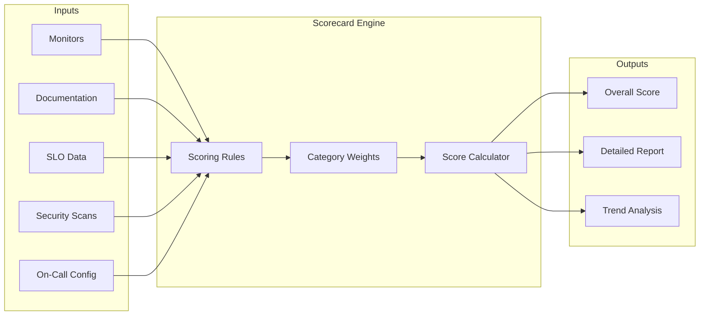
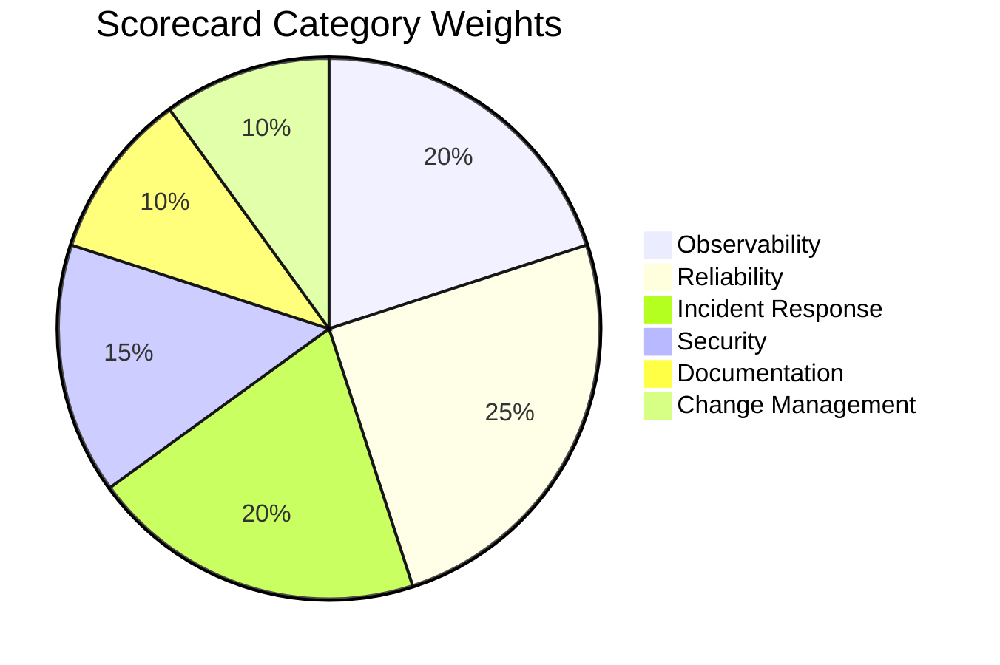
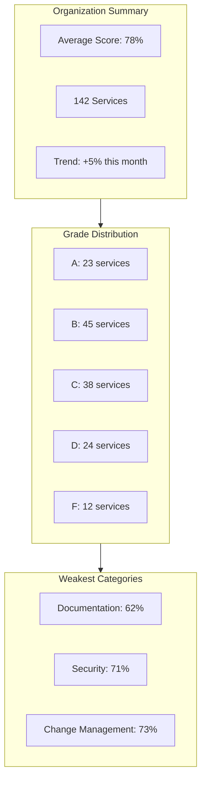
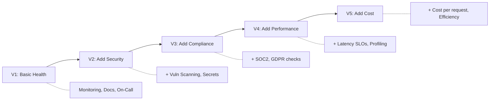

# How to Implement Service Scorecards

Author: [nawazdhandala](https://github.com/nawazdhandala)

Tags: Platform Engineering, DevOps, SRE, Developer Experience

Description: A practical guide to implementing service scorecards that measure operational maturity, drive accountability, and improve reliability across your organization.

---

Service scorecards transform vague notions of "production readiness" into measurable criteria. Instead of relying on tribal knowledge or gut feelings, teams can see exactly where their services stand and what needs improvement. This guide walks through designing, implementing, and operationalizing service scorecards that actually drive change.

---

## What Are Service Scorecards?

A service scorecard is a standardized checklist that evaluates services against operational best practices. Think of it as a health report for each service in your catalog. Scorecards answer questions like:

- Does this service have proper monitoring?
- Are runbooks documented and up to date?
- Is the on-call rotation defined?
- Are security patches applied?
- Does it meet SLO targets?



---

## Why Scorecards Matter

Without scorecards, production readiness becomes subjective. One team's "ready" might mean another team's "barely functional." Scorecards provide:

| Benefit | Description |
|---------|-------------|
| Objectivity | Clear, measurable criteria replace subjective assessments |
| Accountability | Teams see exactly what needs improvement |
| Prioritization | Focus engineering effort where it matters most |
| Visibility | Leadership understands operational health at a glance |
| Compliance | Audit-ready evidence of operational practices |
| Culture | Reliability becomes everyone's responsibility |

---

## Designing Your Scorecard Categories

Start with categories that reflect your organization's priorities. Here's a battle-tested framework:

### 1. Observability

Can you see what's happening inside the service?

- Structured logging enabled
- Metrics exported (latency, errors, saturation)
- Distributed tracing instrumented
- Dashboards created
- Synthetic monitoring active

### 2. Reliability

Will the service stay up under pressure?

- SLOs defined and tracked
- Error budget policy documented
- Circuit breakers implemented
- Graceful degradation paths exist
- Timeouts and retries configured

### 3. Incident Response

Can the team respond effectively when things break?

- On-call rotation configured
- Runbooks documented
- Escalation paths defined
- Post-incident review process followed
- Alert routing configured

### 4. Security

Is the service protected against threats?

- Dependency vulnerabilities scanned
- Secrets managed properly (no hardcoded credentials)
- Authentication and authorization implemented
- Security patches applied within SLA
- Audit logging enabled

### 5. Documentation

Can a new team member understand and operate the service?

- Architecture diagram exists
- API documentation published
- Deployment guide available
- Troubleshooting guide maintained
- Service catalog entry complete

### 6. Change Management

Are changes safe and traceable?

- CI/CD pipeline configured
- Automated tests passing
- Rollback procedure documented
- Feature flags available
- Change failure rate tracked



---

## Implementing the Scorecard System

### Step 1: Define Scoring Rules

Each check should have a clear pass/fail criterion. Avoid ambiguity.

The following YAML configuration defines scoring rules for a service scorecard. Each rule specifies what to check, how to evaluate it, the points awarded, and which category it belongs to.

```yaml
# scorecard-rules.yaml
rules:
  # Observability checks
  - id: obs-001
    name: Structured Logging
    description: Service emits structured JSON logs with correlation IDs
    category: observability
    points: 10
    check_type: automated
    query: |
      SELECT COUNT(*) > 0
      FROM service_logs
      WHERE service_id = :service_id
      AND log_format = 'json'
      AND correlation_id IS NOT NULL

  - id: obs-002
    name: Metrics Exported
    description: Service exports golden signal metrics
    category: observability
    points: 10
    check_type: automated
    query: |
      SELECT COUNT(DISTINCT metric_name) >= 4
      FROM metrics
      WHERE service_id = :service_id
      AND metric_name IN ('latency', 'error_rate', 'throughput', 'saturation')

  - id: obs-003
    name: Distributed Tracing
    description: Service participates in distributed tracing
    category: observability
    points: 10
    check_type: automated
    query: |
      SELECT COUNT(*) > 100
      FROM traces
      WHERE service_id = :service_id
      AND created_at > NOW() - INTERVAL '24 hours'

  # Reliability checks
  - id: rel-001
    name: SLO Defined
    description: Service has at least one SLO configured
    category: reliability
    points: 15
    check_type: automated
    query: |
      SELECT COUNT(*) > 0
      FROM slos
      WHERE service_id = :service_id
      AND active = true

  - id: rel-002
    name: Error Budget Healthy
    description: Service has more than 20% error budget remaining
    category: reliability
    points: 10
    check_type: automated
    query: |
      SELECT remaining_budget_percent > 20
      FROM error_budgets
      WHERE service_id = :service_id

  # Incident Response checks
  - id: inc-001
    name: On-Call Configured
    description: Service has an active on-call rotation
    category: incident_response
    points: 15
    check_type: automated
    query: |
      SELECT COUNT(*) > 0
      FROM oncall_schedules
      WHERE service_id = :service_id
      AND active = true

  - id: inc-002
    name: Runbook Exists
    description: Service has a runbook linked
    category: incident_response
    points: 10
    check_type: automated
    query: |
      SELECT runbook_url IS NOT NULL
      FROM services
      WHERE id = :service_id

  # Security checks
  - id: sec-001
    name: No Critical Vulnerabilities
    description: No critical CVEs in dependencies
    category: security
    points: 15
    check_type: automated
    query: |
      SELECT COUNT(*) = 0
      FROM vulnerability_scans
      WHERE service_id = :service_id
      AND severity = 'critical'
      AND status = 'open'
```

### Step 2: Build the Scoring Engine

The scoring engine evaluates each rule and calculates the final score. This TypeScript implementation shows the core logic for processing scorecard rules and generating results.

```typescript
// scorecard-engine.ts
interface ScorecardRule {
  id: string;
  name: string;
  description: string;
  category: string;
  points: number;
  checkType: 'automated' | 'manual';
  query?: string;
}

interface ScorecardResult {
  serviceId: string;
  serviceName: string;
  overallScore: number;
  maxScore: number;
  percentage: number;
  grade: string;
  categoryScores: CategoryScore[];
  ruleResults: RuleResult[];
  calculatedAt: Date;
}

interface CategoryScore {
  category: string;
  score: number;
  maxScore: number;
  percentage: number;
}

interface RuleResult {
  ruleId: string;
  ruleName: string;
  category: string;
  passed: boolean;
  points: number;
  maxPoints: number;
  details?: string;
}

class ScorecardEngine {
  private rules: ScorecardRule[];
  private categoryWeights: Map<string, number>;

  constructor(rules: ScorecardRule[]) {
    this.rules = rules;
    this.categoryWeights = new Map([
      ['observability', 0.20],
      ['reliability', 0.25],
      ['incident_response', 0.20],
      ['security', 0.15],
      ['documentation', 0.10],
      ['change_management', 0.10],
    ]);
  }

  async evaluateService(serviceId: string): Promise<ScorecardResult> {
    const ruleResults: RuleResult[] = [];

    // Evaluate each rule
    for (const rule of this.rules) {
      const passed = await this.evaluateRule(rule, serviceId);
      ruleResults.push({
        ruleId: rule.id,
        ruleName: rule.name,
        category: rule.category,
        passed,
        points: passed ? rule.points : 0,
        maxPoints: rule.points,
      });
    }

    // Calculate category scores
    const categoryScores = this.calculateCategoryScores(ruleResults);

    // Calculate overall score
    const overallScore = this.calculateOverallScore(categoryScores);
    const maxScore = this.calculateMaxScore();
    const percentage = (overallScore / maxScore) * 100;

    return {
      serviceId,
      serviceName: await this.getServiceName(serviceId),
      overallScore,
      maxScore,
      percentage,
      grade: this.percentageToGrade(percentage),
      categoryScores,
      ruleResults,
      calculatedAt: new Date(),
    };
  }

  private async evaluateRule(
    rule: ScorecardRule,
    serviceId: string
  ): Promise<boolean> {
    if (rule.checkType === 'manual') {
      // Fetch manual check result from database
      return this.getManualCheckResult(rule.id, serviceId);
    }

    // Execute automated query
    const result = await this.executeQuery(rule.query!, { service_id: serviceId });
    return result === true || result > 0;
  }

  private calculateCategoryScores(results: RuleResult[]): CategoryScore[] {
    const categories = new Map<string, { score: number; maxScore: number }>();

    for (const result of results) {
      const current = categories.get(result.category) || { score: 0, maxScore: 0 };
      current.score += result.points;
      current.maxScore += result.maxPoints;
      categories.set(result.category, current);
    }

    return Array.from(categories.entries()).map(([category, scores]) => ({
      category,
      score: scores.score,
      maxScore: scores.maxScore,
      percentage: (scores.score / scores.maxScore) * 100,
    }));
  }

  private calculateOverallScore(categoryScores: CategoryScore[]): number {
    let weightedScore = 0;

    for (const catScore of categoryScores) {
      const weight = this.categoryWeights.get(catScore.category) || 0;
      weightedScore += catScore.percentage * weight;
    }

    return weightedScore;
  }

  private percentageToGrade(percentage: number): string {
    if (percentage >= 90) return 'A';
    if (percentage >= 80) return 'B';
    if (percentage >= 70) return 'C';
    if (percentage >= 60) return 'D';
    return 'F';
  }

  // Database interaction methods (implement based on your stack)
  private async executeQuery(query: string, params: object): Promise<any> {
    // Implementation depends on your database
  }

  private async getManualCheckResult(
    ruleId: string,
    serviceId: string
  ): Promise<boolean> {
    // Fetch from manual_checks table
  }

  private async getServiceName(serviceId: string): Promise<string> {
    // Fetch from services table
  }

  private calculateMaxScore(): number {
    return this.rules.reduce((sum, rule) => sum + rule.points, 0);
  }
}
```

### Step 3: Create the API

Expose scorecard data through a REST API. This allows dashboards, CI/CD pipelines, and other tools to consume the scores.

```typescript
// scorecard-api.ts
import express from 'express';

const app = express();

// Get scorecard for a single service
app.get('/api/v1/services/:serviceId/scorecard', async (req, res) => {
  const { serviceId } = req.params;
  const engine = new ScorecardEngine(rules);

  try {
    const result = await engine.evaluateService(serviceId);
    res.json(result);
  } catch (error) {
    res.status(500).json({ error: 'Failed to calculate scorecard' });
  }
});

// Get scorecards for all services
app.get('/api/v1/scorecards', async (req, res) => {
  const { category, minScore, team } = req.query;

  // Fetch all services matching filters
  const services = await getServices({ team });
  const engine = new ScorecardEngine(rules);

  const results = await Promise.all(
    services.map(s => engine.evaluateService(s.id))
  );

  // Apply filters
  let filtered = results;
  if (minScore) {
    filtered = filtered.filter(r => r.percentage >= Number(minScore));
  }

  // Sort by score descending
  filtered.sort((a, b) => b.percentage - a.percentage);

  res.json({
    total: filtered.length,
    averageScore: filtered.reduce((sum, r) => sum + r.percentage, 0) / filtered.length,
    services: filtered,
  });
});

// Get scorecard trends over time
app.get('/api/v1/services/:serviceId/scorecard/history', async (req, res) => {
  const { serviceId } = req.params;
  const { days = 30 } = req.query;

  const history = await getScorecardHistory(serviceId, Number(days));
  res.json(history);
});

// Submit manual check result
app.post('/api/v1/services/:serviceId/checks/:ruleId', async (req, res) => {
  const { serviceId, ruleId } = req.params;
  const { passed, notes, reviewedBy } = req.body;

  await saveManualCheck({
    serviceId,
    ruleId,
    passed,
    notes,
    reviewedBy,
    reviewedAt: new Date(),
  });

  res.json({ success: true });
});
```

### Step 4: Store Historical Data

Track scores over time to show improvement trends. This schema supports both current scores and historical tracking.

```sql
-- Database schema for scorecard storage
CREATE TABLE scorecard_results (
    id UUID PRIMARY KEY DEFAULT gen_random_uuid(),
    service_id UUID NOT NULL REFERENCES services(id),
    overall_score DECIMAL(5,2) NOT NULL,
    max_score DECIMAL(5,2) NOT NULL,
    percentage DECIMAL(5,2) NOT NULL,
    grade VARCHAR(2) NOT NULL,
    calculated_at TIMESTAMP NOT NULL DEFAULT NOW(),

    -- Store category scores as JSONB for flexibility
    category_scores JSONB NOT NULL,

    -- Store individual rule results
    rule_results JSONB NOT NULL,

    INDEX idx_service_calculated (service_id, calculated_at DESC)
);

-- Manual check submissions
CREATE TABLE manual_checks (
    id UUID PRIMARY KEY DEFAULT gen_random_uuid(),
    service_id UUID NOT NULL REFERENCES services(id),
    rule_id VARCHAR(50) NOT NULL,
    passed BOOLEAN NOT NULL,
    notes TEXT,
    reviewed_by UUID REFERENCES users(id),
    reviewed_at TIMESTAMP NOT NULL DEFAULT NOW(),
    expires_at TIMESTAMP,

    UNIQUE(service_id, rule_id)
);

-- Scorecard snapshots for reporting
CREATE TABLE scorecard_snapshots (
    id UUID PRIMARY KEY DEFAULT gen_random_uuid(),
    snapshot_date DATE NOT NULL,
    total_services INTEGER NOT NULL,
    average_score DECIMAL(5,2) NOT NULL,
    grade_distribution JSONB NOT NULL,
    category_averages JSONB NOT NULL,

    UNIQUE(snapshot_date)
);
```

---

## Building the Dashboard

A good scorecard dashboard shows both the big picture and actionable details.

### Organization Overview



### Service Detail View

For each service, show:

1. **Current Score** with grade badge
2. **Category Breakdown** showing strengths and weaknesses
3. **Failed Checks** with remediation guidance
4. **Score History** showing improvement over time
5. **Comparison** against team/org averages

The following React component demonstrates a service scorecard view with category breakdowns and improvement recommendations.

```tsx
// ServiceScorecard.tsx
import React from 'react';

interface ServiceScorecardProps {
  serviceId: string;
}

export function ServiceScorecard({ serviceId }: ServiceScorecardProps) {
  const { data: scorecard, isLoading } = useScorecard(serviceId);
  const { data: history } = useScorecardHistory(serviceId, 30);

  if (isLoading) return <Spinner />;

  return (
    <div className="scorecard-container">
      {/* Header with overall score */}
      <header className="scorecard-header">
        <h1>{scorecard.serviceName}</h1>
        <div className="score-badge" data-grade={scorecard.grade}>
          <span className="percentage">{scorecard.percentage.toFixed(0)}%</span>
          <span className="grade">{scorecard.grade}</span>
        </div>
      </header>

      {/* Category breakdown */}
      <section className="category-scores">
        <h2>Category Scores</h2>
        {scorecard.categoryScores.map(cat => (
          <div key={cat.category} className="category-row">
            <span className="category-name">{formatCategoryName(cat.category)}</span>
            <div className="progress-bar">
              <div
                className="progress-fill"
                style={{ width: `${cat.percentage}%` }}
                data-health={getHealthStatus(cat.percentage)}
              />
            </div>
            <span className="category-percentage">{cat.percentage.toFixed(0)}%</span>
          </div>
        ))}
      </section>

      {/* Failed checks requiring attention */}
      <section className="failed-checks">
        <h2>Needs Attention</h2>
        {scorecard.ruleResults
          .filter(r => !r.passed)
          .map(rule => (
            <div key={rule.ruleId} className="failed-rule">
              <span className="rule-name">{rule.ruleName}</span>
              <span className="rule-category">{rule.category}</span>
              <span className="rule-points">+{rule.maxPoints} points</span>
              <button onClick={() => showRemediationGuide(rule.ruleId)}>
                How to fix
              </button>
            </div>
          ))}
      </section>

      {/* Score trend chart */}
      <section className="score-history">
        <h2>30-Day Trend</h2>
        <LineChart
          data={history}
          xKey="date"
          yKey="percentage"
          yDomain={[0, 100]}
        />
      </section>
    </div>
  );
}
```

---

## Integrating Scorecards into Workflows

Scorecards become powerful when integrated into existing workflows.

### CI/CD Gate

Block deployments for services below a threshold. This GitHub Actions workflow checks the scorecard before allowing deployment.

```yaml
# .github/workflows/deploy.yml
name: Deploy

on:
  push:
    branches: [main]

jobs:
  scorecard-check:
    runs-on: ubuntu-latest
    steps:
      - name: Check Service Scorecard
        id: scorecard
        run: |
          SCORE=$(curl -s "$SCORECARD_API/services/$SERVICE_ID/scorecard" \
            -H "Authorization: Bearer $API_TOKEN" \
            | jq '.percentage')
          echo "score=$SCORE" >> $GITHUB_OUTPUT

          if (( $(echo "$SCORE < 70" | bc -l) )); then
            echo "Scorecard check failed: $SCORE% is below 70% threshold"
            exit 1
          fi
        env:
          SCORECARD_API: ${{ secrets.SCORECARD_API }}
          SERVICE_ID: ${{ vars.SERVICE_ID }}
          API_TOKEN: ${{ secrets.API_TOKEN }}

  deploy:
    needs: scorecard-check
    runs-on: ubuntu-latest
    steps:
      - name: Deploy to Production
        run: ./deploy.sh
```

### Slack Notifications

Send weekly scorecard reports to team channels. This helps maintain awareness without requiring teams to check dashboards.

```typescript
// slack-reporter.ts
import { WebClient } from '@slack/web-api';

async function sendWeeklyReport(teamId: string, channelId: string) {
  const slack = new WebClient(process.env.SLACK_TOKEN);
  const services = await getTeamServices(teamId);
  const scorecards = await Promise.all(
    services.map(s => engine.evaluateService(s.id))
  );

  // Calculate team metrics
  const avgScore = scorecards.reduce((sum, s) => sum + s.percentage, 0) / scorecards.length;
  const lowestScoring = scorecards
    .sort((a, b) => a.percentage - b.percentage)
    .slice(0, 3);
  const improved = await getImprovedServices(teamId, 7);

  const blocks = [
    {
      type: 'header',
      text: { type: 'plain_text', text: 'Weekly Scorecard Report' }
    },
    {
      type: 'section',
      fields: [
        { type: 'mrkdwn', text: `*Team Average:* ${avgScore.toFixed(0)}%` },
        { type: 'mrkdwn', text: `*Services:* ${scorecards.length}` },
      ]
    },
    { type: 'divider' },
    {
      type: 'section',
      text: {
        type: 'mrkdwn',
        text: '*Needs Attention:*\n' + lowestScoring
          .map(s => `- ${s.serviceName}: ${s.percentage.toFixed(0)}% (${s.grade})`)
          .join('\n')
      }
    },
  ];

  if (improved.length > 0) {
    blocks.push({
      type: 'section',
      text: {
        type: 'mrkdwn',
        text: '*Improved This Week:*\n' + improved
          .map(s => `- ${s.serviceName}: +${s.improvement}%`)
          .join('\n')
      }
    });
  }

  await slack.chat.postMessage({
    channel: channelId,
    blocks,
  });
}
```

### Production Readiness Reviews

Use scorecards as the basis for launch reviews. Services must meet minimum thresholds before going to production.

| Category | Minimum for Launch | Recommended |
|----------|-------------------|-------------|
| Observability | 80% | 90% |
| Reliability | 70% | 85% |
| Incident Response | 90% | 95% |
| Security | 85% | 95% |
| Documentation | 60% | 80% |
| Overall | 75% | 85% |

---

## Common Pitfalls to Avoid

### 1. Too Many Checks

Start with 15-20 high-impact checks. Adding every possible check creates noise and reduces engagement. Teams will game metrics they don't understand.

### 2. Unclear Pass/Fail Criteria

"Has good documentation" is subjective. "Has a README with sections for setup, deployment, and troubleshooting" is measurable. Be specific.

### 3. No Path to Improvement

Every failed check needs clear remediation steps. Link to templates, examples, and guides that help teams fix issues quickly.

### 4. Scoring Without Context

A 60% score for a legacy service being deprecated is fine. A 60% for a customer-facing payment service is not. Allow for context-aware thresholds.

### 5. Ignoring Manual Checks

Some things cannot be automated (architectural review, threat modeling). Build in manual verification with expiration dates so they stay current.

---

## Evolving Your Scorecard

Scorecards should evolve with your organization.



### Quarterly Review Checklist

1. Which checks have 100% pass rate? Consider raising the bar
2. Which checks have less than 50% pass rate? Are they realistic?
3. What incidents would have been prevented with a new check?
4. What new compliance requirements need coverage?
5. Are teams gaming any metrics? Refine the checks

---

## Sample Implementation Timeline

| Week | Milestone |
|------|-----------|
| 1-2 | Define categories and initial 15 checks |
| 3-4 | Build scoring engine and API |
| 5-6 | Create dashboard with service views |
| 7-8 | Integrate with 5 pilot services |
| 9-10 | Gather feedback and refine checks |
| 11-12 | Roll out to all services |
| Ongoing | Monthly refinement, quarterly reviews |

---

## Conclusion

Service scorecards work because they make operational excellence visible and measurable. Teams naturally compete to improve their scores. Leadership gets clear insight into operational health. And the organization builds a culture where reliability is everyone's responsibility.

Start simple. Pick the checks that matter most for your context. Make remediation easy. Celebrate improvements. And iterate based on what you learn.

If you are looking for a platform that integrates service scorecards with monitoring, incident management, and SLOs, OneUptime provides a unified solution. Track your services, measure their health, and drive continuous improvement from a single platform.

---

**Related Reading:**

- [Organize Your Service Catalog with OneUptime](https://oneuptime.com/blog/post/2025-10-27-service-catalog-with-oneuptime/view)
- [The Ultimate SRE Reliability Checklist](https://oneuptime.com/blog/post/2025-09-10-sre-checklist/view)
- [The Five Stages of SRE Maturity](https://oneuptime.com/blog/post/2025-09-01-the-five-stages-of-sre-maturity/view)
