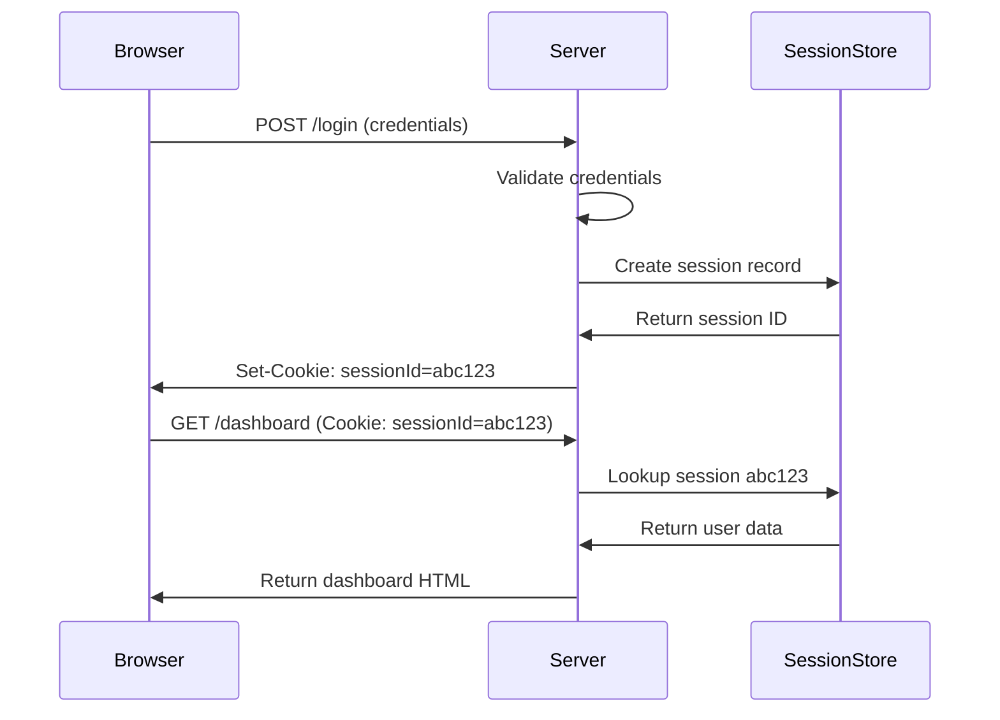
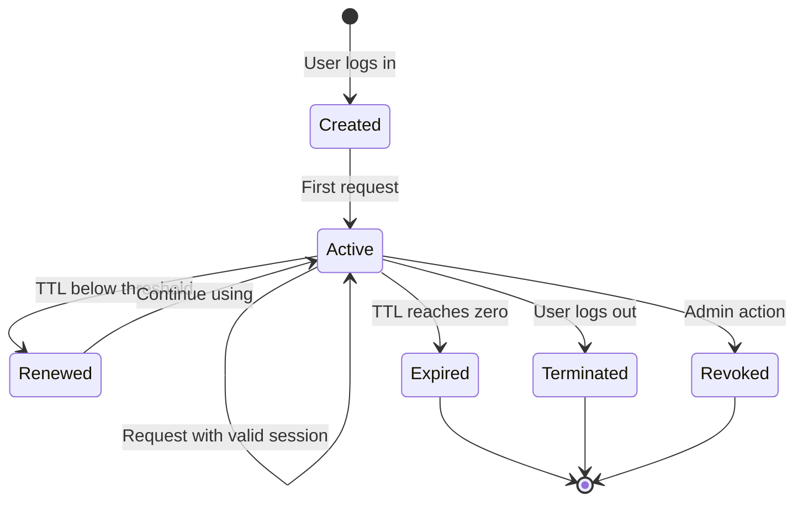
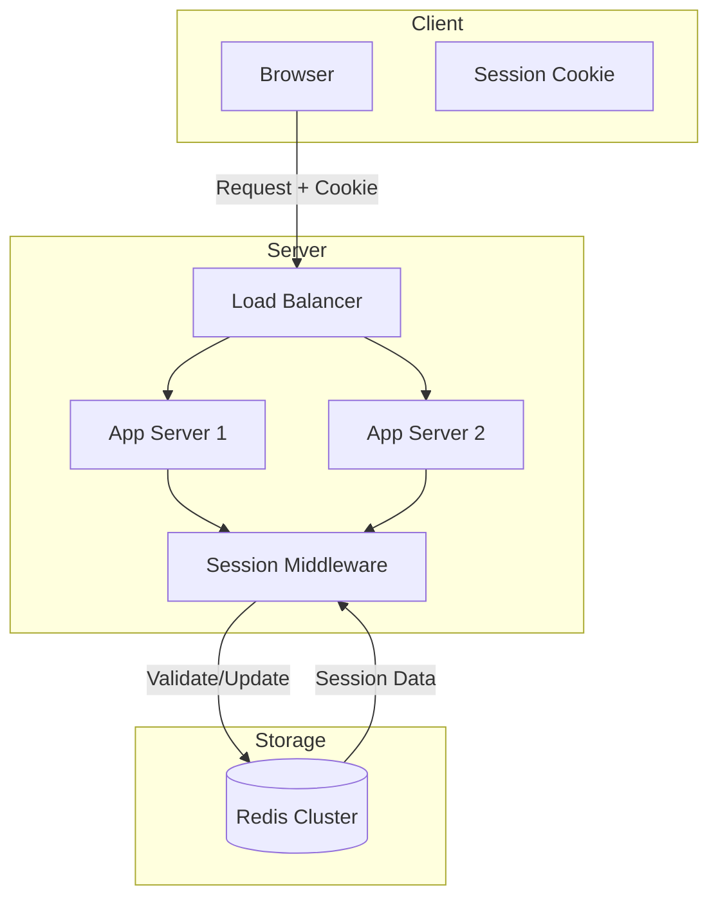

# How to Implement Session Management

Author: [nawazdhandala](https://github.com/nawazdhandala)

Tags: Security, Sessions, Cookies, Authentication

Description: Learn to implement session management for secure user session handling and tracking.

---

Sessions are the backbone of user authentication in web applications. They track who is logged in, what they have access to, and when their access should expire. Poor session management leads to security vulnerabilities like session hijacking, fixation attacks, and unauthorized access. This guide covers practical techniques for building session management that is both secure and scalable.

---

## How Sessions Work

A session begins when a user authenticates and ends when they log out or the session expires. The server creates a unique identifier, stores it along with user data, and sends it to the client. Every subsequent request includes this identifier so the server knows who is making the request.



The session ID is the only link between requests. Protect it like a password.

---

## Session Storage Options

Where you store sessions affects performance, scalability, and security.

| Storage Type | Pros | Cons | Best For |
|-------------|------|------|----------|
| In-memory | Fast, simple | Lost on restart, no scaling | Development, single server |
| Database | Persistent, queryable | Slower, more complex | Audit requirements |
| Redis | Fast, scalable, TTL support | Additional infrastructure | Production web apps |
| Cookies (encrypted) | No server storage | Size limits, more client trust | Stateless architectures |

For most production systems, Redis provides the best balance of speed and reliability.

---

## Creating Sessions

When a user logs in successfully, generate a session with a cryptographically random ID. Never use predictable values like sequential integers or timestamps.

```javascript
// session-manager.js
import crypto from 'crypto';
import Redis from 'ioredis';

const redis = new Redis(process.env.REDIS_URL);

// Session configuration
const SESSION_CONFIG = {
  ttl: 60 * 60 * 24,     // 24 hours in seconds
  prefix: 'sess:',        // Redis key prefix
  renewThreshold: 60 * 60 // Renew if less than 1 hour left
};

// Generate a secure random session ID
function generateSessionId() {
  return crypto.randomBytes(32).toString('hex');
}

// Create a new session after successful login
async function createSession(userId, metadata = {}) {
  const sessionId = generateSessionId();

  const sessionData = {
    userId,
    createdAt: Date.now(),
    lastActivity: Date.now(),
    ipAddress: metadata.ipAddress || null,
    userAgent: metadata.userAgent || null
  };

  // Store session in Redis with TTL
  await redis.setex(
    `${SESSION_CONFIG.prefix}${sessionId}`,
    SESSION_CONFIG.ttl,
    JSON.stringify(sessionData)
  );

  return sessionId;
}
```

The session ID should be at least 128 bits (32 hex characters) to prevent brute force guessing.

---

## Session Validation and Renewal

Every request with a session cookie needs validation. Check that the session exists, has not expired, and belongs to the requesting user.

```javascript
// Validate session and optionally renew it
async function validateSession(sessionId) {
  const key = `${SESSION_CONFIG.prefix}${sessionId}`;
  const data = await redis.get(key);

  if (!data) {
    return null; // Session not found or expired
  }

  const session = JSON.parse(data);
  session.lastActivity = Date.now();

  // Check remaining TTL and renew if needed
  const ttl = await redis.ttl(key);
  if (ttl < SESSION_CONFIG.renewThreshold) {
    await redis.setex(key, SESSION_CONFIG.ttl, JSON.stringify(session));
  } else {
    // Just update last activity without changing TTL
    await redis.set(key, JSON.stringify(session), 'KEEPTTL');
  }

  return session;
}

// Express middleware for session validation
function sessionMiddleware(req, res, next) {
  const sessionId = req.cookies.sessionId;

  if (!sessionId) {
    return res.status(401).json({ error: 'No session provided' });
  }

  validateSession(sessionId)
    .then(session => {
      if (!session) {
        res.clearCookie('sessionId');
        return res.status(401).json({ error: 'Session expired' });
      }
      req.session = session;
      req.sessionId = sessionId;
      next();
    })
    .catch(next);
}
```

Sliding expiration (renewing on activity) keeps active users logged in while inactive sessions expire automatically.

---

## Session Lifecycle

The diagram below shows the complete lifecycle of a session from creation to termination.



Handle all termination paths. Users expect logout to work immediately, and admins need the ability to revoke sessions for compromised accounts.

---

## Secure Cookie Configuration

The session ID travels in a cookie. Configure cookies to minimize attack surface.

```javascript
// Set session cookie with security options
function setSessionCookie(res, sessionId) {
  res.cookie('sessionId', sessionId, {
    httpOnly: true,    // Prevents JavaScript access (XSS protection)
    secure: true,      // Only sent over HTTPS
    sameSite: 'lax',   // CSRF protection while allowing normal navigation
    maxAge: SESSION_CONFIG.ttl * 1000, // Convert to milliseconds
    path: '/'          // Available to all routes
  });
}

// Login endpoint example
async function loginHandler(req, res) {
  const { email, password } = req.body;

  // Validate credentials (implementation depends on your auth system)
  const user = await authenticateUser(email, password);
  if (!user) {
    return res.status(401).json({ error: 'Invalid credentials' });
  }

  // Create session and set cookie
  const sessionId = await createSession(user.id, {
    ipAddress: req.ip,
    userAgent: req.headers['user-agent']
  });

  setSessionCookie(res, sessionId);

  res.json({ success: true, user: { id: user.id, email: user.email } });
}
```

The `httpOnly` flag is critical. It prevents client-side JavaScript from reading the session cookie, which stops most XSS attacks from stealing sessions.

---

## Session Termination

Provide multiple ways to end sessions: explicit logout, expiration, and administrative revocation.

```javascript
// End a single session (logout)
async function destroySession(sessionId) {
  await redis.del(`${SESSION_CONFIG.prefix}${sessionId}`);
}

// End all sessions for a user (password change, security event)
async function destroyAllUserSessions(userId) {
  const pattern = `${SESSION_CONFIG.prefix}*`;
  let cursor = '0';

  do {
    const [newCursor, keys] = await redis.scan(cursor, 'MATCH', pattern, 'COUNT', 100);
    cursor = newCursor;

    for (const key of keys) {
      const data = await redis.get(key);
      if (data) {
        const session = JSON.parse(data);
        if (session.userId === userId) {
          await redis.del(key);
        }
      }
    }
  } while (cursor !== '0');
}

// Logout endpoint
async function logoutHandler(req, res) {
  await destroySession(req.sessionId);
  res.clearCookie('sessionId');
  res.json({ success: true });
}
```

When users change their password, destroy all existing sessions. This prevents attackers who obtained a session from maintaining access.

---

## Preventing Session Attacks

Several attack vectors target sessions. Address each one explicitly.

| Attack | Description | Prevention |
|--------|-------------|------------|
| Session Hijacking | Attacker steals session ID | HTTPS, httpOnly cookies, IP binding |
| Session Fixation | Attacker sets session before login | Regenerate session ID on login |
| CSRF | Attacker triggers actions on behalf of user | SameSite cookies, CSRF tokens |
| Session Prediction | Attacker guesses valid session ID | Cryptographically random IDs |

Session fixation is subtle but dangerous. Always create a new session on login rather than reusing an existing one.

```javascript
// Regenerate session ID to prevent fixation
async function regenerateSession(oldSessionId, userId, metadata) {
  // Get existing session data if any
  const oldKey = `${SESSION_CONFIG.prefix}${oldSessionId}`;
  const existingData = await redis.get(oldKey);

  // Delete old session
  await redis.del(oldKey);

  // Create new session with fresh ID
  const newSessionId = generateSessionId();
  const sessionData = {
    userId,
    createdAt: existingData ? JSON.parse(existingData).createdAt : Date.now(),
    lastActivity: Date.now(),
    ...metadata
  };

  await redis.setex(
    `${SESSION_CONFIG.prefix}${newSessionId}`,
    SESSION_CONFIG.ttl,
    JSON.stringify(sessionData)
  );

  return newSessionId;
}
```

---

## Multi-Device Session Tracking

Users often log in from multiple devices. Track sessions to let users see and manage their active sessions.

```javascript
// Track sessions per user for visibility
async function getUserSessions(userId) {
  const sessions = [];
  const pattern = `${SESSION_CONFIG.prefix}*`;
  let cursor = '0';

  do {
    const [newCursor, keys] = await redis.scan(cursor, 'MATCH', pattern, 'COUNT', 100);
    cursor = newCursor;

    for (const key of keys) {
      const data = await redis.get(key);
      if (data) {
        const session = JSON.parse(data);
        if (session.userId === userId) {
          sessions.push({
            sessionId: key.replace(SESSION_CONFIG.prefix, ''),
            createdAt: session.createdAt,
            lastActivity: session.lastActivity,
            ipAddress: session.ipAddress,
            userAgent: session.userAgent
          });
        }
      }
    }
  } while (cursor !== '0');

  return sessions;
}
```

This lets users review where they are logged in and terminate suspicious sessions.

---

## Session Architecture Overview

The following diagram shows how session components interact in a typical web application.



With Redis as a shared session store, any application server can handle any request. This enables horizontal scaling without sticky sessions.

---

## Summary

Session management requires attention to security at every step. Use cryptographically random session IDs, store sessions in a fast and reliable store like Redis, configure cookies with httpOnly and secure flags, and provide clear termination paths for users and administrators.

Start with the basics: secure session creation, proper cookie settings, and reliable validation middleware. Then add features like session tracking and bulk revocation as your application matures.

The investment in proper session management pays off in fewer security incidents and greater user trust.

---

**Related Reading:**

- [How to Build Authentication Flow Design](https://oneuptime.com/blog/post/2026-01-30-authentication-flow-design/view)
- [How private status pages stay secure: authentication options explained](https://oneuptime.com/blog/post/2025-11-20-secure-your-status-page-authentication-options/view)
