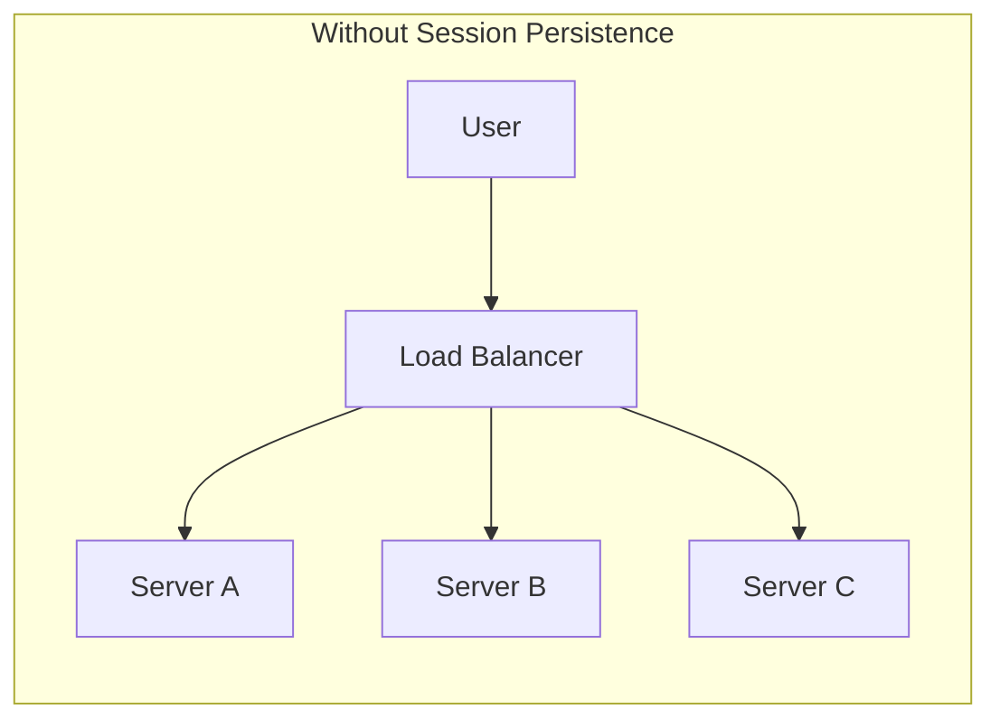
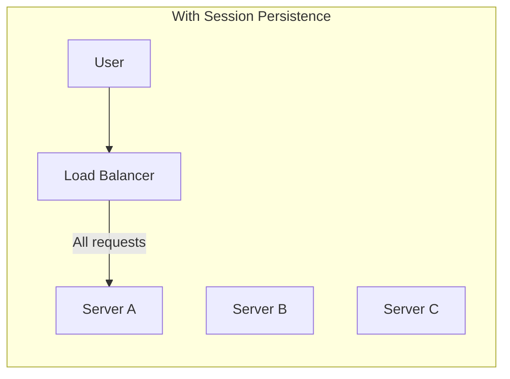
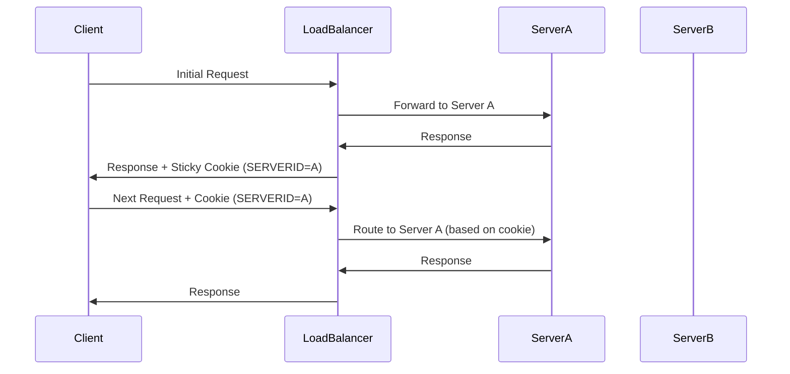
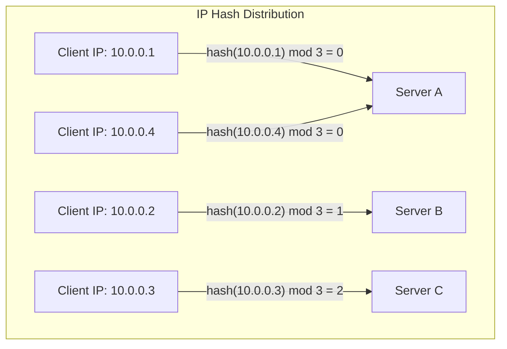
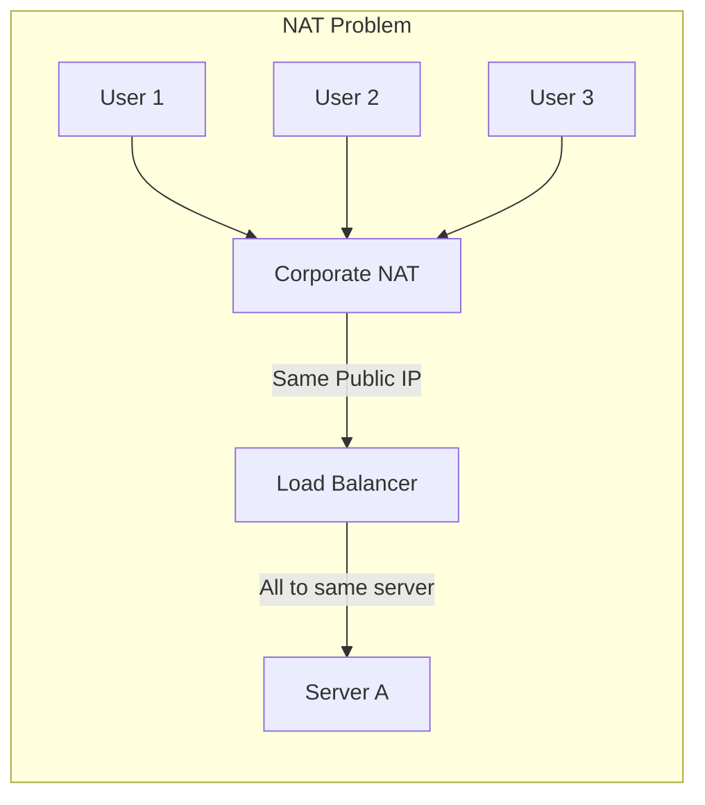
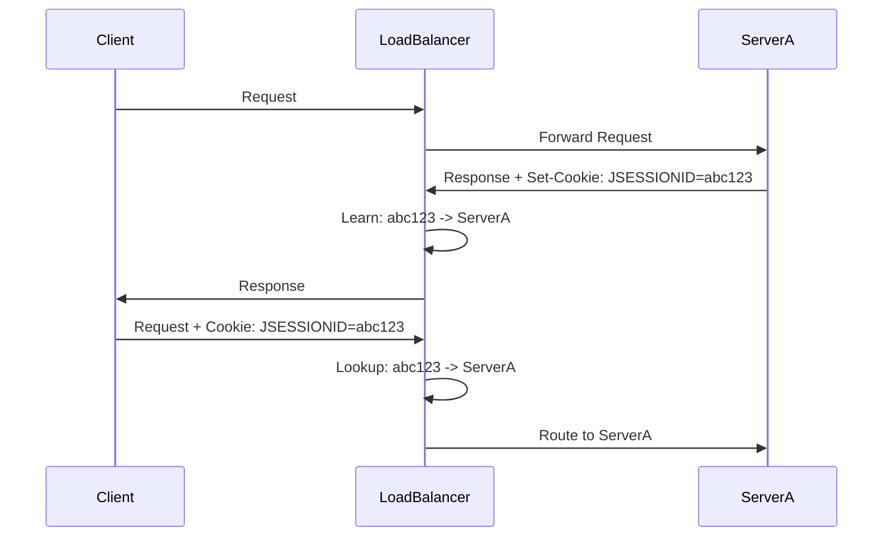
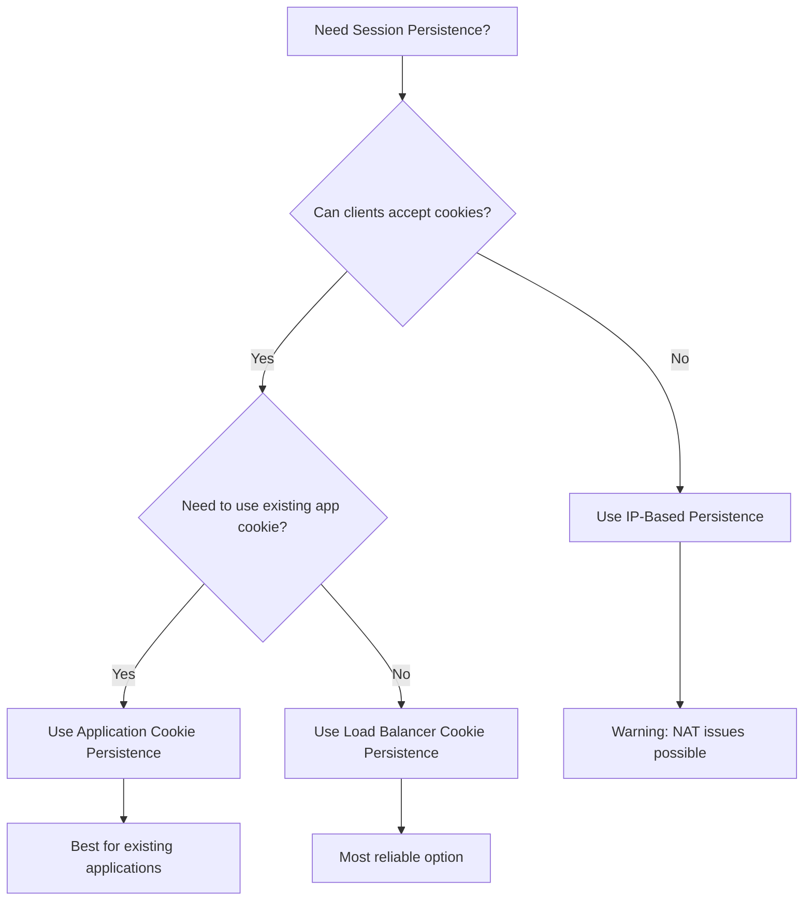
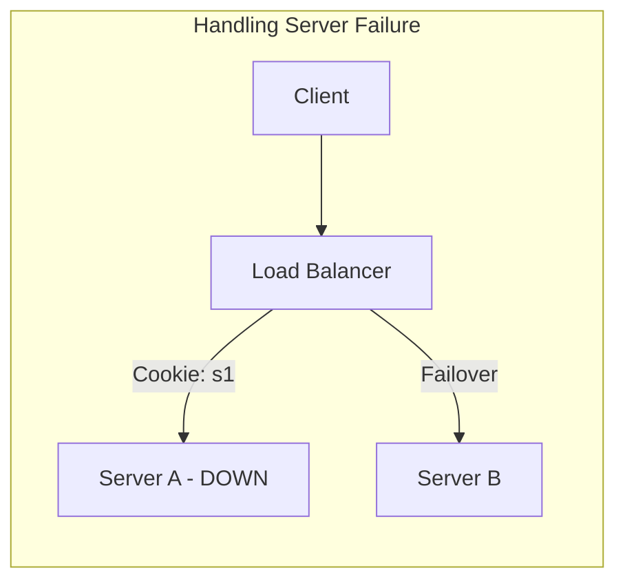
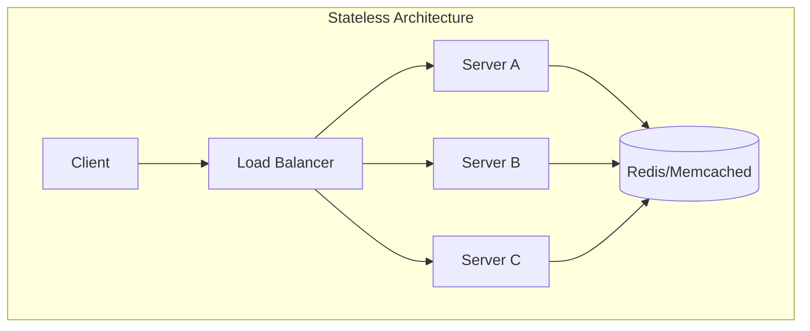

# How to Create Session Persistence

Author: [nawazdhandala](https://github.com/nawazdhandala)

Tags: Load Balancing, Session Management, Infrastructure, Backend

Description: Learn how to implement session persistence (sticky sessions) for stateful applications.

---

## Introduction

When running stateful applications behind a load balancer, you often need to ensure that a user's requests consistently route to the same backend server throughout their session. This technique is known as **session persistence** or **sticky sessions**.

Without session persistence, a user might log in on Server A, but their next request could route to Server B, which has no knowledge of their session data. This leads to broken user experiences, lost shopping carts, and authentication failures.

## Why Session Persistence Matters



In the diagram above, without persistence, the load balancer distributes requests randomly. If Server A has the user's session, but the next request goes to Server B, the session is lost.



With session persistence enabled, all requests from a specific user route to the same backend server, maintaining session state.

## Types of Session Persistence

There are three primary methods for implementing session persistence:

1. **Cookie-based persistence** - The load balancer inserts a cookie to track the backend server
2. **IP-based persistence** - Routes requests based on the client's IP address
3. **Application cookie persistence** - Uses an existing application cookie for routing decisions

Let us explore each method in detail.

---

## 1. Cookie-Based Persistence

Cookie-based persistence is the most reliable method. The load balancer generates and inserts a cookie into the response, which the client returns with subsequent requests.

### How It Works



### NGINX Configuration

```nginx
# NGINX upstream configuration with cookie-based sticky sessions
# This uses the sticky cookie directive (requires nginx-plus or sticky module)

upstream backend_servers {
    # Define the backend server pool
    server 192.168.1.10:8080;
    server 192.168.1.11:8080;
    server 192.168.1.12:8080;

    # Enable cookie-based sticky sessions
    # Cookie name: SERVERID
    # expires: Cookie lifetime (1 hour)
    # path: Cookie path
    # httponly: Prevent JavaScript access for security
    sticky cookie SERVERID expires=1h path=/ httponly;
}

server {
    listen 80;
    server_name example.com;

    location / {
        # Forward requests to the upstream group
        proxy_pass http://backend_servers;

        # Preserve the original host header
        proxy_set_header Host $host;

        # Forward the real client IP
        proxy_set_header X-Real-IP $remote_addr;

        # Include forwarded-for header chain
        proxy_set_header X-Forwarded-For $proxy_add_x_forwarded_for;
    }
}
```

### HAProxy Configuration

```haproxy
# HAProxy configuration with cookie-based persistence
# This inserts a SERVERID cookie to track backend assignment

global
    # Global settings
    log /dev/log local0
    maxconn 4096

defaults
    # Default settings applied to all frontends and backends
    mode http
    log global
    option httplog
    option dontlognull
    timeout connect 5000ms
    timeout client 50000ms
    timeout server 50000ms

frontend http_front
    # Frontend that listens for incoming connections
    bind *:80

    # Route all traffic to the backend pool
    default_backend http_back

backend http_back
    # Backend server pool configuration
    balance roundrobin

    # Enable cookie-based persistence
    # insert: HAProxy inserts the cookie
    # indirect: Cookie is removed before forwarding to backend
    # nocache: Prevents caching of responses with this cookie
    # httponly: Security flag to prevent JavaScript access
    cookie SERVERID insert indirect nocache httponly

    # Define backend servers with their cookie values
    # Each server gets a unique cookie identifier
    server server1 192.168.1.10:8080 check cookie s1
    server server2 192.168.1.11:8080 check cookie s2
    server server3 192.168.1.12:8080 check cookie s3
```

---

## 2. IP-Based Persistence

IP-based persistence routes requests based on the client's source IP address. This method does not require cookies but has limitations with users behind NAT or using VPNs.

### How It Works



### NGINX Configuration

```nginx
# NGINX upstream configuration with IP hash persistence
# Requests from the same IP always route to the same server

upstream backend_servers {
    # Enable IP-based hashing
    # This ensures clients with the same IP reach the same backend
    ip_hash;

    # Define backend servers
    server 192.168.1.10:8080;
    server 192.168.1.11:8080;
    server 192.168.1.12:8080;

    # Mark a server as down without redistributing its clients
    # server 192.168.1.13:8080 down;
}

server {
    listen 80;
    server_name example.com;

    location / {
        proxy_pass http://backend_servers;

        # Important: Forward the real client IP for proper hashing
        # when behind another proxy or CDN
        proxy_set_header X-Real-IP $remote_addr;
        proxy_set_header X-Forwarded-For $proxy_add_x_forwarded_for;
        proxy_set_header Host $host;
    }
}
```

### HAProxy Configuration

```haproxy
# HAProxy configuration with source IP persistence
# Uses consistent hashing based on client IP

global
    log /dev/log local0
    maxconn 4096

defaults
    mode http
    log global
    option httplog
    timeout connect 5000ms
    timeout client 50000ms
    timeout server 50000ms

frontend http_front
    bind *:80
    default_backend http_back

backend http_back
    # Use source IP for load balancing decisions
    # This creates a hash of the source IP to select a server
    balance source

    # Optional: Use consistent hashing for better distribution
    # when servers are added or removed
    hash-type consistent

    # Define backend servers
    server server1 192.168.1.10:8080 check
    server server2 192.168.1.11:8080 check
    server server3 192.168.1.12:8080 check
```

### Limitations of IP-Based Persistence



When multiple users share the same public IP (common in corporate environments), they all route to the same backend server. This can cause uneven load distribution.

---

## 3. Application Cookie Persistence

Application cookie persistence uses an existing cookie set by your application (like a session ID) to make routing decisions. This method is useful when you cannot modify the load balancer's cookie behavior.

### How It Works



### NGINX Configuration

```nginx
# NGINX configuration using application session cookie
# Routes based on the application's JSESSIONID cookie

upstream backend_servers {
    server 192.168.1.10:8080;
    server 192.168.1.11:8080;
    server 192.168.1.12:8080;

    # Use the application's JSESSIONID cookie for routing
    # The load balancer learns the cookie-to-server mapping
    sticky learn
        create=$upstream_cookie_JSESSIONID    # Learn from Set-Cookie header
        lookup=$cookie_JSESSIONID             # Look up from request Cookie header
        zone=client_sessions:1m               # Shared memory zone for session data
        timeout=1h;                           # Session timeout
}

server {
    listen 80;
    server_name example.com;

    location / {
        proxy_pass http://backend_servers;
        proxy_set_header Host $host;
        proxy_set_header X-Real-IP $remote_addr;
        proxy_set_header X-Forwarded-For $proxy_add_x_forwarded_for;
    }
}
```

### HAProxy Configuration

```haproxy
# HAProxy configuration with application cookie persistence
# Uses the application's existing session cookie

global
    log /dev/log local0
    maxconn 4096

defaults
    mode http
    log global
    option httplog
    timeout connect 5000ms
    timeout client 50000ms
    timeout server 50000ms

frontend http_front
    bind *:80
    default_backend http_back

backend http_back
    balance roundrobin

    # Use the application's JSESSIONID cookie for persistence
    # prefix: HAProxy prepends server info to the existing cookie value
    # This modifies JSESSIONID=abc123 to JSESSIONID=s1~abc123
    cookie JSESSIONID prefix nocache

    # Alternative: Learn the cookie without modification
    # stick-table type string len 64 size 1m expire 1h
    # stick store-response res.cook(JSESSIONID)
    # stick match req.cook(JSESSIONID)

    # Define backend servers
    server server1 192.168.1.10:8080 check cookie s1
    server server2 192.168.1.11:8080 check cookie s2
    server server3 192.168.1.12:8080 check cookie s3
```

---

## Choosing the Right Method



### Comparison Table

| Method | Pros | Cons | Best For |
|--------|------|------|----------|
| Cookie-based | Reliable, works with NAT | Requires cookie support | Most web applications |
| IP-based | No cookies needed | NAT issues, uneven distribution | API clients, mobile apps |
| Application cookie | Uses existing cookies | More complex configuration | Legacy applications |

---

## Best Practices

### 1. Always Plan for Server Failures



Configure your load balancer to handle backend server failures gracefully:

```haproxy
# HAProxy backend with health checks and failover
backend http_back
    balance roundrobin
    cookie SERVERID insert indirect nocache httponly

    # Health check configuration
    option httpchk GET /health
    http-check expect status 200

    # Server definitions with health checks
    # inter: Check interval
    # fall: Number of failures before marking down
    # rise: Number of successes before marking up
    server server1 192.168.1.10:8080 check inter 5s fall 3 rise 2 cookie s1
    server server2 192.168.1.11:8080 check inter 5s fall 3 rise 2 cookie s2
    server server3 192.168.1.12:8080 check inter 5s fall 3 rise 2 cookie s3
```

### 2. Set Appropriate Timeouts

Session persistence should have reasonable timeouts to prevent memory bloat:

```nginx
# NGINX sticky session with timeout
upstream backend_servers {
    server 192.168.1.10:8080;
    server 192.168.1.11:8080;

    # Cookie expires after 1 hour of inactivity
    sticky cookie SERVERID expires=1h path=/;
}
```

### 3. Monitor Session Distribution

Ensure sessions are evenly distributed across your backend servers:

```bash
# Check HAProxy statistics for session distribution
# Access the stats page at http://loadbalancer:8404/stats

# Or query the stats socket
echo "show stat" | socat stdio /var/run/haproxy.sock | \
    awk -F',' '{print $1, $2, $5, $8}'
```

### 4. Consider Stateless Architecture

While session persistence solves immediate problems, consider moving toward a stateless architecture:



Store session data in a shared cache (Redis, Memcached) so any server can handle any request. This provides:

- Better fault tolerance
- Easier scaling
- No sticky session overhead

---

## Complete Configuration Examples

### Production NGINX Configuration

```nginx
# Complete NGINX configuration for production use
# with cookie-based session persistence

# Define upstream servers with health checks
upstream app_backend {
    # Enable sticky sessions with secure cookie
    sticky cookie SERVERID
        expires=1h
        path=/
        httponly
        secure;  # Only send cookie over HTTPS

    # Backend servers with slow start
    # slow_start prevents overwhelming a newly added server
    server 192.168.1.10:8080 weight=5 slow_start=30s;
    server 192.168.1.11:8080 weight=5 slow_start=30s;
    server 192.168.1.12:8080 weight=5 slow_start=30s;

    # Backup server used only when all primary servers are down
    server 192.168.1.99:8080 backup;

    # Keep connections alive to backends
    keepalive 32;
}

server {
    listen 443 ssl http2;
    server_name example.com;

    # SSL configuration
    ssl_certificate /etc/nginx/ssl/cert.pem;
    ssl_certificate_key /etc/nginx/ssl/key.pem;

    location / {
        proxy_pass http://app_backend;

        # Required headers
        proxy_set_header Host $host;
        proxy_set_header X-Real-IP $remote_addr;
        proxy_set_header X-Forwarded-For $proxy_add_x_forwarded_for;
        proxy_set_header X-Forwarded-Proto $scheme;

        # Connection keep-alive to upstream
        proxy_http_version 1.1;
        proxy_set_header Connection "";

        # Timeouts
        proxy_connect_timeout 5s;
        proxy_send_timeout 60s;
        proxy_read_timeout 60s;
    }

    # Health check endpoint
    location /health {
        access_log off;
        return 200 "healthy\n";
        add_header Content-Type text/plain;
    }
}
```

### Production HAProxy Configuration

```haproxy
# Complete HAProxy configuration for production use
# with cookie-based session persistence

global
    log /dev/log local0
    log /dev/log local1 notice
    chroot /var/lib/haproxy
    stats socket /run/haproxy/admin.sock mode 660 level admin
    stats timeout 30s
    user haproxy
    group haproxy
    daemon

    # Security settings
    ssl-default-bind-ciphers ECDHE-ECDSA-AES128-GCM-SHA256:ECDHE-RSA-AES128-GCM-SHA256
    ssl-default-bind-options ssl-min-ver TLSv1.2 no-tls-tickets

defaults
    mode http
    log global
    option httplog
    option dontlognull
    option http-server-close
    option forwardfor except 127.0.0.0/8
    option redispatch
    retries 3
    timeout http-request 10s
    timeout queue 1m
    timeout connect 10s
    timeout client 1m
    timeout server 1m
    timeout http-keep-alive 10s
    timeout check 10s
    maxconn 3000

# Statistics page
listen stats
    bind *:8404
    stats enable
    stats uri /stats
    stats refresh 10s
    stats admin if LOCALHOST

frontend https_front
    bind *:443 ssl crt /etc/haproxy/certs/example.pem

    # Security headers
    http-response set-header Strict-Transport-Security "max-age=31536000"

    # ACLs for routing
    acl is_api path_beg /api

    # Route to appropriate backend
    use_backend api_backend if is_api
    default_backend web_backend

backend web_backend
    balance roundrobin

    # Cookie-based persistence
    cookie SERVERID insert indirect nocache httponly secure

    # Health checks
    option httpchk GET /health
    http-check expect status 200

    # Backend servers
    server web1 192.168.1.10:8080 check inter 5s fall 3 rise 2 cookie web1
    server web2 192.168.1.11:8080 check inter 5s fall 3 rise 2 cookie web2
    server web3 192.168.1.12:8080 check inter 5s fall 3 rise 2 cookie web3

backend api_backend
    balance roundrobin

    # IP-based persistence for API (no cookies)
    balance source
    hash-type consistent

    # Health checks
    option httpchk GET /api/health
    http-check expect status 200

    # Backend servers
    server api1 192.168.1.20:8080 check inter 5s fall 3 rise 2
    server api2 192.168.1.21:8080 check inter 5s fall 3 rise 2
    server api3 192.168.1.22:8080 check inter 5s fall 3 rise 2
```

---

## Troubleshooting

### Common Issues and Solutions

**1. Sessions not persisting**
- Verify the cookie is being set (check browser developer tools)
- Ensure the cookie path matches your application paths
- Check that the cookie is not being blocked by browser settings

**2. Uneven distribution with IP hash**
- This is normal when clients share IPs (NAT)
- Consider switching to cookie-based persistence

**3. Session loss after server restart**
- HAProxy and NGINX store session mappings in memory
- Consider using a stick table with peers for HA setups

**4. High memory usage**
- Reduce session timeout values
- Limit the stick table size in HAProxy

---

## Conclusion

Session persistence is essential for stateful applications running behind load balancers. Choose your persistence method based on your application requirements:

- **Cookie-based**: Best for most web applications with browser clients
- **IP-based**: Suitable for API clients or when cookies are not available
- **Application cookie**: Ideal when integrating with existing session management

Remember that session persistence is a workaround for stateful applications. When possible, design your applications to be stateless by storing session data in a shared cache. This approach provides better scalability, fault tolerance, and operational simplicity.

For production deployments, always implement health checks, set appropriate timeouts, and monitor session distribution across your backend servers.
