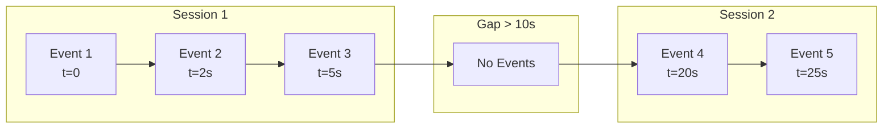
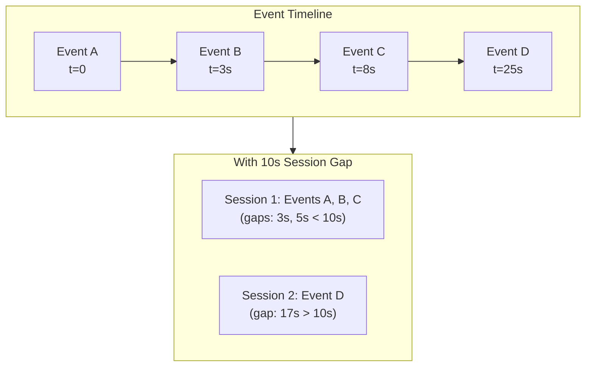
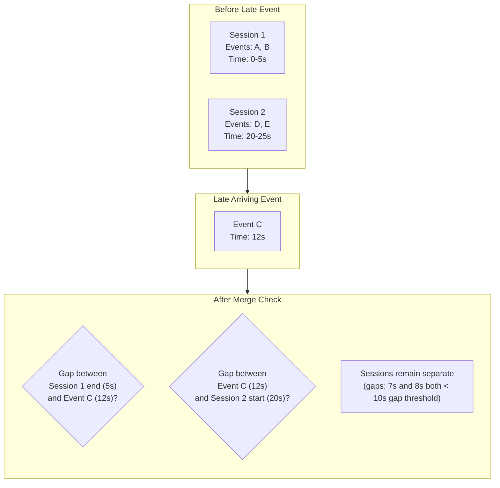
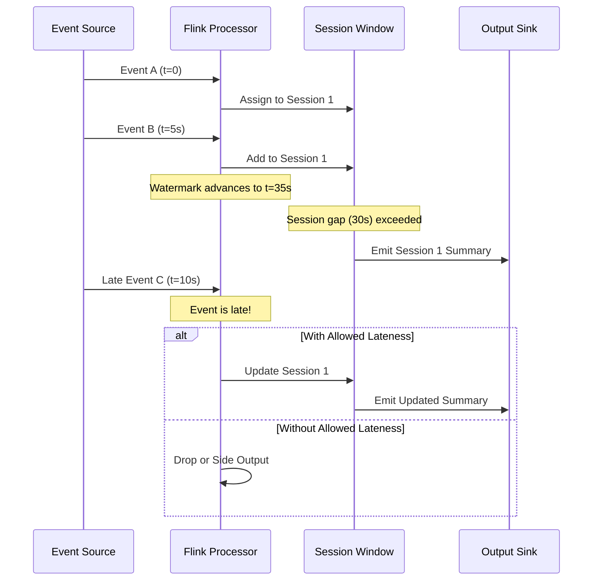

# How to Implement Session Windows

Author: [nawazdhandala](https://github.com/nawazdhandala)

Tags: Stream Processing, Windowing, User Sessions, Apache Flink

Description: Learn how to implement session windows for activity-based stream aggregations.

---

## Introduction

Session windows are a powerful windowing strategy in stream processing that group events based on periods of activity. Unlike fixed time windows (tumbling or sliding), session windows have dynamic boundaries that adapt to the actual data patterns. They are particularly useful for analyzing user behavior, tracking website visits, or monitoring device activity.

In this post, we will explore how session windows work, when to use them, and how to implement them using Apache Flink.

## What Are Session Windows?

A session window groups events that arrive within a specified gap duration of each other. When no events arrive for a period longer than the session gap, the window closes and a new session begins with the next event.



### Key Characteristics

- **Dynamic boundaries**: Windows start and end based on event arrival patterns
- **Activity-based**: Sessions represent periods of continuous activity
- **Gap-driven**: A configurable inactivity gap determines when sessions end
- **Variable length**: Each session can have a different duration

## Session Gap Configuration

The session gap is the maximum allowed period of inactivity between events. If the time between two consecutive events exceeds this gap, they belong to different sessions.



### Choosing the Right Gap

The session gap should reflect your domain requirements:

| Use Case | Recommended Gap | Reasoning |
|----------|----------------|-----------|
| Web analytics | 30 minutes | Standard for web session tracking |
| Mobile app usage | 5 to 15 minutes | Users switch apps frequently |
| IoT sensor data | 1 to 5 minutes | Depends on reporting frequency |
| Gaming sessions | 10 to 30 minutes | Accounts for breaks and loading |

## Session Merging

When events arrive out of order (common in distributed systems), session windows may need to be merged. This happens when a late-arriving event falls between two existing sessions and bridges the gap.



### Merge Algorithm

```java
// Session merge logic pseudocode
// This function determines if two sessions should be merged based on the gap threshold

public class SessionMerger {

    private final long sessionGapMs;

    public SessionMerger(long sessionGapMs) {
        // Store the configured session gap in milliseconds
        this.sessionGapMs = sessionGapMs;
    }

    /**
     * Determines if two sessions should be merged.
     * Sessions merge when the gap between them is less than the threshold.
     *
     * @param session1End   End timestamp of the first session
     * @param session2Start Start timestamp of the second session
     * @return true if sessions should be merged, false otherwise
     */
    public boolean shouldMerge(long session1End, long session2Start) {
        // Calculate the gap between session end and next session start
        long gap = session2Start - session1End;

        // Merge if the gap is smaller than our configured threshold
        return gap < sessionGapMs;
    }

    /**
     * Merges two sessions into one combined session.
     * The merged session spans from the earliest start to the latest end.
     *
     * @param session1 First session to merge
     * @param session2 Second session to merge
     * @return A new merged session containing all events from both sessions
     */
    public Session merge(Session session1, Session session2) {
        // Create new session with combined boundaries
        return new Session(
            // Take the earlier start time
            Math.min(session1.getStart(), session2.getStart()),
            // Take the later end time
            Math.max(session1.getEnd(), session2.getEnd()),
            // Combine all events from both sessions
            combineEvents(session1.getEvents(), session2.getEvents())
        );
    }
}
```

## Implementing Session Windows in Apache Flink

Apache Flink provides built-in support for session windows. Here is a complete example for tracking user activity sessions.

### Basic Session Window Example

```java
import org.apache.flink.streaming.api.datastream.DataStream;
import org.apache.flink.streaming.api.environment.StreamExecutionEnvironment;
import org.apache.flink.streaming.api.windowing.assigners.EventTimeSessionWindows;
import org.apache.flink.streaming.api.windowing.time.Time;

public class UserSessionAnalytics {

    public static void main(String[] args) throws Exception {
        // Create the execution environment
        // This is the entry point for all Flink programs
        StreamExecutionEnvironment env =
            StreamExecutionEnvironment.getExecutionEnvironment();

        // Configure event time processing
        // Event time uses timestamps embedded in the events themselves
        env.setStreamTimeCharacteristic(TimeCharacteristic.EventTime);

        // Create a stream of user activity events
        // In production, this would come from Kafka, Kinesis, etc.
        DataStream<UserActivity> activityStream = env
            .addSource(new UserActivitySource())
            // Assign timestamps and watermarks for event time processing
            .assignTimestampsAndWatermarks(
                WatermarkStrategy
                    .<UserActivity>forBoundedOutOfOrderness(Duration.ofSeconds(5))
                    .withTimestampAssigner((event, timestamp) -> event.getTimestamp())
            );

        // Apply session window with 30-minute gap
        DataStream<SessionSummary> sessionSummaries = activityStream
            // Group events by user ID so each user has their own sessions
            .keyBy(UserActivity::getUserId)
            // Apply session window with 30-minute inactivity gap
            .window(EventTimeSessionWindows.withGap(Time.minutes(30)))
            // Aggregate events within each session
            .aggregate(new SessionAggregator());

        // Output the session summaries
        sessionSummaries.addSink(new SessionSummarySink());

        // Execute the Flink job
        env.execute("User Session Analytics");
    }
}
```

### User Activity Data Model

```java
/**
 * Represents a single user activity event.
 * Each event captures what action a user performed and when.
 */
public class UserActivity {

    // Unique identifier for the user
    private String userId;

    // Type of activity (page_view, click, purchase, etc.)
    private String activityType;

    // Unix timestamp in milliseconds when the activity occurred
    private long timestamp;

    // Additional context about the activity
    private String pageUrl;
    private String deviceType;

    // Constructor
    public UserActivity(String userId, String activityType,
                        long timestamp, String pageUrl, String deviceType) {
        this.userId = userId;
        this.activityType = activityType;
        this.timestamp = timestamp;
        this.pageUrl = pageUrl;
        this.deviceType = deviceType;
    }

    // Getters
    public String getUserId() { return userId; }
    public String getActivityType() { return activityType; }
    public long getTimestamp() { return timestamp; }
    public String getPageUrl() { return pageUrl; }
    public String getDeviceType() { return deviceType; }
}
```

### Session Aggregator Implementation

```java
import org.apache.flink.api.common.functions.AggregateFunction;

/**
 * Aggregates user activities within a session window.
 * Produces a summary with session statistics.
 */
public class SessionAggregator
    implements AggregateFunction<UserActivity, SessionAccumulator, SessionSummary> {

    /**
     * Creates the initial accumulator for a new session.
     * Called when the first event arrives in a window.
     */
    @Override
    public SessionAccumulator createAccumulator() {
        return new SessionAccumulator();
    }

    /**
     * Adds an event to the accumulator.
     * Called for each event that falls into the session window.
     */
    @Override
    public SessionAccumulator add(UserActivity activity,
                                   SessionAccumulator accumulator) {
        // Track the user ID (same for all events in this keyed window)
        accumulator.setUserId(activity.getUserId());

        // Update session start time (earliest event)
        if (accumulator.getSessionStart() == 0 ||
            activity.getTimestamp() < accumulator.getSessionStart()) {
            accumulator.setSessionStart(activity.getTimestamp());
        }

        // Update session end time (latest event)
        if (activity.getTimestamp() > accumulator.getSessionEnd()) {
            accumulator.setSessionEnd(activity.getTimestamp());
        }

        // Increment total event count
        accumulator.incrementEventCount();

        // Track page views specifically
        if ("page_view".equals(activity.getActivityType())) {
            accumulator.incrementPageViews();
            accumulator.addPageUrl(activity.getPageUrl());
        }

        // Track purchases for conversion analysis
        if ("purchase".equals(activity.getActivityType())) {
            accumulator.incrementPurchases();
        }

        return accumulator;
    }

    /**
     * Produces the final session summary from the accumulator.
     * Called when the session window closes.
     */
    @Override
    public SessionSummary getResult(SessionAccumulator accumulator) {
        // Calculate session duration in seconds
        long durationSeconds =
            (accumulator.getSessionEnd() - accumulator.getSessionStart()) / 1000;

        return new SessionSummary(
            accumulator.getUserId(),
            accumulator.getSessionStart(),
            accumulator.getSessionEnd(),
            durationSeconds,
            accumulator.getEventCount(),
            accumulator.getPageViews(),
            accumulator.getPurchases(),
            accumulator.getUniquePages()
        );
    }

    /**
     * Merges two accumulators when sessions are merged.
     * This handles late-arriving events that bridge session gaps.
     */
    @Override
    public SessionAccumulator merge(SessionAccumulator a, SessionAccumulator b) {
        SessionAccumulator merged = new SessionAccumulator();

        merged.setUserId(a.getUserId());

        // Take the earliest start time from both sessions
        merged.setSessionStart(Math.min(a.getSessionStart(), b.getSessionStart()));

        // Take the latest end time from both sessions
        merged.setSessionEnd(Math.max(a.getSessionEnd(), b.getSessionEnd()));

        // Combine event counts
        merged.setEventCount(a.getEventCount() + b.getEventCount());
        merged.setPageViews(a.getPageViews() + b.getPageViews());
        merged.setPurchases(a.getPurchases() + b.getPurchases());

        // Merge unique pages visited
        merged.addAllPageUrls(a.getUniquePages());
        merged.addAllPageUrls(b.getUniquePages());

        return merged;
    }
}
```

### Session Summary Output

```java
/**
 * Represents the final summary of a user session.
 * Contains all aggregated metrics for analysis.
 */
public class SessionSummary {

    private String userId;
    private long sessionStart;
    private long sessionEnd;
    private long durationSeconds;
    private int totalEvents;
    private int pageViews;
    private int purchases;
    private Set<String> pagesVisited;

    // Constructor and getters omitted for brevity

    /**
     * Formats the session summary for logging or output.
     */
    @Override
    public String toString() {
        return String.format(
            "Session[user=%s, start=%s, duration=%ds, events=%d, pages=%d, purchases=%d]",
            userId,
            Instant.ofEpochMilli(sessionStart).toString(),
            durationSeconds,
            totalEvents,
            pageViews,
            purchases
        );
    }
}
```

## Handling Late Data

In distributed systems, events can arrive late due to network delays or processing backlogs. Flink provides mechanisms to handle late data in session windows.



### Configuring Late Data Handling

```java
DataStream<SessionSummary> sessionSummaries = activityStream
    .keyBy(UserActivity::getUserId)
    .window(EventTimeSessionWindows.withGap(Time.minutes(30)))
    // Allow events up to 1 hour late to still be processed
    .allowedLateness(Time.hours(1))
    // Send very late events to a side output for separate handling
    .sideOutputLateData(lateDataTag)
    .aggregate(new SessionAggregator());

// Process late events separately
DataStream<UserActivity> lateEvents = sessionSummaries.getSideOutput(lateDataTag);
lateEvents.addSink(new LateEventHandler());
```

## Dynamic Session Gaps

Sometimes you need different session gaps for different users or event types. Flink supports this through custom session window assigners.

```java
import org.apache.flink.streaming.api.windowing.assigners.SessionWindowTimeGapExtractor;

/**
 * Determines the session gap dynamically based on the event.
 * Allows different users or activity types to have different session definitions.
 */
public class DynamicSessionGap
    implements SessionWindowTimeGapExtractor<UserActivity> {

    @Override
    public long extract(UserActivity activity) {
        // Premium users get longer session gaps (they might take longer breaks)
        if (isPremiumUser(activity.getUserId())) {
            return Time.hours(1).toMilliseconds();
        }

        // Mobile users typically have shorter sessions
        if ("mobile".equals(activity.getDeviceType())) {
            return Time.minutes(15).toMilliseconds();
        }

        // Default session gap for regular web users
        return Time.minutes(30).toMilliseconds();
    }

    private boolean isPremiumUser(String userId) {
        // Check user's subscription status
        // In practice, this might involve a lookup or broadcast state
        return premiumUserCache.contains(userId);
    }
}

// Usage with dynamic gaps
DataStream<SessionSummary> sessionSummaries = activityStream
    .keyBy(UserActivity::getUserId)
    .window(EventTimeSessionWindows.withDynamicGap(new DynamicSessionGap()))
    .aggregate(new SessionAggregator());
```

## Complete User Activity Tracking Example

Here is a full example that tracks user sessions on an e-commerce website.

```java
import org.apache.flink.streaming.api.datastream.DataStream;
import org.apache.flink.streaming.api.environment.StreamExecutionEnvironment;
import org.apache.flink.streaming.api.windowing.assigners.EventTimeSessionWindows;
import org.apache.flink.streaming.api.windowing.time.Time;
import org.apache.flink.api.common.eventtime.WatermarkStrategy;
import java.time.Duration;

/**
 * Complete example: E-commerce user session analytics.
 * Tracks user journeys from landing to purchase.
 */
public class EcommerceSessionAnalytics {

    // Tag for late-arriving events
    private static final OutputTag<UserActivity> LATE_DATA_TAG =
        new OutputTag<UserActivity>("late-data") {};

    public static void main(String[] args) throws Exception {
        // Initialize the Flink execution environment
        StreamExecutionEnvironment env =
            StreamExecutionEnvironment.getExecutionEnvironment();

        // Enable checkpointing for fault tolerance
        // Checkpoints every 5 minutes to recover from failures
        env.enableCheckpointing(300000);

        // Read user activity events from Kafka
        DataStream<UserActivity> activityStream = env
            .addSource(createKafkaSource())
            .name("Kafka User Activity Source")
            // Parse JSON events into UserActivity objects
            .map(new JsonToUserActivityMapper())
            .name("JSON Parser")
            // Assign timestamps based on event time
            .assignTimestampsAndWatermarks(
                WatermarkStrategy
                    // Allow up to 30 seconds of out-of-orderness
                    .<UserActivity>forBoundedOutOfOrderness(Duration.ofSeconds(30))
                    // Extract timestamp from the event
                    .withTimestampAssigner((event, ts) -> event.getTimestamp())
                    // Handle idle sources that stop producing events
                    .withIdleness(Duration.ofMinutes(1))
            )
            .name("Timestamp Assigner");

        // Process session windows
        SingleOutputStreamOperator<SessionSummary> sessionSummaries = activityStream
            // Key by user ID so each user has independent sessions
            .keyBy(UserActivity::getUserId)
            // 30-minute session gap (standard for web analytics)
            .window(EventTimeSessionWindows.withGap(Time.minutes(30)))
            // Allow late data up to 2 hours (handles delayed mobile events)
            .allowedLateness(Time.hours(2))
            // Capture very late events for debugging
            .sideOutputLateData(LATE_DATA_TAG)
            // Custom trigger: also fire on first purchase in session
            .trigger(new PurchaseOrEndOfSessionTrigger())
            // Aggregate events into session summaries
            .aggregate(
                new SessionAggregator(),
                new SessionWindowFunction()  // Adds window metadata
            )
            .name("Session Window Aggregation");

        // Output session summaries to multiple sinks

        // 1. Write to Elasticsearch for real-time dashboards
        sessionSummaries
            .addSink(createElasticsearchSink())
            .name("Elasticsearch Sink");

        // 2. Write to Kafka for downstream processing
        sessionSummaries
            .map(SessionSummary::toJson)
            .addSink(createKafkaSink())
            .name("Kafka Output Sink");

        // 3. Handle late events separately
        DataStream<UserActivity> lateEvents =
            sessionSummaries.getSideOutput(LATE_DATA_TAG);

        lateEvents
            .addSink(new LateEventAlerter())
            .name("Late Event Handler");

        // Execute the Flink job
        env.execute("E-commerce Session Analytics");
    }
}
```

## Session Window Visualization

The following diagram shows how events are grouped into sessions over time.

```mermaid
gantt
    title User Session Windows Example
    dateFormat X
    axisFormat %S

    section User A
    Session 1      :active, a1, 0, 15
    Gap            :done, a2, 15, 45
    Session 2      :active, a3, 45, 70

    section User B
    Session 1      :active, b1, 5, 60

    section User C
    Session 1      :active, c1, 0, 10
    Gap            :done, c2, 10, 25
    Session 2      :active, c3, 25, 35
    Gap            :done, c4, 35, 50
    Session 3      :active, c5, 50, 80
```



## Best Practices

### 1. Choose Appropriate Session Gaps

Consider your domain when setting session gaps. Analyze your historical data to find natural breaks in user activity.

### 2. Handle Late Data Gracefully

Configure allowed lateness based on your data characteristics. Use side outputs to capture extremely late data for separate processing.

### 3. Monitor Session Metrics

Track metrics such as:
- Average session duration
- Events per session
- Session gap distribution
- Late event frequency

### 4. Consider Memory Usage

Long sessions with many events can consume significant memory. Consider using incremental aggregation and reducing state size.

```java
// Use incremental aggregation to reduce memory footprint
.aggregate(
    new IncrementalSessionAggregator(),  // Aggregates incrementally
    new SessionWindowFunction()           // Only adds window metadata
)
```

### 5. Test Session Merging

Write tests that verify session merging works correctly with out-of-order events.

```java
@Test
public void testSessionMerging() {
    // Arrange: Create events that will trigger session merge
    UserActivity event1 = new UserActivity("user1", "view", 1000L, "/home", "web");
    UserActivity event2 = new UserActivity("user1", "view", 5000L, "/products", "web");
    // This late event should merge with the previous session
    UserActivity lateEvent = new UserActivity("user1", "click", 3000L, "/home", "web");

    // Act: Process events through session window
    harness.processElement(event1, 1000L);
    harness.processElement(event2, 5000L);
    harness.processWatermark(6000L);
    harness.processElement(lateEvent, 3000L);  // Late arrival

    // Assert: Verify session was updated correctly
    List<SessionSummary> results = harness.extractOutputValues();
    assertEquals(3, results.get(results.size() - 1).getTotalEvents());
}
```

## Conclusion

Session windows are essential for analyzing user behavior and activity patterns in stream processing. They provide natural groupings based on activity rather than fixed time intervals. Key takeaways:

- Session windows close after a configurable inactivity gap
- Late events may trigger session merges
- Apache Flink provides robust session window support
- Consider dynamic gaps for different user segments
- Always handle late data appropriately

By implementing session windows effectively, you can gain valuable insights into user journeys, identify engagement patterns, and improve your application's user experience.

## Further Reading

- [Apache Flink Documentation on Windows](https://nightlies.apache.org/flink/flink-docs-stable/docs/dev/datastream/operators/windows/)
- [Event Time Processing in Flink](https://nightlies.apache.org/flink/flink-docs-stable/docs/concepts/time/)
- [Watermarks and Late Data](https://nightlies.apache.org/flink/flink-docs-stable/docs/dev/datastream/event-time/generating_watermarks/)
