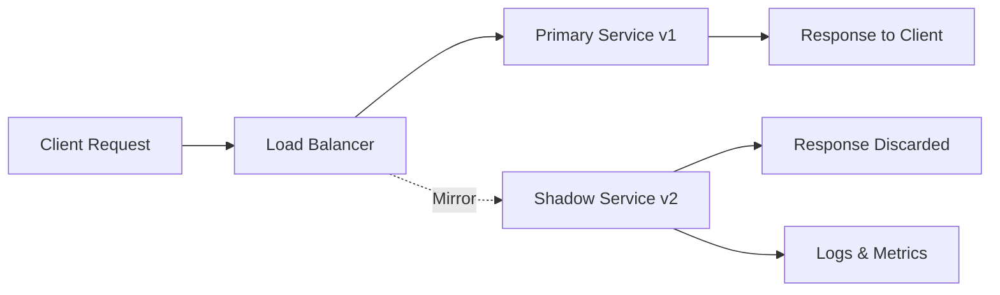
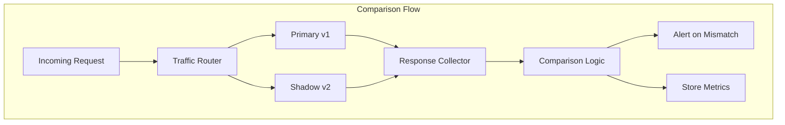
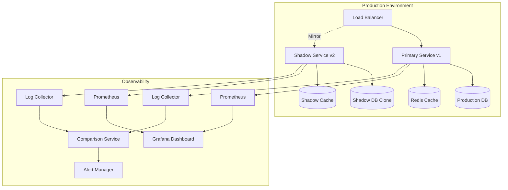
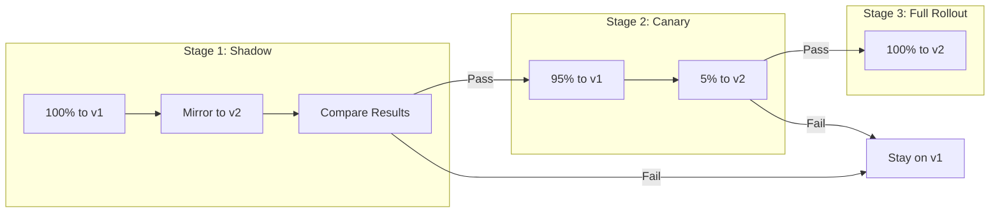

# How to Create Shadow Deployment

Author: [nawazdhandala](https://github.com/nawazdhandala)

Tags: Deployment, Shadow, Testing, DevOps

Description: Learn how to safely test new service versions in production using traffic mirroring without affecting real users.

---

Shadow deployment lets you test a new version of your service against real production traffic without affecting users. Traffic gets duplicated: one copy goes to the live service, another goes to the shadow service. Users only see responses from the live version, but you can compare how the shadow version behaves.

## How Shadow Deployment Works



The key points:

1. Real traffic flows to the primary service normally
2. A copy of each request gets sent to the shadow service
3. Shadow responses are thrown away, never reaching users
4. You collect metrics, logs, and errors from the shadow for analysis

This approach is sometimes called traffic mirroring or dark launching.

## Why Use Shadow Deployments

Shadow deployments solve problems that staging environments cannot:

- **Real traffic patterns**: Staging never matches production load, request diversity, or edge cases
- **Zero user impact**: If the shadow crashes or returns errors, users never notice
- **Performance comparison**: Measure latency and resource usage under actual conditions
- **Data validation**: Compare shadow responses to production responses for correctness

## Setting Up Traffic Mirroring with Istio

Istio provides built-in support for traffic mirroring. Here is a complete setup.

### Deploy Both Versions

First, deploy your primary and shadow services:

```yaml
# primary-deployment.yaml
apiVersion: apps/v1
kind: Deployment
metadata:
  name: api-primary
  labels:
    app: api
    version: v1
spec:
  replicas: 3
  selector:
    matchLabels:
      app: api
      version: v1
  template:
    metadata:
      labels:
        app: api
        version: v1
    spec:
      containers:
        - name: api
          image: myregistry/api:1.0.0
          ports:
            - containerPort: 8080
          resources:
            requests:
              cpu: 100m
              memory: 128Mi
            limits:
              cpu: 500m
              memory: 512Mi
```

```yaml
# shadow-deployment.yaml
apiVersion: apps/v1
kind: Deployment
metadata:
  name: api-shadow
  labels:
    app: api
    version: v2
spec:
  replicas: 3
  selector:
    matchLabels:
      app: api
      version: v2
  template:
    metadata:
      labels:
        app: api
        version: v2
    spec:
      containers:
        - name: api
          image: myregistry/api:2.0.0
          ports:
            - containerPort: 8080
          resources:
            requests:
              cpu: 100m
              memory: 128Mi
            limits:
              cpu: 500m
              memory: 512Mi
```

### Create Services for Both Versions

```yaml
# services.yaml
apiVersion: v1
kind: Service
metadata:
  name: api
spec:
  selector:
    app: api
  ports:
    - port: 80
      targetPort: 8080
---
apiVersion: v1
kind: Service
metadata:
  name: api-primary
spec:
  selector:
    app: api
    version: v1
  ports:
    - port: 80
      targetPort: 8080
---
apiVersion: v1
kind: Service
metadata:
  name: api-shadow
spec:
  selector:
    app: api
    version: v2
  ports:
    - port: 80
      targetPort: 8080
```

### Configure Istio Traffic Mirroring

The VirtualService tells Istio to mirror traffic to the shadow:

```yaml
# virtual-service.yaml
apiVersion: networking.istio.io/v1beta1
kind: VirtualService
metadata:
  name: api-mirror
spec:
  hosts:
    - api
  http:
    - route:
        - destination:
            host: api-primary
            port:
              number: 80
      mirror:
        host: api-shadow
        port:
          number: 80
      mirrorPercentage:
        value: 100.0
```

The `mirrorPercentage` field controls what fraction of traffic gets mirrored. Start with 100% for comprehensive testing, or use a lower percentage to reduce shadow load.

### Destination Rules for Version Routing

```yaml
# destination-rule.yaml
apiVersion: networking.istio.io/v1beta1
kind: DestinationRule
metadata:
  name: api-destination
spec:
  host: api
  subsets:
    - name: primary
      labels:
        version: v1
    - name: shadow
      labels:
        version: v2
```

## Setting Up Traffic Mirroring with NGINX

If you use NGINX as your ingress or reverse proxy, you can mirror traffic using the `mirror` directive.

```nginx
# nginx.conf
upstream primary_backend {
    server api-primary:8080;
}

upstream shadow_backend {
    server api-shadow:8080;
}

server {
    listen 80;
    server_name api.example.com;

    location / {
        # Send traffic to primary backend
        proxy_pass http://primary_backend;
        proxy_set_header Host $host;
        proxy_set_header X-Real-IP $remote_addr;
        proxy_set_header X-Request-ID $request_id;

        # Mirror traffic to shadow backend
        mirror /mirror;
        mirror_request_body on;
    }

    # Internal location for mirrored requests
    location = /mirror {
        internal;
        proxy_pass http://shadow_backend$request_uri;
        proxy_set_header Host $host;
        proxy_set_header X-Real-IP $remote_addr;
        proxy_set_header X-Request-ID $request_id;
        proxy_set_header X-Shadow-Request "true";
    }
}
```

Key configuration points:

- `mirror /mirror` duplicates requests to the internal `/mirror` location
- `mirror_request_body on` includes POST/PUT bodies in mirrored requests
- The `internal` directive prevents external access to the mirror endpoint
- Adding `X-Shadow-Request` header helps the shadow service identify mirrored traffic

## Setting Up Traffic Mirroring with Envoy

For Envoy-based setups, configure request mirroring in your route configuration:

```yaml
# envoy-config.yaml
static_resources:
  listeners:
    - name: listener_0
      address:
        socket_address:
          address: 0.0.0.0
          port_value: 8080
      filter_chains:
        - filters:
            - name: envoy.filters.network.http_connection_manager
              typed_config:
                "@type": type.googleapis.com/envoy.extensions.filters.network.http_connection_manager.v3.HttpConnectionManager
                stat_prefix: ingress_http
                route_config:
                  name: local_route
                  virtual_hosts:
                    - name: api
                      domains: ["*"]
                      routes:
                        - match:
                            prefix: "/"
                          route:
                            cluster: primary_cluster
                            request_mirror_policies:
                              - cluster: shadow_cluster
                                runtime_fraction:
                                  default_value:
                                    numerator: 100
                                    denominator: HUNDRED
                http_filters:
                  - name: envoy.filters.http.router
                    typed_config:
                      "@type": type.googleapis.com/envoy.extensions.filters.http.router.v3.Router

  clusters:
    - name: primary_cluster
      connect_timeout: 5s
      type: STRICT_DNS
      lb_policy: ROUND_ROBIN
      load_assignment:
        cluster_name: primary_cluster
        endpoints:
          - lb_endpoints:
              - endpoint:
                  address:
                    socket_address:
                      address: api-primary
                      port_value: 8080

    - name: shadow_cluster
      connect_timeout: 5s
      type: STRICT_DNS
      lb_policy: ROUND_ROBIN
      load_assignment:
        cluster_name: shadow_cluster
        endpoints:
          - lb_endpoints:
              - endpoint:
                  address:
                    socket_address:
                      address: api-shadow
                      port_value: 8080
```

## Comparing Responses

Mirroring traffic is only useful if you compare the results. Here is a simple approach using a sidecar that logs both responses.



### Response Comparison Service

Build a service that receives both responses and compares them:

```python
# compare_responses.py
import json
import hashlib
from datetime import datetime
from dataclasses import dataclass
from typing import Optional

@dataclass
class ResponsePair:
    request_id: str
    primary_status: int
    primary_body: str
    primary_latency_ms: float
    shadow_status: int
    shadow_body: str
    shadow_latency_ms: float
    timestamp: datetime

def normalize_response(body: str) -> str:
    """Remove timestamps and IDs that change between requests."""
    try:
        data = json.loads(body)
        # Remove fields that vary between calls
        fields_to_ignore = ['timestamp', 'request_id', 'generated_at']
        for field in fields_to_ignore:
            data.pop(field, None)
        return json.dumps(data, sort_keys=True)
    except json.JSONDecodeError:
        return body

def compare_responses(pair: ResponsePair) -> dict:
    """Compare primary and shadow responses."""
    results = {
        'request_id': pair.request_id,
        'timestamp': pair.timestamp.isoformat(),
        'status_match': pair.primary_status == pair.shadow_status,
        'body_match': False,
        'latency_diff_ms': pair.shadow_latency_ms - pair.primary_latency_ms,
        'latency_ratio': pair.shadow_latency_ms / pair.primary_latency_ms if pair.primary_latency_ms > 0 else 0
    }

    # Compare normalized response bodies
    primary_normalized = normalize_response(pair.primary_body)
    shadow_normalized = normalize_response(pair.shadow_body)
    results['body_match'] = primary_normalized == shadow_normalized

    if not results['body_match']:
        results['primary_hash'] = hashlib.md5(primary_normalized.encode()).hexdigest()[:8]
        results['shadow_hash'] = hashlib.md5(shadow_normalized.encode()).hexdigest()[:8]

    return results

def should_alert(comparison: dict) -> bool:
    """Decide if this mismatch needs attention."""
    if not comparison['status_match']:
        return True
    if not comparison['body_match']:
        return True
    if comparison['latency_ratio'] > 2.0:  # Shadow is 2x slower
        return True
    return False
```

### Collecting Metrics

Track key metrics to evaluate the shadow service:

```yaml
# prometheus-rules.yaml
groups:
  - name: shadow_deployment
    rules:
      - record: shadow:response_match_ratio
        expr: |
          sum(rate(shadow_comparison_total{match="true"}[5m]))
          /
          sum(rate(shadow_comparison_total[5m]))

      - record: shadow:latency_ratio
        expr: |
          histogram_quantile(0.95, sum(rate(shadow_latency_seconds_bucket[5m])) by (le))
          /
          histogram_quantile(0.95, sum(rate(primary_latency_seconds_bucket[5m])) by (le))

      - alert: ShadowResponseMismatch
        expr: shadow:response_match_ratio < 0.99
        for: 5m
        labels:
          severity: warning
        annotations:
          summary: Shadow responses diverging from primary
          description: "{{ $value | humanizePercentage }} of shadow responses match primary"

      - alert: ShadowLatencyRegression
        expr: shadow:latency_ratio > 1.5
        for: 10m
        labels:
          severity: warning
        annotations:
          summary: Shadow service is slower than primary
          description: "Shadow p95 latency is {{ $value }}x higher than primary"
```

## Shadow Deployment Architecture

A complete shadow deployment setup looks like this:



## Handling State and Side Effects

Shadow deployments work best with read-only operations. For write operations, you need extra care.

### Option 1: Read-Only Shadow Mode

Configure the shadow to skip writes:

```python
# shadow_mode.py
import os

SHADOW_MODE = os.getenv('SHADOW_MODE', 'false').lower() == 'true'

class OrderService:
    def create_order(self, order_data: dict) -> dict:
        # Validate the request
        validated = self.validate_order(order_data)

        if SHADOW_MODE:
            # In shadow mode, simulate the write but do not persist
            return {
                'order_id': 'shadow-' + str(uuid.uuid4()),
                'status': 'simulated',
                'data': validated
            }

        # Normal mode: actually create the order
        return self.repository.create(validated)
```

### Option 2: Separate Database

Use a database clone for the shadow service:

```yaml
# shadow-deployment-with-db.yaml
apiVersion: apps/v1
kind: Deployment
metadata:
  name: api-shadow
spec:
  template:
    spec:
      containers:
        - name: api
          image: myregistry/api:2.0.0
          env:
            - name: DATABASE_URL
              value: "postgresql://shadow-db:5432/api_shadow"
            - name: SHADOW_MODE
              value: "true"
```

### Option 3: Flag Mirrored Requests

Mark shadow traffic so downstream services can handle it appropriately:

```python
# middleware.py
from starlette.middleware.base import BaseHTTPMiddleware
from starlette.requests import Request

class ShadowModeMiddleware(BaseHTTPMiddleware):
    async def dispatch(self, request: Request, call_next):
        # Check if this is mirrored traffic
        is_shadow = request.headers.get('X-Shadow-Request', 'false') == 'true'

        # Add to request state for handlers to check
        request.state.is_shadow = is_shadow

        response = await call_next(request)
        return response
```

## Gradual Rollout with Shadow Testing

Use shadow deployment as the first stage in a safe rollout:



### Automated Promotion Script

```bash
#!/bin/bash
# promote-shadow.sh

NAMESPACE="production"
SERVICE="api"
SHADOW_VERSION="v2"

echo "Starting shadow deployment analysis..."

# Check response match rate
MATCH_RATE=$(kubectl exec -n monitoring prometheus-0 -- \
  promtool query instant 'shadow:response_match_ratio' | jq -r '.[] | .value[1]')

# Check latency ratio
LATENCY_RATIO=$(kubectl exec -n monitoring prometheus-0 -- \
  promtool query instant 'shadow:latency_ratio' | jq -r '.[] | .value[1]')

echo "Response match rate: $MATCH_RATE"
echo "Latency ratio: $LATENCY_RATIO"

# Promotion criteria
MIN_MATCH_RATE="0.99"
MAX_LATENCY_RATIO="1.2"

if (( $(echo "$MATCH_RATE >= $MIN_MATCH_RATE" | bc -l) )) && \
   (( $(echo "$LATENCY_RATIO <= $MAX_LATENCY_RATIO" | bc -l) )); then
  echo "Shadow testing passed. Promoting to canary..."

  # Update VirtualService to send 5% traffic to new version
  kubectl patch virtualservice $SERVICE -n $NAMESPACE --type merge -p '
  spec:
    http:
    - route:
      - destination:
          host: api-primary
        weight: 95
      - destination:
          host: api-shadow
        weight: 5
  '

  echo "Canary deployment started."
else
  echo "Shadow testing failed. Not promoting."
  exit 1
fi
```

## Best Practices

### 1. Start with Read Operations

Begin by mirroring only GET requests before moving to full traffic:

```yaml
# mirror-reads-only.yaml
apiVersion: networking.istio.io/v1beta1
kind: VirtualService
metadata:
  name: api-mirror-reads
spec:
  hosts:
    - api
  http:
    # Mirror only GET requests
    - match:
        - method:
            exact: GET
      route:
        - destination:
            host: api-primary
      mirror:
        host: api-shadow
      mirrorPercentage:
        value: 100.0
    # Send other methods to primary only
    - route:
        - destination:
            host: api-primary
```

### 2. Add Request Correlation

Include a correlation ID to match primary and shadow responses:

```python
# correlation.py
import uuid
from fastapi import Request, Response
from starlette.middleware.base import BaseHTTPMiddleware

class CorrelationMiddleware(BaseHTTPMiddleware):
    async def dispatch(self, request: Request, call_next):
        # Use existing ID or generate new one
        correlation_id = request.headers.get('X-Correlation-ID', str(uuid.uuid4()))

        # Store for later use
        request.state.correlation_id = correlation_id

        response = await call_next(request)
        response.headers['X-Correlation-ID'] = correlation_id

        return response
```

### 3. Monitor Resource Usage

Shadow services consume additional resources. Monitor and set limits:

```yaml
# resource-quota.yaml
apiVersion: v1
kind: ResourceQuota
metadata:
  name: shadow-quota
  namespace: production
spec:
  hard:
    requests.cpu: "2"
    requests.memory: 4Gi
    limits.cpu: "4"
    limits.memory: 8Gi
  scopeSelector:
    matchExpressions:
      - operator: In
        scopeName: PriorityClass
        values: ["shadow"]
```

### 4. Set Timeouts for Shadow Requests

Prevent slow shadow responses from consuming resources:

```yaml
# shadow-timeout.yaml
apiVersion: networking.istio.io/v1beta1
kind: VirtualService
metadata:
  name: api-mirror
spec:
  hosts:
    - api
  http:
    - route:
        - destination:
            host: api-primary
      mirror:
        host: api-shadow
      mirrorPercentage:
        value: 100.0
      timeout: 5s
```

### 5. Use Sampling for High-Traffic Services

For services handling thousands of requests per second, mirror a sample:

```yaml
# sampled-mirror.yaml
apiVersion: networking.istio.io/v1beta1
kind: VirtualService
metadata:
  name: api-mirror-sampled
spec:
  hosts:
    - api
  http:
    - route:
        - destination:
            host: api-primary
      mirror:
        host: api-shadow
      mirrorPercentage:
        value: 10.0  # Mirror 10% of traffic
```

## Troubleshooting

### Shadow Not Receiving Traffic

Check that the mirror configuration is active:

```bash
# Verify VirtualService
istioctl analyze -n production

# Check Envoy config
istioctl proxy-config routes deploy/api-primary -n production -o json | jq '.[] | select(.name=="api")'

# Look for mirror stats
kubectl exec deploy/api-primary -c istio-proxy -n production -- \
  curl -s localhost:15000/stats | grep mirror
```

### Response Body Not Mirrored

Ensure request body mirroring is enabled. For NGINX:

```nginx
mirror_request_body on;
```

For Istio, bodies are mirrored by default for POST/PUT requests.

### Shadow Service Overwhelmed

If the shadow cannot handle full production load:

1. Reduce `mirrorPercentage` to a level the shadow can handle
2. Increase shadow replica count
3. Sample traffic instead of mirroring everything

---

Shadow deployment gives you production-grade testing without production-grade risk. Start by mirroring read traffic to your new version, compare responses and latency, then graduate to canary deployment once the shadow proves itself. The extra infrastructure cost is small compared to catching bugs before they reach users.
