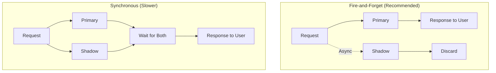
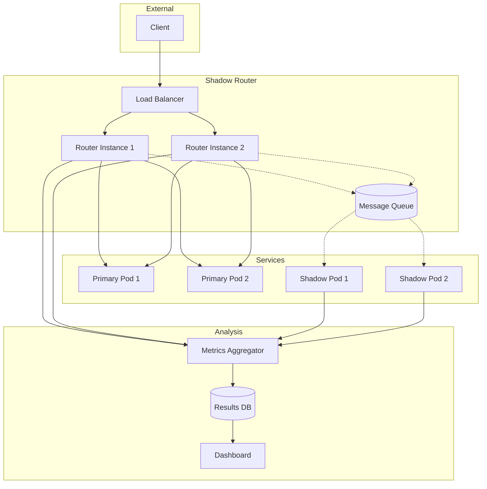
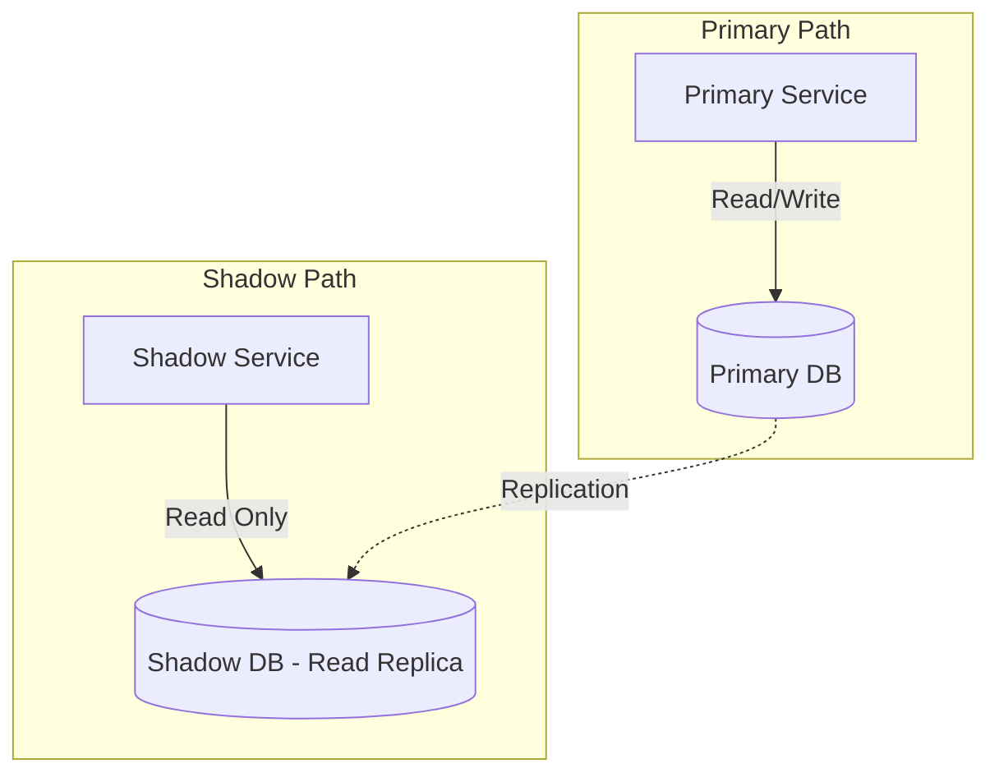
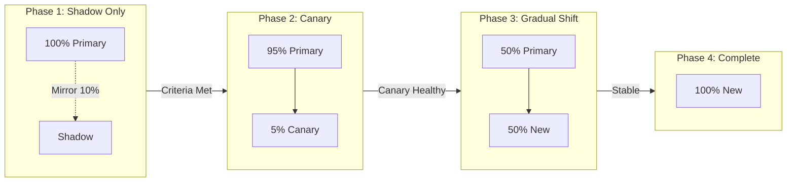
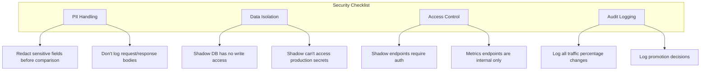

# How to Build Shadow Routing

Author: [nawazdhandala](https://github.com/nawazdhandala)

Tags: Traffic Management, Shadow, Testing, Deployment

Description: Learn how to implement shadow routing for traffic mirroring and testing.

---

Shadow routing is one of the most powerful techniques for testing new services in production without risking user experience. It lets you mirror real production traffic to a shadow service, observe how it behaves, and gain confidence before promoting it to handle actual users. This guide walks you through building a complete shadow routing system from scratch.

## What is Shadow Routing?

Shadow routing (also called traffic mirroring or dark launching) duplicates incoming production traffic and sends copies to a shadow service. The shadow service processes requests just like production, but its responses are discarded - users only see responses from the primary service.

```mermaid
flowchart LR
    subgraph Production
        LB[Load Balancer]
        PS[Primary Service]
        SS[Shadow Service]
    end

    Client([Client]) --> LB
    LB --> PS
    LB -.->|Mirror| SS
    PS --> Client
    SS -.->|Discarded| X[/dev/null]
```

### Why Shadow Routing Matters

- **Zero-risk testing**: Shadow traffic never affects users
- **Real-world validation**: Test with actual production patterns, not synthetic loads
- **Performance benchmarking**: Compare latency, error rates, and resource usage
- **Database migration validation**: Verify new schemas produce identical results
- **Algorithm A/B testing**: Compare ML model outputs before switching

## Shadow Traffic Concepts

Before diving into implementation, let's understand the key concepts.

### Fire-and-Forget vs. Synchronous Mirroring

There are two approaches to shadow routing:



**Fire-and-forget** is almost always preferred because:
- Primary service latency is unaffected
- Shadow service failures don't impact users
- Simpler error handling

### Shadow Traffic Characteristics

Shadow traffic should be:
- **Isolated**: Shadow cannot affect primary service state
- **Observable**: Metrics and logs are captured separately
- **Controllable**: Percentage of traffic can be adjusted
- **Identifiable**: Requests are marked as shadow traffic

## Implementing Async Shadow Requests

Let's build a shadow routing proxy in Node.js. This proxy sits in front of your services and handles traffic mirroring.

### Basic Shadow Router

```typescript
// shadow-router.ts
import express, { Request, Response, NextFunction } from 'express';
import axios, { AxiosResponse } from 'axios';

interface ShadowConfig {
  primaryUrl: string;
  shadowUrl: string;
  shadowPercentage: number; // 0-100
  shadowTimeout: number; // ms
  enabled: boolean;
}

interface ShadowResult {
  requestId: string;
  timestamp: Date;
  primaryLatency: number;
  shadowLatency?: number;
  primaryStatus: number;
  shadowStatus?: number;
  shadowError?: string;
  responsesMatch?: boolean;
}

const config: ShadowConfig = {
  primaryUrl: process.env.PRIMARY_URL || 'http://primary-service:8080',
  shadowUrl: process.env.SHADOW_URL || 'http://shadow-service:8080',
  shadowPercentage: parseInt(process.env.SHADOW_PERCENTAGE || '10'),
  shadowTimeout: parseInt(process.env.SHADOW_TIMEOUT || '5000'),
  enabled: process.env.SHADOW_ENABLED === 'true'
};

const app = express();
app.use(express.json({ limit: '10mb' }));
app.use(express.raw({ type: '*/*', limit: '10mb' }));

// Store shadow results for analysis
const shadowResults: ShadowResult[] = [];

function shouldShadow(): boolean {
  return config.enabled && Math.random() * 100 < config.shadowPercentage;
}

function generateRequestId(): string {
  return `req-${Date.now()}-${Math.random().toString(36).substr(2, 9)}`;
}

async function forwardToPrimary(
  req: Request,
  requestId: string
): Promise<{ response: AxiosResponse; latency: number }> {
  const start = Date.now();

  const response = await axios({
    method: req.method as any,
    url: `${config.primaryUrl}${req.path}`,
    headers: {
      ...req.headers,
      'x-request-id': requestId,
      'x-shadow-mode': 'primary',
      host: undefined // Remove original host header
    },
    data: req.body,
    params: req.query,
    validateStatus: () => true // Accept all status codes
  });

  return {
    response,
    latency: Date.now() - start
  };
}

async function forwardToShadow(
  req: Request,
  requestId: string
): Promise<{ response?: AxiosResponse; latency?: number; error?: string }> {
  const start = Date.now();

  try {
    const response = await axios({
      method: req.method as any,
      url: `${config.shadowUrl}${req.path}`,
      headers: {
        ...req.headers,
        'x-request-id': requestId,
        'x-shadow-mode': 'shadow',
        host: undefined
      },
      data: req.body,
      params: req.query,
      timeout: config.shadowTimeout,
      validateStatus: () => true
    });

    return {
      response,
      latency: Date.now() - start
    };
  } catch (error: any) {
    return {
      latency: Date.now() - start,
      error: error.message
    };
  }
}

// Main routing handler
app.all('*', async (req: Request, res: Response) => {
  const requestId = generateRequestId();
  const sendShadow = shouldShadow();

  // Always forward to primary and wait for response
  const primaryResult = await forwardToPrimary(req, requestId);

  // Send shadow request asynchronously (fire-and-forget)
  if (sendShadow) {
    // Don't await - let it run in background
    forwardToShadow(req, requestId).then(shadowResult => {
      const result: ShadowResult = {
        requestId,
        timestamp: new Date(),
        primaryLatency: primaryResult.latency,
        shadowLatency: shadowResult.latency,
        primaryStatus: primaryResult.response.status,
        shadowStatus: shadowResult.response?.status,
        shadowError: shadowResult.error,
        responsesMatch: compareResponses(
          primaryResult.response.data,
          shadowResult.response?.data
        )
      };

      recordShadowResult(result);
    });
  }

  // Return primary response immediately
  res.status(primaryResult.response.status);

  // Forward response headers
  Object.entries(primaryResult.response.headers).forEach(([key, value]) => {
    if (key.toLowerCase() !== 'transfer-encoding') {
      res.setHeader(key, value as string);
    }
  });

  res.setHeader('x-request-id', requestId);
  res.setHeader('x-shadow-enabled', sendShadow.toString());

  res.send(primaryResult.response.data);
});

function compareResponses(primary: any, shadow: any): boolean {
  if (!shadow) return false;

  // Deep comparison - customize based on your needs
  try {
    return JSON.stringify(primary) === JSON.stringify(shadow);
  } catch {
    return false;
  }
}

function recordShadowResult(result: ShadowResult): void {
  shadowResults.push(result);

  // Keep only last 10000 results in memory
  if (shadowResults.length > 10000) {
    shadowResults.shift();
  }

  // Log mismatches for investigation
  if (result.responsesMatch === false) {
    console.warn('Shadow response mismatch:', {
      requestId: result.requestId,
      primaryStatus: result.primaryStatus,
      shadowStatus: result.shadowStatus
    });
  }
}

// Metrics endpoint
app.get('/shadow/metrics', (req: Request, res: Response) => {
  const recentResults = shadowResults.slice(-1000);

  const metrics = {
    totalShadowRequests: recentResults.length,
    matchRate: recentResults.filter(r => r.responsesMatch).length / recentResults.length,
    avgPrimaryLatency: average(recentResults.map(r => r.primaryLatency)),
    avgShadowLatency: average(recentResults.filter(r => r.shadowLatency).map(r => r.shadowLatency!)),
    shadowErrorRate: recentResults.filter(r => r.shadowError).length / recentResults.length,
    statusCodeMismatches: recentResults.filter(r => r.primaryStatus !== r.shadowStatus).length
  };

  res.json(metrics);
});

function average(numbers: number[]): number {
  if (numbers.length === 0) return 0;
  return numbers.reduce((a, b) => a + b, 0) / numbers.length;
}

const PORT = process.env.PORT || 3000;
app.listen(PORT, () => {
  console.log(`Shadow router listening on port ${PORT}`);
  console.log(`Primary: ${config.primaryUrl}`);
  console.log(`Shadow: ${config.shadowUrl}`);
  console.log(`Shadow percentage: ${config.shadowPercentage}%`);
});
```

### Architecture Overview



## Shadow Response Comparison

Comparing shadow responses to primary responses is crucial for validating your new service. Here's a robust comparison system.

### Flexible Response Comparator

```typescript
// comparator.ts
interface ComparisonConfig {
  ignoreFields: string[];
  ignorePaths: RegExp[];
  numericTolerance: number;
  timestampTolerance: number; // ms
}

interface ComparisonResult {
  matches: boolean;
  differences: Difference[];
  score: number; // 0-1 similarity score
}

interface Difference {
  path: string;
  primaryValue: any;
  shadowValue: any;
  type: 'missing' | 'extra' | 'type_mismatch' | 'value_mismatch';
}

class ResponseComparator {
  private config: ComparisonConfig;

  constructor(config: Partial<ComparisonConfig> = {}) {
    this.config = {
      ignoreFields: config.ignoreFields || ['timestamp', 'requestId', 'traceId'],
      ignorePaths: config.ignorePaths || [/\.id$/, /\.createdAt$/, /\.updatedAt$/],
      numericTolerance: config.numericTolerance || 0.001,
      timestampTolerance: config.timestampTolerance || 1000
    };
  }

  compare(primary: any, shadow: any): ComparisonResult {
    const differences: Difference[] = [];
    this.deepCompare(primary, shadow, '', differences);

    const score = this.calculateScore(primary, shadow, differences);

    return {
      matches: differences.length === 0,
      differences,
      score
    };
  }

  private deepCompare(
    primary: any,
    shadow: any,
    path: string,
    differences: Difference[]
  ): void {
    // Check if path should be ignored
    if (this.shouldIgnore(path)) {
      return;
    }

    // Handle null/undefined
    if (primary === null || primary === undefined) {
      if (shadow !== null && shadow !== undefined) {
        differences.push({
          path,
          primaryValue: primary,
          shadowValue: shadow,
          type: 'extra'
        });
      }
      return;
    }

    if (shadow === null || shadow === undefined) {
      differences.push({
        path,
        primaryValue: primary,
        shadowValue: shadow,
        type: 'missing'
      });
      return;
    }

    // Type check
    const primaryType = typeof primary;
    const shadowType = typeof shadow;

    if (primaryType !== shadowType) {
      differences.push({
        path,
        primaryValue: primary,
        shadowValue: shadow,
        type: 'type_mismatch'
      });
      return;
    }

    // Handle arrays
    if (Array.isArray(primary)) {
      if (!Array.isArray(shadow)) {
        differences.push({
          path,
          primaryValue: 'array',
          shadowValue: shadowType,
          type: 'type_mismatch'
        });
        return;
      }

      // Compare array lengths
      if (primary.length !== shadow.length) {
        differences.push({
          path: `${path}.length`,
          primaryValue: primary.length,
          shadowValue: shadow.length,
          type: 'value_mismatch'
        });
      }

      // Compare each element
      const maxLength = Math.max(primary.length, shadow.length);
      for (let i = 0; i < maxLength; i++) {
        this.deepCompare(
          primary[i],
          shadow[i],
          `${path}[${i}]`,
          differences
        );
      }
      return;
    }

    // Handle objects
    if (primaryType === 'object') {
      const allKeys = new Set([
        ...Object.keys(primary),
        ...Object.keys(shadow)
      ]);

      for (const key of allKeys) {
        const newPath = path ? `${path}.${key}` : key;
        this.deepCompare(primary[key], shadow[key], newPath, differences);
      }
      return;
    }

    // Handle numbers with tolerance
    if (primaryType === 'number') {
      if (Math.abs(primary - shadow) > this.config.numericTolerance) {
        differences.push({
          path,
          primaryValue: primary,
          shadowValue: shadow,
          type: 'value_mismatch'
        });
      }
      return;
    }

    // Handle timestamps
    if (this.isTimestamp(primary) && this.isTimestamp(shadow)) {
      const primaryTime = new Date(primary).getTime();
      const shadowTime = new Date(shadow).getTime();

      if (Math.abs(primaryTime - shadowTime) > this.config.timestampTolerance) {
        differences.push({
          path,
          primaryValue: primary,
          shadowValue: shadow,
          type: 'value_mismatch'
        });
      }
      return;
    }

    // Direct comparison for strings and booleans
    if (primary !== shadow) {
      differences.push({
        path,
        primaryValue: primary,
        shadowValue: shadow,
        type: 'value_mismatch'
      });
    }
  }

  private shouldIgnore(path: string): boolean {
    // Check exact field names
    const fieldName = path.split('.').pop() || '';
    if (this.config.ignoreFields.includes(fieldName)) {
      return true;
    }

    // Check regex patterns
    return this.config.ignorePaths.some(pattern => pattern.test(path));
  }

  private isTimestamp(value: any): boolean {
    if (typeof value !== 'string') return false;
    const date = new Date(value);
    return !isNaN(date.getTime());
  }

  private calculateScore(
    primary: any,
    shadow: any,
    differences: Difference[]
  ): number {
    const totalFields = this.countFields(primary);
    if (totalFields === 0) return 1;

    const matchingFields = totalFields - differences.length;
    return Math.max(0, matchingFields / totalFields);
  }

  private countFields(obj: any, count = 0): number {
    if (obj === null || obj === undefined) return count;
    if (typeof obj !== 'object') return count + 1;

    if (Array.isArray(obj)) {
      return obj.reduce((c, item) => this.countFields(item, c), count);
    }

    return Object.values(obj).reduce(
      (c: number, value) => this.countFields(value, c),
      count
    );
  }
}

// Usage example
const comparator = new ResponseComparator({
  ignoreFields: ['timestamp', 'requestId', 'processedAt'],
  ignorePaths: [/\.metadata\./, /\.debug\./],
  numericTolerance: 0.01
});

const result = comparator.compare(primaryResponse, shadowResponse);
console.log(`Match: ${result.matches}, Score: ${result.score}`);
if (!result.matches) {
  console.log('Differences:', result.differences);
}
```

## Impact Isolation

Ensuring shadow traffic doesn't affect production is critical. Here are the key isolation patterns.

### Database Isolation



### Shadow Service Configuration

```typescript
// shadow-service-config.ts
interface ShadowServiceConfig {
  // Database should be read-only or isolated
  database: {
    connectionString: string;
    readOnly: boolean;
  };

  // External API calls should be mocked or sandboxed
  externalApis: {
    mode: 'mock' | 'sandbox' | 'disabled';
    mockResponses: Record<string, any>;
  };

  // Side effects should be disabled
  sideEffects: {
    sendEmails: boolean;
    sendNotifications: boolean;
    updateExternalState: boolean;
    processPayments: boolean;
  };

  // Identify shadow requests
  headers: {
    shadowIndicator: string;
  };
}

const shadowConfig: ShadowServiceConfig = {
  database: {
    connectionString: process.env.SHADOW_DB_URL!,
    readOnly: true
  },
  externalApis: {
    mode: 'mock',
    mockResponses: {
      'payment-gateway': { status: 'success', transactionId: 'mock-123' },
      'email-service': { status: 'queued', messageId: 'mock-456' }
    }
  },
  sideEffects: {
    sendEmails: false,
    sendNotifications: false,
    updateExternalState: false,
    processPayments: false
  },
  headers: {
    shadowIndicator: 'x-shadow-mode'
  }
};

// Middleware to detect shadow mode
function shadowModeMiddleware(req: Request, res: Response, next: NextFunction) {
  const isShadow = req.headers[shadowConfig.headers.shadowIndicator] === 'shadow';

  // Attach shadow context to request
  (req as any).shadowContext = {
    isShadow,
    config: isShadow ? shadowConfig : null
  };

  next();
}

// Guard for side effects
function guardSideEffect(
  req: Request,
  effectType: keyof ShadowServiceConfig['sideEffects']
): boolean {
  const context = (req as any).shadowContext;

  if (context?.isShadow && !shadowConfig.sideEffects[effectType]) {
    console.log(`Blocked side effect '${effectType}' in shadow mode`);
    return false;
  }

  return true;
}

// Example usage in service
async function sendWelcomeEmail(req: Request, user: User) {
  if (!guardSideEffect(req, 'sendEmails')) {
    return { status: 'skipped', reason: 'shadow_mode' };
  }

  // Actually send email
  return await emailService.send({
    to: user.email,
    template: 'welcome'
  });
}
```

### Kubernetes Deployment Isolation

```yaml
# shadow-deployment.yaml
apiVersion: apps/v1
kind: Deployment
metadata:
  name: api-shadow
  labels:
    app: api
    variant: shadow
spec:
  replicas: 2
  selector:
    matchLabels:
      app: api
      variant: shadow
  template:
    metadata:
      labels:
        app: api
        variant: shadow
    spec:
      containers:
        - name: api
          image: myapp/api:v2.0.0-rc1
          env:
            - name: SHADOW_MODE
              value: "true"
            - name: DB_READ_ONLY
              value: "true"
            - name: EXTERNAL_APIS_MODE
              value: "mock"
            - name: SIDE_EFFECTS_ENABLED
              value: "false"
          resources:
            # Shadow can have lower resources
            requests:
              cpu: 100m
              memory: 256Mi
            limits:
              cpu: 500m
              memory: 512Mi
          # Shadow failures shouldn't trigger alerts
          livenessProbe:
            httpGet:
              path: /health
              port: 8080
            failureThreshold: 10
---
# Network policy to isolate shadow
apiVersion: networking.k8s.io/v1
kind: NetworkPolicy
metadata:
  name: shadow-isolation
spec:
  podSelector:
    matchLabels:
      variant: shadow
  policyTypes:
    - Egress
  egress:
    # Allow DB read replica only
    - to:
        - podSelector:
            matchLabels:
              app: postgres
              role: replica
      ports:
        - port: 5432
    # Block external APIs
    - to:
        - ipBlock:
            cidr: 10.0.0.0/8  # Internal only
```

## Shadow Traffic Analysis

Collecting and analyzing shadow traffic data helps you make promotion decisions.

### Metrics Collection

```typescript
// shadow-metrics.ts
import { Counter, Histogram, Gauge, Registry } from 'prom-client';

const register = new Registry();

// Request counters
const shadowRequestsTotal = new Counter({
  name: 'shadow_requests_total',
  help: 'Total shadow requests processed',
  labelNames: ['method', 'path', 'status'],
  registers: [register]
});

const shadowMatchesTotal = new Counter({
  name: 'shadow_matches_total',
  help: 'Shadow requests that matched primary',
  labelNames: ['method', 'path'],
  registers: [register]
});

const shadowMismatchesTotal = new Counter({
  name: 'shadow_mismatches_total',
  help: 'Shadow requests that differed from primary',
  labelNames: ['method', 'path', 'mismatch_type'],
  registers: [register]
});

// Latency histograms
const primaryLatency = new Histogram({
  name: 'primary_request_duration_seconds',
  help: 'Primary service request duration',
  labelNames: ['method', 'path'],
  buckets: [0.01, 0.05, 0.1, 0.25, 0.5, 1, 2.5, 5, 10],
  registers: [register]
});

const shadowLatency = new Histogram({
  name: 'shadow_request_duration_seconds',
  help: 'Shadow service request duration',
  labelNames: ['method', 'path'],
  buckets: [0.01, 0.05, 0.1, 0.25, 0.5, 1, 2.5, 5, 10],
  registers: [register]
});

// Comparison scores
const comparisonScore = new Histogram({
  name: 'shadow_comparison_score',
  help: 'Response similarity score (0-1)',
  labelNames: ['method', 'path'],
  buckets: [0.5, 0.7, 0.8, 0.9, 0.95, 0.99, 1],
  registers: [register]
});

// Current shadow percentage
const shadowPercentage = new Gauge({
  name: 'shadow_traffic_percentage',
  help: 'Current percentage of traffic being shadowed',
  registers: [register]
});

// Record shadow result
function recordShadowMetrics(result: {
  method: string;
  path: string;
  primaryStatus: number;
  shadowStatus: number;
  primaryLatencyMs: number;
  shadowLatencyMs: number;
  comparisonResult: ComparisonResult;
}) {
  const labels = { method: result.method, path: normalizePath(result.path) };

  // Count request
  shadowRequestsTotal.inc({
    ...labels,
    status: result.shadowStatus.toString()
  });

  // Record latencies
  primaryLatency.observe(labels, result.primaryLatencyMs / 1000);
  shadowLatency.observe(labels, result.shadowLatencyMs / 1000);

  // Record match/mismatch
  if (result.comparisonResult.matches) {
    shadowMatchesTotal.inc(labels);
  } else {
    // Categorize mismatches
    const mismatchTypes = new Set(
      result.comparisonResult.differences.map(d => d.type)
    );

    mismatchTypes.forEach(type => {
      shadowMismatchesTotal.inc({ ...labels, mismatch_type: type });
    });
  }

  // Record comparison score
  comparisonScore.observe(labels, result.comparisonResult.score);
}

// Normalize path for consistent labeling
function normalizePath(path: string): string {
  // Replace IDs with placeholders
  return path
    .replace(/\/[0-9a-f]{8}-[0-9a-f]{4}-[0-9a-f]{4}-[0-9a-f]{4}-[0-9a-f]{12}/gi, '/:uuid')
    .replace(/\/\d+/g, '/:id');
}

// Expose metrics endpoint
app.get('/metrics', async (req, res) => {
  res.set('Content-Type', register.contentType);
  res.send(await register.metrics());
});
```

### Analysis Dashboard Queries (Prometheus)

```promql
# Shadow match rate (should be close to 1)
sum(rate(shadow_matches_total[5m]))
/
sum(rate(shadow_requests_total[5m]))

# Latency comparison (shadow should be similar or better)
histogram_quantile(0.95,
  sum(rate(shadow_request_duration_seconds_bucket[5m])) by (le)
)
/
histogram_quantile(0.95,
  sum(rate(primary_request_duration_seconds_bucket[5m])) by (le)
)

# Mismatch breakdown by type
sum(rate(shadow_mismatches_total[5m])) by (mismatch_type)

# Error rate comparison
sum(rate(shadow_requests_total{status=~"5.."}[5m]))
/
sum(rate(shadow_requests_total[5m]))
```

### Grafana Dashboard Configuration

```json
{
  "dashboard": {
    "title": "Shadow Traffic Analysis",
    "panels": [
      {
        "title": "Match Rate",
        "type": "gauge",
        "targets": [
          {
            "expr": "sum(rate(shadow_matches_total[5m])) / sum(rate(shadow_requests_total[5m]))",
            "legendFormat": "Match Rate"
          }
        ],
        "fieldConfig": {
          "defaults": {
            "min": 0,
            "max": 1,
            "thresholds": {
              "steps": [
                { "value": 0, "color": "red" },
                { "value": 0.9, "color": "yellow" },
                { "value": 0.99, "color": "green" }
              ]
            }
          }
        }
      },
      {
        "title": "Latency Comparison (P95)",
        "type": "timeseries",
        "targets": [
          {
            "expr": "histogram_quantile(0.95, sum(rate(primary_request_duration_seconds_bucket[5m])) by (le))",
            "legendFormat": "Primary P95"
          },
          {
            "expr": "histogram_quantile(0.95, sum(rate(shadow_request_duration_seconds_bucket[5m])) by (le))",
            "legendFormat": "Shadow P95"
          }
        ]
      },
      {
        "title": "Mismatch Types",
        "type": "piechart",
        "targets": [
          {
            "expr": "sum(rate(shadow_mismatches_total[1h])) by (mismatch_type)",
            "legendFormat": "{{mismatch_type}}"
          }
        ]
      }
    ]
  }
}
```

## Shadow-to-Production Promotion

Once shadow testing gives you confidence, it's time to promote. Here's a gradual promotion strategy.

### Promotion Criteria Checklist

```typescript
// promotion-checker.ts
interface PromotionCriteria {
  minShadowDuration: number; // hours
  minRequestCount: number;
  maxMismatchRate: number;
  maxLatencyIncrease: number; // percentage
  maxErrorRateIncrease: number;
  requiredMatchScore: number;
}

interface PromotionReport {
  ready: boolean;
  criteria: Record<string, { passed: boolean; actual: number; required: number }>;
  recommendations: string[];
}

async function checkPromotionReadiness(
  metrics: ShadowMetrics,
  criteria: PromotionCriteria
): Promise<PromotionReport> {
  const report: PromotionReport = {
    ready: true,
    criteria: {},
    recommendations: []
  };

  // Check duration
  const hoursShadowing = metrics.shadowDurationMs / (1000 * 60 * 60);
  report.criteria.duration = {
    passed: hoursShadowing >= criteria.minShadowDuration,
    actual: hoursShadowing,
    required: criteria.minShadowDuration
  };

  // Check request volume
  report.criteria.requestCount = {
    passed: metrics.totalRequests >= criteria.minRequestCount,
    actual: metrics.totalRequests,
    required: criteria.minRequestCount
  };

  // Check mismatch rate
  const mismatchRate = metrics.mismatches / metrics.totalRequests;
  report.criteria.mismatchRate = {
    passed: mismatchRate <= criteria.maxMismatchRate,
    actual: mismatchRate,
    required: criteria.maxMismatchRate
  };

  // Check latency
  const latencyIncrease =
    (metrics.shadowP95Latency - metrics.primaryP95Latency) / metrics.primaryP95Latency;
  report.criteria.latencyIncrease = {
    passed: latencyIncrease <= criteria.maxLatencyIncrease,
    actual: latencyIncrease,
    required: criteria.maxLatencyIncrease
  };

  // Check error rate
  const errorRateIncrease = metrics.shadowErrorRate - metrics.primaryErrorRate;
  report.criteria.errorRateIncrease = {
    passed: errorRateIncrease <= criteria.maxErrorRateIncrease,
    actual: errorRateIncrease,
    required: criteria.maxErrorRateIncrease
  };

  // Check match score
  report.criteria.matchScore = {
    passed: metrics.avgMatchScore >= criteria.requiredMatchScore,
    actual: metrics.avgMatchScore,
    required: criteria.requiredMatchScore
  };

  // Overall readiness
  report.ready = Object.values(report.criteria).every(c => c.passed);

  // Generate recommendations
  if (!report.criteria.duration.passed) {
    report.recommendations.push(
      `Continue shadowing for ${criteria.minShadowDuration - hoursShadowing} more hours`
    );
  }

  if (!report.criteria.mismatchRate.passed) {
    report.recommendations.push(
      'Investigate response mismatches before promoting'
    );
  }

  if (!report.criteria.latencyIncrease.passed) {
    report.recommendations.push(
      'Shadow service is slower - optimize before promoting'
    );
  }

  return report;
}
```

### Gradual Traffic Shift



### Automated Promotion Script

```typescript
// promotion-controller.ts
interface PromotionConfig {
  serviceName: string;
  shadowVersion: string;
  phases: PromotionPhase[];
  rollbackOnFailure: boolean;
}

interface PromotionPhase {
  name: string;
  trafficPercentage: number;
  duration: number; // minutes
  criteria: PromotionCriteria;
}

async function executePromotion(config: PromotionConfig): Promise<void> {
  console.log(`Starting promotion of ${config.serviceName} to ${config.shadowVersion}`);

  for (const phase of config.phases) {
    console.log(`\n=== Phase: ${phase.name} (${phase.trafficPercentage}% traffic) ===`);

    // Update traffic split
    await updateTrafficSplit(config.serviceName, config.shadowVersion, phase.trafficPercentage);

    // Wait for phase duration
    console.log(`Waiting ${phase.duration} minutes for metrics...`);
    await sleep(phase.duration * 60 * 1000);

    // Check criteria
    const metrics = await collectMetrics(config.serviceName, phase.duration);
    const report = await checkPromotionReadiness(metrics, phase.criteria);

    if (!report.ready) {
      console.error('Phase criteria not met:', report);

      if (config.rollbackOnFailure) {
        console.log('Rolling back...');
        await updateTrafficSplit(config.serviceName, config.shadowVersion, 0);
        throw new Error(`Promotion failed at phase ${phase.name}`);
      }
    }

    console.log(`Phase ${phase.name} completed successfully`);
  }

  console.log(`\nPromotion of ${config.serviceName} completed!`);
}

async function updateTrafficSplit(
  service: string,
  version: string,
  percentage: number
): Promise<void> {
  // Update Kubernetes VirtualService or similar
  const virtualService = {
    apiVersion: 'networking.istio.io/v1beta1',
    kind: 'VirtualService',
    metadata: { name: service },
    spec: {
      hosts: [service],
      http: [{
        route: [
          {
            destination: { host: service, subset: 'primary' },
            weight: 100 - percentage
          },
          {
            destination: { host: service, subset: 'canary' },
            weight: percentage
          }
        ]
      }]
    }
  };

  await kubectl.apply(virtualService);
}

// Example usage
const promotionConfig: PromotionConfig = {
  serviceName: 'api-service',
  shadowVersion: 'v2.0.0',
  rollbackOnFailure: true,
  phases: [
    {
      name: 'canary',
      trafficPercentage: 5,
      duration: 30,
      criteria: {
        minShadowDuration: 0.5,
        minRequestCount: 1000,
        maxMismatchRate: 0.01,
        maxLatencyIncrease: 0.1,
        maxErrorRateIncrease: 0.001,
        requiredMatchScore: 0.99
      }
    },
    {
      name: 'partial',
      trafficPercentage: 25,
      duration: 60,
      criteria: {
        minShadowDuration: 1,
        minRequestCount: 10000,
        maxMismatchRate: 0.01,
        maxLatencyIncrease: 0.1,
        maxErrorRateIncrease: 0.001,
        requiredMatchScore: 0.99
      }
    },
    {
      name: 'majority',
      trafficPercentage: 75,
      duration: 60,
      criteria: {
        minShadowDuration: 1,
        minRequestCount: 50000,
        maxMismatchRate: 0.005,
        maxLatencyIncrease: 0.05,
        maxErrorRateIncrease: 0.0005,
        requiredMatchScore: 0.995
      }
    },
    {
      name: 'complete',
      trafficPercentage: 100,
      duration: 30,
      criteria: {
        minShadowDuration: 0.5,
        minRequestCount: 10000,
        maxMismatchRate: 0.001,
        maxLatencyIncrease: 0.05,
        maxErrorRateIncrease: 0.0001,
        requiredMatchScore: 0.999
      }
    }
  ]
};

executePromotion(promotionConfig);
```

## Best Practices

### Do's

1. **Start with read-only endpoints** - Shadow write operations require extra isolation
2. **Use async mirroring** - Never block primary responses waiting for shadow
3. **Tag shadow requests clearly** - Headers help services behave appropriately
4. **Monitor shadow health separately** - Don't alert on shadow failures
5. **Gradually increase shadow percentage** - Start at 1%, scale to 100%
6. **Log mismatches with context** - Include request details for debugging
7. **Set shadow timeouts aggressively** - Shadow shouldn't consume resources indefinitely

### Don'ts

1. **Don't shadow to production databases** - Use read replicas or isolated instances
2. **Don't let shadow services make external API calls** - Mock or sandbox them
3. **Don't include shadow in availability calculations** - It's not serving users
4. **Don't promote based on gut feeling** - Use quantitative criteria
5. **Don't skip comparison validation** - Matching status codes isn't enough

### Security Considerations



## Complete Example: Kubernetes Deployment

Here's a complete Kubernetes setup for shadow routing.

```yaml
# shadow-routing-complete.yaml
---
# Primary Service Deployment
apiVersion: apps/v1
kind: Deployment
metadata:
  name: api-primary
spec:
  replicas: 3
  selector:
    matchLabels:
      app: api
      version: v1
  template:
    metadata:
      labels:
        app: api
        version: v1
    spec:
      containers:
        - name: api
          image: myapp/api:v1.0.0
          ports:
            - containerPort: 8080
---
# Shadow Service Deployment
apiVersion: apps/v1
kind: Deployment
metadata:
  name: api-shadow
spec:
  replicas: 2
  selector:
    matchLabels:
      app: api
      version: v2-shadow
  template:
    metadata:
      labels:
        app: api
        version: v2-shadow
    spec:
      containers:
        - name: api
          image: myapp/api:v2.0.0-rc1
          ports:
            - containerPort: 8080
          env:
            - name: SHADOW_MODE
              value: "true"
---
# Services
apiVersion: v1
kind: Service
metadata:
  name: api-primary
spec:
  selector:
    app: api
    version: v1
  ports:
    - port: 8080
---
apiVersion: v1
kind: Service
metadata:
  name: api-shadow
spec:
  selector:
    app: api
    version: v2-shadow
  ports:
    - port: 8080
---
# Istio VirtualService with Mirroring
apiVersion: networking.istio.io/v1beta1
kind: VirtualService
metadata:
  name: api-routing
spec:
  hosts:
    - api
  http:
    - route:
        - destination:
            host: api-primary
            port:
              number: 8080
      mirror:
        host: api-shadow
        port:
          number: 8080
      mirrorPercentage:
        value: 10.0
---
# Shadow Router Deployment (Alternative to Istio)
apiVersion: apps/v1
kind: Deployment
metadata:
  name: shadow-router
spec:
  replicas: 2
  selector:
    matchLabels:
      app: shadow-router
  template:
    metadata:
      labels:
        app: shadow-router
    spec:
      containers:
        - name: router
          image: myapp/shadow-router:latest
          ports:
            - containerPort: 3000
          env:
            - name: PRIMARY_URL
              value: "http://api-primary:8080"
            - name: SHADOW_URL
              value: "http://api-shadow:8080"
            - name: SHADOW_PERCENTAGE
              value: "10"
            - name: SHADOW_ENABLED
              value: "true"
---
# ConfigMap for dynamic configuration
apiVersion: v1
kind: ConfigMap
metadata:
  name: shadow-config
data:
  SHADOW_PERCENTAGE: "10"
  SHADOW_ENABLED: "true"
  COMPARISON_IGNORE_FIELDS: "timestamp,requestId,traceId"
```

---

Shadow routing transforms how you test and deploy new services. By mirroring real traffic to shadow instances, you validate behavior with production patterns while keeping users completely isolated from any issues. Start with a small percentage, watch your metrics closely, and promote with confidence.

The investment in building a proper shadow routing infrastructure pays dividends every time you deploy a risky change - and in production systems, that's every change.
