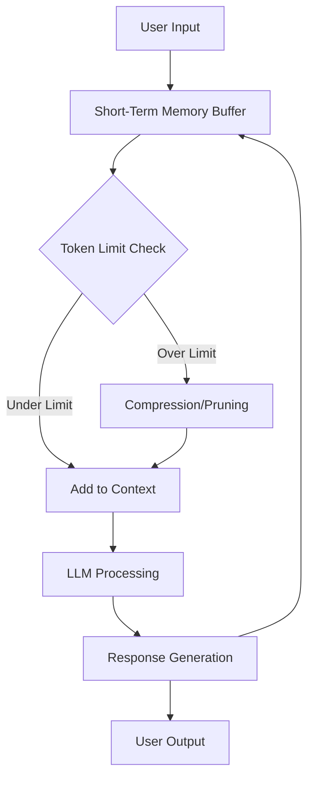
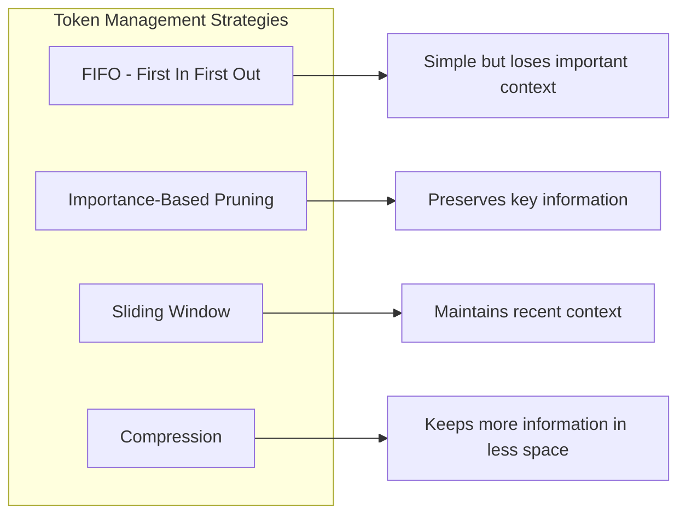
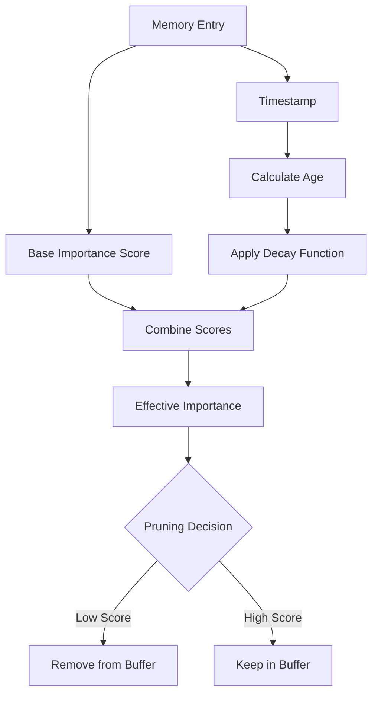
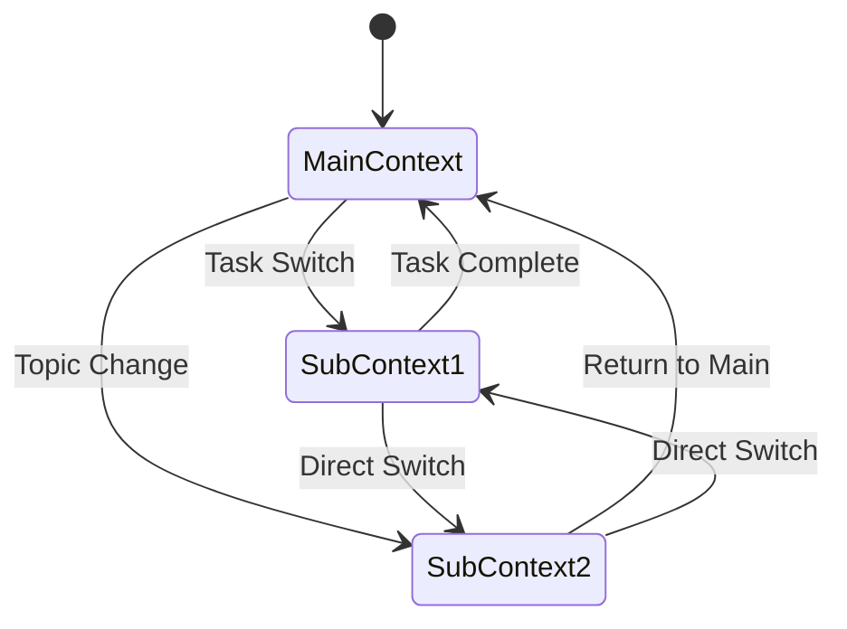
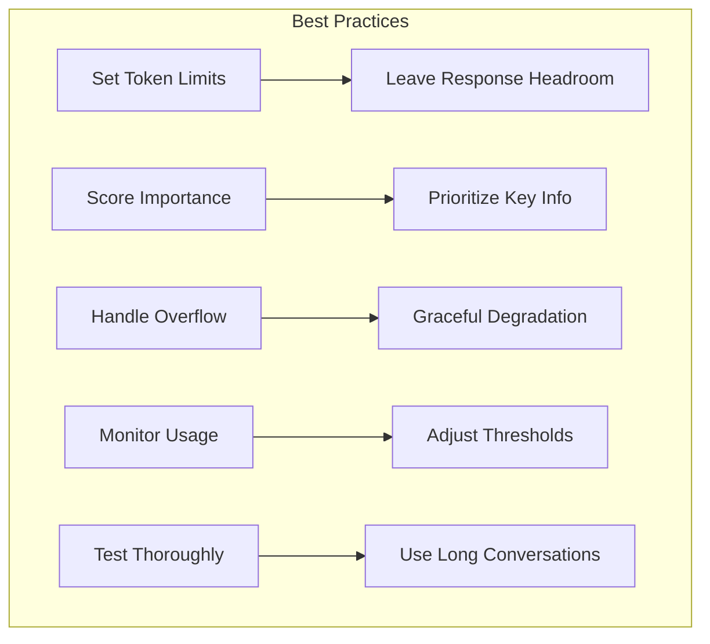

# How to Build Short-Term Memory

Author: [nawazdhandala](https://github.com/nawazdhandala)

Tags: AI Agents, Memory Systems, LLM, Context Management

Description: Learn to implement short-term memory for AI agents with working memory buffers, attention windows, and recency-weighted retrieval for conversation continuity.

---

Building effective AI agents requires more than just connecting to a large language model. One of the most critical capabilities is short-term memory - the ability to maintain context across interactions within a session. This post explores practical techniques for implementing short-term memory systems that keep your AI agents coherent, context-aware, and responsive.

## Understanding Short-Term Memory in AI Agents

Short-term memory (STM) in AI agents serves the same purpose as working memory in humans - it holds information temporarily for immediate use. Unlike long-term memory systems that persist information across sessions, STM focuses on maintaining coherence within a single conversation or task execution.



### Why Short-Term Memory Matters

Without proper STM implementation, AI agents suffer from:
- Loss of context mid-conversation
- Repetitive questions about already-discussed topics
- Inability to follow multi-step instructions
- Inconsistent personality and behavior within sessions

## Core Components of Short-Term Memory

### 1. The Memory Buffer

The memory buffer is the foundational data structure that holds recent interactions. Here is a basic implementation:

```python
from dataclasses import dataclass, field
from typing import List, Optional
from datetime import datetime
import tiktoken

@dataclass
class MemoryEntry:
    role: str  # 'user', 'assistant', or 'system'
    content: str
    timestamp: datetime = field(default_factory=datetime.now)
    token_count: int = 0
    importance: float = 1.0

    def __post_init__(self):
        if self.token_count == 0:
            encoder = tiktoken.encoding_for_model("gpt-4")
            self.token_count = len(encoder.encode(self.content))

class ShortTermMemoryBuffer:
    def __init__(self, max_tokens: int = 8000, max_entries: int = 100):
        self.max_tokens = max_tokens
        self.max_entries = max_entries
        self.entries: List[MemoryEntry] = []
        self._total_tokens = 0

    def add(self, role: str, content: str, importance: float = 1.0) -> None:
        entry = MemoryEntry(role=role, content=content, importance=importance)
        self.entries.append(entry)
        self._total_tokens += entry.token_count
        self._enforce_limits()

    def _enforce_limits(self) -> None:
        # Remove oldest entries if we exceed limits
        while (self._total_tokens > self.max_tokens or
               len(self.entries) > self.max_entries) and len(self.entries) > 1:
            removed = self.entries.pop(0)
            self._total_tokens -= removed.token_count

    def get_context(self) -> List[dict]:
        return [{"role": e.role, "content": e.content} for e in self.entries]

    @property
    def current_tokens(self) -> int:
        return self._total_tokens
```

This buffer automatically manages its size by removing older entries when limits are exceeded.

### 2. Token Limit Management

Token limits are the primary constraint in STM systems. Different strategies handle this constraint:



Here is an implementation that combines multiple strategies:

```python
from enum import Enum
from typing import Callable

class PruningStrategy(Enum):
    FIFO = "fifo"
    IMPORTANCE = "importance"
    HYBRID = "hybrid"

class AdvancedMemoryBuffer(ShortTermMemoryBuffer):
    def __init__(
        self,
        max_tokens: int = 8000,
        strategy: PruningStrategy = PruningStrategy.HYBRID,
        importance_threshold: float = 0.5
    ):
        super().__init__(max_tokens)
        self.strategy = strategy
        self.importance_threshold = importance_threshold

    def _enforce_limits(self) -> None:
        if self.strategy == PruningStrategy.FIFO:
            self._fifo_prune()
        elif self.strategy == PruningStrategy.IMPORTANCE:
            self._importance_prune()
        else:
            self._hybrid_prune()

    def _fifo_prune(self) -> None:
        while self._total_tokens > self.max_tokens and len(self.entries) > 1:
            # Always keep system messages
            for i, entry in enumerate(self.entries):
                if entry.role != "system":
                    removed = self.entries.pop(i)
                    self._total_tokens -= removed.token_count
                    break

    def _importance_prune(self) -> None:
        while self._total_tokens > self.max_tokens and len(self.entries) > 1:
            # Find entry with lowest importance
            min_importance = float('inf')
            min_index = -1

            for i, entry in enumerate(self.entries):
                if entry.role != "system" and entry.importance < min_importance:
                    min_importance = entry.importance
                    min_index = i

            if min_index >= 0:
                removed = self.entries.pop(min_index)
                self._total_tokens -= removed.token_count

    def _hybrid_prune(self) -> None:
        while self._total_tokens > self.max_tokens and len(self.entries) > 1:
            # First remove low-importance old messages
            candidates = [
                (i, e) for i, e in enumerate(self.entries)
                if e.role != "system" and e.importance < self.importance_threshold
            ]

            if candidates:
                # Remove oldest low-importance entry
                idx, entry = candidates[0]
                self.entries.pop(idx)
                self._total_tokens -= entry.token_count
            else:
                # Fall back to FIFO
                self._fifo_prune()
                break
```

## Recency Weighting

Recent interactions are typically more relevant than older ones. Implementing recency weighting helps prioritize what stays in memory:

```python
import math
from datetime import datetime, timedelta

class RecencyWeightedMemory(AdvancedMemoryBuffer):
    def __init__(
        self,
        max_tokens: int = 8000,
        decay_rate: float = 0.1,
        half_life_minutes: float = 5.0
    ):
        super().__init__(max_tokens)
        self.decay_rate = decay_rate
        self.half_life_minutes = half_life_minutes

    def calculate_recency_weight(self, entry: MemoryEntry) -> float:
        """Calculate weight based on time elapsed since entry creation."""
        now = datetime.now()
        age_minutes = (now - entry.timestamp).total_seconds() / 60

        # Exponential decay formula
        weight = math.exp(-self.decay_rate * age_minutes / self.half_life_minutes)
        return weight

    def get_effective_importance(self, entry: MemoryEntry) -> float:
        """Combine base importance with recency weight."""
        recency = self.calculate_recency_weight(entry)
        return entry.importance * recency

    def get_weighted_context(self) -> List[dict]:
        """Return context sorted by effective importance."""
        weighted_entries = [
            (self.get_effective_importance(e), e)
            for e in self.entries
        ]

        # Sort by effective importance (descending) but maintain order for same weight
        weighted_entries.sort(key=lambda x: (-x[0], self.entries.index(x[1])))

        return [{"role": e.role, "content": e.content} for _, e in weighted_entries]
```

The recency weighting system follows this pattern:



## Compression Strategies

When token limits are tight, compression can preserve more information in less space:

```python
from abc import ABC, abstractmethod

class CompressionStrategy(ABC):
    @abstractmethod
    def compress(self, entries: List[MemoryEntry]) -> List[MemoryEntry]:
        pass

class SummarizationCompressor(CompressionStrategy):
    def __init__(self, llm_client, summary_prompt: str = None):
        self.llm_client = llm_client
        self.summary_prompt = summary_prompt or (
            "Summarize the following conversation segment in 2-3 sentences, "
            "preserving key facts, decisions, and context:"
        )

    def compress(self, entries: List[MemoryEntry]) -> List[MemoryEntry]:
        if len(entries) < 3:
            return entries

        # Combine entries for summarization
        conversation_text = "\n".join(
            f"{e.role}: {e.content}" for e in entries
        )

        # Generate summary using LLM
        summary = self.llm_client.generate(
            f"{self.summary_prompt}\n\n{conversation_text}"
        )

        # Create compressed entry
        compressed = MemoryEntry(
            role="system",
            content=f"[Previous conversation summary]: {summary}",
            importance=0.8  # Summaries are moderately important
        )

        return [compressed]

class SelectiveCompressor(CompressionStrategy):
    """Keeps only high-importance entries and compresses the rest."""

    def __init__(self, importance_threshold: float = 0.7):
        self.importance_threshold = importance_threshold

    def compress(self, entries: List[MemoryEntry]) -> List[MemoryEntry]:
        important = []
        to_summarize = []

        for entry in entries:
            if entry.importance >= self.importance_threshold:
                important.append(entry)
            else:
                to_summarize.append(entry)

        # Create a brief mention of compressed content
        if to_summarize:
            compressed_note = MemoryEntry(
                role="system",
                content=f"[{len(to_summarize)} messages omitted for brevity]",
                importance=0.3
            )
            return [compressed_note] + important

        return important
```

### Implementing a Compression Pipeline

```python
class CompressionPipeline:
    def __init__(self, buffer: ShortTermMemoryBuffer, compressors: List[CompressionStrategy]):
        self.buffer = buffer
        self.compressors = compressors
        self.compression_threshold = 0.8  # Compress when 80% full

    def should_compress(self) -> bool:
        return self.buffer.current_tokens > (self.buffer.max_tokens * self.compression_threshold)

    def compress_if_needed(self) -> None:
        if not self.should_compress():
            return

        # Split entries into segments
        segment_size = len(self.buffer.entries) // 3
        old_entries = self.buffer.entries[:segment_size]
        recent_entries = self.buffer.entries[segment_size:]

        # Apply compressors to old entries
        compressed = old_entries
        for compressor in self.compressors:
            compressed = compressor.compress(compressed)

        # Rebuild buffer
        self.buffer.entries = compressed + recent_entries
        self.buffer._total_tokens = sum(e.token_count for e in self.buffer.entries)
```

## Context Switching

AI agents often handle multiple topics or tasks within a session. Proper context switching maintains coherence:



```python
from typing import Dict, Optional

class ContextManager:
    def __init__(self, max_tokens_per_context: int = 4000):
        self.contexts: Dict[str, ShortTermMemoryBuffer] = {}
        self.active_context: Optional[str] = None
        self.max_tokens = max_tokens_per_context
        self.context_stack: List[str] = []

    def create_context(self, name: str) -> ShortTermMemoryBuffer:
        """Create a new context buffer."""
        self.contexts[name] = RecencyWeightedMemory(max_tokens=self.max_tokens)
        return self.contexts[name]

    def switch_context(self, name: str, preserve_summary: bool = True) -> None:
        """Switch to a different context."""
        if name not in self.contexts:
            self.create_context(name)

        if self.active_context and preserve_summary:
            # Save a summary of current context
            self._save_context_summary()

        if self.active_context:
            self.context_stack.append(self.active_context)

        self.active_context = name

    def return_to_previous(self) -> Optional[str]:
        """Return to the previous context."""
        if not self.context_stack:
            return None

        previous = self.context_stack.pop()
        self.active_context = previous
        return previous

    def get_active_buffer(self) -> Optional[ShortTermMemoryBuffer]:
        """Get the currently active memory buffer."""
        if self.active_context:
            return self.contexts.get(self.active_context)
        return None

    def _save_context_summary(self) -> None:
        """Save a brief summary when switching away from a context."""
        buffer = self.contexts.get(self.active_context)
        if buffer and buffer.entries:
            # Store metadata about the context state
            buffer.entries[-1].importance = max(buffer.entries[-1].importance, 0.9)

    def merge_contexts(self, source: str, target: str) -> None:
        """Merge one context into another."""
        if source not in self.contexts or target not in self.contexts:
            return

        source_buffer = self.contexts[source]
        target_buffer = self.contexts[target]

        # Add source entries to target with reduced importance
        for entry in source_buffer.entries:
            entry.importance *= 0.7  # Reduce importance of merged content
            target_buffer.entries.append(entry)

        target_buffer._enforce_limits()
        del self.contexts[source]
```

## Attention Windows

Implementing attention windows helps the agent focus on relevant parts of memory:

```python
class AttentionWindow:
    def __init__(
        self,
        buffer: ShortTermMemoryBuffer,
        window_size: int = 2000,
        overlap: int = 200
    ):
        self.buffer = buffer
        self.window_size = window_size
        self.overlap = overlap

    def get_relevant_window(self, query: str, embedder) -> List[dict]:
        """Get the most relevant memory window for a query."""
        if not self.buffer.entries:
            return []

        # Get query embedding
        query_embedding = embedder.embed(query)

        # Score each entry by relevance
        scored_entries = []
        for i, entry in enumerate(self.buffer.entries):
            entry_embedding = embedder.embed(entry.content)
            similarity = self._cosine_similarity(query_embedding, entry_embedding)
            scored_entries.append((similarity, i, entry))

        # Sort by similarity
        scored_entries.sort(reverse=True)

        # Build window around most relevant entries
        selected_indices = set()
        current_tokens = 0

        for similarity, idx, entry in scored_entries:
            if current_tokens + entry.token_count > self.window_size:
                break

            # Add entry and its neighbors for context
            for neighbor_idx in range(max(0, idx - 1), min(len(self.buffer.entries), idx + 2)):
                if neighbor_idx not in selected_indices:
                    neighbor = self.buffer.entries[neighbor_idx]
                    if current_tokens + neighbor.token_count <= self.window_size:
                        selected_indices.add(neighbor_idx)
                        current_tokens += neighbor.token_count

        # Return entries in original order
        result = [
            {"role": self.buffer.entries[i].role, "content": self.buffer.entries[i].content}
            for i in sorted(selected_indices)
        ]

        return result

    @staticmethod
    def _cosine_similarity(a: List[float], b: List[float]) -> float:
        dot_product = sum(x * y for x, y in zip(a, b))
        norm_a = math.sqrt(sum(x * x for x in a))
        norm_b = math.sqrt(sum(x * x for x in b))
        return dot_product / (norm_a * norm_b) if norm_a and norm_b else 0.0
```

## Putting It All Together

Here is a complete short-term memory system that combines all the concepts:

```python
class ShortTermMemorySystem:
    def __init__(
        self,
        max_tokens: int = 8000,
        compression_threshold: float = 0.8,
        enable_attention: bool = True,
        embedder = None,
        llm_client = None
    ):
        self.buffer = RecencyWeightedMemory(max_tokens=max_tokens)
        self.context_manager = ContextManager(max_tokens_per_context=max_tokens // 2)
        self.attention = AttentionWindow(self.buffer) if enable_attention else None
        self.embedder = embedder

        # Set up compression
        compressors = []
        if llm_client:
            compressors.append(SummarizationCompressor(llm_client))
        compressors.append(SelectiveCompressor())

        self.compression_pipeline = CompressionPipeline(self.buffer, compressors)
        self.compression_threshold = compression_threshold

    def add_interaction(
        self,
        role: str,
        content: str,
        importance: float = 1.0,
        context: Optional[str] = None
    ) -> None:
        """Add a new interaction to memory."""
        if context:
            self.context_manager.switch_context(context)
            buffer = self.context_manager.get_active_buffer()
        else:
            buffer = self.buffer

        buffer.add(role, content, importance)
        self.compression_pipeline.compress_if_needed()

    def get_context_for_llm(self, query: Optional[str] = None) -> List[dict]:
        """Get the appropriate context for LLM input."""
        if self.attention and query and self.embedder:
            return self.attention.get_relevant_window(query, self.embedder)

        return self.buffer.get_context()

    def get_memory_stats(self) -> dict:
        """Get current memory statistics."""
        return {
            "total_entries": len(self.buffer.entries),
            "total_tokens": self.buffer.current_tokens,
            "max_tokens": self.buffer.max_tokens,
            "utilization": self.buffer.current_tokens / self.buffer.max_tokens,
            "active_context": self.context_manager.active_context,
            "context_count": len(self.context_manager.contexts)
        }
```

## Usage Example

```python
# Initialize the system
memory = ShortTermMemorySystem(
    max_tokens=8000,
    enable_attention=True,
    embedder=your_embedder,
    llm_client=your_llm
)

# Add system message
memory.add_interaction(
    role="system",
    content="You are a helpful AI assistant.",
    importance=1.0
)

# Simulate conversation
memory.add_interaction("user", "What is machine learning?")
memory.add_interaction(
    "assistant",
    "Machine learning is a subset of AI that enables systems to learn from data...",
    importance=0.8
)

memory.add_interaction("user", "Can you give me an example?")
memory.add_interaction(
    "assistant",
    "A common example is email spam filtering...",
    importance=0.7
)

# Get context for next LLM call
context = memory.get_context_for_llm(query="How does spam filtering work?")

# Check memory stats
stats = memory.get_memory_stats()
print(f"Memory utilization: {stats['utilization']:.1%}")
```

## Best Practices

1. **Set appropriate token limits** - Leave headroom for the model's response. If your model supports 32K tokens, consider setting STM to 20-24K.

2. **Use importance scoring wisely** - Mark system prompts and key decisions as high importance. User questions are typically more important than routine acknowledgments.

3. **Implement graceful degradation** - When memory is full, ensure critical context survives compression.

4. **Monitor memory utilization** - Track how often compression occurs and adjust thresholds accordingly.

5. **Test with realistic conversations** - Long conversations reveal edge cases that short tests miss.



## Conclusion

Short-term memory is essential for building coherent AI agents. By implementing proper buffer management, recency weighting, compression strategies, and context switching, you can create agents that maintain meaningful conversations without losing track of important context.

The techniques covered here provide a foundation that you can adapt to your specific use case. Start with a simple buffer implementation and add complexity - like attention windows and compression - as your needs grow.

Remember that the goal is not to remember everything, but to remember the right things at the right time. A well-designed STM system makes the difference between an AI that feels disjointed and one that truly understands the flow of conversation.
