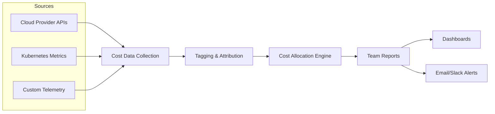
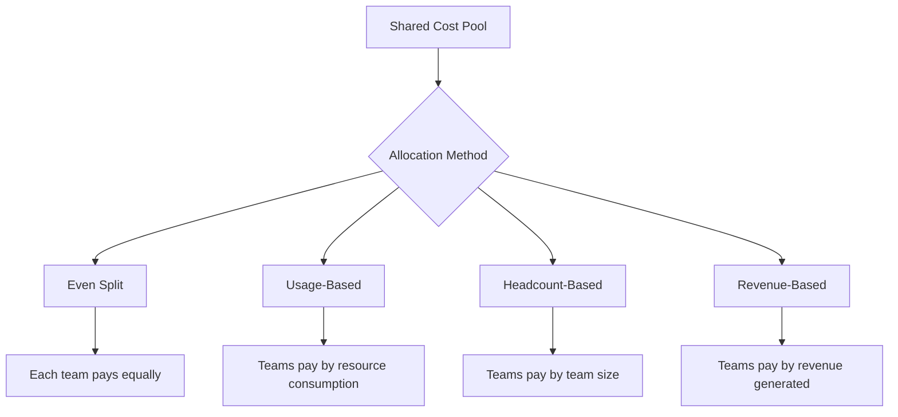

# How to Build Showback Reports

Author: [nawazdhandala](https://github.com/nawazdhandala)

Tags: Cost Management, FinOps, Showback, Reporting

Description: A practical guide to building showback reports that give teams visibility into their infrastructure costs without the complexity of chargebacks.

---

## What is Showback?

Showback is a cost allocation strategy where you report infrastructure costs to teams without directly billing them. Unlike chargeback (which transfers real dollars between budgets), showback surfaces the numbers so teams can make informed decisions about resource usage.

Think of it as a monthly power bill for your apartment building: everyone sees what their unit consumes, but rent stays flat. The goal is awareness, not accounting.

---

## Why Showback Matters

- Creates cost awareness without budget bureaucracy
- Highlights wasteful resource patterns before they become expensive
- Helps engineering teams optimize proactively
- Builds a foundation for future chargeback programs
- Enables data-driven capacity planning conversations

Organizations that implement showback typically see 15-30% cost reductions within the first quarter, simply because teams finally see what they spend.

---

## The Showback Workflow

Here's how cost data flows from raw infrastructure to team reports:



---

## Step 1: Define Your Cost Dimensions

Before writing any code, decide how you want to slice costs. Common dimensions include:

| Dimension | Example Values | Use Case |
|-----------|---------------|----------|
| Team | platform, payments, search | Team-level accountability |
| Environment | production, staging, dev | Environment optimization |
| Service | api-gateway, user-service | Service-level analysis |
| Cost Center | engineering, marketing | Finance alignment |
| Project | migration-2026, new-checkout | Project tracking |

Pick 3-5 dimensions that match your organization's structure. More dimensions mean more tagging overhead.

---

## Step 2: Tag Everything

Tags are the foundation of attribution. Without consistent tagging, showback reports become guesswork.

### Tagging Strategy

```yaml
# Kubernetes pod labels example
metadata:
  labels:
    team: payments
    service: payment-processor
    environment: production
    cost-center: engineering
```

### Cloud Resource Tags

```hcl
# Terraform AWS example
resource "aws_instance" "api_server" {
  instance_type = "t3.medium"

  tags = {
    Team        = "platform"
    Service     = "api-gateway"
    Environment = "production"
    CostCenter  = "engineering"
  }
}
```

### Tag Enforcement

Build validation into your CI/CD pipeline:

```python
# Simple tag validation script
REQUIRED_TAGS = ["team", "service", "environment", "cost-center"]

def validate_resource_tags(resource):
    missing = [tag for tag in REQUIRED_TAGS if tag not in resource.tags]
    if missing:
        raise ValueError(f"Missing required tags: {missing}")
    return True
```

---

## Step 3: Collect Cost Data

Pull cost data from your infrastructure providers. Here's an example using Python:

```python
import boto3
from datetime import datetime, timedelta

def fetch_aws_costs(start_date, end_date, granularity="DAILY"):
    """Fetch AWS costs grouped by tags."""
    client = boto3.client("ce")  # Cost Explorer

    response = client.get_cost_and_usage(
        TimePeriod={
            "Start": start_date.strftime("%Y-%m-%d"),
            "End": end_date.strftime("%Y-%m-%d")
        },
        Granularity=granularity,
        Metrics=["UnblendedCost"],
        GroupBy=[
            {"Type": "TAG", "Key": "Team"},
            {"Type": "TAG", "Key": "Service"}
        ]
    )

    return response["ResultsByTime"]

# Fetch last 30 days
costs = fetch_aws_costs(
    datetime.now() - timedelta(days=30),
    datetime.now()
)
```

For Kubernetes workloads, use metrics from the kubelet:

```python
def fetch_k8s_costs(prometheus_url, namespace):
    """Calculate costs from Kubernetes resource usage."""
    query = '''
        sum by (namespace, pod, label_team) (
            container_memory_usage_bytes{namespace="%s"}
        ) / 1024 / 1024 / 1024
    ''' % namespace

    # Memory usage in GB, multiply by your cost per GB-hour
    response = requests.get(
        f"{prometheus_url}/api/v1/query",
        params={"query": query}
    )

    return response.json()["data"]["result"]
```

---

## Step 4: Build the Allocation Engine

The allocation engine maps raw costs to your defined dimensions. Here's a simplified example:

```python
from dataclasses import dataclass
from decimal import Decimal
from typing import Dict, List

@dataclass
class CostEntry:
    date: str
    team: str
    service: str
    environment: str
    amount: Decimal
    currency: str = "USD"

def allocate_costs(raw_costs: List[dict]) -> List[CostEntry]:
    """Transform raw cost data into allocated entries."""
    entries = []

    for item in raw_costs:
        tags = item.get("tags", {})

        entry = CostEntry(
            date=item["date"],
            team=tags.get("team", "untagged"),
            service=tags.get("service", "unknown"),
            environment=tags.get("environment", "production"),
            amount=Decimal(str(item["cost"]))
        )
        entries.append(entry)

    return entries

def aggregate_by_team(entries: List[CostEntry]) -> Dict[str, Decimal]:
    """Sum costs by team."""
    totals = {}
    for entry in entries:
        totals[entry.team] = totals.get(entry.team, Decimal("0")) + entry.amount
    return totals
```

---

## Step 5: Handle Shared Costs

Not everything maps cleanly to a single team. Shared infrastructure (databases, networking, monitoring) needs a fair allocation strategy.

### Allocation Methods



### Implementation Example

```python
def allocate_shared_costs(
    shared_cost: Decimal,
    teams: List[str],
    usage_weights: Dict[str, float],
    method: str = "usage"
) -> Dict[str, Decimal]:
    """Distribute shared costs across teams."""

    if method == "even":
        per_team = shared_cost / len(teams)
        return {team: per_team for team in teams}

    elif method == "usage":
        total_weight = sum(usage_weights.values())
        return {
            team: shared_cost * Decimal(str(weight / total_weight))
            for team, weight in usage_weights.items()
        }

    elif method == "headcount":
        # Assumes usage_weights contains headcount
        total_headcount = sum(usage_weights.values())
        return {
            team: shared_cost * Decimal(str(count / total_headcount))
            for team, count in usage_weights.items()
        }

# Example: Allocate $10,000 monitoring costs by usage
shared_allocation = allocate_shared_costs(
    shared_cost=Decimal("10000"),
    teams=["platform", "payments", "search"],
    usage_weights={"platform": 0.5, "payments": 0.3, "search": 0.2},
    method="usage"
)
# Result: platform=$5000, payments=$3000, search=$2000
```

---

## Step 6: Generate Reports

Reports should answer three questions: What did we spend? Where did it go? How does it compare to last period?

### Sample Report Structure

```python
def generate_showback_report(
    entries: List[CostEntry],
    period: str
) -> dict:
    """Generate a structured showback report."""

    by_team = aggregate_by_team(entries)
    by_service = aggregate_by_dimension(entries, "service")
    by_environment = aggregate_by_dimension(entries, "environment")

    total = sum(by_team.values())

    return {
        "period": period,
        "total_cost": float(total),
        "currency": "USD",
        "breakdown": {
            "by_team": {k: float(v) for k, v in by_team.items()},
            "by_service": {k: float(v) for k, v in by_service.items()},
            "by_environment": {k: float(v) for k, v in by_environment.items()}
        },
        "top_services": get_top_n(by_service, 5),
        "untagged_percentage": calculate_untagged_percentage(entries)
    }
```

### Report Output Example

```json
{
  "period": "2026-01",
  "total_cost": 45230.50,
  "currency": "USD",
  "breakdown": {
    "by_team": {
      "platform": 18500.00,
      "payments": 12300.00,
      "search": 8430.50,
      "untagged": 6000.00
    },
    "by_service": {
      "api-gateway": 8200.00,
      "payment-processor": 7100.00,
      "search-indexer": 6800.00,
      "user-service": 5100.00,
      "other": 18030.50
    },
    "by_environment": {
      "production": 38000.00,
      "staging": 5230.50,
      "development": 2000.00
    }
  },
  "top_services": [
    {"name": "api-gateway", "cost": 8200.00},
    {"name": "payment-processor", "cost": 7100.00},
    {"name": "search-indexer", "cost": 6800.00}
  ],
  "untagged_percentage": 13.3
}
```

---

## Step 7: Trend Analysis

Single-month reports are useful, but trends drive action. Track costs over time to spot anomalies and measure optimization efforts.

```mermaid
xychart-beta
    title "Monthly Cost by Team"
    x-axis [Oct, Nov, Dec, Jan]
    y-axis "Cost (USD)" 0 --> 25000
    bar [15000, 16200, 17500, 18500] "Platform"
    bar [10500, 11200, 11800, 12300] "Payments"
    bar [7200, 7800, 8100, 8430] "Search"
```

### Trend Detection

```python
def detect_cost_anomaly(
    current: Decimal,
    previous_values: List[Decimal],
    threshold_pct: float = 20.0
) -> dict:
    """Flag significant cost changes."""

    if not previous_values:
        return {"anomaly": False}

    avg_previous = sum(previous_values) / len(previous_values)
    change_pct = ((current - avg_previous) / avg_previous) * 100

    return {
        "anomaly": abs(change_pct) > threshold_pct,
        "change_percent": float(change_pct),
        "direction": "increase" if change_pct > 0 else "decrease",
        "previous_average": float(avg_previous),
        "current": float(current)
    }

# Example usage
result = detect_cost_anomaly(
    current=Decimal("18500"),
    previous_values=[Decimal("15000"), Decimal("16200"), Decimal("17500")],
    threshold_pct=15.0
)
# Result: {"anomaly": True, "change_percent": 14.1, "direction": "increase", ...}
```

---

## Step 8: Automate Distribution

Reports only create value if people see them. Automate distribution to Slack, email, or dashboards.

### Slack Integration

```python
import requests

def send_showback_to_slack(report: dict, webhook_url: str):
    """Post showback summary to Slack."""

    message = {
        "blocks": [
            {
                "type": "header",
                "text": {
                    "type": "plain_text",
                    "text": f"Showback Report: {report['period']}"
                }
            },
            {
                "type": "section",
                "text": {
                    "type": "mrkdwn",
                    "text": f"*Total Cost:* ${report['total_cost']:,.2f}"
                }
            },
            {
                "type": "section",
                "text": {
                    "type": "mrkdwn",
                    "text": "\n".join([
                        f"- *{team}:* ${cost:,.2f}"
                        for team, cost in report['breakdown']['by_team'].items()
                    ])
                }
            }
        ]
    }

    requests.post(webhook_url, json=message)
```

---

## Common Pitfalls

1. **Inconsistent tagging**: Enforce tags in CI/CD, not after deployment.
2. **Ignoring shared costs**: Allocate them fairly or teams will game the system.
3. **Too many dimensions**: Start with 3-5 and add more only when needed.
4. **Monthly-only reports**: Weekly summaries catch issues faster.
5. **No action path**: Every report should include recommendations, not just numbers.

---

## Showback vs Chargeback

| Aspect | Showback | Chargeback |
|--------|----------|------------|
| Budget transfer | No | Yes |
| Accounting overhead | Low | High |
| Team autonomy | Advisory | Enforced |
| Implementation time | Weeks | Months |
| Political friction | Low | High |
| Best for | Awareness, culture change | Strict cost control |

Start with showback. Graduate to chargeback only if you need strict budget enforcement and have executive buy-in.

---

## Building on OneUptime

OneUptime can help you correlate cost data with performance and incidents. When you see a cost spike, you can trace it back to a deployment, traffic surge, or configuration change.

Connect your showback reports to:
- Deployment markers to see cost impact of releases
- Incident timelines to understand cost of outages
- Service catalogs to maintain ownership metadata
- Alert rules to notify teams of budget anomalies

---

## Summary

1. Define cost dimensions that match your org structure
2. Tag all resources consistently and enforce in CI/CD
3. Collect cost data from cloud APIs and Kubernetes metrics
4. Build an allocation engine that handles shared costs fairly
5. Generate reports with breakdowns, trends, and anomaly detection
6. Automate distribution so reports reach the right people
7. Start with showback, consider chargeback later

Showback is not about billing teams for infrastructure. It is about giving them the information they need to make smart decisions about resource usage. The goal is awareness, not accounting.

---

**Related Reading:**

- [Datadog Dollars: Why Your Monitoring Bill Is Breaking the Bank](https://oneuptime.com/blog/post/2025-02-01-datadog-dollars-why-monitoring-is-breaking-the-bank/view)
- [Eliminating Toil: A Practical SRE Playbook](https://oneuptime.com/blog/post/2025-10-01-what-is-toil-and-how-to-eliminate-it/view)
- [18 SRE Metrics Worth Tracking](https://oneuptime.com/blog/post/2025-11-28-sre-metrics-to-track/view)
