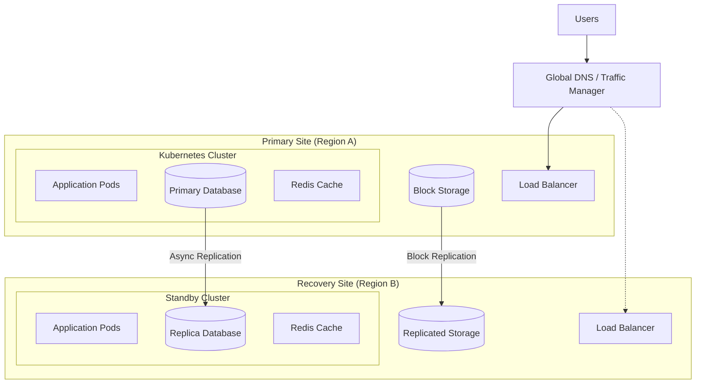
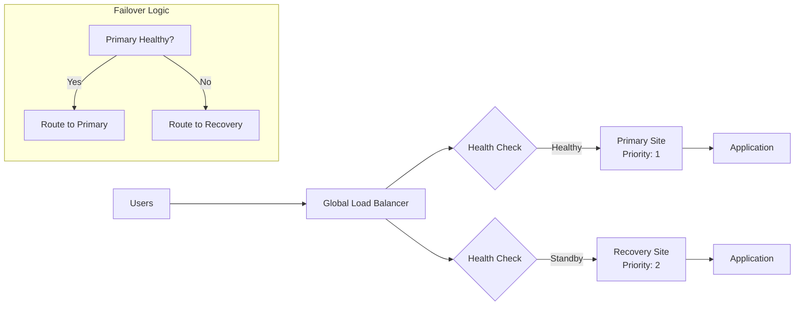
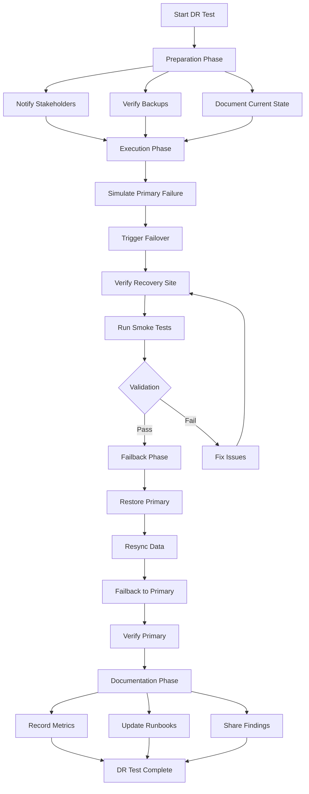

# How to Build Site Recovery Configuration

Author: [nawazdhandala](https://github.com/nawazdhandala)

Tags: Disaster Recovery, Site Recovery, High Availability, Cloud

Description: Learn how to configure site recovery for disaster resilience.

---

When disaster strikes, your recovery time determines whether it's a minor inconvenience or a business-ending event. Site recovery configuration is the foundation of disaster resilience, ensuring your applications can fail over to a secondary site with minimal data loss and downtime. Here's how to build a robust site recovery setup.

## Site Recovery Architecture

A well-designed site recovery architecture separates your primary and recovery sites while maintaining continuous data replication between them.



### Key Components

1. **Global DNS/Traffic Manager**: Routes traffic to the active site and handles failover
2. **Primary Site**: Handles all production traffic during normal operations
3. **Recovery Site**: Maintains synchronized replicas ready to take over
4. **Replication Layer**: Ensures data consistency between sites

## Replication Configuration

### Database Replication Setup

For PostgreSQL cross-region replication:

```yaml
# primary-postgresql.yaml
apiVersion: v1
kind: ConfigMap
metadata:
  name: postgres-primary-config
  namespace: database
data:
  postgresql.conf: |
    listen_addresses = '*'
    wal_level = replica
    max_wal_senders = 10
    max_replication_slots = 10
    wal_keep_size = 1GB
    hot_standby = on
    synchronous_commit = on
    synchronous_standby_names = 'recovery_site'

  pg_hba.conf: |
    # Allow replication from recovery site
    host replication replicator 10.1.0.0/16 md5
    host replication replicator 10.2.0.0/16 md5
    host all all 0.0.0.0/0 md5
---
apiVersion: v1
kind: Secret
metadata:
  name: postgres-replication-secret
  namespace: database
type: Opaque
stringData:
  REPLICATION_USER: replicator
  REPLICATION_PASSWORD: <strong-password>
---
apiVersion: apps/v1
kind: StatefulSet
metadata:
  name: postgres-primary
  namespace: database
spec:
  serviceName: postgres-primary
  replicas: 1
  selector:
    matchLabels:
      app: postgres
      role: primary
  template:
    metadata:
      labels:
        app: postgres
        role: primary
    spec:
      containers:
        - name: postgres
          image: postgres:15
          ports:
            - containerPort: 5432
          env:
            - name: POSTGRES_DB
              value: appdb
            - name: POSTGRES_USER
              value: admin
            - name: POSTGRES_PASSWORD
              valueFrom:
                secretKeyRef:
                  name: postgres-secret
                  key: password
          volumeMounts:
            - name: postgres-data
              mountPath: /var/lib/postgresql/data
            - name: postgres-config
              mountPath: /etc/postgresql/postgresql.conf
              subPath: postgresql.conf
            - name: postgres-config
              mountPath: /etc/postgresql/pg_hba.conf
              subPath: pg_hba.conf
          command:
            - postgres
            - -c
            - config_file=/etc/postgresql/postgresql.conf
            - -c
            - hba_file=/etc/postgresql/pg_hba.conf
      volumes:
        - name: postgres-config
          configMap:
            name: postgres-primary-config
  volumeClaimTemplates:
    - metadata:
        name: postgres-data
      spec:
        accessModes: ["ReadWriteOnce"]
        storageClassName: fast-ssd
        resources:
          requests:
            storage: 100Gi
```

### Recovery Site Replica Configuration

```yaml
# replica-postgresql.yaml (Recovery Site)
apiVersion: v1
kind: ConfigMap
metadata:
  name: postgres-replica-config
  namespace: database
data:
  postgresql.conf: |
    listen_addresses = '*'
    hot_standby = on
    hot_standby_feedback = on
    wal_receiver_status_interval = 10s
    max_standby_streaming_delay = 30s

  recovery.conf: |
    standby_mode = on
    primary_conninfo = 'host=postgres-primary.region-a.example.com port=5432 user=replicator password=<password> application_name=recovery_site'
    trigger_file = '/tmp/promote_to_primary'
    recovery_target_timeline = 'latest'
---
apiVersion: apps/v1
kind: StatefulSet
metadata:
  name: postgres-replica
  namespace: database
spec:
  serviceName: postgres-replica
  replicas: 1
  selector:
    matchLabels:
      app: postgres
      role: replica
  template:
    metadata:
      labels:
        app: postgres
        role: replica
    spec:
      initContainers:
        - name: init-replica
          image: postgres:15
          command:
            - /bin/bash
            - -c
            - |
              if [ ! -f /var/lib/postgresql/data/PG_VERSION ]; then
                PGPASSWORD=$REPLICATION_PASSWORD pg_basebackup \
                  -h postgres-primary.region-a.example.com \
                  -U replicator \
                  -D /var/lib/postgresql/data \
                  -P -R -X stream -S recovery_slot
              fi
          env:
            - name: REPLICATION_PASSWORD
              valueFrom:
                secretKeyRef:
                  name: postgres-replication-secret
                  key: REPLICATION_PASSWORD
          volumeMounts:
            - name: postgres-data
              mountPath: /var/lib/postgresql/data
      containers:
        - name: postgres
          image: postgres:15
          ports:
            - containerPort: 5432
          volumeMounts:
            - name: postgres-data
              mountPath: /var/lib/postgresql/data
  volumeClaimTemplates:
    - metadata:
        name: postgres-data
      spec:
        accessModes: ["ReadWriteOnce"]
        storageClassName: fast-ssd
        resources:
          requests:
            storage: 100Gi
```

### Replication Monitoring Script

```bash
#!/bin/bash
# check-replication-lag.sh

set -e

PRIMARY_HOST="postgres-primary.region-a.example.com"
REPLICA_HOST="postgres-replica.region-b.example.com"

# Check replication lag on primary
echo "=== Checking replication status on primary ==="
PGPASSWORD=$DB_PASSWORD psql -h $PRIMARY_HOST -U admin -d appdb -c "
SELECT
    client_addr,
    state,
    sent_lsn,
    write_lsn,
    flush_lsn,
    replay_lsn,
    pg_wal_lsn_diff(sent_lsn, replay_lsn) AS replication_lag_bytes,
    pg_wal_lsn_diff(sent_lsn, replay_lsn) / 1024 / 1024 AS replication_lag_mb
FROM pg_stat_replication;
"

# Check replica status
echo "=== Checking replica status ==="
PGPASSWORD=$DB_PASSWORD psql -h $REPLICA_HOST -U admin -d appdb -c "
SELECT
    pg_is_in_recovery() AS is_replica,
    pg_last_wal_receive_lsn() AS last_received_lsn,
    pg_last_wal_replay_lsn() AS last_replayed_lsn,
    EXTRACT(EPOCH FROM (now() - pg_last_xact_replay_timestamp()))::int AS lag_seconds;
"

# Alert if lag exceeds threshold
LAG_SECONDS=$(PGPASSWORD=$DB_PASSWORD psql -h $REPLICA_HOST -U admin -d appdb -t -c "
SELECT EXTRACT(EPOCH FROM (now() - pg_last_xact_replay_timestamp()))::int;
")

if [ "$LAG_SECONDS" -gt 60 ]; then
    echo "WARNING: Replication lag is ${LAG_SECONDS} seconds"
    exit 1
fi

echo "Replication healthy. Lag: ${LAG_SECONDS} seconds"
```

## Recovery Site Preparation

### Infrastructure as Code for Recovery Site

```hcl
# recovery-site.tf

variable "recovery_region" {
  default = "us-west-2"
}

variable "primary_region" {
  default = "us-east-1"
}

# VPC for Recovery Site
resource "aws_vpc" "recovery" {
  provider   = aws.recovery
  cidr_block = "10.2.0.0/16"

  tags = {
    Name        = "recovery-site-vpc"
    Environment = "disaster-recovery"
  }
}

# Subnets across availability zones
resource "aws_subnet" "recovery_private" {
  provider          = aws.recovery
  count             = 3
  vpc_id            = aws_vpc.recovery.id
  cidr_block        = "10.2.${count.index + 1}.0/24"
  availability_zone = data.aws_availability_zones.recovery.names[count.index]

  tags = {
    Name = "recovery-private-${count.index + 1}"
  }
}

# EKS Cluster for Recovery Site
resource "aws_eks_cluster" "recovery" {
  provider = aws.recovery
  name     = "recovery-cluster"
  role_arn = aws_iam_role.eks_recovery.arn
  version  = "1.28"

  vpc_config {
    subnet_ids              = aws_subnet.recovery_private[*].id
    endpoint_private_access = true
    endpoint_public_access  = false
  }

  # Keep cluster warm but with minimal resources
  tags = {
    Environment = "disaster-recovery"
    Status      = "standby"
  }
}

# Node Group - Scaled down during standby
resource "aws_eks_node_group" "recovery" {
  provider        = aws.recovery
  cluster_name    = aws_eks_cluster.recovery.name
  node_group_name = "recovery-nodes"
  node_role_arn   = aws_iam_role.node_recovery.arn
  subnet_ids      = aws_subnet.recovery_private[*].id

  scaling_config {
    desired_size = 2  # Minimal during standby
    max_size     = 20 # Scale up during failover
    min_size     = 2
  }

  instance_types = ["m5.xlarge"]

  tags = {
    Environment = "disaster-recovery"
  }
}

# Cross-region VPC Peering
resource "aws_vpc_peering_connection" "cross_region" {
  provider      = aws.primary
  vpc_id        = aws_vpc.primary.id
  peer_vpc_id   = aws_vpc.recovery.id
  peer_region   = var.recovery_region
  auto_accept   = false

  tags = {
    Name = "primary-to-recovery-peering"
  }
}

resource "aws_vpc_peering_connection_accepter" "recovery" {
  provider                  = aws.recovery
  vpc_peering_connection_id = aws_vpc_peering_connection.cross_region.id
  auto_accept               = true
}

# Route tables for cross-region traffic
resource "aws_route" "primary_to_recovery" {
  provider                  = aws.primary
  route_table_id            = aws_vpc.primary.main_route_table_id
  destination_cidr_block    = aws_vpc.recovery.cidr_block
  vpc_peering_connection_id = aws_vpc_peering_connection.cross_region.id
}

resource "aws_route" "recovery_to_primary" {
  provider                  = aws.recovery
  route_table_id            = aws_vpc.recovery.main_route_table_id
  destination_cidr_block    = aws_vpc.primary.cidr_block
  vpc_peering_connection_id = aws_vpc_peering_connection.cross_region.id
}
```

### Application Deployment on Recovery Site

```yaml
# recovery-deployment.yaml
apiVersion: apps/v1
kind: Deployment
metadata:
  name: app-recovery
  namespace: application
  labels:
    app: myapp
    site: recovery
spec:
  replicas: 2  # Minimal during standby
  selector:
    matchLabels:
      app: myapp
  template:
    metadata:
      labels:
        app: myapp
        site: recovery
    spec:
      containers:
        - name: app
          image: myapp:latest
          ports:
            - containerPort: 8080
          env:
            - name: SITE_MODE
              value: "standby"  # Application-aware standby mode
            - name: DATABASE_HOST
              value: "postgres-replica"  # Points to local replica
            - name: DATABASE_READ_ONLY
              value: "true"
            - name: CACHE_HOST
              value: "redis-replica"
          resources:
            requests:
              cpu: "100m"      # Minimal resources in standby
              memory: "256Mi"
            limits:
              cpu: "2000m"     # Can scale up during failover
              memory: "4Gi"
          readinessProbe:
            httpGet:
              path: /health/ready
              port: 8080
            initialDelaySeconds: 5
            periodSeconds: 10
          livenessProbe:
            httpGet:
              path: /health/live
              port: 8080
            initialDelaySeconds: 15
            periodSeconds: 20
---
apiVersion: autoscaling/v2
kind: HorizontalPodAutoscaler
metadata:
  name: app-recovery-hpa
  namespace: application
spec:
  scaleTargetRef:
    apiVersion: apps/v1
    kind: Deployment
    name: app-recovery
  minReplicas: 2
  maxReplicas: 50
  metrics:
    - type: Resource
      resource:
        name: cpu
        target:
          type: Utilization
          averageUtilization: 70
```

## Network Configuration

### Global Load Balancer Setup



### AWS Route 53 Failover Configuration

```hcl
# route53-failover.tf

# Health check for primary site
resource "aws_route53_health_check" "primary" {
  fqdn              = "app.primary.example.com"
  port              = 443
  type              = "HTTPS"
  resource_path     = "/health"
  failure_threshold = 3
  request_interval  = 10

  tags = {
    Name = "primary-health-check"
  }
}

# Health check for recovery site
resource "aws_route53_health_check" "recovery" {
  fqdn              = "app.recovery.example.com"
  port              = 443
  type              = "HTTPS"
  resource_path     = "/health"
  failure_threshold = 3
  request_interval  = 10

  tags = {
    Name = "recovery-health-check"
  }
}

# Primary record (failover)
resource "aws_route53_record" "primary" {
  zone_id = aws_route53_zone.main.zone_id
  name    = "app.example.com"
  type    = "A"

  alias {
    name                   = aws_lb.primary.dns_name
    zone_id                = aws_lb.primary.zone_id
    evaluate_target_health = true
  }

  failover_routing_policy {
    type = "PRIMARY"
  }

  set_identifier  = "primary"
  health_check_id = aws_route53_health_check.primary.id
}

# Recovery record (failover)
resource "aws_route53_record" "recovery" {
  zone_id = aws_route53_zone.main.zone_id
  name    = "app.example.com"
  type    = "A"

  alias {
    name                   = aws_lb.recovery.dns_name
    zone_id                = aws_lb.recovery.zone_id
    evaluate_target_health = true
  }

  failover_routing_policy {
    type = "SECONDARY"
  }

  set_identifier  = "recovery"
  health_check_id = aws_route53_health_check.recovery.id
}
```

### Service Mesh Configuration for Cross-Site Traffic

```yaml
# istio-cross-site.yaml
apiVersion: networking.istio.io/v1beta1
kind: ServiceEntry
metadata:
  name: primary-site-services
  namespace: istio-system
spec:
  hosts:
    - "*.primary.example.com"
  location: MESH_EXTERNAL
  ports:
    - number: 443
      name: https
      protocol: HTTPS
  resolution: DNS
---
apiVersion: networking.istio.io/v1beta1
kind: DestinationRule
metadata:
  name: cross-site-mtls
  namespace: istio-system
spec:
  host: "*.primary.example.com"
  trafficPolicy:
    tls:
      mode: MUTUAL
      clientCertificate: /etc/certs/cert-chain.pem
      privateKey: /etc/certs/key.pem
      caCertificates: /etc/certs/root-cert.pem
---
apiVersion: networking.istio.io/v1beta1
kind: VirtualService
metadata:
  name: app-failover
  namespace: application
spec:
  hosts:
    - app
  http:
    - match:
        - headers:
            x-failover-mode:
              exact: "active"
      route:
        - destination:
            host: app
            port:
              number: 8080
    - route:
        - destination:
            host: app
            port:
              number: 8080
          weight: 100
        - destination:
            host: app.primary.example.com
            port:
              number: 443
          weight: 0  # Activate during failback
```

## Failover Automation

### Automated Failover Controller

```yaml
# failover-controller.yaml
apiVersion: v1
kind: ConfigMap
metadata:
  name: failover-config
  namespace: site-recovery
data:
  config.yaml: |
    primary_site:
      name: "region-a"
      health_endpoint: "https://app.primary.example.com/health"
      database_host: "postgres-primary.region-a.example.com"
    recovery_site:
      name: "region-b"
      health_endpoint: "https://app.recovery.example.com/health"
      database_host: "postgres-replica.region-b.example.com"
    failover:
      health_check_interval: 10s
      failure_threshold: 3
      recovery_threshold: 5
      cooldown_period: 300s
    notifications:
      slack_webhook: "${SLACK_WEBHOOK_URL}"
      pagerduty_key: "${PAGERDUTY_KEY}"
---
apiVersion: apps/v1
kind: Deployment
metadata:
  name: failover-controller
  namespace: site-recovery
spec:
  replicas: 1
  selector:
    matchLabels:
      app: failover-controller
  template:
    metadata:
      labels:
        app: failover-controller
    spec:
      serviceAccountName: failover-controller
      containers:
        - name: controller
          image: failover-controller:latest
          env:
            - name: SLACK_WEBHOOK_URL
              valueFrom:
                secretKeyRef:
                  name: notification-secrets
                  key: slack-webhook
            - name: PAGERDUTY_KEY
              valueFrom:
                secretKeyRef:
                  name: notification-secrets
                  key: pagerduty-key
            - name: AWS_REGION
              value: "us-east-1"
          volumeMounts:
            - name: config
              mountPath: /etc/failover
      volumes:
        - name: config
          configMap:
            name: failover-config
```

### Failover Script

```bash
#!/bin/bash
# failover.sh - Automated site failover script

set -e

RECOVERY_SITE="region-b"
PRIMARY_SITE="region-a"
KUBECONFIG_PRIMARY="/etc/kubernetes/primary-kubeconfig"
KUBECONFIG_RECOVERY="/etc/kubernetes/recovery-kubeconfig"

log() {
    echo "[$(date '+%Y-%m-%d %H:%M:%S')] $1"
}

notify() {
    local message=$1
    local severity=$2

    # Slack notification
    curl -s -X POST "$SLACK_WEBHOOK_URL" \
        -H 'Content-type: application/json' \
        -d "{\"text\": \"[$severity] Site Recovery: $message\"}"

    # PagerDuty for critical events
    if [ "$severity" == "CRITICAL" ]; then
        curl -s -X POST "https://events.pagerduty.com/v2/enqueue" \
            -H 'Content-Type: application/json' \
            -d "{
                \"routing_key\": \"$PAGERDUTY_KEY\",
                \"event_action\": \"trigger\",
                \"payload\": {
                    \"summary\": \"$message\",
                    \"severity\": \"critical\",
                    \"source\": \"site-recovery-controller\"
                }
            }"
    fi
}

check_primary_health() {
    local response
    response=$(curl -s -o /dev/null -w "%{http_code}" \
        --connect-timeout 5 \
        --max-time 10 \
        "https://app.primary.example.com/health")

    if [ "$response" == "200" ]; then
        return 0
    else
        return 1
    fi
}

promote_database_replica() {
    log "Promoting database replica to primary..."

    # Create trigger file to promote PostgreSQL replica
    KUBECONFIG=$KUBECONFIG_RECOVERY kubectl exec -n database \
        postgres-replica-0 -- touch /tmp/promote_to_primary

    # Wait for promotion
    sleep 30

    # Verify promotion
    local is_primary
    is_primary=$(KUBECONFIG=$KUBECONFIG_RECOVERY kubectl exec -n database \
        postgres-replica-0 -- psql -U admin -d appdb -t -c \
        "SELECT pg_is_in_recovery();")

    if [ "$is_primary" == " f" ]; then
        log "Database successfully promoted to primary"
        return 0
    else
        log "ERROR: Database promotion failed"
        return 1
    fi
}

scale_recovery_site() {
    log "Scaling up recovery site..."

    # Scale application deployment
    KUBECONFIG=$KUBECONFIG_RECOVERY kubectl scale deployment app-recovery \
        -n application --replicas=10

    # Update HPA for production load
    KUBECONFIG=$KUBECONFIG_RECOVERY kubectl patch hpa app-recovery-hpa \
        -n application --type='json' \
        -p='[{"op": "replace", "path": "/spec/minReplicas", "value": 10}]'

    # Scale node group (via cluster autoscaler or direct API)
    aws eks update-nodegroup-config \
        --cluster-name recovery-cluster \
        --nodegroup-name recovery-nodes \
        --scaling-config minSize=5,maxSize=30,desiredSize=10 \
        --region us-west-2

    # Wait for pods to be ready
    KUBECONFIG=$KUBECONFIG_RECOVERY kubectl rollout status \
        deployment/app-recovery -n application --timeout=300s

    log "Recovery site scaled up successfully"
}

update_dns() {
    log "Updating DNS to point to recovery site..."

    # Update Route 53 to force traffic to recovery
    aws route53 change-resource-record-sets \
        --hosted-zone-id "$HOSTED_ZONE_ID" \
        --change-batch '{
            "Changes": [{
                "Action": "UPSERT",
                "ResourceRecordSet": {
                    "Name": "app.example.com",
                    "Type": "A",
                    "AliasTarget": {
                        "HostedZoneId": "'"$RECOVERY_LB_ZONE_ID"'",
                        "DNSName": "'"$RECOVERY_LB_DNS"'",
                        "EvaluateTargetHealth": true
                    },
                    "SetIdentifier": "failover-active",
                    "Failover": "PRIMARY"
                }
            }]
        }'

    log "DNS updated to recovery site"
}

update_application_config() {
    log "Updating application configuration..."

    # Update ConfigMap to switch database connection
    KUBECONFIG=$KUBECONFIG_RECOVERY kubectl patch configmap app-config \
        -n application --type='json' \
        -p='[
            {"op": "replace", "path": "/data/SITE_MODE", "value": "active"},
            {"op": "replace", "path": "/data/DATABASE_READ_ONLY", "value": "false"}
        ]'

    # Restart deployments to pick up new config
    KUBECONFIG=$KUBECONFIG_RECOVERY kubectl rollout restart \
        deployment/app-recovery -n application

    log "Application configuration updated"
}

execute_failover() {
    log "=========================================="
    log "INITIATING SITE FAILOVER"
    log "=========================================="

    notify "Initiating failover from $PRIMARY_SITE to $RECOVERY_SITE" "CRITICAL"

    # Step 1: Promote database
    if ! promote_database_replica; then
        notify "FAILED: Database promotion failed. Manual intervention required." "CRITICAL"
        exit 1
    fi

    # Step 2: Scale recovery site
    if ! scale_recovery_site; then
        notify "FAILED: Recovery site scaling failed. Manual intervention required." "CRITICAL"
        exit 1
    fi

    # Step 3: Update application configuration
    update_application_config

    # Step 4: Update DNS
    update_dns

    # Step 5: Verify failover
    sleep 60
    if check_recovery_health; then
        log "Failover completed successfully"
        notify "Failover to $RECOVERY_SITE completed successfully" "INFO"
    else
        notify "Failover completed but health check failed. Manual verification required." "WARNING"
    fi

    log "=========================================="
    log "FAILOVER COMPLETE"
    log "=========================================="
}

check_recovery_health() {
    local response
    response=$(curl -s -o /dev/null -w "%{http_code}" \
        --connect-timeout 5 \
        --max-time 10 \
        "https://app.recovery.example.com/health")

    [ "$response" == "200" ]
}

# Main execution
case "$1" in
    failover)
        execute_failover
        ;;
    check-primary)
        if check_primary_health; then
            echo "Primary site is healthy"
            exit 0
        else
            echo "Primary site is unhealthy"
            exit 1
        fi
        ;;
    check-recovery)
        if check_recovery_health; then
            echo "Recovery site is healthy"
            exit 0
        else
            echo "Recovery site is unhealthy"
            exit 1
        fi
        ;;
    *)
        echo "Usage: $0 {failover|check-primary|check-recovery}"
        exit 1
        ;;
esac
```

## Testing Procedures

### Disaster Recovery Test Plan



### Automated DR Test Script

```bash
#!/bin/bash
# dr-test.sh - Automated disaster recovery testing

set -e

TEST_ID="dr-test-$(date +%Y%m%d-%H%M%S)"
LOG_FILE="/var/log/dr-tests/$TEST_ID.log"
REPORT_FILE="/var/log/dr-tests/$TEST_ID-report.json"

mkdir -p /var/log/dr-tests

exec > >(tee -a "$LOG_FILE") 2>&1

log() {
    echo "[$(date '+%Y-%m-%d %H:%M:%S')] $1"
}

record_metric() {
    local metric_name=$1
    local metric_value=$2
    echo "{\"metric\": \"$metric_name\", \"value\": \"$metric_value\", \"timestamp\": \"$(date -Iseconds)\"}" >> "$REPORT_FILE.metrics"
}

# Phase 1: Preparation
preparation_phase() {
    log "=== PHASE 1: PREPARATION ==="

    # Verify current state
    log "Checking primary site health..."
    PRIMARY_STATUS=$(curl -s -o /dev/null -w "%{http_code}" https://app.primary.example.com/health)
    record_metric "primary_health_before" "$PRIMARY_STATUS"

    log "Checking recovery site health..."
    RECOVERY_STATUS=$(curl -s -o /dev/null -w "%{http_code}" https://app.recovery.example.com/health)
    record_metric "recovery_health_before" "$RECOVERY_STATUS"

    # Verify replication lag
    log "Checking replication lag..."
    REPLICATION_LAG=$(psql -h postgres-replica.region-b.example.com -U admin -d appdb -t -c \
        "SELECT EXTRACT(EPOCH FROM (now() - pg_last_xact_replay_timestamp()))::int;")
    record_metric "replication_lag_seconds" "$REPLICATION_LAG"

    if [ "$REPLICATION_LAG" -gt 60 ]; then
        log "WARNING: Replication lag is ${REPLICATION_LAG}s. Consider waiting before test."
    fi

    # Create test data marker
    log "Creating test data marker..."
    TEST_MARKER="dr-test-marker-$TEST_ID"
    psql -h postgres-primary.region-a.example.com -U admin -d appdb -c \
        "INSERT INTO dr_test_markers (marker_id, created_at) VALUES ('$TEST_MARKER', NOW());"

    # Wait for replication
    sleep 10

    # Verify marker replicated
    MARKER_EXISTS=$(psql -h postgres-replica.region-b.example.com -U admin -d appdb -t -c \
        "SELECT COUNT(*) FROM dr_test_markers WHERE marker_id = '$TEST_MARKER';")

    if [ "$MARKER_EXISTS" -lt 1 ]; then
        log "ERROR: Test marker not replicated. Aborting test."
        exit 1
    fi

    log "Preparation phase complete"
}

# Phase 2: Failover Execution
failover_phase() {
    log "=== PHASE 2: FAILOVER EXECUTION ==="

    FAILOVER_START=$(date +%s)

    # Simulate primary failure (controlled)
    log "Simulating primary site failure..."

    # Option 1: DNS-based simulation (safer)
    aws route53 change-resource-record-sets \
        --hosted-zone-id "$HOSTED_ZONE_ID" \
        --change-batch file://simulate-failure.json

    # Option 2: Actually stop primary (more realistic but riskier)
    # kubectl --kubeconfig=$KUBECONFIG_PRIMARY scale deployment app --replicas=0 -n application

    log "Waiting for health checks to detect failure..."
    sleep 30

    # Trigger failover
    log "Triggering automated failover..."
    ./failover.sh failover

    FAILOVER_END=$(date +%s)
    FAILOVER_DURATION=$((FAILOVER_END - FAILOVER_START))

    record_metric "failover_duration_seconds" "$FAILOVER_DURATION"
    log "Failover completed in ${FAILOVER_DURATION} seconds"
}

# Phase 3: Validation
validation_phase() {
    log "=== PHASE 3: VALIDATION ==="

    # Check recovery site is serving traffic
    log "Validating recovery site..."

    VALIDATION_ERRORS=0

    # Health check
    HEALTH_STATUS=$(curl -s -o /dev/null -w "%{http_code}" https://app.example.com/health)
    if [ "$HEALTH_STATUS" != "200" ]; then
        log "ERROR: Health check failed with status $HEALTH_STATUS"
        ((VALIDATION_ERRORS++))
    else
        log "Health check passed"
    fi

    # API functionality test
    log "Running API smoke tests..."
    API_TEST=$(curl -s https://app.example.com/api/status | jq -r '.status')
    if [ "$API_TEST" != "ok" ]; then
        log "ERROR: API test failed"
        ((VALIDATION_ERRORS++))
    else
        log "API test passed"
    fi

    # Database write test
    log "Testing database write capability..."
    WRITE_TEST=$(curl -s -X POST https://app.example.com/api/test/write \
        -H "Content-Type: application/json" \
        -d '{"test_id": "'$TEST_ID'"}' | jq -r '.success')

    if [ "$WRITE_TEST" != "true" ]; then
        log "ERROR: Database write test failed"
        ((VALIDATION_ERRORS++))
    else
        log "Database write test passed"
    fi

    # Verify test marker exists
    log "Verifying data integrity..."
    MARKER_CHECK=$(curl -s "https://app.example.com/api/test/marker/$TEST_MARKER" | jq -r '.exists')
    if [ "$MARKER_CHECK" != "true" ]; then
        log "ERROR: Test marker not found - data loss detected"
        ((VALIDATION_ERRORS++))
    else
        log "Data integrity verified"
    fi

    record_metric "validation_errors" "$VALIDATION_ERRORS"

    if [ "$VALIDATION_ERRORS" -gt 0 ]; then
        log "Validation failed with $VALIDATION_ERRORS errors"
        return 1
    fi

    log "Validation phase complete - all tests passed"
    return 0
}

# Phase 4: Failback
failback_phase() {
    log "=== PHASE 4: FAILBACK ==="

    FAILBACK_START=$(date +%s)

    # Restore primary site
    log "Restoring primary site..."

    # Restore DNS for primary
    aws route53 change-resource-record-sets \
        --hosted-zone-id "$HOSTED_ZONE_ID" \
        --change-batch file://restore-primary.json

    # Wait for primary to be healthy
    log "Waiting for primary site to be healthy..."
    for i in {1..30}; do
        if curl -s -o /dev/null -w "%{http_code}" https://app.primary.example.com/health | grep -q "200"; then
            log "Primary site is healthy"
            break
        fi
        sleep 10
    done

    # Resync data from recovery to primary
    log "Resyncing data to primary..."
    # This depends on your specific setup - pg_basebackup, pg_rewind, or application-level sync

    # Switch traffic back to primary
    log "Switching traffic to primary..."
    ./failover.sh failback

    FAILBACK_END=$(date +%s)
    FAILBACK_DURATION=$((FAILBACK_END - FAILBACK_START))

    record_metric "failback_duration_seconds" "$FAILBACK_DURATION"
    log "Failback completed in ${FAILBACK_DURATION} seconds"
}

# Phase 5: Reporting
reporting_phase() {
    log "=== PHASE 5: REPORTING ==="

    # Generate final report
    cat > "$REPORT_FILE" << EOF
{
    "test_id": "$TEST_ID",
    "test_date": "$(date -Iseconds)",
    "results": {
        "failover_duration_seconds": $(grep failover_duration "$REPORT_FILE.metrics" | jq -r '.value'),
        "failback_duration_seconds": $(grep failback_duration "$REPORT_FILE.metrics" | jq -r '.value'),
        "validation_errors": $(grep validation_errors "$REPORT_FILE.metrics" | jq -r '.value'),
        "status": "$([ "$VALIDATION_ERRORS" -eq 0 ] && echo 'PASSED' || echo 'FAILED')"
    },
    "rto_achieved": "$(grep failover_duration "$REPORT_FILE.metrics" | jq -r '.value') seconds",
    "rpo_achieved": "$(grep replication_lag "$REPORT_FILE.metrics" | jq -r '.value') seconds"
}
EOF

    log "Test report saved to $REPORT_FILE"

    # Send report notification
    curl -s -X POST "$SLACK_WEBHOOK_URL" \
        -H 'Content-type: application/json' \
        -d @- << EOF
{
    "text": "DR Test $TEST_ID Complete",
    "attachments": [{
        "color": "$([ "$VALIDATION_ERRORS" -eq 0 ] && echo 'good' || echo 'danger')",
        "fields": [
            {"title": "Status", "value": "$([ "$VALIDATION_ERRORS" -eq 0 ] && echo 'PASSED' || echo 'FAILED')", "short": true},
            {"title": "RTO", "value": "$(grep failover_duration "$REPORT_FILE.metrics" | jq -r '.value')s", "short": true},
            {"title": "RPO", "value": "$(grep replication_lag "$REPORT_FILE.metrics" | jq -r '.value')s", "short": true}
        ]
    }]
}
EOF

    log "Notifications sent"
}

# Cleanup
cleanup() {
    log "Cleaning up test artifacts..."

    # Remove test markers
    psql -h postgres-primary.region-a.example.com -U admin -d appdb -c \
        "DELETE FROM dr_test_markers WHERE marker_id LIKE 'dr-test-marker-%';"

    rm -f "$REPORT_FILE.metrics"

    log "Cleanup complete"
}

# Main execution
main() {
    log "=========================================="
    log "DISASTER RECOVERY TEST: $TEST_ID"
    log "=========================================="

    preparation_phase
    failover_phase

    if validation_phase; then
        log "Proceeding with failback..."
        failback_phase
    else
        log "Validation failed - manual intervention required"
        exit 1
    fi

    reporting_phase
    cleanup

    log "=========================================="
    log "DR TEST COMPLETE"
    log "=========================================="
}

main "$@"
```

### Recovery Time Objective (RTO) Monitoring

```yaml
# rto-monitoring.yaml
apiVersion: monitoring.coreos.com/v1
kind: PrometheusRule
metadata:
  name: site-recovery-alerts
  namespace: monitoring
spec:
  groups:
    - name: site-recovery
      rules:
        - alert: ReplicationLagHigh
          expr: |
            pg_replication_lag_seconds > 60
          for: 5m
          labels:
            severity: warning
          annotations:
            summary: "Database replication lag is high"
            description: "Replication lag is {{ $value }} seconds"

        - alert: ReplicationLagCritical
          expr: |
            pg_replication_lag_seconds > 300
          for: 2m
          labels:
            severity: critical
          annotations:
            summary: "Database replication lag is critical"
            description: "Replication lag is {{ $value }} seconds. RPO at risk."

        - alert: RecoverySiteUnhealthy
          expr: |
            probe_success{job="recovery-site-health"} == 0
          for: 5m
          labels:
            severity: critical
          annotations:
            summary: "Recovery site is unhealthy"
            description: "Recovery site health check failing. Failover capability compromised."

        - alert: FailoverTestOverdue
          expr: |
            time() - site_recovery_last_test_timestamp > 2592000
          for: 1h
          labels:
            severity: warning
          annotations:
            summary: "DR test overdue"
            description: "No disaster recovery test performed in the last 30 days"
```

## Best Practices

1. **Define Clear RTO/RPO**: Establish Recovery Time Objective and Recovery Point Objective before designing your architecture

2. **Automate Everything**: Manual failover processes are too slow and error-prone in emergencies

3. **Test Regularly**: Conduct DR tests at least quarterly; untested recovery plans are unreliable

4. **Monitor Replication**: Continuous monitoring of replication lag is essential for RPO compliance

5. **Document Procedures**: Maintain updated runbooks for all recovery scenarios

6. **Use Infrastructure as Code**: Keep your recovery site infrastructure version-controlled and reproducible

7. **Plan for Partial Failures**: Not every disaster is total; design for degraded operations

8. **Consider Data Consistency**: Ensure your failover process handles in-flight transactions appropriately

9. **Keep Recovery Site Warm**: Cold standby sites take too long to activate; maintain minimal running instances

10. **Review and Improve**: After every test or real failover, conduct a retrospective and update procedures

---

Site recovery configuration is not a one-time setup but an ongoing practice. Regular testing, monitoring, and refinement ensure that when disaster strikes, your recovery is swift, reliable, and complete. Start with basic replication, build up to automated failover, and never stop testing. Your future self will thank you when the unexpected happens.
