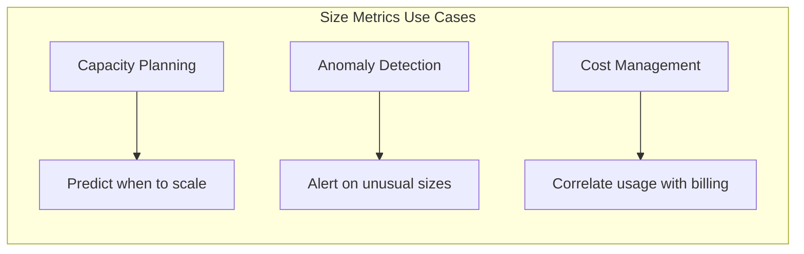
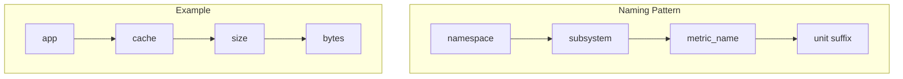
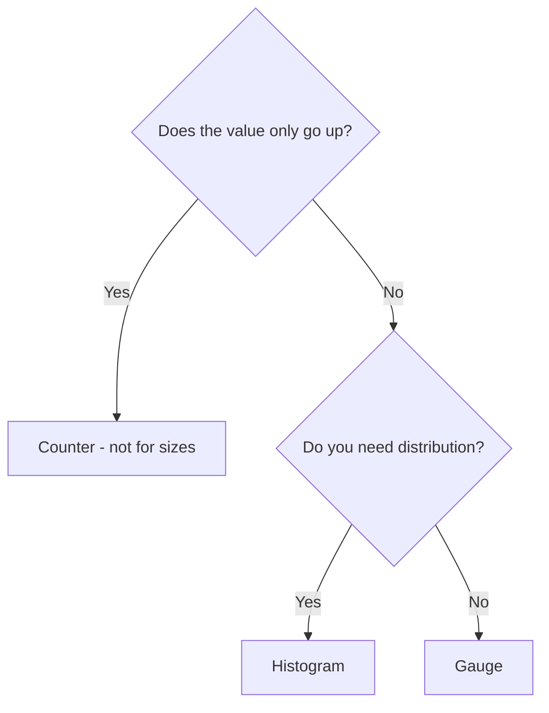
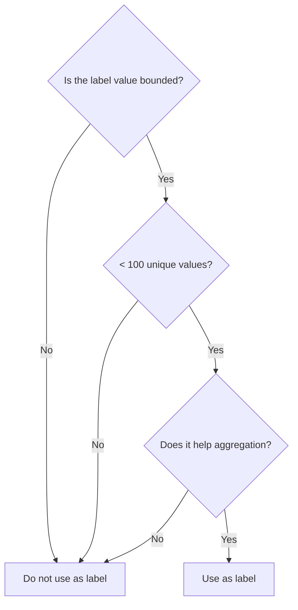
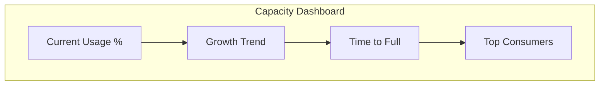
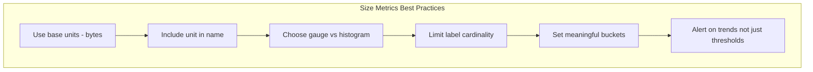

# How to Build Size Metrics

Author: [nawazdhandala](https://github.com/nawazdhandala)

Tags: Observability, Metrics, Monitoring, SRE

Description: Learn how to design and implement size metrics for tracking resource consumption, data volumes, and capacity indicators across your infrastructure.

---

Size metrics answer a fundamental question in infrastructure monitoring: "How big is it?" Whether you are tracking disk usage, memory consumption, queue depths, database sizes, or payload lengths, size metrics help you understand capacity, plan for growth, and detect anomalies before they become outages.

This guide covers how to design, implement, and instrument size metrics using OpenTelemetry and Prometheus conventions. You will learn naming patterns, unit handling, label strategies, and production-ready code examples.

## Why Size Metrics Matter

Size metrics serve three critical purposes in observability:

**Capacity planning**: Knowing how fast your database grows helps you budget for storage. Understanding memory consumption patterns helps you right-size containers.

**Anomaly detection**: A sudden spike in request payload size might indicate a bug or abuse. A queue that keeps growing suggests consumers cannot keep up.

**Cost management**: Cloud billing often scales with storage and data transfer. Size metrics help you correlate usage with spend.



## Understanding Size Units

Before building size metrics, you need a consistent approach to units. The observability ecosystem has converged on two standards:

### Base Units

OpenTelemetry and Prometheus recommend using base units for all metrics:

| Measurement | Base Unit | Symbol |
|-------------|-----------|--------|
| Data size | Bytes | `By` |
| Time | Seconds | `s` |
| Requests | Count | `1` |

This means you should store 1 megabyte as `1048576` bytes, not as `1` megabyte. Dashboards and queries can convert to human-readable units at display time.

### Binary vs Decimal Prefixes

Computers use binary prefixes (powers of 1024), while humans often think in decimal prefixes (powers of 1000). Be explicit about which you use:

| Binary Prefix | Value | Decimal Prefix | Value |
|---------------|-------|----------------|-------|
| KiB (kibibyte) | 1024 bytes | KB (kilobyte) | 1000 bytes |
| MiB (mebibyte) | 1024 KiB | MB (megabyte) | 1000 KB |
| GiB (gibibyte) | 1024 MiB | GB (gigabyte) | 1000 MB |
| TiB (tebibyte) | 1024 GiB | TB (terabyte) | 1000 GB |

For infrastructure metrics, binary prefixes match how operating systems report sizes. For network metrics, decimal prefixes often align better with how providers bill.

## Metric Naming Conventions

Good names make metrics discoverable and understandable. Follow these patterns:



### Naming Rules

1. **Use snake_case**: Separate words with underscores, not dots or camelCase
2. **Include the unit as a suffix**: `_bytes`, `_seconds`, `_total`
3. **Be specific about what is measured**: `request_body_size_bytes` not just `size_bytes`
4. **Use namespaces to avoid collisions**: Prefix with your app or service name

### Good vs Bad Names

| Bad Name | Good Name | Why |
|----------|-----------|-----|
| `size` | `http_request_body_size_bytes` | Specific, includes unit |
| `cache.size.mb` | `cache_size_bytes` | Snake case, base unit |
| `queueLength` | `queue_depth_messages` | Snake case, clear unit |
| `db_size` | `database_table_size_bytes` | Includes unit |
| `memory_mb` | `process_memory_resident_bytes` | Base unit, specific type |

## Choosing the Right Metric Type

Size metrics typically use one of two types:

### Gauge

Use a gauge when the value can go up or down. Most size metrics are gauges:

- Current disk usage
- Current memory consumption
- Current queue depth
- Current cache size

### Histogram

Use a histogram when you want to track the distribution of sizes over time:

- Request payload sizes
- Response body sizes
- Message sizes in a queue
- File sizes being processed



## Implementing Size Metrics in Node.js

Here is a complete example of instrumenting size metrics using OpenTelemetry in a Node.js application.

### Setup

First, install the required packages:

```bash
npm install @opentelemetry/api \
            @opentelemetry/sdk-node \
            @opentelemetry/sdk-metrics \
            @opentelemetry/exporter-prometheus
```

### Basic Configuration

Set up the metrics SDK with a Prometheus exporter:

```typescript
// metrics-setup.ts
// Configures OpenTelemetry metrics with Prometheus exporter for size metrics

import { MeterProvider, PeriodicExportingMetricReader } from '@opentelemetry/sdk-metrics';
import { PrometheusExporter } from '@opentelemetry/exporter-prometheus';
import { Resource } from '@opentelemetry/resources';
import { SemanticResourceAttributes } from '@opentelemetry/semantic-conventions';

// Create Prometheus exporter that exposes /metrics endpoint
const prometheusExporter = new PrometheusExporter({
    port: 9464,
    endpoint: '/metrics',
});

// Configure the meter provider with service metadata
const meterProvider = new MeterProvider({
    resource: new Resource({
        [SemanticResourceAttributes.SERVICE_NAME]: 'my-service',
        [SemanticResourceAttributes.SERVICE_VERSION]: '1.0.0',
    }),
});

// Add the Prometheus reader to export metrics
meterProvider.addMetricReader(prometheusExporter);

// Export the meter for use in other modules
export const meter = meterProvider.getMeter('size-metrics', '1.0.0');
```

### Gauge for Current Sizes

Track current resource sizes with gauges:

```typescript
// size-gauges.ts
// Implements gauge metrics for tracking current resource sizes

import { meter } from './metrics-setup';
import os from 'os';

// Memory usage gauge - tracks process memory in bytes
// Labels: type (heap, rss, external) for different memory categories
const memoryUsageGauge = meter.createObservableGauge('process_memory_bytes', {
    description: 'Current memory usage of the process in bytes',
    unit: 'By',
});

// Register callback that runs on each metrics scrape
memoryUsageGauge.addCallback((observableResult) => {
    const memUsage = process.memoryUsage();

    // Record heap memory - JavaScript objects and data
    observableResult.observe(memUsage.heapUsed, { type: 'heap_used' });
    observableResult.observe(memUsage.heapTotal, { type: 'heap_total' });

    // Record RSS - total memory allocated to the process
    observableResult.observe(memUsage.rss, { type: 'rss' });

    // Record external memory - C++ objects bound to JavaScript
    observableResult.observe(memUsage.external, { type: 'external' });
});

// Disk usage gauge - tracks filesystem size in bytes
// Labels: mountpoint, filesystem type for filtering by volume
const diskUsageGauge = meter.createObservableGauge('disk_usage_bytes', {
    description: 'Current disk usage in bytes',
    unit: 'By',
});

// This example uses a mock - replace with actual disk stats in production
diskUsageGauge.addCallback(async (observableResult) => {
    // In production, use a library like 'check-disk-space' or read from /proc
    // This demonstrates the pattern with mock data
    const mockDiskStats = {
        total: 500 * 1024 * 1024 * 1024,  // 500 GiB total
        used: 200 * 1024 * 1024 * 1024,   // 200 GiB used
        free: 300 * 1024 * 1024 * 1024,   // 300 GiB free
    };

    observableResult.observe(mockDiskStats.total, {
        mountpoint: '/',
        state: 'total'
    });
    observableResult.observe(mockDiskStats.used, {
        mountpoint: '/',
        state: 'used'
    });
    observableResult.observe(mockDiskStats.free, {
        mountpoint: '/',
        state: 'free'
    });
});

// Cache size gauge - tracks in-memory cache size
// Useful for monitoring memory pressure from caching
const cacheSizeGauge = meter.createObservableGauge('cache_size_bytes', {
    description: 'Current size of in-memory cache in bytes',
    unit: 'By',
});

// Example: Track a Map-based cache
const cache = new Map<string, Buffer>();

cacheSizeGauge.addCallback((observableResult) => {
    let totalSize = 0;
    for (const value of cache.values()) {
        totalSize += value.byteLength;
    }
    observableResult.observe(totalSize, { cache_name: 'primary' });
});

export { cache };
```

### Histogram for Size Distributions

Track size distributions to understand patterns:

```typescript
// size-histograms.ts
// Implements histogram metrics for tracking size distributions

import { meter } from './metrics-setup';

// Define bucket boundaries for different size ranges
// These boundaries should match your expected data patterns

// For HTTP request/response bodies (bytes)
// Covers: tiny (< 1KB), small (1-10KB), medium (10KB-1MB), large (1MB+)
const httpSizeBuckets = [
    100,          // 100 B
    1024,         // 1 KiB
    10240,        // 10 KiB
    102400,       // 100 KiB
    1048576,      // 1 MiB
    10485760,     // 10 MiB
    104857600,    // 100 MiB
];

// Request body size histogram
// Tracks the distribution of incoming request payload sizes
const requestBodySizeHistogram = meter.createHistogram('http_request_body_size_bytes', {
    description: 'Size of HTTP request bodies in bytes',
    unit: 'By',
    advice: {
        explicitBucketBoundaries: httpSizeBuckets,
    },
});

// Response body size histogram
// Tracks the distribution of outgoing response payload sizes
const responseBodySizeHistogram = meter.createHistogram('http_response_body_size_bytes', {
    description: 'Size of HTTP response bodies in bytes',
    unit: 'By',
    advice: {
        explicitBucketBoundaries: httpSizeBuckets,
    },
});

// Database query result size histogram
// Helps identify queries returning too much data
const queryResultSizeHistogram = meter.createHistogram('db_query_result_size_bytes', {
    description: 'Size of database query results in bytes',
    unit: 'By',
    advice: {
        explicitBucketBoundaries: httpSizeBuckets,
    },
});

// Export recording functions for use in middleware
export function recordRequestSize(sizeBytes: number, labels: Record<string, string>) {
    requestBodySizeHistogram.record(sizeBytes, labels);
}

export function recordResponseSize(sizeBytes: number, labels: Record<string, string>) {
    responseBodySizeHistogram.record(sizeBytes, labels);
}

export function recordQueryResultSize(sizeBytes: number, labels: Record<string, string>) {
    queryResultSizeHistogram.record(sizeBytes, labels);
}
```

### Express Middleware for HTTP Size Metrics

Integrate size tracking into your HTTP layer:

```typescript
// size-middleware.ts
// Express middleware that records request and response size metrics

import { Request, Response, NextFunction } from 'express';
import { recordRequestSize, recordResponseSize } from './size-histograms';

// Middleware to track HTTP body sizes
export function sizeMetricsMiddleware(req: Request, res: Response, next: NextFunction) {
    // Record request body size
    // content-length header gives us the size without reading the body
    const requestSize = parseInt(req.headers['content-length'] || '0', 10);

    // Common labels for both request and response
    const labels = {
        method: req.method,
        route: req.route?.path || req.path,
        content_type: req.headers['content-type'] || 'unknown',
    };

    // Record request size immediately
    if (requestSize > 0) {
        recordRequestSize(requestSize, labels);
    }

    // Intercept response to capture size
    // Store original write and end methods
    const originalWrite = res.write.bind(res);
    const originalEnd = res.end.bind(res);

    let responseSize = 0;
    const chunks: Buffer[] = [];

    // Override write to accumulate response size
    res.write = function(chunk: any, ...args: any[]): boolean {
        if (chunk) {
            const buffer = Buffer.isBuffer(chunk) ? chunk : Buffer.from(chunk);
            responseSize += buffer.byteLength;
            chunks.push(buffer);
        }
        return originalWrite(chunk, ...args);
    };

    // Override end to record final size and restore methods
    res.end = function(chunk?: any, ...args: any[]): Response {
        if (chunk) {
            const buffer = Buffer.isBuffer(chunk) ? chunk : Buffer.from(chunk);
            responseSize += buffer.byteLength;
        }

        // Record the response size with status code
        recordResponseSize(responseSize, {
            ...labels,
            status_code: res.statusCode.toString(),
        });

        return originalEnd(chunk, ...args);
    };

    next();
}
```

### Complete Application Example

Here is a full application demonstrating all size metrics:

```typescript
// app.ts
// Complete Express application with size metrics instrumentation

import express from 'express';
import { meter } from './metrics-setup';
import { sizeMetricsMiddleware } from './size-middleware';
import { cache } from './size-gauges';
import { recordQueryResultSize } from './size-histograms';

const app = express();

// Parse JSON bodies - needed to access request body
app.use(express.json({ limit: '10mb' }));

// Apply size metrics middleware to all routes
app.use(sizeMetricsMiddleware);

// Queue depth gauge - demonstrates tracking queue sizes
const queueDepthGauge = meter.createObservableGauge('queue_depth_messages', {
    description: 'Number of messages waiting in the queue',
    unit: '1',
});

const queueSizeGauge = meter.createObservableGauge('queue_size_bytes', {
    description: 'Total size of messages in the queue in bytes',
    unit: 'By',
});

// Mock queue for demonstration
interface QueueMessage {
    id: string;
    payload: Buffer;
    timestamp: number;
}

const messageQueue: QueueMessage[] = [];

// Register queue metrics callbacks
queueDepthGauge.addCallback((result) => {
    result.observe(messageQueue.length, { queue_name: 'orders' });
});

queueSizeGauge.addCallback((result) => {
    const totalSize = messageQueue.reduce((sum, msg) => sum + msg.payload.byteLength, 0);
    result.observe(totalSize, { queue_name: 'orders' });
});

// API endpoint that generates data - useful for testing
app.post('/api/data', (req, res) => {
    // Simulate processing and caching
    const key = req.body.key || 'default';
    const data = Buffer.from(JSON.stringify(req.body));

    // Store in cache
    cache.set(key, data);

    // Simulate adding to queue
    messageQueue.push({
        id: key,
        payload: data,
        timestamp: Date.now(),
    });

    res.json({
        status: 'ok',
        cached_size_bytes: data.byteLength,
        queue_depth: messageQueue.length,
    });
});

// API endpoint demonstrating database result size tracking
app.get('/api/users', async (req, res) => {
    // Simulate database query
    const users = [
        { id: 1, name: 'Alice', email: 'alice@example.com' },
        { id: 2, name: 'Bob', email: 'bob@example.com' },
    ];

    const resultJson = JSON.stringify(users);
    const resultSize = Buffer.byteLength(resultJson, 'utf8');

    // Record the query result size
    recordQueryResultSize(resultSize, {
        query_type: 'select',
        table: 'users',
    });

    res.json(users);
});

app.listen(3000, () => {
    console.log('Server running on port 3000');
    console.log('Metrics available at http://localhost:9464/metrics');
});
```

## Implementing Size Metrics in Python

Here is the equivalent implementation for Python applications using OpenTelemetry:

```python
# size_metrics.py
# Size metrics implementation for Python applications

from opentelemetry import metrics
from opentelemetry.sdk.metrics import MeterProvider
from opentelemetry.sdk.metrics.export import PeriodicExportingMetricReader
from opentelemetry.exporter.prometheus import PrometheusMetricReader
from opentelemetry.sdk.resources import Resource, SERVICE_NAME
from prometheus_client import start_http_server
import psutil
import os

# Configure the meter provider
resource = Resource(attributes={
    SERVICE_NAME: "python-service"
})

# Create Prometheus reader - exposes metrics at /metrics
prometheus_reader = PrometheusMetricReader()

provider = MeterProvider(
    resource=resource,
    metric_readers=[prometheus_reader]
)

# Set the global meter provider
metrics.set_meter_provider(provider)

# Create a meter for size metrics
meter = metrics.get_meter("size-metrics", "1.0.0")

# Define histogram bucket boundaries for size distributions
# Covers: 100B, 1KB, 10KB, 100KB, 1MB, 10MB, 100MB
SIZE_BUCKETS = [100, 1024, 10240, 102400, 1048576, 10485760, 104857600]


def create_memory_gauge():
    """
    Creates an observable gauge for process memory metrics.
    Uses psutil to get accurate memory information.
    """
    def callback(options):
        process = psutil.Process(os.getpid())
        mem_info = process.memory_info()

        # Yield multiple observations with different labels
        yield metrics.Observation(mem_info.rss, {"type": "rss"})
        yield metrics.Observation(mem_info.vms, {"type": "vms"})

        # If available, also track shared memory
        if hasattr(mem_info, 'shared'):
            yield metrics.Observation(mem_info.shared, {"type": "shared"})

    return meter.create_observable_gauge(
        name="process_memory_bytes",
        description="Current memory usage of the process in bytes",
        unit="By",
        callbacks=[callback]
    )


def create_disk_gauge():
    """
    Creates an observable gauge for disk usage metrics.
    Tracks total, used, and free space for each mountpoint.
    """
    def callback(options):
        # Get all disk partitions
        partitions = psutil.disk_partitions()

        for partition in partitions:
            try:
                usage = psutil.disk_usage(partition.mountpoint)

                # Emit metrics for each state
                yield metrics.Observation(
                    usage.total,
                    {"mountpoint": partition.mountpoint, "state": "total"}
                )
                yield metrics.Observation(
                    usage.used,
                    {"mountpoint": partition.mountpoint, "state": "used"}
                )
                yield metrics.Observation(
                    usage.free,
                    {"mountpoint": partition.mountpoint, "state": "free"}
                )
            except PermissionError:
                # Skip partitions we cannot access
                continue

    return meter.create_observable_gauge(
        name="disk_usage_bytes",
        description="Disk usage in bytes per mountpoint",
        unit="By",
        callbacks=[callback]
    )


# Create histogram for request body sizes
request_body_histogram = meter.create_histogram(
    name="http_request_body_size_bytes",
    description="Size of HTTP request bodies in bytes",
    unit="By",
)

# Create histogram for response body sizes
response_body_histogram = meter.create_histogram(
    name="http_response_body_size_bytes",
    description="Size of HTTP response bodies in bytes",
    unit="By",
)


def record_request_size(size_bytes: int, method: str, route: str, content_type: str = "unknown"):
    """
    Records the size of an HTTP request body.
    Call this from your web framework middleware.

    Args:
        size_bytes: Size of the request body in bytes
        method: HTTP method (GET, POST, etc.)
        route: The route pattern (not the full URL with parameters)
        content_type: Content-Type header value
    """
    request_body_histogram.record(
        size_bytes,
        attributes={
            "method": method,
            "route": route,
            "content_type": content_type,
        }
    )


def record_response_size(size_bytes: int, method: str, route: str, status_code: int):
    """
    Records the size of an HTTP response body.
    Call this from your web framework middleware.

    Args:
        size_bytes: Size of the response body in bytes
        method: HTTP method
        route: The route pattern
        status_code: HTTP status code
    """
    response_body_histogram.record(
        size_bytes,
        attributes={
            "method": method,
            "route": route,
            "status_code": str(status_code),
        }
    )


# Initialize gauges when module loads
memory_gauge = create_memory_gauge()
disk_gauge = create_disk_gauge()


if __name__ == "__main__":
    # Start Prometheus HTTP server for metrics scraping
    start_http_server(9464)
    print("Metrics available at http://localhost:9464/metrics")

    # Keep the process running
    import time
    while True:
        time.sleep(1)
```

### FastAPI Middleware Example

```python
# fastapi_size_middleware.py
# Middleware for tracking HTTP body sizes in FastAPI

from fastapi import FastAPI, Request, Response
from starlette.middleware.base import BaseHTTPMiddleware
from starlette.routing import Match
from size_metrics import record_request_size, record_response_size
import time

app = FastAPI()


class SizeMetricsMiddleware(BaseHTTPMiddleware):
    """
    Middleware that records request and response body sizes.
    Extracts route pattern for low-cardinality labels.
    """

    async def dispatch(self, request: Request, call_next):
        # Get the route pattern (not the actual URL with parameters)
        route = self._get_route_pattern(request)
        method = request.method
        content_type = request.headers.get("content-type", "unknown")

        # Get request body size from Content-Length header
        request_size = int(request.headers.get("content-length", 0))

        if request_size > 0:
            record_request_size(
                size_bytes=request_size,
                method=method,
                route=route,
                content_type=content_type
            )

        # Call the next middleware/route handler
        response = await call_next(request)

        # Get response body size
        # Note: This requires buffering the response
        response_body = b""
        async for chunk in response.body_iterator:
            response_body += chunk

        response_size = len(response_body)

        record_response_size(
            size_bytes=response_size,
            method=method,
            route=route,
            status_code=response.status_code
        )

        # Return a new response with the buffered body
        return Response(
            content=response_body,
            status_code=response.status_code,
            headers=dict(response.headers),
            media_type=response.media_type
        )

    def _get_route_pattern(self, request: Request) -> str:
        """
        Extracts the route pattern from the request.
        Returns '/unknown' if the route cannot be determined.
        """
        for route in request.app.routes:
            match, scope = route.matches(request.scope)
            if match == Match.FULL:
                return route.path
        return "/unknown"


# Apply the middleware
app.add_middleware(SizeMetricsMiddleware)


@app.post("/api/data")
async def create_data(request: Request):
    """Example endpoint that accepts JSON data."""
    body = await request.json()
    return {"status": "ok", "received_keys": list(body.keys())}


@app.get("/api/users/{user_id}")
async def get_user(user_id: int):
    """Example endpoint with path parameter."""
    return {
        "id": user_id,
        "name": "Example User",
        "email": "user@example.com"
    }
```

## Label Strategy for Size Metrics

Labels add dimensions to your metrics, but too many labels cause cardinality explosion. Here is a balanced approach:

### Recommended Labels

| Label | Use Case | Example Values |
|-------|----------|----------------|
| `type` | Distinguish size categories | `heap`, `rss`, `disk` |
| `state` | Track different states | `used`, `free`, `total` |
| `name` | Identify specific resources | `primary_cache`, `orders_queue` |
| `mountpoint` | Disk-specific | `/`, `/data`, `/var` |

### Labels to Avoid

High-cardinality labels destroy metric performance:

| Avoid | Why | Alternative |
|-------|-----|-------------|
| `user_id` | Unbounded cardinality | Track in traces/logs |
| `request_id` | Unique per request | Use trace correlation |
| `timestamp` | Infinite values | Metrics have timestamps |
| `file_path` | Too many unique values | Use directory or pattern |



## Alerting on Size Metrics

Size metrics enable powerful alerting rules. Here are patterns that work:

### Threshold Alerts

Alert when sizes exceed safe limits:

```yaml
# Prometheus alerting rules for size metrics

groups:
  - name: size_alerts
    rules:
      # Alert when disk usage exceeds 80%
      - alert: DiskUsageHigh
        expr: |
          (disk_usage_bytes{state="used"} / disk_usage_bytes{state="total"}) > 0.8
        for: 5m
        labels:
          severity: warning
        annotations:
          summary: "Disk usage above 80% on {{ $labels.mountpoint }}"
          description: "Current usage is {{ $value | humanizePercentage }}"

      # Alert when disk usage exceeds 90%
      - alert: DiskUsageCritical
        expr: |
          (disk_usage_bytes{state="used"} / disk_usage_bytes{state="total"}) > 0.9
        for: 5m
        labels:
          severity: critical
        annotations:
          summary: "Disk usage above 90% on {{ $labels.mountpoint }}"

      # Alert when heap memory exceeds container limit
      - alert: HeapMemoryHigh
        expr: |
          process_memory_bytes{type="heap_used"} > 1073741824
        for: 10m
        labels:
          severity: warning
        annotations:
          summary: "Heap memory exceeds 1GiB"
```

### Growth Rate Alerts

Detect unusual growth patterns:

```yaml
groups:
  - name: size_growth_alerts
    rules:
      # Alert when disk is filling faster than expected
      - alert: DiskFillingFast
        expr: |
          predict_linear(disk_usage_bytes{state="used"}[6h], 24 * 3600) >
          disk_usage_bytes{state="total"}
        for: 30m
        labels:
          severity: warning
        annotations:
          summary: "Disk {{ $labels.mountpoint }} predicted to fill within 24 hours"

      # Alert when queue is growing without being consumed
      - alert: QueueBacklog
        expr: |
          increase(queue_size_bytes[1h]) > 104857600
          and
          rate(queue_size_bytes[5m]) > 0
        for: 15m
        labels:
          severity: warning
        annotations:
          summary: "Queue {{ $labels.queue_name }} growing steadily"
```

### Anomaly Detection

Use statistical methods to detect unusual sizes:

```yaml
groups:
  - name: size_anomaly_alerts
    rules:
      # Alert when request sizes deviate from normal
      - alert: UnusualRequestSize
        expr: |
          histogram_quantile(0.99, rate(http_request_body_size_bytes_bucket[5m])) >
          2 * histogram_quantile(0.99, rate(http_request_body_size_bytes_bucket[24h]))
        for: 10m
        labels:
          severity: info
        annotations:
          summary: "Request body sizes are 2x larger than usual"
```

## Dashboard Patterns

Effective dashboards for size metrics follow these patterns:

### Capacity Overview



Key panels:
1. **Current usage percentage**: Gauge showing used/total
2. **Usage over time**: Line chart with used, free, total
3. **Growth rate**: Derivative of used over 7 days
4. **Predicted time to full**: Based on linear regression

### Size Distribution Analysis

For histogram metrics, show:
1. **P50, P95, P99 percentiles**: Track typical and extreme sizes
2. **Distribution heatmap**: Show how sizes change over time
3. **Bucket breakdown**: Pie chart of size categories

### Query Examples

Here are useful PromQL queries for size metrics:

```promql
# Current disk usage percentage
disk_usage_bytes{state="used"} / disk_usage_bytes{state="total"} * 100

# Memory usage trend over 24 hours
rate(process_memory_bytes{type="heap_used"}[24h])

# 95th percentile request body size
histogram_quantile(0.95, rate(http_request_body_size_bytes_bucket[5m]))

# Average response size by route
sum(rate(http_response_body_size_bytes_sum[5m])) by (route) /
sum(rate(http_response_body_size_bytes_count[5m])) by (route)

# Queue depth change over 1 hour
delta(queue_depth_messages[1h])

# Disk space remaining in human-readable format (for alerting)
disk_usage_bytes{state="free"} / 1073741824  # Result in GiB
```

## Conversion Utilities

Helper functions for size conversions:

```typescript
// size-utils.ts
// Utility functions for size metric conversions

/**
 * Converts bytes to human-readable format using binary prefixes.
 * Use for display purposes only - store and transmit raw bytes.
 */
export function bytesToHuman(bytes: number): string {
    const units = ['B', 'KiB', 'MiB', 'GiB', 'TiB', 'PiB'];
    let unitIndex = 0;
    let size = bytes;

    while (size >= 1024 && unitIndex < units.length - 1) {
        size /= 1024;
        unitIndex++;
    }

    return `${size.toFixed(2)} ${units[unitIndex]}`;
}

/**
 * Parses human-readable size string to bytes.
 * Supports both binary (KiB, MiB) and decimal (KB, MB) prefixes.
 */
export function humanToBytes(sizeStr: string): number {
    const match = sizeStr.match(/^([\d.]+)\s*(B|KB|KiB|MB|MiB|GB|GiB|TB|TiB)?$/i);
    if (!match) {
        throw new Error(`Invalid size string: ${sizeStr}`);
    }

    const value = parseFloat(match[1]);
    const unit = (match[2] || 'B').toUpperCase();

    const multipliers: Record<string, number> = {
        'B': 1,
        'KB': 1000,
        'KIB': 1024,
        'MB': 1000 * 1000,
        'MIB': 1024 * 1024,
        'GB': 1000 * 1000 * 1000,
        'GIB': 1024 * 1024 * 1024,
        'TB': 1000 * 1000 * 1000 * 1000,
        'TIB': 1024 * 1024 * 1024 * 1024,
    };

    return value * (multipliers[unit] || 1);
}

/**
 * Calculates the percentage of used space.
 * Returns a value between 0 and 100.
 */
export function usagePercentage(used: number, total: number): number {
    if (total === 0) return 0;
    return (used / total) * 100;
}

/**
 * Estimates time until full based on current growth rate.
 * Returns seconds until full, or Infinity if not growing.
 */
export function timeToFull(
    currentUsed: number,
    total: number,
    growthRatePerSecond: number
): number {
    if (growthRatePerSecond <= 0) return Infinity;

    const remaining = total - currentUsed;
    return remaining / growthRatePerSecond;
}
```

## Best Practices Summary



1. **Always use bytes as the base unit** - Convert at display time
2. **Include the unit suffix in metric names** - `_bytes`, `_messages`
3. **Use gauges for current values, histograms for distributions**
4. **Keep label cardinality low** - Aim for under 100 unique combinations
5. **Set histogram buckets based on your data** - Match expected ranges
6. **Alert on growth rates, not just thresholds** - Catch problems early
7. **Document what each metric measures** - Use the description field
8. **Test your metrics under load** - Verify they work at scale

## Connecting Size Metrics to OneUptime

OneUptime accepts OpenTelemetry metrics natively. Configure your exporter to send size metrics:

```typescript
// oneuptime-export.ts
// Configures OpenTelemetry to export metrics to OneUptime

import { OTLPMetricExporter } from '@opentelemetry/exporter-metrics-otlp-http';
import { PeriodicExportingMetricReader } from '@opentelemetry/sdk-metrics';

const otlpExporter = new OTLPMetricExporter({
    url: process.env.ONEUPTIME_OTLP_ENDPOINT || 'https://otlp.oneuptime.com/v1/metrics',
    headers: {
        'x-oneuptime-token': process.env.ONEUPTIME_TOKEN || '',
    },
});

const metricReader = new PeriodicExportingMetricReader({
    exporter: otlpExporter,
    exportIntervalMillis: 60000,  // Export every 60 seconds
});

// Add this reader to your MeterProvider configuration
```

Once your metrics flow into OneUptime, you can:
- Create dashboards for capacity monitoring
- Set up alerts based on size thresholds
- Correlate size metrics with traces during incidents
- Track size trends over time for capacity planning

Size metrics form the foundation of capacity management. Start with the basics - disk, memory, queue depths - then expand to application-specific sizes like cache entries, payload sizes, and database tables. The investment in proper instrumentation pays dividends in reduced outages and better resource utilization.

**Related Reading:**

- [18 SRE Metrics Worth Tracking](https://oneuptime.com/blog/post/2025-11-28-sre-metrics-to-track/view)
- [Logs, Metrics and Traces: Three Pillars of Observability](https://oneuptime.com/blog/post/2025-08-20-three-pillars-of-observability-logs-metrics-traces/view)
- [What are Metrics in OpenTelemetry](https://oneuptime.com/blog/post/2025-08-26-what-are-metrics-in-opentelemetry/view)
