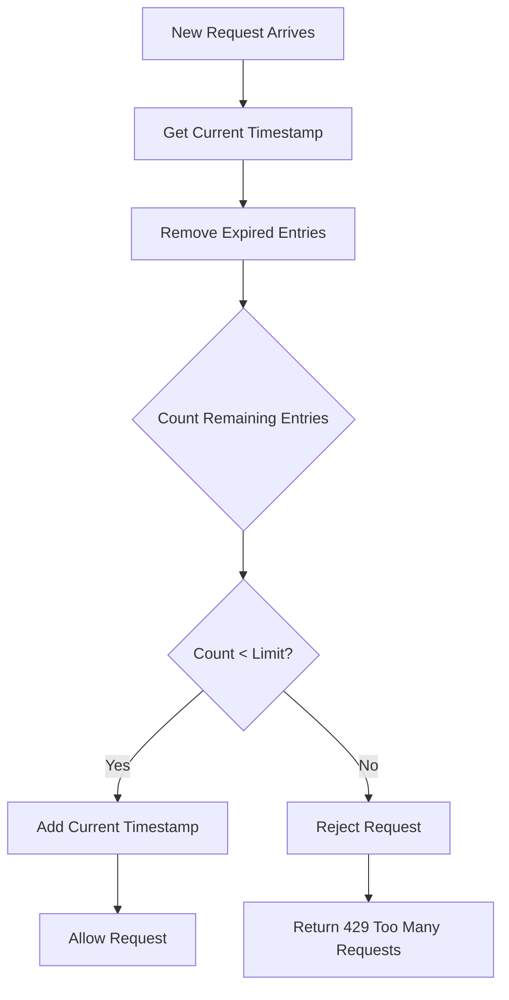
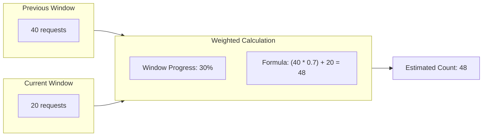

# How to Build Sliding Window Rate Limiting

Author: [nawazdhandala](https://github.com/nawazdhandala)

Tags: Rate Limiting, API Gateway, Algorithms, Backend

Description: Learn how to implement sliding window rate limiting for smooth request distribution.

---

Rate limiting is essential for protecting APIs from abuse and ensuring fair resource allocation. While fixed window rate limiting is simple to implement, it suffers from the "boundary problem" where traffic can spike at window edges. Sliding window rate limiting solves this by providing smoother request distribution. In this post, we will explore two sliding window approaches and implement them using Redis.

## Why Sliding Window?

Before diving into sliding window algorithms, let us understand why fixed window rate limiting falls short.

### The Fixed Window Problem

With fixed window rate limiting, if you allow 100 requests per minute, a client could make 100 requests at 11:59:59 and another 100 requests at 12:00:01. This results in 200 requests within 2 seconds, defeating the purpose of rate limiting.

```mermaid
gantt
    title Fixed Window Boundary Problem
    dateFormat HH:mm:ss
    axisFormat %H:%M:%S

    section Window 1
    100 requests allowed    :done, 11:59:00, 60s

    section Window 2
    100 requests allowed    :done, 12:00:00, 60s

    section Spike Zone
    200 requests in 2 sec   :crit, 11:59:59, 2s
```



Sliding window algorithms eliminate this problem by considering a continuously moving time frame.

## Two Approaches to Sliding Window

There are two main approaches to implementing sliding window rate limiting:

1. **Sliding Window Log** - Stores timestamps of all requests
2. **Sliding Window Counter** - Uses weighted counters from adjacent windows

Let us examine each approach in detail.

## Sliding Window Log Algorithm

The sliding window log algorithm maintains a log of timestamps for each request. When a new request arrives, we remove expired entries and count the remaining ones.

### How It Works



### Implementation with Redis Sorted Sets

Redis sorted sets are perfect for this algorithm. We use the timestamp as both the score and the member, allowing efficient range queries and automatic ordering.

```python
import time
import redis

class SlidingWindowLog:
    """
    Sliding Window Log rate limiter using Redis sorted sets.

    This implementation stores each request timestamp in a sorted set,
    allowing precise rate limiting but with higher memory usage.
    """

    def __init__(self, redis_client: redis.Redis, limit: int, window_seconds: int):
        """
        Initialize the rate limiter.

        Args:
            redis_client: Redis connection instance
            limit: Maximum number of requests allowed in the window
            window_seconds: Size of the sliding window in seconds
        """
        self.redis = redis_client
        self.limit = limit
        self.window_seconds = window_seconds

    def is_allowed(self, client_id: str) -> bool:
        """
        Check if a request from the given client should be allowed.

        Args:
            client_id: Unique identifier for the client (e.g., IP address, API key)

        Returns:
            True if the request is allowed, False otherwise
        """
        # Generate a unique key for this client's request log
        key = f"rate_limit:sliding_log:{client_id}"

        # Get current timestamp in milliseconds for precision
        now = time.time()

        # Calculate the start of our sliding window
        window_start = now - self.window_seconds

        # Use Redis pipeline for atomic operations
        pipe = self.redis.pipeline()

        # Step 1: Remove all entries older than our window
        # ZREMRANGEBYSCORE removes entries with scores less than window_start
        pipe.zremrangebyscore(key, 0, window_start)

        # Step 2: Count remaining entries in the window
        pipe.zcard(key)

        # Execute the pipeline
        results = pipe.execute()
        current_count = results[1]

        # Step 3: Check if we are under the limit
        if current_count < self.limit:
            # Add the current request timestamp
            # Using timestamp as both score and member ensures uniqueness
            # Adding a small random component handles concurrent requests
            pipe = self.redis.pipeline()
            pipe.zadd(key, {f"{now}": now})

            # Set expiration to clean up abandoned keys
            pipe.expire(key, self.window_seconds + 1)
            pipe.execute()

            return True

        return False

    def get_remaining(self, client_id: str) -> int:
        """
        Get the number of remaining requests allowed for this client.

        Args:
            client_id: Unique identifier for the client

        Returns:
            Number of requests remaining in the current window
        """
        key = f"rate_limit:sliding_log:{client_id}"
        now = time.time()
        window_start = now - self.window_seconds

        # Remove expired entries and count
        pipe = self.redis.pipeline()
        pipe.zremrangebyscore(key, 0, window_start)
        pipe.zcard(key)
        results = pipe.execute()

        current_count = results[1]
        return max(0, self.limit - current_count)


# Example usage
if __name__ == "__main__":
    # Connect to Redis
    redis_client = redis.Redis(host='localhost', port=6379, db=0)

    # Create a rate limiter: 10 requests per 60 seconds
    limiter = SlidingWindowLog(redis_client, limit=10, window_seconds=60)

    # Check if a request is allowed
    client_ip = "192.168.1.100"

    if limiter.is_allowed(client_ip):
        print("Request allowed")
        print(f"Remaining requests: {limiter.get_remaining(client_ip)}")
    else:
        print("Rate limit exceeded")
```

### Pros and Cons of Sliding Window Log

**Advantages:**
- Precise rate limiting with no boundary issues
- Simple to understand and implement
- Exact count of requests in the window

**Disadvantages:**
- High memory usage for high traffic APIs
- Each request requires storing a timestamp
- Memory grows linearly with request volume

## Sliding Window Counter Algorithm

The sliding window counter is a hybrid approach that combines the low memory footprint of fixed windows with the smoothness of sliding windows. It uses weighted averages from two adjacent fixed windows.

### How It Works



The formula is:

```
estimated_count = (previous_window_count * (1 - window_progress)) + current_window_count
```

Where `window_progress` is how far we are into the current window (0 to 1).

### Implementation with Redis

```python
import time
import redis
from typing import Tuple

class SlidingWindowCounter:
    """
    Sliding Window Counter rate limiter using Redis.

    This implementation uses weighted averages from adjacent fixed windows,
    providing a good balance between accuracy and memory efficiency.
    """

    def __init__(self, redis_client: redis.Redis, limit: int, window_seconds: int):
        """
        Initialize the rate limiter.

        Args:
            redis_client: Redis connection instance
            limit: Maximum number of requests allowed in the window
            window_seconds: Size of the sliding window in seconds
        """
        self.redis = redis_client
        self.limit = limit
        self.window_seconds = window_seconds

    def _get_window_keys(self, client_id: str, now: float) -> Tuple[str, str, float]:
        """
        Calculate the keys for current and previous windows.

        Args:
            client_id: Unique identifier for the client
            now: Current timestamp

        Returns:
            Tuple of (current_window_key, previous_window_key, window_progress)
        """
        # Calculate which fixed window we are in
        current_window = int(now // self.window_seconds)
        previous_window = current_window - 1

        # Calculate how far into the current window we are (0 to 1)
        window_progress = (now % self.window_seconds) / self.window_seconds

        # Generate Redis keys
        current_key = f"rate_limit:counter:{client_id}:{current_window}"
        previous_key = f"rate_limit:counter:{client_id}:{previous_window}"

        return current_key, previous_key, window_progress

    def is_allowed(self, client_id: str) -> bool:
        """
        Check if a request from the given client should be allowed.

        Args:
            client_id: Unique identifier for the client

        Returns:
            True if the request is allowed, False otherwise
        """
        now = time.time()
        current_key, previous_key, window_progress = self._get_window_keys(client_id, now)

        # Get counts from both windows
        pipe = self.redis.pipeline()
        pipe.get(current_key)
        pipe.get(previous_key)
        results = pipe.execute()

        # Parse counts (default to 0 if key does not exist)
        current_count = int(results[0] or 0)
        previous_count = int(results[1] or 0)

        # Calculate weighted count using the sliding window formula
        # The weight for previous window decreases as we progress through current window
        previous_weight = 1 - window_progress
        estimated_count = (previous_count * previous_weight) + current_count

        # Check if we are under the limit
        if estimated_count < self.limit:
            # Increment the current window counter
            pipe = self.redis.pipeline()
            pipe.incr(current_key)

            # Set expiration to 2 windows (current + next) to ensure cleanup
            # This allows the key to exist for the next window's calculation
            pipe.expire(current_key, self.window_seconds * 2)
            pipe.execute()

            return True

        return False

    def get_remaining(self, client_id: str) -> int:
        """
        Get the estimated number of remaining requests.

        Args:
            client_id: Unique identifier for the client

        Returns:
            Estimated number of requests remaining
        """
        now = time.time()
        current_key, previous_key, window_progress = self._get_window_keys(client_id, now)

        pipe = self.redis.pipeline()
        pipe.get(current_key)
        pipe.get(previous_key)
        results = pipe.execute()

        current_count = int(results[0] or 0)
        previous_count = int(results[1] or 0)

        previous_weight = 1 - window_progress
        estimated_count = (previous_count * previous_weight) + current_count

        return max(0, int(self.limit - estimated_count))

    def get_reset_time(self, client_id: str) -> float:
        """
        Get the time in seconds until the rate limit resets.

        Args:
            client_id: Unique identifier for the client

        Returns:
            Seconds until the limit resets
        """
        now = time.time()
        # Calculate when the current window ends
        current_window_end = ((now // self.window_seconds) + 1) * self.window_seconds
        return current_window_end - now


# Example usage
if __name__ == "__main__":
    redis_client = redis.Redis(host='localhost', port=6379, db=0)

    # Create a rate limiter: 100 requests per 60 seconds
    limiter = SlidingWindowCounter(redis_client, limit=100, window_seconds=60)

    client_id = "api_key_123"

    if limiter.is_allowed(client_id):
        print("Request allowed")
        print(f"Remaining: {limiter.get_remaining(client_id)}")
        print(f"Reset in: {limiter.get_reset_time(client_id):.2f} seconds")
    else:
        print("Rate limit exceeded")
```

### Pros and Cons of Sliding Window Counter

**Advantages:**
- Memory efficient (only stores two counters per client)
- Fixed memory usage regardless of request volume
- Good approximation of true sliding window

**Disadvantages:**
- Approximation, not exact counting
- Can allow slightly more requests than the limit in edge cases
- Slightly more complex logic

## Comparison: Log vs Counter

Here is a side by side comparison to help you choose the right approach:

| Aspect | Sliding Window Log | Sliding Window Counter |
|--------|-------------------|----------------------|
| Memory Usage | O(n) per client | O(1) per client |
| Accuracy | Exact | Approximate |
| Best For | Low to medium traffic | High traffic APIs |
| Implementation | Simpler | Slightly complex |
| Redis Commands | ZADD, ZREMRANGEBYSCORE, ZCARD | GET, INCR, EXPIRE |

## Production Considerations

### Adding HTTP Headers

A production rate limiter should include standard HTTP headers:

```python
def get_rate_limit_headers(limiter, client_id: str) -> dict:
    """
    Generate standard rate limit headers for HTTP responses.

    Args:
        limiter: Rate limiter instance
        client_id: Client identifier

    Returns:
        Dictionary of headers to include in the response
    """
    return {
        # Total requests allowed in the window
        "X-RateLimit-Limit": str(limiter.limit),

        # Remaining requests in current window
        "X-RateLimit-Remaining": str(limiter.get_remaining(client_id)),

        # Unix timestamp when the limit resets
        "X-RateLimit-Reset": str(int(time.time() + limiter.get_reset_time(client_id))),

        # Retry after header (useful for 429 responses)
        "Retry-After": str(int(limiter.get_reset_time(client_id)))
    }
```

### Middleware Example (FastAPI)

```python
from fastapi import FastAPI, Request, HTTPException
from fastapi.responses import JSONResponse

app = FastAPI()

# Initialize rate limiter
redis_client = redis.Redis(host='localhost', port=6379, db=0)
rate_limiter = SlidingWindowCounter(redis_client, limit=100, window_seconds=60)

@app.middleware("http")
async def rate_limit_middleware(request: Request, call_next):
    """
    Rate limiting middleware that checks each request.

    Uses the client IP as the identifier. In production, you might
    want to use API keys or user IDs instead.
    """
    # Extract client identifier (IP address in this case)
    client_ip = request.client.host

    # Check rate limit
    if not rate_limiter.is_allowed(client_ip):
        # Return 429 Too Many Requests
        headers = get_rate_limit_headers(rate_limiter, client_ip)
        return JSONResponse(
            status_code=429,
            content={"error": "Rate limit exceeded. Please try again later."},
            headers=headers
        )

    # Process the request
    response = await call_next(request)

    # Add rate limit headers to successful responses
    headers = get_rate_limit_headers(rate_limiter, client_ip)
    for header, value in headers.items():
        response.headers[header] = value

    return response
```

### Handling Redis Failures

In production, you should handle Redis connection failures gracefully:

```python
def is_allowed_with_fallback(self, client_id: str, fail_open: bool = True) -> bool:
    """
    Check rate limit with fallback behavior for Redis failures.

    Args:
        client_id: Client identifier
        fail_open: If True, allow requests when Redis is unavailable
                  If False, reject requests when Redis is unavailable

    Returns:
        True if request is allowed, False otherwise
    """
    try:
        return self.is_allowed(client_id)
    except redis.RedisError as e:
        # Log the error for monitoring
        logger.error(f"Redis error during rate limit check: {e}")

        # Fail open: allow the request (better UX, less protection)
        # Fail closed: reject the request (better protection, worse UX)
        return fail_open
```

## Choosing the Right Algorithm

Use **Sliding Window Log** when:
- You need exact request counts
- Your API has low to medium traffic
- Memory usage is not a concern
- Precision is more important than efficiency

Use **Sliding Window Counter** when:
- You have high traffic APIs
- Memory efficiency is important
- Approximate counting is acceptable
- You need predictable resource usage

## Conclusion

Sliding window rate limiting provides smoother traffic distribution compared to fixed window approaches. The sliding window log offers precision at the cost of memory, while the sliding window counter provides excellent memory efficiency with good approximation. Redis sorted sets and simple counters make implementation straightforward for both approaches.

When implementing rate limiting in production, remember to:
- Include appropriate HTTP headers
- Handle Redis failures gracefully
- Choose the right algorithm based on your traffic patterns
- Monitor and adjust limits based on actual usage

With these implementations, you can protect your APIs while providing a good experience for legitimate users.
