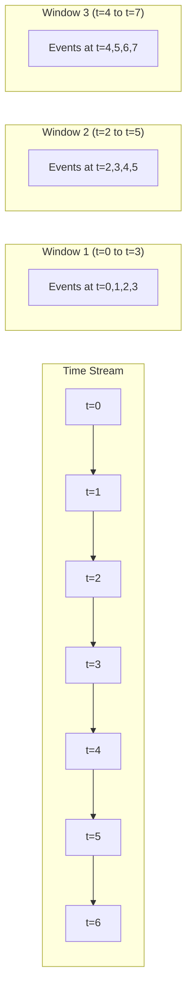

# How to Build Sliding Windows

Author: [nawazdhandala](https://github.com/nawazdhandala)

Tags: Stream Processing, Windowing, Analytics, Data

Description: A practical guide to implementing sliding windows for real-time data aggregation, anomaly detection, and stream processing.

---

You have a stream of events flowing through your system. Maybe it is HTTP requests, sensor readings, stock prices, or user clicks. You need answers to questions like: What is the average response time over the last 5 minutes? How many errors occurred in the past hour? Is traffic spiking right now compared to earlier?

The naive approach is to scan all historical data every time you need an answer. That works until your data grows. Then you are waiting seconds (or worse) for simple queries while your dashboard users stare at spinners.

Sliding windows solve this elegantly. Instead of recomputing from scratch, you maintain a moving view over your data stream that automatically expires old entries and incorporates new ones. Constant memory, predictable performance, real-time answers.

This post covers the core concepts, implementation patterns, and practical code examples for building sliding windows in your applications.

## What is a Sliding Window?

A sliding window is a fixed-size time or count-based buffer that moves forward as new data arrives. Unlike tumbling windows (which reset at fixed intervals), sliding windows overlap and produce continuous results.

```mermaid
gantt
    title Sliding Windows vs Tumbling Windows
    dateFormat X
    axisFormat %s

    section Tumbling
    Window 1    :0, 5
    Window 2    :5, 10
    Window 3    :10, 15

    section Sliding (5s window, 2s slide)
    Window 1    :0, 5
    Window 2    :2, 7
    Window 3    :4, 9
    Window 4    :6, 11
```



Key properties:
- **Window size**: How much data the window contains (e.g., 5 minutes, 100 events)
- **Slide interval**: How often the window advances (e.g., every 30 seconds, every 10 events)
- **Overlap**: When slide < window size, windows overlap and events appear in multiple windows

## The Core Concept: Window Size and Slide Interval

Two parameters define a sliding window:

1. **Window Size (W)**: The duration or count of data points in each window
2. **Slide Interval (S)**: How far the window moves forward

When S < W, windows overlap. When S = W, you get tumbling windows. When S > W, you get gaps (rarely useful).



In this example with W=4 and S=2:
- Window 1 covers t=0 to t=3
- Window 2 covers t=2 to t=5 (overlaps with Window 1 at t=2,3)
- Window 3 covers t=4 to t=7 (overlaps with Window 2 at t=4,5)

## Basic Implementation: Time-Based Sliding Window

Here is a straightforward implementation in TypeScript:

```typescript
interface TimestampedEvent<T> {
  timestamp: number;
  data: T;
}

class SlidingWindow<T> {
  private events: TimestampedEvent<T>[] = [];
  private readonly windowSizeMs: number;

  constructor(windowSizeMs: number) {
    this.windowSizeMs = windowSizeMs;
  }

  add(data: T, timestamp: number = Date.now()): void {
    this.events.push({ timestamp, data });
    this.evictExpired(timestamp);
  }

  private evictExpired(currentTime: number): void {
    const cutoff = currentTime - this.windowSizeMs;
    // Remove events older than the window
    while (this.events.length > 0 && this.events[0].timestamp < cutoff) {
      this.events.shift();
    }
  }

  getEvents(currentTime: number = Date.now()): T[] {
    this.evictExpired(currentTime);
    return this.events.map(e => e.data);
  }

  count(currentTime: number = Date.now()): number {
    this.evictExpired(currentTime);
    return this.events.length;
  }
}

// Usage: 5-minute sliding window
const window = new SlidingWindow<number>(5 * 60 * 1000);

// Add response times
window.add(145);
window.add(89);
window.add(234);

// Get count of events in last 5 minutes
console.log(window.count()); // 3
```

## Efficient Implementation with Ring Buffers

The basic implementation works but has O(n) eviction. For high-throughput systems, use a ring buffer with bucketed timestamps:

```typescript
interface Bucket<T> {
  startTime: number;
  values: T[];
}

class EfficientSlidingWindow<T> {
  private buckets: Map<number, Bucket<T>> = new Map();
  private readonly windowSizeMs: number;
  private readonly bucketSizeMs: number;

  constructor(windowSizeMs: number, bucketSizeMs: number = 1000) {
    this.windowSizeMs = windowSizeMs;
    this.bucketSizeMs = bucketSizeMs;
  }

  private getBucketKey(timestamp: number): number {
    return Math.floor(timestamp / this.bucketSizeMs) * this.bucketSizeMs;
  }

  add(data: T, timestamp: number = Date.now()): void {
    const bucketKey = this.getBucketKey(timestamp);

    if (!this.buckets.has(bucketKey)) {
      this.buckets.set(bucketKey, { startTime: bucketKey, values: [] });
    }

    this.buckets.get(bucketKey)!.values.push(data);
    this.evictOldBuckets(timestamp);
  }

  private evictOldBuckets(currentTime: number): void {
    const cutoff = currentTime - this.windowSizeMs;

    for (const [key, bucket] of this.buckets) {
      if (bucket.startTime + this.bucketSizeMs < cutoff) {
        this.buckets.delete(key);
      }
    }
  }

  aggregate<R>(
    fn: (values: T[]) => R,
    currentTime: number = Date.now()
  ): R {
    this.evictOldBuckets(currentTime);
    const allValues: T[] = [];

    for (const bucket of this.buckets.values()) {
      allValues.push(...bucket.values);
    }

    return fn(allValues);
  }

  // Common aggregations
  sum(currentTime?: number): number {
    return this.aggregate(
      (vals) => (vals as number[]).reduce((a, b) => a + b, 0),
      currentTime
    );
  }

  average(currentTime?: number): number {
    return this.aggregate(
      (vals) => {
        if (vals.length === 0) return 0;
        const sum = (vals as number[]).reduce((a, b) => a + b, 0);
        return sum / vals.length;
      },
      currentTime
    );
  }

  count(currentTime?: number): number {
    return this.aggregate((vals) => vals.length, currentTime);
  }
}
```

## Python Implementation

For Python developers, here is an equivalent implementation:

```python
from collections import defaultdict
from dataclasses import dataclass
from typing import TypeVar, Generic, Callable, List
import time

T = TypeVar('T')

@dataclass
class Bucket(Generic[T]):
    start_time: float
    values: List[T]

class SlidingWindow(Generic[T]):
    def __init__(self, window_size_seconds: float, bucket_size_seconds: float = 1.0):
        self.window_size = window_size_seconds
        self.bucket_size = bucket_size_seconds
        self.buckets: dict[int, Bucket[T]] = {}

    def _get_bucket_key(self, timestamp: float) -> int:
        return int(timestamp // self.bucket_size) * int(self.bucket_size)

    def add(self, data: T, timestamp: float = None) -> None:
        if timestamp is None:
            timestamp = time.time()

        bucket_key = self._get_bucket_key(timestamp)

        if bucket_key not in self.buckets:
            self.buckets[bucket_key] = Bucket(start_time=bucket_key, values=[])

        self.buckets[bucket_key].values.append(data)
        self._evict_old_buckets(timestamp)

    def _evict_old_buckets(self, current_time: float) -> None:
        cutoff = current_time - self.window_size
        keys_to_delete = [
            key for key, bucket in self.buckets.items()
            if bucket.start_time + self.bucket_size < cutoff
        ]
        for key in keys_to_delete:
            del self.buckets[key]

    def aggregate(self, fn: Callable[[List[T]], any], current_time: float = None) -> any:
        if current_time is None:
            current_time = time.time()

        self._evict_old_buckets(current_time)
        all_values = []

        for bucket in self.buckets.values():
            all_values.extend(bucket.values)

        return fn(all_values)

    def count(self, current_time: float = None) -> int:
        return self.aggregate(len, current_time)

    def sum(self, current_time: float = None) -> float:
        return self.aggregate(lambda vals: sum(vals) if vals else 0, current_time)

    def average(self, current_time: float = None) -> float:
        def calc_avg(vals):
            if not vals:
                return 0.0
            return sum(vals) / len(vals)
        return self.aggregate(calc_avg, current_time)


# Usage
window = SlidingWindow[float](window_size_seconds=300)  # 5-minute window

# Add response times
window.add(0.145)
window.add(0.089)
window.add(0.234)

print(f"Count: {window.count()}")      # 3
print(f"Average: {window.average()}")  # 0.156
```

## Handling Overlapping Windows

When you need to emit results at the slide interval (not just on query), use a more structured approach:

```typescript
interface WindowResult<T> {
  windowStart: number;
  windowEnd: number;
  data: T;
}

class OverlappingSlidingWindow<T, R> {
  private events: TimestampedEvent<T>[] = [];
  private readonly windowSizeMs: number;
  private readonly slideIntervalMs: number;
  private lastEmitTime: number = 0;
  private readonly aggregator: (events: T[]) => R;
  private readonly onWindowClose: (result: WindowResult<R>) => void;

  constructor(
    windowSizeMs: number,
    slideIntervalMs: number,
    aggregator: (events: T[]) => R,
    onWindowClose: (result: WindowResult<R>) => void
  ) {
    this.windowSizeMs = windowSizeMs;
    this.slideIntervalMs = slideIntervalMs;
    this.aggregator = aggregator;
    this.onWindowClose = onWindowClose;
  }

  add(data: T, timestamp: number = Date.now()): void {
    this.events.push({ timestamp, data });
    this.processWindows(timestamp);
  }

  private processWindows(currentTime: number): void {
    // Initialize lastEmitTime on first event
    if (this.lastEmitTime === 0) {
      this.lastEmitTime = currentTime;
      return;
    }

    // Check if we should emit new windows
    while (currentTime - this.lastEmitTime >= this.slideIntervalMs) {
      const windowEnd = this.lastEmitTime + this.slideIntervalMs;
      const windowStart = windowEnd - this.windowSizeMs;

      // Get events in this window
      const windowEvents = this.events
        .filter(e => e.timestamp >= windowStart && e.timestamp < windowEnd)
        .map(e => e.data);

      // Emit result
      this.onWindowClose({
        windowStart,
        windowEnd,
        data: this.aggregator(windowEvents)
      });

      this.lastEmitTime = windowEnd;
    }

    // Evict events that are too old for any future window
    const oldestNeeded = currentTime - this.windowSizeMs;
    this.events = this.events.filter(e => e.timestamp >= oldestNeeded);
  }
}

// Usage: Calculate average latency every 30 seconds over 5-minute windows
const latencyWindow = new OverlappingSlidingWindow<number, number>(
  5 * 60 * 1000,  // 5-minute window
  30 * 1000,      // 30-second slide
  (latencies) => {
    if (latencies.length === 0) return 0;
    return latencies.reduce((a, b) => a + b, 0) / latencies.length;
  },
  (result) => {
    console.log(`Window [${new Date(result.windowStart).toISOString()} - ` +
                `${new Date(result.windowEnd).toISOString()}]: ` +
                `avg latency = ${result.data.toFixed(2)}ms`);
  }
);
```

## Real-World Use Cases

### 1. Rate Limiting

Track requests per user over a sliding window to enforce rate limits:

```typescript
class RateLimiter {
  private windows: Map<string, SlidingWindow<number>> = new Map();
  private readonly limit: number;
  private readonly windowSizeMs: number;

  constructor(limit: number, windowSizeMs: number) {
    this.limit = limit;
    this.windowSizeMs = windowSizeMs;
  }

  isAllowed(userId: string): boolean {
    if (!this.windows.has(userId)) {
      this.windows.set(userId, new SlidingWindow(this.windowSizeMs));
    }

    const window = this.windows.get(userId)!;
    const currentCount = window.count();

    if (currentCount >= this.limit) {
      return false;
    }

    window.add(1);
    return true;
  }
}

// Allow 100 requests per minute per user
const limiter = new RateLimiter(100, 60 * 1000);

if (limiter.isAllowed('user-123')) {
  // Process request
} else {
  // Return 429 Too Many Requests
}
```

### 2. Anomaly Detection

Detect spikes by comparing current values to the sliding window average:

```typescript
class AnomalyDetector {
  private window: EfficientSlidingWindow<number>;
  private readonly threshold: number; // Standard deviations

  constructor(windowSizeMs: number, threshold: number = 2) {
    this.window = new EfficientSlidingWindow(windowSizeMs);
    this.threshold = threshold;
  }

  addAndCheck(value: number): { isAnomaly: boolean; zscore: number } {
    const mean = this.window.average();
    const values = this.window.aggregate((vals) => vals);

    // Calculate standard deviation
    const squaredDiffs = values.map(v => Math.pow(v - mean, 2));
    const avgSquaredDiff = squaredDiffs.length > 0
      ? squaredDiffs.reduce((a, b) => a + b, 0) / squaredDiffs.length
      : 0;
    const stdDev = Math.sqrt(avgSquaredDiff);

    // Calculate z-score
    const zscore = stdDev > 0 ? (value - mean) / stdDev : 0;
    const isAnomaly = Math.abs(zscore) > this.threshold;

    // Add value after checking (so it does not affect its own calculation)
    this.window.add(value);

    return { isAnomaly, zscore };
  }
}

// Detect latency anomalies over 10-minute window
const detector = new AnomalyDetector(10 * 60 * 1000, 2.5);

function handleRequest(latencyMs: number): void {
  const result = detector.addAndCheck(latencyMs);

  if (result.isAnomaly) {
    console.warn(`Anomaly detected! Latency: ${latencyMs}ms, z-score: ${result.zscore.toFixed(2)}`);
    // Trigger alert
  }
}
```

### 3. Rolling Metrics for Dashboards

Compute p50, p95, p99 latencies over sliding windows:

```typescript
class PercentileWindow {
  private window: EfficientSlidingWindow<number>;

  constructor(windowSizeMs: number) {
    this.window = new EfficientSlidingWindow(windowSizeMs);
  }

  add(value: number): void {
    this.window.add(value);
  }

  getPercentile(p: number): number {
    const values = this.window.aggregate((vals) => [...vals].sort((a, b) => a - b));

    if (values.length === 0) return 0;

    const index = Math.ceil((p / 100) * values.length) - 1;
    return values[Math.max(0, index)];
  }

  getStats(): { p50: number; p95: number; p99: number; count: number } {
    return {
      p50: this.getPercentile(50),
      p95: this.getPercentile(95),
      p99: this.getPercentile(99),
      count: this.window.count()
    };
  }
}

// Track API latencies
const latencyTracker = new PercentileWindow(5 * 60 * 1000);

// After each request
latencyTracker.add(responseTimeMs);

// For dashboard
const stats = latencyTracker.getStats();
console.log(`p50: ${stats.p50}ms, p95: ${stats.p95}ms, p99: ${stats.p99}ms`);
```

## Memory Considerations

Sliding windows can consume significant memory in high-throughput systems. Strategies to manage this:

1. **Bucketing**: Group events by time buckets (as shown above) to reduce per-event overhead
2. **Sampling**: For very high volumes, sample events rather than storing all
3. **Pre-aggregation**: Store aggregates per bucket instead of raw events
4. **TTL-based eviction**: Use a background task to clean up old buckets periodically

```typescript
// Pre-aggregated bucket for memory efficiency
interface AggregatedBucket {
  startTime: number;
  count: number;
  sum: number;
  min: number;
  max: number;
  sumSquares: number; // For variance calculation
}

class MemoryEfficientWindow {
  private buckets: Map<number, AggregatedBucket> = new Map();
  private readonly windowSizeMs: number;
  private readonly bucketSizeMs: number;

  constructor(windowSizeMs: number, bucketSizeMs: number = 1000) {
    this.windowSizeMs = windowSizeMs;
    this.bucketSizeMs = bucketSizeMs;
  }

  add(value: number, timestamp: number = Date.now()): void {
    const bucketKey = Math.floor(timestamp / this.bucketSizeMs) * this.bucketSizeMs;

    if (!this.buckets.has(bucketKey)) {
      this.buckets.set(bucketKey, {
        startTime: bucketKey,
        count: 0,
        sum: 0,
        min: Infinity,
        max: -Infinity,
        sumSquares: 0
      });
    }

    const bucket = this.buckets.get(bucketKey)!;
    bucket.count++;
    bucket.sum += value;
    bucket.min = Math.min(bucket.min, value);
    bucket.max = Math.max(bucket.max, value);
    bucket.sumSquares += value * value;

    this.evictOldBuckets(timestamp);
  }

  private evictOldBuckets(currentTime: number): void {
    const cutoff = currentTime - this.windowSizeMs;
    for (const [key, bucket] of this.buckets) {
      if (bucket.startTime + this.bucketSizeMs < cutoff) {
        this.buckets.delete(key);
      }
    }
  }

  getStats(): { count: number; sum: number; avg: number; min: number; max: number; stdDev: number } {
    let totalCount = 0;
    let totalSum = 0;
    let totalSumSquares = 0;
    let min = Infinity;
    let max = -Infinity;

    for (const bucket of this.buckets.values()) {
      totalCount += bucket.count;
      totalSum += bucket.sum;
      totalSumSquares += bucket.sumSquares;
      min = Math.min(min, bucket.min);
      max = Math.max(max, bucket.max);
    }

    const avg = totalCount > 0 ? totalSum / totalCount : 0;
    const variance = totalCount > 0
      ? (totalSumSquares / totalCount) - (avg * avg)
      : 0;
    const stdDev = Math.sqrt(Math.max(0, variance));

    return {
      count: totalCount,
      sum: totalSum,
      avg,
      min: min === Infinity ? 0 : min,
      max: max === -Infinity ? 0 : max,
      stdDev
    };
  }
}
```

## Distributed Sliding Windows

For systems spanning multiple nodes, you have several options:

1. **Local windows + periodic aggregation**: Each node maintains local windows, a coordinator aggregates periodically
2. **Consistent hashing**: Route events for the same key to the same node
3. **Stream processing frameworks**: Use Kafka Streams, Flink, or Spark Streaming which handle distributed windowing

For simpler cases, periodic aggregation often works well:

```typescript
// Each node reports its local aggregates
interface NodeReport {
  nodeId: string;
  windowStart: number;
  windowEnd: number;
  count: number;
  sum: number;
  min: number;
  max: number;
}

class DistributedWindowCoordinator {
  private reports: Map<string, NodeReport[]> = new Map();

  receiveReport(report: NodeReport): void {
    const key = `${report.windowStart}-${report.windowEnd}`;
    if (!this.reports.has(key)) {
      this.reports.set(key, []);
    }
    this.reports.get(key)!.push(report);
  }

  getAggregatedStats(windowStart: number, windowEnd: number): {
    count: number;
    avg: number;
    min: number;
    max: number
  } | null {
    const key = `${windowStart}-${windowEnd}`;
    const windowReports = this.reports.get(key);

    if (!windowReports || windowReports.length === 0) {
      return null;
    }

    let totalCount = 0;
    let totalSum = 0;
    let min = Infinity;
    let max = -Infinity;

    for (const report of windowReports) {
      totalCount += report.count;
      totalSum += report.sum;
      min = Math.min(min, report.min);
      max = Math.max(max, report.max);
    }

    return {
      count: totalCount,
      avg: totalCount > 0 ? totalSum / totalCount : 0,
      min: min === Infinity ? 0 : min,
      max: max === -Infinity ? 0 : max
    };
  }
}
```

## Choosing Window Parameters

Picking the right window size and slide interval depends on your use case:

| Use Case | Window Size | Slide Interval | Reasoning |
|----------|-------------|----------------|-----------|
| Rate limiting | 1 minute | N/A (query-based) | Short enough to reset, long enough to smooth bursts |
| Latency monitoring | 5-15 minutes | 30-60 seconds | Smooth out noise while catching trends |
| Anomaly detection | 10-30 minutes | 1-5 minutes | Enough history for baseline, frequent updates |
| Traffic trending | 1-24 hours | 5-15 minutes | See patterns without noise |
| Real-time dashboards | 1-5 minutes | 5-10 seconds | Responsive updates, recent data |

## Common Pitfalls

1. **Clock skew**: In distributed systems, events may arrive out of order. Consider using event time (not processing time) and allowing for late arrivals.

2. **Memory leaks**: Forgetting to evict old data. Always clean up on read or write operations.

3. **Over-aggregation**: Bucketing too coarsely loses precision. Balance memory savings against accuracy needs.

4. **Ignoring empty windows**: Decide whether to emit zeros or skip windows with no data.

5. **Time zone issues**: Be consistent about UTC vs local time, especially for daily or weekly windows.

## Final Take

Sliding windows are a fundamental building block for real-time analytics and stream processing. They let you answer temporal questions efficiently without scanning your entire dataset. Start with the basic implementation, add bucketing for performance, and consider pre-aggregation for memory-constrained environments.

The key insight: you are trading a bit of memory and complexity for fast, constant-time queries over time-bounded data. In monitoring, anomaly detection, and real-time dashboards, that tradeoff is almost always worth it.

---

Need to monitor your sliding window metrics in production? OneUptime provides real-time observability for your applications with built-in support for custom metrics, traces, and logs. Track your window aggregates alongside the rest of your telemetry.
