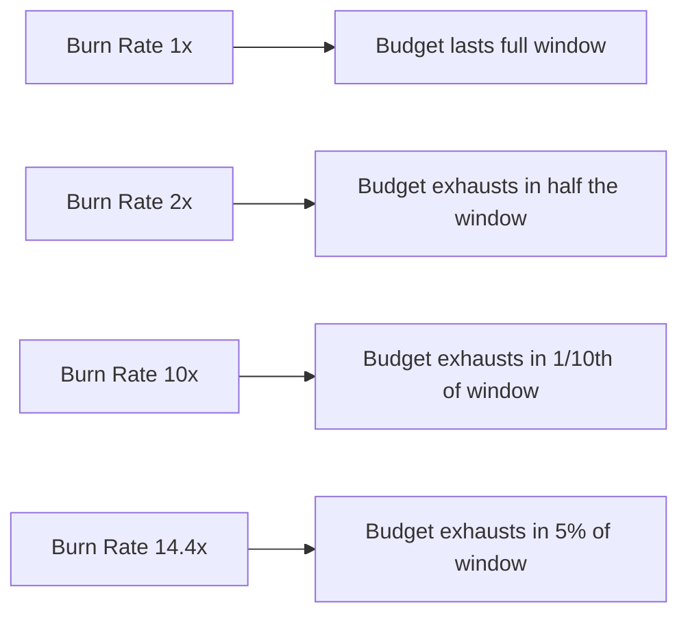
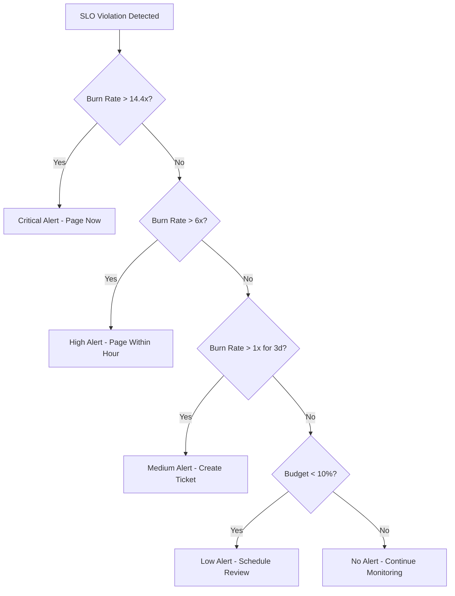

# How to Build SLO Alerting Strategies

Author: [nawazdhandala](https://www.github.com/nawazdhandala)

Tags: SLO, SRE, Alerting, Observability, Reliability

Description: Design effective SLO-based alerting with burn rates, multi-window alerts, and error budgets for proactive incident response.

---

## The Problem with Traditional Alerting

Traditional threshold-based alerts create noise. You set a CPU threshold at 80%, and suddenly you are paged every time there is a brief spike, even when users experience no degradation. SLO-based alerting flips the model - instead of alerting on infrastructure symptoms, you alert on user-facing impact.

The key insight: your users do not care if CPU hits 90%. They care if the service is slow or unavailable. SLO alerting directly measures what matters.

## Understanding Burn Rate

Burn rate measures how fast you are consuming your error budget relative to the expected rate. If your SLO allows 0.1% errors over 30 days (about 43 minutes of downtime), and you are experiencing 1% errors right now, your burn rate is 10x - you will exhaust your monthly budget in just 3 days.

The formula is straightforward:

```
Burn Rate = Current Error Rate / Allowed Error Rate
```

Here is how burn rate relates to time-to-exhaustion:



A burn rate of 1 means you are consuming budget exactly as planned. Greater than 1 means trouble is coming.

## Multi-Window Alerting Strategy

Single-window alerts create problems. A short window (like 5 minutes) catches fast incidents but fires on brief blips. A long window (like 6 hours) filters noise but misses rapid outages until significant damage is done.

The solution is multi-window alerting: combine a long window to confirm sustained impact with a short window to ensure the problem is ongoing.

Google's SRE book recommends this approach with specific burn rates tied to alert severity:

```yaml
# prometheus/rules/slo_alerts.yaml
groups:
  - name: slo_multiwindow_alerts
    rules:
      # Critical: 2% budget consumed in 1 hour
      # Burn rate 14.4 over 1h AND 5m (confirms ongoing)
      - alert: SLOBudgetBurnCritical
        expr: |
          (
            # Long window: 1 hour burn rate > 14.4
            (1 - (sum(rate(http_requests_total{status!~"5.."}[1h]))
                  / sum(rate(http_requests_total[1h]))))
            / (1 - 0.999) > 14.4
          )
          and
          (
            # Short window: 5 minute burn rate > 14.4
            (1 - (sum(rate(http_requests_total{status!~"5.."}[5m]))
                  / sum(rate(http_requests_total[5m]))))
            / (1 - 0.999) > 14.4
          )
        for: 2m
        labels:
          severity: critical
        annotations:
          summary: "Critical SLO burn rate - page immediately"
          description: "Service is burning error budget at {{ $value }}x rate"
```

## The Four-Alert Framework

A practical SLO alerting strategy uses four alerts with decreasing urgency:

```yaml
# Alert 1: Page-worthy (2% budget burn in 1h)
# Long window: 1h, Short window: 5m, Burn rate: 14.4x
- alert: SLOCriticalBurn
  expr: |
    slo:burn_rate:1h > 14.4 and slo:burn_rate:5m > 14.4
  labels:
    severity: critical
    response: page

# Alert 2: High urgency (5% budget burn in 6h)
# Long window: 6h, Short window: 30m, Burn rate: 6x
- alert: SLOHighBurn
  expr: |
    slo:burn_rate:6h > 6 and slo:burn_rate:30m > 6
  labels:
    severity: high
    response: page

# Alert 3: Medium urgency (10% budget burn in 3d)
# Long window: 3d, Short window: 6h, Burn rate: 1x
- alert: SLOMediumBurn
  expr: |
    slo:burn_rate:3d > 1 and slo:burn_rate:6h > 1
  labels:
    severity: medium
    response: ticket

# Alert 4: Low urgency (trend-based)
# Budget projected to exhaust before window ends
- alert: SLOLowBurn
  expr: |
    slo:error_budget:remaining < 0.1
  labels:
    severity: low
    response: review
```

This framework catches everything from complete outages to slow degradation:



## Implementing Recording Rules

Complex burn rate calculations should not run on every alert evaluation. Use Prometheus recording rules to pre-compute values:

```yaml
# prometheus/rules/slo_recording.yaml
groups:
  - name: slo_recording_rules
    interval: 30s
    rules:
      # Error ratio over various windows
      - record: slo:error_ratio:5m
        expr: |
          1 - (
            sum by (service) (rate(http_requests_total{status!~"5.."}[5m]))
            / sum by (service) (rate(http_requests_total[5m]))
          )

      - record: slo:error_ratio:1h
        expr: |
          1 - (
            sum by (service) (rate(http_requests_total{status!~"5.."}[1h]))
            / sum by (service) (rate(http_requests_total[1h]))
          )

      - record: slo:error_ratio:6h
        expr: |
          1 - (
            sum by (service) (rate(http_requests_total{status!~"5.."}[6h]))
            / sum by (service) (rate(http_requests_total[6h]))
          )

      # Burn rates (assuming 99.9% SLO target)
      - record: slo:burn_rate:5m
        expr: slo:error_ratio:5m / 0.001

      - record: slo:burn_rate:1h
        expr: slo:error_ratio:1h / 0.001

      - record: slo:burn_rate:6h
        expr: slo:error_ratio:6h / 0.001

      # Error budget remaining (30-day window)
      - record: slo:error_budget:remaining
        expr: |
          1 - (
            slo:error_ratio:30d / 0.001
          )
```

## Latency-Based SLO Alerts

Availability is only half the story. Latency SLOs require histogram-based calculations:

```yaml
# Recording rule for latency SLI
# Target: 99% of requests under 200ms
- record: slo:latency_good:ratio_rate1h
  expr: |
    sum by (service) (rate(http_request_duration_seconds_bucket{le="0.2"}[1h]))
    / sum by (service) (rate(http_request_duration_seconds_count[1h]))

# Latency burn rate
- record: slo:latency_burn_rate:1h
  expr: |
    (1 - slo:latency_good:ratio_rate1h) / (1 - 0.99)
```

Then alert on latency burn rate the same way:

```yaml
- alert: LatencySLOCriticalBurn
  expr: |
    slo:latency_burn_rate:1h > 14.4
    and slo:latency_burn_rate:5m > 14.4
  labels:
    severity: critical
  annotations:
    summary: "Latency SLO burn rate critical for {{ $labels.service }}"
```

## Alert Routing and Escalation

Connect your SLO alerts to appropriate response channels:

```yaml
# alertmanager/config.yaml
route:
  receiver: default
  routes:
    # Critical SLO burns page on-call immediately
    - match:
        severity: critical
      receiver: pagerduty-oncall
      continue: true

    # High burns also page but with longer group wait
    - match:
        severity: high
      receiver: pagerduty-oncall
      group_wait: 5m

    # Medium creates a ticket
    - match:
        severity: medium
      receiver: jira-ticket

    # Low goes to a review channel
    - match:
        severity: low
      receiver: slack-sre-review

receivers:
  - name: pagerduty-oncall
    pagerduty_configs:
      - service_key: ${PAGERDUTY_KEY}
        severity: '{{ .CommonLabels.severity }}'

  - name: slack-sre-review
    slack_configs:
      - channel: '#sre-review'
        title: 'SLO Budget Warning'
        text: '{{ .CommonAnnotations.description }}'
```

## Avoiding Common Pitfalls

**Setting unrealistic SLOs**: If your target is 99.99% but you regularly hit 99.5%, your alerts will fire constantly. Start with achievable targets and tighten over time.

**Alerting on every service equally**: Not all services deserve the same urgency. A critical checkout flow warrants page-worthy alerts; an internal admin tool might only need tickets.

**Ignoring seasonal patterns**: Some services have legitimate traffic spikes. Consider adjusting thresholds or using anomaly detection for services with variable baselines.

**Forgetting to test**: Run fire drills. Inject errors to verify your alerting chain works from detection to notification.

## Putting It All Together

Effective SLO alerting requires:

1. Clear SLO targets based on user expectations
2. Recording rules for efficient burn rate calculation
3. Multi-window alerts to balance speed and noise
4. Tiered severity routing to appropriate response channels
5. Regular review of alert effectiveness and SLO targets

Start with your most critical user-facing service. Define one availability and one latency SLO. Implement the four-alert framework. Iterate based on alert quality - if you are getting paged for non-issues, widen windows or reduce burn rate thresholds. If you are missing real incidents, tighten them.

The goal is not zero alerts. The goal is every alert representing real user impact that requires human intervention. When you achieve that, on-call becomes sustainable and your users stay happy.
