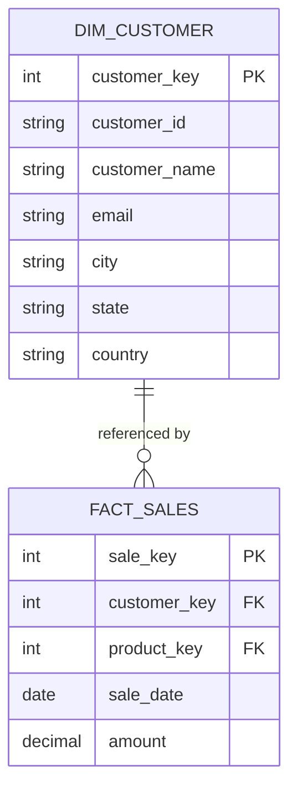
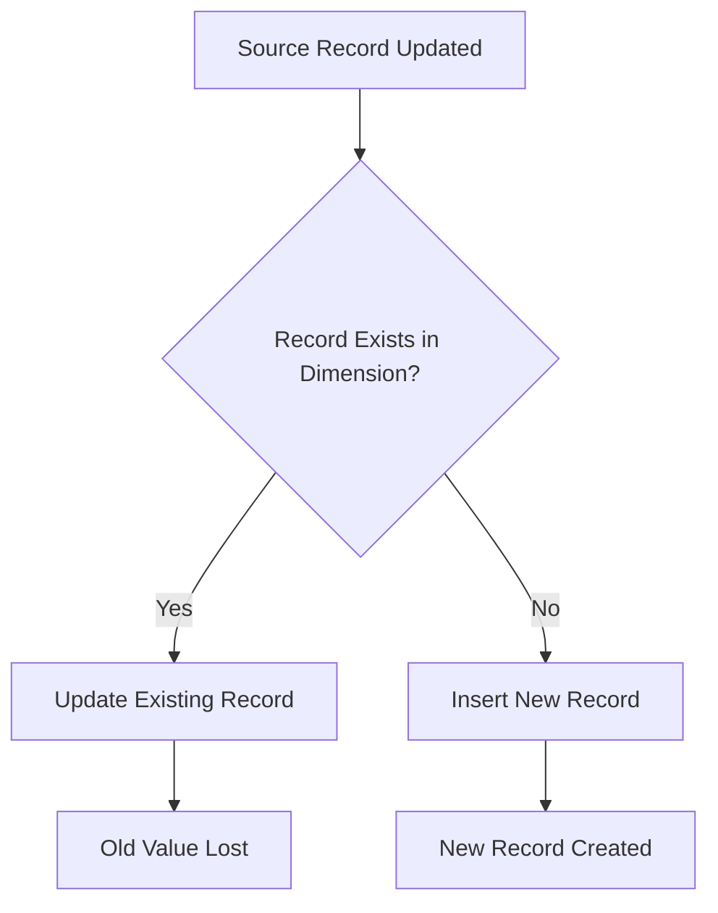
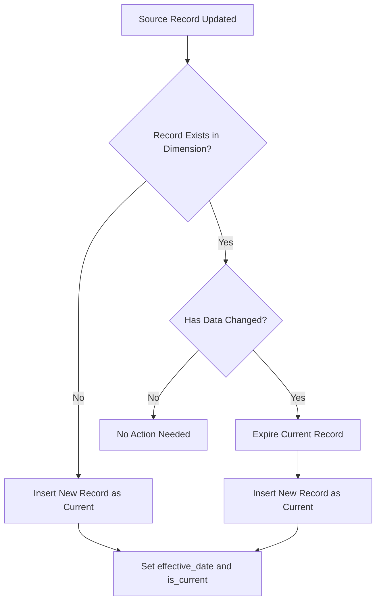
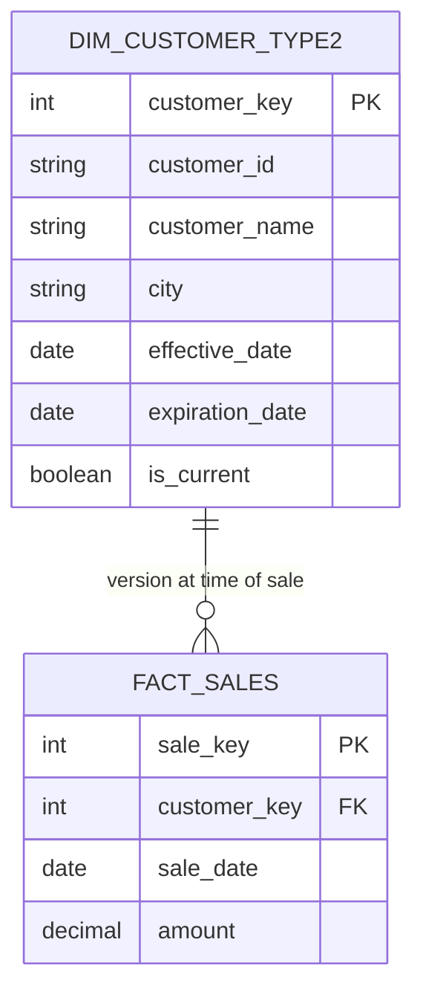
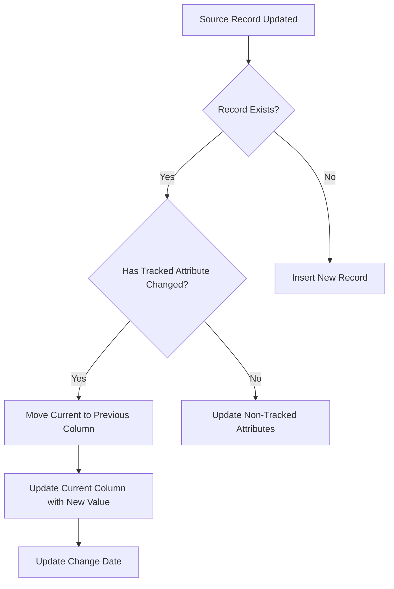
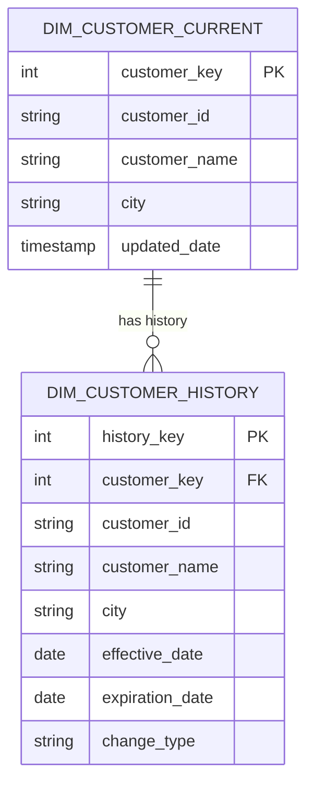
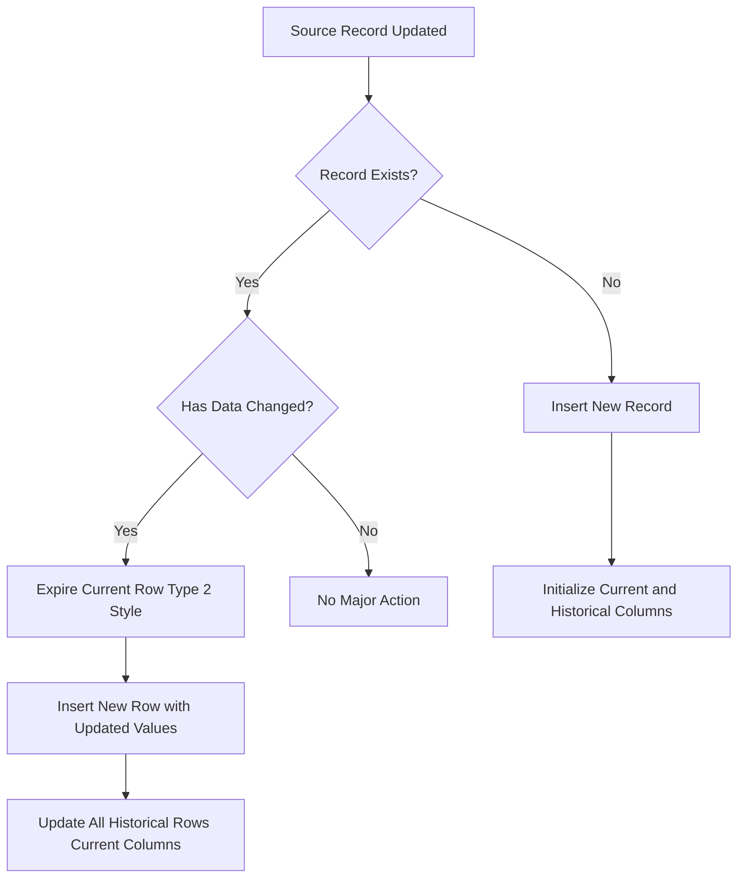
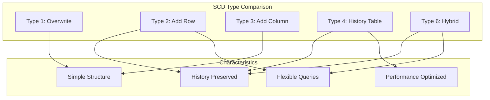

# How to Build Slowly Changing Dimensions

Author: [nawazdhandala](https://github.com/nawazdhandala)

Tags: Data Warehouse, SCD, Dimensional Modeling, Data Engineering

Description: Learn how to implement slowly changing dimensions (SCD Types 1, 2, 3) for historical tracking.

---

## Introduction

In data warehousing, dimensions are the descriptive attributes that provide context to your business metrics. However, these attributes change over time. A customer moves to a new city, a product gets reclassified, or an employee changes departments. How you handle these changes determines whether you can accurately analyze historical data.

**Slowly Changing Dimensions (SCD)** are design patterns that help you manage and track changes to dimension data over time. The term "slowly" refers to the fact that these changes happen less frequently than transactional data, but they still need careful handling.

This guide covers the five most common SCD types: Type 1, Type 2, Type 3, Type 4, and Type 6 (also known as Hybrid). Each type offers different trade-offs between simplicity, storage, and historical accuracy.

## Understanding Dimension Tables

Before diving into SCD types, let us look at a basic dimension table structure:



---

## SCD Type 1: Overwrite

Type 1 is the simplest approach. When a dimension attribute changes, you simply overwrite the old value with the new one. No history is preserved.

### When to Use Type 1

- The attribute change represents a correction (fixing a typo)
- Historical tracking is not required for this attribute
- You want to keep the dimension table small and simple

### Type 1 Process Flow



### Type 1 SQL Implementation

```sql
-- Type 1 SCD: Overwrite Strategy
-- This approach simply updates the existing record with new values
-- Historical data is NOT preserved

-- Step 1: Create the dimension table
CREATE TABLE dim_customer_type1 (
    -- Surrogate key for the warehouse
    customer_key INT PRIMARY KEY AUTO_INCREMENT,
    -- Natural key from source system
    customer_id VARCHAR(50) NOT NULL,
    customer_name VARCHAR(100),
    email VARCHAR(100),
    city VARCHAR(50),
    state VARCHAR(50),
    country VARCHAR(50),
    created_date TIMESTAMP DEFAULT CURRENT_TIMESTAMP,
    updated_date TIMESTAMP DEFAULT CURRENT_TIMESTAMP ON UPDATE CURRENT_TIMESTAMP
);

-- Step 2: Create an index on the natural key for faster lookups
CREATE UNIQUE INDEX idx_customer_id ON dim_customer_type1(customer_id);

-- Step 3: Merge procedure for Type 1 SCD
-- This procedure handles both inserts and updates
MERGE INTO dim_customer_type1 AS target
USING staging_customer AS source
ON target.customer_id = source.customer_id
WHEN MATCHED THEN
    -- Update existing record, overwriting old values
    UPDATE SET
        customer_name = source.customer_name,
        email = source.email,
        city = source.city,
        state = source.state,
        country = source.country,
        updated_date = CURRENT_TIMESTAMP
WHEN NOT MATCHED THEN
    -- Insert new record
    INSERT (customer_id, customer_name, email, city, state, country)
    VALUES (source.customer_id, source.customer_name, source.email,
            source.city, source.state, source.country);
```

### Type 1 Example Scenario

**Before Update:**

| customer_key | customer_id | customer_name | city |
|--------------|-------------|---------------|------|
| 1 | CUST001 | John Smith | Boston |

**After Update (customer moves to Chicago):**

| customer_key | customer_id | customer_name | city |
|--------------|-------------|---------------|------|
| 1 | CUST001 | John Smith | Chicago |

The Boston history is completely lost.

---

## SCD Type 2: Add New Row

Type 2 is the most common approach for tracking historical changes. When an attribute changes, you create a new row in the dimension table while preserving the old row with its historical values.

### When to Use Type 2

- Full historical tracking is required
- You need to analyze data as it existed at any point in time
- Audit and compliance requirements mandate history preservation

### Type 2 Process Flow



### Type 2 SQL Implementation

```sql
-- Type 2 SCD: Historical Row Strategy
-- This approach preserves complete history by adding new rows
-- Each version of a record is tracked with date ranges and flags

-- Step 1: Create the dimension table with versioning columns
CREATE TABLE dim_customer_type2 (
    -- Surrogate key (unique per version)
    customer_key INT PRIMARY KEY AUTO_INCREMENT,
    -- Natural key from source system
    customer_id VARCHAR(50) NOT NULL,
    customer_name VARCHAR(100),
    email VARCHAR(100),
    city VARCHAR(50),
    state VARCHAR(50),
    country VARCHAR(50),
    -- When this version became active
    effective_date DATE NOT NULL,
    -- When this version was superseded
    expiration_date DATE,
    -- Flag for easy filtering
    is_current BOOLEAN DEFAULT TRUE,
    -- Track version sequence
    version_number INT DEFAULT 1,
    created_date TIMESTAMP DEFAULT CURRENT_TIMESTAMP
);

-- Step 2: Create indexes for common query patterns
CREATE INDEX idx_customer_id_type2 ON dim_customer_type2(customer_id);
CREATE INDEX idx_is_current ON dim_customer_type2(is_current);
CREATE INDEX idx_date_range ON dim_customer_type2(effective_date, expiration_date);

-- Step 3: Procedure to handle Type 2 SCD updates
-- This uses a multi-step approach for clarity

-- Step 3a: Identify records that have changed
CREATE TEMPORARY TABLE changed_records AS
SELECT
    s.customer_id,
    s.customer_name,
    s.email,
    s.city,
    s.state,
    s.country,
    d.customer_key AS existing_key,
    d.version_number AS current_version
FROM staging_customer s
LEFT JOIN dim_customer_type2 d
    ON s.customer_id = d.customer_id
    AND d.is_current = TRUE
WHERE d.customer_key IS NULL  -- New records
   OR (
       -- Changed records: compare all tracked attributes
       d.customer_name != s.customer_name
       OR d.email != s.email
       OR d.city != s.city
       OR d.state != s.state
       OR d.country != s.country
   );

-- Step 3b: Expire the current versions of changed records
UPDATE dim_customer_type2
SET
    -- Set to yesterday
    expiration_date = CURRENT_DATE - INTERVAL '1 day',
    is_current = FALSE
WHERE customer_id IN (
    SELECT customer_id
    FROM changed_records
    WHERE existing_key IS NOT NULL
)
AND is_current = TRUE;

-- Step 3c: Insert new versions for changed and new records
INSERT INTO dim_customer_type2 (
    customer_id,
    customer_name,
    email,
    city,
    state,
    country,
    effective_date,
    expiration_date,
    is_current,
    version_number
)
SELECT
    customer_id,
    customer_name,
    email,
    city,
    state,
    country,
    -- Effective today
    CURRENT_DATE,
    -- Far future date for current records
    '9999-12-31',
    -- This is now the current version
    TRUE,
    -- Increment version number
    COALESCE(current_version, 0) + 1
FROM changed_records;

-- Step 4: Query example - Get customer at a specific point in time
SELECT *
FROM dim_customer_type2
WHERE customer_id = 'CUST001'
  -- The date you want to query
  AND effective_date <= '2025-06-15'
  AND (expiration_date >= '2025-06-15' OR expiration_date IS NULL);
```

### Type 2 Example Scenario

**After customer moves from Boston to Chicago:**

| customer_key | customer_id | customer_name | city | effective_date | expiration_date | is_current |
|--------------|-------------|---------------|------|----------------|-----------------|------------|
| 1 | CUST001 | John Smith | Boston | 2024-01-01 | 2025-06-14 | FALSE |
| 2 | CUST001 | John Smith | Chicago | 2025-06-15 | 9999-12-31 | TRUE |

Both the old and new values are preserved with their respective time ranges.

### Type 2 Fact Table Considerations



When loading fact tables with Type 2 dimensions, you must look up the correct version:

```sql
-- Join fact to the correct dimension version based on transaction date
INSERT INTO fact_sales (customer_key, product_key, sale_date, amount)
SELECT
    -- Gets the version active at sale time
    d.customer_key,
    p.product_key,
    s.sale_date,
    s.amount
FROM staging_sales s
JOIN dim_customer_type2 d
    ON s.customer_id = d.customer_id
    AND s.sale_date >= d.effective_date
    AND s.sale_date <= d.expiration_date
JOIN dim_product p
    ON s.product_id = p.product_id;
```

---

## SCD Type 3: Add New Column

Type 3 stores both the current and previous values in separate columns within the same row. This provides limited history (typically just one previous value) but keeps the dimension table compact.

### When to Use Type 3

- You only need to track one previous value
- Storage space is a concern
- You frequently need to compare current vs. previous values

### Type 3 Process Flow



### Type 3 SQL Implementation

```sql
-- Type 3 SCD: Previous Value Column Strategy
-- This approach stores current and previous values in separate columns
-- Limited to tracking one historical value per attribute

-- Step 1: Create the dimension table with previous value columns
CREATE TABLE dim_customer_type3 (
    -- Surrogate key
    customer_key INT PRIMARY KEY AUTO_INCREMENT,
    -- Natural key
    customer_id VARCHAR(50) NOT NULL,
    customer_name VARCHAR(100),
    email VARCHAR(100),

    -- Current values for tracked attributes
    current_city VARCHAR(50),
    current_state VARCHAR(50),

    -- Previous values for tracked attributes
    previous_city VARCHAR(50),
    previous_state VARCHAR(50),

    -- Date when the change occurred
    city_change_date DATE,
    state_change_date DATE,

    -- Non-tracked attribute
    country VARCHAR(50),
    created_date TIMESTAMP DEFAULT CURRENT_TIMESTAMP,
    updated_date TIMESTAMP DEFAULT CURRENT_TIMESTAMP ON UPDATE CURRENT_TIMESTAMP
);

-- Step 2: Create index for lookups
CREATE UNIQUE INDEX idx_customer_id_type3 ON dim_customer_type3(customer_id);

-- Step 3: Merge procedure for Type 3 SCD
MERGE INTO dim_customer_type3 AS target
USING staging_customer AS source
ON target.customer_id = source.customer_id
WHEN MATCHED THEN
    UPDATE SET
        customer_name = source.customer_name,
        email = source.email,

        -- Handle city change: current becomes previous, new becomes current
        previous_city = CASE
            WHEN target.current_city != source.city THEN target.current_city
            ELSE target.previous_city
        END,
        current_city = source.city,
        city_change_date = CASE
            WHEN target.current_city != source.city THEN CURRENT_DATE
            ELSE target.city_change_date
        END,

        -- Handle state change: current becomes previous, new becomes current
        previous_state = CASE
            WHEN target.current_state != source.state THEN target.current_state
            ELSE target.previous_state
        END,
        current_state = source.state,
        state_change_date = CASE
            WHEN target.current_state != source.state THEN CURRENT_DATE
            ELSE target.state_change_date
        END,

        country = source.country,
        updated_date = CURRENT_TIMESTAMP

WHEN NOT MATCHED THEN
    INSERT (customer_id, customer_name, email, current_city, current_state, country)
    VALUES (source.customer_id, source.customer_name, source.email,
            source.city, source.state, source.country);

-- Step 4: Query example - Compare current and previous values
SELECT
    customer_id,
    customer_name,
    current_city,
    previous_city,
    city_change_date,
    CASE
        WHEN previous_city IS NOT NULL THEN 'Changed'
        ELSE 'Original'
    END AS city_status
FROM dim_customer_type3
-- Find all customers who have moved
WHERE previous_city IS NOT NULL;
```

### Type 3 Example Scenario

**After customer moves from Boston to Chicago:**

| customer_key | customer_id | customer_name | current_city | previous_city | city_change_date |
|--------------|-------------|---------------|--------------|---------------|------------------|
| 1 | CUST001 | John Smith | Chicago | Boston | 2025-06-15 |

The previous city is preserved, but if the customer moves again, the Boston value will be lost.

---

## SCD Type 4: History Table

Type 4 separates current data from historical data using two tables. The main dimension table holds only current values, while a separate history table stores all historical changes.

### When to Use Type 4

- Most queries only need current data
- Historical queries are infrequent but still necessary
- You want to optimize current-data query performance

### Type 4 Architecture



### Type 4 SQL Implementation

```sql
-- Type 4 SCD: Separate History Table Strategy
-- Current values in main table, all history in separate table
-- Optimizes queries against current data while preserving full history

-- Step 1: Create the current dimension table (main table)
CREATE TABLE dim_customer_current (
    -- Surrogate key
    customer_key INT PRIMARY KEY AUTO_INCREMENT,
    -- Natural key
    customer_id VARCHAR(50) NOT NULL UNIQUE,
    customer_name VARCHAR(100),
    email VARCHAR(100),
    city VARCHAR(50),
    state VARCHAR(50),
    country VARCHAR(50),
    created_date TIMESTAMP DEFAULT CURRENT_TIMESTAMP,
    updated_date TIMESTAMP DEFAULT CURRENT_TIMESTAMP ON UPDATE CURRENT_TIMESTAMP
);

-- Step 2: Create the history table
CREATE TABLE dim_customer_history (
    -- Unique key for history records
    history_key INT PRIMARY KEY AUTO_INCREMENT,
    -- Links to current table
    customer_key INT NOT NULL,
    -- Natural key (denormalized for queries)
    customer_id VARCHAR(50) NOT NULL,
    customer_name VARCHAR(100),
    email VARCHAR(100),
    city VARCHAR(50),
    state VARCHAR(50),
    country VARCHAR(50),
    -- When this version started
    effective_date DATE NOT NULL,
    -- When this version ended
    expiration_date DATE,
    -- INSERT, UPDATE, DELETE
    change_type VARCHAR(20),
    change_timestamp TIMESTAMP DEFAULT CURRENT_TIMESTAMP,
    FOREIGN KEY (customer_key) REFERENCES dim_customer_current(customer_key)
);

-- Step 3: Create indexes for history queries
CREATE INDEX idx_history_customer ON dim_customer_history(customer_key);
CREATE INDEX idx_history_date_range ON dim_customer_history(effective_date, expiration_date);
CREATE INDEX idx_history_customer_id ON dim_customer_history(customer_id);

-- Step 4: Procedure to handle Type 4 SCD updates
-- This procedure maintains both tables in sync

-- Step 4a: Capture current state before changes (for records that will change)
INSERT INTO dim_customer_history (
    customer_key,
    customer_id,
    customer_name,
    email,
    city,
    state,
    country,
    effective_date,
    expiration_date,
    change_type
)
SELECT
    c.customer_key,
    c.customer_id,
    c.customer_name,
    c.email,
    c.city,
    c.state,
    c.country,
    COALESCE(
        (SELECT MAX(expiration_date) + INTERVAL '1 day'
         FROM dim_customer_history h
         WHERE h.customer_key = c.customer_key),
        c.created_date::DATE
    ),
    CURRENT_DATE - INTERVAL '1 day',
    'UPDATE'
FROM dim_customer_current c
JOIN staging_customer s ON c.customer_id = s.customer_id
WHERE c.customer_name != s.customer_name
   OR c.email != s.email
   OR c.city != s.city
   OR c.state != s.state
   OR c.country != s.country;

-- Step 4b: Update current table with new values
UPDATE dim_customer_current c
SET
    customer_name = s.customer_name,
    email = s.email,
    city = s.city,
    state = s.state,
    country = s.country,
    updated_date = CURRENT_TIMESTAMP
FROM staging_customer s
WHERE c.customer_id = s.customer_id;

-- Step 4c: Insert new customers into current table
INSERT INTO dim_customer_current (customer_id, customer_name, email, city, state, country)
SELECT s.customer_id, s.customer_name, s.email, s.city, s.state, s.country
FROM staging_customer s
LEFT JOIN dim_customer_current c ON s.customer_id = c.customer_id
WHERE c.customer_key IS NULL;

-- Step 4d: Record new customers in history
INSERT INTO dim_customer_history (
    customer_key,
    customer_id,
    customer_name,
    email,
    city,
    state,
    country,
    effective_date,
    expiration_date,
    change_type
)
SELECT
    c.customer_key,
    c.customer_id,
    c.customer_name,
    c.email,
    c.city,
    c.state,
    c.country,
    CURRENT_DATE,
    '9999-12-31',
    'INSERT'
FROM dim_customer_current c
WHERE c.created_date::DATE = CURRENT_DATE;

-- Step 5: Query examples

-- Query current data (fast, no history overhead)
SELECT * FROM dim_customer_current WHERE city = 'Chicago';

-- Query historical data at a point in time
SELECT *
FROM dim_customer_history
WHERE customer_id = 'CUST001'
  AND effective_date <= '2025-06-01'
  AND expiration_date >= '2025-06-01';

-- Get complete change history for a customer
SELECT
    customer_name,
    city,
    effective_date,
    expiration_date,
    change_type
FROM dim_customer_history
WHERE customer_id = 'CUST001'
ORDER BY effective_date;
```

### Type 4 Example Scenario

**Current Table:**

| customer_key | customer_id | customer_name | city |
|--------------|-------------|---------------|------|
| 1 | CUST001 | John Smith | Chicago |

**History Table:**

| history_key | customer_key | customer_id | customer_name | city | effective_date | expiration_date | change_type |
|-------------|--------------|-------------|---------------|------|----------------|-----------------|-------------|
| 1 | 1 | CUST001 | John Smith | Boston | 2024-01-01 | 2025-06-14 | INSERT |
| 2 | 1 | CUST001 | John Smith | Chicago | 2025-06-15 | 9999-12-31 | UPDATE |

---

## SCD Type 6: Hybrid Approach

Type 6 (sometimes called Type 2+1+3 or Hybrid) combines elements of Types 1, 2, and 3. It maintains full history like Type 2, includes previous/current columns like Type 3, and updates all historical rows with current values like Type 1.

### When to Use Type 6

- You need both historical accuracy and easy access to current values
- Reports frequently compare historical transactions against current attributes
- You want maximum flexibility in analytical queries

### Type 6 Process Flow



### Type 6 SQL Implementation

```sql
-- Type 6 SCD: Hybrid Strategy (Type 1 + 2 + 3 Combined)
-- Full history with versioned rows PLUS current values on all rows
-- Enables both point-in-time and current-value analysis

-- Step 1: Create the dimension table with hybrid columns
CREATE TABLE dim_customer_type6 (
    -- Surrogate key (unique per version)
    customer_key INT PRIMARY KEY AUTO_INCREMENT,
    -- Natural key
    customer_id VARCHAR(50) NOT NULL,

    -- Current values (Type 1 style, updated on ALL rows)
    current_name VARCHAR(100),
    current_city VARCHAR(50),
    current_state VARCHAR(50),

    -- Historical values (Type 2 style, frozen at time of record)
    historical_name VARCHAR(100),
    historical_city VARCHAR(50),
    historical_state VARCHAR(50),

    -- Version tracking (Type 2 style)
    effective_date DATE NOT NULL,
    expiration_date DATE,
    is_current BOOLEAN DEFAULT TRUE,
    version_number INT DEFAULT 1,

    -- Non-tracked attributes
    email VARCHAR(100),
    country VARCHAR(50),

    created_date TIMESTAMP DEFAULT CURRENT_TIMESTAMP
);

-- Step 2: Create indexes
CREATE INDEX idx_customer_id_type6 ON dim_customer_type6(customer_id);
CREATE INDEX idx_is_current_type6 ON dim_customer_type6(is_current);
CREATE INDEX idx_date_range_type6 ON dim_customer_type6(effective_date, expiration_date);

-- Step 3: Procedure for Type 6 SCD updates
-- This is a multi-step process that maintains both current and historical values

-- Step 3a: Identify changed records
CREATE TEMPORARY TABLE changed_records_type6 AS
SELECT
    s.customer_id,
    s.customer_name,
    s.email,
    s.city,
    s.state,
    s.country,
    d.customer_key AS existing_key,
    d.version_number AS current_version
FROM staging_customer s
LEFT JOIN dim_customer_type6 d
    ON s.customer_id = d.customer_id
    AND d.is_current = TRUE
WHERE d.customer_key IS NULL
   OR d.historical_city != s.city
   OR d.historical_state != s.state
   OR d.historical_name != s.customer_name;

-- Step 3b: Expire current versions (Type 2 behavior)
UPDATE dim_customer_type6
SET
    expiration_date = CURRENT_DATE - INTERVAL '1 day',
    is_current = FALSE
WHERE customer_id IN (
    SELECT customer_id
    FROM changed_records_type6
    WHERE existing_key IS NOT NULL
)
AND is_current = TRUE;

-- Step 3c: Insert new versions with both current and historical values
INSERT INTO dim_customer_type6 (
    customer_id,
    current_name,
    current_city,
    current_state,
    historical_name,
    historical_city,
    historical_state,
    effective_date,
    expiration_date,
    is_current,
    version_number,
    email,
    country
)
SELECT
    customer_id,
    -- Current values
    customer_name,
    city,
    state,
    -- Historical values (same as current for new version)
    customer_name,
    city,
    state,
    CURRENT_DATE,
    '9999-12-31',
    TRUE,
    COALESCE(current_version, 0) + 1,
    email,
    country
FROM changed_records_type6;

-- Step 3d: Update current values on ALL historical rows (Type 1 behavior)
-- This is what makes Type 6 unique
UPDATE dim_customer_type6 target
SET
    current_name = source.customer_name,
    current_city = source.city,
    current_state = source.state
FROM staging_customer source
WHERE target.customer_id = source.customer_id;

-- Step 4: Query examples

-- Get current state for all customers (use any row)
SELECT DISTINCT
    customer_id,
    current_name,
    current_city,
    current_state
FROM dim_customer_type6;

-- Analyze historical transactions with BOTH historical and current context
SELECT
    f.sale_date,
    f.amount,
    -- Where customer lived when sale occurred
    d.historical_city AS city_at_sale_time,
    -- Where customer lives now
    d.current_city AS city_now,
    CASE
        WHEN d.historical_city != d.current_city THEN 'Customer Has Moved'
        ELSE 'Same Location'
    END AS location_change_flag
FROM fact_sales f
JOIN dim_customer_type6 d
    ON f.customer_key = d.customer_key;

-- Point-in-time query using historical values
SELECT *
FROM dim_customer_type6
WHERE customer_id = 'CUST001'
  AND effective_date <= '2025-06-01'
  AND expiration_date >= '2025-06-01';

-- Compare historical vs current for all versions of a customer
SELECT
    version_number,
    historical_city AS city_at_version,
    current_city AS city_now,
    effective_date,
    expiration_date
FROM dim_customer_type6
WHERE customer_id = 'CUST001'
ORDER BY version_number;
```

### Type 6 Example Scenario

**After customer moves from Boston to Chicago:**

| customer_key | customer_id | current_city | historical_city | effective_date | expiration_date | is_current |
|--------------|-------------|--------------|-----------------|----------------|-----------------|------------|
| 1 | CUST001 | Chicago | Boston | 2024-01-01 | 2025-06-14 | FALSE |
| 2 | CUST001 | Chicago | Chicago | 2025-06-15 | 9999-12-31 | TRUE |

Notice that `current_city` is "Chicago" on both rows, while `historical_city` preserves the value at each point in time.

---

## Comparison Summary



| Feature | Type 1 | Type 2 | Type 3 | Type 4 | Type 6 |
|---------|--------|--------|--------|--------|--------|
| History Preserved | No | Yes (Full) | Yes (Limited) | Yes (Full) | Yes (Full) |
| Storage Efficiency | High | Low | High | Medium | Low |
| Query Complexity | Low | Medium | Low | Medium | Medium |
| Point-in-Time Analysis | No | Yes | No | Yes | Yes |
| Current Value Access | Fast | Needs Filter | Fast | Fast | Fast (on any row) |
| Implementation Complexity | Low | Medium | Medium | High | High |

---

## Best Practices

### 1. Choose the Right Type for Each Attribute

Not every attribute in a dimension needs the same SCD treatment. Consider using:

```sql
-- Mixed SCD approach within a single dimension
CREATE TABLE dim_customer_mixed (
    customer_key INT PRIMARY KEY AUTO_INCREMENT,
    customer_id VARCHAR(50) NOT NULL,

    -- Type 1 attributes (corrections, no history needed)
    -- Overwrites typo fixes
    customer_name VARCHAR(100),
    -- Always want current email
    email VARCHAR(100),

    -- Type 2 attributes (tracked with full history via versioned rows)
    city VARCHAR(50),
    state VARCHAR(50),
    -- Customer segment for analysis
    segment VARCHAR(50),

    -- Type 3 attributes (only need previous value)
    current_credit_rating VARCHAR(10),
    previous_credit_rating VARCHAR(10),
    credit_rating_change_date DATE,

    -- Version tracking for Type 2 attributes
    effective_date DATE NOT NULL,
    expiration_date DATE,
    is_current BOOLEAN DEFAULT TRUE
);
```

### 2. Handle NULL Values Carefully

```sql
-- Use COALESCE or NVL for safe comparisons
WHERE COALESCE(target.city, '') != COALESCE(source.city, '')
```

### 3. Create Views for Common Access Patterns

```sql
-- View for current records only
CREATE VIEW v_dim_customer_current AS
SELECT *
FROM dim_customer_type2
WHERE is_current = TRUE;

-- View for point-in-time queries
CREATE VIEW v_dim_customer_pit AS
SELECT
    customer_key,
    customer_id,
    customer_name,
    city,
    effective_date,
    expiration_date
FROM dim_customer_type2;
```

### 4. Monitor Dimension Growth

For Type 2 dimensions, track row counts and growth rates:

```sql
-- Monitor dimension growth
SELECT
    customer_id,
    COUNT(*) AS version_count,
    MIN(effective_date) AS first_version,
    MAX(effective_date) AS latest_version
FROM dim_customer_type2
GROUP BY customer_id
-- Flag customers with many versions
HAVING COUNT(*) > 10
ORDER BY version_count DESC;
```

---

## Conclusion

Slowly Changing Dimensions are fundamental to building a robust data warehouse that can answer both current-state and historical questions. The right choice depends on your specific requirements:

- **Type 1** for simplicity when history does not matter
- **Type 2** for complete historical tracking
- **Type 3** for limited history with simple structure
- **Type 4** for optimized current queries with separate history
- **Type 6** for maximum analytical flexibility

Most production data warehouses use a combination of these types, applying different strategies to different attributes based on business needs. Start with your reporting requirements and work backward to determine which SCD type best serves each use case.

Remember that the goal is not to preserve every change, but to preserve the changes that matter for your analytical and compliance needs. Choose wisely, document your decisions, and build processes that maintain data quality over time.
