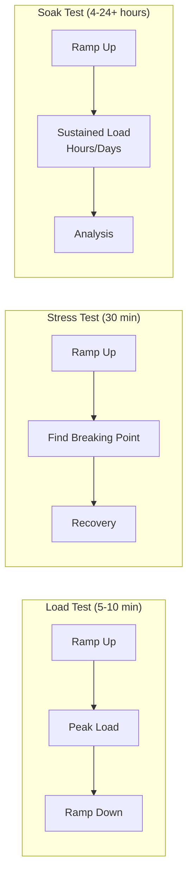

# How to Build Soak Testing

Author: [nawazdhandala](https://github.com/nawazdhandala)

Tags: Testing, Performance, DevOps, Reliability

Description: Learn how to build effective soak tests that uncover memory leaks, resource exhaustion, and degradation issues that only appear after extended periods of continuous load.

---

Performance testing comes in many flavors. Load tests check if your system handles expected traffic. Stress tests find breaking points. But soak testing is different. It answers a critical question: what happens when your application runs under sustained load for hours or days?

Memory leaks, connection pool exhaustion, file handle accumulation, and gradual performance degradation are problems that only surface over time. A 5-minute load test will never catch them. Soak testing will.

## What Makes Soak Testing Different

Soak testing (also called endurance testing or longevity testing) applies moderate, consistent load over an extended period. Unlike spike tests that hammer your system briefly, soak tests simulate real-world usage patterns over hours or days.



The goal is not to break things quickly but to observe how the system behaves under normal conditions over time.

## Common Issues Soak Testing Uncovers

| Issue Type | Symptoms | Root Cause |
|------------|----------|------------|
| Memory leaks | RAM usage climbs steadily | Objects not garbage collected |
| Connection pool exhaustion | Timeouts increase over time | Connections not returned to pool |
| File handle leaks | "Too many open files" errors | Streams not closed properly |
| Thread leaks | Thread count grows continuously | Threads created but never terminated |
| Cache bloat | Memory pressure, OOM kills | Unbounded cache growth |
| Database connection drift | Query latency increases | Connection state accumulation |

## Setting Up a Soak Test Environment

Before writing tests, establish your infrastructure. You need consistent environments, proper monitoring, and baseline metrics.

This Docker Compose configuration sets up a test environment with Prometheus for metrics collection and Grafana for visualization:

```yaml
# docker-compose.soak-test.yml
# Infrastructure for running soak tests with full observability

version: '3.8'

services:
  # The application under test
  app:
    build: .
    ports:
      - "8080:8080"
    environment:
      - NODE_ENV=production
      - DATABASE_URL=postgres://user:pass@db:5432/app
      - REDIS_URL=redis://redis:6379
    deploy:
      resources:
        limits:
          memory: 512M
          cpus: '1.0'
    healthcheck:
      test: ["CMD", "curl", "-f", "http://localhost:8080/health"]
      interval: 10s
      timeout: 5s
      retries: 3

  # Database for the application
  db:
    image: postgres:15
    environment:
      POSTGRES_USER: user
      POSTGRES_PASSWORD: pass
      POSTGRES_DB: app
    volumes:
      - postgres_data:/var/lib/postgresql/data

  # Redis for caching and sessions
  redis:
    image: redis:7-alpine

  # Prometheus for collecting metrics during the soak test
  prometheus:
    image: prom/prometheus:latest
    ports:
      - "9090:9090"
    volumes:
      - ./prometheus.yml:/etc/prometheus/prometheus.yml
      - prometheus_data:/prometheus
    command:
      - '--config.file=/etc/prometheus/prometheus.yml'
      - '--storage.tsdb.retention.time=7d'

  # Grafana for visualizing test results
  grafana:
    image: grafana/grafana:latest
    ports:
      - "3000:3000"
    environment:
      - GF_SECURITY_ADMIN_PASSWORD=admin
    volumes:
      - grafana_data:/var/lib/grafana
      - ./grafana/dashboards:/etc/grafana/provisioning/dashboards

volumes:
  postgres_data:
  prometheus_data:
  grafana_data:
```

Add this Prometheus configuration to scrape metrics from your application:

```yaml
# prometheus.yml
# Prometheus configuration for soak test monitoring

global:
  scrape_interval: 15s
  evaluation_interval: 15s

scrape_configs:
  - job_name: 'app'
    static_configs:
      - targets: ['app:8080']
    metrics_path: '/metrics'

  - job_name: 'prometheus'
    static_configs:
      - targets: ['localhost:9090']
```

## Writing Soak Tests with k6

k6 is an excellent tool for soak testing because it handles long-running tests efficiently and provides detailed metrics. Here is a comprehensive soak test script:

```javascript
// soak-test.js
// k6 soak test script for detecting long-running issues

import http from 'k6/http';
import { check, sleep } from 'k6';
import { Rate, Trend, Counter } from 'k6/metrics';

// Custom metrics to track during the soak test
const errorRate = new Rate('errors');
const responseTime = new Trend('response_time');
const requestsCompleted = new Counter('requests_completed');

// Soak test configuration
// Ramp up over 5 minutes, sustain load for 4 hours, ramp down over 5 minutes
export const options = {
  stages: [
    { duration: '5m', target: 100 },   // Ramp up to 100 users
    { duration: '4h', target: 100 },   // Stay at 100 users for 4 hours
    { duration: '5m', target: 0 },     // Ramp down
  ],
  thresholds: {
    // Error rate should stay below 1%
    'errors': ['rate<0.01'],
    // 95th percentile response time should stay under 500ms
    'http_req_duration': ['p(95)<500'],
    // 99th percentile should stay under 1 second
    'http_req_duration': ['p(99)<1000'],
  },
};

// Base URL of the application under test
const BASE_URL = __ENV.BASE_URL || 'http://localhost:8080';

// Simulate realistic user behavior with multiple endpoints
export default function() {
  // Home page request
  let homeResponse = http.get(`${BASE_URL}/`);
  check(homeResponse, {
    'home status is 200': (r) => r.status === 200,
  });
  errorRate.add(homeResponse.status !== 200);
  responseTime.add(homeResponse.timings.duration);
  requestsCompleted.add(1);

  sleep(Math.random() * 2 + 1); // Random sleep between 1-3 seconds

  // API endpoint that queries the database
  let apiResponse = http.get(`${BASE_URL}/api/items?limit=20`);
  check(apiResponse, {
    'api status is 200': (r) => r.status === 200,
    'api response has items': (r) => JSON.parse(r.body).items !== undefined,
  });
  errorRate.add(apiResponse.status !== 200);
  responseTime.add(apiResponse.timings.duration);
  requestsCompleted.add(1);

  sleep(Math.random() * 3 + 2); // Random sleep between 2-5 seconds

  // POST request to simulate write operations
  let payload = JSON.stringify({
    name: `Item ${Date.now()}`,
    value: Math.random() * 100,
  });

  let postResponse = http.post(`${BASE_URL}/api/items`, payload, {
    headers: { 'Content-Type': 'application/json' },
  });
  check(postResponse, {
    'post status is 201': (r) => r.status === 201,
  });
  errorRate.add(postResponse.status !== 201);
  responseTime.add(postResponse.timings.duration);
  requestsCompleted.add(1);

  sleep(Math.random() * 2 + 1);
}

// This function runs once at the end of the test
export function handleSummary(data) {
  return {
    'soak-test-results.json': JSON.stringify(data, null, 2),
    stdout: textSummary(data, { indent: ' ', enableColors: true }),
  };
}

// Helper function for text summary output
function textSummary(data, options) {
  // Custom summary formatting
  const metrics = data.metrics;
  let summary = '\n=== Soak Test Summary ===\n\n';

  summary += `Total Requests: ${metrics.http_reqs.values.count}\n`;
  summary += `Error Rate: ${(metrics.errors.values.rate * 100).toFixed(2)}%\n`;
  summary += `Avg Response Time: ${metrics.http_req_duration.values.avg.toFixed(2)}ms\n`;
  summary += `P95 Response Time: ${metrics.http_req_duration.values['p(95)'].toFixed(2)}ms\n`;
  summary += `P99 Response Time: ${metrics.http_req_duration.values['p(99)'].toFixed(2)}ms\n`;

  return summary;
}
```

Run the soak test with this command:

```bash
# Run the soak test and output results to file
k6 run --out json=soak-results.json soak-test.js
```

## Monitoring Memory During Soak Tests

Memory leaks are one of the most common issues soak tests reveal. This Node.js middleware exposes memory metrics for Prometheus:

```javascript
// middleware/metrics.js
// Express middleware for exposing memory and performance metrics

const promClient = require('prom-client');

// Create a Registry to register metrics
const register = new promClient.Registry();

// Add default metrics (CPU, memory, event loop lag, etc.)
promClient.collectDefaultMetrics({ register });

// Custom metric for tracking heap usage over time
const heapUsedGauge = new promClient.Gauge({
  name: 'nodejs_heap_used_bytes',
  help: 'Current heap used in bytes',
  registers: [register],
});

// Track external memory (buffers, etc.)
const externalMemoryGauge = new promClient.Gauge({
  name: 'nodejs_external_memory_bytes',
  help: 'External memory usage in bytes',
  registers: [register],
});

// Track active handles and requests (helps detect leaks)
const activeHandlesGauge = new promClient.Gauge({
  name: 'nodejs_active_handles',
  help: 'Number of active handles',
  registers: [register],
});

const activeRequestsGauge = new promClient.Gauge({
  name: 'nodejs_active_requests',
  help: 'Number of active requests',
  registers: [register],
});

// Track connection pool metrics
const dbConnectionsGauge = new promClient.Gauge({
  name: 'db_pool_connections',
  help: 'Number of database connections',
  labelNames: ['state'],
  registers: [register],
});

// Update metrics every 5 seconds
setInterval(() => {
  const memUsage = process.memoryUsage();

  heapUsedGauge.set(memUsage.heapUsed);
  externalMemoryGauge.set(memUsage.external);
  activeHandlesGauge.set(process._getActiveHandles().length);
  activeRequestsGauge.set(process._getActiveRequests().length);
}, 5000);

// Middleware to expose metrics endpoint
function metricsMiddleware(req, res) {
  res.set('Content-Type', register.contentType);
  register.metrics().then(metrics => res.send(metrics));
}

// Function to update database pool metrics (call from your pool events)
function updateDbPoolMetrics(pool) {
  dbConnectionsGauge.set({ state: 'total' }, pool.totalCount);
  dbConnectionsGauge.set({ state: 'idle' }, pool.idleCount);
  dbConnectionsGauge.set({ state: 'waiting' }, pool.waitingCount);
}

module.exports = {
  metricsMiddleware,
  updateDbPoolMetrics,
  register,
};
```

## Detecting Memory Leaks Programmatically

While visual inspection of Grafana dashboards works, automated detection is better. This script analyzes memory trends and alerts on potential leaks:

```python
# analyze_soak_results.py
# Analyzes soak test results for memory leaks and performance degradation

import json
import sys
from datetime import datetime
from typing import List, Dict, Tuple
import statistics

class SoakTestAnalyzer:
    """Analyzes soak test results to detect issues."""

    def __init__(self, memory_growth_threshold: float = 0.10):
        """
        Initialize the analyzer.

        Args:
            memory_growth_threshold: Maximum acceptable memory growth ratio (0.10 = 10%)
        """
        self.memory_growth_threshold = memory_growth_threshold
        self.issues: List[str] = []

    def analyze_memory_trend(self, memory_samples: List[Dict]) -> Tuple[bool, str]:
        """
        Analyze memory samples for potential leaks.

        A leak is detected if memory consistently grows throughout the test
        without returning to baseline levels.
        """
        if len(memory_samples) < 10:
            return True, "Insufficient samples for analysis"

        # Extract heap used values
        values = [s['heap_used'] for s in memory_samples]

        # Calculate growth from start to end
        start_avg = statistics.mean(values[:10])  # First 10 samples
        end_avg = statistics.mean(values[-10:])   # Last 10 samples

        growth_ratio = (end_avg - start_avg) / start_avg

        # Check if memory is consistently increasing
        # Divide samples into quarters and compare averages
        quarter_len = len(values) // 4
        q1_avg = statistics.mean(values[:quarter_len])
        q2_avg = statistics.mean(values[quarter_len:2*quarter_len])
        q3_avg = statistics.mean(values[2*quarter_len:3*quarter_len])
        q4_avg = statistics.mean(values[3*quarter_len:])

        # Memory should not consistently increase across all quarters
        consistent_growth = q1_avg < q2_avg < q3_avg < q4_avg

        if growth_ratio > self.memory_growth_threshold:
            message = f"Memory grew by {growth_ratio*100:.1f}% (threshold: {self.memory_growth_threshold*100:.1f}%)"
            if consistent_growth:
                message += " - Consistent upward trend detected (likely leak)"
            return False, message

        return True, f"Memory growth within acceptable range ({growth_ratio*100:.1f}%)"

    def analyze_response_time_degradation(self, response_times: List[Dict]) -> Tuple[bool, str]:
        """
        Check if response times degrade over the test duration.
        """
        if len(response_times) < 10:
            return True, "Insufficient samples for analysis"

        # Compare first hour vs last hour
        sample_count = len(response_times)
        first_portion = response_times[:sample_count // 4]
        last_portion = response_times[-(sample_count // 4):]

        first_avg = statistics.mean([r['p95'] for r in first_portion])
        last_avg = statistics.mean([r['p95'] for r in last_portion])

        degradation_ratio = (last_avg - first_avg) / first_avg if first_avg > 0 else 0

        # Allow up to 20% degradation
        if degradation_ratio > 0.20:
            return False, f"Response times degraded by {degradation_ratio*100:.1f}% over test duration"

        return True, f"Response time stability acceptable (change: {degradation_ratio*100:+.1f}%)"

    def analyze_error_rate_stability(self, error_samples: List[Dict]) -> Tuple[bool, str]:
        """
        Check if error rate remains stable throughout the test.
        """
        if len(error_samples) < 10:
            return True, "Insufficient samples for analysis"

        error_rates = [s['rate'] for s in error_samples]

        # Check if errors increase over time
        first_half = error_rates[:len(error_rates)//2]
        second_half = error_rates[len(error_rates)//2:]

        first_avg = statistics.mean(first_half)
        second_avg = statistics.mean(second_half)

        # Error rate should not significantly increase
        if second_avg > first_avg * 2 and second_avg > 0.01:  # More than doubled and above 1%
            return False, f"Error rate increased from {first_avg*100:.2f}% to {second_avg*100:.2f}%"

        overall_rate = statistics.mean(error_rates)
        return True, f"Error rate stable at {overall_rate*100:.2f}%"

    def generate_report(self, results: Dict) -> str:
        """Generate a human-readable analysis report."""
        report = []
        report.append("=" * 60)
        report.append("SOAK TEST ANALYSIS REPORT")
        report.append("=" * 60)
        report.append(f"Test Duration: {results.get('duration', 'Unknown')}")
        report.append(f"Total Requests: {results.get('total_requests', 'Unknown')}")
        report.append("")

        # Memory Analysis
        report.append("MEMORY ANALYSIS")
        report.append("-" * 40)
        if 'memory_samples' in results:
            passed, message = self.analyze_memory_trend(results['memory_samples'])
            status = "PASS" if passed else "FAIL"
            report.append(f"[{status}] {message}")
        else:
            report.append("[SKIP] No memory samples available")
        report.append("")

        # Response Time Analysis
        report.append("RESPONSE TIME ANALYSIS")
        report.append("-" * 40)
        if 'response_times' in results:
            passed, message = self.analyze_response_time_degradation(results['response_times'])
            status = "PASS" if passed else "FAIL"
            report.append(f"[{status}] {message}")
        else:
            report.append("[SKIP] No response time samples available")
        report.append("")

        # Error Rate Analysis
        report.append("ERROR RATE ANALYSIS")
        report.append("-" * 40)
        if 'error_samples' in results:
            passed, message = self.analyze_error_rate_stability(results['error_samples'])
            status = "PASS" if passed else "FAIL"
            report.append(f"[{status}] {message}")
        else:
            report.append("[SKIP] No error samples available")
        report.append("")

        report.append("=" * 60)
        return "\n".join(report)


def main():
    if len(sys.argv) < 2:
        print("Usage: python analyze_soak_results.py <results.json>")
        sys.exit(1)

    with open(sys.argv[1], 'r') as f:
        results = json.load(f)

    analyzer = SoakTestAnalyzer(memory_growth_threshold=0.10)
    report = analyzer.generate_report(results)
    print(report)


if __name__ == '__main__':
    main()
```

## Soak Test Workflow in CI/CD

Soak tests are too long for every commit but should run on a schedule. Here is a GitHub Actions workflow:

```yaml
# .github/workflows/soak-test.yml
# Weekly soak test workflow

name: Soak Test

on:
  schedule:
    # Run every Sunday at 2 AM UTC
    - cron: '0 2 * * 0'
  workflow_dispatch:
    inputs:
      duration:
        description: 'Test duration in hours'
        required: false
        default: '4'

jobs:
  soak-test:
    runs-on: ubuntu-latest
    timeout-minutes: 360  # 6 hour timeout

    steps:
      - uses: actions/checkout@v4

      - name: Set up Docker Compose environment
        run: docker compose -f docker-compose.soak-test.yml up -d

      - name: Wait for application to be ready
        run: |
          echo "Waiting for application to start..."
          for i in {1..30}; do
            if curl -s http://localhost:8080/health | grep -q "ok"; then
              echo "Application is ready"
              break
            fi
            echo "Attempt $i: Application not ready yet..."
            sleep 10
          done

      - name: Install k6
        run: |
          sudo gpg -k
          sudo gpg --no-default-keyring --keyring /usr/share/keyrings/k6-archive-keyring.gpg --keyserver hkp://keyserver.ubuntu.com:80 --recv-keys C5AD17C747E3415A3642D57D77C6C491D6AC1D69
          echo "deb [signed-by=/usr/share/keyrings/k6-archive-keyring.gpg] https://dl.k6.io/deb stable main" | sudo tee /etc/apt/sources.list.d/k6.list
          sudo apt-get update
          sudo apt-get install k6

      - name: Run soak test
        run: |
          k6 run \
            --out json=soak-results.json \
            --env BASE_URL=http://localhost:8080 \
            tests/soak-test.js

      - name: Collect application logs
        if: always()
        run: docker compose -f docker-compose.soak-test.yml logs app > app-logs.txt

      - name: Export Prometheus metrics
        if: always()
        run: |
          curl -s 'http://localhost:9090/api/v1/query_range?query=nodejs_heap_used_bytes&start='$(date -d '4 hours ago' +%s)'&end='$(date +%s)'&step=60' > memory-metrics.json

      - name: Analyze results
        run: python scripts/analyze_soak_results.py soak-results.json

      - name: Upload artifacts
        if: always()
        uses: actions/upload-artifact@v4
        with:
          name: soak-test-results
          path: |
            soak-results.json
            memory-metrics.json
            app-logs.txt

      - name: Cleanup
        if: always()
        run: docker compose -f docker-compose.soak-test.yml down -v
```

## Visualizing Soak Test Results

Create a Grafana dashboard to monitor key metrics during and after soak tests. Here is the dashboard JSON configuration:

```json
{
  "dashboard": {
    "title": "Soak Test Dashboard",
    "panels": [
      {
        "title": "Memory Usage Over Time",
        "type": "timeseries",
        "gridPos": {"x": 0, "y": 0, "w": 12, "h": 8},
        "targets": [
          {
            "expr": "nodejs_heap_used_bytes",
            "legendFormat": "Heap Used"
          },
          {
            "expr": "nodejs_external_memory_bytes",
            "legendFormat": "External Memory"
          }
        ]
      },
      {
        "title": "Response Time Percentiles",
        "type": "timeseries",
        "gridPos": {"x": 12, "y": 0, "w": 12, "h": 8},
        "targets": [
          {
            "expr": "histogram_quantile(0.95, rate(http_request_duration_seconds_bucket[5m]))",
            "legendFormat": "P95"
          },
          {
            "expr": "histogram_quantile(0.99, rate(http_request_duration_seconds_bucket[5m]))",
            "legendFormat": "P99"
          }
        ]
      },
      {
        "title": "Error Rate",
        "type": "timeseries",
        "gridPos": {"x": 0, "y": 8, "w": 12, "h": 8},
        "targets": [
          {
            "expr": "sum(rate(http_requests_total{status=~\"5..\"}[5m])) / sum(rate(http_requests_total[5m]))",
            "legendFormat": "5xx Error Rate"
          }
        ]
      },
      {
        "title": "Active Handles & Requests",
        "type": "timeseries",
        "gridPos": {"x": 12, "y": 8, "w": 12, "h": 8},
        "targets": [
          {
            "expr": "nodejs_active_handles",
            "legendFormat": "Active Handles"
          },
          {
            "expr": "nodejs_active_requests",
            "legendFormat": "Active Requests"
          }
        ]
      }
    ]
  }
}
```

## Common Memory Leak Patterns to Watch For

Understanding what causes leaks helps you design better tests and fix issues faster.

```mermaid
flowchart TD
    subgraph "Event Listener Leaks"
        A1[Add Listener] --> A2[Never Remove]
        A2 --> A3[Objects Retained]
    end

    subgraph "Closure Leaks"
        B1[Create Closure] --> B2[Reference Large Object]
        B2 --> B3[Closure Persists]
        B3 --> B4[Object Never GC'd]
    end

    subgraph "Cache Without Bounds"
        C1[Cache Results] --> C2[No Max Size]
        C2 --> C3[Unbounded Growth]
    end

    subgraph "Timer Leaks"
        D1[setInterval] --> D2[Never clearInterval]
        D2 --> D3[Callback Retained]
    end
```



## Best Practices for Effective Soak Testing

| Practice | Why It Matters |
|----------|----------------|
| Run tests in isolation | Other processes can skew memory measurements |
| Use production-like data | Synthetic data may not trigger real-world issues |
| Monitor external dependencies | Database and cache behavior changes over time |
| Establish baselines first | You need to know what normal looks like |
| Test multiple scenarios | Different user patterns stress different code paths |
| Automate analysis | Manual review of 24-hour test results is error-prone |
| Keep test environments consistent | Variability masks real issues |

## Summary

Soak testing is essential for building reliable systems. Unlike quick performance tests, soak tests reveal problems that only emerge over time: memory leaks, resource exhaustion, and gradual degradation.

The key components of an effective soak testing strategy include:

1. **Proper infrastructure** with isolated test environments and comprehensive monitoring
2. **Realistic test scenarios** that simulate actual user behavior over extended periods
3. **Automated analysis** that detects memory trends, response time degradation, and error rate changes
4. **CI/CD integration** for scheduled execution and result tracking

Start with 4-hour tests and extend to 24 hours as you gain confidence. The issues you catch will be the ones that would have caused production incidents at 3 AM on a holiday weekend.

**Related Reading:**
- [Basics of Profiling: Turning CPU and Memory Hotspots into Action](https://oneuptime.com/blog/post/2025-09-09-basics-of-profiling/view)
- [The Five Stages of SRE Maturity](https://oneuptime.com/blog/post/2025-09-01-the-five-stages-of-sre-maturity/view)
- [SRE Metrics to Track](https://oneuptime.com/blog/post/2025-11-28-sre-metrics-to-track/view)
