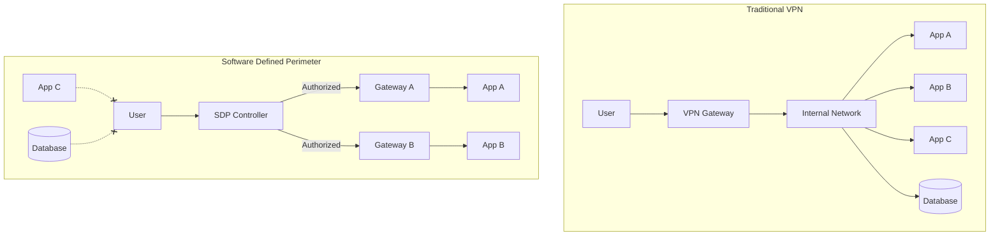
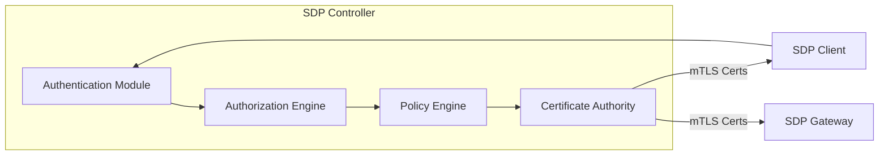
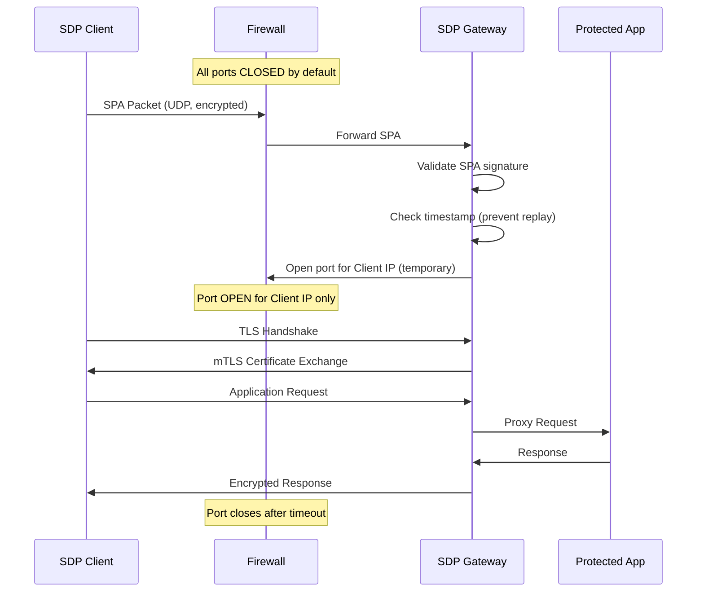
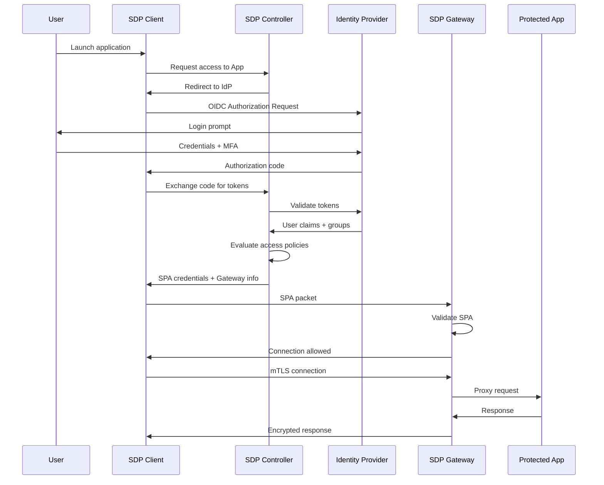
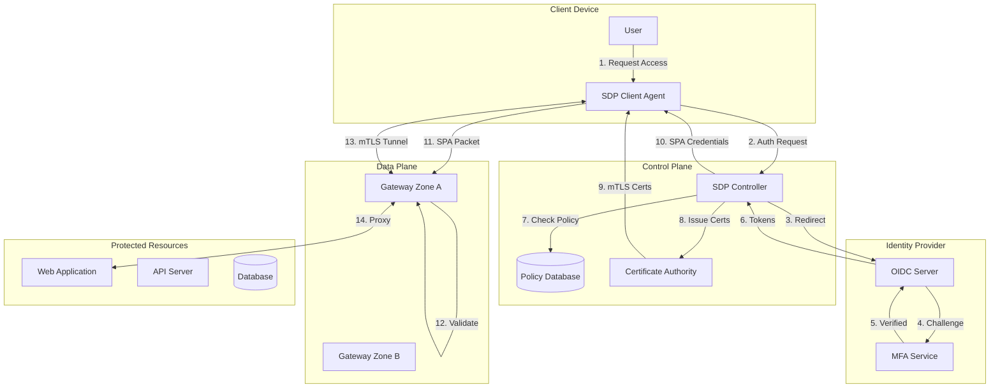
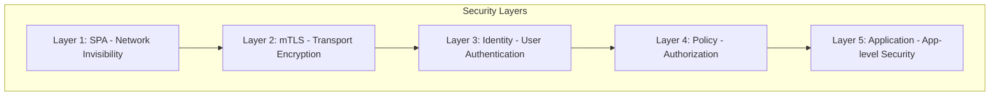

# How to Implement Software Defined Perimeter

Author: [nawazdhandala](https://github.com/nawazdhandala)

Tags: SDP, ZeroTrust, Networking, Security

Description: A comprehensive guide to implementing Software Defined Perimeter for zero trust network access with practical examples and code.

---

Traditional network security relies on perimeter defenses like firewalls and VPNs. Once you're inside the network, you can access everything. That model is fundamentally broken. Software Defined Perimeter (SDP) flips this on its head by making all resources invisible until a user proves their identity and authorization.

## What is Software Defined Perimeter?

SDP creates a "dark" network where no resources are discoverable or accessible until explicit trust is established. Unlike VPNs that grant broad network access, SDP provides granular, identity-based access to specific applications.



## SDP Architecture Components

An SDP implementation consists of three core components that work together to enforce zero trust access.

### 1. SDP Controller

The brain of the system. It handles authentication, authorization, and orchestrates connections between clients and gateways.



### 2. SDP Gateway

The enforcement point that protects applications. It only accepts connections from authenticated clients with valid certificates.

### 3. SDP Client

Software installed on user devices that handles authentication, receives dynamic access policies, and establishes secure tunnels to gateways.

## Single Packet Authorization (SPA)

SPA is the secret sauce that makes SDP resources truly invisible. Before any TCP connection can be established, the client must send a cryptographically signed UDP packet to "knock" on the gateway.



### SPA Packet Structure

```python
# SPA packet implementation example
import hashlib
import hmac
import json
import time
import socket
import struct

class SPAPacket:
    """
    Single Packet Authorization implementation.
    Creates cryptographically signed packets for SDP gateway authentication.
    """

    def __init__(self, shared_secret: bytes, client_id: str):
        self.shared_secret = shared_secret
        self.client_id = client_id

    def create_packet(self, destination_service: str) -> bytes:
        """
        Create a signed SPA packet.

        Args:
            destination_service: The service identifier the client wants to access

        Returns:
            Encrypted and signed SPA packet bytes
        """
        # Build packet payload with timestamp to prevent replay attacks
        payload = {
            "client_id": self.client_id,
            "timestamp": int(time.time()),
            "nonce": hashlib.sha256(str(time.time_ns()).encode()).hexdigest()[:16],
            "requested_service": destination_service,
            "protocol": "tcp",
            "port": 443
        }

        payload_bytes = json.dumps(payload, separators=(",", ":")).encode()

        # Create HMAC signature using shared secret
        signature = hmac.new(
            self.shared_secret,
            payload_bytes,
            hashlib.sha256
        ).digest()

        # Packet format: [4 bytes length][payload][32 bytes signature]
        packet = struct.pack(">I", len(payload_bytes)) + payload_bytes + signature

        return packet

    def send_spa(self, gateway_host: str, gateway_port: int, service: str) -> bool:
        """
        Send SPA packet to gateway.

        Args:
            gateway_host: Gateway hostname or IP
            gateway_port: Gateway SPA listening port (UDP)
            service: Service identifier to request access to

        Returns:
            True if packet was sent successfully
        """
        packet = self.create_packet(service)

        # Use UDP for SPA - connectionless, harder to fingerprint
        sock = socket.socket(socket.AF_INET, socket.SOCK_DGRAM)
        try:
            sock.sendto(packet, (gateway_host, gateway_port))
            return True
        finally:
            sock.close()


# Example usage
if __name__ == "__main__":
    # Initialize SPA client with shared secret from controller
    spa_client = SPAPacket(
        shared_secret=b"your-256-bit-shared-secret-here!",
        client_id="user@example.com"
    )

    # Send SPA to unlock access to the web application
    spa_client.send_spa(
        gateway_host="gateway.example.com",
        gateway_port=62201,  # Standard SPA port
        service="web-app-production"
    )
```

## Controller and Gateway Deployment

### Deploying the SDP Controller

The controller should be highly available and is the only component that needs to be publicly reachable for initial authentication.

```yaml
# kubernetes/sdp-controller.yaml
# SDP Controller deployment with high availability configuration

apiVersion: apps/v1
kind: Deployment
metadata:
  name: sdp-controller
  namespace: sdp-system
  labels:
    app: sdp-controller
    component: control-plane
spec:
  replicas: 3  # High availability across zones
  selector:
    matchLabels:
      app: sdp-controller
  template:
    metadata:
      labels:
        app: sdp-controller
    spec:
      # Spread across availability zones for resilience
      topologySpreadConstraints:
        - maxSkew: 1
          topologyKey: topology.kubernetes.io/zone
          whenUnsatisfiable: DoNotSchedule
          labelSelector:
            matchLabels:
              app: sdp-controller
      containers:
        - name: controller
          image: sdp/controller:v2.1.0
          ports:
            - containerPort: 443
              name: https
            - containerPort: 8443
              name: admin
          env:
            # Database connection for policy and session storage
            - name: DATABASE_URL
              valueFrom:
                secretKeyRef:
                  name: sdp-secrets
                  key: database-url
            # Identity provider configuration
            - name: OIDC_ISSUER
              value: "https://auth.example.com"
            - name: OIDC_CLIENT_ID
              valueFrom:
                secretKeyRef:
                  name: sdp-secrets
                  key: oidc-client-id
          volumeMounts:
            # Mount CA certificates for mTLS
            - name: ca-certs
              mountPath: /etc/sdp/certs
              readOnly: true
            # Mount policy configuration
            - name: policies
              mountPath: /etc/sdp/policies
          resources:
            requests:
              cpu: "500m"
              memory: "512Mi"
            limits:
              cpu: "2000m"
              memory: "2Gi"
          # Health checks for load balancer
          livenessProbe:
            httpGet:
              path: /health
              port: 8443
              scheme: HTTPS
            initialDelaySeconds: 10
            periodSeconds: 10
          readinessProbe:
            httpGet:
              path: /ready
              port: 8443
              scheme: HTTPS
            initialDelaySeconds: 5
            periodSeconds: 5
      volumes:
        - name: ca-certs
          secret:
            secretName: sdp-ca-certificates
        - name: policies
          configMap:
            name: sdp-policies
---
apiVersion: v1
kind: Service
metadata:
  name: sdp-controller
  namespace: sdp-system
spec:
  selector:
    app: sdp-controller
  ports:
    - port: 443
      targetPort: 443
      name: https
  type: LoadBalancer
```

### Deploying SDP Gateways

Gateways are deployed close to the applications they protect. Each gateway only knows about the services it is authorized to proxy.

```yaml
# kubernetes/sdp-gateway.yaml
# SDP Gateway deployment for protecting backend services

apiVersion: apps/v1
kind: Deployment
metadata:
  name: sdp-gateway-production
  namespace: sdp-system
  labels:
    app: sdp-gateway
    environment: production
spec:
  replicas: 2
  selector:
    matchLabels:
      app: sdp-gateway
      environment: production
  template:
    metadata:
      labels:
        app: sdp-gateway
        environment: production
    spec:
      containers:
        - name: gateway
          image: sdp/gateway:v2.1.0
          ports:
            # SPA listening port - UDP only
            - containerPort: 62201
              protocol: UDP
              name: spa
            # mTLS proxy port - only opens after valid SPA
            - containerPort: 8443
              protocol: TCP
              name: mtls
          env:
            # Controller URL for policy updates
            - name: CONTROLLER_URL
              value: "https://sdp-controller.sdp-system.svc:443"
            # Gateway identity for controller authentication
            - name: GATEWAY_ID
              valueFrom:
                fieldRef:
                  fieldPath: metadata.name
            # Shared secret for SPA validation
            - name: SPA_SECRET
              valueFrom:
                secretKeyRef:
                  name: sdp-gateway-secrets
                  key: spa-shared-secret
          volumeMounts:
            - name: gateway-certs
              mountPath: /etc/sdp/certs
              readOnly: true
          securityContext:
            # Run as non-root for security
            runAsNonRoot: true
            runAsUser: 1000
            capabilities:
              drop:
                - ALL
              add:
                # Required for binding to low ports if needed
                - NET_BIND_SERVICE
          resources:
            requests:
              cpu: "250m"
              memory: "256Mi"
            limits:
              cpu: "1000m"
              memory: "1Gi"
      volumes:
        - name: gateway-certs
          secret:
            secretName: sdp-gateway-certificates
---
# Service for SPA packets - UDP
apiVersion: v1
kind: Service
metadata:
  name: sdp-gateway-spa
  namespace: sdp-system
spec:
  selector:
    app: sdp-gateway
    environment: production
  ports:
    - port: 62201
      targetPort: 62201
      protocol: UDP
      name: spa
  type: LoadBalancer
```

## Integration with Identity Providers

SDP controllers integrate with identity providers using OIDC or SAML for authentication. This enables SSO and leverages existing identity infrastructure.



### OIDC Integration Configuration

```python
# sdp_controller/auth/oidc.py
# OIDC integration for SDP Controller authentication

from dataclasses import dataclass
from typing import Optional, List
import httpx
import jwt
from jwt import PyJWKClient

@dataclass
class UserClaims:
    """User identity claims from OIDC provider."""
    subject: str
    email: str
    groups: List[str]
    name: str
    mfa_verified: bool

class OIDCAuthenticator:
    """
    Handles OIDC authentication flow for SDP Controller.
    Validates tokens and extracts user claims for policy decisions.
    """

    def __init__(
        self,
        issuer: str,
        client_id: str,
        client_secret: str,
        redirect_uri: str
    ):
        self.issuer = issuer
        self.client_id = client_id
        self.client_secret = client_secret
        self.redirect_uri = redirect_uri

        # Fetch OIDC discovery document
        self._discovery = self._fetch_discovery()

        # Initialize JWKS client for token validation
        self._jwks_client = PyJWKClient(self._discovery["jwks_uri"])

    def _fetch_discovery(self) -> dict:
        """Fetch OIDC discovery document from issuer."""
        discovery_url = f"{self.issuer}/.well-known/openid-configuration"
        response = httpx.get(discovery_url)
        response.raise_for_status()
        return response.json()

    def get_authorization_url(self, state: str, nonce: str) -> str:
        """
        Generate OIDC authorization URL for user redirect.

        Args:
            state: Random state for CSRF protection
            nonce: Random nonce for replay protection

        Returns:
            Authorization URL to redirect user to
        """
        params = {
            "client_id": self.client_id,
            "response_type": "code",
            "scope": "openid email profile groups",
            "redirect_uri": self.redirect_uri,
            "state": state,
            "nonce": nonce,
            # Request MFA if available
            "acr_values": "urn:mfa"
        }

        auth_endpoint = self._discovery["authorization_endpoint"]
        query_string = "&".join(f"{k}={v}" for k, v in params.items())
        return f"{auth_endpoint}?{query_string}"

    def exchange_code(self, code: str) -> dict:
        """
        Exchange authorization code for tokens.

        Args:
            code: Authorization code from IdP callback

        Returns:
            Token response containing id_token and access_token
        """
        token_endpoint = self._discovery["token_endpoint"]

        response = httpx.post(
            token_endpoint,
            data={
                "grant_type": "authorization_code",
                "client_id": self.client_id,
                "client_secret": self.client_secret,
                "code": code,
                "redirect_uri": self.redirect_uri
            }
        )
        response.raise_for_status()
        return response.json()

    def validate_token(self, id_token: str, nonce: str) -> UserClaims:
        """
        Validate ID token and extract user claims.

        Args:
            id_token: JWT ID token from IdP
            nonce: Expected nonce value

        Returns:
            Validated user claims

        Raises:
            ValueError: If token validation fails
        """
        # Get signing key from JWKS
        signing_key = self._jwks_client.get_signing_key_from_jwt(id_token)

        # Decode and validate token
        claims = jwt.decode(
            id_token,
            signing_key.key,
            algorithms=["RS256"],
            audience=self.client_id,
            issuer=self.issuer,
            options={"require": ["exp", "iat", "nonce", "sub"]}
        )

        # Verify nonce to prevent replay attacks
        if claims.get("nonce") != nonce:
            raise ValueError("Invalid nonce in token")

        # Check if MFA was performed
        acr = claims.get("acr", "")
        mfa_verified = "mfa" in acr.lower()

        return UserClaims(
            subject=claims["sub"],
            email=claims.get("email", ""),
            groups=claims.get("groups", []),
            name=claims.get("name", ""),
            mfa_verified=mfa_verified
        )


# Policy evaluation based on user claims
class PolicyEngine:
    """
    Evaluates access policies based on user claims.
    Determines which services a user can access.
    """

    def __init__(self, policies: dict):
        self.policies = policies

    def evaluate(self, user: UserClaims, requested_service: str) -> bool:
        """
        Check if user is authorized to access the requested service.

        Args:
            user: Authenticated user claims
            requested_service: Service identifier being requested

        Returns:
            True if access is granted, False otherwise
        """
        service_policy = self.policies.get(requested_service)

        if not service_policy:
            # No policy means deny by default (zero trust)
            return False

        # Check if MFA is required
        if service_policy.get("require_mfa", False) and not user.mfa_verified:
            return False

        # Check group membership
        allowed_groups = service_policy.get("allowed_groups", [])
        if allowed_groups:
            if not any(g in allowed_groups for g in user.groups):
                return False

        # Check email domain restrictions
        allowed_domains = service_policy.get("allowed_domains", [])
        if allowed_domains:
            email_domain = user.email.split("@")[-1] if "@" in user.email else ""
            if email_domain not in allowed_domains:
                return False

        return True


# Example policy configuration
EXAMPLE_POLICIES = {
    "production-api": {
        "require_mfa": True,
        "allowed_groups": ["engineering", "devops"],
        "allowed_domains": ["example.com"]
    },
    "staging-api": {
        "require_mfa": False,
        "allowed_groups": ["engineering", "devops", "qa"],
        "allowed_domains": ["example.com"]
    },
    "admin-dashboard": {
        "require_mfa": True,
        "allowed_groups": ["platform-admins"],
        "allowed_domains": ["example.com"]
    }
}
```

## Complete SDP Flow

Here is the complete flow from user request to application access.



## Gateway SPA Validation Implementation

```python
# sdp_gateway/spa_handler.py
# Server-side SPA packet validation for SDP Gateway

import asyncio
import hashlib
import hmac
import json
import struct
import time
from dataclasses import dataclass
from typing import Optional, Dict, Set
import logging

logger = logging.getLogger(__name__)

@dataclass
class SPAValidationResult:
    """Result of SPA packet validation."""
    valid: bool
    client_id: Optional[str] = None
    requested_service: Optional[str] = None
    source_ip: Optional[str] = None
    error: Optional[str] = None

class SPAValidator:
    """
    Validates incoming SPA packets and manages temporary firewall rules.
    Implements replay protection and automatic rule expiration.
    """

    def __init__(
        self,
        shared_secret: bytes,
        allowed_services: Set[str],
        time_window_seconds: int = 60,
        rule_ttl_seconds: int = 30
    ):
        self.shared_secret = shared_secret
        self.allowed_services = allowed_services
        self.time_window = time_window_seconds
        self.rule_ttl = rule_ttl_seconds

        # Track seen nonces to prevent replay attacks
        self._seen_nonces: Dict[str, float] = {}

        # Active firewall rules: client_ip -> expiration_time
        self._active_rules: Dict[str, float] = {}

    def validate_packet(self, packet: bytes, source_ip: str) -> SPAValidationResult:
        """
        Validate an incoming SPA packet.

        Args:
            packet: Raw SPA packet bytes
            source_ip: Source IP address of the packet

        Returns:
            Validation result with client info if valid
        """
        try:
            # Parse packet structure
            if len(packet) < 36:  # Minimum: 4 bytes length + 32 bytes signature
                return SPAValidationResult(valid=False, error="Packet too short")

            # Extract components
            payload_length = struct.unpack(">I", packet[:4])[0]
            payload_bytes = packet[4:4 + payload_length]
            signature = packet[4 + payload_length:4 + payload_length + 32]

            # Verify HMAC signature
            expected_signature = hmac.new(
                self.shared_secret,
                payload_bytes,
                hashlib.sha256
            ).digest()

            if not hmac.compare_digest(signature, expected_signature):
                logger.warning(f"Invalid SPA signature from {source_ip}")
                return SPAValidationResult(valid=False, error="Invalid signature")

            # Parse payload
            payload = json.loads(payload_bytes.decode())

            # Check timestamp (prevent replay of old packets)
            packet_time = payload.get("timestamp", 0)
            current_time = int(time.time())

            if abs(current_time - packet_time) > self.time_window:
                logger.warning(f"SPA timestamp out of window from {source_ip}")
                return SPAValidationResult(valid=False, error="Timestamp expired")

            # Check nonce (prevent replay within time window)
            nonce = payload.get("nonce")
            if nonce in self._seen_nonces:
                logger.warning(f"SPA nonce replay detected from {source_ip}")
                return SPAValidationResult(valid=False, error="Nonce already used")

            # Store nonce with expiration
            self._seen_nonces[nonce] = current_time + self.time_window

            # Verify requested service is allowed on this gateway
            requested_service = payload.get("requested_service")
            if requested_service not in self.allowed_services:
                logger.warning(
                    f"SPA for unauthorized service {requested_service} from {source_ip}"
                )
                return SPAValidationResult(
                    valid=False,
                    error="Service not available on this gateway"
                )

            logger.info(
                f"Valid SPA from {source_ip} for service {requested_service}"
            )

            return SPAValidationResult(
                valid=True,
                client_id=payload.get("client_id"),
                requested_service=requested_service,
                source_ip=source_ip
            )

        except (json.JSONDecodeError, struct.error, KeyError) as e:
            logger.error(f"SPA parsing error from {source_ip}: {e}")
            return SPAValidationResult(valid=False, error="Malformed packet")

    async def add_firewall_rule(self, client_ip: str):
        """
        Add temporary firewall rule to allow connections from client IP.

        Args:
            client_ip: IP address to allow
        """
        expiration = time.time() + self.rule_ttl
        self._active_rules[client_ip] = expiration

        # In production, this would call iptables/nftables
        logger.info(f"Firewall rule added for {client_ip}, expires in {self.rule_ttl}s")

        # Schedule rule removal
        asyncio.create_task(self._remove_rule_after_ttl(client_ip))

    async def _remove_rule_after_ttl(self, client_ip: str):
        """Remove firewall rule after TTL expires."""
        await asyncio.sleep(self.rule_ttl)

        if client_ip in self._active_rules:
            del self._active_rules[client_ip]
            logger.info(f"Firewall rule removed for {client_ip}")

    def is_connection_allowed(self, client_ip: str) -> bool:
        """
        Check if a TCP connection from client_ip is allowed.

        Args:
            client_ip: Source IP of incoming connection

        Returns:
            True if there is an active rule for this IP
        """
        if client_ip not in self._active_rules:
            return False

        # Check if rule has expired
        if time.time() > self._active_rules[client_ip]:
            del self._active_rules[client_ip]
            return False

        return True

    def cleanup_expired_nonces(self):
        """Remove expired nonces from tracking set."""
        current_time = time.time()
        expired = [
            nonce for nonce, expiry in self._seen_nonces.items()
            if expiry < current_time
        ]
        for nonce in expired:
            del self._seen_nonces[nonce]


# UDP server for receiving SPA packets
class SPAServer:
    """
    Asyncio UDP server for receiving and processing SPA packets.
    """

    def __init__(self, validator: SPAValidator, bind_address: str, bind_port: int):
        self.validator = validator
        self.bind_address = bind_address
        self.bind_port = bind_port

    async def start(self):
        """Start the SPA UDP server."""
        loop = asyncio.get_event_loop()

        transport, protocol = await loop.create_datagram_endpoint(
            lambda: SPAProtocol(self.validator),
            local_addr=(self.bind_address, self.bind_port)
        )

        logger.info(f"SPA server listening on {self.bind_address}:{self.bind_port}")

        return transport


class SPAProtocol(asyncio.DatagramProtocol):
    """Asyncio protocol for handling SPA UDP packets."""

    def __init__(self, validator: SPAValidator):
        self.validator = validator

    def datagram_received(self, data: bytes, addr: tuple):
        """Handle incoming SPA packet."""
        source_ip = addr[0]

        result = self.validator.validate_packet(data, source_ip)

        if result.valid:
            # Add firewall rule to allow TCP connection
            asyncio.create_task(self.validator.add_firewall_rule(source_ip))
```

## Monitoring and Observability

SDP systems generate security-critical logs and metrics. Proper observability is essential for detecting attacks and troubleshooting access issues.

```yaml
# kubernetes/sdp-monitoring.yaml
# Prometheus monitoring for SDP components

apiVersion: monitoring.coreos.com/v1
kind: ServiceMonitor
metadata:
  name: sdp-controller-monitor
  namespace: sdp-system
spec:
  selector:
    matchLabels:
      app: sdp-controller
  endpoints:
    - port: metrics
      interval: 15s
      path: /metrics
---
apiVersion: monitoring.coreos.com/v1
kind: PrometheusRule
metadata:
  name: sdp-alerts
  namespace: sdp-system
spec:
  groups:
    - name: sdp.rules
      rules:
        # Alert on high SPA rejection rate
        - alert: HighSPARejectionRate
          expr: |
            rate(sdp_spa_validations_failed_total[5m]) /
            rate(sdp_spa_validations_total[5m]) > 0.1
          for: 5m
          labels:
            severity: warning
          annotations:
            summary: "High SPA packet rejection rate"
            description: "More than 10% of SPA packets are being rejected"

        # Alert on authentication failures
        - alert: HighAuthFailureRate
          expr: |
            rate(sdp_auth_failures_total[5m]) > 10
          for: 5m
          labels:
            severity: critical
          annotations:
            summary: "High authentication failure rate"
            description: "Possible brute force attack detected"

        # Alert on controller unavailability
        - alert: SDPControllerDown
          expr: up{job="sdp-controller"} == 0
          for: 1m
          labels:
            severity: critical
          annotations:
            summary: "SDP Controller is down"
            description: "Users cannot authenticate to access protected resources"
```

## Security Best Practices

### 1. Defense in Depth



### 2. Certificate Management

```python
# sdp_controller/pki/certificate_manager.py
# Short-lived certificate management for SDP

from cryptography import x509
from cryptography.x509.oid import NameOID
from cryptography.hazmat.primitives import hashes, serialization
from cryptography.hazmat.primitives.asymmetric import rsa
from datetime import datetime, timedelta
import uuid

class CertificateManager:
    """
    Manages short-lived certificates for SDP mTLS connections.
    Certificates are valid for only 1 hour to minimize exposure.
    """

    def __init__(self, ca_key, ca_cert):
        self.ca_key = ca_key
        self.ca_cert = ca_cert

    def issue_client_certificate(
        self,
        client_id: str,
        validity_hours: int = 1
    ) -> tuple:
        """
        Issue a short-lived client certificate for mTLS.

        Args:
            client_id: Unique client identifier (usually email)
            validity_hours: Certificate validity period

        Returns:
            Tuple of (private_key_pem, certificate_pem)
        """
        # Generate client key pair
        client_key = rsa.generate_private_key(
            public_exponent=65537,
            key_size=2048
        )

        # Build certificate with client identity
        subject = x509.Name([
            x509.NameAttribute(NameOID.COMMON_NAME, client_id),
            x509.NameAttribute(NameOID.ORGANIZATION_NAME, "SDP Client"),
            x509.NameAttribute(NameOID.SERIAL_NUMBER, str(uuid.uuid4()))
        ])

        cert = (
            x509.CertificateBuilder()
            .subject_name(subject)
            .issuer_name(self.ca_cert.subject)
            .public_key(client_key.public_key())
            .serial_number(x509.random_serial_number())
            .not_valid_before(datetime.utcnow())
            .not_valid_after(datetime.utcnow() + timedelta(hours=validity_hours))
            .add_extension(
                x509.KeyUsage(
                    digital_signature=True,
                    key_encipherment=True,
                    content_commitment=False,
                    data_encipherment=False,
                    key_agreement=False,
                    key_cert_sign=False,
                    crl_sign=False,
                    encipher_only=False,
                    decipher_only=False
                ),
                critical=True
            )
            .add_extension(
                x509.ExtendedKeyUsage([x509.oid.ExtendedKeyUsageOID.CLIENT_AUTH]),
                critical=False
            )
            .sign(self.ca_key, hashes.SHA256())
        )

        # Serialize to PEM format
        key_pem = client_key.private_bytes(
            encoding=serialization.Encoding.PEM,
            format=serialization.PrivateFormat.PKCS8,
            encryption_algorithm=serialization.NoEncryption()
        )

        cert_pem = cert.public_bytes(serialization.Encoding.PEM)

        return key_pem, cert_pem
```

### 3. Audit Logging

Every access attempt should be logged for security analysis and compliance.

```python
# sdp_controller/audit/logger.py
# Structured audit logging for SDP events

import json
import logging
from datetime import datetime
from typing import Optional
from dataclasses import dataclass, asdict

@dataclass
class AuditEvent:
    """Structured audit log event."""
    timestamp: str
    event_type: str
    client_id: str
    source_ip: str
    requested_resource: str
    decision: str  # "allow" or "deny"
    reason: Optional[str] = None
    session_id: Optional[str] = None
    user_agent: Optional[str] = None

    def to_json(self) -> str:
        return json.dumps(asdict(self), default=str)

class AuditLogger:
    """
    Logs all access decisions for security monitoring and compliance.
    """

    def __init__(self):
        self.logger = logging.getLogger("sdp.audit")
        self.logger.setLevel(logging.INFO)

    def log_authentication(
        self,
        client_id: str,
        source_ip: str,
        success: bool,
        reason: Optional[str] = None
    ):
        """Log authentication attempt."""
        event = AuditEvent(
            timestamp=datetime.utcnow().isoformat(),
            event_type="authentication",
            client_id=client_id,
            source_ip=source_ip,
            requested_resource="controller",
            decision="allow" if success else "deny",
            reason=reason
        )
        self.logger.info(event.to_json())

    def log_access_decision(
        self,
        client_id: str,
        source_ip: str,
        resource: str,
        allowed: bool,
        reason: str,
        session_id: str
    ):
        """Log resource access decision."""
        event = AuditEvent(
            timestamp=datetime.utcnow().isoformat(),
            event_type="access_decision",
            client_id=client_id,
            source_ip=source_ip,
            requested_resource=resource,
            decision="allow" if allowed else "deny",
            reason=reason,
            session_id=session_id
        )
        self.logger.info(event.to_json())

    def log_spa_validation(
        self,
        source_ip: str,
        valid: bool,
        client_id: Optional[str] = None,
        error: Optional[str] = None
    ):
        """Log SPA packet validation."""
        event = AuditEvent(
            timestamp=datetime.utcnow().isoformat(),
            event_type="spa_validation",
            client_id=client_id or "unknown",
            source_ip=source_ip,
            requested_resource="gateway",
            decision="allow" if valid else "deny",
            reason=error
        )
        self.logger.info(event.to_json())
```

## Comparison with Traditional VPN

| Feature | Traditional VPN | Software Defined Perimeter |
|---------|----------------|---------------------------|
| Network Visibility | All resources visible after connect | Resources invisible until authorized |
| Access Scope | Broad network access | Per-application access |
| Attack Surface | Large (entire network) | Minimal (only authorized apps) |
| Lateral Movement | Easy once inside | Prevented by design |
| Authentication | Once at connection | Continuous verification |
| Policy Enforcement | Network-level | Application-level |
| Scalability | VPN concentrator bottleneck | Distributed gateways |
| Cloud Native | Difficult | Native support |

---

Software Defined Perimeter represents the future of secure access. By making resources invisible by default, requiring cryptographic proof before any connection, and providing granular per-application access, SDP implements true zero trust networking. Start with your most sensitive applications and expand from there. The investment in SDP pays dividends in reduced attack surface and improved security posture.
