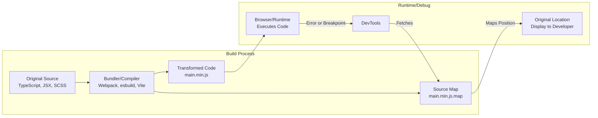
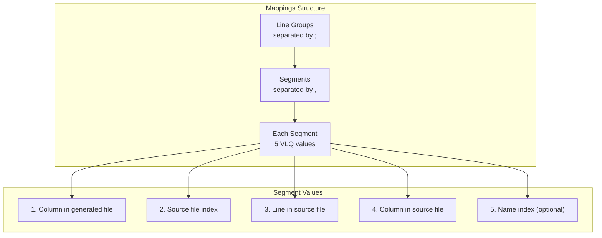
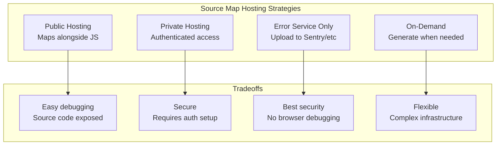
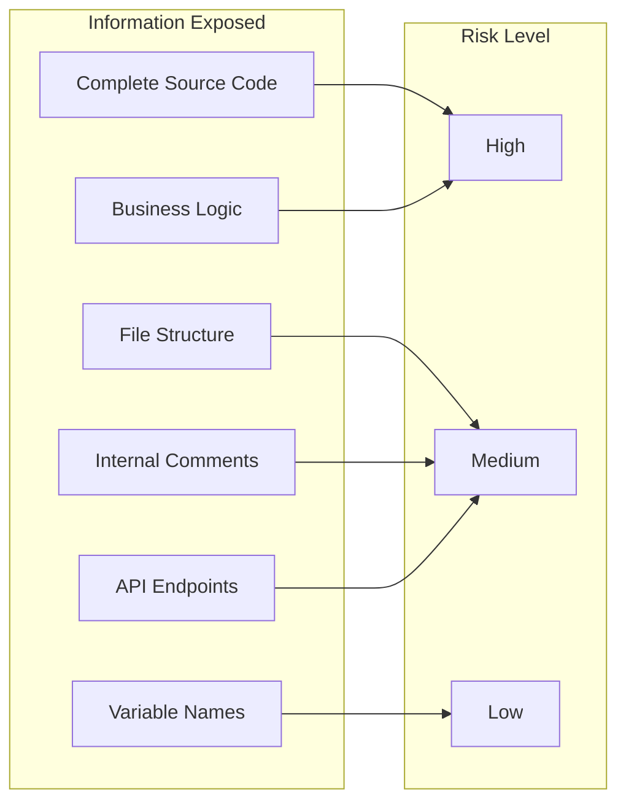

# How to Implement Source Maps

Author: [nawazdhandala](https://github.com/nawazdhandala)

Tags: Developer Experience, Source Maps, Debugging, JavaScript

Description: Learn to implement source maps for debugging transpiled code with generation, hosting, and security considerations for production debugging.

---

> You write TypeScript, React JSX, or SCSS. Your users run minified, bundled JavaScript and CSS. When errors occur in production, stack traces point to line 1, column 45823 of `main.min.js`. **Source maps bridge this gap - they let you debug the code you wrote, not the code that runs.**

Modern web development involves multiple transformation steps: TypeScript compilation, JSX transformation, module bundling, tree shaking, and minification. Each step takes you further from your original source. Source maps are the debugging lifeline that maps runtime errors back to your actual code.

This guide covers everything you need to implement source maps effectively - from understanding the format and generating them with popular bundlers, to hosting strategies and security considerations for production environments.

---

## Table of Contents

1. What Are Source Maps and Why They Matter
2. How Source Maps Work
3. The Source Map Format (V3)
4. Generating Source Maps with Bundlers
5. Hosting Strategies
6. Security Considerations
7. Debugging Workflow
8. Common Issues and Troubleshooting
9. Best Practices Summary

---

## 1. What Are Source Maps and Why They Matter

Source maps are JSON files that contain mappings between your transformed (compiled, minified, bundled) code and the original source code. They enable:

| Capability | Without Source Maps | With Source Maps |
|------------|---------------------|------------------|
| Error stack traces | `main.min.js:1:45823` | `UserAuth.ts:47:12` |
| Debugger breakpoints | Set in minified code | Set in original TypeScript/JSX |
| Variable inspection | `a`, `b`, `c` (mangled) | `userId`, `authToken`, `config` |
| Step-through debugging | Jumps through unreadable code | Follows your actual logic |

Without source maps, debugging production issues becomes archaeology - deciphering minified variable names and reconstructing logic from compressed code. With source maps, you debug as if running your original source.

---

## 2. How Source Maps Work

The source map system involves three components working together:



The flow works as follows:

1. **Build time**: Your bundler processes source files and generates both the transformed output and a source map file
2. **Linking**: The transformed file includes a special comment pointing to its source map
3. **Runtime**: When an error occurs or you set a breakpoint, DevTools fetches the source map
4. **Mapping**: DevTools uses the mappings to translate positions back to original source

The linking comment appears at the end of your JavaScript file:

```javascript
// Your minified code here...
//# sourceMappingURL=main.min.js.map
```

Or for CSS:

```css
/* Your minified CSS here... */
/*# sourceMappingURL=styles.min.css.map */
```

---

## 3. The Source Map Format (V3)

Source maps follow the V3 specification. Understanding the format helps when debugging source map issues or building custom tooling.

### Basic Structure

```json
{
  "version": 3,
  "file": "main.min.js",
  "sourceRoot": "",
  "sources": [
    "src/utils/auth.ts",
    "src/components/Login.tsx",
    "src/api/client.ts"
  ],
  "sourcesContent": [
    "// Content of auth.ts...",
    "// Content of Login.tsx...",
    "// Content of client.ts..."
  ],
  "names": [
    "authenticateUser",
    "validateToken",
    "userId",
    "authConfig"
  ],
  "mappings": "AAAA,SAAS,gBAAgB..."
}
```

### Field Descriptions

| Field | Purpose | Example |
|-------|---------|---------|
| `version` | Source map spec version (always 3) | `3` |
| `file` | Name of the generated file | `"main.min.js"` |
| `sourceRoot` | Base path prepended to `sources` entries | `"/src/"` |
| `sources` | Array of original source file paths | `["auth.ts", "login.tsx"]` |
| `sourcesContent` | Original source code (optional but recommended) | Full file contents |
| `names` | Array of identifier names used in mappings | `["userId", "login"]` |
| `mappings` | Base64 VLQ encoded position mappings | `"AAAA,SAAS..."` |

### The Mappings Field

The `mappings` field is the core of source maps. It uses Base64 VLQ (Variable Length Quantity) encoding to compress position data. Each segment maps a position in the generated file to the original source.



A decoded mapping segment like `AAAA` means:
- Column 0 in generated file
- Source file index 0
- Line 0 in source
- Column 0 in source

Real mappings combine many such segments to create a complete position map.

---

## 4. Generating Source Maps with Bundlers

Each bundler has its own configuration for source maps. Here are the most common setups:

### Webpack

```javascript
// webpack.config.js
module.exports = {
  mode: 'production',

  // Development - fast rebuilds, good quality maps
  devtool: 'eval-source-map',

  // Production - separate files, full quality
  // devtool: 'source-map',

  // Production alternative - hidden from browser, for error tracking
  // devtool: 'hidden-source-map',

  output: {
    filename: '[name].[contenthash].js',
    path: path.resolve(__dirname, 'dist'),

    // Control the sourceMappingURL comment
    sourceMapFilename: '[name].[contenthash].js.map',
  },

  // For TypeScript projects
  module: {
    rules: [
      {
        test: /\.tsx?$/,
        use: 'ts-loader',
        exclude: /node_modules/,
      },
    ],
  },
};
```

Webpack devtool options explained:

| Option | Build Speed | Quality | Use Case |
|--------|------------|---------|----------|
| `eval` | Fastest | Low | Development only |
| `eval-source-map` | Fast | High | Development |
| `source-map` | Slow | Highest | Production with public maps |
| `hidden-source-map` | Slow | Highest | Production with private maps |
| `nosources-source-map` | Slow | Medium | Production - no source content |

### Vite / Rollup

```javascript
// vite.config.js
import { defineConfig } from 'vite';

export default defineConfig({
  build: {
    // Generate source maps for production
    sourcemap: true,

    // Options: true | false | 'inline' | 'hidden'
    // 'hidden' - generates maps but no sourceMappingURL comment

    rollupOptions: {
      output: {
        // Control source map file names
        sourcemapFileNames: '[name]-[hash].js.map',
      },
    },
  },
});
```

### esbuild

```javascript
// esbuild.config.js
import * as esbuild from 'esbuild';

await esbuild.build({
  entryPoints: ['src/index.ts'],
  bundle: true,
  minify: true,

  // Source map options
  sourcemap: true,           // External .map file
  // sourcemap: 'inline',    // Embedded in JS file
  // sourcemap: 'external',  // Same as true
  // sourcemap: 'linked',    // External with sourceMappingURL
  // sourcemap: 'both',      // Both inline and external

  // Include original source content
  sourcesContent: true,

  outfile: 'dist/bundle.js',
});
```

### TypeScript (tsc)

```json
// tsconfig.json
{
  "compilerOptions": {
    "sourceMap": true,
    "inlineSources": true,
    "declarationMap": true,

    "outDir": "./dist",
    "rootDir": "./src",

    // Helps with path resolution in maps
    "baseUrl": ".",
    "paths": {
      "@/*": ["src/*"]
    }
  }
}
```

### CSS Preprocessors

For Sass/SCSS:

```javascript
// Using sass directly
import * as sass from 'sass';

const result = sass.compile('src/styles/main.scss', {
  sourceMap: true,
  sourceMapIncludeSources: true,
});

// Write the CSS and source map
fs.writeFileSync('dist/styles.css', result.css);
fs.writeFileSync('dist/styles.css.map', JSON.stringify(result.sourceMap));
```

For PostCSS:

```javascript
// postcss.config.js
module.exports = {
  map: {
    inline: false,        // Separate .map file
    sourcesContent: true, // Include original source
    annotation: true,     // Add sourceMappingURL comment
  },
  plugins: [
    require('autoprefixer'),
    require('cssnano'),
  ],
};
```

---

## 5. Hosting Strategies

How you host source maps affects both debugging capability and security. Choose based on your security requirements and debugging workflow.



### Strategy 1: Public Hosting (Development/Internal Tools)

Deploy source maps alongside your JavaScript files:

```
dist/
  main.abc123.js
  main.abc123.js.map
  vendor.def456.js
  vendor.def456.js.map
```

**Nginx configuration:**

```nginx
location ~* \.map$ {
    # Allow for internal networks only
    allow 10.0.0.0/8;
    allow 192.168.0.0/16;
    deny all;

    # Or use basic auth
    # auth_basic "Source Maps";
    # auth_basic_user_file /etc/nginx/.htpasswd;
}
```

### Strategy 2: Hidden Source Maps

Generate maps but remove the `sourceMappingURL` comment from production builds:

```javascript
// webpack.config.js
module.exports = {
  devtool: 'hidden-source-map',
  // Generates .map files but no comment in JS
};
```

Then serve maps only to authenticated users or specific IPs:

```javascript
// Express middleware for source map access
app.use('*.map', (req, res, next) => {
  const clientIP = req.ip;
  const allowedIPs = process.env.ALLOWED_DEBUG_IPS?.split(',') || [];

  if (allowedIPs.includes(clientIP)) {
    next();
  } else {
    res.status(403).send('Forbidden');
  }
});
```

### Strategy 3: Upload to Error Tracking Service

Upload source maps to your error tracking service during deployment, but never serve them publicly:

```bash
#!/bin/bash
# deploy.sh - Upload source maps to Sentry

# Build with hidden source maps
npm run build

# Upload to Sentry
sentry-cli releases new "$VERSION"
sentry-cli releases files "$VERSION" upload-sourcemaps ./dist \
  --url-prefix '~/static/js' \
  --rewrite

# Delete source maps from deployment
find ./dist -name '*.map' -delete

# Deploy remaining files
rsync -av ./dist/ server:/var/www/app/
```

For other services:

```javascript
// upload-sourcemaps.js
import fetch from 'node-fetch';
import fs from 'fs';
import path from 'path';
import { glob } from 'glob';

async function uploadSourceMaps(apiKey, version) {
  const mapFiles = await glob('dist/**/*.map');

  for (const mapFile of mapFiles) {
    const jsFile = mapFile.replace('.map', '');
    const content = fs.readFileSync(mapFile, 'utf8');

    await fetch('https://your-error-service.com/api/sourcemaps', {
      method: 'POST',
      headers: {
        'Authorization': `Bearer ${apiKey}`,
        'Content-Type': 'application/json',
      },
      body: JSON.stringify({
        version,
        filename: path.basename(jsFile),
        sourcemap: content,
      }),
    });

    console.log(`Uploaded: ${mapFile}`);
  }
}

uploadSourceMaps(process.env.API_KEY, process.env.VERSION);
```

### Strategy 4: On-Demand Generation

Store source maps in a separate, secure location and fetch them only when debugging:

```javascript
// Chrome DevTools can load source maps from custom URLs
// Add this header to your JS files:
// SourceMap: https://internal-maps.company.com/v1/maps/main.abc123.js.map

// Server implementation
app.get('/v1/maps/:filename', authenticate, async (req, res) => {
  const { filename } = req.params;

  // Fetch from secure storage (S3, internal server, etc.)
  const sourceMap = await fetchFromSecureStorage(filename);

  if (sourceMap) {
    res.type('application/json').send(sourceMap);
  } else {
    res.status(404).send('Source map not found');
  }
});
```

---

## 6. Security Considerations

Source maps can expose your entire source code. Consider these security implications:

### What Source Maps Reveal



### Security Checklist

| Concern | Mitigation |
|---------|------------|
| Source code exposure | Use `hidden-source-map` or upload to error service only |
| Internal paths revealed | Set `sourceRoot` to mask real paths |
| Comments with secrets | Strip comments during build (security linting) |
| API keys in code | Never hardcode - use environment variables |
| Debugging in production | IP whitelist or authentication for map access |

### Removing Sensitive Content

Strip sensitive comments and paths:

```javascript
// webpack.config.js
const webpack = require('webpack');
const TerserPlugin = require('terser-webpack-plugin');

module.exports = {
  optimization: {
    minimizer: [
      new TerserPlugin({
        terserOptions: {
          format: {
            comments: false, // Remove all comments
          },
        },
        extractComments: false,
      }),
    ],
  },

  plugins: [
    // Replace source paths
    new webpack.SourceMapDevToolPlugin({
      filename: '[file].map',
      publicPath: 'https://internal-maps.company.com/',
      fileContext: 'src', // Strips 'src/' from paths
    }),
  ],
};
```

### nosources-source-map Option

Generate maps without including source content - provides stack trace mapping but not source viewing:

```javascript
// webpack.config.js
module.exports = {
  devtool: 'nosources-source-map',
  // Maps positions but sourcesContent is empty
};
```

This allows error tracking services to show original file names and line numbers without exposing actual code:

```
Error: User authentication failed
    at validateToken (src/auth/validator.ts:47:12)
    at authenticateUser (src/auth/service.ts:23:5)
    at handleLogin (src/routes/login.ts:15:20)
```

---

## 7. Debugging Workflow

With source maps properly configured, here is the typical debugging workflow:

### Browser DevTools

1. **Open DevTools** (F12 or Cmd+Option+I)
2. **Sources panel** shows original file structure
3. **Set breakpoints** in your TypeScript/JSX files
4. **Inspect variables** with original names
5. **Step through** your actual code logic

### Verifying Source Maps Load

Check the DevTools console for source map loading:

```javascript
// Add to your app to verify source map availability
console.log('Source map test - check DevTools Sources panel');

// Intentionally throw to test stack trace mapping
function testSourceMap() {
  throw new Error('Source map verification error');
}

// Call after page load
setTimeout(testSourceMap, 1000);
```

If source maps are working, the error should show your original file and line number.

### Manual Source Map Loading

If automatic loading fails, manually load source maps in Chrome:

1. Open DevTools Sources panel
2. Right-click in the file tree
3. Select "Add source map..."
4. Enter the URL to your .map file

### Node.js Debugging

Enable source map support for Node.js:

```bash
# Node.js 12+
node --enable-source-maps dist/server.js

# Or use the source-map-support package
```

```javascript
// At the top of your entry file
import 'source-map-support/register';

// Or for CommonJS
require('source-map-support').install();
```

---

## 8. Common Issues and Troubleshooting

### Source Map Not Loading

**Symptoms**: DevTools shows minified code, no original sources

**Checks**:

```javascript
// 1. Verify sourceMappingURL comment exists
// Look at the end of your bundled JS file:
//# sourceMappingURL=main.js.map

// 2. Check if map file is accessible
fetch('/path/to/main.js.map')
  .then(r => r.json())
  .then(map => console.log('Map loaded:', map.sources))
  .catch(err => console.error('Map failed:', err));

// 3. Verify CORS headers if maps are on different domain
// Response needs: Access-Control-Allow-Origin: *
```

### Incorrect Line Numbers

**Symptoms**: Breakpoints hit wrong lines, stack traces off by a few lines

**Causes and fixes**:

```javascript
// 1. Multiple transformations not composing maps
// Solution: Enable source map chaining in your build

// webpack.config.js
module.exports = {
  module: {
    rules: [
      {
        test: /\.tsx?$/,
        use: [
          {
            loader: 'babel-loader',
            options: {
              sourceMaps: true, // Enable for each loader
            },
          },
          {
            loader: 'ts-loader',
            options: {
              compilerOptions: {
                sourceMap: true,
              },
            },
          },
        ],
      },
    ],
  },
};

// 2. Source content mismatch
// Ensure sourcesContent includes actual file content
// Check your map file:
{
  "sourcesContent": ["// Should contain actual source..."]
}
```

### Missing Source Content

**Symptoms**: Can see file structure but content shows "Could not load content"

**Fix**: Ensure `sourcesContent` is included:

```javascript
// esbuild
esbuild.build({
  sourcemap: true,
  sourcesContent: true, // Include original source
});

// Vite/Rollup
export default {
  build: {
    sourcemap: true,
    rollupOptions: {
      output: {
        sourcemapExcludeSources: false, // Include sources
      },
    },
  },
};
```

### Large Source Map Files

**Symptoms**: Maps are multiple MB, slow to download

**Solutions**:

```javascript
// 1. Exclude node_modules from source maps
// webpack.config.js
module.exports = {
  module: {
    rules: [
      {
        test: /\.js$/,
        enforce: 'pre',
        use: ['source-map-loader'],
        exclude: /node_modules/, // Skip vendor maps
      },
    ],
  },
};

// 2. Split into separate chunks
// Each chunk gets its own smaller map file
optimization: {
  splitChunks: {
    chunks: 'all',
  },
},

// 3. Use nosources-source-map for production
devtool: 'nosources-source-map',
```

---

## 9. Best Practices Summary

| Practice | Recommendation |
|----------|----------------|
| Development | Use `eval-source-map` or `source-map` for full debugging |
| Production | Use `hidden-source-map` and upload to error service |
| Security | Never expose source maps publicly without authentication |
| Performance | Split bundles so each map file stays small |
| CI/CD | Upload maps as part of deployment, delete from public assets |
| Testing | Verify source maps work before deploying |
| Node.js | Always use `--enable-source-maps` or source-map-support |

### Quick Setup Checklist

1. Configure your bundler to generate source maps
2. Include `sourcesContent` for complete debugging
3. Choose a hosting strategy based on security needs
4. Set up source map upload in your CI/CD pipeline
5. Verify maps load correctly in DevTools
6. Configure error tracking service to use your maps

---

## Summary

Source maps transform the debugging experience for modern web applications. They bridge the gap between the optimized code that runs in production and the readable code you write. Key takeaways:

| Aspect | Key Point |
|--------|-----------|
| Purpose | Map minified/bundled code back to original source |
| Format | V3 JSON with Base64 VLQ encoded mappings |
| Generation | Configure your bundler (Webpack, Vite, esbuild) |
| Hosting | Balance debugging access with source code security |
| Security | Use hidden maps + error service upload for production |
| Debugging | DevTools automatically uses maps for breakpoints and traces |

Source maps are not optional for serious debugging workflows. Invest the time to set them up correctly, and production debugging becomes straightforward rather than painful.

---

**Related Reading:**
- [Node.js Profiling with V8 Inspector and Chrome DevTools](https://oneuptime.com/blog/post/2026-01-06-nodejs-profiling-v8-inspector-chrome-devtools/view)
- [What are Traces and Spans in OpenTelemetry: A Practical Guide](https://oneuptime.com/blog/post/2025-08-27-traces-and-spans-in-opentelemetry/view)
- [Basics of Profiling: Turning CPU and Memory Hotspots into Action](https://oneuptime.com/blog/post/2025-09-09-basics-of-profiling/view)

---

*Need to debug production errors quickly? OneUptime captures stack traces and automatically maps them to your original source code. Send your telemetry data to [OneUptime](https://oneuptime.com) for full-fidelity observability with source-mapped error tracking.*
