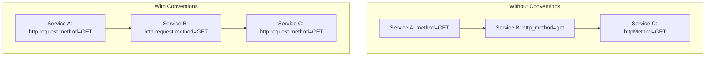
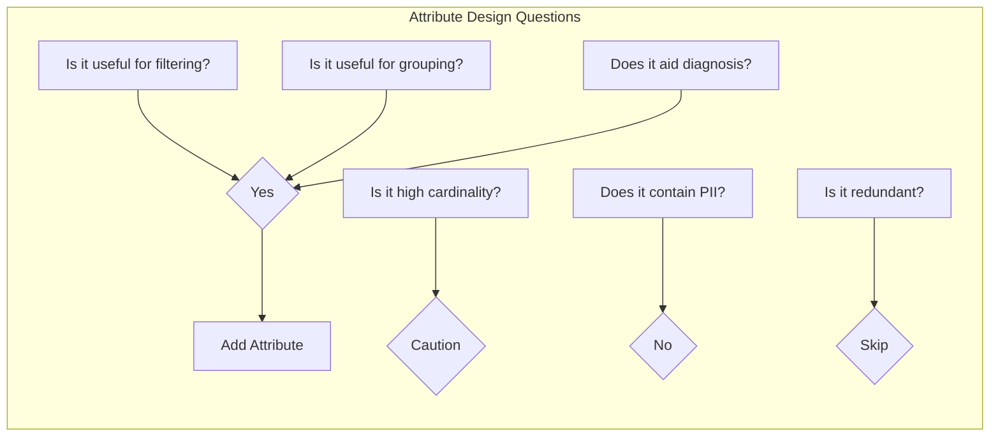
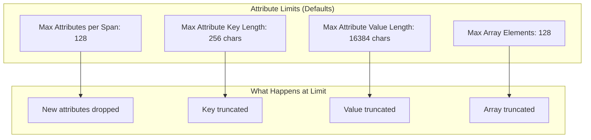
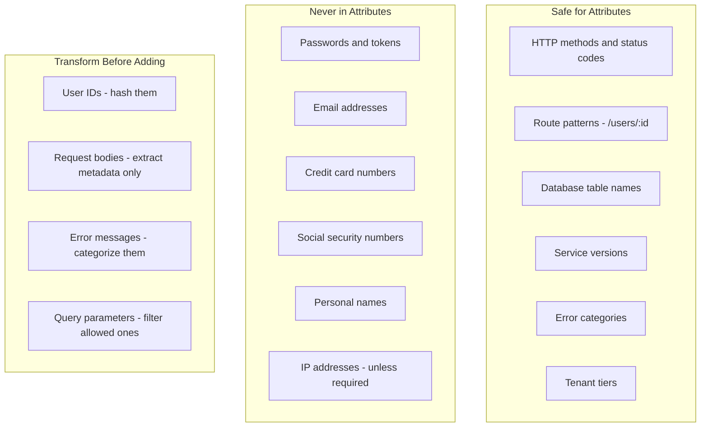

# How to Create Span Attribute Design

Author: [nawazdhandala](https://github.com/nawazdhandala)

Tags: Observability, Tracing, OpenTelemetry, Best Practices

Description: Learn how to design span attributes for rich context and effective trace analysis in OpenTelemetry.

---

> Span attributes are the metadata that transforms traces from timeline visualizations into diagnostic powerhouses. Without thoughtful attribute design, traces show you *that* something happened. With it, they show you *why*.

Span attributes are key-value pairs attached to spans that provide context about the operation being traced. They answer questions like: What HTTP method was used? Which database table was queried? How many rows were returned? What customer tier initiated this request?

This guide covers how to design span attributes that maximize diagnostic value, follow semantic conventions, stay within limits, and keep sensitive data out of your telemetry.

---

## Table of Contents

1. Why Span Attributes Matter
2. OpenTelemetry Semantic Conventions
3. Designing Custom Attributes
4. Attribute Naming Patterns
5. Understanding Attribute Limits
6. Handling Sensitive Data
7. Attribute Design Patterns
8. Common Anti-Patterns
9. Putting It All Together
10. Summary

---

## 1. Why Span Attributes Matter

Spans without attributes are like log lines without context. They tell you an operation happened, but not the circumstances.

| Without Attributes | With Attributes |
|-------------------|-----------------|
| `db.query` took 250ms | `db.query` took 250ms, table=orders, rows=15000, query_type=select |
| `http.request` failed | `http.request` failed, status=503, endpoint=/api/checkout, retry_count=3 |
| `payment.process` succeeded | `payment.process` succeeded, gateway=stripe, amount=149.99, currency=USD |

Attributes enable:

- **Filtering**: Find all spans where `http.status_code >= 500`
- **Grouping**: Aggregate latency by `db.table` or `customer.tier`
- **Root cause analysis**: Correlate slow spans with specific `deployment.version` values
- **Alerting**: Trigger alerts when `error.type = "TimeoutException"` exceeds threshold

---

## 2. OpenTelemetry Semantic Conventions

OpenTelemetry defines semantic conventions: standardized attribute names and values that ensure consistency across services, languages, and organizations.

### Why Use Semantic Conventions?



Semantic conventions provide:

- **Interoperability**: Tools understand your telemetry without custom configuration
- **Consistency**: Same attribute names across all services
- **Documentation**: Well-defined meanings for each attribute
- **Ecosystem support**: Auto-instrumentation libraries follow these conventions

### Common Semantic Attribute Categories

| Category | Namespace | Example Attributes |
|----------|-----------|-------------------|
| HTTP | `http.*` | `http.request.method`, `http.response.status_code`, `http.route` |
| Database | `db.*` | `db.system`, `db.name`, `db.operation`, `db.statement` |
| Messaging | `messaging.*` | `messaging.system`, `messaging.destination.name`, `messaging.operation` |
| RPC | `rpc.*` | `rpc.system`, `rpc.service`, `rpc.method` |
| Network | `network.*` | `network.peer.address`, `network.peer.port` |
| Cloud | `cloud.*` | `cloud.provider`, `cloud.region`, `cloud.availability_zone` |

### HTTP Semantic Conventions Example

```typescript
// http-instrumentation.ts - Following semantic conventions for HTTP spans
import { trace, SpanKind, SpanStatusCode } from '@opentelemetry/api';
import type { Request, Response } from 'express';

const tracer = trace.getTracer('http-server', '1.0.0');

export function instrumentedHandler(req: Request, res: Response) {
  // Create span with semantic HTTP attributes
  const span = tracer.startSpan('HTTP request', {
    kind: SpanKind.SERVER,
    attributes: {
      // HTTP request attributes (semantic conventions)
      'http.request.method': req.method,           // GET, POST, PUT, etc.
      'http.route': req.route?.path || req.path,   // /users/:id (parameterized)
      'url.path': req.path,                        // /users/123 (actual path)
      'url.scheme': req.protocol,                  // http or https

      // Network attributes
      'network.peer.address': req.ip,              // Client IP
      'server.address': req.hostname,              // Server hostname

      // User agent (truncated for cardinality)
      'user_agent.original': (req.get('User-Agent') || '').slice(0, 100),
    },
  });

  // Add response attributes when available
  res.on('finish', () => {
    span.setAttribute('http.response.status_code', res.statusCode);

    // Set span status based on HTTP status code
    if (res.statusCode >= 400) {
      span.setStatus({
        code: SpanStatusCode.ERROR,
        message: `HTTP ${res.statusCode}`,
      });
    }

    span.end();
  });
}
```

### Database Semantic Conventions Example

```typescript
// db-instrumentation.ts - Following semantic conventions for database spans
import { trace, SpanKind, SpanStatusCode } from '@opentelemetry/api';

const tracer = trace.getTracer('db-client', '1.0.0');

interface QueryOptions {
  table: string;
  operation: 'SELECT' | 'INSERT' | 'UPDATE' | 'DELETE';
  statement: string;
}

export async function instrumentedQuery<T>(
  options: QueryOptions,
  executor: () => Promise<T>
): Promise<T> {
  // Span name follows convention: db.operation db.name.table
  const spanName = `${options.operation} ${options.table}`;

  const span = tracer.startSpan(spanName, {
    kind: SpanKind.CLIENT,
    attributes: {
      // Database semantic attributes
      'db.system': 'postgresql',                    // Database type
      'db.name': process.env.DB_NAME || 'app',      // Database name
      'db.operation': options.operation,            // SELECT, INSERT, etc.
      'db.sql.table': options.table,                // Target table

      // Include sanitized statement (no values, just structure)
      'db.statement': sanitizeStatement(options.statement),

      // Connection info
      'server.address': process.env.DB_HOST,
      'server.port': parseInt(process.env.DB_PORT || '5432'),
    },
  });

  try {
    const result = await executor();

    // Add result metadata
    if (Array.isArray(result)) {
      span.setAttribute('db.response.rows_affected', result.length);
    }

    return result;
  } catch (error) {
    span.recordException(error as Error);
    span.setStatus({ code: SpanStatusCode.ERROR });
    throw error;
  } finally {
    span.end();
  }
}

// Remove literal values from SQL to prevent PII leaks and reduce cardinality
function sanitizeStatement(sql: string): string {
  return sql
    .replace(/'[^']*'/g, '?')           // Replace string literals
    .replace(/\b\d+\b/g, '?')           // Replace numeric literals
    .slice(0, 500);                      // Truncate long queries
}
```

---

## 3. Designing Custom Attributes

While semantic conventions cover common scenarios, you will need custom attributes for domain-specific context.

### Custom Attribute Design Principles



### Domain-Specific Attribute Examples

```typescript
// attributes/business.ts - Custom attributes for business domain
// These complement semantic conventions with domain-specific context

// E-commerce attributes - useful for filtering orders by value/type
export const orderAttributes = (order: Order) => ({
  'order.id': order.id,                           // Safe identifier
  'order.item_count': order.items.length,         // Aggregation friendly
  'order.total_amount': order.total,              // Range queries
  'order.currency': order.currency,               // Grouping by currency
  'order.type': order.type,                       // 'standard' | 'subscription' | 'gift'
  'order.is_first_order': order.isFirstOrder,     // Boolean for segmentation
  // NOTE: Never include shipping address, payment details, or customer PII
});

// Multi-tenant SaaS attributes - essential for tenant isolation analysis
export const tenantAttributes = (tenant: Tenant) => ({
  'tenant.id': tenant.id,                         // Hashed or UUID
  'tenant.tier': tenant.tier,                     // 'free' | 'pro' | 'enterprise'
  'tenant.region': tenant.region,                 // Data residency region
  'tenant.feature_flags': tenant.enabledFlags.join(','), // Active features
  // NOTE: Never include tenant name, admin email, or billing info
});

// Feature flag attributes - helps correlate behavior with flag states
export const featureFlagAttributes = (flags: Record<string, boolean>) => ({
  'feature.new_checkout': flags.newCheckout,
  'feature.dark_mode': flags.darkMode,
  'feature.beta_search': flags.betaSearch,
});

// Deployment attributes - critical for canary analysis and rollback decisions
export const deploymentAttributes = () => ({
  'deployment.version': process.env.APP_VERSION || 'unknown',
  'deployment.commit_sha': process.env.GIT_SHA?.slice(0, 8),
  'deployment.environment': process.env.NODE_ENV,
  'deployment.region': process.env.AWS_REGION || process.env.REGION,
  'deployment.instance_id': process.env.HOSTNAME,
});
```

### Using Custom Attributes in Spans

```typescript
// services/checkout.ts - Combining semantic and custom attributes
import { trace, SpanStatusCode } from '@opentelemetry/api';
import { orderAttributes, tenantAttributes, deploymentAttributes } from '../attributes/business';

const tracer = trace.getTracer('checkout-service', '1.0.0');

export async function processCheckout(request: CheckoutRequest) {
  return tracer.startActiveSpan('checkout.process', async (span) => {
    // Layer 1: Deployment context (always present)
    span.setAttributes(deploymentAttributes());

    // Layer 2: Tenant context (multi-tenant isolation)
    span.setAttributes(tenantAttributes(request.tenant));

    // Layer 3: Business context (domain-specific)
    span.setAttributes(orderAttributes(request.order));

    // Layer 4: Request-specific attributes
    span.setAttributes({
      'checkout.payment_method': request.paymentMethod,  // 'credit_card' | 'paypal'
      'checkout.has_coupon': Boolean(request.couponCode),
      'checkout.shipping_method': request.shippingMethod,
    });

    try {
      const result = await executeCheckout(request);

      // Add outcome attributes
      span.setAttributes({
        'checkout.success': true,
        'checkout.confirmation_id': result.confirmationId,
      });

      return result;
    } catch (error) {
      span.setAttributes({
        'checkout.success': false,
        'checkout.failure_reason': categorizeError(error),
      });
      span.recordException(error as Error);
      span.setStatus({ code: SpanStatusCode.ERROR });
      throw error;
    } finally {
      span.end();
    }
  });
}

// Categorize errors into low-cardinality buckets
function categorizeError(error: unknown): string {
  if (error instanceof PaymentDeclinedError) return 'payment_declined';
  if (error instanceof InventoryError) return 'out_of_stock';
  if (error instanceof ValidationError) return 'validation_failed';
  if (error instanceof TimeoutError) return 'timeout';
  return 'internal_error';
}
```

---

## 4. Attribute Naming Patterns

Consistent naming makes attributes discoverable and queryable.

### Naming Convention Rules

| Rule | Good Example | Bad Example |
|------|--------------|-------------|
| Use dot notation for namespacing | `order.total_amount` | `orderTotalAmount` |
| Use snake_case for multi-word keys | `user.account_type` | `user.accountType` |
| Use lowercase | `http.method` | `HTTP.Method` |
| Be specific, not generic | `db.rows_returned` | `count` |
| Include units in name | `latency_ms`, `size_bytes` | `latency`, `size` |

### Namespace Your Custom Attributes

```typescript
// attributes/naming.ts - Attribute naming conventions
// Namespace custom attributes to avoid collision with semantic conventions

// Good: Clear namespace hierarchy
const goodAttributes = {
  // Company/product namespace for truly custom attributes
  'acme.order.priority': 'high',
  'acme.customer.lifetime_value_usd': 5000,

  // Domain namespace for business concepts
  'checkout.step': 'payment',
  'checkout.attempt_number': 2,

  // Feature namespace for A/B testing
  'experiment.checkout_v2.variant': 'treatment',
  'experiment.checkout_v2.bucket': 42,
};

// Bad: Generic names that conflict or confuse
const badAttributes = {
  'priority': 'high',           // Too generic - priority of what?
  'value': 5000,                // Meaningless without context
  'step': 'payment',            // Conflicts with other domains
  'v2': true,                   // Cryptic abbreviation
};
```

### Attribute Value Guidelines

```typescript
// attributes/values.ts - Guidelines for attribute values

// GOOD: Low cardinality, predictable values
const goodValues = {
  'http.request.method': 'GET',                    // Finite set
  'order.status': 'pending',                       // Enum value
  'error.category': 'validation',                  // Categorized
  'cache.hit': true,                               // Boolean
  'db.rows_returned': 150,                         // Numeric
  'request.size_bytes': 2048,                      // Numeric with unit in name
};

// BAD: High cardinality, unbounded values
const badValues = {
  'user.email': 'john@example.com',                // PII + high cardinality
  'request.id': 'uuid-abc-123-xyz',                // Unique per request
  'error.message': 'Connection to db-1 failed',   // Free-form text
  'timestamp': '2024-01-15T10:30:00Z',             // Already captured in span
  'request.body': JSON.stringify(payload),         // Unbounded size
};
```

---

## 5. Understanding Attribute Limits

OpenTelemetry SDKs and backends impose limits on attributes to prevent resource exhaustion.

### SDK Limits



### Configuring Limits

```typescript
// telemetry/limits.ts - Configure attribute limits in SDK
import { NodeSDK } from '@opentelemetry/sdk-node';
import { SpanLimits } from '@opentelemetry/sdk-trace-base';

// Define span limits based on your observability backend and use case
const spanLimits: SpanLimits = {
  // Maximum number of attributes per span
  // Default: 128, increase if you have rich context needs
  attributeCountLimit: 64,

  // Maximum length of attribute keys
  // Default: no limit in SDK, but backends may truncate
  attributeKeyLengthLimit: 128,

  // Maximum length of attribute values (strings)
  // Default: no limit in SDK, but backends may truncate
  attributeValueLengthLimit: 1024,

  // Maximum number of events per span
  eventCountLimit: 32,

  // Maximum number of links per span
  linkCountLimit: 16,
};

// Apply limits in SDK configuration
const sdk = new NodeSDK({
  spanLimits,
  // ... other configuration
});
```

### Designing Within Limits

```typescript
// attributes/safe.ts - Helper functions to stay within limits

const MAX_STRING_LENGTH = 1024;
const MAX_ARRAY_LENGTH = 50;

// Truncate long strings to prevent limit violations
export function safeString(value: string | undefined, maxLength = MAX_STRING_LENGTH): string {
  if (!value) return '';
  if (value.length <= maxLength) return value;
  return value.slice(0, maxLength - 3) + '...';
}

// Limit array length and convert to string for attributes
export function safeArray(arr: unknown[], maxLength = MAX_ARRAY_LENGTH): string {
  const limited = arr.slice(0, maxLength);
  const result = limited.join(',');
  if (arr.length > maxLength) {
    return result + `...(+${arr.length - maxLength} more)`;
  }
  return result;
}

// Sanitize object for use as span attributes
export function safeAttributes(obj: Record<string, unknown>): Record<string, string | number | boolean> {
  const result: Record<string, string | number | boolean> = {};

  for (const [key, value] of Object.entries(obj)) {
    // Skip null/undefined
    if (value == null) continue;

    // Truncate long keys
    const safeKey = key.slice(0, 128);

    // Handle different types
    if (typeof value === 'string') {
      result[safeKey] = safeString(value);
    } else if (typeof value === 'number' || typeof value === 'boolean') {
      result[safeKey] = value;
    } else if (Array.isArray(value)) {
      result[safeKey] = safeArray(value);
    } else if (typeof value === 'object') {
      // Flatten or stringify objects with truncation
      result[safeKey] = safeString(JSON.stringify(value));
    }
  }

  return result;
}
```

### Prioritizing Attributes

When you might exceed limits, prioritize attributes by diagnostic value:

```typescript
// attributes/priority.ts - Prioritized attribute setting
import { Span } from '@opentelemetry/api';

interface AttributeLayer {
  priority: number;
  attributes: Record<string, string | number | boolean>;
}

// Set attributes in priority order, respecting limits
export function setAttributesWithPriority(
  span: Span,
  layers: AttributeLayer[],
  maxAttributes = 64
) {
  // Sort by priority (lower number = higher priority)
  const sorted = [...layers].sort((a, b) => a.priority - b.priority);

  let count = 0;
  for (const layer of sorted) {
    for (const [key, value] of Object.entries(layer.attributes)) {
      if (count >= maxAttributes) {
        console.warn(`Attribute limit reached, dropping: ${key}`);
        return;
      }
      span.setAttribute(key, value);
      count++;
    }
  }
}

// Usage example
setAttributesWithPriority(span, [
  { priority: 1, attributes: { 'error.type': 'timeout', 'error.critical': true } },
  { priority: 2, attributes: { 'http.method': 'POST', 'http.route': '/checkout' } },
  { priority: 3, attributes: { 'user.tier': 'enterprise', 'tenant.id': 'abc123' } },
  { priority: 4, attributes: { 'feature.flags': 'new_ui,dark_mode' } },
]);
```

---

## 6. Handling Sensitive Data

Span attributes are visible to anyone with access to your tracing backend. Never include PII, secrets, or regulated data.

### Data Classification for Attributes



### Safe Attribute Helpers

```typescript
// attributes/safe-helpers.ts - PII-safe attribute extraction

import { createHash } from 'crypto';

// Hash sensitive identifiers for correlation without exposure
export function hashId(id: string): string {
  return createHash('sha256')
    .update(id + process.env.HASH_SALT)
    .digest('hex')
    .slice(0, 16);  // Truncate for readability
}

// Extract safe HTTP request attributes
export function safeHttpAttributes(req: {
  method: string;
  path: string;
  query: Record<string, unknown>;
  headers: Record<string, string>;
  body?: unknown;
}) {
  // Allowed query parameters (safe for telemetry)
  const allowedQueryParams = ['page', 'limit', 'sort', 'filter', 'format'];

  const safeQuery: Record<string, string> = {};
  for (const param of allowedQueryParams) {
    if (req.query[param] != null) {
      safeQuery[param] = String(req.query[param]);
    }
  }

  return {
    'http.request.method': req.method,
    'http.route': req.path,
    // Only include safe query params
    'http.query.page': safeQuery.page,
    'http.query.limit': safeQuery.limit,
    // Indicate presence of body without content
    'http.request.has_body': req.body != null,
    // Content type is safe
    'http.request.content_type': req.headers['content-type'],
    // NEVER include: authorization header, cookies, full query string
  };
}

// Extract safe error attributes without exposing stack traces or messages
export function safeErrorAttributes(error: Error & { code?: string }) {
  return {
    'error.type': error.constructor.name,           // TypeError, ValidationError
    'error.code': error.code || 'unknown',          // ECONNREFUSED, E_VALIDATION
    'error.category': categorizeError(error),       // network, validation, auth
    // NEVER include: error.message (may contain PII), error.stack
  };
}

function categorizeError(error: Error): string {
  const name = error.constructor.name.toLowerCase();
  if (name.includes('timeout')) return 'timeout';
  if (name.includes('network') || name.includes('connection')) return 'network';
  if (name.includes('validation')) return 'validation';
  if (name.includes('auth')) return 'authentication';
  if (name.includes('permission') || name.includes('forbidden')) return 'authorization';
  return 'internal';
}

// Extract metadata from request body without content
export function bodyMetadata(body: unknown) {
  if (body == null) return { 'request.body.present': false };

  if (typeof body === 'object') {
    return {
      'request.body.present': true,
      'request.body.type': Array.isArray(body) ? 'array' : 'object',
      'request.body.keys_count': Object.keys(body).length,
      // NEVER include actual body content
    };
  }

  return {
    'request.body.present': true,
    'request.body.type': typeof body,
  };
}
```

### Collector-Level Sanitization

Even with careful SDK instrumentation, add a collector-level safety net:

```yaml
# collector-config.yaml - Attribute sanitization in OTel Collector
processors:
  # Remove any attributes that might contain PII
  attributes/sanitize:
    actions:
      # Delete known sensitive attributes
      - key: user.email
        action: delete
      - key: user.password
        action: delete
      - key: http.request.header.authorization
        action: delete
      - key: http.request.header.cookie
        action: delete

      # Hash attributes that need to exist but should be anonymized
      - key: user.id
        action: hash

      # Truncate potentially large values
      - key: db.statement
        action: update
        value: ${db.statement:0:500}

      # Redact patterns in any attribute value

  # Use transform processor for regex-based redaction
  transform/redact:
    trace_statements:
      - context: span
        statements:
          # Redact email patterns in any string attribute
          - replace_pattern(attributes["error.details"], "@[a-zA-Z0-9.-]+\\.[a-zA-Z]{2,}", "@[REDACTED]")
          # Redact credit card patterns
          - replace_pattern(attributes["error.details"], "\\b\\d{4}[- ]?\\d{4}[- ]?\\d{4}[- ]?\\d{4}\\b", "[CARD_REDACTED]")

service:
  pipelines:
    traces:
      receivers: [otlp]
      processors: [attributes/sanitize, transform/redact, batch]
      exporters: [otlphttp]
```

---

## 7. Attribute Design Patterns

### Pattern 1: Layered Context

Add attributes in layers, from most general to most specific:

```typescript
// patterns/layered-context.ts
import { trace, context as otelContext } from '@opentelemetry/api';

const tracer = trace.getTracer('patterns');

export async function handleRequest(req: Request) {
  return tracer.startActiveSpan('handle_request', async (span) => {
    // Layer 1: Infrastructure context (from environment)
    span.setAttributes({
      'deployment.environment': process.env.NODE_ENV,
      'deployment.version': process.env.APP_VERSION,
      'deployment.region': process.env.AWS_REGION,
      'k8s.pod.name': process.env.HOSTNAME,
    });

    // Layer 2: Request context (from HTTP)
    span.setAttributes({
      'http.request.method': req.method,
      'http.route': req.path,
      'request.id': req.id,
    });

    // Layer 3: Business context (from request processing)
    const tenant = await resolveTenant(req);
    span.setAttributes({
      'tenant.id': tenant.id,
      'tenant.tier': tenant.tier,
    });

    // Layer 4: Operation context (from business logic)
    const result = await processBusinessLogic(req, span);
    span.setAttributes({
      'operation.result': result.status,
      'operation.items_processed': result.count,
    });

    return result;
  });
}
```

### Pattern 2: Attribute Inheritance

Propagate common attributes through the span hierarchy:

```typescript
// patterns/inheritance.ts
import { trace, context as otelContext, Span, propagation } from '@opentelemetry/api';

// Store inherited attributes in context
const INHERITED_ATTRS_KEY = Symbol('inherited_attributes');

export function setInheritedAttributes(
  ctx: ReturnType<typeof otelContext.active>,
  attrs: Record<string, string | number | boolean>
) {
  const existing = ctx.getValue(INHERITED_ATTRS_KEY) as Record<string, unknown> || {};
  return ctx.setValue(INHERITED_ATTRS_KEY, { ...existing, ...attrs });
}

export function getInheritedAttributes(
  ctx: ReturnType<typeof otelContext.active>
): Record<string, string | number | boolean> {
  return (ctx.getValue(INHERITED_ATTRS_KEY) as Record<string, string | number | boolean>) || {};
}

// Helper to start span with inherited attributes
export function startSpanWithInheritance(
  tracer: ReturnType<typeof trace.getTracer>,
  name: string,
  additionalAttrs: Record<string, string | number | boolean> = {}
): Span {
  const ctx = otelContext.active();
  const inherited = getInheritedAttributes(ctx);

  return tracer.startSpan(name, {
    attributes: {
      ...inherited,          // Apply inherited attributes
      ...additionalAttrs,    // Add span-specific attributes
    },
  });
}

// Usage: Set tenant context once, all child spans inherit it
export async function requestHandler(req: Request) {
  const tracer = trace.getTracer('app');
  const tenant = await resolveTenant(req);

  // Set inherited attributes at request boundary
  const ctx = setInheritedAttributes(otelContext.active(), {
    'tenant.id': tenant.id,
    'tenant.tier': tenant.tier,
    'request.id': req.id,
  });

  return otelContext.with(ctx, async () => {
    // All spans created in this context inherit tenant attributes
    const span1 = startSpanWithInheritance(tracer, 'validate_order');
    // span1 has tenant.id, tenant.tier, request.id automatically
    span1.end();

    const span2 = startSpanWithInheritance(tracer, 'process_payment', {
      'payment.method': 'credit_card',
    });
    // span2 has inherited attrs + payment.method
    span2.end();
  });
}
```

### Pattern 3: Outcome Attributes

Always add attributes that describe the outcome:

```typescript
// patterns/outcomes.ts
import { trace, SpanStatusCode, Span } from '@opentelemetry/api';

// Standard outcome attribute helper
export function setOutcomeAttributes(
  span: Span,
  outcome: {
    success: boolean;
    resultType?: string;
    itemsProcessed?: number;
    errorCategory?: string;
    retryable?: boolean;
  }
) {
  span.setAttribute('outcome.success', outcome.success);

  if (outcome.success) {
    span.setAttribute('outcome.result_type', outcome.resultType || 'ok');
    if (outcome.itemsProcessed != null) {
      span.setAttribute('outcome.items_processed', outcome.itemsProcessed);
    }
    span.setStatus({ code: SpanStatusCode.OK });
  } else {
    span.setAttribute('outcome.error_category', outcome.errorCategory || 'unknown');
    span.setAttribute('outcome.retryable', outcome.retryable ?? false);
    span.setStatus({
      code: SpanStatusCode.ERROR,
      message: outcome.errorCategory,
    });
  }
}

// Usage
export async function processOrder(order: Order) {
  const tracer = trace.getTracer('orders');

  return tracer.startActiveSpan('order.process', async (span) => {
    span.setAttributes({
      'order.id': order.id,
      'order.item_count': order.items.length,
    });

    try {
      const result = await executeOrder(order);

      setOutcomeAttributes(span, {
        success: true,
        resultType: 'order_completed',
        itemsProcessed: result.itemsShipped,
      });

      return result;
    } catch (error) {
      setOutcomeAttributes(span, {
        success: false,
        errorCategory: categorizeError(error),
        retryable: isRetryableError(error),
      });

      span.recordException(error as Error);
      throw error;
    } finally {
      span.end();
    }
  });
}
```

---

## 8. Common Anti-Patterns

### Anti-Pattern 1: High Cardinality Values

```typescript
// BAD: Unique values per span cause cardinality explosion
span.setAttribute('request.id', uuidv4());              // Unique every request
span.setAttribute('timestamp', Date.now());             // Already in span
span.setAttribute('user.session_id', sessionId);        // High cardinality
span.setAttribute('order.shipping_address', address);   // PII + unique

// GOOD: Bounded, categorical values
span.setAttribute('request.type', 'checkout');          // Finite categories
span.setAttribute('user.tier', 'premium');              // Limited values
span.setAttribute('order.shipping_country', 'US');      // Bounded set
span.setAttribute('order.has_gift_wrap', true);         // Boolean
```

### Anti-Pattern 2: Redundant Attributes

```typescript
// BAD: Duplicating information already in span
span.setAttribute('span.name', 'checkout.process');     // Use span name
span.setAttribute('span.start_time', Date.now());       // Automatic
span.setAttribute('span.duration_ms', 150);             // Computed from times
span.setAttribute('parent.trace_id', traceId);          // In span context

// GOOD: Add new information not in span structure
span.setAttribute('checkout.step', 'payment');          // Business context
span.setAttribute('checkout.retries', 2);               // Operation detail
```

### Anti-Pattern 3: Dynamic Attribute Keys

```typescript
// BAD: Attribute keys that change per request
span.setAttribute(`item.${itemId}.quantity`, qty);      // Key changes per item
span.setAttribute(`error.${errorCode}`, true);          // Key changes per error

// GOOD: Fixed keys with variable values
span.setAttribute('item.id', itemId);
span.setAttribute('item.quantity', qty);
span.setAttribute('error.code', errorCode);
span.setAttribute('error.occurred', true);

// For multiple items, use events or aggregate
span.setAttribute('items.total_count', items.length);
span.setAttribute('items.total_quantity', items.reduce((sum, i) => sum + i.qty, 0));
items.slice(0, 5).forEach((item, idx) => {
  span.addEvent('item.processed', {
    'item.id': item.id,
    'item.quantity': item.quantity,
  });
});
```

### Anti-Pattern 4: Attribute Spam

```typescript
// BAD: Adding every possible attribute
span.setAttributes({
  'http.method': req.method,
  'http.url': req.url,
  'http.path': req.path,
  'http.query': req.query,
  'http.fragment': req.fragment,
  'http.scheme': req.protocol,
  'http.host': req.host,
  'http.port': req.port,
  'http.version': req.httpVersion,
  // ... 50 more attributes
});

// GOOD: Curated attributes for your use case
span.setAttributes({
  'http.request.method': req.method,
  'http.route': req.route,
  'http.response.status_code': res.statusCode,
  // Only add what you query/filter on
});
```

---

## 9. Putting It All Together

### Complete Instrumentation Example

```typescript
// services/payment.ts - Complete span attribute design example
import { trace, SpanKind, SpanStatusCode, context as otelContext } from '@opentelemetry/api';
import { hashId, safeString } from '../attributes/safe-helpers';

const tracer = trace.getTracer('payment-service', '1.0.0');

// Attribute definitions following all best practices
const paymentAttributes = {
  // Gateway info - low cardinality, useful for filtering
  gateway: (name: string) => ({ 'payment.gateway': name }),

  // Method - bounded enum
  method: (method: 'credit_card' | 'debit_card' | 'paypal' | 'bank_transfer') => ({
    'payment.method': method,
  }),

  // Amount - numeric, includes currency
  amount: (amount: number, currency: string) => ({
    'payment.amount': amount,
    'payment.currency': currency,
  }),

  // Outcome - categorical
  outcome: (result: 'approved' | 'declined' | 'error', declineCode?: string) => ({
    'payment.result': result,
    ...(declineCode && { 'payment.decline_code': declineCode }),
  }),
};

export async function processPayment(request: PaymentRequest): Promise<PaymentResult> {
  // Create span with semantic and custom attributes
  return tracer.startActiveSpan(
    'payment.process',
    {
      kind: SpanKind.CLIENT,  // Outbound call to payment gateway
      attributes: {
        // Semantic convention attributes
        'rpc.system': 'http',
        'rpc.service': 'payment-gateway',
        'rpc.method': 'charge',

        // Custom business attributes
        ...paymentAttributes.gateway(request.gateway),
        ...paymentAttributes.method(request.method),
        ...paymentAttributes.amount(request.amount, request.currency),

        // Correlation attributes (hashed for privacy)
        'payment.order_id': request.orderId,
        'payment.customer_id': hashId(request.customerId),

        // Context attributes
        'payment.is_retry': request.attemptNumber > 1,
        'payment.attempt_number': request.attemptNumber,
      },
    },
    async (span) => {
      // Add event for important milestone
      span.addEvent('payment.gateway.request_sent', {
        'gateway.endpoint': request.gateway,
      });

      try {
        // Execute payment
        const startTime = Date.now();
        const result = await callPaymentGateway(request);
        const latency = Date.now() - startTime;

        // Add response attributes
        span.setAttributes({
          ...paymentAttributes.outcome(
            result.approved ? 'approved' : 'declined',
            result.declineCode
          ),
          'payment.gateway.latency_ms': latency,
          'payment.gateway.response_code': result.responseCode,
        });

        // Add success event
        span.addEvent('payment.completed', {
          'payment.transaction_id': result.transactionId,
        });

        span.setStatus({ code: SpanStatusCode.OK });
        return result;

      } catch (error) {
        // Categorize error without exposing details
        const errorCategory = categorizePaymentError(error);

        span.setAttributes({
          ...paymentAttributes.outcome('error'),
          'payment.error_category': errorCategory,
          'payment.error_retryable': isRetryable(error),
        });

        span.recordException(error as Error);
        span.setStatus({
          code: SpanStatusCode.ERROR,
          message: errorCategory,
        });

        throw error;
      } finally {
        span.end();
      }
    }
  );
}

function categorizePaymentError(error: unknown): string {
  // Return low-cardinality error category, not the message
  if (error instanceof TimeoutError) return 'gateway_timeout';
  if (error instanceof NetworkError) return 'network_failure';
  if (error instanceof ValidationError) return 'invalid_request';
  if (error instanceof AuthenticationError) return 'auth_failure';
  return 'internal_error';
}

function isRetryable(error: unknown): boolean {
  return error instanceof TimeoutError || error instanceof NetworkError;
}
```

### Attribute Design Checklist

Before adding an attribute, verify:

- [ ] **Useful**: Will this help filter, group, or diagnose issues?
- [ ] **Safe**: Does it contain any PII, secrets, or regulated data?
- [ ] **Bounded**: Is the cardinality limited (not unique per request)?
- [ ] **Named correctly**: Does it follow naming conventions?
- [ ] **Within limits**: Will it fit within attribute count/size limits?
- [ ] **Not redundant**: Is this information already in the span?
- [ ] **Documented**: Is this custom attribute documented for the team?

---

## 10. Summary

| Principle | Description |
|-----------|-------------|
| Follow semantic conventions | Use standard names for common concepts |
| Design custom attributes deliberately | Name consistently, bound cardinality, document purpose |
| Respect limits | Configure SDK limits, prioritize attributes, truncate values |
| Never include sensitive data | Hash IDs, categorize errors, filter allowed fields |
| Layer context | Add attributes from general (infra) to specific (operation) |
| Include outcomes | Always record success/failure and categorized results |
| Avoid anti-patterns | No high cardinality, no redundancy, no dynamic keys |

Well-designed span attributes transform traces from simple timelines into powerful diagnostic tools. They enable filtering, grouping, alerting, and root cause analysis. Take the time to design them thoughtfully, and your future self debugging a production incident will thank you.

---

*Send your traces to [OneUptime](https://oneuptime.com) for full-fidelity observability with metrics and logs correlation.*

---

### Related Reading

- [What are Traces and Spans in OpenTelemetry: A Practical Guide](https://oneuptime.com/blog/post/2025-08-27-traces-and-spans-in-opentelemetry/view)
- [How to Reduce Noise in OpenTelemetry](https://oneuptime.com/blog/post/2025-08-25-how-to-reduce-noise-in-opentelemetry/view)
- [Keep PII Out of Your Telemetry](https://oneuptime.com/blog/post/2025-11-13-keep-pii-out-of-observability-telemetry/view)
