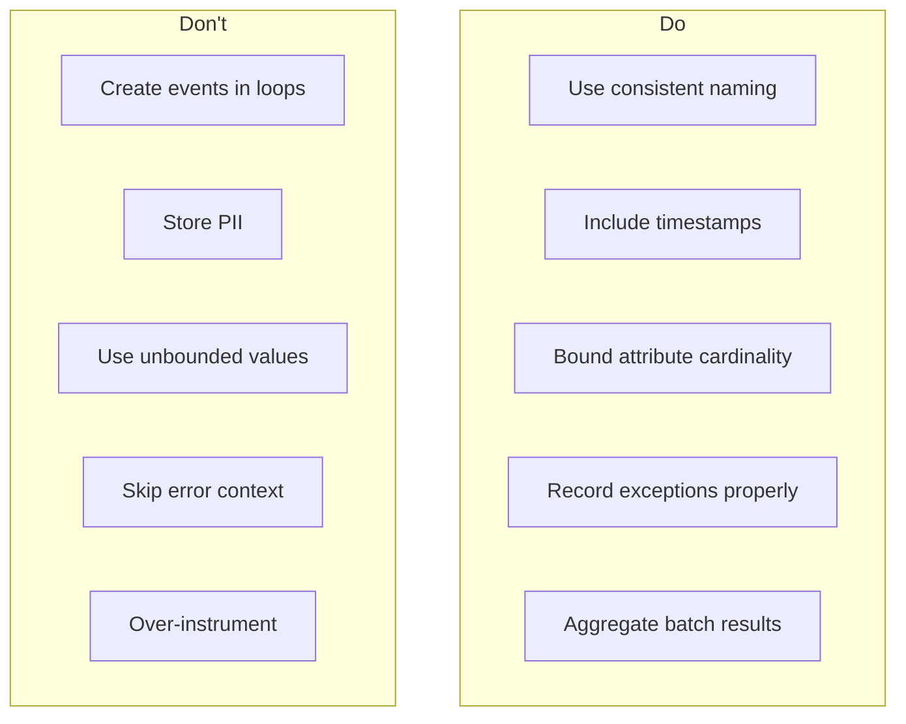

# How to Build Span Event Design

Author: [nawazdhandala](https://github.com/nawazdhandala)

Tags: Observability, Tracing, OpenTelemetry, Best Practices

Description: Learn how to design and implement span events for capturing significant moments within trace spans.

---

Span events are timestamped annotations that mark significant moments during a span's lifetime. Unlike child spans that represent separate units of work with their own duration, events capture instantaneous happenings within an existing operation. Mastering span event design is crucial for effective distributed tracing.

This guide covers exception events, milestone events, and custom events with practical implementation patterns you can apply immediately.

---

## Table of Contents

1. What Are Span Events?
2. When to Use Events vs. Child Spans
3. Exception Events
4. Milestone Events
5. Custom Events
6. Event Attributes and Timing
7. Event Design Patterns
8. Implementation Examples
9. Anti-Patterns to Avoid
10. Best Practices Summary

---

## 1. What Are Span Events?

A span event is a structured log entry attached to a span with:

- A **name** (string identifier)
- A **timestamp** (when it occurred)
- Optional **attributes** (key-value metadata)


Events answer: "What important thing happened at this exact moment while this span was running?"

| Component | Purpose | Cardinality |
|-----------|---------|-------------|
| Name | Identifies the event type | Low (consistent naming) |
| Timestamp | When the event occurred | Auto-generated |
| Attributes | Context about the event | Bounded key-value pairs |

---

## 2. When to Use Events vs. Child Spans


**Decision Matrix:**

| Scenario | Use Event | Use Child Span |
|----------|-----------|----------------|
| Point-in-time marker (cache miss) | Yes | No |
| State transition (order.confirmed) | Yes | No |
| Retry attempt notification | Yes | No |
| External API call with latency | No | Yes |
| Database query execution | No | Yes |
| Complex computation with timing | No | Yes |

**Simple Rule:** If you need to measure duration, create a child span. If you need to mark a moment, create an event.

---

## 3. Exception Events

Exception events capture error details without ending the span prematurely. OpenTelemetry provides semantic conventions for exception events.

### Exception Event Structure


### TypeScript Implementation

```typescript
import { trace, SpanStatusCode } from '@opentelemetry/api';

const tracer = trace.getTracer('payment-service');

async function processPayment(paymentId: string, amount: number): Promise<void> {
    // Start a span for the payment processing operation
    const span = tracer.startSpan('payment.process', {
        attributes: {
            'payment.id': paymentId,
            'payment.amount': amount,
        },
    });

    try {
        // Attempt to charge the payment gateway
        await chargeGateway(paymentId, amount);
        span.setStatus({ code: SpanStatusCode.OK });
    } catch (error: unknown) {
        // Record the exception as an event
        // This captures error details without ending the span
        span.recordException(error as Error);

        // Also set the span status to ERROR
        // This marks the span as failed in the trace UI
        span.setStatus({
            code: SpanStatusCode.ERROR,
            message: error instanceof Error ? error.message : 'Unknown error',
        });

        throw error;
    } finally {
        // Always end the span, even on error
        span.end();
    }
}
```

### Handling Multiple Exceptions (Retry Scenarios)

```typescript
import { trace, SpanStatusCode, Span } from '@opentelemetry/api';

const tracer = trace.getTracer('resilient-service');

async function fetchWithRetry(
    url: string,
    maxRetries: number = 3
): Promise<Response> {
    const span = tracer.startSpan('http.fetch.with_retry', {
        attributes: {
            'http.url': url,
            'retry.max_attempts': maxRetries,
        },
    });

    let lastError: Error | null = null;

    for (let attempt = 1; attempt <= maxRetries; attempt++) {
        try {
            // Record the attempt as an event
            span.addEvent('fetch.attempt', {
                'attempt.number': attempt,
                'attempt.timestamp': Date.now(),
            });

            const response = await fetch(url);

            // Record successful completion
            span.addEvent('fetch.success', {
                'attempt.number': attempt,
                'http.status_code': response.status,
            });

            span.setAttribute('retry.attempts_used', attempt);
            span.setStatus({ code: SpanStatusCode.OK });
            span.end();

            return response;
        } catch (error: unknown) {
            lastError = error as Error;

            // Record each exception as a separate event
            // This preserves the history of all failures
            span.recordException(lastError, {
                'attempt.number': attempt,
                'retry.will_retry': attempt < maxRetries,
            });

            // Add a retry scheduled event if we will retry
            if (attempt < maxRetries) {
                const backoffMs = Math.pow(2, attempt) * 100;
                span.addEvent('retry.scheduled', {
                    'retry.backoff_ms': backoffMs,
                    'retry.next_attempt': attempt + 1,
                });
                await sleep(backoffMs);
            }
        }
    }

    // All retries exhausted
    span.setStatus({
        code: SpanStatusCode.ERROR,
        message: `Failed after ${maxRetries} attempts: ${lastError?.message}`,
    });
    span.end();

    throw lastError;
}

function sleep(ms: number): Promise<void> {
    return new Promise((resolve) => setTimeout(resolve, ms));
}
```

---

## 4. Milestone Events

Milestone events mark significant progress points in a workflow. They help you understand the sequence and timing of operations without creating span overhead.

### Workflow Milestone Pattern


### TypeScript Implementation

```typescript
import { trace, Span } from '@opentelemetry/api';

const tracer = trace.getTracer('order-service');

interface OrderInput {
    customerId: string;
    items: Array<{ sku: string; quantity: number }>;
    paymentMethod: string;
}

interface Order {
    id: string;
    customerId: string;
    status: string;
    total: number;
}

async function createOrder(input: OrderInput): Promise<Order> {
    const span = tracer.startSpan('order.create', {
        attributes: {
            'order.customer_id': input.customerId,
            'order.item_count': input.items.length,
        },
    });

    try {
        // Milestone: Validation phase begins
        span.addEvent('validation.start');
        const validatedInput = await validateOrderInput(input);
        span.addEvent('validation.complete', {
            'validation.item_count': validatedInput.items.length,
        });

        // Milestone: Inventory check
        span.addEvent('inventory.check.start');
        const inventoryResult = await checkInventory(validatedInput.items);
        span.addEvent('inventory.check.complete', {
            'inventory.all_available': inventoryResult.allAvailable,
            'inventory.reserved_count': inventoryResult.reservedCount,
        });

        // Milestone: Price calculation
        span.addEvent('pricing.calculate.start');
        const pricing = await calculatePricing(validatedInput.items);
        span.addEvent('pricing.calculate.complete', {
            'pricing.subtotal': pricing.subtotal,
            'pricing.tax': pricing.tax,
            'pricing.total': pricing.total,
        });

        // Milestone: Order persistence
        span.addEvent('order.persist.start');
        const order = await persistOrder(validatedInput, pricing);
        span.addEvent('order.persisted', {
            'order.id': order.id,
            'order.status': order.status,
        });

        // Milestone: Notification queued
        span.addEvent('notification.queue.start');
        await queueOrderConfirmation(order);
        span.addEvent('notification.queued', {
            'notification.type': 'email',
            'notification.recipient': input.customerId,
        });

        span.setAttribute('order.id', order.id);
        span.setAttribute('order.total', pricing.total);

        return order;
    } finally {
        span.end();
    }
}

// Placeholder functions for the example
async function validateOrderInput(input: OrderInput) {
    return input;
}
async function checkInventory(items: Array<{ sku: string; quantity: number }>) {
    return { allAvailable: true, reservedCount: items.length };
}
async function calculatePricing(items: Array<{ sku: string; quantity: number }>) {
    return { subtotal: 100, tax: 10, total: 110 };
}
async function persistOrder(input: OrderInput, pricing: { total: number }): Promise<Order> {
    return { id: 'ord_123', customerId: input.customerId, status: 'created', total: pricing.total };
}
async function queueOrderConfirmation(order: Order) {
    return;
}
```

### State Machine Transitions

```typescript
import { trace, Span } from '@opentelemetry/api';

const tracer = trace.getTracer('workflow-service');

// Define possible states for an order
type OrderState = 'pending' | 'processing' | 'shipped' | 'delivered' | 'cancelled';

interface StateTransition {
    from: OrderState;
    to: OrderState;
    reason?: string;
}

class OrderStateMachine {
    private orderId: string;
    private currentState: OrderState;
    private span: Span;

    constructor(orderId: string, initialState: OrderState) {
        this.orderId = orderId;
        this.currentState = initialState;

        // Create a span that tracks the entire state machine lifecycle
        this.span = tracer.startSpan('order.state_machine', {
            attributes: {
                'order.id': orderId,
                'state.initial': initialState,
            },
        });

        // Record the initial state as an event
        this.span.addEvent('state.initialized', {
            'state.current': initialState,
        });
    }

    transition(newState: OrderState, reason?: string): void {
        const transition: StateTransition = {
            from: this.currentState,
            to: newState,
            reason,
        };

        // Validate the transition is allowed
        if (!this.isValidTransition(transition)) {
            this.span.addEvent('state.transition.rejected', {
                'state.from': transition.from,
                'state.to': transition.to,
                'rejection.reason': `Invalid transition from ${transition.from} to ${transition.to}`,
            });
            throw new Error(`Invalid state transition: ${transition.from} -> ${transition.to}`);
        }

        // Record the successful state transition
        this.span.addEvent('state.transition', {
            'state.from': transition.from,
            'state.to': transition.to,
            'transition.reason': reason || 'not_specified',
            'transition.timestamp': Date.now(),
        });

        this.currentState = newState;
        this.span.setAttribute('state.current', newState);
    }

    private isValidTransition(transition: StateTransition): boolean {
        const validTransitions: Record<OrderState, OrderState[]> = {
            pending: ['processing', 'cancelled'],
            processing: ['shipped', 'cancelled'],
            shipped: ['delivered'],
            delivered: [],
            cancelled: [],
        };
        return validTransitions[transition.from].includes(transition.to);
    }

    complete(): void {
        this.span.addEvent('state_machine.completed', {
            'state.final': this.currentState,
        });
        this.span.end();
    }
}
```

---

## 5. Custom Events

Custom events capture domain-specific moments that matter to your business logic.

### Event Categories


### Business Event Implementation

```typescript
import { trace, context, Span } from '@opentelemetry/api';

const tracer = trace.getTracer('checkout-service');

interface CartItem {
    productId: string;
    name: string;
    price: number;
    quantity: number;
}

interface Cart {
    id: string;
    customerId: string;
    items: CartItem[];
}

interface PaymentResult {
    transactionId: string;
    authorized: boolean;
    amount: number;
}

async function checkout(cart: Cart, paymentToken: string): Promise<string> {
    const span = tracer.startSpan('checkout.process', {
        attributes: {
            'cart.id': cart.id,
            'cart.customer_id': cart.customerId,
            'cart.item_count': cart.items.length,
        },
    });

    try {
        // Business event: Checkout initiated
        span.addEvent('checkout.initiated', {
            'cart.total_items': cart.items.length,
            'cart.total_value': calculateTotal(cart.items),
        });

        // Business event: Fraud check
        span.addEvent('fraud_check.start');
        const fraudScore = await performFraudCheck(cart);
        span.addEvent('fraud_check.complete', {
            'fraud.score': fraudScore,
            'fraud.passed': fraudScore < 0.7,
        });

        if (fraudScore >= 0.7) {
            span.addEvent('checkout.blocked', {
                'block.reason': 'fraud_score_exceeded',
                'fraud.score': fraudScore,
            });
            throw new Error('Transaction blocked due to fraud risk');
        }

        // Business event: Payment processing
        span.addEvent('payment.processing.start', {
            'payment.method': 'card',
        });

        const paymentResult = await processPayment(paymentToken, calculateTotal(cart.items));

        span.addEvent('payment.processing.complete', {
            'payment.authorized': paymentResult.authorized,
            'payment.transaction_id': paymentResult.transactionId,
            'payment.amount': paymentResult.amount,
        });

        if (!paymentResult.authorized) {
            span.addEvent('checkout.failed', {
                'failure.reason': 'payment_declined',
            });
            throw new Error('Payment was declined');
        }

        // Business event: Order confirmation
        const orderId = await createOrderFromCart(cart, paymentResult);
        span.addEvent('checkout.completed', {
            'order.id': orderId,
            'checkout.duration_ms': Date.now() - span.startTime[0] * 1000,
        });

        span.setAttribute('order.id', orderId);
        return orderId;
    } finally {
        span.end();
    }
}

function calculateTotal(items: CartItem[]): number {
    return items.reduce((sum, item) => sum + item.price * item.quantity, 0);
}

async function performFraudCheck(cart: Cart): Promise<number> {
    return 0.2; // Mock fraud score
}

async function processPayment(token: string, amount: number): Promise<PaymentResult> {
    return { transactionId: 'txn_123', authorized: true, amount };
}

async function createOrderFromCart(cart: Cart, payment: PaymentResult): Promise<string> {
    return 'ord_123';
}
```

### Technical Event Implementation

```typescript
import { trace, Span } from '@opentelemetry/api';

const tracer = trace.getTracer('cache-service');

interface CacheResult<T> {
    value: T | null;
    source: 'cache' | 'database';
}

// Generic cache-aside pattern with events
async function getWithCache<T>(
    key: string,
    fetchFn: () => Promise<T>,
    ttlSeconds: number = 300
): Promise<CacheResult<T>> {
    const span = tracer.startSpan('cache.get_or_fetch', {
        attributes: {
            'cache.key': key,
            'cache.ttl_seconds': ttlSeconds,
        },
    });

    try {
        // Attempt cache lookup
        span.addEvent('cache.lookup.start');
        const cached = await cacheGet<T>(key);

        if (cached !== null) {
            // Cache hit event with timing
            span.addEvent('cache.hit', {
                'cache.key': key,
                'cache.value_size_bytes': JSON.stringify(cached).length,
            });
            span.setAttribute('cache.hit', true);
            return { value: cached, source: 'cache' };
        }

        // Cache miss event
        span.addEvent('cache.miss', {
            'cache.key': key,
        });
        span.setAttribute('cache.hit', false);

        // Fetch from source
        span.addEvent('source.fetch.start');
        const value = await fetchFn();
        span.addEvent('source.fetch.complete', {
            'source.value_size_bytes': JSON.stringify(value).length,
        });

        // Populate cache
        span.addEvent('cache.populate.start');
        await cacheSet(key, value, ttlSeconds);
        span.addEvent('cache.populated', {
            'cache.key': key,
            'cache.ttl_seconds': ttlSeconds,
        });

        return { value, source: 'database' };
    } finally {
        span.end();
    }
}

// Mock cache functions
async function cacheGet<T>(key: string): Promise<T | null> {
    return null;
}

async function cacheSet<T>(key: string, value: T, ttl: number): Promise<void> {
    return;
}
```

### Circuit Breaker Events

```typescript
import { trace, Span, SpanStatusCode } from '@opentelemetry/api';

const tracer = trace.getTracer('resilience-service');

type CircuitState = 'closed' | 'open' | 'half_open';

interface CircuitBreakerConfig {
    failureThreshold: number;
    resetTimeoutMs: number;
    halfOpenRequests: number;
}

class CircuitBreaker {
    private state: CircuitState = 'closed';
    private failures: number = 0;
    private lastFailureTime: number = 0;
    private config: CircuitBreakerConfig;
    private name: string;

    constructor(name: string, config: CircuitBreakerConfig) {
        this.name = name;
        this.config = config;
    }

    async execute<T>(operation: () => Promise<T>): Promise<T> {
        const span = tracer.startSpan(`circuit_breaker.${this.name}.execute`, {
            attributes: {
                'circuit_breaker.name': this.name,
                'circuit_breaker.state': this.state,
            },
        });

        try {
            // Check if circuit is open
            if (this.state === 'open') {
                if (Date.now() - this.lastFailureTime > this.config.resetTimeoutMs) {
                    // Transition to half-open
                    this.transitionTo('half_open', span);
                } else {
                    // Circuit is open, reject immediately
                    span.addEvent('circuit_breaker.rejected', {
                        'circuit_breaker.state': 'open',
                        'circuit_breaker.time_until_retry_ms':
                            this.config.resetTimeoutMs - (Date.now() - this.lastFailureTime),
                    });
                    span.setStatus({
                        code: SpanStatusCode.ERROR,
                        message: 'Circuit breaker is open',
                    });
                    throw new Error('Circuit breaker is open');
                }
            }

            // Execute the operation
            span.addEvent('circuit_breaker.operation.start');
            const result = await operation();
            span.addEvent('circuit_breaker.operation.success');

            // Reset on success
            if (this.state === 'half_open') {
                this.transitionTo('closed', span);
            }
            this.failures = 0;

            return result;
        } catch (error) {
            this.failures++;
            this.lastFailureTime = Date.now();

            span.addEvent('circuit_breaker.operation.failed', {
                'circuit_breaker.failure_count': this.failures,
                'circuit_breaker.threshold': this.config.failureThreshold,
            });

            // Check if we should open the circuit
            if (this.failures >= this.config.failureThreshold && this.state === 'closed') {
                this.transitionTo('open', span);
            }

            throw error;
        } finally {
            span.setAttribute('circuit_breaker.final_state', this.state);
            span.end();
        }
    }

    private transitionTo(newState: CircuitState, span: Span): void {
        const previousState = this.state;
        this.state = newState;

        span.addEvent('circuit_breaker.state_change', {
            'circuit_breaker.previous_state': previousState,
            'circuit_breaker.new_state': newState,
            'circuit_breaker.failure_count': this.failures,
        });
    }
}
```

---

## 6. Event Attributes and Timing

### Attribute Best Practices


### Attribute Guidelines

| Do | Don't |
|----|-------|
| `retry.attempt: 3` | `user.email: john@example.com` |
| `cache.hit: true` | `request.body: {huge JSON}` |
| `http.status_code: 200` | `session.id: uuid-here` |
| `error.type: 'timeout'` | `password: secret123` |

### TypeScript Example with Proper Attributes

```typescript
import { trace } from '@opentelemetry/api';

const tracer = trace.getTracer('attribute-example');

interface RequestMetrics {
    startTime: number;
    bytesReceived: number;
    bytesSent: number;
}

function recordRequestEvents(metrics: RequestMetrics): void {
    const span = tracer.startSpan('http.request');

    // Good: Bounded, meaningful attributes
    span.addEvent('request.received', {
        // Timing information
        'request.timestamp_ms': metrics.startTime,

        // Bounded numeric values
        'request.size_bytes': metrics.bytesReceived,

        // Boolean flags
        'request.has_body': metrics.bytesReceived > 0,
    });

    span.addEvent('response.sent', {
        // Duration calculation
        'response.duration_ms': Date.now() - metrics.startTime,

        // Bounded numeric
        'response.size_bytes': metrics.bytesSent,

        // Categorical value (low cardinality)
        'response.size_category': categorizeSize(metrics.bytesSent),
    });

    span.end();
}

// Helper to create bounded categorical values
function categorizeSize(bytes: number): string {
    if (bytes < 1024) return 'small';
    if (bytes < 1024 * 100) return 'medium';
    if (bytes < 1024 * 1024) return 'large';
    return 'very_large';
}
```

### Timing Patterns

```typescript
import { trace, Span } from '@opentelemetry/api';

const tracer = trace.getTracer('timing-example');

class TimedOperation {
    private span: Span;
    private checkpoints: Map<string, number> = new Map();
    private startTime: number;

    constructor(operationName: string) {
        this.startTime = Date.now();
        this.span = tracer.startSpan(operationName);
    }

    // Record a checkpoint with automatic timing
    checkpoint(name: string, attributes: Record<string, any> = {}): void {
        const now = Date.now();
        const elapsed = now - this.startTime;

        // Store checkpoint for later delta calculations
        this.checkpoints.set(name, now);

        this.span.addEvent(name, {
            ...attributes,
            'checkpoint.elapsed_ms': elapsed,
            'checkpoint.timestamp': now,
        });
    }

    // Record time between two checkpoints
    recordDelta(fromCheckpoint: string, toCheckpoint: string): void {
        const fromTime = this.checkpoints.get(fromCheckpoint);
        const toTime = this.checkpoints.get(toCheckpoint);

        if (fromTime && toTime) {
            this.span.addEvent('timing.delta', {
                'timing.from': fromCheckpoint,
                'timing.to': toCheckpoint,
                'timing.delta_ms': toTime - fromTime,
            });
        }
    }

    end(): void {
        const totalDuration = Date.now() - this.startTime;
        this.span.addEvent('operation.complete', {
            'operation.total_duration_ms': totalDuration,
            'operation.checkpoint_count': this.checkpoints.size,
        });
        this.span.setAttribute('operation.duration_ms', totalDuration);
        this.span.end();
    }
}

// Usage example
async function processDocument(documentId: string): Promise<void> {
    const op = new TimedOperation('document.process');

    op.checkpoint('fetch.start');
    const document = await fetchDocument(documentId);
    op.checkpoint('fetch.complete', { 'document.size_bytes': document.length });

    op.checkpoint('parse.start');
    const parsed = parseDocument(document);
    op.checkpoint('parse.complete', { 'parse.element_count': parsed.elements });

    op.checkpoint('transform.start');
    const transformed = transformDocument(parsed);
    op.checkpoint('transform.complete');

    op.checkpoint('save.start');
    await saveDocument(transformed);
    op.checkpoint('save.complete');

    // Record timing deltas for analysis
    op.recordDelta('fetch.start', 'fetch.complete');
    op.recordDelta('parse.start', 'parse.complete');
    op.recordDelta('transform.start', 'transform.complete');
    op.recordDelta('save.start', 'save.complete');

    op.end();
}

// Mock functions
async function fetchDocument(id: string): Promise<string> {
    return 'document content';
}
function parseDocument(doc: string): { elements: number } {
    return { elements: 10 };
}
function transformDocument(parsed: { elements: number }): object {
    return {};
}
async function saveDocument(doc: object): Promise<void> {
    return;
}
```

---

## 7. Event Design Patterns

### Pattern 1: Before/After Events


```typescript
import { trace, Span } from '@opentelemetry/api';

const tracer = trace.getTracer('pattern-example');

// Utility for before/after event wrapping
async function withEvents<T>(
    span: Span,
    operationName: string,
    operation: () => Promise<T>,
    attributes: Record<string, any> = {}
): Promise<T> {
    span.addEvent(`${operationName}.start`, {
        ...attributes,
        'event.timestamp': Date.now(),
    });

    const startTime = Date.now();

    try {
        const result = await operation();

        span.addEvent(`${operationName}.complete`, {
            ...attributes,
            'event.duration_ms': Date.now() - startTime,
            'event.success': true,
        });

        return result;
    } catch (error) {
        span.addEvent(`${operationName}.failed`, {
            ...attributes,
            'event.duration_ms': Date.now() - startTime,
            'event.success': false,
            'error.message': error instanceof Error ? error.message : 'Unknown',
        });
        throw error;
    }
}
```

### Pattern 2: Conditional Events

```typescript
import { trace, Span } from '@opentelemetry/api';

const tracer = trace.getTracer('conditional-events');

interface FeatureFlags {
    detailedEvents: boolean;
    performanceEvents: boolean;
}

// Only emit events based on configuration
function conditionalEvent(
    span: Span,
    eventName: string,
    attributes: Record<string, any>,
    flags: FeatureFlags
): void {
    // Skip performance events if disabled
    if (eventName.startsWith('perf.') && !flags.performanceEvents) {
        return;
    }

    // Reduce attribute verbosity if detailed events disabled
    const filteredAttributes = flags.detailedEvents
        ? attributes
        : Object.fromEntries(
              Object.entries(attributes).filter(([key]) => !key.startsWith('detail.'))
          );

    span.addEvent(eventName, filteredAttributes);
}

// Usage
async function processWithFlags(data: any, flags: FeatureFlags): Promise<void> {
    const span = tracer.startSpan('process.data');

    conditionalEvent(span, 'perf.memory.before', {
        'detail.heap_used': process.memoryUsage().heapUsed,
    }, flags);

    // Process data...

    conditionalEvent(span, 'perf.memory.after', {
        'detail.heap_used': process.memoryUsage().heapUsed,
    }, flags);

    span.end();
}
```

### Pattern 3: Batch Events

```typescript
import { trace, Span } from '@opentelemetry/api';

const tracer = trace.getTracer('batch-events');

interface BatchItem {
    id: string;
    status: 'success' | 'failed' | 'skipped';
}

// Aggregate batch results into summary events
async function processBatch(items: string[]): Promise<void> {
    const span = tracer.startSpan('batch.process', {
        attributes: {
            'batch.size': items.length,
        },
    });

    const results: BatchItem[] = [];

    span.addEvent('batch.start', {
        'batch.total_items': items.length,
    });

    for (const item of items) {
        try {
            await processItem(item);
            results.push({ id: item, status: 'success' });
        } catch {
            results.push({ id: item, status: 'failed' });
        }
    }

    // Emit summary event instead of per-item events
    // This prevents event explosion in large batches
    const summary = {
        success: results.filter((r) => r.status === 'success').length,
        failed: results.filter((r) => r.status === 'failed').length,
        skipped: results.filter((r) => r.status === 'skipped').length,
    };

    span.addEvent('batch.complete', {
        'batch.success_count': summary.success,
        'batch.failed_count': summary.failed,
        'batch.skipped_count': summary.skipped,
        'batch.success_rate': summary.success / items.length,
    });

    // Only record individual failures (bounded, high value)
    const failures = results.filter((r) => r.status === 'failed');
    if (failures.length > 0 && failures.length <= 10) {
        span.addEvent('batch.failures', {
            'batch.failed_ids': failures.map((f) => f.id).join(','),
        });
    }

    span.end();
}

async function processItem(id: string): Promise<void> {
    // Mock processing
}
```

---

## 8. Implementation Examples

### Full Request Lifecycle

```typescript
import { trace, SpanStatusCode, context } from '@opentelemetry/api';

const tracer = trace.getTracer('api-service');

interface ApiRequest {
    method: string;
    path: string;
    userId?: string;
    body?: object;
}

interface ApiResponse {
    status: number;
    body: object;
}

async function handleApiRequest(request: ApiRequest): Promise<ApiResponse> {
    const span = tracer.startSpan('api.request', {
        attributes: {
            'http.method': request.method,
            'http.route': request.path,
        },
    });

    try {
        // Authentication event
        span.addEvent('auth.start');
        const authResult = await authenticateRequest(request);
        span.addEvent('auth.complete', {
            'auth.authenticated': authResult.authenticated,
            'auth.method': authResult.method,
        });

        if (!authResult.authenticated) {
            span.addEvent('request.rejected', {
                'rejection.reason': 'authentication_failed',
            });
            span.setStatus({ code: SpanStatusCode.ERROR, message: 'Unauthorized' });
            return { status: 401, body: { error: 'Unauthorized' } };
        }

        // Authorization event
        span.addEvent('authz.start');
        const authzResult = await authorizeRequest(request, authResult.userId);
        span.addEvent('authz.complete', {
            'authz.permitted': authzResult.permitted,
            'authz.permission': authzResult.requiredPermission,
        });

        if (!authzResult.permitted) {
            span.addEvent('request.rejected', {
                'rejection.reason': 'authorization_failed',
                'authz.required': authzResult.requiredPermission,
            });
            span.setStatus({ code: SpanStatusCode.ERROR, message: 'Forbidden' });
            return { status: 403, body: { error: 'Forbidden' } };
        }

        // Rate limiting event
        span.addEvent('rate_limit.check');
        const rateLimitResult = await checkRateLimit(authResult.userId);
        if (!rateLimitResult.allowed) {
            span.addEvent('rate_limit.exceeded', {
                'rate_limit.current': rateLimitResult.current,
                'rate_limit.max': rateLimitResult.limit,
                'rate_limit.reset_at': rateLimitResult.resetAt,
            });
            span.setStatus({ code: SpanStatusCode.ERROR, message: 'Rate limited' });
            return { status: 429, body: { error: 'Too many requests' } };
        }
        span.addEvent('rate_limit.passed', {
            'rate_limit.remaining': rateLimitResult.remaining,
        });

        // Request processing
        span.addEvent('processing.start');
        const response = await processRequest(request);
        span.addEvent('processing.complete', {
            'response.status': response.status,
        });

        span.setStatus({ code: SpanStatusCode.OK });
        return response;
    } catch (error) {
        span.recordException(error as Error);
        span.addEvent('request.error', {
            'error.type': (error as Error).name,
        });
        span.setStatus({
            code: SpanStatusCode.ERROR,
            message: (error as Error).message,
        });
        return { status: 500, body: { error: 'Internal server error' } };
    } finally {
        span.end();
    }
}

// Mock functions
async function authenticateRequest(req: ApiRequest) {
    return { authenticated: true, method: 'bearer', userId: 'user_123' };
}
async function authorizeRequest(req: ApiRequest, userId: string) {
    return { permitted: true, requiredPermission: 'read:data' };
}
async function checkRateLimit(userId: string) {
    return { allowed: true, current: 5, limit: 100, remaining: 95, resetAt: Date.now() + 60000 };
}
async function processRequest(req: ApiRequest): Promise<ApiResponse> {
    return { status: 200, body: { data: 'result' } };
}
```

---

## 9. Anti-Patterns to Avoid

### Event Explosion

```typescript
// BAD: Creating events in tight loops
for (const item of items) {
    span.addEvent('item.processed', { id: item.id }); // Thousands of events
}

// GOOD: Aggregate into summary
span.addEvent('batch.processed', {
    'batch.count': items.length,
    'batch.success': successCount,
});
```

### High Cardinality Attributes

```typescript
// BAD: Unbounded attribute values
span.addEvent('user.action', {
    'user.id': userId,           // High cardinality
    'session.id': sessionId,     // High cardinality
    'request.id': requestId,     // High cardinality
});

// GOOD: Bounded, categorical attributes
span.addEvent('user.action', {
    'user.tier': userTier,       // Low cardinality (free, pro, enterprise)
    'action.type': actionType,   // Low cardinality (view, edit, delete)
});
```

### PII in Events

```typescript
// BAD: Sensitive data in events
span.addEvent('auth.login', {
    'user.email': email,         // PII
    'user.ip': ipAddress,        // Potentially sensitive
    'user.password': password,   // Never do this
});

// GOOD: Sanitized attributes
span.addEvent('auth.login', {
    'auth.success': true,
    'auth.method': 'password',
    'user.country': country,     // Aggregatable, non-identifying
});
```

### Missing Context

```typescript
// BAD: Event without meaningful context
span.addEvent('error');

// GOOD: Event with actionable context
span.addEvent('error.occurred', {
    'error.type': 'ValidationError',
    'error.field': 'email',
    'error.rule': 'format',
});
```

---

## 10. Best Practices Summary

### Event Naming Conventions

| Pattern | Example | Use Case |
|---------|---------|----------|
| `domain.action` | `payment.authorized` | Business events |
| `domain.action.start/complete` | `validation.start` | Bracketed operations |
| `component.state` | `circuit_breaker.opened` | State changes |
| `exception` | `exception` | Error recording (OpenTelemetry convention) |

### Event Budget Guidelines

| Span Type | Recommended Max Events |
|-----------|----------------------|
| Simple operations | 2-3 events |
| Complex workflows | 5-10 events |
| Long-running processes | 10-15 events |
| Batch operations | Summary events only |

### Quick Reference



---

## Conclusion

Span events are powerful tools for capturing significant moments within your traces. When designed well, they provide:

- Clear visibility into operation phases and milestones
- Detailed exception context without span fragmentation
- Business-relevant markers for workflow tracking
- Performance insights through timing checkpoints

The key is intentionality: use events to mark moments that matter for debugging and understanding system behavior. Keep attributes bounded, names consistent, and always consider whether an event adds diagnostic value.

Start with exception events and milestone markers, then expand to custom events as you identify patterns in your incident investigations.

---

**Related Reading:**

- [What are Traces and Spans in OpenTelemetry: A Practical Guide](https://oneuptime.com/blog/post/2025-08-27-traces-and-spans-in-opentelemetry/view)
- [How to Structure Logs Properly in OpenTelemetry](https://oneuptime.com/blog/post/2025-08-28-how-to-structure-logs-properly-in-opentelemetry/view)
- [How to Reduce Noise in OpenTelemetry](https://oneuptime.com/blog/post/2025-08-25-how-to-reduce-noise-in-opentelemetry/view)
