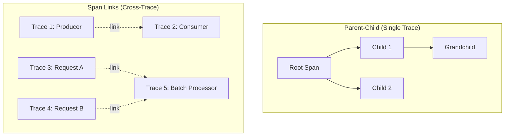
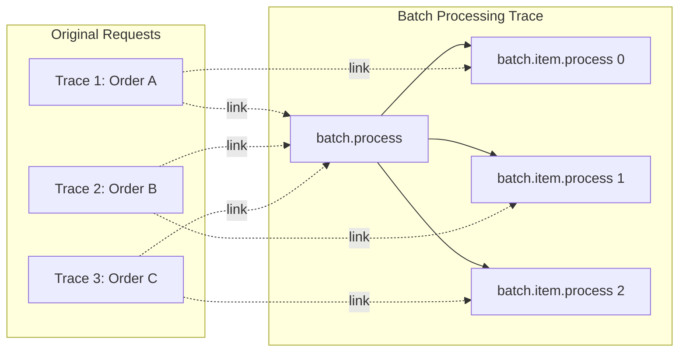
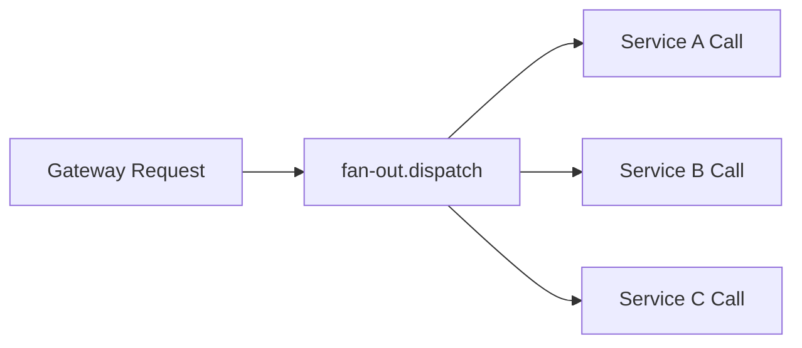
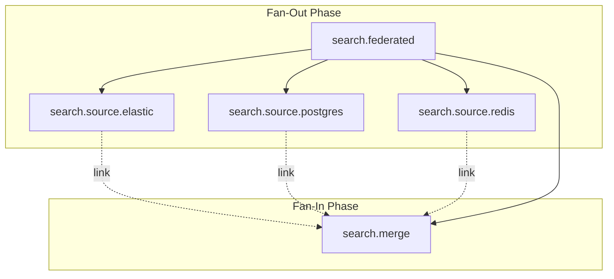

# How to Build Span Link Design Details

Author: [nawazdhandala](https://github.com/nawazdhandala)

Tags: Observability, Tracing, OpenTelemetry, Distributed Systems

Description: Learn how to implement span links to connect causally related spans across different traces.

---

> **Parent-child spans tell a linear story. Span links tell the complete story** - connecting work that spans multiple traces, batch operations, and asynchronous workflows.

In distributed systems, not every relationship fits neatly into a parent-child hierarchy. When a batch processor handles messages from dozens of different requests, when an async job finally completes work started hours ago, or when multiple services fan-out and later reconverge - these scenarios demand a different kind of connection. That connection is the **span link**.

This guide covers the design details of span links: when to use them, how to implement them correctly, and practical patterns for real-world distributed systems.

---

## Table of Contents

1. Span Links vs Parent-Child Relationships
2. Cross-Trace Correlation Use Cases
3. Batch Processing Span Links
4. Async Processing Correlation
5. Fan-Out/Fan-In Patterns
6. Link Attributes and Context
7. Implementation Deep Dive
8. Visualization and Debugging
9. Best Practices and Anti-Patterns
10. Summary

---

## 1. Span Links vs Parent-Child Relationships

Understanding when to use links versus parent-child relationships is fundamental to good trace design.

### Parent-Child Relationships

A parent-child relationship represents **direct causation within a single trace**. The child span:
- Executes as a direct result of the parent span
- Shares the same trace ID
- Has timing that falls within the parent's duration
- Represents work that blocks or is awaited by the parent

```
Trace A
└── Parent Span (HTTP Request)
    ├── Child Span (Auth Check)
    ├── Child Span (DB Query)
    └── Child Span (Response Serialization)
```

### Span Links

A span link represents **causal or correlational relationships across trace boundaries**. Linked spans:
- May belong to different traces (different trace IDs)
- May have non-overlapping timing
- Do not imply the linked span "belongs to" the linking span
- Preserve correlation without forcing artificial hierarchies

```
Trace A                          Trace B
└── Producer Span ─────link────> └── Consumer Span
    (publishes message)              (processes message)
```

### Decision Matrix

| Scenario | Use Parent-Child | Use Link |
|----------|-----------------|----------|
| Synchronous function call | Yes | No |
| Awaited async operation | Yes | No |
| Fire-and-forget message publish | No | Yes |
| Batch processing multiple origins | No | Yes |
| Fan-out to parallel services | Context-dependent | Often Yes |
| Scheduled job triggered by event | No | Yes |
| Aggregating results from multiple traces | No | Yes |

### Visual Comparison



---

## 2. Cross-Trace Correlation Use Cases

Span links shine in scenarios where work crosses trace boundaries but maintaining correlation is essential for debugging and understanding system behavior.

### Use Case 1: Message Queue Decoupling

When a producer publishes a message and a consumer processes it later, the consumer typically starts a new trace. Links preserve the connection.

```typescript
// Producer Service
async function publishOrder(order: Order) {
    const span = tracer.startSpan('order.publish', {
        kind: SpanKind.PRODUCER,
        attributes: {
            'messaging.system': 'kafka',
            'messaging.destination': 'orders',
        }
    });

    // Inject context into message headers for the consumer to link back
    const headers: Record<string, string> = {};
    propagation.inject(trace.setSpan(context.active(), span), headers);

    await kafka.send({
        topic: 'orders',
        messages: [{
            value: JSON.stringify(order),
            headers: headers  // Contains traceparent
        }]
    });

    span.end();
}
```

```typescript
// Consumer Service - Creates link back to producer
async function processOrderMessage(message: KafkaMessage) {
    // Extract the producer's span context from message headers
    const producerContext = propagation.extract(context.active(), message.headers);
    const producerSpanContext = trace.getSpanContext(producerContext);

    // Create new trace with link to producer (not as child)
    const links = producerSpanContext ? [{ context: producerSpanContext }] : [];

    const span = tracer.startSpan('order.process', {
        kind: SpanKind.CONSUMER,
        links: links,  // Link to producer span
        attributes: {
            'messaging.system': 'kafka',
            'messaging.destination': 'orders',
            'messaging.operation': 'process',
        }
    });

    try {
        await handleOrder(JSON.parse(message.value));
    } finally {
        span.end();
    }
}
```

### Use Case 2: Scheduled Job Triggered by Event

When an event schedules a job that runs later (possibly much later), the job should link back to the triggering event.

```typescript
// Event Handler - Schedules future work
async function onUserSignup(userId: string) {
    const span = tracer.startSpan('user.signup.handler');

    // Store span context for the scheduled job
    const spanContext = span.spanContext();

    await scheduler.schedule({
        jobType: 'send-welcome-email',
        payload: { userId },
        runAt: Date.now() + 24 * 60 * 60 * 1000, // 24 hours later
        metadata: {
            triggerTraceId: spanContext.traceId,
            triggerSpanId: spanContext.spanId,
            triggerTraceFlags: spanContext.traceFlags,
        }
    });

    span.end();
}

// Scheduled Job - Runs 24 hours later
async function executeWelcomeEmailJob(job: ScheduledJob) {
    // Reconstruct the triggering span context
    const triggerSpanContext: SpanContext = {
        traceId: job.metadata.triggerTraceId,
        spanId: job.metadata.triggerSpanId,
        traceFlags: job.metadata.triggerTraceFlags,
        isRemote: true,
    };

    const span = tracer.startSpan('job.send-welcome-email', {
        links: [{
            context: triggerSpanContext,
            attributes: { 'link.type': 'scheduled_trigger' }
        }],
    });

    try {
        await sendWelcomeEmail(job.payload.userId);
    } finally {
        span.end();
    }
}
```

### Use Case 3: Retry with New Trace

When retries should be isolated traces but still correlated to the original attempt:

```typescript
async function processWithRetry<T>(
    operation: () => Promise<T>,
    operationName: string,
    maxRetries: number = 3
): Promise<T> {
    let lastSpanContext: SpanContext | undefined;

    for (let attempt = 1; attempt <= maxRetries; attempt++) {
        const links: Link[] = lastSpanContext
            ? [{ context: lastSpanContext, attributes: { 'retry.previous_attempt': attempt - 1 } }]
            : [];

        const span = tracer.startSpan(`${operationName}.attempt`, {
            links,
            attributes: {
                'retry.attempt': attempt,
                'retry.max_attempts': maxRetries,
            }
        });

        try {
            const result = await context.with(
                trace.setSpan(context.active(), span),
                operation
            );
            span.setStatus({ code: SpanStatusCode.OK });
            span.end();
            return result;
        } catch (error) {
            span.recordException(error as Error);
            span.setStatus({ code: SpanStatusCode.ERROR });
            span.end();

            // Save context for next attempt to link back
            lastSpanContext = span.spanContext();

            if (attempt === maxRetries) throw error;
            await sleep(Math.pow(2, attempt) * 100); // Exponential backoff
        }
    }
    throw new Error('Unreachable');
}
```

---

## 3. Batch Processing Span Links

Batch processing is one of the most common and valuable use cases for span links. When a single operation processes items from multiple different original requests, links let you trace back to every origin.

### The Batch Processing Challenge

```
Request A (Trace 1) ──> Queue ──┐
Request B (Trace 2) ──> Queue ──┼──> Batch Processor ──> Database
Request C (Trace 3) ──> Queue ──┘
```

Without links, you lose the connection between the batch operation and the original requests. With links, you can navigate from the batch span to any of the originating spans.

### Implementation Pattern

```typescript
interface QueueMessage {
    payload: any;
    traceContext: {
        traceId: string;
        spanId: string;
        traceFlags: number;
    };
}

async function processBatch(messages: QueueMessage[]) {
    // Build links from all source messages
    const links: Link[] = messages
        .filter(msg => msg.traceContext)
        .map(msg => ({
            context: {
                traceId: msg.traceContext.traceId,
                spanId: msg.traceContext.spanId,
                traceFlags: msg.traceContext.traceFlags,
                isRemote: true,
            } as SpanContext,
            attributes: {
                'batch.item.index': messages.indexOf(msg),
            }
        }));

    const span = tracer.startSpan('batch.process', {
        links,
        attributes: {
            'batch.size': messages.length,
            'batch.link_count': links.length,
        }
    });

    try {
        // Process all messages
        const results = await Promise.all(
            messages.map(msg => processMessage(msg.payload))
        );

        span.setAttribute('batch.success_count', results.filter(r => r.success).length);
        span.setAttribute('batch.failure_count', results.filter(r => !r.success).length);

    } finally {
        span.end();
    }
}
```

### Batch Processing with Per-Item Spans

For detailed tracking, create child spans for each item while maintaining links to origins:

```typescript
async function processBatchWithItemSpans(messages: QueueMessage[]) {
    const batchLinks: Link[] = messages
        .filter(msg => msg.traceContext)
        .map(msg => ({
            context: {
                traceId: msg.traceContext.traceId,
                spanId: msg.traceContext.spanId,
                traceFlags: msg.traceContext.traceFlags,
                isRemote: true,
            } as SpanContext,
        }));

    const batchSpan = tracer.startSpan('batch.process', {
        links: batchLinks,
        attributes: { 'batch.size': messages.length }
    });

    await context.with(trace.setSpan(context.active(), batchSpan), async () => {
        for (let i = 0; i < messages.length; i++) {
            const msg = messages[i];

            // Per-item link to its specific origin
            const itemLink: Link[] = msg.traceContext ? [{
                context: {
                    traceId: msg.traceContext.traceId,
                    spanId: msg.traceContext.spanId,
                    traceFlags: msg.traceContext.traceFlags,
                    isRemote: true,
                } as SpanContext,
            }] : [];

            const itemSpan = tracer.startSpan('batch.item.process', {
                links: itemLink,
                attributes: {
                    'batch.item.index': i,
                    'batch.item.id': msg.payload.id,
                }
            });

            try {
                await processMessage(msg.payload);
            } catch (error) {
                itemSpan.recordException(error as Error);
                itemSpan.setStatus({ code: SpanStatusCode.ERROR });
            } finally {
                itemSpan.end();
            }
        }
    });

    batchSpan.end();
}
```

### Visual Representation



---

## 4. Async Processing Correlation

Asynchronous workflows present unique challenges for tracing. Work may be initiated in one context and completed in another, potentially much later.

### Pattern 1: Async Job Queue

```typescript
// Job Publisher
async function enqueueAsyncJob(jobType: string, payload: any) {
    const span = tracer.startSpan('job.enqueue', {
        kind: SpanKind.PRODUCER,
        attributes: {
            'job.type': jobType,
        }
    });

    const spanContext = span.spanContext();

    await jobQueue.add({
        type: jobType,
        payload,
        metadata: {
            enqueuedAt: Date.now(),
            sourceTrace: {
                traceId: spanContext.traceId,
                spanId: spanContext.spanId,
                traceFlags: spanContext.traceFlags,
            }
        }
    });

    span.end();
}

// Job Worker
async function processJob(job: Job) {
    const links: Link[] = [];

    if (job.metadata?.sourceTrace) {
        links.push({
            context: {
                traceId: job.metadata.sourceTrace.traceId,
                spanId: job.metadata.sourceTrace.spanId,
                traceFlags: job.metadata.sourceTrace.traceFlags,
                isRemote: true,
            } as SpanContext,
            attributes: {
                'link.type': 'async_job_source',
                'job.queue_time_ms': Date.now() - job.metadata.enqueuedAt,
            }
        });
    }

    const span = tracer.startSpan('job.execute', {
        kind: SpanKind.CONSUMER,
        links,
        attributes: {
            'job.type': job.type,
            'job.id': job.id,
        }
    });

    try {
        await executeJobHandler(job);
    } finally {
        span.end();
    }
}
```

### Pattern 2: Saga/Workflow Orchestration

Long-running workflows that span multiple transactions benefit from linking each step:

```typescript
interface WorkflowStep {
    stepId: string;
    traceId: string;
    spanId: string;
    traceFlags: number;
    completedAt: number;
}

class WorkflowOrchestrator {
    private completedSteps: WorkflowStep[] = [];

    async executeStep(stepName: string, handler: () => Promise<void>) {
        // Link to all previously completed steps
        const links: Link[] = this.completedSteps.map(step => ({
            context: {
                traceId: step.traceId,
                spanId: step.spanId,
                traceFlags: step.traceFlags,
                isRemote: true,
            } as SpanContext,
            attributes: {
                'workflow.previous_step': step.stepId,
                'workflow.step_gap_ms': Date.now() - step.completedAt,
            }
        }));

        const span = tracer.startSpan(`workflow.step.${stepName}`, {
            links,
            attributes: {
                'workflow.step': stepName,
                'workflow.step_number': this.completedSteps.length + 1,
            }
        });

        try {
            await handler();

            // Record this step for future linking
            const spanContext = span.spanContext();
            this.completedSteps.push({
                stepId: stepName,
                traceId: spanContext.traceId,
                spanId: spanContext.spanId,
                traceFlags: spanContext.traceFlags,
                completedAt: Date.now(),
            });

        } finally {
            span.end();
        }
    }
}

// Usage
const workflow = new WorkflowOrchestrator();
await workflow.executeStep('validate', validateOrder);
await workflow.executeStep('reserve-inventory', reserveInventory);
await workflow.executeStep('charge-payment', chargePayment);
await workflow.executeStep('ship', shipOrder);
```

### Pattern 3: Event Sourcing Correlation

In event-sourced systems, commands produce events that trigger projections and reactions:

```typescript
// Command Handler
async function handleCreateOrderCommand(command: CreateOrderCommand) {
    const span = tracer.startSpan('command.create_order', {
        attributes: { 'command.type': 'CreateOrder' }
    });

    const spanContext = span.spanContext();

    // Emit event with trace context
    await eventStore.append({
        type: 'OrderCreated',
        data: command.data,
        metadata: {
            sourceTraceId: spanContext.traceId,
            sourceSpanId: spanContext.spanId,
            sourceTraceFlags: spanContext.traceFlags,
        }
    });

    span.end();
}

// Event Projection Handler
async function projectOrderCreated(event: OrderCreatedEvent) {
    const links: Link[] = event.metadata?.sourceTraceId ? [{
        context: {
            traceId: event.metadata.sourceTraceId,
            spanId: event.metadata.sourceSpanId,
            traceFlags: event.metadata.sourceTraceFlags,
            isRemote: true,
        } as SpanContext,
        attributes: { 'link.type': 'event_source' }
    }] : [];

    const span = tracer.startSpan('projection.order_created', {
        links,
        attributes: {
            'event.type': event.type,
            'event.sequence': event.sequence,
        }
    });

    try {
        await updateReadModel(event);
    } finally {
        span.end();
    }
}
```

---

## 5. Fan-Out/Fan-In Patterns

Fan-out/fan-in patterns are common in distributed systems: one request triggers multiple parallel operations, and eventually the results are aggregated.

### Fan-Out Pattern



```typescript
async function fanOutRequest(request: AggregateRequest) {
    const span = tracer.startSpan('fan-out.dispatch', {
        attributes: {
            'fanout.target_count': request.targets.length,
        }
    });

    const childSpanContexts: SpanContext[] = [];

    await context.with(trace.setSpan(context.active(), span), async () => {
        const promises = request.targets.map(async (target, index) => {
            const childSpan = tracer.startSpan(`fan-out.call.${target.service}`, {
                kind: SpanKind.CLIENT,
                attributes: {
                    'fanout.target.service': target.service,
                    'fanout.target.index': index,
                }
            });

            // Store span context for fan-in linking
            childSpanContexts.push(childSpan.spanContext());

            try {
                const headers: Record<string, string> = {};
                propagation.inject(
                    trace.setSpan(context.active(), childSpan),
                    headers
                );

                const result = await fetch(target.url, { headers });
                childSpan.setAttribute('http.status_code', result.status);
                return { target: target.service, data: await result.json() };

            } catch (error) {
                childSpan.recordException(error as Error);
                childSpan.setStatus({ code: SpanStatusCode.ERROR });
                return { target: target.service, error };
            } finally {
                childSpan.end();
            }
        });

        const results = await Promise.all(promises);

        // Store contexts for the fan-in operation to link back
        span.setAttribute('fanout.completed_count', results.length);
    });

    span.end();
    return childSpanContexts; // Pass to fan-in
}
```

### Fan-In Pattern

The fan-in operation aggregates results and links back to all the fan-out operations:

```typescript
async function fanInAggregate(
    sourceContexts: SpanContext[],
    results: any[]
) {
    // Create links to all source spans from the fan-out
    const links: Link[] = sourceContexts.map((ctx, index) => ({
        context: ctx,
        attributes: {
            'fanin.source_index': index,
        }
    }));

    const span = tracer.startSpan('fan-in.aggregate', {
        links,
        attributes: {
            'fanin.source_count': sourceContexts.length,
            'fanin.result_count': results.length,
        }
    });

    try {
        // Aggregate logic
        const aggregated = results.reduce((acc, result) => {
            // Merge results
            return { ...acc, [result.target]: result.data };
        }, {});

        span.setAttribute('fanin.aggregated_keys', Object.keys(aggregated).length);
        return aggregated;

    } finally {
        span.end();
    }
}
```

### Complete Fan-Out/Fan-In Example

```typescript
interface SearchRequest {
    query: string;
    sources: string[];
}

async function federatedSearch(request: SearchRequest) {
    const rootSpan = tracer.startSpan('search.federated', {
        attributes: {
            'search.query': request.query,
            'search.source_count': request.sources.length,
        }
    });

    return context.with(trace.setSpan(context.active(), rootSpan), async () => {
        try {
            // Fan-out: Search each source in parallel
            const searchPromises = request.sources.map(source =>
                searchSource(source, request.query)
            );

            const searchResults = await Promise.all(searchPromises);

            // Collect span contexts from fan-out operations
            const fanOutContexts = searchResults
                .filter(r => r.spanContext)
                .map(r => r.spanContext!);

            // Fan-in: Merge and rank results
            const links: Link[] = fanOutContexts.map(ctx => ({
                context: ctx,
                attributes: { 'link.type': 'fanout_source' }
            }));

            const mergeSpan = tracer.startSpan('search.merge', {
                links,
                attributes: {
                    'search.source_results': searchResults.length,
                }
            });

            const merged = mergeAndRankResults(searchResults.map(r => r.results));

            mergeSpan.setAttribute('search.merged_count', merged.length);
            mergeSpan.end();

            rootSpan.setAttribute('search.total_results', merged.length);
            return merged;

        } finally {
            rootSpan.end();
        }
    });
}

async function searchSource(source: string, query: string) {
    const span = tracer.startSpan(`search.source.${source}`, {
        kind: SpanKind.CLIENT,
        attributes: {
            'search.source': source,
            'search.query': query,
        }
    });

    try {
        const results = await fetchFromSource(source, query);
        span.setAttribute('search.result_count', results.length);
        return { results, spanContext: span.spanContext() };
    } catch (error) {
        span.recordException(error as Error);
        span.setStatus({ code: SpanStatusCode.ERROR });
        return { results: [], spanContext: span.spanContext() };
    } finally {
        span.end();
    }
}
```

### Visual: Complete Fan-Out/Fan-In Flow



---

## 6. Link Attributes and Context

Link attributes provide crucial metadata about the relationship between spans. They help answer "why are these spans connected?" and enable more sophisticated trace analysis.

### Standard Link Attributes

```typescript
// Link type categorization
const link: Link = {
    context: sourceSpanContext,
    attributes: {
        'link.type': 'batch_source',        // Categorize the relationship
        'link.index': 5,                     // Position in a sequence
        'link.queue_delay_ms': 1523,         // Time between spans
        'link.correlation_id': 'order-123',  // Business correlation
    }
};
```

### Semantic Link Attributes

Define consistent semantic attributes for your organization:

```typescript
// Link attribute constants
const LinkAttributes = {
    // Relationship type
    TYPE: 'link.type',

    // Timing
    DELAY_MS: 'link.delay_ms',
    GAP_MS: 'link.gap_ms',

    // Batch processing
    BATCH_INDEX: 'link.batch.index',
    BATCH_SIZE: 'link.batch.size',

    // Async processing
    QUEUE_NAME: 'link.queue.name',
    QUEUE_DELAY_MS: 'link.queue.delay_ms',

    // Retry
    RETRY_ATTEMPT: 'link.retry.attempt',
    RETRY_REASON: 'link.retry.reason',

    // Workflow
    WORKFLOW_STEP: 'link.workflow.step',
    WORKFLOW_ID: 'link.workflow.id',
} as const;

// Link type values
const LinkTypes = {
    BATCH_SOURCE: 'batch_source',
    ASYNC_TRIGGER: 'async_trigger',
    RETRY_PREVIOUS: 'retry_previous',
    FANOUT_SOURCE: 'fanout_source',
    FANIN_TARGET: 'fanin_target',
    WORKFLOW_PREDECESSOR: 'workflow_predecessor',
    EVENT_SOURCE: 'event_source',
    SCHEDULED_TRIGGER: 'scheduled_trigger',
} as const;
```

### Rich Link Examples

```typescript
// Batch processing link with full context
function createBatchLink(
    sourceContext: SpanContext,
    index: number,
    batchSize: number,
    queueDelay: number
): Link {
    return {
        context: sourceContext,
        attributes: {
            [LinkAttributes.TYPE]: LinkTypes.BATCH_SOURCE,
            [LinkAttributes.BATCH_INDEX]: index,
            [LinkAttributes.BATCH_SIZE]: batchSize,
            [LinkAttributes.QUEUE_DELAY_MS]: queueDelay,
        }
    };
}

// Retry link with failure context
function createRetryLink(
    previousContext: SpanContext,
    attempt: number,
    failureReason: string
): Link {
    return {
        context: previousContext,
        attributes: {
            [LinkAttributes.TYPE]: LinkTypes.RETRY_PREVIOUS,
            [LinkAttributes.RETRY_ATTEMPT]: attempt,
            [LinkAttributes.RETRY_REASON]: failureReason,
        }
    };
}

// Workflow step link
function createWorkflowLink(
    predecessorContext: SpanContext,
    workflowId: string,
    previousStep: string,
    gapMs: number
): Link {
    return {
        context: predecessorContext,
        attributes: {
            [LinkAttributes.TYPE]: LinkTypes.WORKFLOW_PREDECESSOR,
            [LinkAttributes.WORKFLOW_ID]: workflowId,
            [LinkAttributes.WORKFLOW_STEP]: previousStep,
            [LinkAttributes.GAP_MS]: gapMs,
        }
    };
}
```

### Context Preservation Utilities

```typescript
// Serialize span context for storage
function serializeSpanContext(span: Span): string {
    const ctx = span.spanContext();
    return JSON.stringify({
        traceId: ctx.traceId,
        spanId: ctx.spanId,
        traceFlags: ctx.traceFlags,
        traceState: ctx.traceState?.serialize(),
    });
}

// Deserialize span context
function deserializeSpanContext(serialized: string): SpanContext {
    const data = JSON.parse(serialized);
    return {
        traceId: data.traceId,
        spanId: data.spanId,
        traceFlags: data.traceFlags,
        traceState: data.traceState ?
            TraceState.fromString(data.traceState) : undefined,
        isRemote: true,
    };
}

// Extract context from various sources
function extractLinkContext(source: any): SpanContext | undefined {
    // From message headers (W3C format)
    if (source.traceparent) {
        const extracted = propagation.extract(context.active(), source);
        return trace.getSpanContext(extracted);
    }

    // From stored metadata
    if (source.traceId && source.spanId) {
        return {
            traceId: source.traceId,
            spanId: source.spanId,
            traceFlags: source.traceFlags ?? TraceFlags.SAMPLED,
            isRemote: true,
        };
    }

    return undefined;
}
```

---

## 7. Implementation Deep Dive

Let's build a complete, production-ready span link implementation.

### Link Builder Utility

```typescript
import {
    Link,
    SpanContext,
    TraceFlags,
    context,
    trace,
    propagation
} from '@opentelemetry/api';

interface LinkBuilderOptions {
    type: string;
    attributes?: Record<string, any>;
}

class SpanLinkBuilder {
    private links: Link[] = [];

    /**
     * Add a link from a SpanContext
     */
    addFromContext(
        spanContext: SpanContext,
        options: LinkBuilderOptions
    ): this {
        if (this.isValidContext(spanContext)) {
            this.links.push({
                context: spanContext,
                attributes: {
                    'link.type': options.type,
                    ...options.attributes,
                }
            });
        }
        return this;
    }

    /**
     * Add a link from serialized trace context (e.g., from database/queue)
     */
    addFromSerialized(
        serialized: {
            traceId: string;
            spanId: string;
            traceFlags?: number;
        },
        options: LinkBuilderOptions
    ): this {
        const spanContext: SpanContext = {
            traceId: serialized.traceId,
            spanId: serialized.spanId,
            traceFlags: serialized.traceFlags ?? TraceFlags.SAMPLED,
            isRemote: true,
        };
        return this.addFromContext(spanContext, options);
    }

    /**
     * Add a link by extracting from carrier (headers, message properties)
     */
    addFromCarrier(
        carrier: Record<string, string>,
        options: LinkBuilderOptions
    ): this {
        const extracted = propagation.extract(context.active(), carrier);
        const spanContext = trace.getSpanContext(extracted);
        if (spanContext) {
            return this.addFromContext(spanContext, options);
        }
        return this;
    }

    /**
     * Add links from a batch of sources
     */
    addBatch<T>(
        items: T[],
        extractor: (item: T, index: number) => SpanContext | undefined,
        options: Omit<LinkBuilderOptions, 'attributes'> & {
            attributesFactory?: (item: T, index: number) => Record<string, any>;
        }
    ): this {
        items.forEach((item, index) => {
            const spanContext = extractor(item, index);
            if (spanContext && this.isValidContext(spanContext)) {
                this.links.push({
                    context: spanContext,
                    attributes: {
                        'link.type': options.type,
                        'link.batch.index': index,
                        'link.batch.size': items.length,
                        ...options.attributesFactory?.(item, index),
                    }
                });
            }
        });
        return this;
    }

    /**
     * Build the final links array
     */
    build(): Link[] {
        return [...this.links];
    }

    private isValidContext(ctx: SpanContext): boolean {
        return ctx.traceId !== '00000000000000000000000000000000' &&
               ctx.spanId !== '0000000000000000';
    }
}

// Factory function
function linkBuilder(): SpanLinkBuilder {
    return new SpanLinkBuilder();
}
```

### Usage Examples

```typescript
// Simple link from stored context
const links = linkBuilder()
    .addFromSerialized(
        { traceId: storedTraceId, spanId: storedSpanId },
        { type: 'async_trigger' }
    )
    .build();

// Batch processing links
const batchLinks = linkBuilder()
    .addBatch(
        messages,
        (msg) => msg.metadata?.spanContext,
        {
            type: 'batch_source',
            attributesFactory: (msg, idx) => ({
                'message.id': msg.id,
                'message.queue_time_ms': Date.now() - msg.enqueuedAt,
            })
        }
    )
    .build();

// Fan-in with multiple source types
const fanInLinks = linkBuilder()
    .addFromCarrier(httpHeaders, { type: 'http_source' })
    .addFromSerialized(dbRecord.traceContext, { type: 'db_trigger' })
    .addFromContext(previousSpan.spanContext(), { type: 'previous_step' })
    .build();
```

### Trace Context Storage Pattern

For long-running async workflows, you need to persist trace context:

```typescript
interface StoredTraceContext {
    traceId: string;
    spanId: string;
    traceFlags: number;
    storedAt: number;
    metadata?: Record<string, any>;
}

class TraceContextStore {
    constructor(private storage: KeyValueStore) {}

    async store(
        key: string,
        span: Span,
        metadata?: Record<string, any>
    ): Promise<void> {
        const ctx = span.spanContext();
        const stored: StoredTraceContext = {
            traceId: ctx.traceId,
            spanId: ctx.spanId,
            traceFlags: ctx.traceFlags,
            storedAt: Date.now(),
            metadata,
        };
        await this.storage.set(key, JSON.stringify(stored));
    }

    async retrieve(key: string): Promise<StoredTraceContext | null> {
        const data = await this.storage.get(key);
        if (!data) return null;
        return JSON.parse(data);
    }

    async retrieveAsLink(
        key: string,
        linkType: string
    ): Promise<Link | null> {
        const stored = await this.retrieve(key);
        if (!stored) return null;

        return {
            context: {
                traceId: stored.traceId,
                spanId: stored.spanId,
                traceFlags: stored.traceFlags,
                isRemote: true,
            },
            attributes: {
                'link.type': linkType,
                'link.stored_age_ms': Date.now() - stored.storedAt,
                ...stored.metadata,
            }
        };
    }

    async delete(key: string): Promise<void> {
        await this.storage.delete(key);
    }
}
```

---

## 8. Visualization and Debugging

Understanding how span links appear in observability tools is crucial for effective debugging.

### Trace Visualization Concepts

```
Traditional Parent-Child View:
================================
Trace: abc123
├─ [100ms] api.request
│  ├─ [20ms] auth.validate
│  ├─ [50ms] db.query
│  └─ [25ms] response.serialize

With Links (Cross-Trace):
================================
Trace: xyz789 (batch processing)
├─ [500ms] batch.process
│  │
│  ├── Links to:
│  │   ├─ Trace abc123: api.request (Order A)
│  │   ├─ Trace def456: api.request (Order B)
│  │   └─ Trace ghi789: api.request (Order C)
│  │
│  ├─ [100ms] batch.item.0
│  ├─ [150ms] batch.item.1
│  └─ [200ms] batch.item.2
```

### Debugging with Links

When investigating issues, links help you:

1. **Trace backwards**: From a batch failure to specific originating requests
2. **Trace forwards**: From a request to its eventual async processing
3. **Understand timing**: Queue delays, processing gaps, retry patterns

```typescript
// Logging for debugging links
function logSpanWithLinks(span: Span, links: Link[]) {
    const spanContext = span.spanContext();
    console.log(`Span: ${spanContext.spanId} (Trace: ${spanContext.traceId})`);
    console.log(`Links: ${links.length}`);
    links.forEach((link, i) => {
        console.log(`  [${i}] -> Trace: ${link.context.traceId}, Span: ${link.context.spanId}`);
        if (link.attributes) {
            console.log(`       Type: ${link.attributes['link.type']}`);
        }
    });
}
```

### Query Patterns for Linked Traces

When querying your observability backend:

```sql
-- Find all spans linked to a specific trace
SELECT * FROM spans
WHERE links @> '[{"traceId": "abc123"}]'

-- Find batch processors that handled a specific request
SELECT batch_span.*
FROM spans batch_span
JOIN span_links sl ON batch_span.span_id = sl.span_id
WHERE sl.linked_trace_id = 'original_request_trace_id'
AND batch_span.name LIKE 'batch.%'

-- Analyze link delays
SELECT
    span_name,
    AVG(link_attributes->>'link.queue_delay_ms') as avg_queue_delay
FROM spans
WHERE links IS NOT NULL
GROUP BY span_name
```

---

## 9. Best Practices and Anti-Patterns

### Best Practices

**1. Use Consistent Link Types**
```typescript
// Good: Consistent, documented link types
const LinkTypes = {
    BATCH_SOURCE: 'batch_source',
    ASYNC_TRIGGER: 'async_trigger',
    RETRY_PREVIOUS: 'retry_previous',
} as const;
```

**2. Include Timing Information**
```typescript
// Good: Capture the delay for debugging
const link: Link = {
    context: sourceContext,
    attributes: {
        'link.type': 'async_trigger',
        'link.delay_ms': Date.now() - sourceTimestamp,
    }
};
```

**3. Limit Links Per Span**
```typescript
// Good: Cap the number of links in high-volume scenarios
const MAX_LINKS = 100;
const links = sourceContexts.slice(0, MAX_LINKS).map(ctx => ({
    context: ctx,
    attributes: { 'link.type': 'batch_source' }
}));

if (sourceContexts.length > MAX_LINKS) {
    // Record that we truncated
    span.setAttribute('batch.links_truncated', true);
    span.setAttribute('batch.total_sources', sourceContexts.length);
}
```

**4. Validate Contexts Before Linking**
```typescript
function isValidSpanContext(ctx: SpanContext): boolean {
    const invalidTraceId = '00000000000000000000000000000000';
    const invalidSpanId = '0000000000000000';
    return ctx.traceId !== invalidTraceId && ctx.spanId !== invalidSpanId;
}
```

### Anti-Patterns

**1. Using Links Instead of Parent-Child**
```typescript
// Bad: Using links for synchronous, direct causation
async function handleRequest() {
    const parentSpan = tracer.startSpan('request');

    // Wrong: This should be a child span, not a linked span
    const dbSpan = tracer.startSpan('db.query', {
        links: [{ context: parentSpan.spanContext() }]  // Don't do this!
    });
}

// Good: Use proper parent-child relationship
async function handleRequest() {
    const parentSpan = tracer.startSpan('request');
    context.with(trace.setSpan(context.active(), parentSpan), () => {
        const dbSpan = tracer.startSpan('db.query');  // Automatically a child
        // ...
        dbSpan.end();
    });
    parentSpan.end();
}
```

**2. Creating Excessive Links**
```typescript
// Bad: Linking to every single item in a large batch
const links = millionItems.map(item => ({  // Don't do this!
    context: item.spanContext
}));

// Good: Sample or summarize
const sampledLinks = sampleItems(millionItems, 100).map(item => ({
    context: item.spanContext,
    attributes: { 'link.type': 'batch_sample' }
}));
span.setAttribute('batch.total_items', millionItems.length);
span.setAttribute('batch.sampled_links', sampledLinks.length);
```

**3. Missing Link Context**
```typescript
// Bad: Links without any context about the relationship
const links = contexts.map(ctx => ({ context: ctx }));  // What are these?

// Good: Always include link type and relevant metadata
const links = contexts.map((ctx, i) => ({
    context: ctx,
    attributes: {
        'link.type': 'batch_source',
        'link.index': i,
    }
}));
```

**4. Not Handling Invalid Contexts**
```typescript
// Bad: Assuming all contexts are valid
const links = messages.map(m => ({
    context: m.traceContext  // Might be invalid or undefined!
}));

// Good: Filter and validate
const links = messages
    .filter(m => m.traceContext && isValidSpanContext(m.traceContext))
    .map(m => ({
        context: m.traceContext,
        attributes: { 'link.type': 'message_source' }
    }));
```

---

## 10. Summary

### When to Use Span Links

| Scenario | Use Case | Link Type |
|----------|----------|-----------|
| Message queue processing | Consumer links to producer | `async_trigger` |
| Batch processing | Batch span links to all sources | `batch_source` |
| Fan-out/fan-in | Aggregator links to parallel calls | `fanout_source` |
| Scheduled jobs | Job links to scheduling event | `scheduled_trigger` |
| Retry operations | New attempt links to previous | `retry_previous` |
| Event sourcing | Handler links to command | `event_source` |
| Workflow orchestration | Step links to predecessors | `workflow_predecessor` |

### Key Design Principles

1. **Links for correlation, parent-child for causation**: Use links when spans belong to different traces but are meaningfully related.

2. **Always include link type**: Make relationships explicit and queryable.

3. **Capture timing metadata**: Queue delays and gaps help diagnose performance issues.

4. **Validate and limit**: Always validate span contexts and cap the number of links.

5. **Design for debugging**: Think about how you will query and navigate links when investigating issues.

### Implementation Checklist

- [ ] Define consistent link types for your organization
- [ ] Implement context serialization for async workflows
- [ ] Add validation for span contexts before linking
- [ ] Include timing attributes (delays, gaps)
- [ ] Set reasonable limits on links per span
- [ ] Document link semantics for your team
- [ ] Test link navigation in your observability UI

---

*Ready to visualize your span links? Send your traces to [OneUptime](https://oneuptime.com) and see how linked spans connect your distributed workflows across services and time.*

---

### Related Reading

- [Traces and Spans in OpenTelemetry](/blog/post/2025-08-27-traces-and-spans-in-opentelemetry/) - Foundation concepts for understanding span relationships
- [How to Reduce Noise in OpenTelemetry](/blog/post/2025-08-25-how-to-reduce-noise-in-opentelemetry/) - Keep your traces clean while maintaining link fidelity
- [How to Name Spans in OpenTelemetry](/blog/post/2024-11-04-how-to-name-spans-in-opentelemetry/) - Consistent naming makes linked spans easier to navigate
