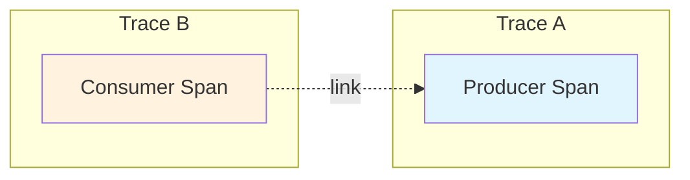
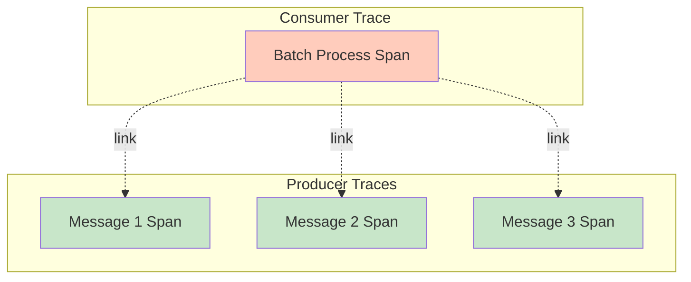
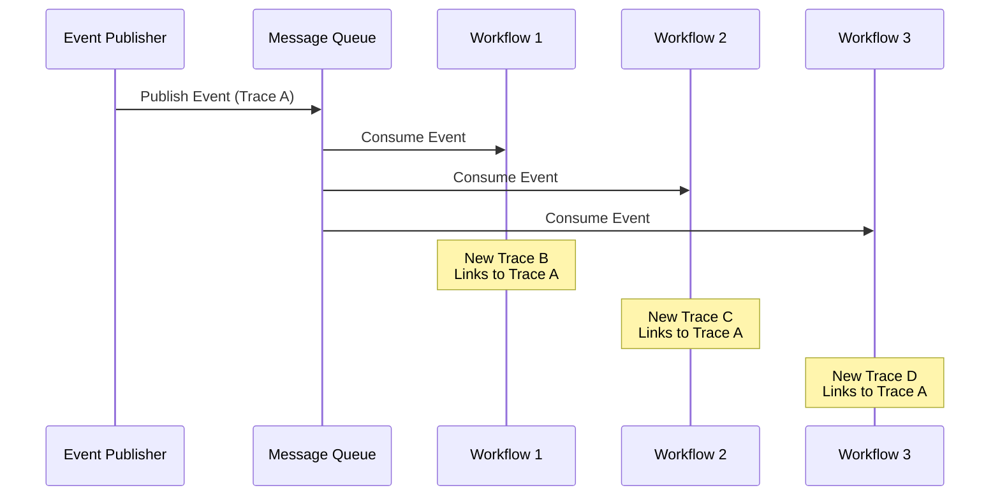
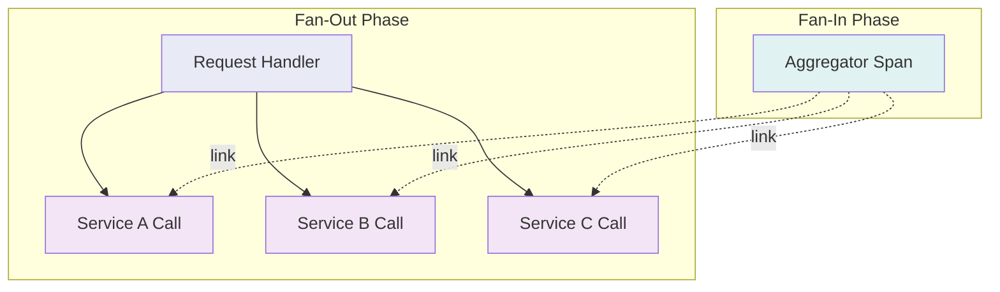
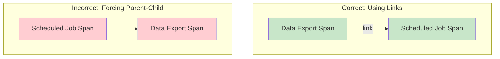

# How to Implement Span Link Design

Author: [nawazdhandala](https://github.com/nawazdhandala)

Tags: Observability, Tracing, OpenTelemetry, Distributed Systems

Description: Learn how to implement span links for connecting causally related traces in distributed systems.

---

## Introduction

In distributed systems, tracing helps you understand how requests flow through your services. While parent-child relationships work well for synchronous calls, many real-world scenarios involve asynchronous processing, batch operations, or fan-out patterns where a simple hierarchy falls short. This is where **span links** come in.

Span links allow you to connect spans that are causally related but do not share a direct parent-child relationship. They provide a way to reference other spans across different traces, enabling richer context for debugging and analysis.

## What Are Span Links?

A span link is a reference from one span to another span (which may be in the same or a different trace). Unlike parent-child relationships, links are:

- **Non-hierarchical**: They do not imply a timing or structural relationship
- **Multi-directional**: A span can link to multiple other spans
- **Cross-trace**: Links can connect spans from entirely different traces



## Use Cases for Span Links

### 1. Batch Processing Links

When a batch processor consumes multiple messages and processes them together, each input message may have its own trace. The processing span should link back to all original producer spans.



Here is how to implement batch processing with span links in Python using OpenTelemetry:

```python
from opentelemetry import trace
from opentelemetry.trace import Link, SpanContext, TraceFlags
from opentelemetry.sdk.trace import TracerProvider
from opentelemetry.sdk.trace.export import ConsoleSpanExporter, BatchSpanProcessor

# Initialize the tracer provider
provider = TracerProvider()
processor = BatchSpanProcessor(ConsoleSpanExporter())
provider.add_span_processor(processor)
trace.set_tracer_provider(provider)

# Get a tracer instance
tracer = trace.get_tracer(__name__)


def process_batch(messages):
    """
    Process a batch of messages, linking to each original producer span.

    Args:
        messages: List of messages, each containing trace context from the producer
    """
    # Extract span contexts from incoming messages
    # Each message carries the trace context of its producer
    links = []
    for message in messages:
        # Create a link to the producer span
        # The SpanContext contains trace_id, span_id, and trace flags
        producer_context = SpanContext(
            trace_id=message["trace_id"],
            span_id=message["span_id"],
            is_remote=True,
            trace_flags=TraceFlags(0x01)  # Sampled flag
        )

        # Add attributes to the link for additional context
        link = Link(
            context=producer_context,
            attributes={
                "messaging.message_id": message["id"],
                "messaging.batch.index": messages.index(message)
            }
        )
        links.append(link)

    # Create a new span with links to all producer spans
    # This span represents the batch processing operation
    with tracer.start_as_current_span(
        "process_batch",
        links=links,
        attributes={
            "batch.size": len(messages),
            "batch.processor": "batch-worker-1"
        }
    ) as span:
        # Process each message in the batch
        for message in messages:
            process_single_message(message)

        span.set_attribute("batch.processed_count", len(messages))


def process_single_message(message):
    """Process an individual message within the batch."""
    # Create a child span for individual message processing
    with tracer.start_as_current_span(
        "process_message",
        attributes={"message.id": message["id"]}
    ):
        # Your message processing logic here
        pass
```

### 2. Async Workflow Links

In event-driven architectures, a single event might trigger multiple independent workflows. Each workflow should link back to the triggering event rather than being a child of it.



Here is an implementation for async workflow links in TypeScript:

```typescript
import {
  trace,
  context,
  SpanContext,
  Link,
  SpanKind,
  Span
} from '@opentelemetry/api';
import { NodeTracerProvider } from '@opentelemetry/sdk-trace-node';
import { SimpleSpanProcessor, ConsoleSpanExporter } from '@opentelemetry/sdk-trace-base';

// Initialize tracing
const provider = new NodeTracerProvider();
provider.addSpanProcessor(new SimpleSpanProcessor(new ConsoleSpanExporter()));
provider.register();

const tracer = trace.getTracer('async-workflow-service');

// Interface for events with trace context
interface TracedEvent {
  eventId: string;
  eventType: string;
  payload: unknown;
  // Trace context from the event publisher
  traceContext: {
    traceId: string;
    spanId: string;
    traceFlags: number;
  };
}

/**
 * Creates a link to the original event span.
 * This preserves the causal relationship without creating a parent-child hierarchy.
 */
function createEventLink(event: TracedEvent): Link {
  const spanContext: SpanContext = {
    traceId: event.traceContext.traceId,
    spanId: event.traceContext.spanId,
    traceFlags: event.traceContext.traceFlags,
    isRemote: true
  };

  return {
    context: spanContext,
    attributes: {
      'event.id': event.eventId,
      'event.type': event.eventType,
      'link.relationship': 'triggered_by'
    }
  };
}

/**
 * Handles an async workflow triggered by an event.
 * Creates a new trace that links back to the triggering event.
 */
async function handleAsyncWorkflow(
  workflowName: string,
  event: TracedEvent,
  workflowFn: (span: Span) => Promise<void>
): Promise<void> {
  // Create a link to the event that triggered this workflow
  const eventLink = createEventLink(event);

  // Start a new root span (new trace) with a link to the triggering event
  // Using SpanKind.CONSUMER indicates this span consumes a message
  await tracer.startActiveSpan(
    workflowName,
    {
      kind: SpanKind.CONSUMER,
      links: [eventLink],
      attributes: {
        'workflow.name': workflowName,
        'workflow.trigger.event_id': event.eventId
      }
    },
    async (span) => {
      try {
        // Execute the workflow logic
        await workflowFn(span);
        span.setStatus({ code: 0 }); // OK status
      } catch (error) {
        // Record any errors that occur during workflow execution
        span.setStatus({
          code: 2, // ERROR status
          message: error instanceof Error ? error.message : 'Unknown error'
        });
        span.recordException(error as Error);
        throw error;
      } finally {
        span.end();
      }
    }
  );
}

// Example: Multiple workflows triggered by a single order event
async function processOrderEvent(event: TracedEvent): Promise<void> {
  // Each workflow runs independently with its own trace
  // All workflows link back to the original order event

  await Promise.all([
    // Workflow 1: Send confirmation email
    handleAsyncWorkflow('send-confirmation-email', event, async (span) => {
      span.setAttribute('email.type', 'order_confirmation');
      // Email sending logic here
    }),

    // Workflow 2: Update inventory
    handleAsyncWorkflow('update-inventory', event, async (span) => {
      span.setAttribute('inventory.action', 'decrement');
      // Inventory update logic here
    }),

    // Workflow 3: Notify warehouse
    handleAsyncWorkflow('notify-warehouse', event, async (span) => {
      span.setAttribute('notification.channel', 'warehouse_queue');
      // Warehouse notification logic here
    })
  ]);
}
```

### 3. Fan-Out and Fan-In Patterns

When a request fans out to multiple services and later consolidates results, span links help track the relationships without distorting the timing hierarchy.



Here is a Go implementation demonstrating fan-out and fan-in with span links:

```go
package main

import (
	"context"
	"sync"

	"go.opentelemetry.io/otel"
	"go.opentelemetry.io/otel/attribute"
	"go.opentelemetry.io/otel/trace"
)

var tracer = otel.Tracer("fan-out-service")

// ServiceResult holds the result from a service call along with its span context
type ServiceResult struct {
	ServiceName string
	Data        interface{}
	SpanContext trace.SpanContext
	Error       error
}

// fanOutToServices makes parallel calls to multiple services
// and collects their span contexts for later linking
func fanOutToServices(ctx context.Context, services []string) []ServiceResult {
	var wg sync.WaitGroup
	results := make([]ServiceResult, len(services))

	for i, service := range services {
		wg.Add(1)
		go func(index int, serviceName string) {
			defer wg.Done()

			// Create a child span for each service call
			ctx, span := tracer.Start(ctx, "call-"+serviceName,
				trace.WithAttributes(
					attribute.String("service.name", serviceName),
					attribute.Int("service.index", index),
				),
			)
			defer span.End()

			// Store the span context for linking in the aggregator
			results[index] = ServiceResult{
				ServiceName: serviceName,
				SpanContext: span.SpanContext(),
				Data:        callService(serviceName), // Your service call logic
			}
		}(i, service)
	}

	wg.Wait()
	return results
}

// aggregateResults creates an aggregator span that links to all service call spans
func aggregateResults(ctx context.Context, results []ServiceResult) interface{} {
	// Build links to all the service call spans
	links := make([]trace.Link, 0, len(results))
	for _, result := range results {
		if result.SpanContext.IsValid() {
			link := trace.Link{
				SpanContext: result.SpanContext,
				Attributes: []attribute.KeyValue{
					attribute.String("link.service", result.ServiceName),
					attribute.String("link.relationship", "aggregates"),
				},
			}
			links = append(links, link)
		}
	}

	// Create the aggregator span with links to all source spans
	ctx, span := tracer.Start(ctx, "aggregate-results",
		trace.WithLinks(links...),
		trace.WithAttributes(
			attribute.Int("aggregation.source_count", len(results)),
		),
	)
	defer span.End()

	// Perform aggregation logic
	aggregatedData := performAggregation(results)

	span.SetAttributes(
		attribute.Bool("aggregation.success", true),
	)

	return aggregatedData
}

// handleRequest orchestrates the fan-out and fan-in pattern
func handleRequest(ctx context.Context) interface{} {
	ctx, span := tracer.Start(ctx, "handle-request")
	defer span.End()

	// Fan out to multiple services
	services := []string{"service-a", "service-b", "service-c"}
	results := fanOutToServices(ctx, services)

	// Fan in and aggregate results
	return aggregateResults(ctx, results)
}

// Helper functions (implement based on your needs)
func callService(name string) interface{} {
	// Your service call implementation
	return nil
}

func performAggregation(results []ServiceResult) interface{} {
	// Your aggregation logic
	return nil
}
```

## Link Attributes

Link attributes provide additional context about the relationship between spans. Here are common attributes you should consider:

| Attribute | Description | Example Value |
|-----------|-------------|---------------|
| `link.relationship` | Describes how spans are related | `triggered_by`, `aggregates`, `continues` |
| `messaging.message_id` | ID of the message being processed | `msg-12345` |
| `messaging.batch.index` | Position in a batch | `0`, `1`, `2` |
| `event.id` | ID of the triggering event | `evt-67890` |
| `workflow.name` | Name of the triggered workflow | `order-processing` |

Here is an example of adding rich attributes to span links:

```python
from opentelemetry.trace import Link

def create_enriched_link(span_context, relationship_type, metadata):
    """
    Creates a span link with rich contextual attributes.

    Args:
        span_context: The SpanContext to link to
        relationship_type: The type of relationship (e.g., 'triggered_by', 'aggregates')
        metadata: Additional metadata about the relationship

    Returns:
        A Link object with attributes
    """
    attributes = {
        # Core relationship information
        "link.relationship": relationship_type,

        # Timing information (when applicable)
        "link.delay_ms": metadata.get("delay_ms", 0),

        # Source identification
        "link.source.service": metadata.get("source_service", "unknown"),
        "link.source.operation": metadata.get("source_operation", "unknown"),

        # Business context
        "link.business.transaction_id": metadata.get("transaction_id"),
        "link.business.correlation_id": metadata.get("correlation_id"),
    }

    # Remove None values to keep the link clean
    attributes = {k: v for k, v in attributes.items() if v is not None}

    return Link(context=span_context, attributes=attributes)
```

## Best Practices for Span Links

### 1. Use Links for Causal Relationships Without Hierarchy

When spans are related but one is not the direct cause of the other starting, use links instead of parent-child relationships.



### 2. Limit the Number of Links

While there is no strict limit, having too many links can make traces hard to navigate. Consider these guidelines:

- For batch processing, consider sampling or limiting links to the first N items
- Group related messages and create summary links when possible
- Document your linking strategy for consistency across services

```python
MAX_LINKS = 100  # Reasonable limit for batch processing

def create_batch_links(messages):
    """
    Creates links for batch messages with a reasonable limit.
    Logs a warning if messages exceed the limit.
    """
    if len(messages) > MAX_LINKS:
        # Log that we are sampling links
        logger.warning(
            f"Batch size {len(messages)} exceeds link limit {MAX_LINKS}. "
            "Sampling links to first {MAX_LINKS} messages."
        )
        messages = messages[:MAX_LINKS]

    return [create_link_from_message(msg) for msg in messages]
```

### 3. Propagate Context Correctly

Ensure trace context is properly propagated in your messages so consumers can create valid links.

```typescript
import { context, trace, propagation } from '@opentelemetry/api';

interface Message {
  id: string;
  payload: unknown;
  traceContext: Record<string, string>;
}

/**
 * Injects the current trace context into a message for propagation.
 * This allows consumers to create links back to the producer span.
 */
function injectTraceContext(message: Omit<Message, 'traceContext'>): Message {
  const carrier: Record<string, string> = {};

  // Inject the current context into the carrier object
  // This includes trace ID, span ID, and trace flags
  propagation.inject(context.active(), carrier);

  return {
    ...message,
    traceContext: carrier
  };
}

/**
 * Extracts trace context from a message to create a link.
 * Returns the span context for linking purposes.
 */
function extractSpanContextForLink(message: Message): trace.SpanContext | null {
  // Extract the context from the message carrier
  const extractedContext = propagation.extract(
    context.active(),
    message.traceContext
  );

  // Get the span from the extracted context
  const span = trace.getSpan(extractedContext);
  if (span) {
    return span.spanContext();
  }

  return null;
}
```

### 4. Document Link Semantics

Create clear documentation about what your links represent. This helps operators understand the trace visualization.

```yaml
# Example: Link documentation in your service README
span_links:
  - name: batch_processing_link
    description: Links from batch processor to individual message producers
    direction: consumer -> producer
    attributes:
      - messaging.message_id
      - messaging.batch.index

  - name: workflow_trigger_link
    description: Links from async workflow to triggering event
    direction: workflow -> event
    attributes:
      - event.id
      - link.relationship (always "triggered_by")
```

## Querying and Visualizing Span Links

Most modern tracing backends support span links. Here is how to query them:

### Querying in Jaeger

```
# Find traces with links to a specific trace ID
service=my-service AND link.traceID=abc123
```

### Querying in Grafana Tempo

```
{ span.links.traceID = "abc123" }
```

The visualization typically shows links as dashed lines connecting spans across traces, making it easy to follow the causal relationships.

## Summary

Span links are a powerful feature in distributed tracing that enable you to:

- Connect batch consumers to their producers
- Link async workflows to triggering events
- Track fan-out and fan-in patterns
- Maintain causal relationships without forcing hierarchical structures

By implementing span links correctly, you gain visibility into complex distributed workflows that would otherwise be difficult to trace and debug. Start by identifying the patterns in your system that would benefit from links, then implement them consistently across your services.

## Further Reading

- [OpenTelemetry Specification: Links](https://opentelemetry.io/docs/concepts/signals/traces/#span-links)
- [W3C Trace Context](https://www.w3.org/TR/trace-context/)
- [OpenTelemetry SDK Documentation](https://opentelemetry.io/docs/instrumentation/)
