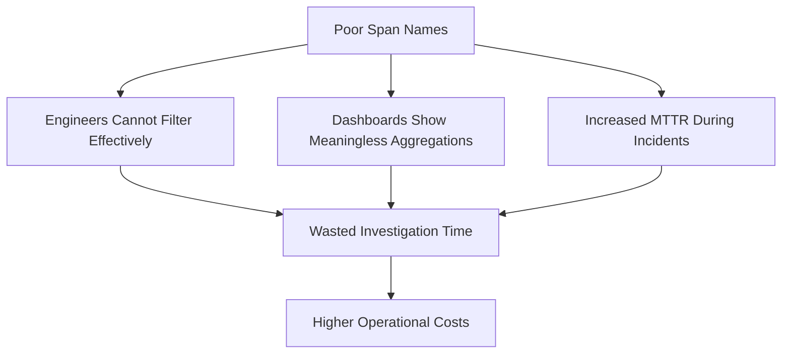
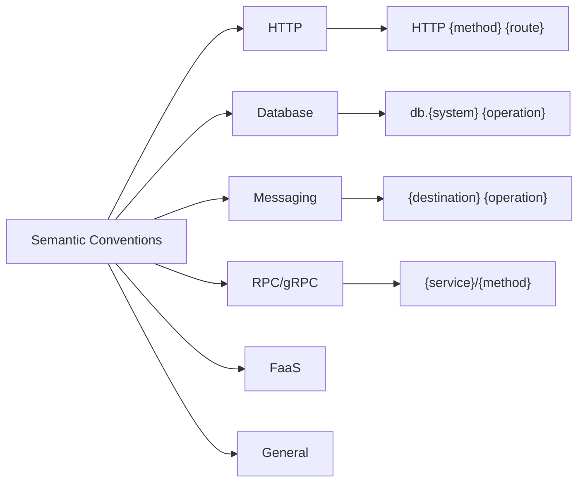
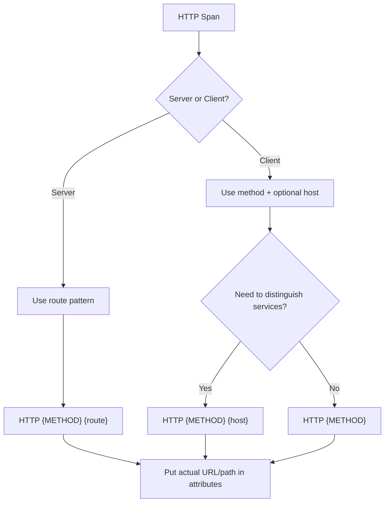
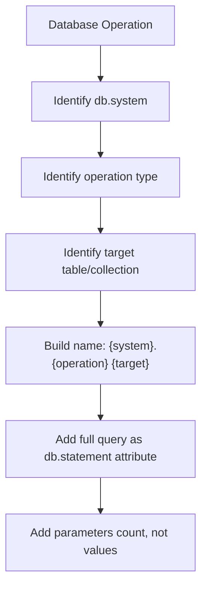
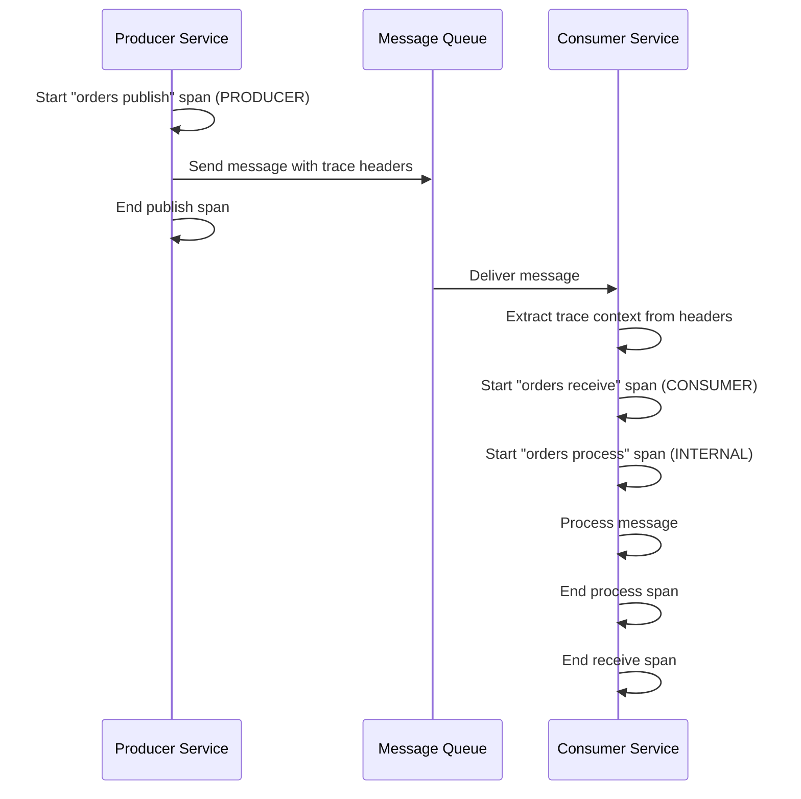
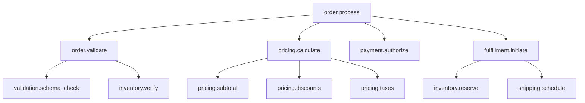
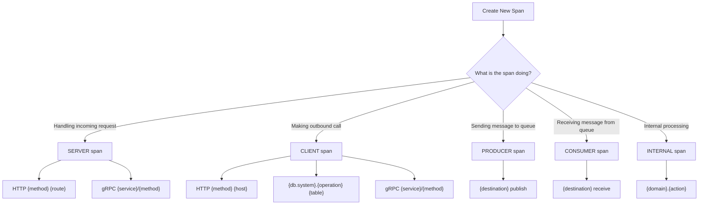
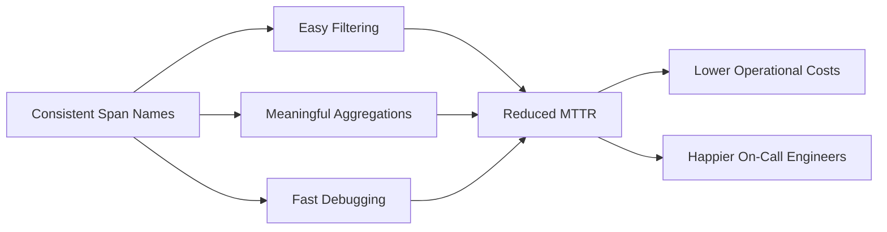

# How to Implement Span Naming Conventions

Author: [nawazdhandala](https://github.com/nawazdhandala)

Tags: Observability, Tracing, OpenTelemetry, Best Practices

Description: Learn best practices for naming spans in distributed tracing systems for clarity and consistency.

---

> Well-named spans are the difference between a trace you can read in seconds and one you spend minutes deciphering.

Span naming is one of the most overlooked aspects of distributed tracing. A poorly named span forces engineers to dig through attributes and code to understand what happened. A well-named span tells the story at a glance.

This guide covers practical conventions for naming spans across different span kinds, protocols, and domains. By the end, you will have a consistent, scalable naming strategy that improves trace readability and enables powerful filtering and aggregation.

---

## Table of Contents

1. Why Span Naming Matters
2. Core Principles of Span Naming
3. OpenTelemetry Semantic Conventions Overview
4. HTTP Span Naming
5. Database Span Naming
6. Messaging/Queue Span Naming
7. gRPC Span Naming
8. Internal Span Naming
9. Naming Patterns by Span Kind
10. Common Anti-Patterns
11. Implementation Examples
12. Validation and Enforcement
13. Summary

---

## 1. Why Span Naming Matters

Span names appear everywhere in your observability stack:

- Trace visualization UIs (waterfall views)
- Search and filter interfaces
- Aggregation dashboards (latency by span name)
- Alerting rules
- Cost attribution

A trace with spans named `span1`, `doWork`, and `handleRequest` tells you nothing. A trace with `HTTP GET /api/orders`, `db.query orders SELECT`, and `redis.get user:session` tells the full story.

### The Cost of Poor Naming



---

## 2. Core Principles of Span Naming

### Principle 1: Low Cardinality

Span names should have a bounded number of unique values. High cardinality names break aggregation and inflate storage costs.

| Bad (High Cardinality) | Good (Low Cardinality) |
|------------------------|------------------------|
| `GET /users/12345` | `GET /users/{id}` |
| `db.query SELECT * FROM users WHERE id=42` | `db.query users SELECT` |
| `processOrder_ord_abc123` | `order.process` |

### Principle 2: Action-Oriented

Names should describe the operation being performed, not the implementation detail.

| Bad | Good |
|-----|------|
| `MyServiceHandler` | `order.validate` |
| `function1` | `inventory.reserve` |
| `doStuff` | `payment.authorize` |

### Principle 3: Consistent Format

Pick a format and apply it everywhere. Common patterns:

- `{domain}.{action}` (e.g., `order.create`)
- `{protocol} {method} {route}` (e.g., `HTTP GET /api/orders`)
- `{system}.{operation} {target}` (e.g., `db.query users`)

### Principle 4: Attributes for Details

Put variable data in attributes, not the span name.

```typescript
// Bad: variable data in name
tracer.startSpan(`db.query SELECT * FROM users WHERE id=${userId}`);

// Good: stable name, variable in attributes
const span = tracer.startSpan('db.query users SELECT');
span.setAttribute('db.statement', `SELECT * FROM users WHERE id=${userId}`);
span.setAttribute('user.id', userId);
```

---

## 3. OpenTelemetry Semantic Conventions Overview

OpenTelemetry provides semantic conventions that standardize span names and attributes across the ecosystem. Following these conventions ensures your traces are portable and understandable by any engineer familiar with OTel.

### Key Convention Categories



### Why Follow Semantic Conventions?

1. **Interoperability**: Tools and backends understand standard names
2. **Onboarding**: New team members recognize familiar patterns
3. **Auto-instrumentation alignment**: Your manual spans match library-generated spans
4. **Query portability**: Same queries work across different backends

---

## 4. HTTP Span Naming

HTTP spans are the most common in web services. The convention differs based on whether you are the server (receiving) or client (sending).

### Server Spans (Incoming Requests)

Format: `{HTTP method} {route pattern}`

```typescript
// Examples of proper HTTP server span names
'HTTP GET /api/users/{userId}'
'HTTP POST /api/orders'
'HTTP PUT /api/products/{productId}'
'HTTP DELETE /api/sessions/{sessionId}'
```

### Client Spans (Outgoing Requests)

Format: `{HTTP method}` or `{HTTP method} {host}` when host matters

```typescript
// Examples of proper HTTP client span names
'HTTP GET'                    // When target is in attributes
'HTTP POST payments-api'      // When distinguishing by service
'HTTP GET inventory-service'  // External dependency call
```

### Implementation Example

```typescript
import { trace, SpanKind, SpanStatusCode } from '@opentelemetry/api';

const tracer = trace.getTracer('http-example', '1.0.0');

// Server span example (Express middleware)
function tracingMiddleware(req, res, next) {
    // Use the route pattern, not the actual URL with IDs
    const routePattern = req.route?.path || req.path;
    const spanName = `HTTP ${req.method} ${routePattern}`;

    const span = tracer.startSpan(spanName, {
        kind: SpanKind.SERVER,
        attributes: {
            'http.method': req.method,
            'http.route': routePattern,
            'http.url': req.url,              // Full URL in attribute
            'http.target': req.path,          // Actual path in attribute
            'http.scheme': req.protocol,
            'http.host': req.hostname,
            'http.user_agent': req.get('user-agent'),
        }
    });

    res.on('finish', () => {
        span.setAttribute('http.status_code', res.statusCode);
        if (res.statusCode >= 400) {
            span.setStatus({
                code: SpanStatusCode.ERROR,
                message: `HTTP ${res.statusCode}`
            });
        }
        span.end();
    });

    next();
}

// Client span example (fetch wrapper)
async function tracedFetch(url: string, options: RequestInit = {}) {
    const method = options.method || 'GET';
    const parsedUrl = new URL(url);

    // Use method + host for client spans
    const spanName = `HTTP ${method} ${parsedUrl.hostname}`;

    const span = tracer.startSpan(spanName, {
        kind: SpanKind.CLIENT,
        attributes: {
            'http.method': method,
            'http.url': url,
            'http.host': parsedUrl.hostname,
            'http.scheme': parsedUrl.protocol.replace(':', ''),
            'net.peer.name': parsedUrl.hostname,
            'net.peer.port': parsedUrl.port || (parsedUrl.protocol === 'https:' ? 443 : 80),
        }
    });

    try {
        const response = await fetch(url, options);
        span.setAttribute('http.status_code', response.status);

        if (!response.ok) {
            span.setStatus({
                code: SpanStatusCode.ERROR,
                message: `HTTP ${response.status}`
            });
        }

        return response;
    } catch (error) {
        span.recordException(error);
        span.setStatus({ code: SpanStatusCode.ERROR, message: error.message });
        throw error;
    } finally {
        span.end();
    }
}
```

### HTTP Span Decision Tree



---

## 5. Database Span Naming

Database spans should identify the system, operation, and target table without exposing the full query in the name.

### Convention Format

`{db.system}.{operation} {table}` or `{db.operation} {table}`

### Examples by Database Type

```typescript
// PostgreSQL
'postgresql.query users SELECT'
'postgresql.query orders INSERT'
'postgresql.query products UPDATE'

// MongoDB
'mongodb.find users'
'mongodb.insertOne orders'
'mongodb.aggregate analytics'

// Redis
'redis.get session'
'redis.set cache'
'redis.hgetall user'

// Elasticsearch
'elasticsearch.search products'
'elasticsearch.index logs'
```

### Implementation Example

```typescript
import { trace, SpanKind, SpanStatusCode } from '@opentelemetry/api';

const tracer = trace.getTracer('database-example', '1.0.0');

// Generic database query wrapper
async function tracedQuery<T>(
    dbSystem: string,
    operation: string,
    table: string,
    query: string,
    params: any[],
    executor: () => Promise<T>
): Promise<T> {
    // Construct span name following conventions
    const spanName = `${dbSystem}.${operation} ${table}`;

    const span = tracer.startSpan(spanName, {
        kind: SpanKind.CLIENT,
        attributes: {
            'db.system': dbSystem,
            'db.operation': operation,
            'db.sql.table': table,
            // Store full query in attribute (consider truncating for security)
            'db.statement': query.length > 1000 ? query.slice(0, 1000) + '...' : query,
            'db.statement.params.count': params.length,
        }
    });

    try {
        const startTime = performance.now();
        const result = await executor();
        const duration = performance.now() - startTime;

        span.setAttribute('db.query.duration_ms', duration);

        // Add row count if available
        if (Array.isArray(result)) {
            span.setAttribute('db.rows_affected', result.length);
        }

        return result;
    } catch (error) {
        span.recordException(error);
        span.setStatus({ code: SpanStatusCode.ERROR, message: error.message });
        throw error;
    } finally {
        span.end();
    }
}

// Usage example with PostgreSQL
async function getUserById(userId: string) {
    return tracedQuery(
        'postgresql',
        'SELECT',
        'users',
        'SELECT id, name, email FROM users WHERE id = $1',
        [userId],
        async () => {
            // Actual database call here
            return db.query('SELECT id, name, email FROM users WHERE id = $1', [userId]);
        }
    );
}

// Usage example with Redis
async function getCachedSession(sessionId: string) {
    const spanName = 'redis.get session';

    const span = tracer.startSpan(spanName, {
        kind: SpanKind.CLIENT,
        attributes: {
            'db.system': 'redis',
            'db.operation': 'GET',
            'db.redis.key_pattern': 'session:*',
            // Never put actual session ID in span name
        }
    });

    try {
        const result = await redis.get(`session:${sessionId}`);
        span.setAttribute('cache.hit', result !== null);
        return result;
    } finally {
        span.end();
    }
}
```

### Database Span Naming Flow



---

## 6. Messaging/Queue Span Naming

Messaging spans require special attention because they cross async boundaries. The convention distinguishes between producing (sending) and consuming (receiving) messages.

### Convention Format

`{destination} {operation}`

Where operation is typically: `publish`, `receive`, `process`

### Examples

```typescript
// Kafka
'orders publish'          // Producer sending to orders topic
'orders receive'          // Consumer receiving from orders topic
'orders process'          // Consumer processing the message

// RabbitMQ
'payment-queue publish'
'payment-queue receive'

// AWS SQS
'order-notifications send'
'order-notifications receive'
```

### Implementation Example

```typescript
import { trace, SpanKind, SpanStatusCode, context, propagation } from '@opentelemetry/api';

const tracer = trace.getTracer('messaging-example', '1.0.0');

// Producer span (publishing a message)
async function publishMessage(topic: string, message: any) {
    const spanName = `${topic} publish`;

    const span = tracer.startSpan(spanName, {
        kind: SpanKind.PRODUCER,
        attributes: {
            'messaging.system': 'kafka',
            'messaging.destination': topic,
            'messaging.destination_kind': 'topic',
            'messaging.operation': 'publish',
            'messaging.message.payload_size_bytes': JSON.stringify(message).length,
        }
    });

    try {
        // Inject trace context into message headers for propagation
        const headers: Record<string, string> = {};
        propagation.inject(context.active(), headers);

        await kafka.publish(topic, {
            value: JSON.stringify(message),
            headers,
        });

        span.setAttribute('messaging.message_id', message.id);
    } catch (error) {
        span.recordException(error);
        span.setStatus({ code: SpanStatusCode.ERROR, message: error.message });
        throw error;
    } finally {
        span.end();
    }
}

// Consumer span (receiving and processing a message)
async function consumeMessage(topic: string, rawMessage: any) {
    // Extract context from message headers to continue the trace
    const extractedContext = propagation.extract(context.active(), rawMessage.headers);

    // Receive span (getting the message from the queue)
    const receiveSpanName = `${topic} receive`;

    return context.with(extractedContext, async () => {
        const receiveSpan = tracer.startSpan(receiveSpanName, {
            kind: SpanKind.CONSUMER,
            attributes: {
                'messaging.system': 'kafka',
                'messaging.destination': topic,
                'messaging.destination_kind': 'topic',
                'messaging.operation': 'receive',
                'messaging.message_id': rawMessage.key,
                'messaging.kafka.partition': rawMessage.partition,
                'messaging.kafka.offset': rawMessage.offset,
            }
        });

        try {
            const message = JSON.parse(rawMessage.value);

            // Process span (doing work with the message)
            const processSpanName = `${topic} process`;
            const processSpan = tracer.startSpan(processSpanName, {
                kind: SpanKind.INTERNAL,
                attributes: {
                    'messaging.operation': 'process',
                    'message.type': message.type,
                }
            });

            try {
                await handleMessage(message);
            } finally {
                processSpan.end();
            }

        } catch (error) {
            receiveSpan.recordException(error);
            receiveSpan.setStatus({ code: SpanStatusCode.ERROR, message: error.message });
            throw error;
        } finally {
            receiveSpan.end();
        }
    });
}
```

### Messaging Span Flow



---

## 7. gRPC Span Naming

gRPC spans follow a clear convention based on the service and method names from the protocol buffer definitions.

### Convention Format

`{package}.{service}/{method}`

### Examples

```typescript
// From a proto definition like:
// package orders.v1;
// service OrderService {
//   rpc CreateOrder(CreateOrderRequest) returns (CreateOrderResponse);
// }

'orders.v1.OrderService/CreateOrder'
'users.v1.UserService/GetUser'
'inventory.v1.InventoryService/ReserveStock'
```

### Implementation Example

```typescript
import { trace, SpanKind, SpanStatusCode } from '@opentelemetry/api';

const tracer = trace.getTracer('grpc-example', '1.0.0');

// gRPC server interceptor
function serverTracingInterceptor(call, methodDefinition, callback, next) {
    // methodDefinition.path is like "/orders.v1.OrderService/CreateOrder"
    // Remove leading slash for span name
    const spanName = methodDefinition.path.substring(1);

    const span = tracer.startSpan(spanName, {
        kind: SpanKind.SERVER,
        attributes: {
            'rpc.system': 'grpc',
            'rpc.service': extractServiceName(methodDefinition.path),
            'rpc.method': extractMethodName(methodDefinition.path),
            'rpc.grpc.status_code': 0, // Will be updated
            'net.peer.ip': call.getPeer(),
        }
    });

    // Wrap the callback to capture the response
    const wrappedCallback = (error, response) => {
        if (error) {
            span.recordException(error);
            span.setStatus({ code: SpanStatusCode.ERROR, message: error.message });
            span.setAttribute('rpc.grpc.status_code', error.code || 2);
        }
        span.end();
        callback(error, response);
    };

    next(call, methodDefinition, wrappedCallback);
}

// gRPC client interceptor
function clientTracingInterceptor(options, nextCall) {
    const spanName = options.method_definition.path.substring(1);

    const span = tracer.startSpan(spanName, {
        kind: SpanKind.CLIENT,
        attributes: {
            'rpc.system': 'grpc',
            'rpc.service': extractServiceName(options.method_definition.path),
            'rpc.method': extractMethodName(options.method_definition.path),
            'net.peer.name': options.host,
        }
    });

    return new InterceptingCall(nextCall(options), {
        start: (metadata, listener, next) => {
            // Inject trace context into metadata
            propagation.inject(context.active(), metadata);

            next(metadata, {
                onReceiveStatus: (status, next) => {
                    span.setAttribute('rpc.grpc.status_code', status.code);
                    if (status.code !== 0) {
                        span.setStatus({
                            code: SpanStatusCode.ERROR,
                            message: status.details
                        });
                    }
                    span.end();
                    next(status);
                }
            });
        }
    });
}

// Helper functions
function extractServiceName(path: string): string {
    // "/orders.v1.OrderService/CreateOrder" -> "orders.v1.OrderService"
    const parts = path.split('/');
    return parts[1] || '';
}

function extractMethodName(path: string): string {
    // "/orders.v1.OrderService/CreateOrder" -> "CreateOrder"
    const parts = path.split('/');
    return parts[2] || '';
}
```

---

## 8. Internal Span Naming

Internal spans represent in-process operations that are neither network boundaries nor external calls. They should follow your domain language.

### Convention Format

`{domain}.{action}` or `{module}.{operation}`

### Examples

```typescript
// Business logic
'order.validate'
'order.calculate_total'
'inventory.check_availability'
'pricing.apply_discounts'
'user.authorize'

// Technical operations
'cache.hydrate'
'serialization.json_encode'
'validation.schema_check'
'transform.normalize_address'
```

### Implementation Example

```typescript
import { trace, SpanKind, SpanStatusCode } from '@opentelemetry/api';

const tracer = trace.getTracer('internal-example', '1.0.0');

// Generic wrapper for internal operations
async function withSpan<T>(
    name: string,
    operation: () => Promise<T>,
    attributes: Record<string, any> = {}
): Promise<T> {
    const span = tracer.startSpan(name, {
        kind: SpanKind.INTERNAL,
        attributes
    });

    try {
        const result = await operation();
        return result;
    } catch (error) {
        span.recordException(error);
        span.setStatus({ code: SpanStatusCode.ERROR, message: error.message });
        throw error;
    } finally {
        span.end();
    }
}

// Example: Order processing with well-named internal spans
async function processOrder(order: Order) {
    return withSpan('order.process', async () => {
        // Validation step
        await withSpan('order.validate', async () => {
            validateOrderSchema(order);
            await validateInventory(order.items);
        }, { 'order.item_count': order.items.length });

        // Pricing step
        const pricing = await withSpan('pricing.calculate', async () => {
            const subtotal = calculateSubtotal(order.items);
            const discounts = await applyDiscounts(order);
            const taxes = calculateTaxes(subtotal - discounts, order.shippingAddress);
            return { subtotal, discounts, taxes, total: subtotal - discounts + taxes };
        }, { 'order.has_promo_code': !!order.promoCode });

        // Payment step
        await withSpan('payment.authorize', async () => {
            await authorizePayment(order.paymentMethod, pricing.total);
        }, { 'payment.method': order.paymentMethod.type });

        // Fulfillment step
        await withSpan('fulfillment.initiate', async () => {
            await reserveInventory(order.items);
            await scheduleShipment(order);
        });

        return { orderId: order.id, status: 'confirmed', ...pricing };
    }, { 'order.id': order.id, 'customer.id': order.customerId });
}
```

### Internal Span Hierarchy



---

## 9. Naming Patterns by Span Kind

Different span kinds have different naming conventions based on their role in the trace.

### Summary Table

| Span Kind | Purpose | Naming Pattern | Example |
|-----------|---------|----------------|---------|
| SERVER | Incoming request | `{protocol} {method} {route}` | `HTTP GET /api/orders` |
| CLIENT | Outgoing call | `{protocol} {method}` or `{system}.{operation} {target}` | `HTTP POST`, `postgresql.query users` |
| PRODUCER | Message send | `{destination} publish` | `orders publish` |
| CONSUMER | Message receive | `{destination} receive` | `orders receive` |
| INTERNAL | In-process work | `{domain}.{action}` | `order.validate` |

### Decision Tree



---

## 10. Common Anti-Patterns

### Anti-Pattern 1: Variable Data in Span Names

```typescript
// Bad: User ID in span name creates cardinality explosion
tracer.startSpan(`getUser_${userId}`);
tracer.startSpan(`GET /users/${userId}`);

// Good: Stable name, variable in attributes
const span = tracer.startSpan('user.fetch');
span.setAttribute('user.id', userId);
```

### Anti-Pattern 2: Overly Generic Names

```typescript
// Bad: No context about what the span does
tracer.startSpan('query');
tracer.startSpan('process');
tracer.startSpan('handle');

// Good: Specific, descriptive names
tracer.startSpan('postgresql.query users SELECT');
tracer.startSpan('order.process');
tracer.startSpan('payment.webhook.handle');
```

### Anti-Pattern 3: Implementation Details as Names

```typescript
// Bad: Exposes internal class/function names
tracer.startSpan('UserRepository.findById');
tracer.startSpan('OrderServiceImpl.createOrder');

// Good: Domain-focused names
tracer.startSpan('user.fetch');
tracer.startSpan('order.create');
```

### Anti-Pattern 4: Timestamps or Request IDs in Names

```typescript
// Bad: Every span has a unique name
tracer.startSpan(`request_${Date.now()}`);
tracer.startSpan(`order_${requestId}`);

// Good: Stable name, metadata in attributes
const span = tracer.startSpan('http.request');
span.setAttribute('request.id', requestId);
span.setAttribute('request.timestamp', Date.now());
```

### Anti-Pattern 5: Full SQL Queries as Names

```typescript
// Bad: Query as name (high cardinality, security risk)
tracer.startSpan('SELECT * FROM users WHERE email = "user@example.com"');

// Good: Operation and table only
const span = tracer.startSpan('postgresql.query users SELECT');
span.setAttribute('db.statement', 'SELECT * FROM users WHERE email = $1');
```

---

## 11. Implementation Examples

### Complete Express Application Example

```typescript
import express from 'express';
import { trace, SpanKind, SpanStatusCode, context, propagation } from '@opentelemetry/api';

const tracer = trace.getTracer('ecommerce-api', '1.0.0');
const app = express();

// Middleware for HTTP server spans
app.use((req, res, next) => {
    // Determine route pattern for span name
    // This runs before route matching, so we update the name later
    const span = tracer.startSpan(`HTTP ${req.method}`, {
        kind: SpanKind.SERVER,
        attributes: {
            'http.method': req.method,
            'http.url': req.url,
            'http.scheme': req.protocol,
            'http.host': req.hostname,
        }
    });

    // Store span for later access
    res.locals.span = span;

    res.on('finish', () => {
        span.setAttribute('http.status_code', res.statusCode);
        if (res.statusCode >= 400) {
            span.setStatus({ code: SpanStatusCode.ERROR });
        }
        span.end();
    });

    context.with(trace.setSpan(context.active(), span), () => {
        next();
    });
});

// Route handler with proper span naming
app.get('/api/orders/:orderId', async (req, res) => {
    // Update span name with actual route pattern
    const span = res.locals.span;
    span.updateName('HTTP GET /api/orders/{orderId}');
    span.setAttribute('http.route', '/api/orders/{orderId}');
    span.setAttribute('order.id', req.params.orderId);

    try {
        // Database query with proper naming
        const order = await withSpan(
            'postgresql.query orders SELECT',
            async () => {
                return db.query('SELECT * FROM orders WHERE id = $1', [req.params.orderId]);
            },
            {
                'db.system': 'postgresql',
                'db.operation': 'SELECT',
                'db.sql.table': 'orders',
            }
        );

        // Cache lookup with proper naming
        const customerData = await withSpan(
            'redis.get customer',
            async () => {
                return redis.get(`customer:${order.customerId}`);
            },
            {
                'db.system': 'redis',
                'db.operation': 'GET',
                'cache.key_pattern': 'customer:*',
            }
        );

        res.json({ order, customer: customerData });
    } catch (error) {
        span.recordException(error);
        span.setStatus({ code: SpanStatusCode.ERROR, message: error.message });
        res.status(500).json({ error: 'Internal server error' });
    }
});

// POST handler for creating orders
app.post('/api/orders', async (req, res) => {
    const span = res.locals.span;
    span.updateName('HTTP POST /api/orders');
    span.setAttribute('http.route', '/api/orders');

    try {
        const result = await withSpan('order.create', async () => {
            // Validation
            await withSpan('order.validate', async () => {
                validateOrderRequest(req.body);
            });

            // Check inventory
            await withSpan('inventory.check', async () => {
                await checkInventoryAvailability(req.body.items);
            }, { 'inventory.item_count': req.body.items.length });

            // Create order in database
            const order = await withSpan('postgresql.query orders INSERT', async () => {
                return db.query(
                    'INSERT INTO orders (customer_id, items, total) VALUES ($1, $2, $3) RETURNING *',
                    [req.body.customerId, JSON.stringify(req.body.items), req.body.total]
                );
            }, {
                'db.system': 'postgresql',
                'db.operation': 'INSERT',
                'db.sql.table': 'orders',
            });

            // Publish event
            await withSpan('order-created publish', async () => {
                await kafka.publish('order-created', {
                    orderId: order.id,
                    customerId: order.customerId,
                });
            }, {
                'messaging.system': 'kafka',
                'messaging.destination': 'order-created',
                'messaging.operation': 'publish',
            });

            return order;
        }, { 'customer.id': req.body.customerId });

        res.status(201).json(result);
    } catch (error) {
        span.recordException(error);
        span.setStatus({ code: SpanStatusCode.ERROR, message: error.message });
        res.status(500).json({ error: 'Failed to create order' });
    }
});

// Helper function for creating internal spans
async function withSpan<T>(
    name: string,
    fn: () => Promise<T>,
    attributes: Record<string, any> = {}
): Promise<T> {
    const span = tracer.startSpan(name, {
        kind: SpanKind.INTERNAL,
        attributes
    });

    try {
        return await context.with(trace.setSpan(context.active(), span), fn);
    } catch (error) {
        span.recordException(error);
        span.setStatus({ code: SpanStatusCode.ERROR, message: error.message });
        throw error;
    } finally {
        span.end();
    }
}
```

---

## 12. Validation and Enforcement

Consistent naming requires enforcement. Here are strategies to maintain conventions across teams.

### Automated Linting

Create a span name validator that runs in your CI pipeline:

```typescript
// span-name-validator.ts
const VALID_PATTERNS = [
    // HTTP spans
    /^HTTP (GET|POST|PUT|DELETE|PATCH|HEAD|OPTIONS) \/[a-z0-9\/{}_-]+$/,

    // Database spans
    /^(postgresql|mysql|mongodb|redis|elasticsearch)\.[a-z]+ [a-z_]+$/,

    // Messaging spans
    /^[a-z0-9-]+ (publish|receive|process)$/,

    // gRPC spans
    /^[a-z0-9.]+\/[A-Z][a-zA-Z]+$/,

    // Internal spans
    /^[a-z]+\.[a-z_]+$/,
];

function validateSpanName(name: string): { valid: boolean; suggestion?: string } {
    // Check for common anti-patterns
    if (/\d{4,}/.test(name)) {
        return {
            valid: false,
            suggestion: 'Span name contains what looks like an ID. Move IDs to attributes.'
        };
    }

    if (name.includes('@') || name.includes('=')) {
        return {
            valid: false,
            suggestion: 'Span name contains email or query parameter. Use attributes for variable data.'
        };
    }

    // Check against valid patterns
    for (const pattern of VALID_PATTERNS) {
        if (pattern.test(name)) {
            return { valid: true };
        }
    }

    return {
        valid: false,
        suggestion: 'Span name does not match any known convention pattern.'
    };
}

// Export for use in tests
export { validateSpanName };
```

### Code Review Checklist

When reviewing code that adds new spans, check:

1. Is the span name low cardinality?
2. Does it follow the convention for its span kind?
3. Are variable values in attributes, not the name?
4. Does it match existing spans of the same type?
5. Would a new team member understand what this span represents?

### Span Name Registry

Maintain a registry of approved span names:

```typescript
// span-registry.ts
export const SPAN_NAMES = {
    // HTTP routes
    http: {
        getOrders: 'HTTP GET /api/orders',
        getOrderById: 'HTTP GET /api/orders/{orderId}',
        createOrder: 'HTTP POST /api/orders',
        updateOrder: 'HTTP PUT /api/orders/{orderId}',
    },

    // Database operations
    database: {
        selectOrders: 'postgresql.query orders SELECT',
        insertOrder: 'postgresql.query orders INSERT',
        updateOrder: 'postgresql.query orders UPDATE',
        selectUsers: 'postgresql.query users SELECT',
    },

    // Business logic
    business: {
        validateOrder: 'order.validate',
        processOrder: 'order.process',
        calculatePricing: 'pricing.calculate',
        authorizePayment: 'payment.authorize',
    },

    // Messaging
    messaging: {
        publishOrderCreated: 'order-created publish',
        receiveOrderCreated: 'order-created receive',
        processOrderCreated: 'order-created process',
    },
} as const;

// Usage
import { SPAN_NAMES } from './span-registry';
tracer.startSpan(SPAN_NAMES.business.validateOrder);
```

---

## 13. Summary

### Quick Reference Card

| Category | Pattern | Example |
|----------|---------|---------|
| HTTP Server | `HTTP {method} {route}` | `HTTP GET /api/users/{id}` |
| HTTP Client | `HTTP {method}` or `HTTP {method} {host}` | `HTTP POST payments-api` |
| Database | `{system}.{operation} {table}` | `postgresql.query users SELECT` |
| Cache | `{system}.{operation} {key_pattern}` | `redis.get session` |
| Messaging | `{destination} {operation}` | `orders publish` |
| gRPC | `{package.service}/{method}` | `orders.v1.OrderService/Create` |
| Internal | `{domain}.{action}` | `order.validate` |

### Key Takeaways

1. **Keep span names low cardinality**: Never put IDs, timestamps, or user data in span names
2. **Follow semantic conventions**: OpenTelemetry conventions exist for a reason
3. **Use attributes for details**: Variable data belongs in attributes
4. **Be consistent**: Pick a pattern and stick to it across your organization
5. **Validate automatically**: Use linting and code review to enforce conventions
6. **Document your patterns**: Maintain a registry of approved span names

### Benefits of Good Naming



Well-named spans transform traces from a wall of data into a readable story. Invest the time to establish conventions early, enforce them consistently, and your future debugging sessions will thank you.

---

**Related Reading:**

- [What are Traces and Spans in OpenTelemetry: A Practical Guide](https://oneuptime.com/blog/post/2025-08-27-traces-and-spans-in-opentelemetry/view)
- [How to Reduce Noise in OpenTelemetry](https://oneuptime.com/blog/post/2025-08-25-how-to-reduce-noise-in-opentelemetry/view)
- [How to Structure Logs Properly in OpenTelemetry](https://oneuptime.com/blog/post/2025-08-28-how-to-structure-logs-properly-in-opentelemetry/view)
