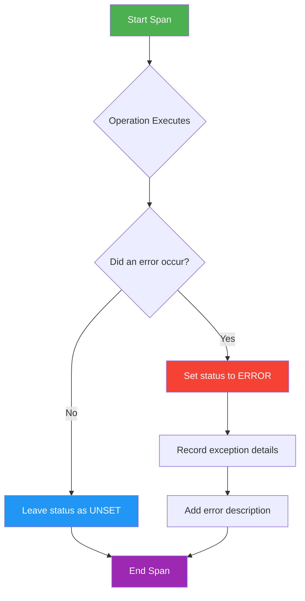
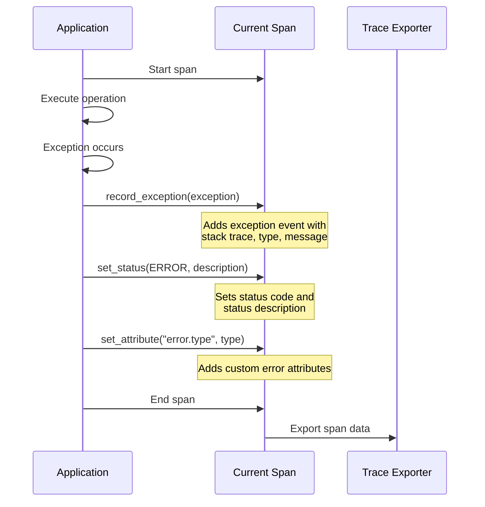
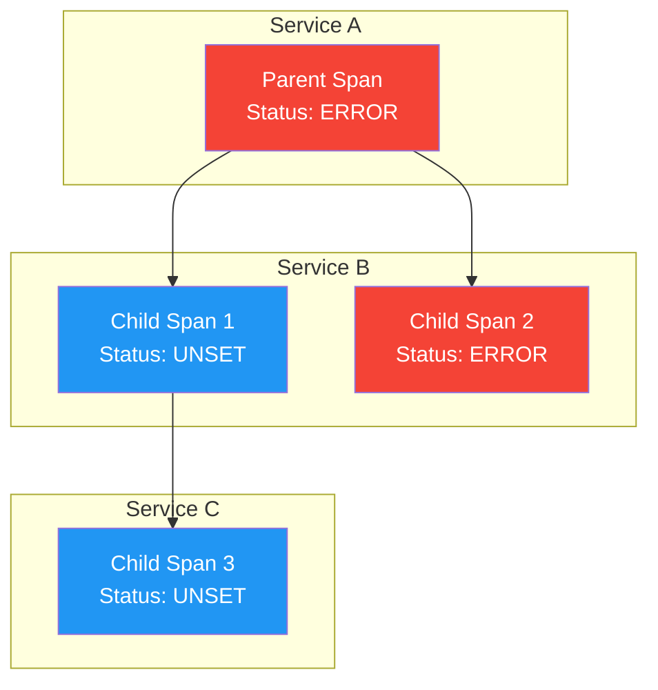
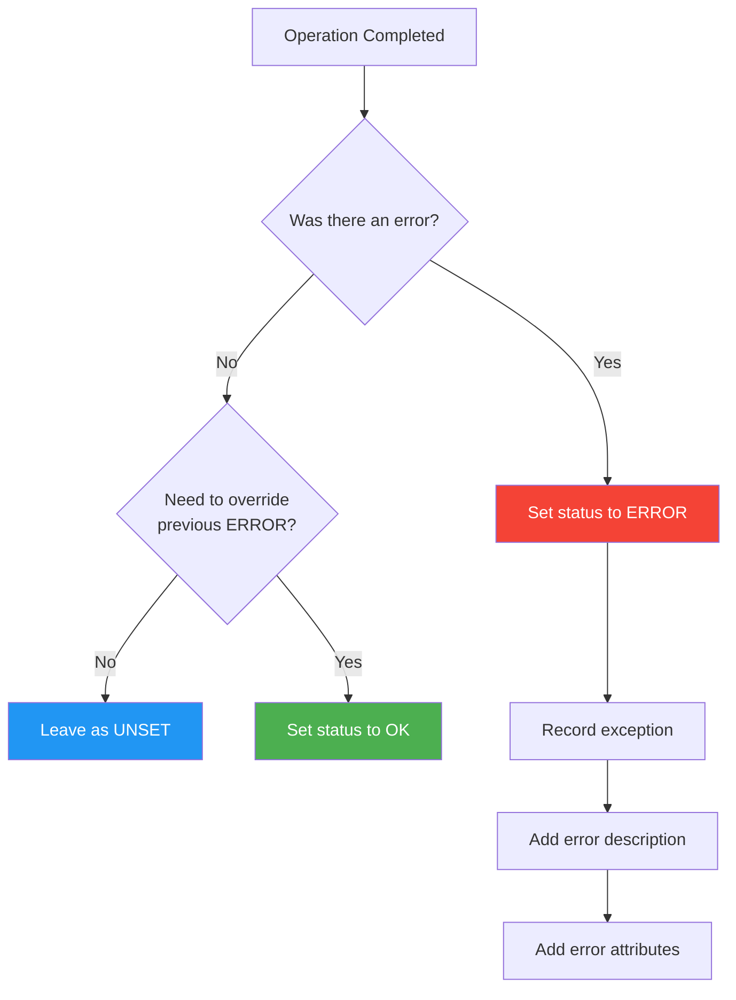

# How to Create Span Status Design

Author: [nawazdhandala](https://github.com/nawazdhandala)

Tags: Observability, Tracing, OpenTelemetry, Best Practices

Description: Learn how to properly set span status codes for error tracking and trace analysis.

---

## Introduction

Span status is a fundamental concept in distributed tracing that communicates the outcome of an operation. When you instrument your applications with OpenTelemetry or similar tracing libraries, understanding how to properly set span status codes becomes essential for effective error tracking, debugging, and trace analysis.

In this guide, we will explore the three span status codes (OK, ERROR, and UNSET), learn when to use each one, and discover best practices for recording error information alongside your spans.

## Understanding Span Status Codes

OpenTelemetry defines three status codes for spans:

| Status Code | Description | When to Use |
|-------------|-------------|-------------|
| **UNSET** | Default status, no explicit status set | When the operation completes normally without errors |
| **OK** | Explicitly marks operation as successful | When you want to override an ERROR status or explicitly confirm success |
| **ERROR** | Indicates the operation encountered an error | When an exception occurs or business logic fails |

### Span Status Flow

The following diagram illustrates how span status should be determined based on operation outcomes:



## Status Code Deep Dive

### UNSET Status

The UNSET status is the default state for any span. When a span completes without any explicit status being set, it remains UNSET. This is the most common status for successful operations.

```python
# Python example: UNSET status (default behavior)
from opentelemetry import trace

# Get the tracer
tracer = trace.get_tracer(__name__)

def process_order(order_id: str) -> dict:
    """
    Process an order. The span status remains UNSET
    when the operation completes successfully.
    """
    # Start a new span for this operation
    with tracer.start_as_current_span("process_order") as span:
        # Add relevant attributes to the span
        span.set_attribute("order.id", order_id)

        # Perform the order processing logic
        result = {"order_id": order_id, "status": "completed"}

        # No explicit status set - span ends with UNSET status
        # This is perfectly fine for successful operations
        return result
```

### ERROR Status

The ERROR status should be set when an operation fails. This is critical for identifying problems in your distributed system.

```python
# Python example: ERROR status with exception recording
from opentelemetry import trace
from opentelemetry.trace import Status, StatusCode

tracer = trace.get_tracer(__name__)

def fetch_user_data(user_id: str) -> dict:
    """
    Fetch user data from the database.
    Demonstrates proper error handling with span status.
    """
    with tracer.start_as_current_span("fetch_user_data") as span:
        # Add the user ID as a span attribute
        span.set_attribute("user.id", user_id)

        try:
            # Attempt to fetch user data
            user = database.get_user(user_id)

            if user is None:
                # Business logic error: user not found
                # Set ERROR status with a descriptive message
                span.set_status(
                    Status(StatusCode.ERROR, "User not found in database")
                )
                return None

            return user

        except DatabaseConnectionError as e:
            # Record the exception on the span
            # This adds exception details as span events
            span.record_exception(e)

            # Set the span status to ERROR with description
            span.set_status(
                Status(StatusCode.ERROR, f"Database connection failed: {str(e)}")
            )

            # Re-raise or handle the exception as needed
            raise
```

### OK Status

The OK status is used sparingly. Its primary purpose is to explicitly override an ERROR status that may have been set earlier in the span lifecycle.

```python
# Python example: OK status to override previous error
from opentelemetry import trace
from opentelemetry.trace import Status, StatusCode

tracer = trace.get_tracer(__name__)

def process_with_retry(data: dict) -> dict:
    """
    Process data with retry logic.
    Demonstrates using OK status to override ERROR.
    """
    with tracer.start_as_current_span("process_with_retry") as span:
        max_retries = 3
        last_error = None

        for attempt in range(max_retries):
            try:
                span.set_attribute("retry.attempt", attempt + 1)

                # Attempt the operation
                result = perform_operation(data)

                # If we get here after a previous error,
                # explicitly set OK to override the ERROR status
                if last_error is not None:
                    span.set_status(
                        Status(StatusCode.OK, "Succeeded after retry")
                    )

                return result

            except TransientError as e:
                # Record this exception
                span.record_exception(e)

                # Set ERROR status (may be overridden if retry succeeds)
                span.set_status(
                    Status(StatusCode.ERROR, f"Attempt {attempt + 1} failed")
                )

                last_error = e
                continue

        # All retries exhausted
        raise last_error
```

## Recording Error Information

Setting the status to ERROR is just the first step. For effective debugging, you should also record detailed error information.

### Error Recording Flow



### Comprehensive Error Recording Example

```javascript
// JavaScript/Node.js example: Comprehensive error recording
const { trace, SpanStatusCode } = require('@opentelemetry/api');

const tracer = trace.getTracer('order-service');

async function createOrder(orderData) {
    // Start a new span for the order creation operation
    return tracer.startActiveSpan('create_order', async (span) => {
        try {
            // Add order attributes for context
            span.setAttribute('order.customer_id', orderData.customerId);
            span.setAttribute('order.item_count', orderData.items.length);
            span.setAttribute('order.total_amount', orderData.totalAmount);

            // Validate the order data
            const validationResult = validateOrder(orderData);
            if (!validationResult.isValid) {
                // Record validation error with custom attributes
                span.setAttribute('error.type', 'ValidationError');
                span.setAttribute('error.validation_field', validationResult.field);

                // Set ERROR status with descriptive message
                span.setStatus({
                    code: SpanStatusCode.ERROR,
                    message: `Validation failed: ${validationResult.message}`
                });

                throw new ValidationError(validationResult.message);
            }

            // Process the order
            const order = await orderRepository.save(orderData);

            // Add the created order ID as an attribute
            span.setAttribute('order.id', order.id);

            return order;

        } catch (error) {
            // Record the exception with full stack trace
            span.recordException(error);

            // Add error classification attributes
            span.setAttribute('error.type', error.constructor.name);
            span.setAttribute('error.message', error.message);

            // Set appropriate status based on error type
            if (error instanceof ValidationError) {
                span.setStatus({
                    code: SpanStatusCode.ERROR,
                    message: 'Order validation failed'
                });
            } else if (error instanceof DatabaseError) {
                span.setStatus({
                    code: SpanStatusCode.ERROR,
                    message: 'Database operation failed'
                });
            } else {
                span.setStatus({
                    code: SpanStatusCode.ERROR,
                    message: 'Unexpected error during order creation'
                });
            }

            throw error;

        } finally {
            // Always end the span
            span.end();
        }
    });
}
```

## Status Propagation in Distributed Systems

In distributed systems, understanding how span status relates to parent and child spans is important.



### Key Points About Status Propagation

1. **Status does not automatically propagate** from child spans to parent spans
2. **Parent span status should reflect** the overall operation outcome
3. **Child span errors should be handled** and potentially reflected in the parent

```go
// Go example: Handling child span errors in parent span
package main

import (
    "context"
    "errors"

    "go.opentelemetry.io/otel"
    "go.opentelemetry.io/otel/codes"
    "go.opentelemetry.io/otel/trace"
)

var tracer = otel.Tracer("order-service")

// ProcessOrderWithPayment demonstrates parent-child span status handling
func ProcessOrderWithPayment(ctx context.Context, orderID string) error {
    // Start the parent span for the entire operation
    ctx, parentSpan := tracer.Start(ctx, "process_order_with_payment")
    defer parentSpan.End()

    // Set order context on the parent span
    parentSpan.SetAttributes(
        attribute.String("order.id", orderID),
    )

    // Step 1: Validate the order (child span)
    if err := validateOrder(ctx, orderID); err != nil {
        // Child span already recorded its own error
        // Set parent span status to reflect the failure
        parentSpan.SetStatus(codes.Error, "Order validation failed")
        parentSpan.RecordError(err)
        return err
    }

    // Step 2: Process payment (child span)
    if err := processPayment(ctx, orderID); err != nil {
        // Child span already recorded its own error
        // Set parent span status to reflect the failure
        parentSpan.SetStatus(codes.Error, "Payment processing failed")
        parentSpan.RecordError(err)
        return err
    }

    // Step 3: Fulfill order (child span)
    if err := fulfillOrder(ctx, orderID); err != nil {
        // Child span already recorded its own error
        // Set parent span status to reflect the failure
        parentSpan.SetStatus(codes.Error, "Order fulfillment failed")
        parentSpan.RecordError(err)
        return err
    }

    // All operations succeeded - parent span status remains UNSET
    // which is appropriate for successful operations
    return nil
}

// validateOrder creates a child span for order validation
func validateOrder(ctx context.Context, orderID string) error {
    ctx, span := tracer.Start(ctx, "validate_order")
    defer span.End()

    // Validation logic here
    // If validation fails:
    // span.SetStatus(codes.Error, "Invalid order data")
    // span.RecordError(err)

    return nil
}
```

## Best Practices Summary

### Decision Tree for Setting Span Status



### Best Practices Checklist

1. **Do not set OK for normal success** - Let spans remain UNSET for successful operations
2. **Always set ERROR when exceptions occur** - Make failures visible in your traces
3. **Use record_exception()** - Capture full stack traces and exception details
4. **Provide meaningful status descriptions** - Help future debuggers understand what went wrong
5. **Add error classification attributes** - Use attributes like `error.type` for filtering
6. **Handle child span errors in parents** - Ensure the parent span reflects overall operation status
7. **Be consistent across services** - Establish team conventions for status handling

## Common Anti-Patterns to Avoid

```python
# Anti-pattern 1: Setting OK for every successful operation
# This is unnecessary and adds noise
with tracer.start_as_current_span("my_operation") as span:
    result = do_something()
    span.set_status(Status(StatusCode.OK))  # Don't do this!
    return result

# Anti-pattern 2: Not recording exception details
# This loses valuable debugging information
with tracer.start_as_current_span("my_operation") as span:
    try:
        result = do_something()
    except Exception as e:
        span.set_status(Status(StatusCode.ERROR))  # Missing details!
        raise

# Correct pattern: Record full error context
with tracer.start_as_current_span("my_operation") as span:
    try:
        result = do_something()
    except Exception as e:
        span.record_exception(e)  # Record the exception
        span.set_status(
            Status(StatusCode.ERROR, f"Operation failed: {str(e)}")
        )
        span.set_attribute("error.type", type(e).__name__)
        raise
```

## Conclusion

Proper span status design is essential for building observable distributed systems. By following the guidelines in this post, you can:

- Make errors immediately visible in your trace analysis tools
- Provide rich context for debugging production issues
- Maintain consistency across your microservices
- Build more reliable and maintainable systems

Remember: UNSET is your default friend, ERROR is your debugging ally, and OK is your override escape hatch. Use each status code purposefully, and always accompany ERROR statuses with detailed exception recording and descriptive messages.

Start implementing these patterns today, and your future self (and your on-call teammates) will thank you when debugging that 3 AM incident.
