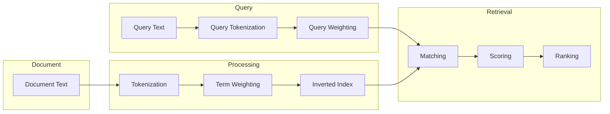
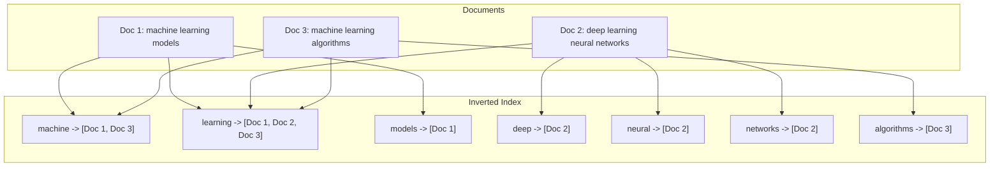
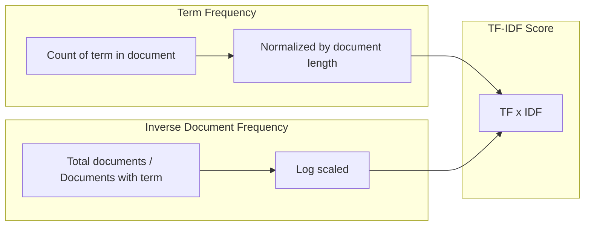
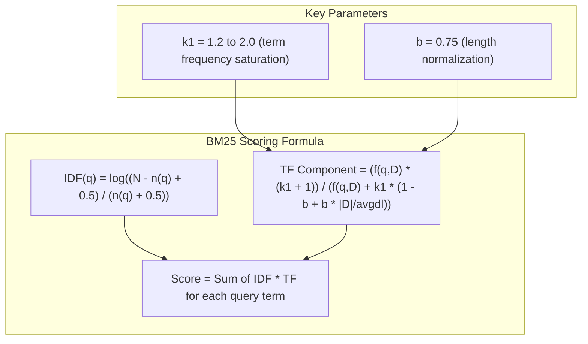
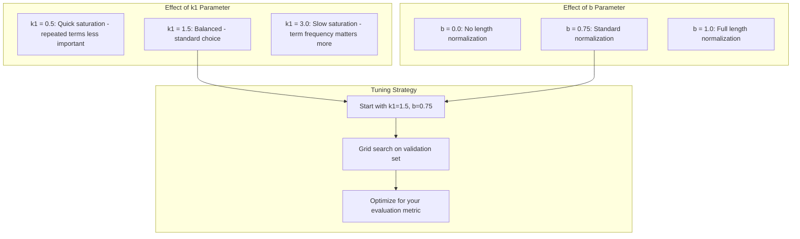
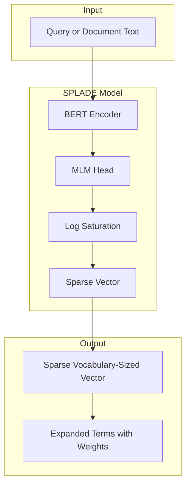
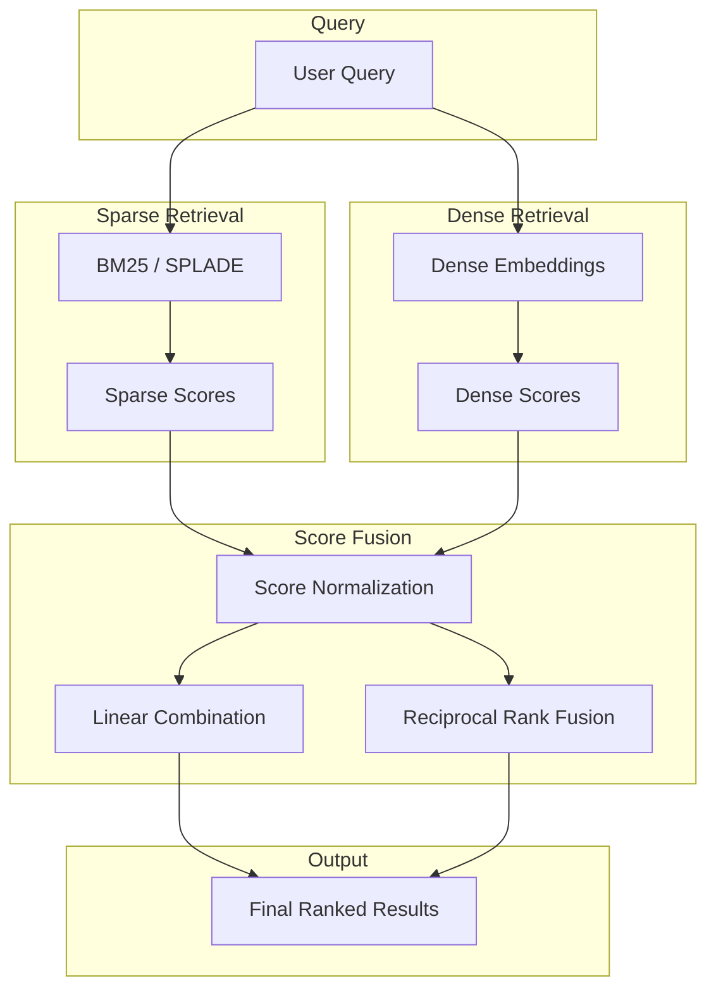
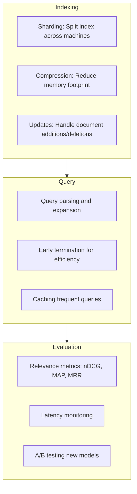

# How to Implement Sparse Retrieval

Author: [nawazdhandala](https://github.com/nawazdhandala)

Tags: RAG, Sparse Retrieval, BM25, Information Retrieval

Description: Learn to implement sparse retrieval with BM25, TF-IDF, and learned sparse representations for efficient keyword-based document search.

---

Sparse retrieval is a foundational technique in information retrieval that represents documents and queries as high-dimensional sparse vectors where most values are zero. Unlike dense retrieval methods that use neural embeddings, sparse retrieval relies on exact term matching and statistical measures to find relevant documents. This approach remains highly effective and is often combined with dense methods in production search systems.

## Understanding Sparse Retrieval

Sparse retrieval works by creating vectors where each dimension corresponds to a term in the vocabulary. Documents containing only a small subset of all possible terms result in vectors with mostly zero values - hence the name "sparse."



## The Inverted Index

The inverted index is the core data structure that makes sparse retrieval efficient. Instead of storing which terms appear in each document, it stores which documents contain each term.



### Building an Inverted Index in Python

```python
from collections import defaultdict
from typing import Dict, List, Set
import re

class InvertedIndex:
    def __init__(self):
        self.index: Dict[str, Set[int]] = defaultdict(set)
        self.documents: Dict[int, str] = {}
        self.doc_lengths: Dict[int, int] = {}
        self.avg_doc_length: float = 0.0

    def tokenize(self, text: str) -> List[str]:
        """Simple tokenization - lowercase and split on non-alphanumeric."""
        text = text.lower()
        tokens = re.findall(r'\b\w+\b', text)
        return tokens

    def add_document(self, doc_id: int, text: str):
        """Add a document to the index."""
        self.documents[doc_id] = text
        tokens = self.tokenize(text)
        self.doc_lengths[doc_id] = len(tokens)

        # Update average document length
        total_length = sum(self.doc_lengths.values())
        self.avg_doc_length = total_length / len(self.doc_lengths)

        # Add terms to inverted index
        for token in tokens:
            self.index[token].add(doc_id)

    def search(self, query: str) -> Set[int]:
        """Find documents containing all query terms."""
        query_tokens = self.tokenize(query)
        if not query_tokens:
            return set()

        # Start with documents containing the first term
        result = self.index.get(query_tokens[0], set()).copy()

        # Intersect with documents containing remaining terms
        for token in query_tokens[1:]:
            result &= self.index.get(token, set())

        return result

# Example usage
index = InvertedIndex()
index.add_document(1, "Machine learning models for classification")
index.add_document(2, "Deep learning neural networks")
index.add_document(3, "Machine learning algorithms and models")

results = index.search("machine learning")
print(f"Documents matching 'machine learning': {results}")
# Output: Documents matching 'machine learning': {1, 3}
```

## TF-IDF: Term Frequency - Inverse Document Frequency

TF-IDF is a statistical measure that evaluates how important a term is to a document within a collection. It combines two metrics:

- **Term Frequency (TF)**: How often a term appears in a document
- **Inverse Document Frequency (IDF)**: How rare the term is across all documents



### TF-IDF Implementation

```python
import math
from collections import Counter
from typing import Dict, List, Tuple

class TFIDFRetriever:
    def __init__(self):
        self.documents: Dict[int, str] = {}
        self.doc_term_freqs: Dict[int, Counter] = {}
        self.doc_freqs: Counter = Counter()  # Number of docs containing each term
        self.vocab: Set[str] = set()

    def tokenize(self, text: str) -> List[str]:
        """Tokenize text into lowercase terms."""
        return re.findall(r'\b\w+\b', text.lower())

    def add_document(self, doc_id: int, text: str):
        """Index a document."""
        self.documents[doc_id] = text
        tokens = self.tokenize(text)

        # Calculate term frequencies for this document
        term_freqs = Counter(tokens)
        self.doc_term_freqs[doc_id] = term_freqs

        # Update document frequencies (how many docs contain each term)
        unique_terms = set(tokens)
        self.vocab.update(unique_terms)
        for term in unique_terms:
            self.doc_freqs[term] += 1

    def compute_tf(self, term: str, doc_id: int) -> float:
        """Compute term frequency with log normalization."""
        tf = self.doc_term_freqs[doc_id].get(term, 0)
        return 1 + math.log(tf) if tf > 0 else 0

    def compute_idf(self, term: str) -> float:
        """Compute inverse document frequency."""
        n_docs = len(self.documents)
        doc_freq = self.doc_freqs.get(term, 0)
        if doc_freq == 0:
            return 0
        return math.log(n_docs / doc_freq)

    def compute_tfidf_vector(self, doc_id: int) -> Dict[str, float]:
        """Compute TF-IDF vector for a document."""
        vector = {}
        for term in self.doc_term_freqs[doc_id]:
            tf = self.compute_tf(term, doc_id)
            idf = self.compute_idf(term)
            vector[term] = tf * idf
        return vector

    def score_document(self, query_terms: List[str], doc_id: int) -> float:
        """Score a document against query terms."""
        score = 0.0
        for term in query_terms:
            tf = self.compute_tf(term, doc_id)
            idf = self.compute_idf(term)
            score += tf * idf
        return score

    def search(self, query: str, top_k: int = 10) -> List[Tuple[int, float]]:
        """Search for documents matching the query."""
        query_terms = self.tokenize(query)

        # Score all documents
        scores = []
        for doc_id in self.documents:
            score = self.score_document(query_terms, doc_id)
            if score > 0:
                scores.append((doc_id, score))

        # Sort by score descending
        scores.sort(key=lambda x: x[1], reverse=True)
        return scores[:top_k]

# Example usage
retriever = TFIDFRetriever()
retriever.add_document(1, "Python is a programming language for machine learning")
retriever.add_document(2, "Java is a programming language for enterprise applications")
retriever.add_document(3, "Machine learning with Python and TensorFlow")

results = retriever.search("Python machine learning")
for doc_id, score in results:
    print(f"Doc {doc_id}: {score:.4f} - {retriever.documents[doc_id]}")
```

## BM25: Best Matching 25

BM25 is the most widely used ranking function in sparse retrieval. It improves upon TF-IDF by adding document length normalization and term frequency saturation.



### BM25 Implementation

```python
import math
from collections import Counter
from typing import Dict, List, Tuple

class BM25Retriever:
    def __init__(self, k1: float = 1.5, b: float = 0.75):
        """
        Initialize BM25 retriever.

        Args:
            k1: Term frequency saturation parameter (typically 1.2-2.0)
            b: Length normalization parameter (0 = no normalization, 1 = full)
        """
        self.k1 = k1
        self.b = b
        self.documents: Dict[int, str] = {}
        self.doc_term_freqs: Dict[int, Counter] = {}
        self.doc_lengths: Dict[int, int] = {}
        self.doc_freqs: Counter = Counter()
        self.avg_doc_length: float = 0.0
        self.inverted_index: Dict[str, Set[int]] = defaultdict(set)

    def tokenize(self, text: str) -> List[str]:
        """Tokenize and normalize text."""
        return re.findall(r'\b\w+\b', text.lower())

    def add_document(self, doc_id: int, text: str):
        """Add a document to the index."""
        self.documents[doc_id] = text
        tokens = self.tokenize(text)

        self.doc_lengths[doc_id] = len(tokens)
        self.doc_term_freqs[doc_id] = Counter(tokens)

        # Update inverted index and document frequencies
        unique_terms = set(tokens)
        for term in unique_terms:
            self.doc_freqs[term] += 1
            self.inverted_index[term].add(doc_id)

        # Recalculate average document length
        self.avg_doc_length = sum(self.doc_lengths.values()) / len(self.doc_lengths)

    def compute_idf(self, term: str) -> float:
        """
        Compute IDF using the BM25 formula.

        IDF(q) = log((N - n(q) + 0.5) / (n(q) + 0.5) + 1)
        """
        n_docs = len(self.documents)
        doc_freq = self.doc_freqs.get(term, 0)

        # Robertson-Sparck Jones IDF formula
        numerator = n_docs - doc_freq + 0.5
        denominator = doc_freq + 0.5
        return math.log((numerator / denominator) + 1)

    def score_document(self, query_terms: List[str], doc_id: int) -> float:
        """
        Compute BM25 score for a document.

        Score(D, Q) = sum(IDF(q) * (f(q,D) * (k1 + 1)) /
                     (f(q,D) + k1 * (1 - b + b * |D| / avgdl)))
        """
        doc_length = self.doc_lengths[doc_id]
        term_freqs = self.doc_term_freqs[doc_id]

        score = 0.0
        for term in query_terms:
            if term not in term_freqs:
                continue

            # Term frequency in document
            tf = term_freqs[term]

            # IDF component
            idf = self.compute_idf(term)

            # TF component with saturation and length normalization
            length_norm = 1 - self.b + self.b * (doc_length / self.avg_doc_length)
            tf_component = (tf * (self.k1 + 1)) / (tf + self.k1 * length_norm)

            score += idf * tf_component

        return score

    def search(self, query: str, top_k: int = 10) -> List[Tuple[int, float]]:
        """Search for relevant documents."""
        query_terms = self.tokenize(query)

        # Find candidate documents (containing at least one query term)
        candidates = set()
        for term in query_terms:
            candidates.update(self.inverted_index.get(term, set()))

        # Score candidates
        scores = []
        for doc_id in candidates:
            score = self.score_document(query_terms, doc_id)
            scores.append((doc_id, score))

        # Sort by score
        scores.sort(key=lambda x: x[1], reverse=True)
        return scores[:top_k]

# Example usage
bm25 = BM25Retriever(k1=1.5, b=0.75)

documents = [
    "Sparse retrieval uses inverted indexes for fast document search",
    "Dense retrieval uses neural embeddings to find semantic matches",
    "BM25 is the most popular sparse retrieval algorithm",
    "Hybrid retrieval combines sparse and dense methods",
    "Inverted indexes enable efficient keyword matching in search engines"
]

for i, doc in enumerate(documents):
    bm25.add_document(i, doc)

results = bm25.search("sparse retrieval inverted index")
print("Search results for 'sparse retrieval inverted index':")
for doc_id, score in results:
    print(f"  Score: {score:.4f} - {documents[doc_id]}")
```

## BM25 Parameter Tuning

The effectiveness of BM25 depends heavily on choosing appropriate parameters for your corpus.



### Parameter Tuning Example

```python
from typing import List, Tuple, Dict
import itertools

def tune_bm25_parameters(
    documents: List[str],
    queries: List[str],
    relevance_labels: Dict[str, List[int]],  # query -> list of relevant doc ids
    k1_range: List[float] = [0.5, 1.0, 1.5, 2.0],
    b_range: List[float] = [0.25, 0.5, 0.75, 1.0]
) -> Tuple[float, float, float]:
    """
    Grid search for optimal BM25 parameters.

    Returns: (best_k1, best_b, best_score)
    """
    best_score = 0.0
    best_params = (1.5, 0.75)

    for k1, b in itertools.product(k1_range, b_range):
        retriever = BM25Retriever(k1=k1, b=b)

        # Index documents
        for i, doc in enumerate(documents):
            retriever.add_document(i, doc)

        # Evaluate on queries
        total_precision = 0.0
        for query in queries:
            results = retriever.search(query, top_k=10)
            retrieved_ids = [doc_id for doc_id, _ in results]

            # Calculate precision at 10
            relevant = set(relevance_labels.get(query, []))
            hits = sum(1 for doc_id in retrieved_ids if doc_id in relevant)
            precision = hits / len(retrieved_ids) if retrieved_ids else 0
            total_precision += precision

        avg_precision = total_precision / len(queries)

        if avg_precision > best_score:
            best_score = avg_precision
            best_params = (k1, b)

        print(f"k1={k1}, b={b}: Precision@10 = {avg_precision:.4f}")

    return (*best_params, best_score)
```

## SPLADE: Sparse Lexical and Expansion Model

SPLADE is a learned sparse retrieval model that uses transformers to generate sparse representations. Unlike traditional methods, SPLADE can expand queries with related terms and learn optimal term weights.



### SPLADE Concepts

SPLADE combines the interpretability of sparse retrieval with the semantic understanding of transformers:

1. **Term Expansion**: The model can assign non-zero weights to terms not in the original text
2. **Learned Weights**: Importance weights are learned end-to-end
3. **Sparsity Regularization**: L1 regularization encourages sparse outputs
4. **Efficiency**: Sparse vectors enable inverted index lookup

### Implementing SPLADE with Transformers

```python
import torch
import torch.nn as nn
from transformers import AutoModelForMaskedLM, AutoTokenizer
from typing import Dict, List

class SPLADEEncoder(nn.Module):
    def __init__(self, model_name: str = "naver/splade-cocondenser-ensembledistil"):
        super().__init__()
        self.tokenizer = AutoTokenizer.from_pretrained(model_name)
        self.model = AutoModelForMaskedLM.from_pretrained(model_name)

    def forward(self, texts: List[str]) -> torch.Tensor:
        """
        Encode texts into sparse vectors.

        Returns: Tensor of shape (batch_size, vocab_size)
        """
        # Tokenize
        inputs = self.tokenizer(
            texts,
            padding=True,
            truncation=True,
            max_length=256,
            return_tensors="pt"
        )

        # Get MLM logits
        with torch.no_grad():
            outputs = self.model(**inputs)
            logits = outputs.logits  # (batch, seq_len, vocab_size)

        # Apply log saturation: log(1 + ReLU(x))
        # This bounds the weights and encourages sparsity
        relu_log = torch.log1p(torch.relu(logits))

        # Max pooling over sequence length
        # Each token contributes its maximum activation per vocab term
        attention_mask = inputs["attention_mask"].unsqueeze(-1)
        relu_log = relu_log * attention_mask  # Mask padding tokens
        sparse_vec = torch.max(relu_log, dim=1).values  # (batch, vocab_size)

        return sparse_vec

    def encode_and_get_top_terms(
        self,
        text: str,
        top_k: int = 20
    ) -> List[Tuple[str, float]]:
        """Encode text and return top weighted terms."""
        sparse_vec = self.forward([text])[0]

        # Get top-k indices and values
        top_values, top_indices = torch.topk(sparse_vec, k=top_k)

        # Convert to terms
        terms = []
        for idx, value in zip(top_indices.tolist(), top_values.tolist()):
            if value > 0:
                token = self.tokenizer.decode([idx])
                terms.append((token.strip(), value))

        return terms

# Example usage (requires transformers and torch)
# encoder = SPLADEEncoder()
#
# query = "What is sparse retrieval?"
# top_terms = encoder.encode_and_get_top_terms(query, top_k=10)
# print("Query expansion:")
# for term, weight in top_terms:
#     print(f"  {term}: {weight:.4f}")
#
# Expected output shows both original terms and expanded related terms:
# Query expansion:
#   sparse: 2.3421
#   retrieval: 2.1876
#   search: 1.8934  <- expanded term
#   information: 1.5623  <- expanded term
#   what: 0.8934
```

### SPLADE for Document Retrieval

```python
import numpy as np
from scipy.sparse import csr_matrix
from typing import List, Tuple, Dict

class SPLADERetriever:
    def __init__(self, encoder: SPLADEEncoder):
        self.encoder = encoder
        self.doc_vectors: List[np.ndarray] = []
        self.documents: List[str] = []
        self.vocab_size = encoder.tokenizer.vocab_size

    def index_documents(self, documents: List[str], batch_size: int = 32):
        """Index documents in batches."""
        self.documents = documents
        self.doc_vectors = []

        for i in range(0, len(documents), batch_size):
            batch = documents[i:i + batch_size]
            vectors = self.encoder.forward(batch)

            for vec in vectors:
                # Convert to numpy and store
                self.doc_vectors.append(vec.numpy())

        print(f"Indexed {len(self.doc_vectors)} documents")

    def search(self, query: str, top_k: int = 10) -> List[Tuple[int, float]]:
        """Search for documents matching the query."""
        # Encode query
        query_vec = self.encoder.forward([query])[0].numpy()

        # Compute dot product scores (sparse vectors make this efficient)
        scores = []
        for doc_id, doc_vec in enumerate(self.doc_vectors):
            # Dot product between sparse vectors
            score = np.dot(query_vec, doc_vec)
            scores.append((doc_id, float(score)))

        # Sort by score
        scores.sort(key=lambda x: x[1], reverse=True)
        return scores[:top_k]
```

## Hybrid Retrieval: Combining Sparse and Dense

Production search systems often combine sparse and dense retrieval to get the best of both approaches. Sparse methods excel at exact matching while dense methods capture semantic similarity.



### Hybrid Retrieval Implementation

```python
from typing import List, Tuple, Dict
import numpy as np

class HybridRetriever:
    def __init__(
        self,
        sparse_retriever: BM25Retriever,
        dense_retriever,  # Any dense retriever with search method
        sparse_weight: float = 0.5
    ):
        """
        Initialize hybrid retriever.

        Args:
            sparse_weight: Weight for sparse scores (dense_weight = 1 - sparse_weight)
        """
        self.sparse = sparse_retriever
        self.dense = dense_retriever
        self.sparse_weight = sparse_weight
        self.dense_weight = 1 - sparse_weight

    def normalize_scores(
        self,
        scores: List[Tuple[int, float]]
    ) -> Dict[int, float]:
        """Min-max normalize scores to [0, 1] range."""
        if not scores:
            return {}

        score_values = [s for _, s in scores]
        min_score = min(score_values)
        max_score = max(score_values)
        score_range = max_score - min_score

        if score_range == 0:
            return {doc_id: 1.0 for doc_id, _ in scores}

        return {
            doc_id: (score - min_score) / score_range
            for doc_id, score in scores
        }

    def search_linear_combination(
        self,
        query: str,
        top_k: int = 10,
        candidate_pool: int = 100
    ) -> List[Tuple[int, float]]:
        """
        Combine sparse and dense scores with linear interpolation.
        """
        # Get candidates from both retrievers
        sparse_results = self.sparse.search(query, top_k=candidate_pool)
        dense_results = self.dense.search(query, top_k=candidate_pool)

        # Normalize scores
        sparse_scores = self.normalize_scores(sparse_results)
        dense_scores = self.normalize_scores(dense_results)

        # Combine scores
        all_doc_ids = set(sparse_scores.keys()) | set(dense_scores.keys())
        combined_scores = []

        for doc_id in all_doc_ids:
            sparse_score = sparse_scores.get(doc_id, 0.0)
            dense_score = dense_scores.get(doc_id, 0.0)

            combined = (
                self.sparse_weight * sparse_score +
                self.dense_weight * dense_score
            )
            combined_scores.append((doc_id, combined))

        # Sort and return top-k
        combined_scores.sort(key=lambda x: x[1], reverse=True)
        return combined_scores[:top_k]

    def search_rrf(
        self,
        query: str,
        top_k: int = 10,
        k: int = 60
    ) -> List[Tuple[int, float]]:
        """
        Reciprocal Rank Fusion (RRF) for combining rankings.

        RRF score = sum(1 / (k + rank)) for each ranking

        Args:
            k: Constant to prevent high scores for top ranks (typically 60)
        """
        sparse_results = self.sparse.search(query, top_k=100)
        dense_results = self.dense.search(query, top_k=100)

        # Convert to rank dictionaries
        sparse_ranks = {doc_id: rank for rank, (doc_id, _) in enumerate(sparse_results)}
        dense_ranks = {doc_id: rank for rank, (doc_id, _) in enumerate(dense_results)}

        # Calculate RRF scores
        all_doc_ids = set(sparse_ranks.keys()) | set(dense_ranks.keys())
        rrf_scores = []

        for doc_id in all_doc_ids:
            score = 0.0

            if doc_id in sparse_ranks:
                score += 1.0 / (k + sparse_ranks[doc_id])
            if doc_id in dense_ranks:
                score += 1.0 / (k + dense_ranks[doc_id])

            rrf_scores.append((doc_id, score))

        rrf_scores.sort(key=lambda x: x[1], reverse=True)
        return rrf_scores[:top_k]

# Example usage
# hybrid = HybridRetriever(bm25_retriever, dense_retriever, sparse_weight=0.3)
# results = hybrid.search_rrf("machine learning tutorials")
```

## Production Considerations

When deploying sparse retrieval systems at scale, consider these key factors:



### Using Established Libraries

For production use, leverage battle-tested libraries:

```python
# Using rank-bm25 library
from rank_bm25 import BM25Okapi

corpus = [
    "Sparse retrieval methods for document search",
    "Dense neural retrieval with transformers",
    "Hybrid search combining multiple approaches"
]

tokenized_corpus = [doc.lower().split() for doc in corpus]
bm25 = BM25Okapi(tokenized_corpus)

query = "sparse search methods"
tokenized_query = query.lower().split()
scores = bm25.get_scores(tokenized_query)

print("BM25 scores:", scores)
# Output: BM25 scores: [1.2345, 0.0, 0.4567]
```

```python
# Using Elasticsearch for scalable BM25
from elasticsearch import Elasticsearch

es = Elasticsearch()

# Create index with BM25 similarity
index_settings = {
    "settings": {
        "index": {
            "similarity": {
                "custom_bm25": {
                    "type": "BM25",
                    "k1": 1.5,
                    "b": 0.75
                }
            }
        }
    },
    "mappings": {
        "properties": {
            "content": {
                "type": "text",
                "similarity": "custom_bm25"
            }
        }
    }
}

es.indices.create(index="documents", body=index_settings)

# Index documents
for i, doc in enumerate(documents):
    es.index(index="documents", id=i, body={"content": doc})

# Search
response = es.search(
    index="documents",
    body={
        "query": {
            "match": {
                "content": "sparse retrieval"
            }
        }
    }
)
```

## Summary

Sparse retrieval remains essential for modern search systems due to its efficiency, interpretability, and strong performance on keyword-matching tasks. Key takeaways:

1. **Inverted indexes** enable fast lookup of documents containing query terms
2. **TF-IDF** provides a foundation for understanding term importance
3. **BM25** improves on TF-IDF with length normalization and term saturation
4. **SPLADE** combines learned representations with sparse efficiency
5. **Hybrid approaches** combine sparse and dense methods for best results

For most applications, start with BM25 as your baseline, then explore SPLADE or hybrid approaches based on your specific requirements for semantic understanding versus exact matching.
