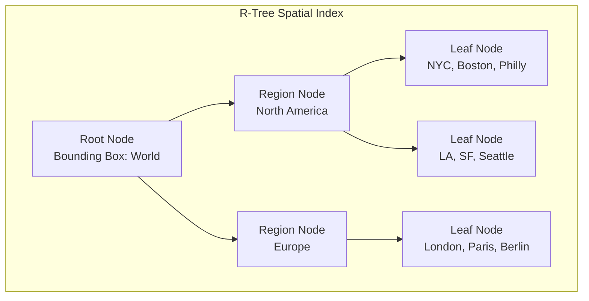
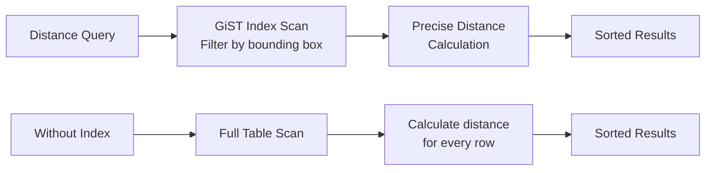

# How to Create Spatial Index Design

Author: [nawazdhandala](https://github.com/nawazdhandala)

Tags: Database, GIS, Spatial, PostGIS

Description: Learn to create spatial index design for efficient geospatial queries and location-based data.

---

Spatial indexes are specialized data structures that enable fast querying of geographic and geometric data. When your application needs to find nearby restaurants, determine if a point falls within a delivery zone, or calculate distances between locations, a properly designed spatial index makes these operations orders of magnitude faster than scanning every record in your table.

## Why Spatial Data Needs Special Indexes

Traditional B-tree indexes work well for one-dimensional data that can be sorted linearly. Geographic data exists in two or more dimensions, making simple sorting impossible. A location at latitude 40.7128 and longitude -74.0060 (New York City) cannot be meaningfully compared to latitude 34.0522 and longitude -118.2437 (Los Angeles) using a single sort order.

The following diagram shows how spatial indexes partition two-dimensional space to enable efficient searching.



Spatial indexes group nearby objects into hierarchical bounding boxes. When searching for points near a location, the index quickly eliminates entire regions that cannot contain matches.

## Common Spatial Index Types

Different spatial index implementations offer trade-offs between build time, query speed, and memory usage. The table below compares the most common options.

| Index Type | Best For | Strengths | Weaknesses |
|------------|----------|-----------|------------|
| R-Tree | General purpose | Balanced performance, handles updates well | Slower for point-only data |
| GiST | PostGIS default | Flexible, supports many operators | Larger index size |
| SP-GiST | Point data | Fast for clustered points | Poor for overlapping geometries |
| BRIN | Very large tables | Tiny index size | Only works with clustered data |

## Setting Up PostGIS for Spatial Indexing

PostGIS extends PostgreSQL with geographic capabilities. Before creating spatial indexes, enable the extension and set up your table with the appropriate column types.

```sql
-- Enable PostGIS extension in your database
-- This adds geometry and geography types plus spatial functions
CREATE EXTENSION IF NOT EXISTS postgis;

-- Create a table for storing location data
-- Use geography type for lat/lng coordinates with earth curvature
CREATE TABLE locations (
    id SERIAL PRIMARY KEY,
    name VARCHAR(255) NOT NULL,
    coordinates GEOGRAPHY(POINT, 4326),
    boundary GEOGRAPHY(POLYGON, 4326),
    created_at TIMESTAMP DEFAULT NOW()
);
```

The SRID 4326 refers to the WGS84 coordinate system used by GPS devices and most mapping applications. Always specify the SRID to ensure consistent calculations.

## Creating Your First Spatial Index

With PostGIS, creating a spatial index uses the standard CREATE INDEX syntax with the USING GIST clause. GiST (Generalized Search Tree) is the most versatile spatial index type.

```sql
-- Create a GiST spatial index on the coordinates column
-- This enables fast proximity and containment queries
CREATE INDEX idx_locations_coordinates
ON locations USING GIST (coordinates);

-- Create a separate index for polygon boundaries
-- Useful for point-in-polygon containment checks
CREATE INDEX idx_locations_boundary
ON locations USING GIST (boundary);
```

## Designing Indexes for Distance Queries

Finding nearby locations is the most common spatial query pattern. The ST_DWithin function efficiently finds all points within a specified distance.

```sql
-- Find all locations within 5 kilometers of a point
-- ST_DWithin uses the spatial index for fast filtering
-- The third parameter is distance in meters for geography type
SELECT name,
       ST_Distance(coordinates, ST_MakePoint(-73.9857, 40.7484)::geography) as distance_meters
FROM locations
WHERE ST_DWithin(
    coordinates,
    ST_MakePoint(-73.9857, 40.7484)::geography,
    5000  -- 5000 meters = 5 km
)
ORDER BY distance_meters;
```

The query execution flow with a spatial index is shown below.



## Optimizing for Point-in-Polygon Queries

Delivery zones, service areas, and geofencing all require checking if a point falls within a polygon boundary. Design your index to support the ST_Contains and ST_Within functions.

```sql
-- Create a table for delivery zones with polygon boundaries
CREATE TABLE delivery_zones (
    id SERIAL PRIMARY KEY,
    zone_name VARCHAR(100),
    boundary GEOGRAPHY(POLYGON, 4326),
    delivery_fee DECIMAL(10,2)
);

-- Index the polygon boundaries for containment queries
CREATE INDEX idx_delivery_zones_boundary
ON delivery_zones USING GIST (boundary);

-- Find which delivery zone contains a customer location
SELECT zone_name, delivery_fee
FROM delivery_zones
WHERE ST_Contains(
    boundary::geometry,
    ST_MakePoint(-73.9857, 40.7484)::geometry
);
```

## Compound Spatial Indexes

When queries filter on both spatial and non-spatial columns, a compound index can improve performance. PostGIS supports including regular columns alongside geometry columns.

```sql
-- Table with category and location data
CREATE TABLE restaurants (
    id SERIAL PRIMARY KEY,
    name VARCHAR(255),
    cuisine_type VARCHAR(50),
    coordinates GEOGRAPHY(POINT, 4326),
    rating DECIMAL(2,1)
);

-- Create compound index for filtered spatial queries
-- First column should be the most selective filter
CREATE INDEX idx_restaurants_cuisine_location
ON restaurants USING GIST (coordinates)
WHERE cuisine_type IS NOT NULL;

-- Partial index for high-rated restaurants only
-- Smaller index size, faster queries for common use case
CREATE INDEX idx_restaurants_toprated_location
ON restaurants USING GIST (coordinates)
WHERE rating >= 4.0;
```

## Analyzing Spatial Query Performance

Use EXPLAIN ANALYZE to verify your spatial index is being used and measure actual query times.

```sql
-- Check if the spatial index is used
EXPLAIN ANALYZE
SELECT name
FROM locations
WHERE ST_DWithin(
    coordinates,
    ST_MakePoint(-73.9857, 40.7484)::geography,
    1000
);
```

Look for "Index Scan using idx_locations_coordinates" in the output. If you see "Seq Scan" instead, the planner chose not to use the index. Common reasons include outdated statistics or a query that returns most rows anyway.

```sql
-- Update statistics after bulk inserts
ANALYZE locations;

-- Force index usage for testing (not recommended in production)
SET enable_seqscan = off;
```

## Index Maintenance Strategies

Spatial indexes require maintenance as data changes. The table below summarizes key maintenance tasks.

| Task | Frequency | Command |
|------|-----------|---------|
| Update Statistics | After bulk changes | `ANALYZE table_name;` |
| Reindex | Monthly or after heavy updates | `REINDEX INDEX idx_name;` |
| Check Bloat | Weekly | Query pg_stat_user_indexes |
| Cluster Data | Quarterly | `CLUSTER table_name USING idx_name;` |

## Common Pitfalls to Avoid

Several mistakes can undermine spatial index performance. Mixing geometry and geography types in queries prevents index usage. Failing to specify SRID leads to incorrect distance calculations. Using functions that transform coordinates, like ST_Transform, inside WHERE clauses forces full table scans.

```sql
-- Bad: Function on indexed column prevents index use
SELECT * FROM locations
WHERE ST_Transform(coordinates::geometry, 3857) && some_box;

-- Good: Transform the search parameter instead
SELECT * FROM locations
WHERE coordinates::geometry && ST_Transform(some_box, 4326);
```

## Summary

Spatial index design requires understanding both your data characteristics and query patterns. Start with GiST indexes for general-purpose spatial queries. Use the geography type for accurate distance calculations on Earth coordinates. Create compound or partial indexes when queries combine spatial and attribute filters. Monitor query plans with EXPLAIN ANALYZE and maintain index statistics after bulk operations. A well-designed spatial index transforms location queries from seconds to milliseconds, enabling responsive mapping features and real-time proximity searches at any scale.
