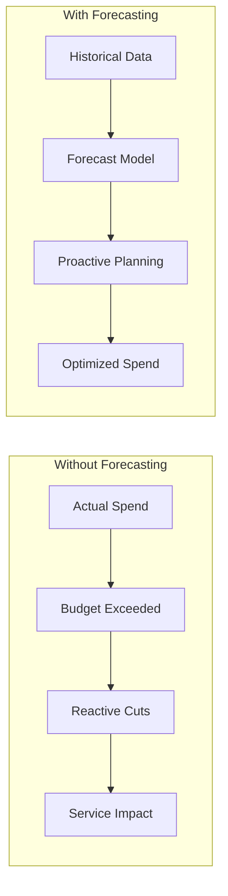
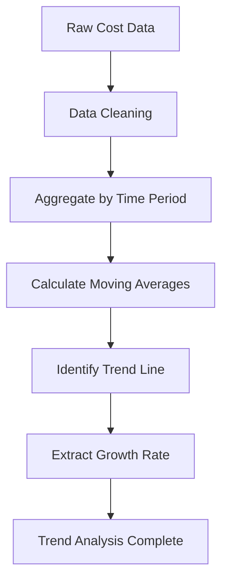
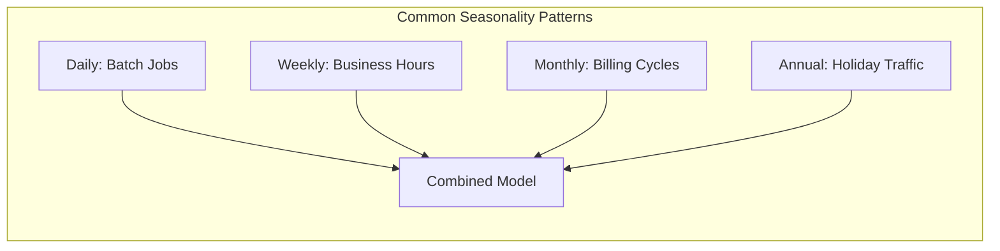
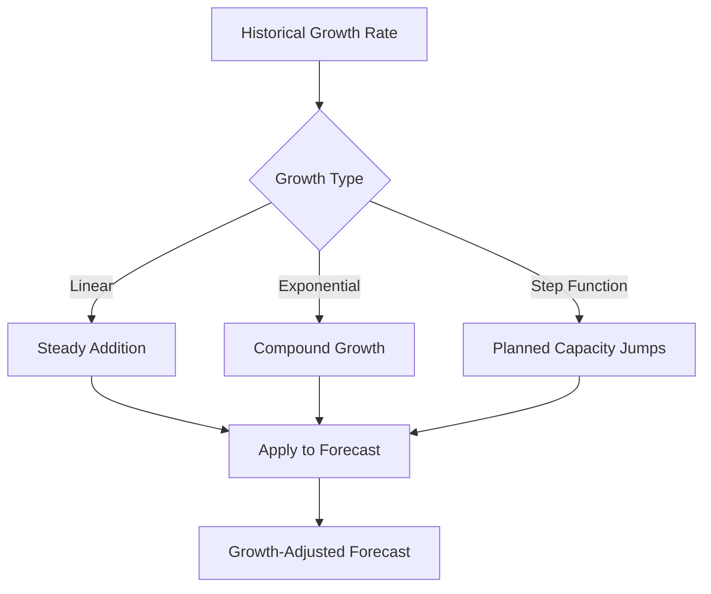
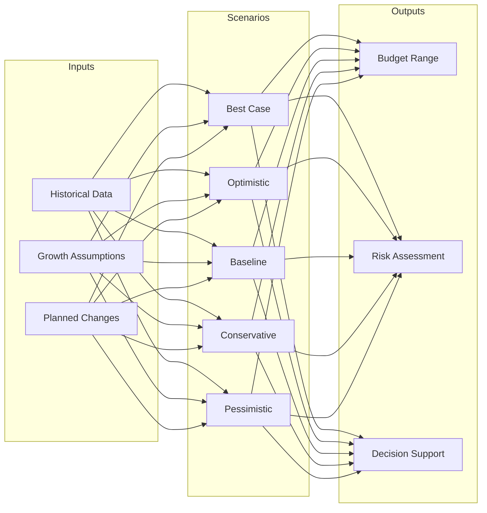
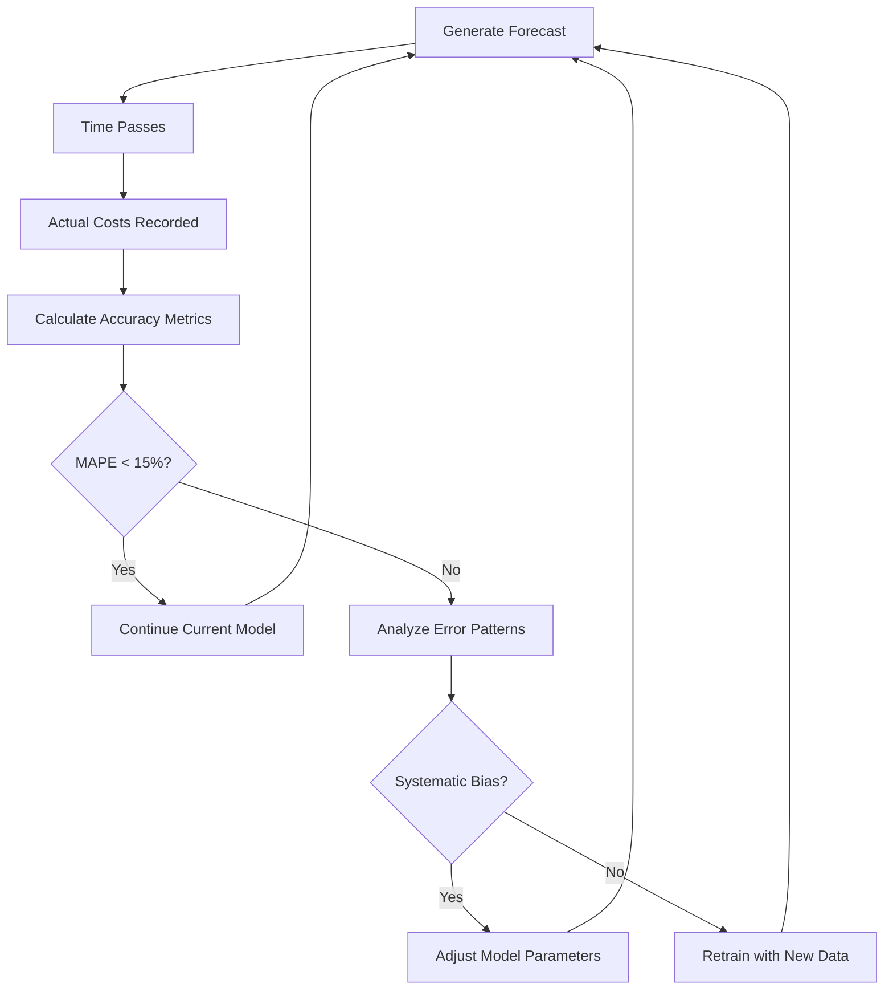

# How to Implement Spend Forecasting

Author: [nawazdhandala](https://github.com/nawazdhandala)

Tags: Cost Optimization, FinOps, Forecasting, Cloud

Description: Learn how to forecast cloud spending for budget planning and optimization.

---

Cloud costs are notoriously unpredictable. One month you're within budget, the next you're scrambling to explain a 40% overage to finance. Spend forecasting transforms this chaos into predictable, actionable intelligence. This guide walks you through implementing a robust forecasting system from scratch.

## Why Spend Forecasting Matters

Without forecasting, you're flying blind. You can't:
- Set realistic budgets for the next quarter
- Identify cost anomalies before they become crises
- Plan infrastructure investments confidently
- Negotiate reserved instances or committed use discounts



## Historical Trend Analysis

The foundation of any forecast is understanding what happened before. Start by collecting at least 6-12 months of historical cost data.

### Collecting Cost Data

Most cloud providers expose cost data through APIs. Here's how to collect it programmatically.

```python
import boto3
from datetime import datetime, timedelta
import pandas as pd

def get_aws_cost_data(months_back: int = 12) -> pd.DataFrame:
    """
    Retrieve historical cost data from AWS Cost Explorer.

    Args:
        months_back: Number of months of historical data to retrieve

    Returns:
        DataFrame with daily costs by service
    """
    client = boto3.client('ce', region_name='us-east-1')

    end_date = datetime.now().replace(day=1)
    start_date = end_date - timedelta(days=months_back * 30)

    response = client.get_cost_and_usage(
        TimePeriod={
            'Start': start_date.strftime('%Y-%m-%d'),
            'End': end_date.strftime('%Y-%m-%d')
        },
        Granularity='DAILY',
        Metrics=['UnblendedCost'],
        GroupBy=[
            {'Type': 'DIMENSION', 'Key': 'SERVICE'}
        ]
    )

    # Parse response into DataFrame
    records = []
    for result in response['ResultsByTime']:
        date = result['TimePeriod']['Start']
        for group in result['Groups']:
            service = group['Keys'][0]
            cost = float(group['Metrics']['UnblendedCost']['Amount'])
            records.append({
                'date': date,
                'service': service,
                'cost': cost
            })

    df = pd.DataFrame(records)
    df['date'] = pd.to_datetime(df['date'])
    return df
```

### Analyzing Trends

Once you have the data, identify the underlying trend - is spending growing, stable, or declining?

```python
import numpy as np
from scipy import stats

def analyze_cost_trend(df: pd.DataFrame) -> dict:
    """
    Analyze the overall cost trend from historical data.

    Returns trend statistics including slope, growth rate, and R-squared.
    """
    # Aggregate daily costs
    daily_costs = df.groupby('date')['cost'].sum().reset_index()
    daily_costs = daily_costs.sort_values('date')

    # Convert dates to numeric for regression
    daily_costs['day_num'] = (daily_costs['date'] - daily_costs['date'].min()).dt.days

    # Linear regression to find trend
    slope, intercept, r_value, p_value, std_err = stats.linregress(
        daily_costs['day_num'],
        daily_costs['cost']
    )

    # Calculate monthly growth rate
    avg_daily_cost = daily_costs['cost'].mean()
    monthly_growth_rate = (slope * 30) / avg_daily_cost * 100

    return {
        'slope': slope,
        'intercept': intercept,
        'r_squared': r_value ** 2,
        'monthly_growth_rate': monthly_growth_rate,
        'avg_daily_cost': avg_daily_cost,
        'trend_direction': 'increasing' if slope > 0 else 'decreasing'
    }
```



## Forecasting Models

Different scenarios call for different models. Here are the most practical approaches for cloud cost forecasting.

### Simple Moving Average

Best for stable, predictable workloads with minimal seasonality.

```python
def moving_average_forecast(
    df: pd.DataFrame,
    window: int = 30,
    forecast_days: int = 90
) -> pd.DataFrame:
    """
    Generate forecast using simple moving average.

    Args:
        df: Historical cost data
        window: Number of days for the moving average window
        forecast_days: Number of days to forecast

    Returns:
        DataFrame with forecasted costs
    """
    daily_costs = df.groupby('date')['cost'].sum().reset_index()
    daily_costs = daily_costs.sort_values('date')

    # Calculate moving average
    daily_costs['ma'] = daily_costs['cost'].rolling(window=window).mean()

    # Use last MA value as the forecast
    last_ma = daily_costs['ma'].iloc[-1]
    last_date = daily_costs['date'].iloc[-1]

    # Generate forecast dates
    forecast_dates = pd.date_range(
        start=last_date + timedelta(days=1),
        periods=forecast_days,
        freq='D'
    )

    forecast_df = pd.DataFrame({
        'date': forecast_dates,
        'forecasted_cost': last_ma,
        'method': 'moving_average'
    })

    return forecast_df
```

### Exponential Smoothing

Gives more weight to recent data points, better for trending costs.

```python
from statsmodels.tsa.holtwinters import ExponentialSmoothing

def exponential_smoothing_forecast(
    df: pd.DataFrame,
    forecast_days: int = 90,
    seasonal_periods: int = 7  # Weekly seasonality
) -> pd.DataFrame:
    """
    Generate forecast using Holt-Winters exponential smoothing.

    Captures both trend and seasonality in the data.
    """
    daily_costs = df.groupby('date')['cost'].sum().reset_index()
    daily_costs = daily_costs.sort_values('date').set_index('date')

    # Fit the model with trend and seasonal components
    model = ExponentialSmoothing(
        daily_costs['cost'],
        trend='add',           # Additive trend
        seasonal='add',        # Additive seasonality
        seasonal_periods=seasonal_periods
    )

    fitted_model = model.fit(optimized=True)

    # Generate forecast
    forecast = fitted_model.forecast(forecast_days)

    forecast_df = pd.DataFrame({
        'date': forecast.index,
        'forecasted_cost': forecast.values,
        'method': 'exponential_smoothing'
    })

    return forecast_df
```

### Linear Regression with Features

When you need to incorporate external factors like planned launches or expected traffic changes.

```python
from sklearn.linear_model import Ridge
from sklearn.preprocessing import StandardScaler

def regression_forecast(
    df: pd.DataFrame,
    forecast_days: int = 90,
    planned_events: list = None
) -> pd.DataFrame:
    """
    Generate forecast using regression with engineered features.

    Args:
        df: Historical cost data
        forecast_days: Days to forecast
        planned_events: List of dicts with 'date' and 'impact_multiplier'
    """
    daily_costs = df.groupby('date')['cost'].sum().reset_index()
    daily_costs = daily_costs.sort_values('date')

    # Feature engineering
    daily_costs['day_of_week'] = daily_costs['date'].dt.dayofweek
    daily_costs['day_of_month'] = daily_costs['date'].dt.day
    daily_costs['month'] = daily_costs['date'].dt.month
    daily_costs['days_since_start'] = (
        daily_costs['date'] - daily_costs['date'].min()
    ).dt.days

    # Prepare features
    feature_cols = ['day_of_week', 'day_of_month', 'month', 'days_since_start']
    X = daily_costs[feature_cols]
    y = daily_costs['cost']

    # Scale features
    scaler = StandardScaler()
    X_scaled = scaler.fit_transform(X)

    # Fit model
    model = Ridge(alpha=1.0)
    model.fit(X_scaled, y)

    # Generate future dates and features
    last_date = daily_costs['date'].max()
    future_dates = pd.date_range(
        start=last_date + timedelta(days=1),
        periods=forecast_days,
        freq='D'
    )

    future_df = pd.DataFrame({'date': future_dates})
    future_df['day_of_week'] = future_df['date'].dt.dayofweek
    future_df['day_of_month'] = future_df['date'].dt.day
    future_df['month'] = future_df['date'].dt.month
    future_df['days_since_start'] = (
        future_df['date'] - daily_costs['date'].min()
    ).dt.days

    # Predict
    X_future = scaler.transform(future_df[feature_cols])
    future_df['forecasted_cost'] = model.predict(X_future)

    # Apply planned event multipliers
    if planned_events:
        for event in planned_events:
            event_date = pd.to_datetime(event['date'])
            mask = future_df['date'] >= event_date
            future_df.loc[mask, 'forecasted_cost'] *= event['impact_multiplier']

    return future_df[['date', 'forecasted_cost']]
```

## Seasonal Adjustments

Cloud costs often have predictable patterns: higher on weekdays, spikes at month-end, or seasonal business cycles.



### Detecting Seasonality

```python
from statsmodels.tsa.seasonal import seasonal_decompose

def detect_seasonality(df: pd.DataFrame, period: int = 7) -> dict:
    """
    Decompose time series to identify seasonal patterns.

    Args:
        df: Historical cost data
        period: Expected seasonality period (7 for weekly, 30 for monthly)

    Returns:
        Dictionary with trend, seasonal, and residual components
    """
    daily_costs = df.groupby('date')['cost'].sum().reset_index()
    daily_costs = daily_costs.sort_values('date').set_index('date')

    # Ensure we have enough data
    if len(daily_costs) < 2 * period:
        raise ValueError(f"Need at least {2 * period} days of data")

    # Decompose the time series
    decomposition = seasonal_decompose(
        daily_costs['cost'],
        model='additive',
        period=period
    )

    # Calculate seasonality strength
    var_residual = decomposition.resid.var()
    var_seasonal = decomposition.seasonal.var()
    seasonality_strength = var_seasonal / (var_seasonal + var_residual)

    return {
        'trend': decomposition.trend,
        'seasonal': decomposition.seasonal,
        'residual': decomposition.resid,
        'seasonality_strength': seasonality_strength,
        'has_strong_seasonality': seasonality_strength > 0.3
    }
```

### Applying Seasonal Adjustments

```python
def apply_seasonal_adjustment(
    base_forecast: pd.DataFrame,
    seasonal_factors: pd.Series
) -> pd.DataFrame:
    """
    Apply seasonal adjustments to a base forecast.

    Args:
        base_forecast: DataFrame with date and forecasted_cost columns
        seasonal_factors: Series with seasonal adjustment factors by day
    """
    forecast = base_forecast.copy()

    # Map seasonal factors to forecast dates
    forecast['day_of_week'] = forecast['date'].dt.dayofweek

    # Create seasonal factor lookup
    seasonal_by_day = seasonal_factors.groupby(
        seasonal_factors.index.dayofweek
    ).mean()

    # Apply adjustments
    forecast['seasonal_adjustment'] = forecast['day_of_week'].map(seasonal_by_day)
    forecast['adjusted_forecast'] = (
        forecast['forecasted_cost'] + forecast['seasonal_adjustment']
    )

    return forecast
```

## Growth Rate Incorporation

Business growth directly impacts cloud costs. Here's how to factor it in.

### Calculating Historical Growth Rates

```python
def calculate_growth_rates(df: pd.DataFrame) -> dict:
    """
    Calculate various growth rate metrics from historical data.
    """
    daily_costs = df.groupby('date')['cost'].sum().reset_index()
    daily_costs = daily_costs.sort_values('date')

    # Monthly totals
    monthly = daily_costs.set_index('date').resample('M')['cost'].sum()

    # Month-over-month growth
    mom_growth = monthly.pct_change().dropna()

    # Year-over-year growth (if enough data)
    yoy_growth = None
    if len(monthly) >= 12:
        yoy_growth = (monthly / monthly.shift(12) - 1).dropna()

    # Compound monthly growth rate
    n_months = len(monthly)
    total_growth = monthly.iloc[-1] / monthly.iloc[0]
    cmgr = (total_growth ** (1 / n_months)) - 1

    return {
        'avg_mom_growth': mom_growth.mean(),
        'mom_growth_std': mom_growth.std(),
        'cmgr': cmgr,
        'yoy_growth': yoy_growth.mean() if yoy_growth is not None else None,
        'total_growth': total_growth - 1
    }
```

### Projecting with Growth

```python
def forecast_with_growth(
    base_cost: float,
    growth_rate: float,
    forecast_months: int = 12,
    confidence_interval: float = 0.95
) -> pd.DataFrame:
    """
    Project costs forward with a given growth rate.

    Args:
        base_cost: Starting monthly cost
        growth_rate: Monthly growth rate (e.g., 0.05 for 5%)
        forecast_months: Number of months to forecast
        confidence_interval: Confidence level for bounds
    """
    forecasts = []
    current_cost = base_cost

    # Assume growth rate has some variance
    growth_std = growth_rate * 0.3  # 30% standard deviation

    for month in range(1, forecast_months + 1):
        current_cost = current_cost * (1 + growth_rate)

        # Calculate confidence bounds
        z_score = stats.norm.ppf((1 + confidence_interval) / 2)
        lower = current_cost * (1 - z_score * growth_std * np.sqrt(month))
        upper = current_cost * (1 + z_score * growth_std * np.sqrt(month))

        forecasts.append({
            'month': month,
            'forecasted_cost': current_cost,
            'lower_bound': max(0, lower),
            'upper_bound': upper
        })

    return pd.DataFrame(forecasts)
```



## Scenario Modeling

Real-world planning requires multiple scenarios, not a single number.

### Building Scenarios

```python
from dataclasses import dataclass
from typing import List

@dataclass
class Scenario:
    name: str
    growth_rate: float
    description: str
    probability: float = 0.0

def create_scenarios(
    base_growth: float,
    growth_std: float
) -> List[Scenario]:
    """
    Create standard planning scenarios based on historical growth variability.
    """
    return [
        Scenario(
            name='pessimistic',
            growth_rate=base_growth + 2 * growth_std,
            description='High growth, aggressive scaling',
            probability=0.1
        ),
        Scenario(
            name='conservative',
            growth_rate=base_growth + growth_std,
            description='Above-average growth',
            probability=0.2
        ),
        Scenario(
            name='baseline',
            growth_rate=base_growth,
            description='Expected growth trajectory',
            probability=0.4
        ),
        Scenario(
            name='optimistic',
            growth_rate=base_growth - growth_std,
            description='Below-average growth, good cost control',
            probability=0.2
        ),
        Scenario(
            name='best_case',
            growth_rate=max(0, base_growth - 2 * growth_std),
            description='Minimal growth, cost optimization wins',
            probability=0.1
        )
    ]

def model_scenarios(
    base_cost: float,
    scenarios: List[Scenario],
    forecast_months: int = 12
) -> pd.DataFrame:
    """
    Generate forecasts for multiple scenarios.
    """
    all_forecasts = []

    for scenario in scenarios:
        forecast = forecast_with_growth(
            base_cost,
            scenario.growth_rate,
            forecast_months
        )
        forecast['scenario'] = scenario.name
        forecast['probability'] = scenario.probability
        all_forecasts.append(forecast)

    return pd.concat(all_forecasts, ignore_index=True)
```

### Visualizing Scenarios

```python
import matplotlib.pyplot as plt

def plot_scenario_forecast(scenario_df: pd.DataFrame, title: str = "Cost Forecast Scenarios"):
    """
    Create a visualization of multiple forecast scenarios.
    """
    fig, ax = plt.subplots(figsize=(12, 6))

    colors = {
        'pessimistic': '#ff6b6b',
        'conservative': '#ffa94d',
        'baseline': '#69db7c',
        'optimistic': '#74c0fc',
        'best_case': '#b197fc'
    }

    for scenario in scenario_df['scenario'].unique():
        data = scenario_df[scenario_df['scenario'] == scenario]
        ax.plot(
            data['month'],
            data['forecasted_cost'],
            label=scenario,
            color=colors.get(scenario, 'gray'),
            linewidth=2
        )

        # Add confidence band for baseline
        if scenario == 'baseline':
            ax.fill_between(
                data['month'],
                data['lower_bound'],
                data['upper_bound'],
                alpha=0.2,
                color=colors[scenario]
            )

    ax.set_xlabel('Month')
    ax.set_ylabel('Forecasted Cost ($)')
    ax.set_title(title)
    ax.legend()
    ax.grid(True, alpha=0.3)

    return fig
```



## Forecast Accuracy Tracking

A forecast is only useful if you know how reliable it is. Track accuracy religiously.

### Accuracy Metrics

```python
from sklearn.metrics import mean_absolute_error, mean_squared_error

def calculate_forecast_accuracy(
    actual: pd.Series,
    predicted: pd.Series
) -> dict:
    """
    Calculate comprehensive forecast accuracy metrics.
    """
    # Mean Absolute Error
    mae = mean_absolute_error(actual, predicted)

    # Root Mean Square Error
    rmse = np.sqrt(mean_squared_error(actual, predicted))

    # Mean Absolute Percentage Error
    mape = np.mean(np.abs((actual - predicted) / actual)) * 100

    # Symmetric MAPE (handles zero values better)
    smape = np.mean(
        2 * np.abs(actual - predicted) / (np.abs(actual) + np.abs(predicted))
    ) * 100

    # Forecast Bias (positive = under-forecasting)
    bias = np.mean(actual - predicted)
    bias_pct = (bias / actual.mean()) * 100

    # Tracking Signal (cumulative bias / MAD)
    cumulative_error = (actual - predicted).cumsum()
    mad = np.mean(np.abs(actual - predicted))
    tracking_signal = cumulative_error.iloc[-1] / mad if mad > 0 else 0

    return {
        'mae': mae,
        'rmse': rmse,
        'mape': mape,
        'smape': smape,
        'bias': bias,
        'bias_pct': bias_pct,
        'tracking_signal': tracking_signal,
        'accuracy_grade': _grade_accuracy(mape)
    }

def _grade_accuracy(mape: float) -> str:
    """Assign a letter grade based on MAPE."""
    if mape < 5:
        return 'A'
    elif mape < 10:
        return 'B'
    elif mape < 15:
        return 'C'
    elif mape < 25:
        return 'D'
    else:
        return 'F'
```

### Continuous Accuracy Monitoring

```python
class ForecastTracker:
    """
    Track forecast accuracy over time and adjust models accordingly.
    """

    def __init__(self, lookback_days: int = 30):
        self.lookback_days = lookback_days
        self.history = []

    def record(self, date: str, forecasted: float, actual: float):
        """Record a forecast vs actual comparison."""
        self.history.append({
            'date': pd.to_datetime(date),
            'forecasted': forecasted,
            'actual': actual,
            'error': actual - forecasted,
            'pct_error': (actual - forecasted) / actual * 100
        })

    def get_recent_accuracy(self) -> dict:
        """Calculate accuracy metrics for the lookback period."""
        if not self.history:
            return None

        df = pd.DataFrame(self.history)
        cutoff = datetime.now() - timedelta(days=self.lookback_days)
        recent = df[df['date'] >= cutoff]

        if len(recent) == 0:
            return None

        return calculate_forecast_accuracy(
            recent['actual'],
            recent['forecasted']
        )

    def needs_recalibration(self, threshold_mape: float = 15.0) -> bool:
        """Check if the model needs recalibration based on recent accuracy."""
        accuracy = self.get_recent_accuracy()
        if accuracy is None:
            return False
        return accuracy['mape'] > threshold_mape

    def get_bias_direction(self) -> str:
        """Determine if we're consistently over or under forecasting."""
        accuracy = self.get_recent_accuracy()
        if accuracy is None:
            return 'unknown'

        if accuracy['bias_pct'] > 5:
            return 'under_forecasting'
        elif accuracy['bias_pct'] < -5:
            return 'over_forecasting'
        return 'balanced'
```

### Accuracy Dashboard

```python
def generate_accuracy_report(tracker: ForecastTracker) -> str:
    """
    Generate a human-readable accuracy report.
    """
    accuracy = tracker.get_recent_accuracy()

    if accuracy is None:
        return "Insufficient data for accuracy report."

    report = f"""
    === Forecast Accuracy Report ===
    Period: Last {tracker.lookback_days} days

    Key Metrics:
    - MAPE: {accuracy['mape']:.1f}% (Grade: {accuracy['accuracy_grade']})
    - RMSE: ${accuracy['rmse']:,.2f}
    - Bias: {accuracy['bias_pct']:+.1f}% ({tracker.get_bias_direction()})

    Interpretation:
    """

    if accuracy['mape'] < 10:
        report += "Forecast is highly accurate. Maintain current model.\n"
    elif accuracy['mape'] < 20:
        report += "Forecast is reasonably accurate. Monitor for drift.\n"
    else:
        report += "Forecast needs improvement. Consider model recalibration.\n"

    if abs(accuracy['bias_pct']) > 10:
        report += f"Warning: Systematic {tracker.get_bias_direction()}. Adjust model.\n"

    return report
```



## Putting It All Together

Here's a complete forecasting pipeline that combines all the techniques.

```python
class SpendForecaster:
    """
    Complete spend forecasting system with multiple models and accuracy tracking.
    """

    def __init__(self, cost_data: pd.DataFrame):
        self.cost_data = cost_data
        self.tracker = ForecastTracker()
        self.current_model = None

    def analyze(self) -> dict:
        """Perform comprehensive analysis of historical spending."""
        trend = analyze_cost_trend(self.cost_data)
        growth = calculate_growth_rates(self.cost_data)
        seasonality = detect_seasonality(self.cost_data)

        return {
            'trend': trend,
            'growth': growth,
            'seasonality': seasonality,
            'recommendation': self._recommend_model(trend, seasonality)
        }

    def _recommend_model(self, trend: dict, seasonality: dict) -> str:
        """Recommend the best forecasting model based on data characteristics."""
        if seasonality['has_strong_seasonality']:
            return 'exponential_smoothing'
        elif abs(trend['monthly_growth_rate']) > 5:
            return 'regression'
        else:
            return 'moving_average'

    def generate_forecast(
        self,
        forecast_days: int = 90,
        include_scenarios: bool = True
    ) -> dict:
        """Generate comprehensive forecast with scenarios."""
        analysis = self.analyze()

        # Select model based on analysis
        model_name = analysis['recommendation']

        if model_name == 'moving_average':
            base_forecast = moving_average_forecast(
                self.cost_data,
                forecast_days=forecast_days
            )
        elif model_name == 'exponential_smoothing':
            base_forecast = exponential_smoothing_forecast(
                self.cost_data,
                forecast_days=forecast_days
            )
        else:
            base_forecast = regression_forecast(
                self.cost_data,
                forecast_days=forecast_days
            )

        result = {
            'model': model_name,
            'base_forecast': base_forecast,
            'analysis': analysis
        }

        if include_scenarios:
            growth = analysis['growth']
            scenarios = create_scenarios(
                growth['avg_mom_growth'],
                growth['mom_growth_std']
            )

            # Get last month's cost as base
            last_month_cost = self.cost_data.groupby(
                self.cost_data['date'].dt.to_period('M')
            )['cost'].sum().iloc[-1]

            result['scenarios'] = model_scenarios(
                last_month_cost,
                scenarios,
                forecast_months=forecast_days // 30
            )

        return result

    def update_actuals(self, date: str, actual_cost: float):
        """Record actual costs for accuracy tracking."""
        # Find the forecasted value for this date
        # (implementation depends on how forecasts are stored)
        pass

    def get_accuracy_report(self) -> str:
        """Generate current accuracy report."""
        return generate_accuracy_report(self.tracker)
```

### Example Usage

```python
# Initialize with historical data
cost_data = get_aws_cost_data(months_back=12)
forecaster = SpendForecaster(cost_data)

# Analyze spending patterns
analysis = forecaster.analyze()
print(f"Recommended model: {analysis['recommendation']}")
print(f"Monthly growth rate: {analysis['growth']['avg_mom_growth']:.1%}")
print(f"Has strong seasonality: {analysis['seasonality']['has_strong_seasonality']}")

# Generate forecast
forecast = forecaster.generate_forecast(
    forecast_days=90,
    include_scenarios=True
)

# View scenarios
scenarios = forecast['scenarios']
for scenario in scenarios['scenario'].unique():
    final_cost = scenarios[scenarios['scenario'] == scenario]['forecasted_cost'].iloc[-1]
    print(f"{scenario}: ${final_cost:,.2f}/month")

# Output:
# pessimistic: $125,000/month
# conservative: $112,000/month
# baseline: $100,000/month
# optimistic: $92,000/month
# best_case: $85,000/month
```

## Best Practices

### Data Quality

- **Clean your data**: Remove one-time charges, refunds, and anomalies before modeling
- **Consistent granularity**: Use daily data for short-term, monthly for long-term forecasts
- **Minimum history**: Need at least 6 months of data for seasonal patterns, 12+ for annual trends

### Model Selection

- **Start simple**: Moving averages work surprisingly well for stable workloads
- **Match complexity to data**: Don't use ML models when linear regression suffices
- **Ensemble when possible**: Combine multiple models for robust predictions

### Process

- **Automate everything**: Manual forecasting doesn't scale
- **Review weekly**: Don't wait for quarterly surprises
- **Track accuracy religiously**: A forecast without accuracy metrics is just a guess

### Communication

- **Always show ranges**: Point estimates are misleading
- **Explain assumptions**: Growth rates, planned changes, etc.
- **Update stakeholders early**: Share trends before they become problems

## Conclusion

Effective spend forecasting transforms cloud cost management from reactive firefighting to proactive planning. Start with historical trend analysis, choose appropriate models for your data characteristics, incorporate seasonality and growth rates, model multiple scenarios, and continuously track accuracy.

The goal isn't perfect prediction - it's reducing uncertainty enough to make confident decisions about budgets, reserved instances, and optimization investments. A forecast that's consistently within 10-15% of actuals is actionable. One that's off by 50% is just wishful thinking.

Build your forecasting system incrementally. Start with simple moving averages, add complexity as you learn your cost patterns, and always measure whether that complexity is actually improving your predictions.

---

**Related Reading:**
- [Datadog Dollars: Why Your Monitoring Bill Is Breaking the Bank](https://oneuptime.com/blog/post/2025-02-01-datadog-dollars-why-monitoring-is-breaking-the-bank/view)
- [Moving from AWS to Bare-Metal](https://oneuptime.com/blog/post/2023-10-30-moving-from-aws-to-bare-metal/view)
