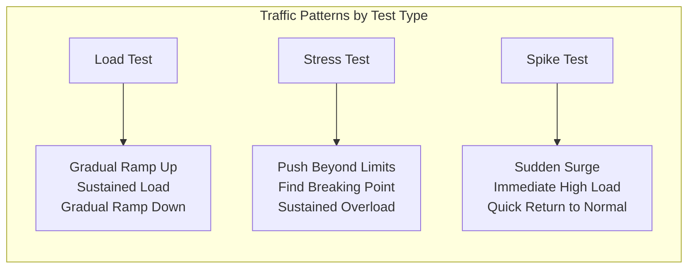
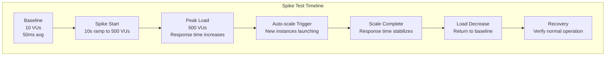

# How to Create Spike Testing

Author: [nawazdhandala](https://github.com/nawazdhandala)

Tags: Testing, Performance, DevOps, Reliability, Load Testing, SRE

Description: Learn how to design and implement spike tests that simulate sudden traffic surges to validate your system's resilience and auto-scaling capabilities.

---

Your application handles normal traffic smoothly. Dashboards are green, response times are stable, and users are happy. Then Black Friday hits. Or a viral tweet sends thousands of users to your site in seconds. Or a major news outlet links to your landing page. Suddenly, traffic spikes 10x and your system buckles under the load.

Spike testing is the practice of validating how your system handles sudden, dramatic increases in load. Unlike gradual load testing that slowly ramps up users, spike testing throws a wall of traffic at your application to see if it survives. This guide walks through creating effective spike tests that reveal breaking points before real traffic does.

## Understanding Spike Testing

Spike testing differs from other performance testing types in its sudden, aggressive nature. While load testing gradually increases traffic and stress testing pushes systems to sustained high loads, spike testing simulates the sharp traffic bursts that occur in real-world scenarios.



The goal is to answer critical questions:

- Does the application crash under sudden load?
- How long does it take for auto-scaling to kick in?
- Do circuit breakers activate correctly?
- What happens to response times during the spike?
- Does the system recover gracefully when the spike ends?

## When to Use Spike Testing

Spike testing is essential for applications that experience predictable or unpredictable traffic surges. Common scenarios include:

| Scenario | Traffic Pattern | What to Test |
|----------|-----------------|--------------|
| Flash sales | Spike at exact time | Order processing, inventory locks |
| Marketing campaigns | Spike when ads go live | Landing pages, signup flows |
| Product launches | Sustained spike for hours | Authentication, core features |
| Viral content | Unpredictable massive spike | CDN, database connections |
| Breaking news | Immediate 100x spike | Read-heavy endpoints |
| Game events | Scheduled spike | Matchmaking, leaderboards |

## Setting Up k6 for Spike Testing

k6 is an excellent tool for spike testing due to its flexible load profile configuration and straightforward scripting. Let us start with the basic setup.

First, install k6 and create the project structure:

```bash
# Install k6 on macOS
brew install k6

# Or on Linux
sudo apt-key adv --keyserver hkp://keyserver.ubuntu.com:80 --recv-keys C5AD17C747E3415A3642D57D77C6C491D6AC1D69
echo "deb https://dl.k6.io/deb stable main" | sudo tee /etc/apt/sources.list.d/k6.list
sudo apt-get update
sudo apt-get install k6

# Create project structure
mkdir spike-tests && cd spike-tests
mkdir -p scenarios scripts
```

## Creating Your First Spike Test

This script demonstrates a basic spike test that simulates a sudden traffic surge. The test starts with minimal load, spikes dramatically, then returns to normal to observe recovery behavior.

```javascript
// scenarios/basic-spike.js
// Basic spike test that simulates sudden traffic surge

import http from 'k6/http';
import { check, sleep } from 'k6';
import { Rate, Trend } from 'k6/metrics';

// Custom metrics to track spike-specific behavior
const errorRate = new Rate('errors');
const responseTime = new Trend('response_time');

export const options = {
  // Spike test stages: normal -> spike -> normal
  stages: [
    // Warm up phase: establish baseline with 10 users for 1 minute
    { duration: '1m', target: 10 },

    // Spike phase: jump to 200 users in just 10 seconds
    { duration: '10s', target: 200 },

    // Hold spike: maintain 200 users for 3 minutes to test sustained spike
    { duration: '3m', target: 200 },

    // Recovery phase: drop back to 10 users in 10 seconds
    { duration: '10s', target: 10 },

    // Cool down: observe recovery behavior for 2 minutes
    { duration: '2m', target: 10 },
  ],

  // Thresholds define pass/fail criteria
  thresholds: {
    // 95% of requests should complete under 2 seconds even during spike
    http_req_duration: ['p(95)<2000'],

    // Error rate should stay below 5%
    errors: ['rate<0.05'],

    // 99% of requests should complete under 5 seconds
    http_req_duration: ['p(99)<5000'],
  },
};

// Base URL of the application under test
const BASE_URL = __ENV.BASE_URL || 'https://api.example.com';

export default function () {
  // Simulate a typical user journey during the spike
  const endpoints = [
    { path: '/api/products', weight: 40 },
    { path: '/api/products/featured', weight: 30 },
    { path: '/api/cart', weight: 20 },
    { path: '/api/user/profile', weight: 10 },
  ];

  // Select endpoint based on weight distribution
  const random = Math.random() * 100;
  let cumulative = 0;
  let selectedPath = endpoints[0].path;

  for (const endpoint of endpoints) {
    cumulative += endpoint.weight;
    if (random <= cumulative) {
      selectedPath = endpoint.path;
      break;
    }
  }

  const response = http.get(`${BASE_URL}${selectedPath}`, {
    headers: {
      'Content-Type': 'application/json',
      'Accept': 'application/json',
    },
    // Set timeout to detect slow responses during spike
    timeout: '10s',
  });

  // Track custom metrics
  responseTime.add(response.timings.duration);
  errorRate.add(response.status >= 400);

  // Validate response
  const checkResult = check(response, {
    'status is 200': (r) => r.status === 200,
    'response time < 2000ms': (r) => r.timings.duration < 2000,
    'response has body': (r) => r.body && r.body.length > 0,
  });

  if (!checkResult) {
    console.log(`Failed request: ${selectedPath} - Status: ${response.status} - Time: ${response.timings.duration}ms`);
  }

  // Brief pause between requests (realistic user behavior)
  sleep(Math.random() * 2 + 0.5);
}
```

## Advanced Spike Test with Multiple Spikes

Real traffic patterns often include multiple spikes. This test simulates a scenario like a live event where traffic surges at key moments.

```javascript
// scenarios/multi-spike.js
// Simulates multiple traffic spikes during a live event

import http from 'k6/http';
import { check, sleep, group } from 'k6';
import { Counter, Rate, Trend } from 'k6/metrics';

// Metrics for detailed analysis
const spikeCounter = new Counter('spike_requests');
const normalCounter = new Counter('normal_requests');
const errorsDuringSpike = new Rate('errors_during_spike');
const recoveryTime = new Trend('recovery_time');

export const options = {
  scenarios: {
    // Scenario simulating event start spike
    event_start: {
      executor: 'ramping-vus',
      startVUs: 10,
      stages: [
        // Pre-event baseline
        { duration: '2m', target: 20 },
        // Event starts: first spike
        { duration: '5s', target: 300 },
        { duration: '2m', target: 300 },
        // Settle after initial rush
        { duration: '30s', target: 50 },
        { duration: '3m', target: 50 },
        // Halftime spike
        { duration: '5s', target: 400 },
        { duration: '1m', target: 400 },
        // Post-halftime settle
        { duration: '30s', target: 50 },
        { duration: '2m', target: 50 },
        // Final spike: event ends
        { duration: '5s', target: 500 },
        { duration: '2m', target: 500 },
        // Post-event cooldown
        { duration: '1m', target: 20 },
        { duration: '2m', target: 10 },
      ],
      gracefulRampDown: '30s',
    },
  },

  thresholds: {
    http_req_duration: ['p(95)<3000', 'p(99)<5000'],
    http_req_failed: ['rate<0.1'],
    errors_during_spike: ['rate<0.15'],
  },
};

const BASE_URL = __ENV.BASE_URL || 'https://api.example.com';

// Track whether we are currently in a spike phase
function isInSpike() {
  const vus = __VU;
  return vus > 100;
}

export default function () {
  const inSpike = isInSpike();

  group('API Requests', function () {
    // During spikes, users hammer specific endpoints
    if (inSpike) {
      spikeCounter.add(1);
      performSpikeTraffic();
    } else {
      normalCounter.add(1);
      performNormalTraffic();
    }
  });
}

// Traffic pattern during spike: focused on high-value actions
function performSpikeTraffic() {
  const responses = http.batch([
    ['GET', `${BASE_URL}/api/live/scores`],
    ['GET', `${BASE_URL}/api/live/commentary`],
    ['POST', `${BASE_URL}/api/interactions/reaction`, JSON.stringify({ type: 'cheer' })],
  ]);

  responses.forEach((response, index) => {
    const passed = check(response, {
      'spike request succeeded': (r) => r.status < 400,
    });

    errorsDuringSpike.add(!passed);
  });

  sleep(0.5);
}

// Normal traffic pattern: browsing behavior
function performNormalTraffic() {
  const response = http.get(`${BASE_URL}/api/content/latest`);

  check(response, {
    'normal request succeeded': (r) => r.status === 200,
  });

  sleep(Math.random() * 3 + 1);
}
```

## Testing Auto-Scaling Behavior

This test specifically validates that auto-scaling triggers correctly and handles traffic before instances become overwhelmed.

```javascript
// scenarios/autoscale-validation.js
// Tests auto-scaling response to traffic spikes

import http from 'k6/http';
import { check, sleep } from 'k6';
import { Trend, Counter, Gauge } from 'k6/metrics';

// Metrics to correlate with infrastructure scaling
const responseTimeByPhase = new Trend('response_time_by_phase');
const requestsInFlight = new Gauge('requests_in_flight');
const scalingLagRequests = new Counter('requests_before_scale');

export const options = {
  scenarios: {
    // Aggressive spike to trigger auto-scaling
    trigger_scale: {
      executor: 'ramping-arrival-rate',
      startRate: 10,
      timeUnit: '1s',
      preAllocatedVUs: 500,
      maxVUs: 1000,
      stages: [
        // Baseline: 10 requests per second
        { duration: '1m', target: 10 },
        // Spike: jump to 500 requests per second
        { duration: '10s', target: 500 },
        // Hold: maintain for auto-scaling to kick in (typically 2-5 minutes)
        { duration: '5m', target: 500 },
        // Scale down test
        { duration: '30s', target: 10 },
        // Observe scale-down behavior
        { duration: '5m', target: 10 },
      ],
    },
  },

  thresholds: {
    // Allow higher latency during scaling but set upper bounds
    http_req_duration: ['p(95)<5000', 'p(99)<10000'],
    http_req_failed: ['rate<0.1'],
  },
};

const BASE_URL = __ENV.BASE_URL || 'https://api.example.com';

// Track the current phase based on iteration timing
let testStartTime = null;

export function setup() {
  return { startTime: Date.now() };
}

export default function (data) {
  const elapsedSeconds = (Date.now() - data.startTime) / 1000;

  // Determine current phase for metrics tagging
  let phase;
  if (elapsedSeconds < 60) {
    phase = 'baseline';
  } else if (elapsedSeconds < 70) {
    phase = 'spike_ramp';
  } else if (elapsedSeconds < 370) {
    phase = 'spike_sustained';
  } else {
    phase = 'cooldown';
  }

  requestsInFlight.add(1);

  const response = http.get(`${BASE_URL}/api/health/deep`, {
    headers: {
      'X-Test-Phase': phase,
      'X-Test-Timestamp': Date.now().toString(),
    },
    timeout: '30s',
  });

  requestsInFlight.add(-1);

  // Record response time tagged by phase
  responseTimeByPhase.add(response.timings.duration, { phase: phase });

  // Track requests during the critical scaling window
  if (phase === 'spike_ramp' || (phase === 'spike_sustained' && elapsedSeconds < 130)) {
    scalingLagRequests.add(1);
  }

  check(response, {
    'status is healthy': (r) => r.status === 200,
    'response time acceptable': (r) => r.timings.duration < 5000,
  });

  // Log concerning responses for investigation
  if (response.timings.duration > 3000) {
    console.log(`Slow response in ${phase}: ${response.timings.duration}ms`);
  }
}
```

## Creating Realistic Spike Scenarios

Real spikes often have specific patterns. This configuration file defines reusable spike profiles based on common scenarios.

```javascript
// scenarios/spike-profiles.js
// Reusable spike profiles for different scenarios

export const spikeProfiles = {
  // Flash sale: instant spike, sustained for sale duration
  flashSale: {
    stages: [
      { duration: '30s', target: 50 },    // Pre-sale browsing
      { duration: '1s', target: 1000 },   // Sale starts
      { duration: '15m', target: 1000 },  // Sale duration
      { duration: '5m', target: 200 },    // Post-sale decline
      { duration: '5m', target: 50 },     // Return to normal
    ],
    thresholds: {
      http_req_duration: ['p(95)<3000'],
      http_req_failed: ['rate<0.01'],      // Very low tolerance for errors
    },
  },

  // Viral content: exponential growth, slow decay
  viralContent: {
    stages: [
      { duration: '1m', target: 10 },
      { duration: '30s', target: 50 },
      { duration: '30s', target: 200 },
      { duration: '30s', target: 500 },
      { duration: '30s', target: 1000 },
      { duration: '5m', target: 1000 },
      { duration: '2m', target: 800 },
      { duration: '2m', target: 500 },
      { duration: '2m', target: 200 },
      { duration: '2m', target: 50 },
    ],
    thresholds: {
      http_req_duration: ['p(95)<5000'],
      http_req_failed: ['rate<0.05'],
    },
  },

  // Breaking news: instant massive spike, quick decline
  breakingNews: {
    stages: [
      { duration: '10s', target: 20 },
      { duration: '5s', target: 2000 },   // News breaks
      { duration: '2m', target: 2000 },
      { duration: '1m', target: 1500 },
      { duration: '1m', target: 1000 },
      { duration: '2m', target: 500 },
      { duration: '5m', target: 100 },
    ],
    thresholds: {
      http_req_duration: ['p(95)<10000'], // Higher tolerance
      http_req_failed: ['rate<0.2'],       // Some failures acceptable
    },
  },

  // Scheduled event: predictable spike at known time
  scheduledEvent: {
    stages: [
      { duration: '5m', target: 100 },    // Pre-event gathering
      { duration: '1m', target: 200 },    // Anticipation builds
      { duration: '10s', target: 800 },   // Event starts
      { duration: '30m', target: 800 },   // Event duration
      { duration: '10s', target: 1200 },  // Key moment spike
      { duration: '5m', target: 1200 },
      { duration: '10s', target: 800 },   // Return to steady state
      { duration: '20m', target: 800 },
      { duration: '5m', target: 100 },    // Event ends
    ],
    thresholds: {
      http_req_duration: ['p(95)<2000'],
      http_req_failed: ['rate<0.02'],
    },
  },
};

// Helper function to apply a spike profile
export function applySpikeProfile(profileName) {
  const profile = spikeProfiles[profileName];
  if (!profile) {
    throw new Error(`Unknown spike profile: ${profileName}`);
  }
  return profile;
}
```

## Measuring Recovery Time

Understanding how quickly your system recovers after a spike is crucial. This test focuses specifically on measuring recovery metrics.

```javascript
// scenarios/recovery-test.js
// Measures system recovery time after traffic spikes

import http from 'k6/http';
import { check, sleep } from 'k6';
import { Trend, Rate } from 'k6/metrics';

const preSpikLatency = new Trend('pre_spike_latency');
const duringSpikLatency = new Trend('during_spike_latency');
const postSpikeLatency = new Trend('post_spike_latency');
const recoveryRate = new Rate('recovered_to_baseline');

export const options = {
  scenarios: {
    recovery_test: {
      executor: 'ramping-vus',
      stages: [
        // Establish baseline
        { duration: '2m', target: 20 },
        // Spike
        { duration: '5s', target: 300 },
        { duration: '2m', target: 300 },
        // Drop to baseline
        { duration: '5s', target: 20 },
        // Extended recovery observation
        { duration: '5m', target: 20 },
      ],
    },
  },
};

const BASE_URL = __ENV.BASE_URL || 'https://api.example.com';
let baselineLatency = null;
let testStartTime = null;

export function setup() {
  // Measure baseline latency before test
  const warmupResponses = [];
  for (let i = 0; i < 10; i++) {
    const res = http.get(`${BASE_URL}/api/health`);
    warmupResponses.push(res.timings.duration);
    sleep(0.5);
  }

  const avgBaseline = warmupResponses.reduce((a, b) => a + b, 0) / warmupResponses.length;
  console.log(`Baseline latency established: ${avgBaseline.toFixed(2)}ms`);

  return {
    baselineLatency: avgBaseline,
    startTime: Date.now(),
  };
}

export default function (data) {
  const elapsed = (Date.now() - data.startTime) / 1000;

  const response = http.get(`${BASE_URL}/api/health`);
  const latency = response.timings.duration;

  // Categorize the measurement based on test phase
  if (elapsed < 120) {
    // Pre-spike phase (first 2 minutes)
    preSpikLatency.add(latency);
  } else if (elapsed < 245) {
    // During spike (2:00 to 4:05)
    duringSpikLatency.add(latency);
  } else {
    // Post-spike recovery phase
    postSpikeLatency.add(latency);

    // Check if we have recovered to within 20% of baseline
    const threshold = data.baselineLatency * 1.2;
    recoveryRate.add(latency <= threshold);

    if (latency > threshold && elapsed % 10 < 1) {
      console.log(`Recovery check at ${elapsed.toFixed(0)}s: ${latency.toFixed(0)}ms (baseline: ${data.baselineLatency.toFixed(0)}ms)`);
    }
  }

  check(response, {
    'request succeeded': (r) => r.status === 200,
  });

  sleep(1);
}

export function teardown(data) {
  console.log('\n=== Recovery Test Summary ===');
  console.log(`Baseline latency: ${data.baselineLatency.toFixed(2)}ms`);
  console.log('Check Grafana/k6 Cloud for detailed phase-by-phase latency analysis');
}
```

## Visualizing Spike Test Results

Understanding spike test results requires proper visualization. Here is how the traffic pattern and response times typically look during a spike test:



## CI/CD Integration

Integrate spike tests into your deployment pipeline to catch regressions before they reach production. This GitHub Actions workflow runs spike tests after deployment to staging.

```yaml
# .github/workflows/spike-test.yml
name: Spike Test

on:
  # Run after staging deployment
  workflow_run:
    workflows: ["Deploy to Staging"]
    types: [completed]

  # Allow manual trigger for ad-hoc testing
  workflow_dispatch:
    inputs:
      spike_profile:
        description: 'Spike profile to use'
        required: true
        default: 'flashSale'
        type: choice
        options:
          - flashSale
          - viralContent
          - breakingNews
          - scheduledEvent

env:
  K6_CLOUD_TOKEN: ${{ secrets.K6_CLOUD_TOKEN }}

jobs:
  spike-test:
    runs-on: ubuntu-latest
    if: ${{ github.event.workflow_run.conclusion == 'success' || github.event_name == 'workflow_dispatch' }}

    steps:
      - uses: actions/checkout@v4

      - name: Install k6
        run: |
          sudo gpg -k
          sudo gpg --no-default-keyring --keyring /usr/share/keyrings/k6-archive-keyring.gpg --keyserver hkp://keyserver.ubuntu.com:80 --recv-keys C5AD17C747E3415A3642D57D77C6C491D6AC1D69
          echo "deb [signed-by=/usr/share/keyrings/k6-archive-keyring.gpg] https://dl.k6.io/deb stable main" | sudo tee /etc/apt/sources.list.d/k6.list
          sudo apt-get update
          sudo apt-get install k6

      - name: Run spike test
        run: |
          k6 run \
            --out cloud \
            -e BASE_URL=${{ secrets.STAGING_URL }} \
            -e SPIKE_PROFILE=${{ github.event.inputs.spike_profile || 'flashSale' }} \
            scenarios/basic-spike.js

      - name: Upload results
        uses: actions/upload-artifact@v4
        if: always()
        with:
          name: spike-test-results
          path: |
            *.json
            *.html

      - name: Notify on failure
        if: failure()
        uses: slackapi/slack-github-action@v1
        with:
          payload: |
            {
              "text": "Spike test failed on staging",
              "blocks": [
                {
                  "type": "section",
                  "text": {
                    "type": "mrkdwn",
                    "text": "*Spike Test Failed*\nProfile: ${{ github.event.inputs.spike_profile || 'flashSale' }}\n<${{ github.server_url }}/${{ github.repository }}/actions/runs/${{ github.run_id }}|View Results>"
                  }
                }
              ]
            }
        env:
          SLACK_WEBHOOK_URL: ${{ secrets.SLACK_WEBHOOK }}
```

## Analyzing Results and Setting Baselines

After running spike tests, analyze the results to establish performance baselines and identify improvement areas.

| Metric | Baseline | During Spike | Recovery | Target |
|--------|----------|--------------|----------|--------|
| P50 Latency | 45ms | 180ms | 52ms | < 200ms |
| P95 Latency | 120ms | 850ms | 145ms | < 1000ms |
| P99 Latency | 280ms | 2100ms | 320ms | < 3000ms |
| Error Rate | 0.01% | 2.3% | 0.02% | < 5% |
| Throughput | 500 rps | 4800 rps | 520 rps | > 5000 rps |
| Recovery Time | N/A | N/A | 45 seconds | < 60 seconds |

Key indicators of a healthy spike response:

1. **Error rate stays below threshold** - Errors during spikes are expected, but they should remain within acceptable bounds
2. **Latency degrades gracefully** - Response times increase but do not spike exponentially
3. **Recovery is quick** - The system returns to baseline performance within minutes, not hours
4. **No cascading failures** - Dependent services do not fail due to the spike

## Common Pitfalls and Solutions

Several issues commonly arise when implementing spike tests. Here is how to address them:

**Connection pool exhaustion**: Database and HTTP client connection pools often become the bottleneck during spikes. Monitor pool utilization and configure appropriate limits.

**Queue backlog buildup**: Message queues can accumulate backlogs that persist long after the spike ends. Implement backpressure mechanisms and monitor queue depth.

**Cache stampede**: When caches expire during a spike, all requests hit the origin simultaneously. Use staggered expiration and request coalescing.

**DNS resolution delays**: High request rates can overwhelm DNS resolution. Use connection pooling and DNS caching.

**Garbage collection pauses**: JVM and other managed runtimes may experience long GC pauses under memory pressure. Monitor GC metrics during spike tests.

## Summary

Spike testing is essential for building systems that handle real-world traffic patterns. The key elements covered in this guide include:

1. **Understanding spike patterns** - Different scenarios require different spike profiles
2. **k6 configuration** - Using ramping-vus and ramping-arrival-rate executors for realistic spikes
3. **Custom metrics** - Tracking phase-specific metrics for detailed analysis
4. **Auto-scaling validation** - Ensuring infrastructure scales before degradation occurs
5. **Recovery measurement** - Verifying the system returns to baseline after spikes
6. **CI/CD integration** - Automating spike tests as part of the deployment pipeline

Start with basic spike tests that match your most likely traffic scenarios. As you gain confidence, add more aggressive profiles and longer sustained spikes. The goal is to discover breaking points in staging rather than production, giving you time to reinforce your system before the next viral moment or major event.

Regular spike testing, combined with proper observability, transforms traffic surges from emergencies into manageable events that your system handles automatically.
