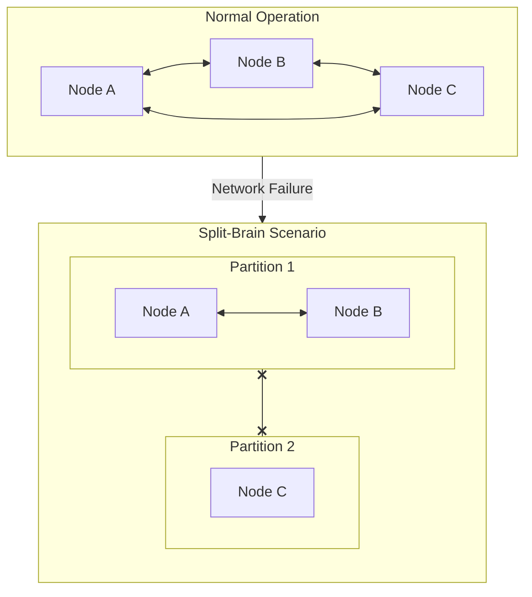
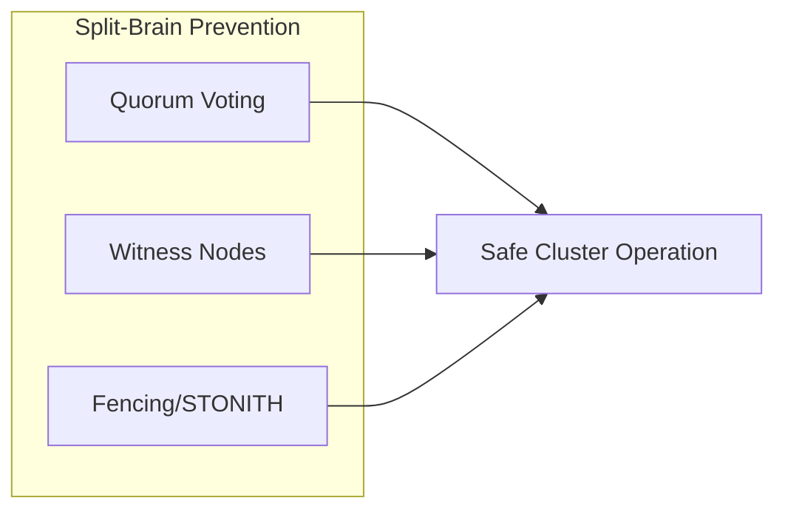
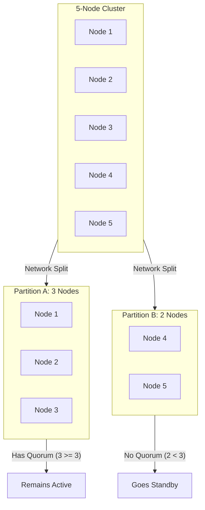
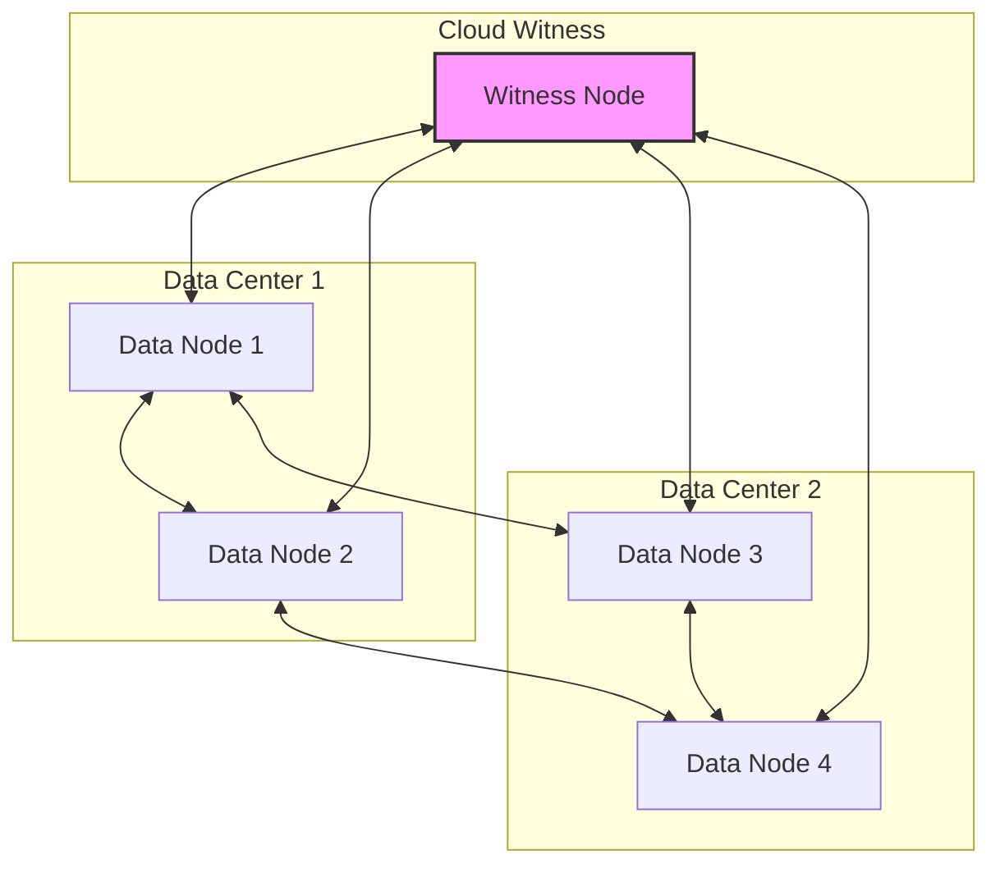
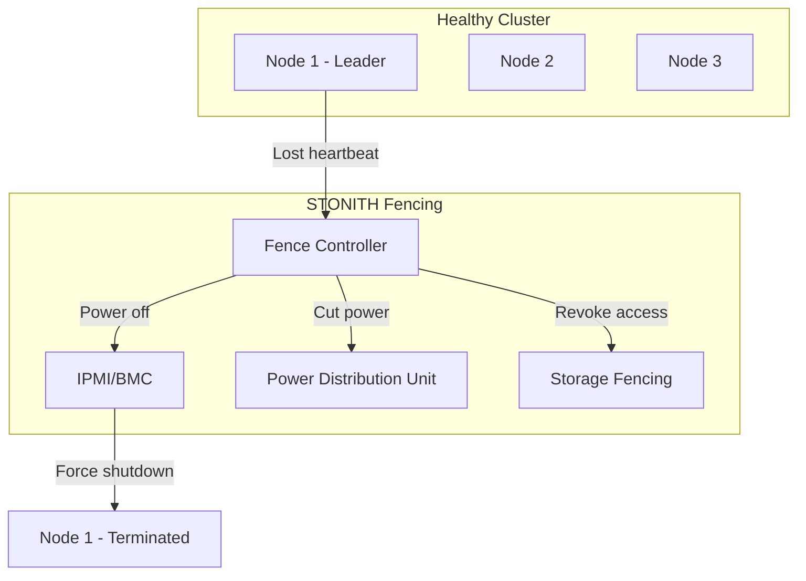
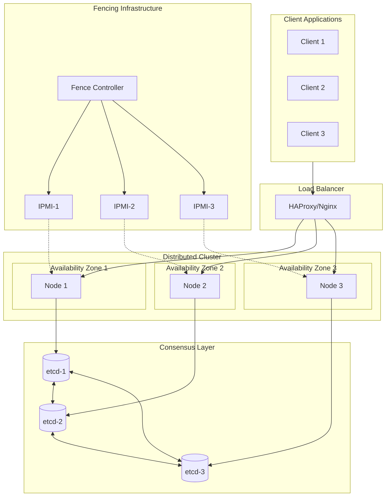

# How to Build Split-Brain Prevention

Author: [nawazdhandala](https://github.com/nawazdhandala)

Tags: High Availability, Distributed Systems, Clustering, SRE

Description: Learn how to prevent split-brain scenarios in clustered systems with quorum and fencing.

---

Split-brain is one of the most dangerous failures in distributed systems. It occurs when a cluster partitions into multiple segments, each believing it is the only active segment. Both partitions may process writes simultaneously, leading to data corruption, conflicts, and system inconsistency. Here is how to prevent it.

## Understanding Split-Brain



When network connectivity fails between cluster nodes, each partition may:

- Elect its own leader
- Accept write operations independently
- Modify the same data differently
- Create irreconcilable conflicts

## The Three Pillars of Split-Brain Prevention



### 1. Quorum-Based Voting

Quorum ensures that only a partition with a majority of nodes can operate. A cluster with N nodes requires (N/2) + 1 nodes to form a quorum.



### 2. Witness Nodes

Witness nodes (also called arbiters or tie-breakers) participate in quorum voting but do not store data. They are useful for:

- Even-numbered clusters
- Two-site deployments
- Reducing infrastructure costs

### 3. Fencing (STONITH)

STONITH (Shoot The Other Node In The Head) ensures that a node that loses quorum is forcibly stopped from accessing shared resources. Methods include:

- Power fencing (IPMI, iLO, DRAC)
- Storage fencing (SCSI reservations)
- Network fencing (disabling ports)

## Implementing Quorum with etcd

etcd uses the Raft consensus algorithm, which inherently provides quorum-based split-brain prevention.

### etcd Cluster Configuration

```yaml
# etcd-cluster.yaml
# Configuration for a 3-node etcd cluster with built-in quorum
apiVersion: v1
kind: ConfigMap
metadata:
  name: etcd-config
  namespace: kube-system
data:
  # etcd configuration file
  etcd.conf.yaml: |
    name: etcd-0
    data-dir: /var/lib/etcd

    # Listen on all interfaces for client requests
    listen-client-urls: https://0.0.0.0:2379

    # Listen for peer communication
    listen-peer-urls: https://0.0.0.0:2380

    # Advertise client URLs to the cluster
    advertise-client-urls: https://etcd-0.etcd:2379

    # Advertise peer URLs to other members
    initial-advertise-peer-urls: https://etcd-0.etcd:2380

    # Initial cluster configuration
    # All members must be listed for quorum calculation
    initial-cluster: >-
      etcd-0=https://etcd-0.etcd:2380,
      etcd-1=https://etcd-1.etcd:2380,
      etcd-2=https://etcd-2.etcd:2380

    # New cluster initialization
    initial-cluster-state: new
    initial-cluster-token: etcd-cluster-1

    # Security: Enable TLS for all communication
    client-transport-security:
      cert-file: /etc/etcd/pki/server.crt
      key-file: /etc/etcd/pki/server.key
      trusted-ca-file: /etc/etcd/pki/ca.crt
      client-cert-auth: true

    peer-transport-security:
      cert-file: /etc/etcd/pki/peer.crt
      key-file: /etc/etcd/pki/peer.key
      trusted-ca-file: /etc/etcd/pki/ca.crt
      client-cert-auth: true
```

### etcd Quorum Verification Script

```bash
#!/bin/bash
# check-etcd-quorum.sh
# Verifies etcd cluster quorum status and member health

set -e

# Configuration
ETCD_ENDPOINTS="https://etcd-0.etcd:2379,https://etcd-1.etcd:2379,https://etcd-2.etcd:2379"
ETCD_CACERT="/etc/etcd/pki/ca.crt"
ETCD_CERT="/etc/etcd/pki/client.crt"
ETCD_KEY="/etc/etcd/pki/client.key"

# Helper function to run etcdctl with proper authentication
etcdctl_cmd() {
    ETCDCTL_API=3 etcdctl \
        --endpoints="${ETCD_ENDPOINTS}" \
        --cacert="${ETCD_CACERT}" \
        --cert="${ETCD_CERT}" \
        --key="${ETCD_KEY}" \
        "$@"
}

echo "=== etcd Cluster Quorum Check ==="
echo ""

# Get member list and count
echo "1. Checking member list..."
MEMBERS=$(etcdctl_cmd member list --write-out=json)
TOTAL_MEMBERS=$(echo "$MEMBERS" | jq '.members | length')
echo "   Total members: ${TOTAL_MEMBERS}"

# Calculate required quorum
# Quorum = (N / 2) + 1, where N is total members
QUORUM_REQUIRED=$(( (TOTAL_MEMBERS / 2) + 1 ))
echo "   Quorum required: ${QUORUM_REQUIRED}"
echo ""

# Check endpoint health
echo "2. Checking endpoint health..."
HEALTHY_COUNT=0

# Parse member list and check each endpoint
for member in $(echo "$MEMBERS" | jq -r '.members[].clientURLs[0]'); do
    if etcdctl_cmd endpoint health --endpoints="${member}" 2>/dev/null | grep -q "is healthy"; then
        echo "   [HEALTHY] ${member}"
        HEALTHY_COUNT=$((HEALTHY_COUNT + 1))
    else
        echo "   [UNHEALTHY] ${member}"
    fi
done

echo ""
echo "   Healthy members: ${HEALTHY_COUNT}/${TOTAL_MEMBERS}"

# Determine quorum status
echo ""
echo "3. Quorum Status:"
if [ "${HEALTHY_COUNT}" -ge "${QUORUM_REQUIRED}" ]; then
    echo "   [OK] Cluster has quorum (${HEALTHY_COUNT} >= ${QUORUM_REQUIRED})"

    # Check who is the leader
    echo ""
    echo "4. Leader Information:"
    LEADER_INFO=$(etcdctl_cmd endpoint status --write-out=json | jq -r '.[] | select(.Status.leader == .Status.header.member_id)')
    LEADER_ENDPOINT=$(echo "$LEADER_INFO" | jq -r '.Endpoint')
    echo "   Current leader: ${LEADER_ENDPOINT}"
else
    echo "   [CRITICAL] Cluster has lost quorum (${HEALTHY_COUNT} < ${QUORUM_REQUIRED})"
    echo "   The cluster is now read-only and cannot accept writes!"
    exit 1
fi

echo ""
echo "=== Check Complete ==="
```

### etcd Client with Quorum-Aware Writes

```go
// etcd_quorum_client.go
// A Go client demonstrating quorum-aware operations with etcd

package main

import (
	"context"
	"fmt"
	"log"
	"time"

	clientv3 "go.etcd.io/etcd/client/v3"
)

// QuorumClient wraps etcd client with quorum awareness
type QuorumClient struct {
	client *clientv3.Client
	// Minimum number of endpoints that must be healthy
	minHealthyEndpoints int
}

// NewQuorumClient creates a new quorum-aware etcd client
func NewQuorumClient(endpoints []string) (*QuorumClient, error) {
	// Configure client with reasonable timeouts
	// These timeouts help detect network partitions quickly
	client, err := clientv3.New(clientv3.Config{
		Endpoints:   endpoints,
		DialTimeout: 5 * time.Second,
		// Auto-sync endpoints to discover cluster changes
		AutoSyncInterval: 30 * time.Second,
	})
	if err != nil {
		return nil, fmt.Errorf("failed to create etcd client: %w", err)
	}

	// Calculate minimum healthy endpoints for quorum
	// For a 3-node cluster, we need at least 2 healthy endpoints
	minHealthy := (len(endpoints) / 2) + 1

	return &QuorumClient{
		client:              client,
		minHealthyEndpoints: minHealthy,
	}, nil
}

// CheckQuorum verifies that the cluster has quorum before operations
func (qc *QuorumClient) CheckQuorum(ctx context.Context) error {
	// Get cluster member list
	memberResp, err := qc.client.MemberList(ctx)
	if err != nil {
		return fmt.Errorf("failed to list members: %w", err)
	}

	// Count healthy members by checking endpoint health
	healthyCount := 0
	for _, member := range memberResp.Members {
		// Skip members without client URLs (learners or unhealthy)
		if len(member.ClientURLs) == 0 {
			continue
		}

		// Create a temporary client to check this specific endpoint
		checkCtx, cancel := context.WithTimeout(ctx, 2*time.Second)
		_, err := qc.client.Status(checkCtx, member.ClientURLs[0])
		cancel()

		if err == nil {
			healthyCount++
		}
	}

	// Verify quorum
	requiredQuorum := (len(memberResp.Members) / 2) + 1
	if healthyCount < requiredQuorum {
		return fmt.Errorf(
			"cluster does not have quorum: %d healthy, %d required",
			healthyCount,
			requiredQuorum,
		)
	}

	log.Printf("Quorum check passed: %d/%d members healthy",
		healthyCount, len(memberResp.Members))
	return nil
}

// PutWithQuorumCheck writes a key-value pair only if quorum exists
func (qc *QuorumClient) PutWithQuorumCheck(ctx context.Context, key, value string) error {
	// First verify quorum exists
	if err := qc.CheckQuorum(ctx); err != nil {
		return fmt.Errorf("aborting write due to quorum check failure: %w", err)
	}

	// Perform the write operation
	// etcd's Raft consensus ensures the write is replicated to quorum
	_, err := qc.client.Put(ctx, key, value)
	if err != nil {
		return fmt.Errorf("failed to write key %s: %w", key, err)
	}

	log.Printf("Successfully wrote key: %s", key)
	return nil
}

// GetWithLinearizable reads with linearizable consistency
// This ensures we read the most recent committed value
func (qc *QuorumClient) GetWithLinearizable(ctx context.Context, key string) (string, error) {
	// Use serializable=false (default) for linearizable reads
	// This contacts the leader and ensures we get the latest value
	resp, err := qc.client.Get(ctx, key)
	if err != nil {
		return "", fmt.Errorf("failed to read key %s: %w", key, err)
	}

	if len(resp.Kvs) == 0 {
		return "", fmt.Errorf("key %s not found", key)
	}

	return string(resp.Kvs[0].Value), nil
}

func main() {
	// Connect to etcd cluster
	endpoints := []string{
		"https://etcd-0.etcd:2379",
		"https://etcd-1.etcd:2379",
		"https://etcd-2.etcd:2379",
	}

	client, err := NewQuorumClient(endpoints)
	if err != nil {
		log.Fatalf("Failed to create client: %v", err)
	}
	defer client.client.Close()

	ctx := context.Background()

	// Perform a quorum-checked write
	err = client.PutWithQuorumCheck(ctx, "/app/config/version", "1.0.0")
	if err != nil {
		log.Fatalf("Write failed: %v", err)
	}

	// Read with linearizable consistency
	value, err := client.GetWithLinearizable(ctx, "/app/config/version")
	if err != nil {
		log.Fatalf("Read failed: %v", err)
	}
	log.Printf("Read value: %s", value)
}
```

## Implementing Quorum with ZooKeeper

ZooKeeper uses the Zab (ZooKeeper Atomic Broadcast) protocol for consensus, providing strong split-brain protection.

### ZooKeeper Cluster Configuration

```properties
# zoo.cfg
# ZooKeeper configuration with quorum settings

# The basic time unit in milliseconds used by ZooKeeper
# All timeouts are multiples of this value
tickTime=2000

# The number of ticks that can pass between sending a request and getting an acknowledgement
# syncLimit * tickTime = max time for follower to sync with leader
syncLimit=5

# The number of ticks that the initial synchronization phase can take
# initLimit * tickTime = max time for followers to connect to leader
initLimit=10

# Directory where the snapshot is stored
dataDir=/var/lib/zookeeper

# Port for client connections
clientPort=2181

# Cluster member configuration
# Format: server.id=hostname:peer_port:election_port
# peer_port: Used for follower-to-leader communication
# election_port: Used for leader election
server.1=zk-0.zookeeper:2888:3888
server.2=zk-1.zookeeper:2888:3888
server.3=zk-2.zookeeper:2888:3888

# Enable admin server for monitoring
admin.enableServer=true
admin.serverPort=8080

# Limit the number of concurrent connections from a single IP
# Prevents connection exhaustion attacks
maxClientCnxns=60

# Autopurge settings to clean old snapshots
# Keeps the last 3 snapshots and corresponding transaction logs
autopurge.snapRetainCount=3
autopurge.purgeInterval=1
```

### ZooKeeper Leader Election with Quorum

```java
// ZooKeeperLeaderElection.java
// Implements leader election with split-brain protection using ZooKeeper

package com.example.splitbrain;

import org.apache.zookeeper.*;
import org.apache.zookeeper.data.Stat;
import java.io.IOException;
import java.util.Collections;
import java.util.List;
import java.util.concurrent.CountDownLatch;

public class ZooKeeperLeaderElection implements Watcher {

    // ZooKeeper connection string with all ensemble members
    private static final String ZK_CONNECT = "zk-0:2181,zk-1:2181,zk-2:2181";

    // Session timeout - if we lose connectivity longer than this,
    // our ephemeral nodes are deleted and we lose leadership
    private static final int SESSION_TIMEOUT = 10000;

    // Path for leader election
    private static final String ELECTION_PATH = "/election";

    private ZooKeeper zookeeper;
    private String currentNodePath;
    private String nodeId;
    private CountDownLatch connectedLatch = new CountDownLatch(1);

    // Callback interface for leadership changes
    public interface LeadershipCallback {
        void onLeadershipAcquired();
        void onLeadershipLost();
    }

    private LeadershipCallback callback;

    public ZooKeeperLeaderElection(String nodeId, LeadershipCallback callback)
            throws IOException, InterruptedException, KeeperException {
        this.nodeId = nodeId;
        this.callback = callback;

        // Connect to ZooKeeper ensemble
        // The client automatically handles failover between servers
        this.zookeeper = new ZooKeeper(ZK_CONNECT, SESSION_TIMEOUT, this);

        // Wait for connection to be established
        connectedLatch.await();

        // Ensure the election path exists
        createElectionPath();

        // Join the election
        joinElection();
    }

    @Override
    public void process(WatchedEvent event) {
        switch (event.getState()) {
            case SyncConnected:
                // Connected to ZooKeeper ensemble
                System.out.println("[" + nodeId + "] Connected to ZooKeeper");
                connectedLatch.countDown();
                break;

            case Disconnected:
                // Lost connection - might be temporary network issue
                // Our ephemeral node still exists if session is valid
                System.out.println("[" + nodeId + "] Disconnected from ZooKeeper");
                break;

            case Expired:
                // Session expired - we have lost leadership
                // This is the split-brain protection mechanism:
                // If we cannot communicate with quorum, our session expires
                // and our ephemeral nodes are deleted
                System.out.println("[" + nodeId + "] Session expired - lost leadership");
                callback.onLeadershipLost();
                break;
        }

        // Handle node deletion events (watched node deleted)
        if (event.getType() == Event.EventType.NodeDeleted) {
            // The node we were watching is gone, check if we are now leader
            try {
                checkLeadership();
            } catch (Exception e) {
                System.err.println("Error checking leadership: " + e.getMessage());
            }
        }
    }

    private void createElectionPath() throws KeeperException, InterruptedException {
        // Create the election parent path if it does not exist
        Stat stat = zookeeper.exists(ELECTION_PATH, false);
        if (stat == null) {
            try {
                zookeeper.create(
                    ELECTION_PATH,
                    new byte[0],
                    ZooDefs.Ids.OPEN_ACL_UNSAFE,
                    CreateMode.PERSISTENT
                );
            } catch (KeeperException.NodeExistsException e) {
                // Another node created it first - this is fine
            }
        }
    }

    private void joinElection() throws KeeperException, InterruptedException {
        // Create an ephemeral sequential node
        // EPHEMERAL: Node is deleted when session ends (split-brain protection)
        // SEQUENTIAL: ZooKeeper appends a monotonically increasing number
        String nodePath = ELECTION_PATH + "/node-" + nodeId + "-";

        currentNodePath = zookeeper.create(
            nodePath,
            nodeId.getBytes(),
            ZooDefs.Ids.OPEN_ACL_UNSAFE,
            CreateMode.EPHEMERAL_SEQUENTIAL
        );

        System.out.println("[" + nodeId + "] Created election node: " + currentNodePath);

        // Check if we are the leader
        checkLeadership();
    }

    private void checkLeadership() throws KeeperException, InterruptedException {
        // Get all children (election candidates)
        List<String> children = zookeeper.getChildren(ELECTION_PATH, false);

        // Sort to find the lowest sequence number
        Collections.sort(children);

        // Extract our node name from the full path
        String ourNodeName = currentNodePath.substring(ELECTION_PATH.length() + 1);

        // Check if we have the lowest sequence number (we are leader)
        if (children.get(0).equals(ourNodeName)) {
            System.out.println("[" + nodeId + "] I am the LEADER");
            callback.onLeadershipAcquired();
        } else {
            // We are not the leader
            // Watch the node just before us in the sequence
            // This creates a chain of watchers, reducing load on ZooKeeper
            int ourIndex = children.indexOf(ourNodeName);
            String nodeToWatch = children.get(ourIndex - 1);

            System.out.println("[" + nodeId + "] I am a FOLLOWER, watching: " + nodeToWatch);

            // Set a watch on the preceding node
            // If it is deleted (leader fails), we will be notified
            Stat stat = zookeeper.exists(
                ELECTION_PATH + "/" + nodeToWatch,
                this  // Use this object as the watcher
            );

            // If the node is already gone, check leadership again
            if (stat == null) {
                checkLeadership();
            }
        }
    }

    public void close() throws InterruptedException {
        if (zookeeper != null) {
            zookeeper.close();
        }
    }

    public static void main(String[] args) throws Exception {
        String nodeId = args.length > 0 ? args[0] : "node-1";

        ZooKeeperLeaderElection election = new ZooKeeperLeaderElection(
            nodeId,
            new LeadershipCallback() {
                @Override
                public void onLeadershipAcquired() {
                    System.out.println("Starting leader duties...");
                    // Start accepting writes, running scheduled tasks, etc.
                }

                @Override
                public void onLeadershipLost() {
                    System.out.println("Stopping leader duties...");
                    // Stop all leader activities immediately
                    // This is critical for split-brain prevention
                    System.exit(1);  // Force restart to ensure clean state
                }
            }
        );

        // Keep running
        Thread.currentThread().join();
    }
}
```

## Implementing Witness Nodes

Witness nodes are lightweight nodes that participate in quorum voting without storing data.



### etcd Witness Node Configuration

```yaml
# etcd-witness-statefulset.yaml
# Deploys a lightweight etcd witness (learner promoted to voter)
# The witness participates in quorum but stores minimal data

apiVersion: apps/v1
kind: StatefulSet
metadata:
  name: etcd-witness
  namespace: kube-system
spec:
  serviceName: etcd-witness
  replicas: 1
  selector:
    matchLabels:
      app: etcd-witness
  template:
    metadata:
      labels:
        app: etcd-witness
    spec:
      # Deploy witness in a different availability zone
      affinity:
        nodeAffinity:
          requiredDuringSchedulingIgnoredDuringExecution:
            nodeSelectorTerms:
              - matchExpressions:
                  - key: topology.kubernetes.io/zone
                    operator: In
                    values:
                      - us-east-1c  # Different zone from main cluster
      containers:
        - name: etcd
          image: quay.io/coreos/etcd:v3.5.9
          command:
            - etcd
            - --name=witness
            - --data-dir=/var/lib/etcd
            # Listen for client and peer connections
            - --listen-client-urls=https://0.0.0.0:2379
            - --listen-peer-urls=https://0.0.0.0:2380
            - --advertise-client-urls=https://etcd-witness-0.etcd-witness:2379
            - --initial-advertise-peer-urls=https://etcd-witness-0.etcd-witness:2380
            # Join existing cluster
            - --initial-cluster-state=existing
            # Minimal resource allocation - witness does not need much
            # It only participates in voting, not data storage
          resources:
            requests:
              cpu: 100m
              memory: 128Mi
            limits:
              cpu: 200m
              memory: 256Mi
          ports:
            - containerPort: 2379
              name: client
            - containerPort: 2380
              name: peer
          volumeMounts:
            - name: data
              mountPath: /var/lib/etcd
            - name: certs
              mountPath: /etc/etcd/pki
  volumeClaimTemplates:
    - metadata:
        name: data
      spec:
        accessModes: ["ReadWriteOnce"]
        # Small volume - witness stores minimal data
        resources:
          requests:
            storage: 1Gi
```

### Adding a Witness to Existing Cluster

```bash
#!/bin/bash
# add-etcd-witness.sh
# Adds a witness node to an existing etcd cluster

set -e

WITNESS_NAME="witness"
WITNESS_PEER_URL="https://etcd-witness-0.etcd-witness:2380"
WITNESS_CLIENT_URL="https://etcd-witness-0.etcd-witness:2379"

# etcd credentials
export ETCDCTL_API=3
export ETCDCTL_ENDPOINTS="https://etcd-0.etcd:2379"
export ETCDCTL_CACERT="/etc/etcd/pki/ca.crt"
export ETCDCTL_CERT="/etc/etcd/pki/client.crt"
export ETCDCTL_KEY="/etc/etcd/pki/client.key"

echo "=== Adding Witness Node to etcd Cluster ==="

# Step 1: Add the witness as a learner first
# Learners receive data but do not vote
# This allows the node to catch up before participating in quorum
echo "1. Adding witness as learner..."
etcdctl member add ${WITNESS_NAME} \
    --peer-urls="${WITNESS_PEER_URL}" \
    --learner

echo "   Waiting for learner to sync..."
sleep 30

# Step 2: Check learner status
echo "2. Checking learner status..."
MEMBER_ID=$(etcdctl member list | grep ${WITNESS_NAME} | cut -d',' -f1)
echo "   Witness member ID: ${MEMBER_ID}"

# Step 3: Promote learner to full voting member
# Now the witness will participate in quorum decisions
echo "3. Promoting learner to voting member..."
etcdctl member promote ${MEMBER_ID}

# Step 4: Verify cluster membership
echo "4. Verifying cluster membership..."
etcdctl member list --write-out=table

echo ""
echo "=== Witness Node Added Successfully ==="
echo "Cluster now has $(etcdctl member list | wc -l) members"
echo "Quorum requires $(( ($(etcdctl member list | wc -l) / 2) + 1 )) members"
```

## Implementing STONITH Fencing

STONITH ensures that a failed or partitioned node cannot cause split-brain by forcibly terminating it.



### Kubernetes Fencing with Node Drain

```yaml
# node-fence-controller.yaml
# A controller that implements fencing by cordoning and draining nodes
# that fail health checks

apiVersion: apps/v1
kind: Deployment
metadata:
  name: node-fence-controller
  namespace: kube-system
spec:
  replicas: 1
  selector:
    matchLabels:
      app: node-fence-controller
  template:
    metadata:
      labels:
        app: node-fence-controller
    spec:
      serviceAccountName: node-fence-controller
      containers:
        - name: controller
          image: node-fence-controller:latest
          env:
            # How long to wait before considering a node unhealthy
            - name: NODE_UNHEALTHY_THRESHOLD
              value: "60s"
            # How long to wait for graceful drain
            - name: DRAIN_TIMEOUT
              value: "120s"
            # Enable actual fencing (set to false for dry-run)
            - name: ENABLE_FENCING
              value: "true"
---
apiVersion: v1
kind: ServiceAccount
metadata:
  name: node-fence-controller
  namespace: kube-system
---
apiVersion: rbac.authorization.k8s.io/v1
kind: ClusterRole
metadata:
  name: node-fence-controller
rules:
  # Read node status
  - apiGroups: [""]
    resources: ["nodes"]
    verbs: ["get", "list", "watch"]
  # Cordon nodes (mark unschedulable)
  - apiGroups: [""]
    resources: ["nodes"]
    verbs: ["patch", "update"]
  # Evict pods during drain
  - apiGroups: [""]
    resources: ["pods/eviction"]
    verbs: ["create"]
  # Delete pods if eviction fails
  - apiGroups: [""]
    resources: ["pods"]
    verbs: ["get", "list", "delete"]
---
apiVersion: rbac.authorization.k8s.io/v1
kind: ClusterRoleBinding
metadata:
  name: node-fence-controller
roleRef:
  apiGroup: rbac.authorization.k8s.io
  kind: ClusterRole
  name: node-fence-controller
subjects:
  - kind: ServiceAccount
    name: node-fence-controller
    namespace: kube-system
```

### IPMI-Based STONITH Implementation

```python
# stonith_controller.py
# Implements hardware-level fencing using IPMI

import subprocess
import logging
import time
from dataclasses import dataclass
from typing import Optional
from enum import Enum

logging.basicConfig(level=logging.INFO)
logger = logging.getLogger(__name__)


class FenceAction(Enum):
    """Available fencing actions"""
    POWER_OFF = "off"           # Immediate power off
    POWER_CYCLE = "cycle"       # Power off then on
    POWER_RESET = "reset"       # Hardware reset
    STATUS = "status"           # Check power status


@dataclass
class BMCCredentials:
    """Baseboard Management Controller credentials"""
    host: str           # IPMI/iLO/DRAC IP address
    username: str       # BMC username
    password: str       # BMC password
    interface: str = "lanplus"  # IPMI interface type


class STONITHController:
    """
    STONITH (Shoot The Other Node In The Head) Controller

    Implements hardware-level fencing to prevent split-brain scenarios
    by forcibly powering off nodes that have lost quorum or become
    unresponsive.
    """

    def __init__(self, node_bmc_map: dict[str, BMCCredentials]):
        """
        Initialize the STONITH controller.

        Args:
            node_bmc_map: Mapping of node names to their BMC credentials
        """
        self.node_bmc_map = node_bmc_map

    def _run_ipmitool(
        self,
        creds: BMCCredentials,
        action: FenceAction
    ) -> tuple[bool, str]:
        """
        Execute an IPMI command against a node's BMC.

        Args:
            creds: BMC credentials for the target node
            action: The fencing action to perform

        Returns:
            Tuple of (success, output message)
        """
        cmd = [
            "ipmitool",
            "-I", creds.interface,
            "-H", creds.host,
            "-U", creds.username,
            "-P", creds.password,
            "chassis", "power", action.value
        ]

        try:
            result = subprocess.run(
                cmd,
                capture_output=True,
                text=True,
                timeout=30
            )

            if result.returncode == 0:
                return True, result.stdout.strip()
            else:
                return False, result.stderr.strip()

        except subprocess.TimeoutExpired:
            return False, "IPMI command timed out"
        except Exception as e:
            return False, str(e)

    def fence_node(
        self,
        node_name: str,
        action: FenceAction = FenceAction.POWER_OFF
    ) -> bool:
        """
        Fence a node by executing a power action via IPMI.

        This is the primary split-brain prevention mechanism.
        When a node is suspected of being partitioned or unhealthy,
        fencing ensures it cannot corrupt shared resources.

        Args:
            node_name: Name of the node to fence
            action: Fencing action to perform (default: power off)

        Returns:
            True if fencing was successful
        """
        if node_name not in self.node_bmc_map:
            logger.error(f"No BMC credentials found for node: {node_name}")
            return False

        creds = self.node_bmc_map[node_name]

        logger.warning(
            f"STONITH: Fencing node {node_name} "
            f"(BMC: {creds.host}, action: {action.value})"
        )

        # First, check current power status
        status_ok, status_msg = self._run_ipmitool(creds, FenceAction.STATUS)
        logger.info(f"Current power status for {node_name}: {status_msg}")

        # Execute the fence action
        success, message = self._run_ipmitool(creds, action)

        if success:
            logger.info(f"STONITH: Successfully fenced {node_name}: {message}")

            # Verify the fence action took effect
            time.sleep(5)
            verify_ok, verify_msg = self._run_ipmitool(creds, FenceAction.STATUS)

            if action == FenceAction.POWER_OFF and "off" in verify_msg.lower():
                logger.info(f"STONITH: Verified {node_name} is powered off")
                return True
            elif action in [FenceAction.POWER_CYCLE, FenceAction.POWER_RESET]:
                # For cycle/reset, node should be back on
                if "on" in verify_msg.lower():
                    logger.info(f"STONITH: Verified {node_name} power cycled")
                    return True
        else:
            logger.error(f"STONITH: Failed to fence {node_name}: {message}")

        return False

    def fence_with_escalation(self, node_name: str) -> bool:
        """
        Attempt to fence a node with escalating methods.

        Tries graceful methods first, then escalates to more aggressive
        fencing if needed.

        Args:
            node_name: Name of the node to fence

        Returns:
            True if any fencing method succeeded
        """
        # Escalation order: reset -> cycle -> off
        actions = [
            (FenceAction.POWER_RESET, "hardware reset"),
            (FenceAction.POWER_CYCLE, "power cycle"),
            (FenceAction.POWER_OFF, "power off"),
        ]

        for action, description in actions:
            logger.info(f"STONITH: Attempting {description} on {node_name}")

            if self.fence_node(node_name, action):
                return True

            logger.warning(
                f"STONITH: {description} failed for {node_name}, "
                "escalating..."
            )
            time.sleep(2)

        logger.critical(
            f"STONITH: All fencing methods failed for {node_name}! "
            "Manual intervention required!"
        )
        return False


def main():
    """Example usage of STONITH controller"""

    # Configure BMC credentials for each node
    # In production, these would come from a secure secrets store
    node_credentials = {
        "node-1": BMCCredentials(
            host="192.168.1.101",
            username="admin",
            password="secure-password"
        ),
        "node-2": BMCCredentials(
            host="192.168.1.102",
            username="admin",
            password="secure-password"
        ),
        "node-3": BMCCredentials(
            host="192.168.1.103",
            username="admin",
            password="secure-password"
        ),
    }

    stonith = STONITHController(node_credentials)

    # Example: Fence a node that has become unresponsive
    # This would typically be triggered by a cluster manager
    # when a node fails health checks or loses quorum
    stonith.fence_with_escalation("node-1")


if __name__ == "__main__":
    main()
```

## Complete Split-Brain Prevention Architecture



## Testing Split-Brain Prevention

```bash
#!/bin/bash
# test-split-brain.sh
# Tests split-brain prevention by simulating network partitions

set -e

echo "=== Split-Brain Prevention Test Suite ==="
echo ""

# Test 1: Simulate network partition using iptables
test_network_partition() {
    echo "Test 1: Network Partition Simulation"
    echo "-------------------------------------"

    # Block traffic between node-1 and node-2/node-3
    # This isolates node-1 from the rest of the cluster
    echo "Isolating node-1 from cluster..."

    # On node-1, block traffic to other nodes
    ssh node-1 "
        iptables -A INPUT -s node-2 -j DROP
        iptables -A INPUT -s node-3 -j DROP
        iptables -A OUTPUT -d node-2 -j DROP
        iptables -A OUTPUT -d node-3 -j DROP
    "

    echo "Waiting for partition to be detected (30s)..."
    sleep 30

    # Check cluster status from node-2 (should have quorum)
    echo "Checking cluster status from node-2 (majority partition):"
    ssh node-2 "etcdctl endpoint health --cluster"

    # Check cluster status from node-1 (should be isolated)
    echo "Checking cluster status from node-1 (minority partition):"
    ssh node-1 "etcdctl endpoint health" || echo "Expected: node-1 cannot reach quorum"

    # Verify writes only succeed on majority partition
    echo "Attempting write on majority partition (should succeed):"
    ssh node-2 "etcdctl put /test/key 'written-during-partition'" && echo "SUCCESS"

    echo "Attempting write on minority partition (should fail):"
    ssh node-1 "etcdctl put /test/key2 'should-fail'" && echo "UNEXPECTED SUCCESS" || echo "EXPECTED FAILURE"

    # Restore connectivity
    echo "Restoring network connectivity..."
    ssh node-1 "
        iptables -D INPUT -s node-2 -j DROP
        iptables -D INPUT -s node-3 -j DROP
        iptables -D OUTPUT -d node-2 -j DROP
        iptables -D OUTPUT -d node-3 -j DROP
    "

    echo "Test 1 Complete"
    echo ""
}

# Test 2: Verify fencing activates during split-brain
test_fencing_activation() {
    echo "Test 2: Fencing Activation"
    echo "--------------------------"

    # This test verifies that STONITH is triggered when
    # a node loses quorum and cannot be reached

    echo "Simulating node-1 becoming unresponsive..."

    # On node-1, pause the etcd process (simulates hang)
    ssh node-1 "pkill -STOP etcd"

    echo "Waiting for fence controller to detect failure (60s)..."
    sleep 60

    # Check if fencing was triggered
    echo "Checking fence controller logs:"
    kubectl logs -n kube-system -l app=fence-controller --tail=20

    # Verify node-1 was fenced (check IPMI power status)
    echo "Checking node-1 power status via IPMI:"
    ipmitool -H node-1-ipmi -U admin -P password chassis power status

    # Restore node-1 for further tests
    echo "Restoring node-1..."
    ipmitool -H node-1-ipmi -U admin -P password chassis power on

    echo "Test 2 Complete"
    echo ""
}

# Test 3: Witness node quorum contribution
test_witness_quorum() {
    echo "Test 3: Witness Node Quorum"
    echo "---------------------------"

    # With 2 data nodes + 1 witness = 3 total
    # Quorum requires 2 nodes

    echo "Current cluster membership:"
    etcdctl member list --write-out=table

    # Simulate loss of one data node
    echo "Stopping data node-2..."
    ssh node-2 "systemctl stop etcd"

    sleep 10

    # Cluster should still have quorum (node-1 + witness)
    echo "Checking if cluster maintains quorum:"
    etcdctl endpoint health --cluster

    echo "Attempting write (should succeed with witness):"
    etcdctl put /test/witness-quorum 'witness-enabled' && echo "SUCCESS: Witness maintains quorum"

    # Restart node-2
    echo "Restarting node-2..."
    ssh node-2 "systemctl start etcd"

    echo "Test 3 Complete"
    echo ""
}

# Run all tests
echo "Starting split-brain prevention tests..."
echo ""

test_network_partition
test_fencing_activation
test_witness_quorum

echo "=== All Tests Complete ==="
```

## Best Practices Summary

### Cluster Sizing

| Cluster Size | Quorum Required | Fault Tolerance |
|--------------|-----------------|-----------------|
| 1 node       | 1               | 0 failures      |
| 2 nodes      | 2               | 0 failures      |
| 3 nodes      | 2               | 1 failure       |
| 5 nodes      | 3               | 2 failures      |
| 7 nodes      | 4               | 3 failures      |

### Key Recommendations

1. **Always use odd-numbered clusters** to avoid tie situations
2. **Deploy across failure domains** (availability zones, racks, data centers)
3. **Implement proper fencing** to ensure failed nodes cannot cause corruption
4. **Use witness nodes** for two-site deployments
5. **Monitor cluster health** and alert on quorum degradation
6. **Test partition scenarios** regularly to verify protection works
7. **Set appropriate timeouts** to balance between fast failure detection and false positives

### What to Avoid

1. Never disable quorum checks for "convenience"
2. Never run production without fencing capability
3. Never ignore network reliability between cluster nodes
4. Never assume split-brain cannot happen to your system

---

Split-brain prevention is fundamental to reliable distributed systems. By combining quorum-based voting, witness nodes, and fencing mechanisms, you can build clusters that gracefully handle network partitions without data corruption. The key is defense in depth: multiple layers of protection ensure that even if one mechanism fails, others prevent catastrophic failure.
