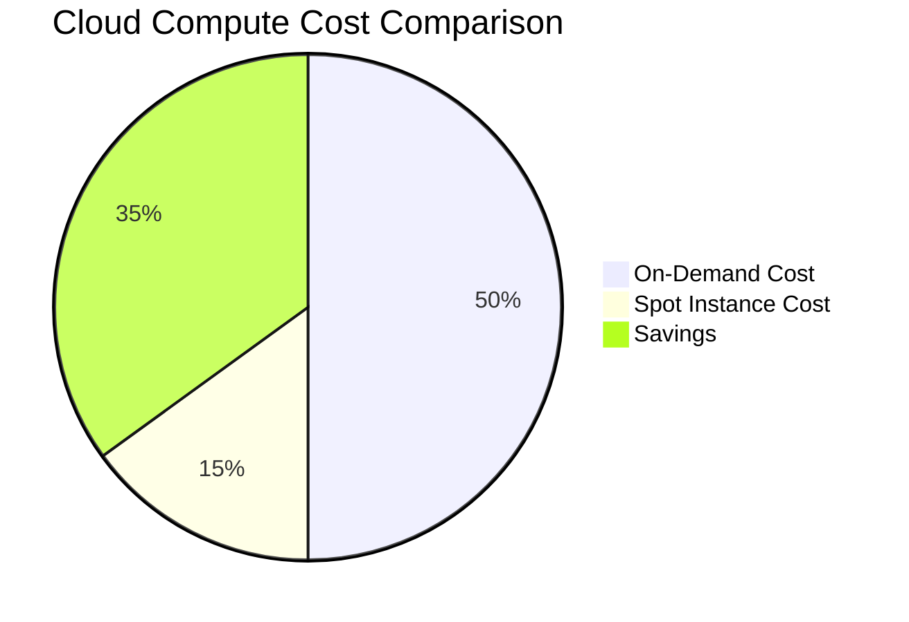
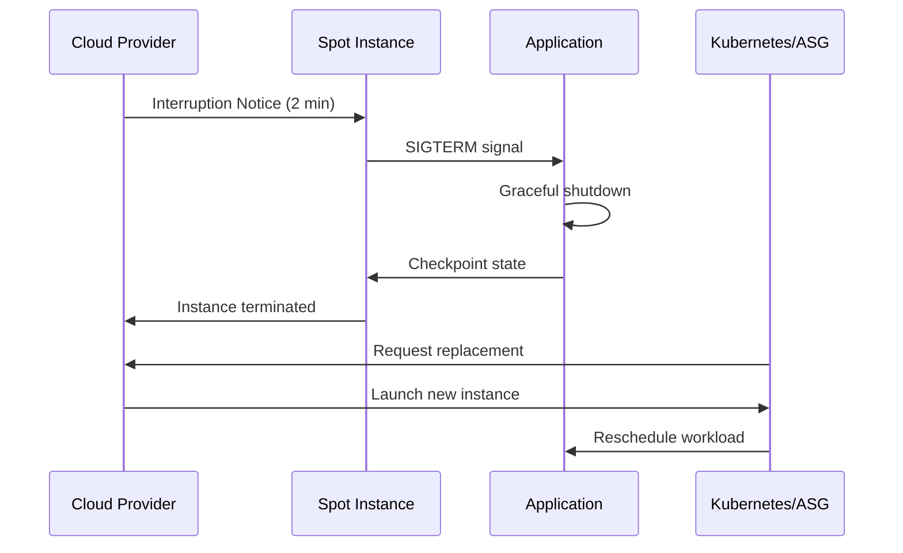
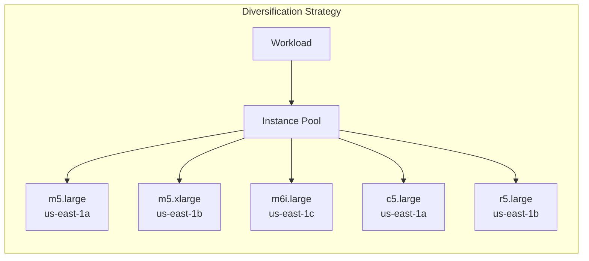
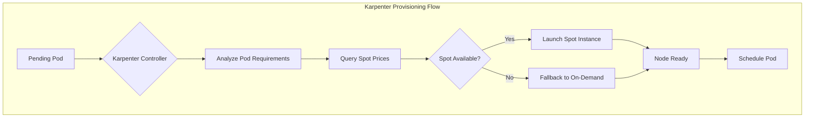
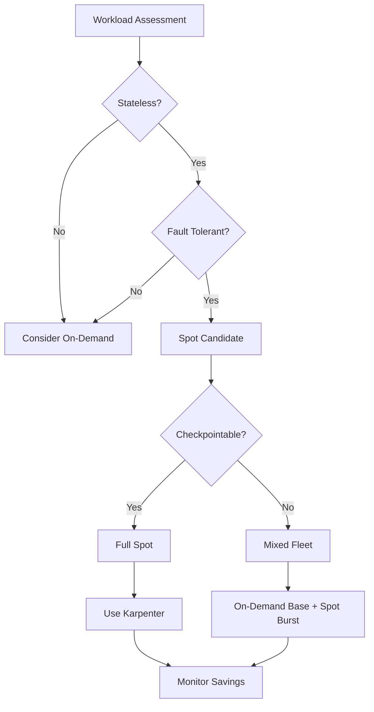

# How to Create Spot Instance Strategy

Author: [nawazdhandala](https://github.com/nawazdhandala)

Tags: FinOps, Cloud, Cost Optimization, AWS

Description: Learn how to leverage spot instances effectively for significant cost savings on fault-tolerant workloads.

---

Spot instances can slash your cloud compute bill by 60 to 90 percent. The catch? They can be reclaimed with as little as two minutes notice. A well-designed spot strategy turns this volatility into a competitive advantage by embracing interruption as a normal operating condition rather than an exception.

## Why Spot Instances Matter for Cost Optimization



Major cloud providers offer spare capacity at steep discounts:

| Provider | Spot Product | Typical Discount | Interruption Notice |
| --- | --- | --- | --- |
| AWS | EC2 Spot Instances | 60-90% | 2 minutes |
| GCP | Preemptible / Spot VMs | 60-91% | 30 seconds |
| Azure | Spot VMs | 60-90% | 30 seconds |

The economics are compelling, but only if your architecture can handle sudden terminations gracefully.

## Understanding Spot Interruption Lifecycle



When AWS needs capacity back, it sends a termination notice via the instance metadata service. Your application has roughly two minutes to:

1. Stop accepting new work
2. Complete or checkpoint in-flight tasks
3. Deregister from load balancers
4. Persist any critical state

## Diversification: The Foundation of Spot Reliability

Never depend on a single instance type or availability zone. Spot pricing and availability vary independently across instance families and zones.



### AWS EC2 Fleet with Diversification

This EC2 Fleet configuration spreads capacity across multiple instance types and availability zones. The `capacityOptimized` allocation strategy prioritizes pools with the deepest capacity, reducing interruption frequency.

```json
{
  "LaunchTemplateConfigs": [
    {
      "LaunchTemplateSpecification": {
        "LaunchTemplateId": "lt-0abc123def456",
        "Version": "$Latest"
      },
      "Overrides": [
        {
          "InstanceType": "m5.large",
          "SubnetId": "subnet-1a",
          "WeightedCapacity": 1
        },
        {
          "InstanceType": "m5.xlarge",
          "SubnetId": "subnet-1b",
          "WeightedCapacity": 2
        },
        {
          "InstanceType": "m6i.large",
          "SubnetId": "subnet-1c",
          "WeightedCapacity": 1
        },
        {
          "InstanceType": "c5.large",
          "SubnetId": "subnet-1a",
          "WeightedCapacity": 1
        },
        {
          "InstanceType": "r5.large",
          "SubnetId": "subnet-1b",
          "WeightedCapacity": 1
        }
      ]
    }
  ],
  "TargetCapacitySpecification": {
    "TotalTargetCapacity": 10,
    "OnDemandTargetCapacity": 2,
    "SpotTargetCapacity": 8,
    "DefaultTargetCapacityType": "spot"
  },
  "SpotOptions": {
    "AllocationStrategy": "capacityOptimized",
    "InstanceInterruptionBehavior": "terminate"
  }
}
```

## Handling Spot Interruptions in Your Application

### Polling the Metadata Service

This script polls the EC2 instance metadata endpoint for termination notices. When AWS schedules a termination, it responds with the termination time, giving your application time to shut down gracefully.

```bash
#!/bin/bash
# spot-interruption-handler.sh
# Polls EC2 metadata for spot termination notices

METADATA_URL="http://169.254.169.254/latest/meta-data/spot/termination-time"
CHECK_INTERVAL=5

while true; do
    # Query the termination-time endpoint
    # Returns 404 if no termination scheduled, or ISO timestamp if terminating
    HTTP_CODE=$(curl -s -o /tmp/termination-time -w "%{http_code}" $METADATA_URL)

    if [ "$HTTP_CODE" -eq 200 ]; then
        TERMINATION_TIME=$(cat /tmp/termination-time)
        echo "[$(date)] Spot interruption detected. Termination at: $TERMINATION_TIME"

        # Trigger graceful shutdown procedures
        # Stop accepting new connections
        /usr/local/bin/drain-connections.sh

        # Checkpoint any in-progress work
        /usr/local/bin/checkpoint-state.sh

        # Deregister from service discovery
        /usr/local/bin/deregister-service.sh

        # Signal application to terminate
        kill -SIGTERM $(cat /var/run/app.pid)

        exit 0
    fi

    sleep $CHECK_INTERVAL
done
```

### Node.js Graceful Shutdown Handler

This Node.js application listens for SIGTERM signals and implements a graceful shutdown sequence. It stops accepting new requests, waits for in-flight requests to complete, and then exits cleanly.

```javascript
// graceful-shutdown.js
// Handles spot interruption signals in a Node.js application

const express = require('express');
const app = express();

// Track active connections for graceful drain
let activeConnections = new Set();
let isShuttingDown = false;

// Middleware to track active requests
app.use((req, res, next) => {
    // Reject new requests during shutdown
    if (isShuttingDown) {
        res.status(503).json({ error: 'Service shutting down' });
        return;
    }

    // Track this connection
    activeConnections.add(req);
    res.on('finish', () => activeConnections.delete(req));
    next();
});

// Graceful shutdown handler
async function handleShutdown(signal) {
    console.log(`Received ${signal}, starting graceful shutdown...`);
    isShuttingDown = true;

    // Stop accepting new connections
    server.close(() => {
        console.log('HTTP server closed');
    });

    // Wait for active requests to complete (max 30 seconds)
    const shutdownTimeout = 30000;
    const startTime = Date.now();

    while (activeConnections.size > 0) {
        if (Date.now() - startTime > shutdownTimeout) {
            console.log(`Timeout: ${activeConnections.size} connections still active`);
            break;
        }
        console.log(`Waiting for ${activeConnections.size} active connections...`);
        await new Promise(resolve => setTimeout(resolve, 1000));
    }

    // Checkpoint application state
    await checkpointState();

    console.log('Graceful shutdown complete');
    process.exit(0);
}

// Checkpoint function to save application state
async function checkpointState() {
    // Save any in-memory state to persistent storage
    // This could be Redis, S3, or a database
    console.log('Checkpointing application state...');
    // await redis.set('app-state', JSON.stringify(appState));
}

// Register signal handlers
process.on('SIGTERM', () => handleShutdown('SIGTERM'));
process.on('SIGINT', () => handleShutdown('SIGINT'));

const server = app.listen(3000, () => {
    console.log('Server running on port 3000');
});
```

## Kubernetes Spot Instance Configuration

### Node Labels and Taints

Label and taint your spot nodes so workloads explicitly opt in to running on interruptible capacity. This prevents critical services from accidentally landing on spot nodes.

```yaml
# spot-node-labels.yaml
# Apply these labels and taints to spot instance node groups

apiVersion: v1
kind: Node
metadata:
  name: spot-node-example
  labels:
    # Identifies this node as running on spot capacity
    node.kubernetes.io/lifecycle: spot
    # Instance type for scheduling decisions
    node.kubernetes.io/instance-type: m5.large
    # Availability zone for topology spread
    topology.kubernetes.io/zone: us-east-1a
spec:
  taints:
    # Prevents pods without tolerations from scheduling here
    - key: "kubernetes.io/spot"
      value: "true"
      effect: "NoSchedule"
```

### Deployment with Spot Tolerations

This Deployment configures pods to run on spot instances. The toleration allows scheduling on tainted spot nodes, while the node selector ensures pods only land on spot capacity.

```yaml
# spot-tolerant-deployment.yaml
# Deployment configured to run on spot instances with proper handling

apiVersion: apps/v1
kind: Deployment
metadata:
  name: batch-processor
  namespace: workloads
spec:
  replicas: 5
  selector:
    matchLabels:
      app: batch-processor
  template:
    metadata:
      labels:
        app: batch-processor
    spec:
      # Tolerate the spot taint so pods can schedule on spot nodes
      tolerations:
        - key: "kubernetes.io/spot"
          operator: "Equal"
          value: "true"
          effect: "NoSchedule"

      # Only schedule on nodes labeled as spot instances
      nodeSelector:
        node.kubernetes.io/lifecycle: spot

      # Spread pods across zones to survive zone-wide interruptions
      topologySpreadConstraints:
        - maxSkew: 1
          topologyKey: topology.kubernetes.io/zone
          whenUnsatisfiable: ScheduleAnyway
          labelSelector:
            matchLabels:
              app: batch-processor

      # Allow 60 seconds for graceful shutdown on interruption
      terminationGracePeriodSeconds: 60

      containers:
        - name: processor
          image: myregistry/batch-processor:v1.2.0
          resources:
            requests:
              cpu: 500m
              memory: 512Mi
            limits:
              cpu: 1000m
              memory: 1Gi

          # Lifecycle hook for graceful shutdown
          lifecycle:
            preStop:
              exec:
                command:
                  - /bin/sh
                  - -c
                  - |
                    # Checkpoint current work before termination
                    /app/checkpoint.sh
                    # Allow time for checkpoint to complete
                    sleep 10
```

### Pod Disruption Budget for Spot Workloads

A PodDisruptionBudget ensures minimum availability during voluntary disruptions. For spot workloads, this helps maintain service during rolling replacements after interruptions.

```yaml
# spot-pdb.yaml
# Ensures minimum availability during spot interruptions

apiVersion: policy/v1
kind: PodDisruptionBudget
metadata:
  name: batch-processor-pdb
  namespace: workloads
spec:
  # Always keep at least 3 pods running
  minAvailable: 3
  selector:
    matchLabels:
      app: batch-processor
```

## Karpenter for Intelligent Spot Provisioning

Karpenter is a Kubernetes node autoscaler that provisions nodes in response to pending pods. It excels at spot instance management through intelligent instance type selection and automatic fallback.



### Karpenter NodePool for Spot Instances

This NodePool configures Karpenter to provision spot instances with automatic diversification. Karpenter selects instance types based on current spot pricing and availability.

```yaml
# karpenter-spot-nodepool.yaml
# Karpenter NodePool optimized for spot instances

apiVersion: karpenter.sh/v1
kind: NodePool
metadata:
  name: spot-workers
spec:
  # Weight for this NodePool (higher = preferred)
  weight: 100

  template:
    metadata:
      labels:
        node-type: spot
        managed-by: karpenter
    spec:
      # Use spot capacity type for cost optimization
      requirements:
        - key: karpenter.sh/capacity-type
          operator: In
          values: ["spot"]

        # Allow multiple instance families for diversification
        - key: node.kubernetes.io/instance-type
          operator: In
          values:
            - m5.large
            - m5.xlarge
            - m5.2xlarge
            - m6i.large
            - m6i.xlarge
            - c5.large
            - c5.xlarge
            - r5.large
            - r5.xlarge

        # Spread across availability zones
        - key: topology.kubernetes.io/zone
          operator: In
          values:
            - us-east-1a
            - us-east-1b
            - us-east-1c

        # Use amd64 architecture
        - key: kubernetes.io/arch
          operator: In
          values: ["amd64"]

      # Apply taint so only spot-tolerant workloads schedule here
      taints:
        - key: kubernetes.io/spot
          value: "true"
          effect: NoSchedule

      # Reference the EC2NodeClass for AWS-specific configuration
      nodeClassRef:
        group: karpenter.k8s.aws
        kind: EC2NodeClass
        name: spot-nodes

  # Limits for this NodePool
  limits:
    cpu: 1000
    memory: 2000Gi

  # Disruption settings for consolidation and expiration
  disruption:
    # Consolidate underutilized nodes
    consolidationPolicy: WhenEmptyOrUnderutilized
    consolidateAfter: 1m
    # Replace nodes after 24 hours to pick up new AMIs
    budgets:
      - nodes: "10%"
```

### EC2NodeClass for Spot Configuration

The EC2NodeClass defines AWS-specific settings for Karpenter nodes, including AMI selection, security groups, and instance profile.

```yaml
# karpenter-ec2nodeclass.yaml
# AWS-specific configuration for Karpenter spot nodes

apiVersion: karpenter.k8s.aws/v1
kind: EC2NodeClass
metadata:
  name: spot-nodes
spec:
  # Use latest EKS-optimized AMI
  amiSelectorTerms:
    - alias: al2023@latest

  # Subnet selection for node placement
  subnetSelectorTerms:
    - tags:
        karpenter.sh/discovery: my-cluster

  # Security groups for nodes
  securityGroupSelectorTerms:
    - tags:
        karpenter.sh/discovery: my-cluster

  # IAM instance profile for node permissions
  instanceProfile: KarpenterNodeInstanceProfile-my-cluster

  # Block device configuration
  blockDeviceMappings:
    - deviceName: /dev/xvda
      ebs:
        volumeSize: 100Gi
        volumeType: gp3
        iops: 3000
        throughput: 125
        encrypted: true
        deleteOnTermination: true

  # Metadata options for IMDSv2
  metadataOptions:
    httpEndpoint: enabled
    httpProtocolIPv6: disabled
    httpPutResponseHopLimit: 2
    httpTokens: required

  # User data for node initialization
  userData: |
    #!/bin/bash
    # Install spot interruption handler
    /usr/local/bin/install-interruption-handler.sh
```

## AWS Node Termination Handler

The AWS Node Termination Handler watches for spot interruption notices and cordons/drains nodes before termination. This ensures pods are gracefully rescheduled.

```yaml
# aws-node-termination-handler.yaml
# DaemonSet that handles spot interruption events

apiVersion: apps/v1
kind: DaemonSet
metadata:
  name: aws-node-termination-handler
  namespace: kube-system
spec:
  selector:
    matchLabels:
      app: aws-node-termination-handler
  template:
    metadata:
      labels:
        app: aws-node-termination-handler
    spec:
      # Run on all nodes including spot instances
      tolerations:
        - operator: Exists

      # Use host network to access metadata service
      hostNetwork: true

      serviceAccountName: aws-node-termination-handler

      containers:
        - name: handler
          image: public.ecr.aws/aws-ec2/aws-node-termination-handler:v1.22.0
          env:
            # Enable spot interruption handling
            - name: ENABLE_SPOT_INTERRUPTION_DRAINING
              value: "true"

            # Enable scheduled event handling
            - name: ENABLE_SCHEDULED_EVENT_DRAINING
              value: "true"

            # Cordon node on interruption
            - name: CORDON_ONLY
              value: "false"

            # Delete local data if needed
            - name: DELETE_LOCAL_DATA
              value: "true"

            # Grace period for pod termination
            - name: POD_TERMINATION_GRACE_PERIOD
              value: "30"

            # Taint node on interruption
            - name: TAINT_NODE
              value: "true"

            # Log level for debugging
            - name: LOG_LEVEL
              value: "info"

            # Node name from downward API
            - name: NODE_NAME
              valueFrom:
                fieldRef:
                  fieldPath: spec.nodeName

          resources:
            requests:
              cpu: 50m
              memory: 64Mi
            limits:
              cpu: 100m
              memory: 128Mi
```

## Spot Instance Strategy Decision Framework



## Mixed Fleet Strategy: On-Demand Base with Spot Burst

For production workloads, maintain a baseline of on-demand capacity and burst onto spot for cost savings. This ensures minimum availability even during widespread spot reclamation.

```yaml
# mixed-fleet-deployment.yaml
# Two deployments: on-demand base + spot burst capacity

---
# On-Demand base deployment - always available
apiVersion: apps/v1
kind: Deployment
metadata:
  name: api-server-base
  namespace: production
spec:
  replicas: 3  # Minimum capacity on reliable instances
  selector:
    matchLabels:
      app: api-server
      tier: base
  template:
    metadata:
      labels:
        app: api-server
        tier: base
    spec:
      # Schedule only on on-demand nodes
      nodeSelector:
        node.kubernetes.io/lifecycle: on-demand

      containers:
        - name: api
          image: myregistry/api-server:v2.1.0
          resources:
            requests:
              cpu: 500m
              memory: 512Mi
---
# Spot burst deployment - scales based on demand
apiVersion: apps/v1
kind: Deployment
metadata:
  name: api-server-spot
  namespace: production
spec:
  replicas: 7  # Additional capacity on spot instances
  selector:
    matchLabels:
      app: api-server
      tier: spot
  template:
    metadata:
      labels:
        app: api-server
        tier: spot
    spec:
      # Tolerate spot taint
      tolerations:
        - key: "kubernetes.io/spot"
          operator: "Equal"
          value: "true"
          effect: "NoSchedule"

      # Schedule on spot nodes
      nodeSelector:
        node.kubernetes.io/lifecycle: spot

      # Faster termination for spot instances
      terminationGracePeriodSeconds: 30

      containers:
        - name: api
          image: myregistry/api-server:v2.1.0
          resources:
            requests:
              cpu: 500m
              memory: 512Mi
---
# Single service routes to both deployments
apiVersion: v1
kind: Service
metadata:
  name: api-server
  namespace: production
spec:
  selector:
    app: api-server  # Matches both base and spot pods
  ports:
    - port: 80
      targetPort: 8080
```

## Monitoring and Observability for Spot Instances

Track spot instance metrics to validate your cost savings and identify optimization opportunities.

### Key Metrics to Monitor

| Metric | Description | Alert Threshold |
| --- | --- | --- |
| Spot Interruption Rate | Percentage of spot instances interrupted | > 10% per hour |
| Spot Savings | Cost reduction vs on-demand | < 50% (investigate) |
| Replacement Time | Time to provision replacement instance | > 5 minutes |
| Workload Availability | Service uptime during interruptions | < 99.9% |

### Prometheus Metrics for Spot Tracking

```yaml
# spot-metrics-configmap.yaml
# Prometheus rules for spot instance monitoring

apiVersion: v1
kind: ConfigMap
metadata:
  name: spot-prometheus-rules
  namespace: monitoring
data:
  spot-rules.yaml: |
    groups:
      - name: spot-instances
        interval: 30s
        rules:
          # Track spot node count
          - record: spot:node:count
            expr: count(kube_node_labels{label_node_kubernetes_io_lifecycle="spot"})

          # Track spot pod count
          - record: spot:pod:count
            expr: count(kube_pod_info * on(node) kube_node_labels{label_node_kubernetes_io_lifecycle="spot"})

          # Alert on high interruption rate
          - alert: HighSpotInterruptionRate
            expr: |
              rate(spot_interruptions_total[1h]) / spot:node:count > 0.1
            for: 10m
            labels:
              severity: warning
            annotations:
              summary: "High spot interruption rate detected"
              description: "Spot interruption rate is {{ $value | humanizePercentage }} over the last hour"

          # Alert if all spot capacity is lost
          - alert: NoSpotCapacity
            expr: spot:node:count == 0
            for: 5m
            labels:
              severity: critical
            annotations:
              summary: "No spot capacity available"
              description: "All spot nodes have been terminated"
```

## Best Practices Summary

1. **Diversify aggressively**: Use at least 10 instance types across 3 or more availability zones
2. **Implement graceful shutdown**: Handle SIGTERM within the 2-minute window
3. **Use capacity-optimized allocation**: Prioritize instance pools with deeper capacity
4. **Maintain on-demand baseline**: Keep 20-30% of capacity on reliable instances for critical workloads
5. **Deploy interruption handlers**: Use AWS Node Termination Handler or equivalent
6. **Checkpoint state**: Persist work progress to survive interruptions
7. **Monitor continuously**: Track interruption rates, savings, and replacement times
8. **Test regularly**: Simulate interruptions to validate your handling logic

## Conclusion

A well-executed spot instance strategy delivers massive cost savings without sacrificing reliability. The key is designing for failure from the start: diversify your instance pools, implement graceful shutdown handlers, use Karpenter for intelligent provisioning, and maintain visibility into your spot fleet health. Start with stateless, fault-tolerant workloads and expand your spot footprint as you gain confidence in your interruption handling capabilities.
