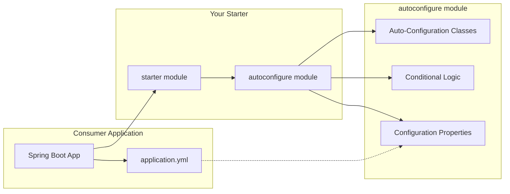

# How to Build Custom Spring Boot Starters

Author: [nawazdhandala](https://www.github.com/nawazdhandala)

Tags: Java, Spring Boot, Auto-Configuration, Starters, Enterprise

Description: Create reusable Spring Boot starters with auto-configuration, conditional beans, and custom properties for sharing common functionality across projects.

---

If you have worked with Spring Boot, you have already used starters. Dependencies like `spring-boot-starter-web` or `spring-boot-starter-data-jpa` bundle related libraries and auto-configuration so you can get up and running quickly. But what happens when your organization has common patterns that every service needs? Things like custom logging, security configurations, or shared client libraries?

Building your own starter lets you package these patterns once and reuse them across all your projects. This guide walks through creating a production-ready starter from scratch.

## Understanding Starter Architecture

A Spring Boot starter consists of two parts that work together:



The `autoconfigure` module contains all the configuration logic, while the `starter` module is a convenient wrapper that pulls in the autoconfigure module plus any required dependencies. This separation follows Spring Boot's own conventions.

## Project Setup

We will build a starter that provides a pre-configured HTTP client with retry logic, circuit breaker, and request logging. This is something most microservices need, making it a good candidate for a shared starter.

Create a multi-module Maven project with this structure:

```
my-http-client-starter/
├── pom.xml                              # Parent POM
├── my-http-client-spring-boot-autoconfigure/
│   └── pom.xml
└── my-http-client-spring-boot-starter/
    └── pom.xml
```

### Parent POM

The parent POM manages versions and builds both modules:

```xml
<?xml version="1.0" encoding="UTF-8"?>
<project xmlns="http://maven.apache.org/POM/4.0.0"
         xmlns:xsi="http://www.w3.org/2001/XMLSchema-instance"
         xsi:schemaLocation="http://maven.apache.org/POM/4.0.0
         http://maven.apache.org/xsd/maven-4.0.0.xsd">
    <modelVersion>4.0.0</modelVersion>

    <groupId>com.example</groupId>
    <artifactId>my-http-client-starter-parent</artifactId>
    <version>1.0.0</version>
    <packaging>pom</packaging>

    <modules>
        <module>my-http-client-spring-boot-autoconfigure</module>
        <module>my-http-client-spring-boot-starter</module>
    </modules>

    <properties>
        <java.version>17</java.version>
        <spring-boot.version>3.2.0</spring-boot.version>
    </properties>

    <dependencyManagement>
        <dependencies>
            <!-- Import Spring Boot BOM for version management -->
            <dependency>
                <groupId>org.springframework.boot</groupId>
                <artifactId>spring-boot-dependencies</artifactId>
                <version>${spring-boot.version}</version>
                <type>pom</type>
                <scope>import</scope>
            </dependency>
        </dependencies>
    </dependencyManagement>
</project>
```

### Autoconfigure Module POM

This module contains the actual auto-configuration code:

```xml
<?xml version="1.0" encoding="UTF-8"?>
<project xmlns="http://maven.apache.org/POM/4.0.0"
         xmlns:xsi="http://www.w3.org/2001/XMLSchema-instance"
         xsi:schemaLocation="http://maven.apache.org/POM/4.0.0
         http://maven.apache.org/xsd/maven-4.0.0.xsd">
    <modelVersion>4.0.0</modelVersion>

    <parent>
        <groupId>com.example</groupId>
        <artifactId>my-http-client-starter-parent</artifactId>
        <version>1.0.0</version>
    </parent>

    <artifactId>my-http-client-spring-boot-autoconfigure</artifactId>

    <dependencies>
        <!-- Spring Boot autoconfigure support -->
        <dependency>
            <groupId>org.springframework.boot</groupId>
            <artifactId>spring-boot-autoconfigure</artifactId>
        </dependency>

        <!-- For @ConfigurationProperties annotation processing -->
        <dependency>
            <groupId>org.springframework.boot</groupId>
            <artifactId>spring-boot-configuration-processor</artifactId>
            <optional>true</optional>
        </dependency>

        <!-- Mark as optional so consumers can exclude if they use WebClient -->
        <dependency>
            <groupId>org.springframework.boot</groupId>
            <artifactId>spring-boot-starter-web</artifactId>
            <optional>true</optional>
        </dependency>

        <!-- Resilience4j for retry and circuit breaker -->
        <dependency>
            <groupId>io.github.resilience4j</groupId>
            <artifactId>resilience4j-spring-boot3</artifactId>
            <version>2.2.0</version>
            <optional>true</optional>
        </dependency>
    </dependencies>
</project>
```

### Starter Module POM

The starter module is minimal and just pulls in dependencies:

```xml
<?xml version="1.0" encoding="UTF-8"?>
<project xmlns="http://maven.apache.org/POM/4.0.0"
         xmlns:xsi="http://www.w3.org/2001/XMLSchema-instance"
         xsi:schemaLocation="http://maven.apache.org/POM/4.0.0
         http://maven.apache.org/xsd/maven-4.0.0.xsd">
    <modelVersion>4.0.0</modelVersion>

    <parent>
        <groupId>com.example</groupId>
        <artifactId>my-http-client-starter-parent</artifactId>
        <version>1.0.0</version>
    </parent>

    <artifactId>my-http-client-spring-boot-starter</artifactId>

    <dependencies>
        <!-- Pull in the autoconfigure module -->
        <dependency>
            <groupId>com.example</groupId>
            <artifactId>my-http-client-spring-boot-autoconfigure</artifactId>
            <version>${project.version}</version>
        </dependency>

        <!-- Include runtime dependencies consumers will need -->
        <dependency>
            <groupId>org.springframework.boot</groupId>
            <artifactId>spring-boot-starter-web</artifactId>
        </dependency>
        <dependency>
            <groupId>io.github.resilience4j</groupId>
            <artifactId>resilience4j-spring-boot3</artifactId>
            <version>2.2.0</version>
        </dependency>
    </dependencies>
</project>
```

## Configuration Properties

Define type-safe configuration properties that consumers can customize:

```java
package com.example.httpclient.autoconfigure;

import org.springframework.boot.context.properties.ConfigurationProperties;

import java.time.Duration;

/**
 * Configuration properties for the HTTP client starter.
 * All properties are prefixed with "mycompany.http-client" in application.yml.
 */
@ConfigurationProperties(prefix = "mycompany.http-client")
public class HttpClientProperties {

    /**
     * Enable or disable the HTTP client auto-configuration.
     */
    private boolean enabled = true;

    /**
     * Connection timeout for establishing connections.
     */
    private Duration connectTimeout = Duration.ofSeconds(5);

    /**
     * Read timeout for waiting on response data.
     */
    private Duration readTimeout = Duration.ofSeconds(30);

    /**
     * Maximum number of retry attempts for failed requests.
     */
    private int maxRetryAttempts = 3;

    /**
     * Wait duration between retry attempts.
     */
    private Duration retryWaitDuration = Duration.ofMillis(500);

    /**
     * Enable request and response logging.
     */
    private boolean loggingEnabled = true;

    /**
     * Nested configuration for circuit breaker settings.
     */
    private CircuitBreakerConfig circuitBreaker = new CircuitBreakerConfig();

    // Getters and setters omitted for brevity

    public boolean isEnabled() {
        return enabled;
    }

    public void setEnabled(boolean enabled) {
        this.enabled = enabled;
    }

    public Duration getConnectTimeout() {
        return connectTimeout;
    }

    public void setConnectTimeout(Duration connectTimeout) {
        this.connectTimeout = connectTimeout;
    }

    public Duration getReadTimeout() {
        return readTimeout;
    }

    public void setReadTimeout(Duration readTimeout) {
        this.readTimeout = readTimeout;
    }

    public int getMaxRetryAttempts() {
        return maxRetryAttempts;
    }

    public void setMaxRetryAttempts(int maxRetryAttempts) {
        this.maxRetryAttempts = maxRetryAttempts;
    }

    public Duration getRetryWaitDuration() {
        return retryWaitDuration;
    }

    public void setRetryWaitDuration(Duration retryWaitDuration) {
        this.retryWaitDuration = retryWaitDuration;
    }

    public boolean isLoggingEnabled() {
        return loggingEnabled;
    }

    public void setLoggingEnabled(boolean loggingEnabled) {
        this.loggingEnabled = loggingEnabled;
    }

    public CircuitBreakerConfig getCircuitBreaker() {
        return circuitBreaker;
    }

    public void setCircuitBreaker(CircuitBreakerConfig circuitBreaker) {
        this.circuitBreaker = circuitBreaker;
    }

    /**
     * Nested class for circuit breaker configuration.
     */
    public static class CircuitBreakerConfig {
        private int failureRateThreshold = 50;
        private Duration waitDurationInOpenState = Duration.ofSeconds(60);
        private int slidingWindowSize = 10;

        public int getFailureRateThreshold() {
            return failureRateThreshold;
        }

        public void setFailureRateThreshold(int failureRateThreshold) {
            this.failureRateThreshold = failureRateThreshold;
        }

        public Duration getWaitDurationInOpenState() {
            return waitDurationInOpenState;
        }

        public void setWaitDurationInOpenState(Duration waitDurationInOpenState) {
            this.waitDurationInOpenState = waitDurationInOpenState;
        }

        public int getSlidingWindowSize() {
            return slidingWindowSize;
        }

        public void setSlidingWindowSize(int slidingWindowSize) {
            this.slidingWindowSize = slidingWindowSize;
        }
    }
}
```

## The HTTP Client Service

Create the service that consumers will inject:

```java
package com.example.httpclient;

import org.slf4j.Logger;
import org.slf4j.LoggerFactory;
import org.springframework.http.HttpEntity;
import org.springframework.http.HttpHeaders;
import org.springframework.http.HttpMethod;
import org.springframework.http.ResponseEntity;
import org.springframework.web.client.RestTemplate;

import java.util.Map;

/**
 * A pre-configured HTTP client with logging, retry, and circuit breaker support.
 * This client is automatically configured by the starter.
 */
public class ResilientHttpClient {

    private static final Logger log = LoggerFactory.getLogger(ResilientHttpClient.class);

    private final RestTemplate restTemplate;
    private final boolean loggingEnabled;

    public ResilientHttpClient(RestTemplate restTemplate, boolean loggingEnabled) {
        this.restTemplate = restTemplate;
        this.loggingEnabled = loggingEnabled;
    }

    /**
     * Performs a GET request and returns the response body.
     */
    public <T> T get(String url, Class<T> responseType) {
        return get(url, responseType, Map.of());
    }

    /**
     * Performs a GET request with custom headers.
     */
    public <T> T get(String url, Class<T> responseType, Map<String, String> headers) {
        logRequest("GET", url);

        HttpHeaders httpHeaders = new HttpHeaders();
        headers.forEach(httpHeaders::set);

        HttpEntity<Void> entity = new HttpEntity<>(httpHeaders);
        ResponseEntity<T> response = restTemplate.exchange(
            url, HttpMethod.GET, entity, responseType
        );

        logResponse(url, response);
        return response.getBody();
    }

    /**
     * Performs a POST request with a request body.
     */
    public <T, R> R post(String url, T body, Class<R> responseType) {
        return post(url, body, responseType, Map.of());
    }

    /**
     * Performs a POST request with custom headers.
     */
    public <T, R> R post(String url, T body, Class<R> responseType,
                         Map<String, String> headers) {
        logRequest("POST", url);

        HttpHeaders httpHeaders = new HttpHeaders();
        headers.forEach(httpHeaders::set);

        HttpEntity<T> entity = new HttpEntity<>(body, httpHeaders);
        ResponseEntity<R> response = restTemplate.exchange(
            url, HttpMethod.POST, entity, responseType
        );

        logResponse(url, response);
        return response.getBody();
    }

    private void logRequest(String method, String url) {
        if (loggingEnabled) {
            log.info("HTTP {} request to: {}", method, url);
        }
    }

    private void logResponse(String url, ResponseEntity<?> response) {
        if (loggingEnabled) {
            log.info("HTTP response from {} - status: {}",
                url, response.getStatusCode());
        }
    }
}
```

## Auto-Configuration Class

The auto-configuration class wires everything together using conditional annotations:

```java
package com.example.httpclient.autoconfigure;

import com.example.httpclient.ResilientHttpClient;
import io.github.resilience4j.circuitbreaker.CircuitBreaker;
import io.github.resilience4j.circuitbreaker.CircuitBreakerConfig;
import io.github.resilience4j.circuitbreaker.CircuitBreakerRegistry;
import org.springframework.boot.autoconfigure.AutoConfiguration;
import org.springframework.boot.autoconfigure.condition.ConditionalOnClass;
import org.springframework.boot.autoconfigure.condition.ConditionalOnMissingBean;
import org.springframework.boot.autoconfigure.condition.ConditionalOnProperty;
import org.springframework.boot.context.properties.EnableConfigurationProperties;
import org.springframework.boot.web.client.RestTemplateBuilder;
import org.springframework.context.annotation.Bean;
import org.springframework.web.client.RestTemplate;

/**
 * Auto-configuration for the resilient HTTP client.
 *
 * This configuration activates when:
 * 1. RestTemplate is on the classpath
 * 2. The property mycompany.http-client.enabled is true (or not set)
 * 3. No existing ResilientHttpClient bean is defined
 */
@AutoConfiguration
@ConditionalOnClass(RestTemplate.class)
@ConditionalOnProperty(
    prefix = "mycompany.http-client",
    name = "enabled",
    havingValue = "true",
    matchIfMissing = true  // Enabled by default if property is not set
)
@EnableConfigurationProperties(HttpClientProperties.class)
public class HttpClientAutoConfiguration {

    /**
     * Creates a configured RestTemplate with timeouts from properties.
     * Only creates this bean if the user has not defined their own.
     */
    @Bean
    @ConditionalOnMissingBean
    public RestTemplate httpClientRestTemplate(
            RestTemplateBuilder builder,
            HttpClientProperties properties) {

        return builder
            .setConnectTimeout(properties.getConnectTimeout())
            .setReadTimeout(properties.getReadTimeout())
            .build();
    }

    /**
     * Creates the circuit breaker registry with configured settings.
     */
    @Bean
    @ConditionalOnMissingBean
    @ConditionalOnClass(CircuitBreakerRegistry.class)
    public CircuitBreakerRegistry circuitBreakerRegistry(HttpClientProperties properties) {
        HttpClientProperties.CircuitBreakerConfig cbProps =
            properties.getCircuitBreaker();

        CircuitBreakerConfig config = CircuitBreakerConfig.custom()
            .failureRateThreshold(cbProps.getFailureRateThreshold())
            .waitDurationInOpenState(cbProps.getWaitDurationInOpenState())
            .slidingWindowSize(cbProps.getSlidingWindowSize())
            .build();

        return CircuitBreakerRegistry.of(config);
    }

    /**
     * Creates the main HTTP client bean that users will inject.
     */
    @Bean
    @ConditionalOnMissingBean
    public ResilientHttpClient resilientHttpClient(
            RestTemplate httpClientRestTemplate,
            HttpClientProperties properties) {

        return new ResilientHttpClient(
            httpClientRestTemplate,
            properties.isLoggingEnabled()
        );
    }
}
```

## Registering the Auto-Configuration

Spring Boot 3.x uses a file at `META-INF/spring/org.springframework.boot.autoconfigure.AutoConfiguration.imports` to discover auto-configuration classes:

```
com.example.httpclient.autoconfigure.HttpClientAutoConfiguration
```

Place this file in `src/main/resources/META-INF/spring/` of the autoconfigure module.

## Using the Starter

Consumers add a single dependency to their `pom.xml`:

```xml
<dependency>
    <groupId>com.example</groupId>
    <artifactId>my-http-client-spring-boot-starter</artifactId>
    <version>1.0.0</version>
</dependency>
```

Then inject and use the client:

```java
@Service
public class UserService {

    private final ResilientHttpClient httpClient;

    public UserService(ResilientHttpClient httpClient) {
        this.httpClient = httpClient;
    }

    public User getUser(String userId) {
        String url = "https://api.example.com/users/" + userId;
        return httpClient.get(url, User.class);
    }
}
```

Customize behavior through `application.yml`:

```yaml
mycompany:
  http-client:
    enabled: true
    connect-timeout: 10s
    read-timeout: 60s
    max-retry-attempts: 5
    logging-enabled: true
    circuit-breaker:
      failure-rate-threshold: 60
      wait-duration-in-open-state: 30s
      sliding-window-size: 20
```

## Conditional Bean Creation

Spring Boot provides several conditional annotations that control when beans are created:

| Annotation | When Bean is Created |
|------------|---------------------|
| `@ConditionalOnClass` | Specified class is on classpath |
| `@ConditionalOnMissingBean` | No existing bean of this type |
| `@ConditionalOnProperty` | Property has specified value |
| `@ConditionalOnMissingClass` | Specified class is not on classpath |
| `@ConditionalOnBean` | Specified bean already exists |

These conditionals let your starter adapt to what the consumer has available. If they bring their own `RestTemplate` bean, yours will not be created.

## Testing Your Starter

Write tests to verify the auto-configuration works correctly:

```java
@SpringBootTest
class HttpClientAutoConfigurationTest {

    @Autowired
    private ApplicationContext context;

    @Test
    void autoConfigurationCreatesResilientHttpClient() {
        // Verify the client bean was created
        assertThat(context.getBean(ResilientHttpClient.class)).isNotNull();
    }

    @Test
    void customPropertiesAreApplied() {
        HttpClientProperties properties = context.getBean(HttpClientProperties.class);

        // Verify defaults or test profile values
        assertThat(properties.isEnabled()).isTrue();
        assertThat(properties.getConnectTimeout()).isEqualTo(Duration.ofSeconds(5));
    }
}
```

## Summary

Building custom Spring Boot starters involves three main pieces: configuration properties for customization, auto-configuration classes with conditional logic, and the starter module that bundles everything together. This pattern lets you share common functionality across your organization while still allowing individual services to override defaults when needed.

Start small with your first starter. Pick something your team does repeatedly across services and package it up. As you get comfortable with the conditional annotations and property binding, you can create more sophisticated starters that adapt to different environments and use cases.
