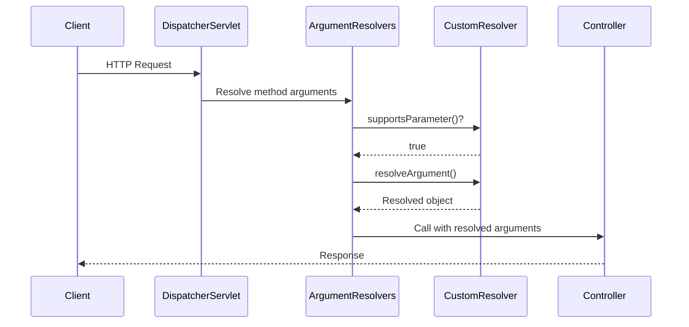
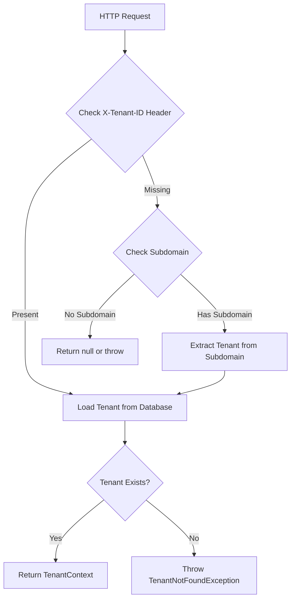
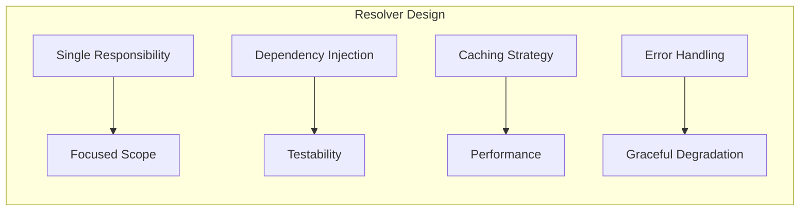

# How to Create Custom HandlerMethodArgumentResolver in Spring

Author: [nawazdhandala](https://github.com/nawazdhandala)

Tags: Spring, Java, Spring MVC, Web Development, Backend, REST API

Description: Learn how to create custom HandlerMethodArgumentResolver implementations in Spring to inject custom objects into controller methods, reducing boilerplate and centralizing cross-cutting concerns.

---

Spring MVC controllers often need access to information that does not come directly from request parameters. User authentication details, tenant context, pagination settings, or custom headers frequently appear as repeated patterns across multiple endpoints. Rather than duplicating this extraction logic in every controller method, you can create a custom `HandlerMethodArgumentResolver` to handle it once and inject the resolved object automatically.

## What is HandlerMethodArgumentResolver?

`HandlerMethodArgumentResolver` is a Spring interface that allows you to define how method arguments in controller handlers should be resolved. When Spring processes a request, it iterates through registered argument resolvers to find one that can handle each parameter type. If your resolver supports the parameter, Spring calls your resolution logic and passes the result to the controller method.



## The HandlerMethodArgumentResolver Interface

The interface defines two methods that you must implement.

```java
public interface HandlerMethodArgumentResolver {

    // Return true if this resolver handles the given parameter
    boolean supportsParameter(MethodParameter parameter);

    // Extract and return the argument value from the request
    Object resolveArgument(
        MethodParameter parameter,
        ModelAndViewContainer mavContainer,
        NativeWebRequest webRequest,
        WebDataBinderFactory binderFactory
    ) throws Exception;
}
```

## Building a Current User Resolver

A common use case is injecting the currently authenticated user into controller methods. Instead of calling `SecurityContextHolder` in every endpoint, we can create a resolver that does this automatically.

### Step 1: Define a Custom Annotation

Creating a custom annotation makes the intent clear and gives the resolver a marker to look for.

```java
package com.example.security;

import java.lang.annotation.ElementType;
import java.lang.annotation.Retention;
import java.lang.annotation.RetentionPolicy;
import java.lang.annotation.Target;

// This annotation marks controller parameters that should receive
// the currently authenticated user
@Target(ElementType.PARAMETER)
@Retention(RetentionPolicy.RUNTIME)
public @interface CurrentUser {
}
```

### Step 2: Create the User Model

This class represents the authenticated user data we want to inject.

```java
package com.example.security;

import java.util.Set;

// Immutable record holding essential user information for controllers
public record AuthenticatedUser(
    Long id,
    String username,
    String email,
    Set<String> roles
) {
    // Factory method to create from your domain user entity
    public static AuthenticatedUser from(User user) {
        return new AuthenticatedUser(
            user.getId(),
            user.getUsername(),
            user.getEmail(),
            user.getRoles().stream()
                .map(Role::getName)
                .collect(Collectors.toSet())
        );
    }

    public boolean hasRole(String role) {
        return roles.contains(role);
    }

    public boolean isAdmin() {
        return hasRole("ADMIN");
    }
}
```

### Step 3: Implement the Resolver

The resolver extracts the user from Spring Security's context and converts it to our model.

```java
package com.example.security;

import org.springframework.core.MethodParameter;
import org.springframework.security.core.Authentication;
import org.springframework.security.core.context.SecurityContextHolder;
import org.springframework.stereotype.Component;
import org.springframework.web.bind.support.WebDataBinderFactory;
import org.springframework.web.context.request.NativeWebRequest;
import org.springframework.web.method.support.HandlerMethodArgumentResolver;
import org.springframework.web.method.support.ModelAndViewContainer;

@Component
public class CurrentUserArgumentResolver implements HandlerMethodArgumentResolver {

    private final UserRepository userRepository;

    public CurrentUserArgumentResolver(UserRepository userRepository) {
        this.userRepository = userRepository;
    }

    // Check if this resolver should handle the parameter
    // We support parameters annotated with @CurrentUser that are of type AuthenticatedUser
    @Override
    public boolean supportsParameter(MethodParameter parameter) {
        return parameter.hasParameterAnnotation(CurrentUser.class)
            && AuthenticatedUser.class.isAssignableFrom(parameter.getParameterType());
    }

    // Extract the current user from the security context
    @Override
    public Object resolveArgument(
            MethodParameter parameter,
            ModelAndViewContainer mavContainer,
            NativeWebRequest webRequest,
            WebDataBinderFactory binderFactory) {

        Authentication authentication = SecurityContextHolder.getContext()
            .getAuthentication();

        // Return null for unauthenticated requests
        // The controller or security config should handle access control
        if (authentication == null || !authentication.isAuthenticated()) {
            return null;
        }

        // Get the username from the authentication principal
        String username = authentication.getName();

        // Load full user details from the database
        User user = userRepository.findByUsername(username)
            .orElseThrow(() -> new IllegalStateException(
                "Authenticated user not found in database: " + username
            ));

        return AuthenticatedUser.from(user);
    }
}
```

### Step 4: Register the Resolver

Register your custom resolver with Spring MVC through the WebMvcConfigurer interface.

```java
package com.example.config;

import com.example.security.CurrentUserArgumentResolver;
import org.springframework.context.annotation.Configuration;
import org.springframework.web.method.support.HandlerMethodArgumentResolver;
import org.springframework.web.servlet.config.annotation.WebMvcConfigurer;

import java.util.List;

@Configuration
public class WebMvcConfig implements WebMvcConfigurer {

    private final CurrentUserArgumentResolver currentUserArgumentResolver;

    public WebMvcConfig(CurrentUserArgumentResolver currentUserArgumentResolver) {
        this.currentUserArgumentResolver = currentUserArgumentResolver;
    }

    // Add our custom resolver to the list of argument resolvers
    // Custom resolvers are checked before the default ones
    @Override
    public void addArgumentResolvers(List<HandlerMethodArgumentResolver> resolvers) {
        resolvers.add(currentUserArgumentResolver);
    }
}
```

### Step 5: Use in Controllers

Now you can inject the current user into any controller method.

```java
package com.example.controller;

import com.example.security.AuthenticatedUser;
import com.example.security.CurrentUser;
import org.springframework.http.ResponseEntity;
import org.springframework.web.bind.annotation.*;

@RestController
@RequestMapping("/api/users")
public class UserController {

    private final UserService userService;

    public UserController(UserService userService) {
        this.userService = userService;
    }

    // The @CurrentUser parameter is automatically resolved
    // No need to manually extract from SecurityContextHolder
    @GetMapping("/me")
    public ResponseEntity<UserProfileResponse> getCurrentUser(
            @CurrentUser AuthenticatedUser user) {

        UserProfile profile = userService.getProfile(user.id());
        return ResponseEntity.ok(UserProfileResponse.from(profile));
    }

    // Combine with other parameters seamlessly
    @PutMapping("/me/settings")
    public ResponseEntity<Void> updateSettings(
            @CurrentUser AuthenticatedUser user,
            @RequestBody @Valid UserSettingsRequest request) {

        userService.updateSettings(user.id(), request);
        return ResponseEntity.ok().build();
    }

    // Use the resolved user for authorization checks
    @DeleteMapping("/{userId}")
    public ResponseEntity<Void> deleteUser(
            @CurrentUser AuthenticatedUser user,
            @PathVariable Long userId) {

        if (!user.isAdmin() && !user.id().equals(userId)) {
            return ResponseEntity.status(403).build();
        }

        userService.deleteUser(userId);
        return ResponseEntity.noContent().build();
    }
}
```

## Building a Pagination Resolver

Another common pattern is extracting pagination parameters from query strings. Let us build a resolver that provides type-safe pagination objects.

### The Pagination Model

```java
package com.example.pagination;

// Immutable pagination parameters with sensible defaults
public record PageRequest(
    int page,
    int size,
    String sortBy,
    SortDirection sortDirection
) {
    // Default values for pagination
    public static final int DEFAULT_PAGE = 0;
    public static final int DEFAULT_SIZE = 20;
    public static final int MAX_SIZE = 100;
    public static final String DEFAULT_SORT = "id";

    public enum SortDirection {
        ASC, DESC
    }

    // Factory method with validation
    public static PageRequest of(int page, int size, String sortBy, String direction) {
        // Ensure page is not negative
        int validPage = Math.max(0, page);

        // Ensure size is within bounds
        int validSize = Math.min(Math.max(1, size), MAX_SIZE);

        // Parse sort direction with fallback
        SortDirection sortDir = "desc".equalsIgnoreCase(direction)
            ? SortDirection.DESC
            : SortDirection.ASC;

        return new PageRequest(validPage, validSize, sortBy, sortDir);
    }

    // Convert to Spring Data Pageable
    public org.springframework.data.domain.Pageable toPageable() {
        Sort sort = sortDirection == SortDirection.DESC
            ? Sort.by(sortBy).descending()
            : Sort.by(sortBy).ascending();
        return org.springframework.data.domain.PageRequest.of(page, size, sort);
    }

    // Calculate offset for raw SQL queries
    public int offset() {
        return page * size;
    }
}
```

### The Pagination Annotation

```java
package com.example.pagination;

import java.lang.annotation.ElementType;
import java.lang.annotation.Retention;
import java.lang.annotation.RetentionPolicy;
import java.lang.annotation.Target;

// Marks parameters that should receive pagination settings from query params
@Target(ElementType.PARAMETER)
@Retention(RetentionPolicy.RUNTIME)
public @interface Paginated {
    // Default field to sort by
    String defaultSort() default "id";

    // Default page size
    int defaultSize() default 20;

    // Maximum allowed page size
    int maxSize() default 100;
}
```

### The Pagination Resolver

```java
package com.example.pagination;

import org.springframework.core.MethodParameter;
import org.springframework.stereotype.Component;
import org.springframework.web.bind.support.WebDataBinderFactory;
import org.springframework.web.context.request.NativeWebRequest;
import org.springframework.web.method.support.HandlerMethodArgumentResolver;
import org.springframework.web.method.support.ModelAndViewContainer;

@Component
public class PageRequestArgumentResolver implements HandlerMethodArgumentResolver {

    @Override
    public boolean supportsParameter(MethodParameter parameter) {
        // Support both annotation-based and type-based resolution
        return parameter.hasParameterAnnotation(Paginated.class)
            || PageRequest.class.isAssignableFrom(parameter.getParameterType());
    }

    @Override
    public Object resolveArgument(
            MethodParameter parameter,
            ModelAndViewContainer mavContainer,
            NativeWebRequest webRequest,
            WebDataBinderFactory binderFactory) {

        // Get annotation for custom defaults, or use class defaults
        Paginated annotation = parameter.getParameterAnnotation(Paginated.class);

        String defaultSort = annotation != null
            ? annotation.defaultSort()
            : PageRequest.DEFAULT_SORT;
        int defaultSize = annotation != null
            ? annotation.defaultSize()
            : PageRequest.DEFAULT_SIZE;
        int maxSize = annotation != null
            ? annotation.maxSize()
            : PageRequest.MAX_SIZE;

        // Extract parameters from the request
        int page = parseIntParam(webRequest, "page", PageRequest.DEFAULT_PAGE);
        int size = parseIntParam(webRequest, "size", defaultSize);
        String sortBy = webRequest.getParameter("sortBy");
        String sortDir = webRequest.getParameter("sortDir");

        // Apply maximum size limit
        size = Math.min(size, maxSize);

        // Use default sort if not specified
        if (sortBy == null || sortBy.isBlank()) {
            sortBy = defaultSort;
        }

        return PageRequest.of(page, size, sortBy, sortDir);
    }

    // Helper method to parse integer parameters with a default value
    private int parseIntParam(NativeWebRequest request, String name, int defaultValue) {
        String value = request.getParameter(name);
        if (value == null || value.isBlank()) {
            return defaultValue;
        }
        try {
            return Integer.parseInt(value);
        } catch (NumberFormatException e) {
            return defaultValue;
        }
    }
}
```

### Using the Pagination Resolver

```java
@RestController
@RequestMapping("/api/products")
public class ProductController {

    private final ProductRepository productRepository;

    public ProductController(ProductRepository productRepository) {
        this.productRepository = productRepository;
    }

    // PageRequest is automatically resolved from query parameters
    // GET /api/products?page=0&size=10&sortBy=name&sortDir=asc
    @GetMapping
    public ResponseEntity<PagedResponse<ProductDto>> listProducts(
            PageRequest pagination) {

        Page<Product> products = productRepository.findAll(pagination.toPageable());
        return ResponseEntity.ok(PagedResponse.from(products, ProductDto::from));
    }

    // Custom defaults for this specific endpoint
    @GetMapping("/featured")
    public ResponseEntity<PagedResponse<ProductDto>> listFeaturedProducts(
            @Paginated(defaultSort = "featuredRank", defaultSize = 10, maxSize = 50)
            PageRequest pagination) {

        Page<Product> products = productRepository.findFeatured(pagination.toPageable());
        return ResponseEntity.ok(PagedResponse.from(products, ProductDto::from));
    }
}
```

## Building a Tenant Context Resolver for Multi-tenant Applications

In multi-tenant SaaS applications, you often need to know which tenant the request belongs to. Here is a resolver that extracts tenant information from headers or subdomains.



### The Tenant Context Model

```java
package com.example.multitenancy;

// Holds tenant information for the current request
public record TenantContext(
    Long id,
    String identifier,
    String name,
    TenantPlan plan,
    Map<String, String> settings
) {
    public enum TenantPlan {
        FREE, STARTER, PROFESSIONAL, ENTERPRISE
    }

    public boolean hasFeature(String feature) {
        return switch (plan) {
            case ENTERPRISE -> true;
            case PROFESSIONAL -> !feature.equals("sso") || !feature.equals("audit-logs");
            case STARTER -> feature.equals("basic-reports");
            case FREE -> false;
        };
    }

    public int getMaxUsers() {
        return switch (plan) {
            case ENTERPRISE -> Integer.MAX_VALUE;
            case PROFESSIONAL -> 100;
            case STARTER -> 10;
            case FREE -> 3;
        };
    }
}
```

### The Tenant Resolver

```java
package com.example.multitenancy;

import jakarta.servlet.http.HttpServletRequest;
import org.springframework.core.MethodParameter;
import org.springframework.stereotype.Component;
import org.springframework.web.bind.support.WebDataBinderFactory;
import org.springframework.web.context.request.NativeWebRequest;
import org.springframework.web.method.support.HandlerMethodArgumentResolver;
import org.springframework.web.method.support.ModelAndViewContainer;

@Component
public class TenantContextArgumentResolver implements HandlerMethodArgumentResolver {

    private static final String TENANT_HEADER = "X-Tenant-ID";

    private final TenantRepository tenantRepository;
    private final TenantCache tenantCache;

    public TenantContextArgumentResolver(
            TenantRepository tenantRepository,
            TenantCache tenantCache) {
        this.tenantRepository = tenantRepository;
        this.tenantCache = tenantCache;
    }

    @Override
    public boolean supportsParameter(MethodParameter parameter) {
        return TenantContext.class.isAssignableFrom(parameter.getParameterType());
    }

    @Override
    public Object resolveArgument(
            MethodParameter parameter,
            ModelAndViewContainer mavContainer,
            NativeWebRequest webRequest,
            WebDataBinderFactory binderFactory) {

        // Try to get tenant identifier from header first
        String tenantIdentifier = webRequest.getHeader(TENANT_HEADER);

        // Fall back to subdomain extraction
        if (tenantIdentifier == null || tenantIdentifier.isBlank()) {
            tenantIdentifier = extractTenantFromSubdomain(webRequest);
        }

        // If still no tenant, check if the parameter is optional
        if (tenantIdentifier == null || tenantIdentifier.isBlank()) {
            if (isOptionalParameter(parameter)) {
                return null;
            }
            throw new TenantNotFoundException("No tenant identifier provided");
        }

        // Load from cache first, then database
        return tenantCache.get(tenantIdentifier)
            .orElseGet(() -> loadAndCacheTenant(tenantIdentifier));
    }

    // Extract tenant slug from subdomain (e.g., acme.example.com -> acme)
    private String extractTenantFromSubdomain(NativeWebRequest webRequest) {
        HttpServletRequest request = webRequest.getNativeRequest(HttpServletRequest.class);
        if (request == null) {
            return null;
        }

        String host = request.getServerName();

        // Skip localhost and IP addresses
        if (host.equals("localhost") || host.matches("\\d+\\.\\d+\\.\\d+\\.\\d+")) {
            return null;
        }

        // Extract subdomain (first part before the main domain)
        String[] parts = host.split("\\.");
        if (parts.length >= 3) {
            String subdomain = parts[0];
            // Skip common non-tenant subdomains
            if (!subdomain.equals("www") && !subdomain.equals("api")) {
                return subdomain;
            }
        }

        return null;
    }

    private TenantContext loadAndCacheTenant(String identifier) {
        Tenant tenant = tenantRepository.findByIdentifier(identifier)
            .orElseThrow(() -> new TenantNotFoundException(
                "Tenant not found: " + identifier
            ));

        TenantContext context = new TenantContext(
            tenant.getId(),
            tenant.getIdentifier(),
            tenant.getName(),
            tenant.getPlan(),
            tenant.getSettings()
        );

        tenantCache.put(identifier, context);
        return context;
    }

    // Check if the parameter allows null values
    private boolean isOptionalParameter(MethodParameter parameter) {
        return parameter.getParameterType().equals(Optional.class)
            || parameter.hasParameterAnnotation(Nullable.class);
    }
}
```

### Using the Tenant Resolver

```java
@RestController
@RequestMapping("/api/projects")
public class ProjectController {

    private final ProjectService projectService;

    public ProjectController(ProjectService projectService) {
        this.projectService = projectService;
    }

    // TenantContext is automatically resolved from header or subdomain
    @GetMapping
    public ResponseEntity<List<ProjectDto>> listProjects(
            TenantContext tenant,
            @CurrentUser AuthenticatedUser user) {

        List<Project> projects = projectService.findByTenant(tenant.id());
        return ResponseEntity.ok(
            projects.stream().map(ProjectDto::from).toList()
        );
    }

    // Feature gating based on tenant plan
    @PostMapping("/bulk-import")
    public ResponseEntity<ImportResult> bulkImport(
            TenantContext tenant,
            @RequestBody List<ProjectImportRequest> projects) {

        if (!tenant.hasFeature("bulk-import")) {
            return ResponseEntity.status(403)
                .body(ImportResult.featureNotAvailable());
        }

        ImportResult result = projectService.bulkImport(tenant.id(), projects);
        return ResponseEntity.ok(result);
    }
}
```

## Testing Custom Argument Resolvers

Testing resolvers in isolation ensures they work correctly before integration testing.

```java
package com.example.security;

import org.junit.jupiter.api.BeforeEach;
import org.junit.jupiter.api.Test;
import org.junit.jupiter.api.extension.ExtendWith;
import org.mockito.Mock;
import org.mockito.junit.jupiter.MockitoExtension;
import org.springframework.core.MethodParameter;
import org.springframework.security.authentication.UsernamePasswordAuthenticationToken;
import org.springframework.security.core.context.SecurityContextHolder;
import org.springframework.web.context.request.NativeWebRequest;

import java.lang.reflect.Method;
import java.util.Optional;
import java.util.Set;

import static org.assertj.core.api.Assertions.assertThat;
import static org.mockito.Mockito.when;

@ExtendWith(MockitoExtension.class)
class CurrentUserArgumentResolverTest {

    @Mock
    private UserRepository userRepository;

    @Mock
    private NativeWebRequest webRequest;

    private CurrentUserArgumentResolver resolver;

    @BeforeEach
    void setUp() {
        resolver = new CurrentUserArgumentResolver(userRepository);
        // Clear security context before each test
        SecurityContextHolder.clearContext();
    }

    @Test
    void supportsParameter_withCurrentUserAnnotation_returnsTrue() throws Exception {
        // Get the method parameter for a method with @CurrentUser
        MethodParameter parameter = getMethodParameter("methodWithCurrentUser", 0);

        assertThat(resolver.supportsParameter(parameter)).isTrue();
    }

    @Test
    void supportsParameter_withoutAnnotation_returnsFalse() throws Exception {
        MethodParameter parameter = getMethodParameter("methodWithoutAnnotation", 0);

        assertThat(resolver.supportsParameter(parameter)).isFalse();
    }

    @Test
    void resolveArgument_withAuthenticatedUser_returnsUser() throws Exception {
        // Set up authenticated user in security context
        SecurityContextHolder.getContext().setAuthentication(
            new UsernamePasswordAuthenticationToken("testuser", "password")
        );

        // Set up mock repository to return user
        User user = new User();
        user.setId(1L);
        user.setUsername("testuser");
        user.setEmail("test@example.com");
        user.setRoles(Set.of(new Role("USER")));

        when(userRepository.findByUsername("testuser"))
            .thenReturn(Optional.of(user));

        MethodParameter parameter = getMethodParameter("methodWithCurrentUser", 0);

        // Resolve the argument
        Object result = resolver.resolveArgument(parameter, null, webRequest, null);

        assertThat(result).isInstanceOf(AuthenticatedUser.class);
        AuthenticatedUser authenticatedUser = (AuthenticatedUser) result;
        assertThat(authenticatedUser.id()).isEqualTo(1L);
        assertThat(authenticatedUser.username()).isEqualTo("testuser");
        assertThat(authenticatedUser.roles()).contains("USER");
    }

    @Test
    void resolveArgument_withNoAuthentication_returnsNull() throws Exception {
        MethodParameter parameter = getMethodParameter("methodWithCurrentUser", 0);

        Object result = resolver.resolveArgument(parameter, null, webRequest, null);

        assertThat(result).isNull();
    }

    // Helper method to get MethodParameter from test methods
    private MethodParameter getMethodParameter(String methodName, int paramIndex)
            throws Exception {
        Method method = TestController.class.getMethod(methodName, AuthenticatedUser.class);
        return new MethodParameter(method, paramIndex);
    }

    // Test controller class with methods for parameter extraction
    static class TestController {
        public void methodWithCurrentUser(@CurrentUser AuthenticatedUser user) {}
        public void methodWithoutAnnotation(AuthenticatedUser user) {}
    }
}
```

### Integration Testing with MockMvc

```java
@SpringBootTest
@AutoConfigureMockMvc
class UserControllerIntegrationTest {

    @Autowired
    private MockMvc mockMvc;

    @Autowired
    private UserRepository userRepository;

    @Test
    @WithMockUser(username = "testuser")
    void getCurrentUser_returnsUserProfile() throws Exception {
        // Set up test user in database
        User user = new User();
        user.setUsername("testuser");
        user.setEmail("test@example.com");
        userRepository.save(user);

        mockMvc.perform(get("/api/users/me"))
            .andExpect(status().isOk())
            .andExpect(jsonPath("$.username").value("testuser"))
            .andExpect(jsonPath("$.email").value("test@example.com"));
    }

    @Test
    void getCurrentUser_withoutAuth_returnsUnauthorized() throws Exception {
        mockMvc.perform(get("/api/users/me"))
            .andExpect(status().isUnauthorized());
    }
}
```

## Best Practices

**Keep resolvers focused.** Each resolver should handle one specific type of argument. Do not create a mega-resolver that handles multiple unrelated types.

**Use caching for database lookups.** If your resolver hits the database, cache the results to avoid repeated queries within the same request or across requests.

**Handle null cases gracefully.** Consider whether your resolved object can be null and how controllers should handle that case.

**Make resolvers testable.** Inject dependencies through the constructor rather than using static methods or field injection.

**Document the expected request format.** When your resolver expects specific headers or query parameters, document these requirements clearly.

**Consider thread safety.** Resolvers are singletons by default. Ensure any shared state is thread-safe or use request-scoped beans.



## Complete Configuration Example

Here is a complete WebMvcConfigurer that registers multiple custom resolvers.

```java
package com.example.config;

import com.example.multitenancy.TenantContextArgumentResolver;
import com.example.pagination.PageRequestArgumentResolver;
import com.example.security.CurrentUserArgumentResolver;
import org.springframework.context.annotation.Configuration;
import org.springframework.web.method.support.HandlerMethodArgumentResolver;
import org.springframework.web.servlet.config.annotation.WebMvcConfigurer;

import java.util.List;

@Configuration
public class WebMvcConfig implements WebMvcConfigurer {

    private final CurrentUserArgumentResolver currentUserResolver;
    private final TenantContextArgumentResolver tenantResolver;
    private final PageRequestArgumentResolver pageRequestResolver;

    public WebMvcConfig(
            CurrentUserArgumentResolver currentUserResolver,
            TenantContextArgumentResolver tenantResolver,
            PageRequestArgumentResolver pageRequestResolver) {
        this.currentUserResolver = currentUserResolver;
        this.tenantResolver = tenantResolver;
        this.pageRequestResolver = pageRequestResolver;
    }

    @Override
    public void addArgumentResolvers(List<HandlerMethodArgumentResolver> resolvers) {
        // Order matters: resolvers are checked in sequence
        // Put more specific resolvers before generic ones
        resolvers.add(currentUserResolver);
        resolvers.add(tenantResolver);
        resolvers.add(pageRequestResolver);
    }
}
```

## Summary

Custom `HandlerMethodArgumentResolver` implementations provide a clean way to inject complex objects into Spring MVC controllers. By extracting common patterns like user resolution, pagination, and tenant context into dedicated resolvers, you reduce code duplication and make your controllers more focused on business logic.

The key steps are:

1. Define a model class for the data you want to inject
2. Optionally create a custom annotation to mark parameters
3. Implement `HandlerMethodArgumentResolver` with `supportsParameter` and `resolveArgument`
4. Register the resolver in a `WebMvcConfigurer`
5. Use the new parameter type in controller methods

This pattern scales well as your application grows and makes testing easier by isolating the resolution logic from controller code.
