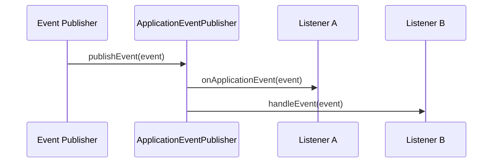

# How to Build Event Listeners in Spring

Author: [nawazdhandala](https://www.github.com/nawazdhandala)

Tags: Java, Spring, Events, Event-Driven, Enterprise

Description: Implement Spring application events with custom events, async listeners, transactional event listeners, and event publishing patterns.

---

> Event-driven architecture helps you build loosely coupled applications where components communicate through events rather than direct method calls. Spring's event system provides a clean way to implement this pattern within your application.

When you need to notify multiple components about something that happened without creating tight coupling between them, Spring events are your friend. Think of scenarios like sending a welcome email after user registration, updating search indexes after content changes, or logging audit trails. Events make these concerns easy to separate.

---

## How Spring Events Work

Spring's event mechanism follows the observer pattern. You have publishers that fire events and listeners that react to them. The ApplicationEventPublisher acts as the broker between them.



By default, events are synchronous. The publisher waits until all listeners finish processing before continuing. This matters for transaction boundaries, which we will cover later.

---

## Creating Custom Events

Start by defining your event class. Extend ApplicationEvent or just create a plain POJO (Spring 4.2+ supports both approaches).

Here is an event class that carries user registration data:

```java
// UserRegisteredEvent.java
// This event carries all the information listeners need about a new registration
public class UserRegisteredEvent {

    private final String userId;
    private final String email;
    private final String username;
    private final Instant registeredAt;

    // Constructor initializes all fields - events should be immutable
    public UserRegisteredEvent(String userId, String email, String username) {
        this.userId = userId;
        this.email = email;
        this.username = username;
        this.registeredAt = Instant.now();
    }

    // Getters only - no setters to maintain immutability
    public String getUserId() {
        return userId;
    }

    public String getEmail() {
        return email;
    }

    public String getUsername() {
        return username;
    }

    public Instant getRegisteredAt() {
        return registeredAt;
    }
}
```

Keep events immutable. Once published, they should not change. This prevents subtle bugs when multiple listeners process the same event.

---

## Publishing Events

Inject ApplicationEventPublisher into any Spring component to publish events. Here is a service that publishes an event after creating a user:

```java
// UserService.java
@Service
public class UserService {

    // Spring injects this automatically
    private final ApplicationEventPublisher eventPublisher;
    private final UserRepository userRepository;

    // Constructor injection - preferred over field injection
    public UserService(ApplicationEventPublisher eventPublisher,
                       UserRepository userRepository) {
        this.eventPublisher = eventPublisher;
        this.userRepository = userRepository;
    }

    @Transactional
    public User registerUser(String email, String username, String password) {
        // Create and save the user
        User user = new User(email, username, password);
        user = userRepository.save(user);

        // Publish event after successful save
        // Any registered listener will receive this event
        UserRegisteredEvent event = new UserRegisteredEvent(
            user.getId(),
            user.getEmail(),
            user.getUsername()
        );
        eventPublisher.publishEvent(event);

        return user;
    }
}
```

The event publishes synchronously within the same thread. If a listener throws an exception, it propagates back to the publisher.

---

## Creating Event Listeners

Spring offers two ways to create listeners: annotation-based and interface-based. The annotation approach is cleaner and more flexible.

### Annotation-Based Listeners

Use @EventListener on any method to make it react to events:

```java
// WelcomeEmailListener.java
@Component
public class WelcomeEmailListener {

    private final EmailService emailService;

    public WelcomeEmailListener(EmailService emailService) {
        this.emailService = emailService;
    }

    // This method runs whenever a UserRegisteredEvent is published
    // The parameter type determines which events this listener receives
    @EventListener
    public void sendWelcomeEmail(UserRegisteredEvent event) {
        emailService.sendWelcomeEmail(
            event.getEmail(),
            event.getUsername()
        );
    }
}
```

You can have multiple listeners for the same event type. Spring calls all of them.

### Conditional Listeners

Filter which events a listener handles using SpEL conditions:

```java
// AdminNotificationListener.java
@Component
public class AdminNotificationListener {

    private final NotificationService notificationService;

    public AdminNotificationListener(NotificationService notificationService) {
        this.notificationService = notificationService;
    }

    // Only process events where username starts with "admin"
    // The condition uses Spring Expression Language (SpEL)
    @EventListener(condition = "#event.username.startsWith('admin')")
    public void notifyAboutAdminRegistration(UserRegisteredEvent event) {
        notificationService.alertSecurityTeam(
            "New admin account created: " + event.getUsername()
        );
    }
}
```

The condition gives you fine-grained control without cluttering listener code with if statements.

---

## Async Event Listeners

Synchronous listeners block the publisher. For tasks like sending emails or updating analytics, async processing makes more sense.

Enable async support in your configuration first:

```java
// AsyncConfig.java
@Configuration
@EnableAsync
public class AsyncConfig {

    // Custom executor for event processing
    // Tune pool sizes based on your workload
    @Bean(name = "eventExecutor")
    public Executor eventExecutor() {
        ThreadPoolTaskExecutor executor = new ThreadPoolTaskExecutor();
        executor.setCorePoolSize(2);
        executor.setMaxPoolSize(10);
        executor.setQueueCapacity(100);
        executor.setThreadNamePrefix("event-");
        executor.initialize();
        return executor;
    }
}
```

Then annotate your listener with @Async:

```java
// AnalyticsListener.java
@Component
public class AnalyticsListener {

    private final AnalyticsService analyticsService;

    public AnalyticsListener(AnalyticsService analyticsService) {
        this.analyticsService = analyticsService;
    }

    // Runs in a separate thread from the eventExecutor pool
    // Publisher continues immediately without waiting
    @Async("eventExecutor")
    @EventListener
    public void trackRegistration(UserRegisteredEvent event) {
        analyticsService.trackEvent(
            "user_registered",
            Map.of(
                "user_id", event.getUserId(),
                "timestamp", event.getRegisteredAt().toString()
            )
        );
    }
}
```

Async listeners run in a separate thread. The publisher does not wait for them, and exceptions do not affect the publisher.

---

## Transactional Event Listeners

Sometimes you want listeners to run only after a transaction commits successfully. Or perhaps only when it rolls back. TransactionalEventListener handles these cases.

```java
// SearchIndexListener.java
@Component
public class SearchIndexListener {

    private final SearchIndexService searchIndexService;

    public SearchIndexListener(SearchIndexService searchIndexService) {
        this.searchIndexService = searchIndexService;
    }

    // Runs only AFTER the transaction commits successfully
    // If the transaction rolls back, this listener never executes
    @TransactionalEventListener(phase = TransactionPhase.AFTER_COMMIT)
    public void updateSearchIndex(UserRegisteredEvent event) {
        searchIndexService.indexUser(event.getUserId());
    }

    // Runs only if the transaction rolls back
    // Useful for cleanup or compensating actions
    @TransactionalEventListener(phase = TransactionPhase.AFTER_ROLLBACK)
    public void handleFailedRegistration(UserRegisteredEvent event) {
        // Log or alert about the failed registration
        log.warn("User registration rolled back for: {}", event.getEmail());
    }
}
```

The available phases are:

- BEFORE_COMMIT: Runs before the transaction commits
- AFTER_COMMIT: Runs after successful commit (default)
- AFTER_ROLLBACK: Runs after rollback
- AFTER_COMPLETION: Runs after commit or rollback

This is powerful for maintaining consistency with external systems that cannot participate in your database transaction.

---

## Event Listener Ordering

When multiple listeners handle the same event, you can control their execution order:

```java
// AuditListener.java
@Component
public class AuditListener {

    // Lower values run first
    // This audit listener runs before other listeners
    @Order(1)
    @EventListener
    public void auditRegistration(UserRegisteredEvent event) {
        // Always log before other processing happens
        auditLog.record("USER_REGISTERED", event.getUserId());
    }
}

// NotificationListener.java
@Component
public class NotificationListener {

    // Higher value runs later
    @Order(10)
    @EventListener
    public void sendNotification(UserRegisteredEvent event) {
        // Runs after audit logging completes
        notificationService.notify(event.getUserId());
    }
}
```

For async listeners, order only affects the order of task submission, not completion.

---

## Event Inheritance

Listeners can handle events based on class hierarchy. A listener for a parent event type receives all child events too:

```java
// Base event for all user-related actions
public abstract class UserEvent {
    private final String userId;

    protected UserEvent(String userId) {
        this.userId = userId;
    }

    public String getUserId() {
        return userId;
    }
}

// Specific events extend the base
public class UserRegisteredEvent extends UserEvent {
    private final String email;

    public UserRegisteredEvent(String userId, String email) {
        super(userId);
        this.email = email;
    }

    public String getEmail() {
        return email;
    }
}

public class UserDeletedEvent extends UserEvent {
    public UserDeletedEvent(String userId) {
        super(userId);
    }
}

// This listener receives BOTH UserRegisteredEvent and UserDeletedEvent
@Component
public class UserActivityLogger {

    @EventListener
    public void logUserActivity(UserEvent event) {
        log.info("User activity: {} for user {}",
            event.getClass().getSimpleName(),
            event.getUserId());
    }
}
```

---

## Returning Events from Listeners

A listener can return an event to trigger another event. This creates event chains:

```java
// RegistrationProcessor.java
@Component
public class RegistrationProcessor {

    // Returns an event that Spring will publish automatically
    @EventListener
    public WelcomeEmailSentEvent processRegistration(UserRegisteredEvent event) {
        // Do some processing
        sendWelcomeEmail(event.getEmail());

        // Return value becomes a new published event
        return new WelcomeEmailSentEvent(event.getUserId(), event.getEmail());
    }
}

// Another listener picks up the returned event
@Component
public class EmailTrackingListener {

    @EventListener
    public void trackEmailSent(WelcomeEmailSentEvent event) {
        metrics.increment("welcome_emails_sent");
    }
}
```

You can also return a collection of events, and Spring publishes each one.

---

## Testing Event Listeners

Test listeners in isolation by invoking them directly, or test the full flow with integration tests:

```java
// WelcomeEmailListenerTest.java
@ExtendWith(MockitoExtension.class)
class WelcomeEmailListenerTest {

    @Mock
    private EmailService emailService;

    @InjectMocks
    private WelcomeEmailListener listener;

    @Test
    void shouldSendWelcomeEmail() {
        // Create test event
        UserRegisteredEvent event = new UserRegisteredEvent(
            "user-123",
            "test@example.com",
            "testuser"
        );

        // Invoke listener directly
        listener.sendWelcomeEmail(event);

        // Verify email service was called correctly
        verify(emailService).sendWelcomeEmail("test@example.com", "testuser");
    }
}

// Integration test verifying event publishing
@SpringBootTest
class UserServiceIntegrationTest {

    @Autowired
    private UserService userService;

    @MockBean
    private EmailService emailService;

    @Test
    void registrationShouldTriggerWelcomeEmail() {
        // Register user - this publishes the event internally
        userService.registerUser("test@example.com", "testuser", "password");

        // Verify the listener processed the event
        verify(emailService, timeout(1000))
            .sendWelcomeEmail("test@example.com", "testuser");
    }
}
```

---

## Best Practices

**Keep events immutable.** Pass all data through the constructor and provide only getters.

**Include enough context.** Listeners should not need to query for additional data. Include everything they need in the event.

**Use async for slow operations.** Sending emails, calling external APIs, or updating search indexes should not block the publisher.

**Prefer TransactionalEventListener for external systems.** When updating caches, search indexes, or sending notifications, wait until the transaction commits.

**Name events in past tense.** UserRegisteredEvent, OrderPlacedEvent, PaymentCompletedEvent. They describe something that happened.

**Do not overuse events.** Direct method calls are simpler when components are closely related. Events shine for cross-cutting concerns and loose coupling.

---

## Conclusion

Spring events provide a clean way to decouple components within your application. You can start simple with synchronous events and add async processing or transactional awareness as needed. The annotation-based approach keeps your code clean while giving you control over ordering, filtering, and transaction phases.

Events work best for scenarios where multiple components need to react to the same action, like sending notifications, updating search indexes, recording audit logs, or triggering background processing. Use them where loose coupling brings real benefits, and keep direct calls where simplicity matters more.

---

*Building event-driven applications? [OneUptime](https://oneuptime.com) helps you monitor your Spring applications with distributed tracing, logs, and metrics. Track events flowing through your system and catch issues before they affect users.*

**Related Reading:**
- [How to name spans in OpenTelemetry](https://oneuptime.com/blog/post/2024-11-04-how-to-name-spans-in-opentelemetry/view)
- [Three Pillars of Observability: Logs, Metrics, Traces](https://oneuptime.com/blog/post/2025-08-20-three-pillars-of-observability-logs-metrics-traces/view)
