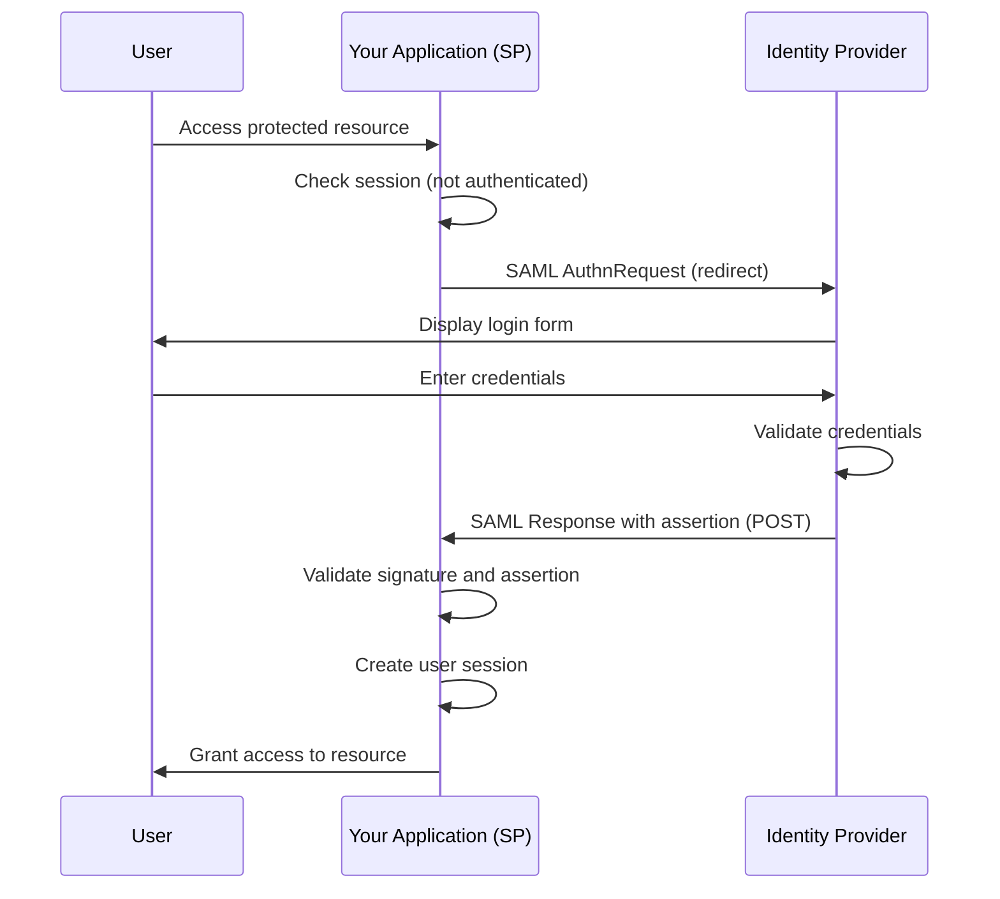
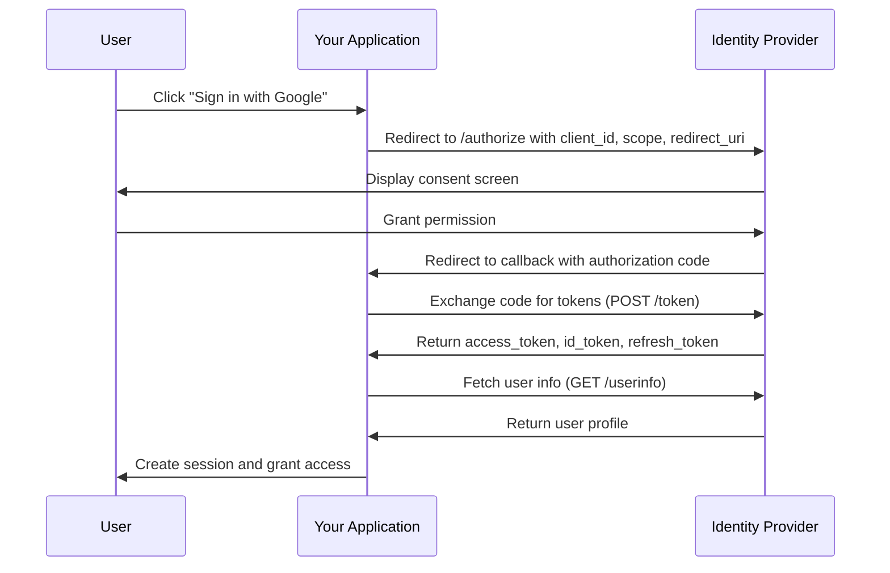
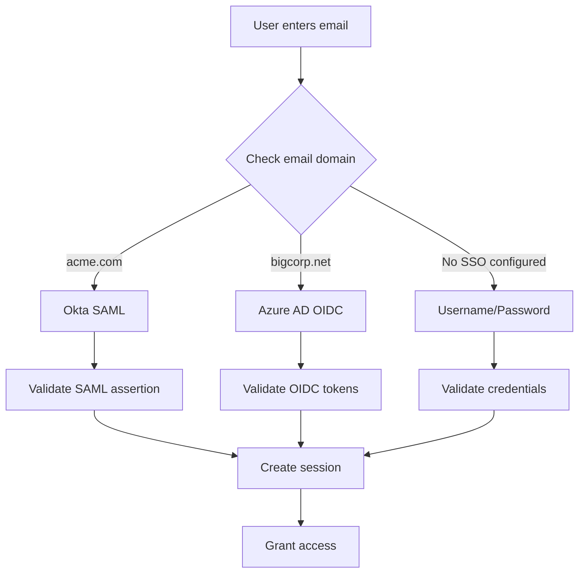

# How to Implement SSO Integration Details

Author: [nawazdhandala](https://github.com/nawazdhandala)

Tags: Security, SSO, SAML, OAuth

Description: Learn to implement SSO integration with SAML and OAuth for enterprise single sign-on.

---

Single Sign-On (SSO) lets users authenticate once and access multiple applications without repeated logins. For engineering teams, implementing SSO means integrating with identity providers using protocols like SAML 2.0 or OAuth 2.0/OIDC. This guide walks through the technical details of both approaches, with practical code examples you can adapt for your own applications.

## Understanding SSO Protocols

Before writing code, understand what each protocol offers and when to use it.

| Protocol | Best For | Token Format | Common Providers |
|----------|----------|--------------|------------------|
| SAML 2.0 | Enterprise apps, legacy systems | XML assertions | Okta, Azure AD, OneLogin |
| OAuth 2.0 | API authorization | JSON (JWT) | Google, GitHub, Auth0 |
| OIDC | Modern web apps, mobile | JSON (JWT) | All major IdPs |

SAML is the older standard, widely adopted in enterprise environments. OIDC builds on OAuth 2.0 and is simpler to implement for new applications. Many organizations support both, so your implementation should handle either.

## SSO Authentication Flow

The following diagram shows how SAML authentication works between your application (Service Provider) and the identity provider.



## SAML 2.0 Implementation

SAML uses XML-based assertions signed with X.509 certificates. Here is how to implement a SAML Service Provider in Node.js using the passport-saml library.

First, install the required dependencies.

```bash
npm install passport passport-saml express-session
```

Configure the SAML strategy with your IdP metadata. The `entryPoint` is your IdP's SSO URL, and the `cert` is the public certificate used to verify signed responses.

```javascript
// config/saml.js
const SamlStrategy = require('passport-saml').Strategy;

const samlConfig = {
  // Your IdP's SSO endpoint - users are redirected here to authenticate
  entryPoint: process.env.SAML_ENTRY_POINT,

  // Your IdP's public certificate for signature verification
  // Download this from your IdP's metadata endpoint
  cert: process.env.SAML_CERT,

  // Your application's entity ID - must match what you registered with the IdP
  issuer: process.env.SAML_ISSUER || 'https://yourapp.com/saml/metadata',

  // Where the IdP sends the SAML response after authentication
  callbackUrl: process.env.SAML_CALLBACK_URL || 'https://yourapp.com/auth/saml/callback',

  // Request specific attributes from the IdP
  identifierFormat: 'urn:oasis:names:tc:SAML:1.1:nameid-format:emailAddress',

  // Sign your requests to the IdP (recommended for production)
  signatureAlgorithm: 'sha256',
  digestAlgorithm: 'sha256',
};

const samlStrategy = new SamlStrategy(
  samlConfig,
  // This function is called after successful authentication
  (profile, done) => {
    // The profile contains attributes from the SAML assertion
    const user = {
      id: profile.nameID,
      email: profile.email || profile.nameID,
      firstName: profile['urn:oid:2.5.4.42'] || profile.firstName,
      lastName: profile['urn:oid:2.5.4.4'] || profile.lastName,
      groups: profile.groups || [],
    };

    // Look up or create the user in your database
    return findOrCreateUser(user)
      .then(dbUser => done(null, dbUser))
      .catch(err => done(err));
  }
);

module.exports = { samlStrategy, samlConfig };
```

Set up the Express routes to handle the SAML flow. You need endpoints to initiate login, receive the callback, and serve metadata.

```javascript
// routes/auth.js
const express = require('express');
const passport = require('passport');
const router = express.Router();

// Initiate SAML login - redirects to IdP
router.get('/saml/login',
  passport.authenticate('saml', {
    failureRedirect: '/login',
    failureFlash: true
  })
);

// Handle SAML response from IdP
// The IdP POSTs the signed assertion to this endpoint
router.post('/saml/callback',
  passport.authenticate('saml', {
    failureRedirect: '/login',
    failureFlash: true
  }),
  (req, res) => {
    // Authentication successful, redirect to the originally requested page
    const redirectUrl = req.session.returnTo || '/dashboard';
    delete req.session.returnTo;
    res.redirect(redirectUrl);
  }
);

// Serve SP metadata for IdP configuration
// Your IdP admin uses this to set up the trust relationship
router.get('/saml/metadata', (req, res) => {
  const metadata = samlStrategy.generateServiceProviderMetadata(
    process.env.SAML_DECRYPTION_CERT,
    process.env.SAML_SIGNING_CERT
  );
  res.type('application/xml');
  res.send(metadata);
});

// Handle logout
router.get('/saml/logout', (req, res) => {
  req.logout((err) => {
    if (err) {
      console.error('Logout error:', err);
    }
    // Optionally redirect to IdP for single logout
    res.redirect('/');
  });
});

module.exports = router;
```

## OAuth 2.0 / OIDC Implementation

OIDC is simpler to implement and uses JSON Web Tokens. The following diagram shows the authorization code flow, which is the recommended approach for server-side applications.



Install the OIDC client library.

```bash
npm install openid-client
```

Configure the OIDC client by discovering the provider's endpoints automatically from their well-known configuration.

```javascript
// config/oidc.js
const { Issuer, generators } = require('openid-client');

let oidcClient = null;

async function initializeOIDC() {
  // Discover the IdP's configuration automatically
  // This fetches endpoints, supported scopes, and signing keys
  const issuer = await Issuer.discover(process.env.OIDC_ISSUER_URL);

  console.log('Discovered issuer:', issuer.metadata.issuer);

  // Create the client with your registered credentials
  oidcClient = new issuer.Client({
    client_id: process.env.OIDC_CLIENT_ID,
    client_secret: process.env.OIDC_CLIENT_SECRET,
    redirect_uris: [process.env.OIDC_REDIRECT_URI],
    response_types: ['code'],
  });

  return oidcClient;
}

function getClient() {
  if (!oidcClient) {
    throw new Error('OIDC client not initialized');
  }
  return oidcClient;
}

module.exports = { initializeOIDC, getClient, generators };
```

Implement the routes for the authorization code flow.

```javascript
// routes/oidc.js
const express = require('express');
const { getClient, generators } = require('../config/oidc');
const router = express.Router();

// Start the login flow
router.get('/oidc/login', (req, res) => {
  const client = getClient();

  // Generate PKCE code verifier for security
  const codeVerifier = generators.codeVerifier();
  const codeChallenge = generators.codeChallenge(codeVerifier);

  // Store verifier in session for later verification
  req.session.codeVerifier = codeVerifier;
  req.session.returnTo = req.query.returnTo || '/dashboard';

  // Build the authorization URL
  const authUrl = client.authorizationUrl({
    scope: 'openid email profile',
    code_challenge: codeChallenge,
    code_challenge_method: 'S256',
    state: generators.state(),
  });

  res.redirect(authUrl);
});

// Handle the callback from the IdP
router.get('/oidc/callback', async (req, res) => {
  try {
    const client = getClient();

    // Exchange the authorization code for tokens
    const params = client.callbackParams(req);
    const tokenSet = await client.callback(
      process.env.OIDC_REDIRECT_URI,
      params,
      { code_verifier: req.session.codeVerifier }
    );

    // Fetch user information using the access token
    const userinfo = await client.userinfo(tokenSet.access_token);

    // Create or update user in your database
    const user = await findOrCreateUser({
      id: userinfo.sub,
      email: userinfo.email,
      emailVerified: userinfo.email_verified,
      name: userinfo.name,
      picture: userinfo.picture,
    });

    // Store tokens for later API calls if needed
    req.session.accessToken = tokenSet.access_token;
    req.session.refreshToken = tokenSet.refresh_token;
    req.session.userId = user.id;

    // Clean up and redirect
    const redirectUrl = req.session.returnTo || '/dashboard';
    delete req.session.codeVerifier;
    delete req.session.returnTo;

    res.redirect(redirectUrl);
  } catch (err) {
    console.error('OIDC callback error:', err);
    res.redirect('/login?error=authentication_failed');
  }
});

module.exports = router;
```

## Token Validation

Always validate tokens before trusting them. For JWTs, verify the signature, expiration, audience, and issuer claims.

```javascript
// middleware/validateToken.js
const jwt = require('jsonwebtoken');
const jwksClient = require('jwks-rsa');

// Create a client to fetch signing keys from the IdP
const client = jwksClient({
  jwksUri: `${process.env.OIDC_ISSUER_URL}/.well-known/jwks.json`,
  cache: true,
  cacheMaxAge: 86400000, // 24 hours
});

// Fetch the signing key by key ID
function getSigningKey(header, callback) {
  client.getSigningKey(header.kid, (err, key) => {
    if (err) return callback(err);
    const signingKey = key.getPublicKey();
    callback(null, signingKey);
  });
}

// Middleware to validate access tokens
function validateAccessToken(req, res, next) {
  const authHeader = req.headers.authorization;

  if (!authHeader || !authHeader.startsWith('Bearer ')) {
    return res.status(401).json({ error: 'Missing or invalid authorization header' });
  }

  const token = authHeader.substring(7);

  jwt.verify(
    token,
    getSigningKey,
    {
      algorithms: ['RS256'],
      audience: process.env.OIDC_CLIENT_ID,
      issuer: process.env.OIDC_ISSUER_URL,
    },
    (err, decoded) => {
      if (err) {
        console.error('Token validation failed:', err.message);
        return res.status(401).json({ error: 'Invalid token' });
      }

      req.user = decoded;
      next();
    }
  );
}

module.exports = { validateAccessToken };
```

## Multi-Provider SSO Architecture

Many applications need to support multiple identity providers. The following diagram shows how to route users to the correct IdP based on their email domain.



Store SSO configurations per organization in your database.

```javascript
// models/ssoConfig.js
const ssoConfigSchema = {
  organizationId: String,
  provider: String,       // 'saml' or 'oidc'
  emailDomains: [String], // Domains that use this SSO
  enabled: Boolean,

  // SAML-specific settings
  saml: {
    entryPoint: String,
    certificate: String,
    issuer: String,
  },

  // OIDC-specific settings
  oidc: {
    issuerUrl: String,
    clientId: String,
    clientSecret: String,  // Encrypted
  },
};

// Look up SSO config by email domain
async function findSSOConfigByEmail(email) {
  const domain = email.split('@')[1];
  return await SSOConfig.findOne({
    emailDomains: domain,
    enabled: true,
  });
}
```

## Security Checklist

Before deploying SSO to production, verify these security requirements.

| Requirement | SAML | OIDC |
|-------------|------|------|
| Validate XML signatures | Required | N/A |
| Verify JWT signatures | N/A | Required |
| Check token expiration | Check NotOnOrAfter | Check exp claim |
| Validate audience | Check Audience restriction | Check aud claim |
| Use HTTPS everywhere | Required | Required |
| Implement CSRF protection | Use RelayState | Use state parameter |
| Store secrets securely | Encrypt certificates | Encrypt client secrets |
| Enable PKCE | N/A | Required for public clients |

## Testing Your Integration

Test SSO with these scenarios before going live.

1. **Happy path**: User authenticates successfully and lands on the dashboard
2. **Invalid signature**: Tamper with the assertion/token and verify rejection
3. **Expired token**: Use an old token and confirm 401 response
4. **Wrong audience**: Send a token meant for another app
5. **IdP unavailable**: Handle timeouts and display user-friendly errors
6. **Logout propagation**: Verify sessions end when users log out from IdP

## Summary

SSO integration requires understanding the protocols your identity providers support and implementing them correctly. SAML works well for enterprise environments with existing infrastructure, while OIDC offers a simpler developer experience for modern applications. Whichever protocol you choose, validate all tokens, handle errors gracefully, and test thoroughly before deployment.

For more on authentication and security, see our guides on [securing status pages](https://oneuptime.com/blog/post/2025-11-20-secure-your-status-page-authentication-options/view) and [why SSO should be free](https://oneuptime.com/blog/post/2025-08-19-sso-is-a-security-basic-not-an-enterprise-perk/view).
