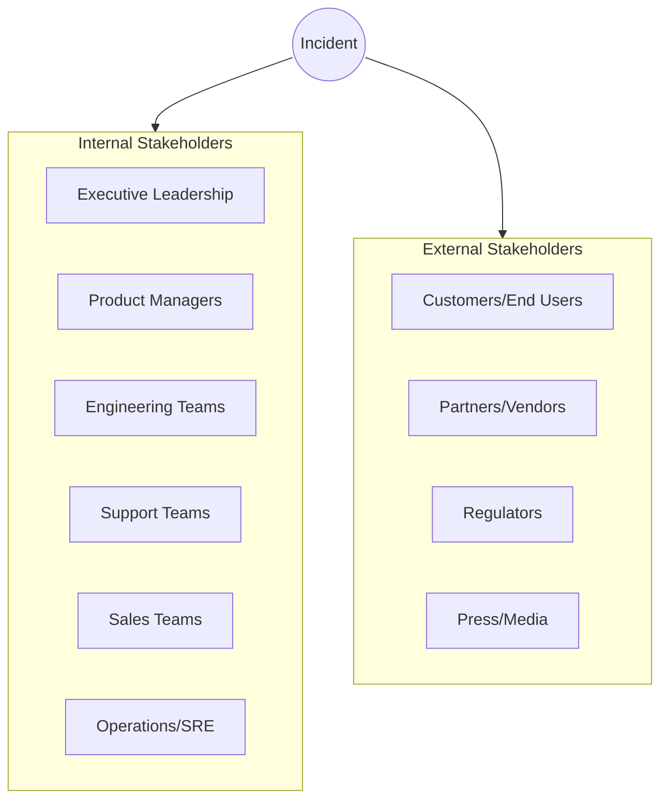
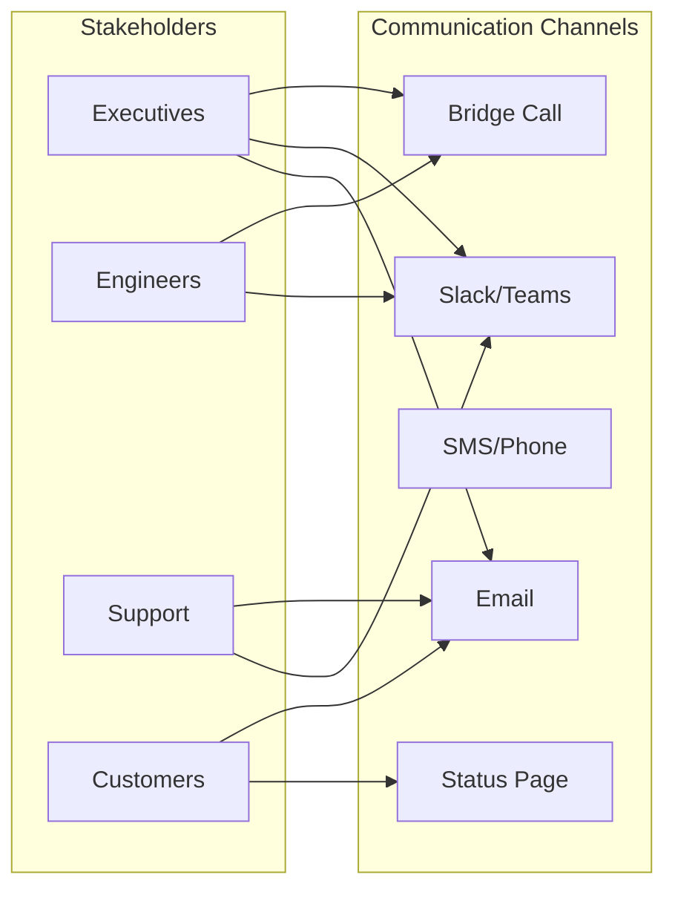
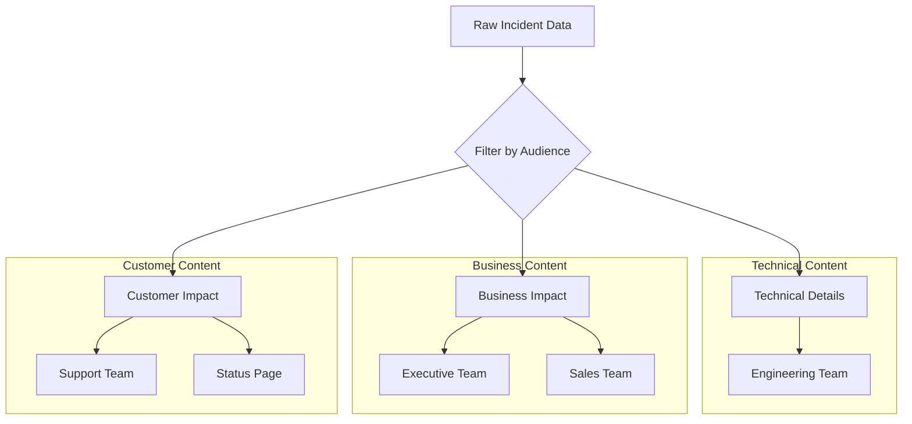
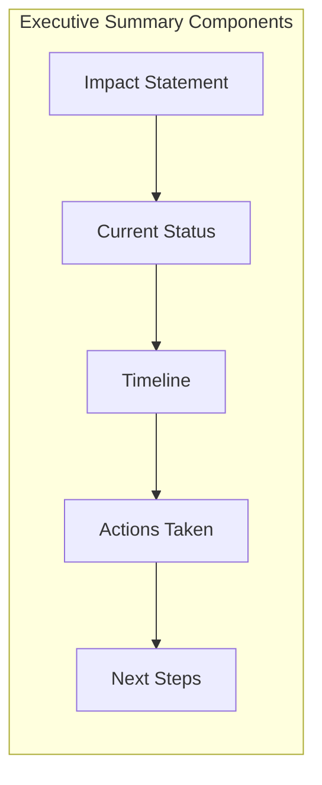
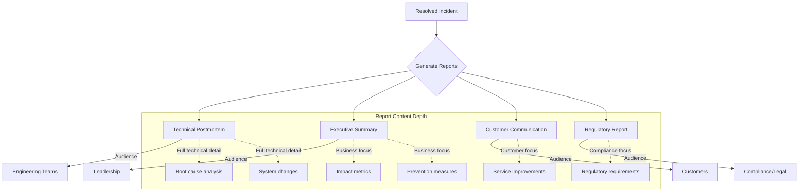
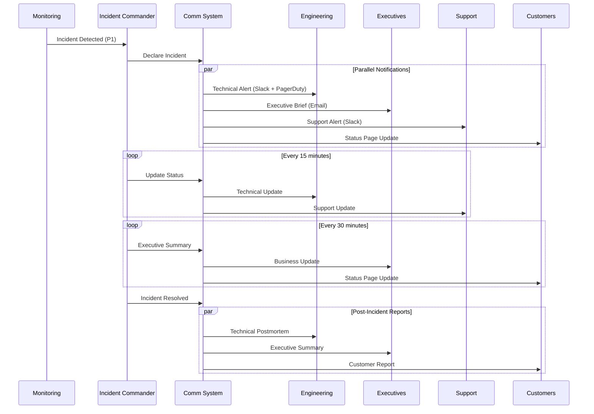

# How to Create Stakeholder Communication

Author: [nawazdhandala](https://github.com/nawazdhandala)

Tags: Incident Management, Communication, SRE, Operations

Description: Learn how to communicate effectively with stakeholders during incidents.

Effective stakeholder communication during incidents is the difference between a well-managed crisis and organizational chaos. When systems go down, the technical response is only half the battle. The other half is keeping everyone informed, from executives to end users, in a way that builds trust and maintains confidence in your team.

This guide covers everything you need to know about creating a robust stakeholder communication strategy for incident management.

## Why Stakeholder Communication Matters

Poor communication during incidents leads to:

- **Duplicate work**: Multiple teams investigating the same issue
- **Escalation storms**: Executives getting involved unnecessarily
- **Customer churn**: Users losing confidence due to silence
- **Blame culture**: Finger-pointing when information is unclear
- **Extended recovery**: Time wasted explaining instead of fixing

Good communication transforms incidents from organizational crises into demonstrations of competence and transparency.

## Stakeholder Identification

The first step in effective incident communication is knowing who needs to know what. Not all stakeholders require the same level of detail or the same update frequency.

### Stakeholder Categories



### Stakeholder Matrix

Create a stakeholder matrix that maps each group to their information needs:

```yaml
# stakeholder-matrix.yaml
stakeholders:
  executive_leadership:
    priority: high
    needs:
      - Business impact summary
      - Customer impact numbers
      - ETA for resolution
      - Financial implications
    does_not_need:
      - Technical debugging details
      - Code-level analysis
      - Infrastructure specifics
    update_frequency: "Every 30 minutes during P1, hourly during P2"

  engineering_teams:
    priority: high
    needs:
      - Technical root cause
      - Affected systems and dependencies
      - Debugging information
      - Code changes and rollbacks
    does_not_need:
      - PR messaging
      - Customer communication drafts
    update_frequency: "Real-time in incident channel"

  support_teams:
    priority: high
    needs:
      - Customer-facing impact description
      - Workarounds available
      - ETA for resolution
      - Talking points for customer calls
    does_not_need:
      - Deep technical analysis
      - Internal escalation details
    update_frequency: "Every 15 minutes during active incident"

  customers:
    priority: critical
    needs:
      - Service status
      - Impact on their usage
      - Workarounds
      - Expected resolution time
    does_not_need:
      - Internal team details
      - Blame or root cause speculation
      - Technical jargon
    update_frequency: "Status page updates every 30 minutes minimum"

  partners_vendors:
    priority: medium
    needs:
      - Impact on integrations
      - API status
      - Timeline for restoration
    does_not_need:
      - Internal incident details
      - Customer-specific information
    update_frequency: "Initial notification, then on major changes"
```

### Automated Stakeholder Classification

Implement automated stakeholder identification based on incident severity:

```typescript
// stakeholder-notification.ts

interface Stakeholder {
  name: string;
  type: 'internal' | 'external';
  channels: NotificationChannel[];
  minSeverity: IncidentSeverity;
  updateFrequencyMinutes: number;
}

enum IncidentSeverity {
  P1_CRITICAL = 1,
  P2_HIGH = 2,
  P3_MEDIUM = 3,
  P4_LOW = 4
}

interface NotificationChannel {
  type: 'slack' | 'email' | 'sms' | 'pagerduty' | 'status_page';
  target: string;
}

const stakeholderRegistry: Stakeholder[] = [
  {
    name: 'Executive Team',
    type: 'internal',
    channels: [
      { type: 'slack', target: '#exec-incidents' },
      { type: 'email', target: 'executives@company.com' }
    ],
    minSeverity: IncidentSeverity.P2_HIGH,
    updateFrequencyMinutes: 30
  },
  {
    name: 'Engineering On-Call',
    type: 'internal',
    channels: [
      { type: 'pagerduty', target: 'engineering-oncall' },
      { type: 'slack', target: '#incidents' }
    ],
    minSeverity: IncidentSeverity.P4_LOW,
    updateFrequencyMinutes: 5
  },
  {
    name: 'Support Team',
    type: 'internal',
    channels: [
      { type: 'slack', target: '#support-alerts' },
      { type: 'email', target: 'support-team@company.com' }
    ],
    minSeverity: IncidentSeverity.P3_MEDIUM,
    updateFrequencyMinutes: 15
  },
  {
    name: 'Customers',
    type: 'external',
    channels: [
      { type: 'status_page', target: 'public' }
    ],
    minSeverity: IncidentSeverity.P2_HIGH,
    updateFrequencyMinutes: 30
  }
];

function getStakeholdersForIncident(severity: IncidentSeverity): Stakeholder[] {
  return stakeholderRegistry.filter(
    stakeholder => stakeholder.minSeverity >= severity
  );
}

function notifyStakeholders(
  incident: Incident,
  message: string,
  stakeholders: Stakeholder[]
): void {
  for (const stakeholder of stakeholders) {
    const filteredMessage = filterMessageForAudience(
      message,
      stakeholder.type
    );

    for (const channel of stakeholder.channels) {
      sendNotification(channel, filteredMessage, incident);
    }
  }
}
```

This code defines a stakeholder registry with notification preferences based on incident severity. The `getStakeholdersForIncident` function filters stakeholders who should be notified for a given severity level, while `notifyStakeholders` handles the actual distribution of filtered messages across appropriate channels.

## Communication Channels by Stakeholder Type

Different stakeholders require different communication channels. Using the wrong channel leads to missed messages or information overload.

### Channel Selection Matrix



### Channel Configuration

```typescript
// channel-router.ts

interface ChannelConfig {
  channel: string;
  urgency: 'immediate' | 'standard' | 'batch';
  richFormatting: boolean;
  bidirectional: boolean;
  maxMessageLength: number;
}

const channelConfigs: Record<string, ChannelConfig> = {
  slack: {
    channel: 'slack',
    urgency: 'immediate',
    richFormatting: true,
    bidirectional: true,
    maxMessageLength: 4000
  },
  email: {
    channel: 'email',
    urgency: 'standard',
    richFormatting: true,
    bidirectional: false,
    maxMessageLength: 50000
  },
  sms: {
    channel: 'sms',
    urgency: 'immediate',
    richFormatting: false,
    bidirectional: false,
    maxMessageLength: 160
  },
  status_page: {
    channel: 'status_page',
    urgency: 'standard',
    richFormatting: true,
    bidirectional: false,
    maxMessageLength: 10000
  },
  phone_bridge: {
    channel: 'phone_bridge',
    urgency: 'immediate',
    richFormatting: false,
    bidirectional: true,
    maxMessageLength: 0 // Voice, no limit
  }
};

interface StakeholderChannelPreference {
  stakeholderType: string;
  primaryChannel: string;
  fallbackChannels: string[];
  escalationChannel: string;
}

const channelPreferences: StakeholderChannelPreference[] = [
  {
    stakeholderType: 'executive',
    primaryChannel: 'email',
    fallbackChannels: ['slack'],
    escalationChannel: 'phone_bridge'
  },
  {
    stakeholderType: 'engineering',
    primaryChannel: 'slack',
    fallbackChannels: ['email'],
    escalationChannel: 'phone_bridge'
  },
  {
    stakeholderType: 'support',
    primaryChannel: 'slack',
    fallbackChannels: ['email'],
    escalationChannel: 'slack'
  },
  {
    stakeholderType: 'customer',
    primaryChannel: 'status_page',
    fallbackChannels: ['email'],
    escalationChannel: 'email'
  }
];

function selectChannelForStakeholder(
  stakeholderType: string,
  messageUrgency: 'immediate' | 'standard' | 'batch'
): string {
  const preference = channelPreferences.find(
    p => p.stakeholderType === stakeholderType
  );

  if (!preference) {
    return 'email'; // Default fallback
  }

  if (messageUrgency === 'immediate') {
    return preference.escalationChannel;
  }

  return preference.primaryChannel;
}
```

This channel router configuration allows you to automatically select the appropriate communication channel based on stakeholder type and message urgency. The system supports fallback channels when primary channels fail and escalation channels for critical situations.

## Update Frequency Guidelines

One of the most common mistakes in incident communication is either over-communicating (causing alert fatigue) or under-communicating (leaving stakeholders in the dark).

### Frequency by Severity and Phase

```mermaid
gantt
    title Update Frequency by Incident Phase
    dateFormat  HH:mm
    axisFormat %H:%M

    section P1 Critical
    Detection & Triage    :a1, 00:00, 15m
    Active Investigation  :a2, after a1, 60m
    Mitigation           :a3, after a2, 30m
    Resolution           :a4, after a3, 15m

    section Updates (P1)
    Every 15 min         :b1, 00:00, 120m
```



### Update Frequency Configuration

```typescript
// update-scheduler.ts

interface UpdateSchedule {
  severity: IncidentSeverity;
  phase: IncidentPhase;
  stakeholderType: string;
  frequencyMinutes: number;
  maxSilenceMinutes: number;
}

enum IncidentPhase {
  DETECTION = 'detection',
  TRIAGE = 'triage',
  INVESTIGATION = 'investigation',
  MITIGATION = 'mitigation',
  RESOLUTION = 'resolution',
  POST_INCIDENT = 'post_incident'
}

const updateSchedules: UpdateSchedule[] = [
  // P1 Critical - Internal Technical
  {
    severity: IncidentSeverity.P1_CRITICAL,
    phase: IncidentPhase.INVESTIGATION,
    stakeholderType: 'engineering',
    frequencyMinutes: 15,
    maxSilenceMinutes: 20
  },
  // P1 Critical - Executives
  {
    severity: IncidentSeverity.P1_CRITICAL,
    phase: IncidentPhase.INVESTIGATION,
    stakeholderType: 'executive',
    frequencyMinutes: 30,
    maxSilenceMinutes: 45
  },
  // P1 Critical - Customers
  {
    severity: IncidentSeverity.P1_CRITICAL,
    phase: IncidentPhase.INVESTIGATION,
    stakeholderType: 'customer',
    frequencyMinutes: 30,
    maxSilenceMinutes: 60
  },
  // P2 High - Internal Technical
  {
    severity: IncidentSeverity.P2_HIGH,
    phase: IncidentPhase.INVESTIGATION,
    stakeholderType: 'engineering',
    frequencyMinutes: 30,
    maxSilenceMinutes: 45
  },
  // P2 High - Executives
  {
    severity: IncidentSeverity.P2_HIGH,
    phase: IncidentPhase.INVESTIGATION,
    stakeholderType: 'executive',
    frequencyMinutes: 60,
    maxSilenceMinutes: 90
  },
  // P3 Medium - All stakeholders
  {
    severity: IncidentSeverity.P3_MEDIUM,
    phase: IncidentPhase.INVESTIGATION,
    stakeholderType: 'all',
    frequencyMinutes: 60,
    maxSilenceMinutes: 120
  }
];

class UpdateScheduler {
  private lastUpdateTime: Map<string, Date> = new Map();

  shouldSendUpdate(
    incidentId: string,
    stakeholderType: string,
    severity: IncidentSeverity,
    phase: IncidentPhase
  ): boolean {
    const schedule = this.findSchedule(severity, phase, stakeholderType);
    if (!schedule) return false;

    const key = `${incidentId}-${stakeholderType}`;
    const lastUpdate = this.lastUpdateTime.get(key);

    if (!lastUpdate) return true;

    const minutesSinceLastUpdate =
      (Date.now() - lastUpdate.getTime()) / (1000 * 60);

    return minutesSinceLastUpdate >= schedule.frequencyMinutes;
  }

  checkSilenceAlerts(
    incidentId: string,
    severity: IncidentSeverity,
    phase: IncidentPhase
  ): string[] {
    const alerts: string[] = [];

    for (const schedule of updateSchedules) {
      if (schedule.severity !== severity || schedule.phase !== phase) {
        continue;
      }

      const key = `${incidentId}-${schedule.stakeholderType}`;
      const lastUpdate = this.lastUpdateTime.get(key);

      if (lastUpdate) {
        const minutesSinceLastUpdate =
          (Date.now() - lastUpdate.getTime()) / (1000 * 60);

        if (minutesSinceLastUpdate > schedule.maxSilenceMinutes) {
          alerts.push(
            `No update sent to ${schedule.stakeholderType} in ` +
            `${Math.round(minutesSinceLastUpdate)} minutes`
          );
        }
      }
    }

    return alerts;
  }

  private findSchedule(
    severity: IncidentSeverity,
    phase: IncidentPhase,
    stakeholderType: string
  ): UpdateSchedule | undefined {
    return updateSchedules.find(
      s => s.severity === severity &&
           s.phase === phase &&
           (s.stakeholderType === stakeholderType || s.stakeholderType === 'all')
    );
  }
}
```

The `UpdateScheduler` class manages update timing for different stakeholder groups. It tracks when each stakeholder type last received an update and can alert incident commanders when stakeholders have gone too long without communication.

### Silence Detection and Alerting

```typescript
// silence-detector.ts

interface SilenceAlert {
  stakeholderType: string;
  minutesSilent: number;
  recommendedAction: string;
}

function detectCommunicationGaps(
  incident: Incident,
  updateHistory: UpdateRecord[]
): SilenceAlert[] {
  const alerts: SilenceAlert[] = [];
  const now = new Date();

  const stakeholderGroups = ['executive', 'engineering', 'support', 'customer'];

  for (const group of stakeholderGroups) {
    const lastUpdate = updateHistory
      .filter(u => u.stakeholderType === group)
      .sort((a, b) => b.timestamp.getTime() - a.timestamp.getTime())[0];

    if (!lastUpdate) {
      alerts.push({
        stakeholderType: group,
        minutesSilent: -1, // Never updated
        recommendedAction: `Send initial update to ${group}`
      });
      continue;
    }

    const minutesSilent =
      (now.getTime() - lastUpdate.timestamp.getTime()) / (1000 * 60);

    const threshold = getMaxSilenceThreshold(incident.severity, group);

    if (minutesSilent > threshold) {
      alerts.push({
        stakeholderType: group,
        minutesSilent: Math.round(minutesSilent),
        recommendedAction: `Update ${group} - ${Math.round(minutesSilent - threshold)} minutes overdue`
      });
    }
  }

  return alerts;
}
```

## Information Filtering by Audience

Different audiences need different levels of detail. Sharing too much technical information with executives wastes their time, while giving customers vague updates erodes trust.

### Information Filtering Flow



### Content Filter Implementation

```typescript
// content-filter.ts

interface IncidentDetails {
  // Technical details
  affectedServices: string[];
  errorMessages: string[];
  stackTraces: string[];
  infrastructureImpact: string;
  deploymentInfo: string;

  // Business details
  estimatedRevenueLoss: number;
  affectedCustomerCount: number;
  slaImpact: string;
  contractualImplications: string;

  // Customer-facing details
  userVisibleSymptoms: string;
  availableWorkarounds: string[];
  estimatedResolutionTime: string;
  apologyStatement: string;
}

interface FilteredContent {
  summary: string;
  details: string[];
  actionItems: string[];
  nextUpdate: string;
}

type AudienceType = 'technical' | 'executive' | 'support' | 'customer';

function filterContentForAudience(
  incident: IncidentDetails,
  audience: AudienceType
): FilteredContent {
  switch (audience) {
    case 'technical':
      return {
        summary: `Services affected: ${incident.affectedServices.join(', ')}`,
        details: [
          `Error: ${incident.errorMessages[0]}`,
          `Infrastructure: ${incident.infrastructureImpact}`,
          `Recent deployment: ${incident.deploymentInfo}`,
          ...incident.stackTraces.slice(0, 3)
        ],
        actionItems: [
          'Check service logs',
          'Review recent deployments',
          'Verify infrastructure health'
        ],
        nextUpdate: '15 minutes'
      };

    case 'executive':
      return {
        summary: `Service disruption affecting ${incident.affectedCustomerCount.toLocaleString()} customers`,
        details: [
          `Estimated revenue impact: $${incident.estimatedRevenueLoss.toLocaleString()}`,
          `SLA status: ${incident.slaImpact}`,
          `Contractual considerations: ${incident.contractualImplications}`
        ],
        actionItems: [
          'Engineering team actively investigating',
          'Customer communication being prepared',
          'Post-incident review scheduled'
        ],
        nextUpdate: '30 minutes'
      };

    case 'support':
      return {
        summary: `Customer-facing issue: ${incident.userVisibleSymptoms}`,
        details: [
          `Affected services: ${incident.affectedServices.join(', ')}`,
          `Customer count: ${incident.affectedCustomerCount.toLocaleString()}`
        ],
        actionItems: [
          'Use these talking points for customer calls',
          `Workarounds available: ${incident.availableWorkarounds.join('; ')}`,
          `ETA: ${incident.estimatedResolutionTime}`
        ],
        nextUpdate: '15 minutes'
      };

    case 'customer':
      return {
        summary: incident.userVisibleSymptoms,
        details: [
          incident.apologyStatement,
          `We are actively working to resolve this issue.`
        ],
        actionItems: incident.availableWorkarounds.map(
          w => `Workaround: ${w}`
        ),
        nextUpdate: incident.estimatedResolutionTime
      };
  }
}
```

This content filter transforms raw incident data into audience-appropriate messages. Technical teams get stack traces and infrastructure details, executives get business impact, support teams get talking points, and customers get clear, jargon-free updates.

### Sensitive Information Handling

```typescript
// sensitive-filter.ts

interface SensitivePatterns {
  pattern: RegExp;
  replacement: string;
  reason: string;
}

const sensitivePatterns: SensitivePatterns[] = [
  {
    pattern: /\b[A-Za-z0-9._%+-]+@[A-Za-z0-9.-]+\.[A-Z|a-z]{2,}\b/g,
    replacement: '[EMAIL REDACTED]',
    reason: 'PII - Email address'
  },
  {
    pattern: /\b(?:api[_-]?key|apikey|secret|password|token)[=:]\s*['"]?[\w-]+['"]?/gi,
    replacement: '[CREDENTIAL REDACTED]',
    reason: 'Security - Credential'
  },
  {
    pattern: /\b\d{1,3}\.\d{1,3}\.\d{1,3}\.\d{1,3}\b/g,
    replacement: '[IP REDACTED]',
    reason: 'Infrastructure - IP Address'
  },
  {
    pattern: /customer[_-]?id[=:]\s*['"]?[\w-]+['"]?/gi,
    replacement: '[CUSTOMER_ID REDACTED]',
    reason: 'PII - Customer identifier'
  }
];

function sanitizeForExternalAudience(content: string): string {
  let sanitized = content;

  for (const pattern of sensitivePatterns) {
    sanitized = sanitized.replace(pattern.pattern, pattern.replacement);
  }

  return sanitized;
}

function validateContentForAudience(
  content: string,
  audience: AudienceType
): { valid: boolean; warnings: string[] } {
  const warnings: string[] = [];

  if (audience === 'customer' || audience === 'executive') {
    // Check for technical jargon
    const technicalTerms = [
      'kubernetes', 'pod', 'container', 'nginx', 'redis',
      'stacktrace', 'null pointer', 'segfault', 'OOM'
    ];

    for (const term of technicalTerms) {
      if (content.toLowerCase().includes(term)) {
        warnings.push(`Technical term "${term}" may confuse ${audience} audience`);
      }
    }
  }

  // Check for sensitive data
  for (const pattern of sensitivePatterns) {
    if (pattern.pattern.test(content)) {
      warnings.push(`Sensitive data detected: ${pattern.reason}`);
    }
  }

  return {
    valid: warnings.length === 0,
    warnings
  };
}
```

## Executive Summary Templates

Executives need concise, actionable information. They want to know the impact, timeline, and what actions are being taken, not technical debugging details.

### Executive Summary Structure



### Executive Summary Generator

```typescript
// executive-summary.ts

interface ExecutiveSummary {
  headline: string;
  impactStatement: string;
  currentStatus: string;
  timeline: TimelineEntry[];
  actionsTaken: string[];
  nextSteps: string[];
  escalationNeeded: boolean;
  escalationReason?: string;
}

interface TimelineEntry {
  time: string;
  event: string;
}

function generateExecutiveSummary(incident: Incident): ExecutiveSummary {
  const duration = calculateDuration(incident.startTime, new Date());
  const customerImpact = calculateCustomerImpact(incident);
  const revenueImpact = estimateRevenueImpact(incident);

  return {
    headline: generateHeadline(incident),
    impactStatement: formatImpactStatement(customerImpact, revenueImpact),
    currentStatus: getStatusDescription(incident.status),
    timeline: formatTimeline(incident.events),
    actionsTaken: summarizeActions(incident.actions),
    nextSteps: determineNextSteps(incident),
    escalationNeeded: shouldEscalate(incident),
    escalationReason: getEscalationReason(incident)
  };
}

function generateHeadline(incident: Incident): string {
  const severity = incident.severity === IncidentSeverity.P1_CRITICAL
    ? 'Critical'
    : 'High Priority';

  return `${severity} Incident: ${incident.affectedServices[0]} Service Disruption`;
}

function formatImpactStatement(
  customerImpact: CustomerImpact,
  revenueImpact: number
): string {
  const parts: string[] = [];

  if (customerImpact.affectedUsers > 0) {
    parts.push(
      `${customerImpact.affectedUsers.toLocaleString()} users affected`
    );
  }

  if (customerImpact.affectedPercentage > 0) {
    parts.push(
      `(${customerImpact.affectedPercentage}% of user base)`
    );
  }

  if (revenueImpact > 0) {
    parts.push(
      `Estimated revenue impact: $${revenueImpact.toLocaleString()}/hour`
    );
  }

  return parts.join('. ');
}

function formatTimeline(events: IncidentEvent[]): TimelineEntry[] {
  // Show only key milestones for executives
  const keyEvents = events.filter(e =>
    e.type === 'detection' ||
    e.type === 'escalation' ||
    e.type === 'mitigation_started' ||
    e.type === 'resolved'
  );

  return keyEvents.map(e => ({
    time: formatTime(e.timestamp),
    event: getExecutiveFriendlyDescription(e)
  }));
}

function getExecutiveFriendlyDescription(event: IncidentEvent): string {
  const descriptions: Record<string, string> = {
    detection: 'Issue detected by monitoring systems',
    escalation: 'Engineering team engaged',
    mitigation_started: 'Mitigation measures implemented',
    resolved: 'Service fully restored'
  };

  return descriptions[event.type] || event.description;
}
```

### Executive Update Template

```markdown
## INCIDENT UPDATE - [SEVERITY] - [TIME]

### Current Status: [INVESTIGATING/MITIGATING/RESOLVED]

**Impact Summary:**
- [X] customers affected ([Y]% of user base)
- Estimated revenue impact: $[Z]/hour
- SLA status: [Within SLA / At risk / Breached]

**What Happened:**
[One sentence description in plain English]

**Timeline:**
| Time | Event |
|------|-------|
| HH:MM | Issue detected |
| HH:MM | Engineering engaged |
| HH:MM | Root cause identified |

**Actions Taken:**
1. [Action 1]
2. [Action 2]

**Next Steps:**
1. [Next step 1] - ETA: [time]
2. [Next step 2] - ETA: [time]

**Next Update:** [Time] or sooner if status changes

---
*Incident Commander: [Name] | Contact: [Channel]*
```

### Automated Executive Report Generator

```typescript
// executive-report-generator.ts

function generateExecutiveReport(incident: Incident): string {
  const summary = generateExecutiveSummary(incident);

  let report = `## INCIDENT UPDATE - ${getSeverityLabel(incident.severity)} - ${formatTime(new Date())}\n\n`;

  report += `### Current Status: ${summary.currentStatus.toUpperCase()}\n\n`;

  report += `**Impact Summary:**\n`;
  report += `${summary.impactStatement}\n\n`;

  report += `**What Happened:**\n`;
  report += `${summary.headline}\n\n`;

  report += `**Timeline:**\n`;
  report += `| Time | Event |\n`;
  report += `|------|-------|\n`;
  for (const entry of summary.timeline) {
    report += `| ${entry.time} | ${entry.event} |\n`;
  }
  report += `\n`;

  report += `**Actions Taken:**\n`;
  for (let i = 0; i < summary.actionsTaken.length; i++) {
    report += `${i + 1}. ${summary.actionsTaken[i]}\n`;
  }
  report += `\n`;

  report += `**Next Steps:**\n`;
  for (let i = 0; i < summary.nextSteps.length; i++) {
    report += `${i + 1}. ${summary.nextSteps[i]}\n`;
  }
  report += `\n`;

  if (summary.escalationNeeded) {
    report += `**ESCALATION REQUIRED:** ${summary.escalationReason}\n\n`;
  }

  report += `**Next Update:** ${calculateNextUpdateTime(incident)} or sooner if status changes\n\n`;
  report += `---\n`;
  report += `*Incident Commander: ${incident.commander} | Contact: ${incident.commanderChannel}*\n`;

  return report;
}
```

## Post-Incident Stakeholder Reports

After an incident is resolved, different stakeholders need different types of reports. The engineering team needs a detailed technical postmortem, while executives need a business-focused summary.

### Post-Incident Report Types



### Post-Incident Report Generator

```typescript
// post-incident-reports.ts

interface PostIncidentReport {
  type: 'technical' | 'executive' | 'customer' | 'regulatory';
  title: string;
  sections: ReportSection[];
  generatedAt: Date;
  approvalRequired: boolean;
  approvers?: string[];
}

interface ReportSection {
  heading: string;
  content: string;
  includeInType: ('technical' | 'executive' | 'customer' | 'regulatory')[];
}

function generatePostIncidentReport(
  incident: ResolvedIncident,
  reportType: 'technical' | 'executive' | 'customer' | 'regulatory'
): PostIncidentReport {
  const allSections: ReportSection[] = [
    {
      heading: 'Incident Summary',
      content: generateIncidentSummary(incident),
      includeInType: ['technical', 'executive', 'customer', 'regulatory']
    },
    {
      heading: 'Business Impact',
      content: generateBusinessImpact(incident),
      includeInType: ['executive', 'regulatory']
    },
    {
      heading: 'Customer Impact',
      content: generateCustomerImpact(incident),
      includeInType: ['customer', 'executive', 'regulatory']
    },
    {
      heading: 'Technical Root Cause',
      content: generateTechnicalRootCause(incident),
      includeInType: ['technical']
    },
    {
      heading: 'Root Cause (Summary)',
      content: generateSimplifiedRootCause(incident),
      includeInType: ['executive', 'customer']
    },
    {
      heading: 'Detailed Timeline',
      content: generateDetailedTimeline(incident),
      includeInType: ['technical', 'regulatory']
    },
    {
      heading: 'Timeline Summary',
      content: generateTimelineSummary(incident),
      includeInType: ['executive', 'customer']
    },
    {
      heading: 'Remediation Actions',
      content: generateRemediationActions(incident),
      includeInType: ['technical', 'executive', 'regulatory']
    },
    {
      heading: 'Prevention Measures',
      content: generatePreventionMeasures(incident),
      includeInType: ['technical', 'executive', 'customer', 'regulatory']
    },
    {
      heading: 'Compliance Considerations',
      content: generateComplianceSection(incident),
      includeInType: ['regulatory']
    },
    {
      heading: 'Our Commitment',
      content: generateCustomerCommitment(incident),
      includeInType: ['customer']
    }
  ];

  const filteredSections = allSections.filter(
    section => section.includeInType.includes(reportType)
  );

  return {
    type: reportType,
    title: generateReportTitle(incident, reportType),
    sections: filteredSections,
    generatedAt: new Date(),
    approvalRequired: reportType === 'customer' || reportType === 'regulatory',
    approvers: getRequiredApprovers(reportType)
  };
}

function generateSimplifiedRootCause(incident: ResolvedIncident): string {
  // Convert technical root cause to plain English
  const technicalCause = incident.rootCause;

  const simplifications: Record<string, string> = {
    'database connection pool exhaustion':
      'Our database systems became overloaded due to unexpected high demand',
    'memory leak in service':
      'A software issue caused our systems to gradually slow down',
    'configuration error':
      'An incorrect setting in our systems caused the service disruption',
    'third-party service outage':
      'One of our partner services experienced issues that affected our service',
    'network connectivity issues':
      'Network problems prevented our systems from communicating properly'
  };

  for (const [technical, simple] of Object.entries(simplifications)) {
    if (technicalCause.toLowerCase().includes(technical)) {
      return simple;
    }
  }

  return 'A technical issue in our systems caused the service disruption';
}

function generateCustomerCommitment(incident: ResolvedIncident): string {
  return `
We understand how important reliable service is to your business, and we
sincerely apologize for any inconvenience this incident may have caused.

We are committed to:
- Implementing the prevention measures outlined above
- Improving our monitoring to detect similar issues faster
- Providing transparent communication during any future incidents
- Continuously improving our systems' reliability

If you have any questions or concerns about this incident, please contact
your account manager or our support team.
  `.trim();
}
```

### Customer Post-Incident Template

```markdown
# Service Incident Report - [Date]

## Summary

On [Date], [Service Name] experienced a service disruption lasting
approximately [Duration]. During this time, [brief description of
what users experienced].

We sincerely apologize for any inconvenience this may have caused.

## What Happened

[Plain English explanation - no technical jargon]

## Impact

- **Duration:** [X hours Y minutes]
- **Affected Services:** [List of affected features]
- **User Impact:** [Description of what users experienced]

## What We Did

1. [Action 1 - in plain English]
2. [Action 2 - in plain English]

## Preventing Future Incidents

We have implemented the following measures to prevent similar incidents:

1. [Prevention measure 1]
2. [Prevention measure 2]

## Our Commitment

We take service reliability seriously and are committed to providing
you with dependable service. We have used this incident as a learning
opportunity to improve our systems and processes.

If you have any questions, please contact support@company.com.

---
*[Company Name] Reliability Team*
```

## Putting It All Together

Here is a complete incident communication workflow that ties all the concepts together:



### Complete Communication System

```typescript
// incident-communication-system.ts

class IncidentCommunicationSystem {
  private stakeholderRegistry: StakeholderRegistry;
  private channelRouter: ChannelRouter;
  private contentFilter: ContentFilter;
  private updateScheduler: UpdateScheduler;
  private reportGenerator: ReportGenerator;

  async handleIncident(incident: Incident): Promise<void> {
    // 1. Identify stakeholders based on severity
    const stakeholders = this.stakeholderRegistry.getStakeholders(
      incident.severity
    );

    // 2. Send initial notifications
    await this.sendInitialNotifications(incident, stakeholders);

    // 3. Start update schedule
    this.updateScheduler.startSchedule(incident, stakeholders);

    // 4. Monitor for silence and send reminders
    this.startSilenceMonitoring(incident);
  }

  async sendUpdate(
    incident: Incident,
    updateContent: UpdateContent
  ): Promise<void> {
    const stakeholders = this.stakeholderRegistry.getStakeholders(
      incident.severity
    );

    for (const stakeholder of stakeholders) {
      // Filter content for audience
      const filteredContent = this.contentFilter.filter(
        updateContent,
        stakeholder.type
      );

      // Validate content
      const validation = this.contentFilter.validate(
        filteredContent,
        stakeholder.type
      );

      if (!validation.valid) {
        console.warn('Content validation warnings:', validation.warnings);
      }

      // Select appropriate channel
      const channel = this.channelRouter.selectChannel(
        stakeholder.type,
        incident.severity
      );

      // Send update
      await this.sendToChannel(channel, filteredContent, stakeholder);

      // Record update
      this.updateScheduler.recordUpdate(incident.id, stakeholder.type);
    }
  }

  async handleResolution(incident: ResolvedIncident): Promise<void> {
    // 1. Send resolution notifications
    await this.sendResolutionNotifications(incident);

    // 2. Generate post-incident reports
    const reports = await this.generatePostIncidentReports(incident);

    // 3. Distribute reports to appropriate stakeholders
    await this.distributeReports(reports);

    // 4. Stop update schedule
    this.updateScheduler.stopSchedule(incident.id);
  }

  private async generatePostIncidentReports(
    incident: ResolvedIncident
  ): Promise<PostIncidentReport[]> {
    return [
      this.reportGenerator.generate(incident, 'technical'),
      this.reportGenerator.generate(incident, 'executive'),
      this.reportGenerator.generate(incident, 'customer')
    ];
  }
}
```

## Best Practices Summary

1. **Know Your Audience**: Different stakeholders need different information. Technical teams need debugging details, executives need business impact, customers need clear status updates.

2. **Set Clear Frequencies**: Establish update schedules based on severity and stick to them. Silence breeds anxiety.

3. **Filter Appropriately**: Remove technical jargon for non-technical audiences. Sanitize sensitive information for external communications.

4. **Use Templates**: Pre-written templates speed up communication and ensure consistency during stressful incidents.

5. **Automate Where Possible**: Use systems to track update schedules, filter content, and alert when communication gaps occur.

6. **Practice Communication**: Include communication drills in your incident response exercises. Good communication is a skill that improves with practice.

7. **Post-Incident Follow-Up**: Close the loop with all stakeholders after resolution. Different audiences need different post-incident reports.

## Conclusion

Effective stakeholder communication during incidents is not just a nice-to-have; it is a critical component of professional incident management. By identifying your stakeholders, establishing appropriate communication channels, setting update frequencies, filtering information by audience, and using templates for consistency, you can transform chaotic incidents into demonstrations of organizational competence.

The code examples and templates in this guide provide a foundation for building your own incident communication system. Adapt them to your organization's needs, practice regularly, and continuously improve based on feedback.

Remember: during an incident, silence is never golden. Keep your stakeholders informed, and they will trust you to handle whatever comes next.
