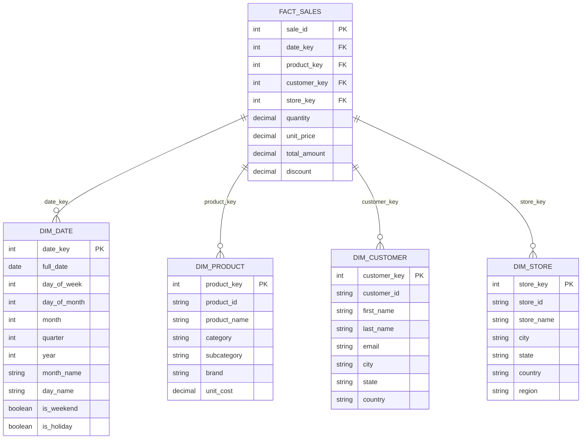
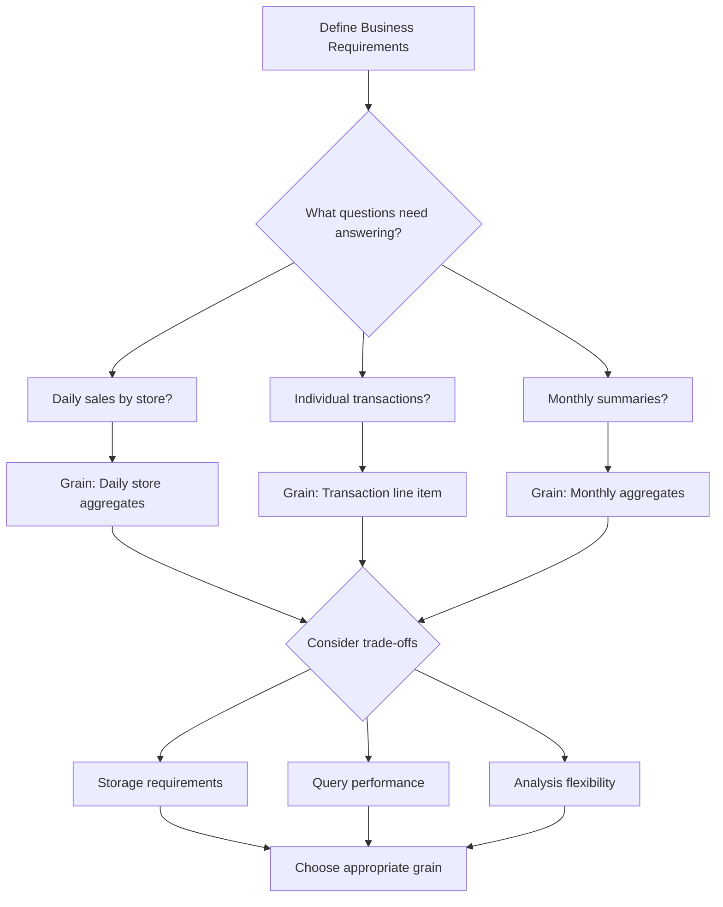
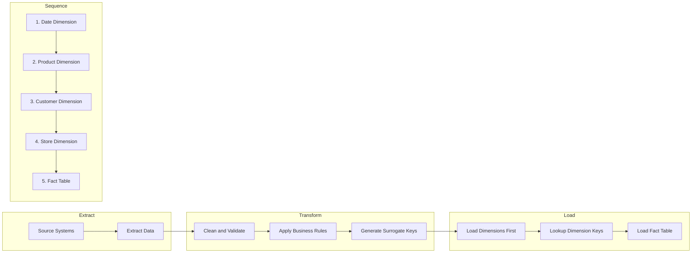
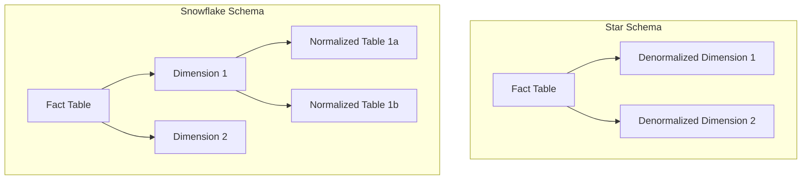

# How to Implement Star Schema Design

Author: [nawazdhandala](https://github.com/nawazdhandala)

Tags: Data Warehouse, Dimensional Modeling, Schema Design, Data Engineering

Description: Learn how to design star schema for efficient data warehousing and analytics.

---

## Introduction

Star schema is the most widely used dimensional modeling approach in data warehousing. Named for its star-like structure when visualized, this design pattern places a central fact table surrounded by dimension tables. This architecture optimizes analytical queries and provides an intuitive structure that business users can easily understand.

In this guide, we will walk through the fundamentals of star schema design, explore its components, and implement a complete example with SQL.

## What is a Star Schema?

A star schema consists of two types of tables:

1. **Fact Table**: The central table containing quantitative data (measures) and foreign keys to dimension tables
2. **Dimension Tables**: Surrounding tables that provide descriptive context to the facts

Here is a visual representation of a star schema:



## Understanding Keys in Star Schema

Star schema uses two types of keys to maintain relationships:

### Surrogate Keys

Surrogate keys are system-generated integers that serve as primary keys in dimension tables. They provide several advantages:

- **Performance**: Integer comparisons are faster than string comparisons
- **Stability**: Natural keys can change, but surrogate keys remain constant
- **Handling NULL values**: Surrogate keys can represent unknown or not applicable values
- **Historical tracking**: Enable Slowly Changing Dimensions (SCD)

### Natural Keys (Business Keys)

Natural keys are the original identifiers from source systems. While not used as primary keys, they should be stored in dimension tables for:

- Data lineage and auditing
- Matching records during ETL processes
- Business user reference

## Building Dimension Tables

Dimension tables are denormalized and contain descriptive attributes. Let us create each dimension table for our sales example.

### Date Dimension

The date dimension is essential for time-based analysis:

```sql
-- Create the date dimension table
-- This dimension enables time-based analysis at various granularities
CREATE TABLE dim_date (
    -- Surrogate key: system-generated unique identifier
    date_key INT PRIMARY KEY,

    -- Natural key: the actual calendar date
    full_date DATE NOT NULL,

    -- Day attributes for daily analysis
    day_of_week INT NOT NULL,        -- 1 = Sunday, 7 = Saturday
    day_of_month INT NOT NULL,       -- 1 to 31
    day_name VARCHAR(10) NOT NULL,   -- 'Monday', 'Tuesday', etc.

    -- Week attributes for weekly analysis
    week_of_year INT NOT NULL,       -- 1 to 52/53

    -- Month attributes for monthly analysis
    month INT NOT NULL,              -- 1 to 12
    month_name VARCHAR(10) NOT NULL, -- 'January', 'February', etc.

    -- Quarter attributes for quarterly analysis
    quarter INT NOT NULL,            -- 1 to 4
    quarter_name VARCHAR(2) NOT NULL,-- 'Q1', 'Q2', 'Q3', 'Q4'

    -- Year attributes for yearly analysis
    year INT NOT NULL,

    -- Fiscal calendar attributes (adjust based on your fiscal year)
    fiscal_month INT NOT NULL,
    fiscal_quarter INT NOT NULL,
    fiscal_year INT NOT NULL,

    -- Flags for filtering
    is_weekend BOOLEAN NOT NULL,
    is_holiday BOOLEAN NOT NULL,
    holiday_name VARCHAR(50)         -- NULL if not a holiday
);

-- Create index on commonly filtered columns
CREATE INDEX idx_dim_date_year_month ON dim_date(year, month);
CREATE INDEX idx_dim_date_full_date ON dim_date(full_date);
```

### Product Dimension

The product dimension stores all product-related attributes:

```sql
-- Create the product dimension table
-- Contains all product attributes for analysis
CREATE TABLE dim_product (
    -- Surrogate key: enables SCD tracking
    product_key INT PRIMARY KEY,

    -- Natural key: original product identifier from source system
    product_id VARCHAR(50) NOT NULL,

    -- Product descriptive attributes
    product_name VARCHAR(200) NOT NULL,
    product_description TEXT,

    -- Product hierarchy for drill-down analysis
    category VARCHAR(100) NOT NULL,      -- Top level: 'Electronics'
    subcategory VARCHAR(100) NOT NULL,   -- Mid level: 'Computers'
    brand VARCHAR(100),                  -- 'Apple', 'Dell', etc.

    -- Product characteristics
    unit_cost DECIMAL(10, 2),
    unit_price DECIMAL(10, 2),
    weight_kg DECIMAL(8, 3),

    -- Product status
    is_active BOOLEAN DEFAULT TRUE,

    -- SCD Type 2 tracking columns
    effective_date DATE NOT NULL,
    expiration_date DATE,
    is_current BOOLEAN DEFAULT TRUE
);

-- Index for common query patterns
CREATE INDEX idx_dim_product_category ON dim_product(category, subcategory);
CREATE INDEX idx_dim_product_current ON dim_product(is_current) WHERE is_current = TRUE;
```

### Customer Dimension

The customer dimension captures customer demographics and attributes:

```sql
-- Create the customer dimension table
-- Stores customer demographics and segmentation data
CREATE TABLE dim_customer (
    -- Surrogate key
    customer_key INT PRIMARY KEY,

    -- Natural key from source system
    customer_id VARCHAR(50) NOT NULL,

    -- Customer name attributes
    first_name VARCHAR(100) NOT NULL,
    last_name VARCHAR(100) NOT NULL,
    full_name VARCHAR(200) GENERATED ALWAYS AS (first_name || ' ' || last_name) STORED,

    -- Contact information
    email VARCHAR(255),
    phone VARCHAR(20),

    -- Geographic attributes for regional analysis
    address_line1 VARCHAR(200),
    address_line2 VARCHAR(200),
    city VARCHAR(100),
    state VARCHAR(100),
    postal_code VARCHAR(20),
    country VARCHAR(100),
    region VARCHAR(50),               -- 'North America', 'Europe', etc.

    -- Customer segmentation
    customer_segment VARCHAR(50),     -- 'Premium', 'Standard', 'Basic'
    acquisition_date DATE,
    acquisition_channel VARCHAR(50),  -- 'Web', 'Store', 'Referral'

    -- Calculated attributes for analysis
    customer_age_group VARCHAR(20),   -- '18-25', '26-35', etc.
    lifetime_value_tier VARCHAR(20),  -- 'High', 'Medium', 'Low'

    -- SCD tracking
    effective_date DATE NOT NULL,
    expiration_date DATE,
    is_current BOOLEAN DEFAULT TRUE
);

-- Indexes for common query patterns
CREATE INDEX idx_dim_customer_segment ON dim_customer(customer_segment);
CREATE INDEX idx_dim_customer_region ON dim_customer(region, country);
```

### Store Dimension

The store dimension represents physical or virtual sales locations:

```sql
-- Create the store dimension table
-- Contains information about sales channels and locations
CREATE TABLE dim_store (
    -- Surrogate key
    store_key INT PRIMARY KEY,

    -- Natural key
    store_id VARCHAR(50) NOT NULL,

    -- Store identification
    store_name VARCHAR(200) NOT NULL,
    store_type VARCHAR(50) NOT NULL,  -- 'Retail', 'Online', 'Warehouse'

    -- Store location
    address VARCHAR(200),
    city VARCHAR(100),
    state VARCHAR(100),
    postal_code VARCHAR(20),
    country VARCHAR(100),
    region VARCHAR(50),

    -- Store characteristics
    store_size_sqft INT,
    open_date DATE,
    close_date DATE,

    -- Store manager (for accountability)
    manager_name VARCHAR(200),

    -- Store status
    is_active BOOLEAN DEFAULT TRUE,

    -- SCD tracking
    effective_date DATE NOT NULL,
    expiration_date DATE,
    is_current BOOLEAN DEFAULT TRUE
);

-- Index for filtering by region and type
CREATE INDEX idx_dim_store_region ON dim_store(region, country);
CREATE INDEX idx_dim_store_type ON dim_store(store_type);
```

## Building the Fact Table

The fact table is the heart of the star schema. It contains measures (numeric values for analysis) and foreign keys to all dimension tables.

```sql
-- Create the sales fact table
-- Central table containing transactional measures
CREATE TABLE fact_sales (
    -- Composite primary key or surrogate key
    sale_id BIGINT PRIMARY KEY,

    -- Foreign keys to dimension tables
    -- These form the grain of the fact table
    date_key INT NOT NULL REFERENCES dim_date(date_key),
    product_key INT NOT NULL REFERENCES dim_product(product_key),
    customer_key INT NOT NULL REFERENCES dim_customer(customer_key),
    store_key INT NOT NULL REFERENCES dim_store(store_key),

    -- Degenerate dimension (transaction identifier)
    -- Stored in fact table as it has no other attributes
    order_number VARCHAR(50) NOT NULL,
    line_item_number INT NOT NULL,

    -- Additive measures: can be summed across all dimensions
    quantity INT NOT NULL,
    unit_price DECIMAL(10, 2) NOT NULL,
    discount_amount DECIMAL(10, 2) DEFAULT 0,
    tax_amount DECIMAL(10, 2) DEFAULT 0,
    total_amount DECIMAL(12, 2) NOT NULL,
    cost_amount DECIMAL(10, 2),
    profit_amount DECIMAL(10, 2),

    -- Semi-additive measures: can be summed across some dimensions
    -- (None in this example, but inventory levels would be semi-additive)

    -- Non-additive measures: cannot be summed, only averaged or counted
    discount_percentage DECIMAL(5, 2),
    margin_percentage DECIMAL(5, 2),

    -- Audit columns
    etl_batch_id BIGINT,
    etl_load_timestamp TIMESTAMP DEFAULT CURRENT_TIMESTAMP
);

-- Create indexes for common query patterns
-- Index on each dimension key for star join optimization
CREATE INDEX idx_fact_sales_date ON fact_sales(date_key);
CREATE INDEX idx_fact_sales_product ON fact_sales(product_key);
CREATE INDEX idx_fact_sales_customer ON fact_sales(customer_key);
CREATE INDEX idx_fact_sales_store ON fact_sales(store_key);

-- Composite index for common date range queries
CREATE INDEX idx_fact_sales_date_store ON fact_sales(date_key, store_key);
```

## Understanding Fact Table Grain

The grain defines the level of detail stored in the fact table. In our example, the grain is:

**"One row per product sold, per order, per customer, per store, per day"**

Choosing the right grain is critical:



## Sample Queries

Here are common analytical queries using the star schema:

### Total Sales by Product Category and Month

```sql
-- Query: Analyze sales trends by product category over time
-- This demonstrates the power of star schema for dimensional analysis
SELECT
    d.year,
    d.month_name,
    p.category,
    p.subcategory,
    -- Aggregate measures
    SUM(f.quantity) AS total_units_sold,
    SUM(f.total_amount) AS total_revenue,
    SUM(f.profit_amount) AS total_profit,
    -- Calculated metrics
    ROUND(SUM(f.profit_amount) / NULLIF(SUM(f.total_amount), 0) * 100, 2) AS profit_margin_pct
FROM fact_sales f
-- Star join: fact table joins to each dimension
INNER JOIN dim_date d ON f.date_key = d.date_key
INNER JOIN dim_product p ON f.product_key = p.product_key
WHERE
    d.year = 2025
    AND p.is_current = TRUE  -- Only current product records
GROUP BY
    d.year,
    d.month,
    d.month_name,
    p.category,
    p.subcategory
ORDER BY
    d.month,
    p.category,
    p.subcategory;
```

### Customer Segmentation Analysis

```sql
-- Query: Analyze purchasing behavior by customer segment
-- Useful for marketing and customer retention strategies
SELECT
    c.customer_segment,
    c.region,
    -- Customer metrics
    COUNT(DISTINCT c.customer_key) AS customer_count,
    COUNT(DISTINCT f.order_number) AS order_count,
    -- Revenue metrics
    SUM(f.total_amount) AS total_revenue,
    ROUND(AVG(f.total_amount), 2) AS avg_transaction_value,
    -- Per customer metrics
    ROUND(SUM(f.total_amount) / COUNT(DISTINCT c.customer_key), 2) AS revenue_per_customer
FROM fact_sales f
INNER JOIN dim_customer c ON f.customer_key = c.customer_key
INNER JOIN dim_date d ON f.date_key = d.date_key
WHERE
    d.year = 2025
    AND c.is_current = TRUE
GROUP BY
    c.customer_segment,
    c.region
ORDER BY
    total_revenue DESC;
```

### Store Performance Dashboard

```sql
-- Query: Compare store performance metrics
-- Supports operational and strategic decision making
SELECT
    s.store_name,
    s.store_type,
    s.region,
    -- Volume metrics
    COUNT(DISTINCT f.sale_id) AS transaction_count,
    SUM(f.quantity) AS units_sold,
    -- Financial metrics
    SUM(f.total_amount) AS gross_revenue,
    SUM(f.discount_amount) AS total_discounts,
    SUM(f.profit_amount) AS gross_profit,
    -- Efficiency metrics
    ROUND(SUM(f.total_amount) / s.store_size_sqft, 2) AS revenue_per_sqft,
    ROUND(AVG(f.discount_percentage), 2) AS avg_discount_pct
FROM fact_sales f
INNER JOIN dim_store s ON f.store_key = s.store_key
INNER JOIN dim_date d ON f.date_key = d.date_key
WHERE
    d.year = 2025
    AND d.quarter = 4
    AND s.is_active = TRUE
GROUP BY
    s.store_key,
    s.store_name,
    s.store_type,
    s.region,
    s.store_size_sqft
ORDER BY
    gross_revenue DESC;
```

### Year-over-Year Comparison

```sql
-- Query: Compare current year performance to previous year
-- Essential for trend analysis and growth tracking
WITH current_year AS (
    SELECT
        p.category,
        SUM(f.total_amount) AS revenue,
        SUM(f.quantity) AS units
    FROM fact_sales f
    INNER JOIN dim_date d ON f.date_key = d.date_key
    INNER JOIN dim_product p ON f.product_key = p.product_key
    WHERE d.year = 2025
    GROUP BY p.category
),
previous_year AS (
    SELECT
        p.category,
        SUM(f.total_amount) AS revenue,
        SUM(f.quantity) AS units
    FROM fact_sales f
    INNER JOIN dim_date d ON f.date_key = d.date_key
    INNER JOIN dim_product p ON f.product_key = p.product_key
    WHERE d.year = 2024
    GROUP BY p.category
)
SELECT
    cy.category,
    cy.revenue AS current_revenue,
    py.revenue AS previous_revenue,
    -- Calculate year-over-year growth
    ROUND((cy.revenue - py.revenue) / NULLIF(py.revenue, 0) * 100, 2) AS revenue_growth_pct,
    cy.units AS current_units,
    py.units AS previous_units,
    ROUND((cy.units - py.units) / NULLIF(py.units, 0) * 100, 2) AS units_growth_pct
FROM current_year cy
LEFT JOIN previous_year py ON cy.category = py.category
ORDER BY revenue_growth_pct DESC;
```

## ETL Process Overview

Loading data into a star schema follows a specific sequence:



### Dimension Loading Example

```sql
-- Example: Loading new products into the product dimension
-- Uses MERGE for handling both inserts and updates (SCD Type 1)

MERGE INTO dim_product AS target
USING (
    -- Source data from staging table
    SELECT
        product_id,
        product_name,
        category,
        subcategory,
        brand,
        unit_cost,
        unit_price
    FROM staging_products
) AS source
ON target.product_id = source.product_id
   AND target.is_current = TRUE
-- Update existing records (SCD Type 1: overwrite)
WHEN MATCHED THEN
    UPDATE SET
        product_name = source.product_name,
        category = source.category,
        subcategory = source.subcategory,
        brand = source.brand,
        unit_cost = source.unit_cost,
        unit_price = source.unit_price
-- Insert new records
WHEN NOT MATCHED THEN
    INSERT (
        product_key,
        product_id,
        product_name,
        category,
        subcategory,
        brand,
        unit_cost,
        unit_price,
        effective_date,
        is_current
    )
    VALUES (
        NEXT VALUE FOR seq_product_key,  -- Generate surrogate key
        source.product_id,
        source.product_name,
        source.category,
        source.subcategory,
        source.brand,
        source.unit_cost,
        source.unit_price,
        CURRENT_DATE,
        TRUE
    );
```

## Slowly Changing Dimensions

Dimension data changes over time. Here is how to handle different types of changes:

### SCD Type 1: Overwrite

Simply update the existing record. History is not preserved.

```sql
-- SCD Type 1: Update customer email address
-- History is lost but storage is minimal
UPDATE dim_customer
SET
    email = 'new.email@example.com',
    effective_date = CURRENT_DATE
WHERE
    customer_id = 'CUST-001'
    AND is_current = TRUE;
```

### SCD Type 2: Add New Row

Create a new record and expire the old one. Full history is preserved.

```sql
-- SCD Type 2: Customer changes address
-- Expire current record
UPDATE dim_customer
SET
    expiration_date = CURRENT_DATE - INTERVAL '1 day',
    is_current = FALSE
WHERE
    customer_id = 'CUST-001'
    AND is_current = TRUE;

-- Insert new record with updated address
INSERT INTO dim_customer (
    customer_id,
    first_name,
    last_name,
    city,
    state,
    country,
    effective_date,
    expiration_date,
    is_current
)
SELECT
    customer_id,
    first_name,
    last_name,
    'New York',           -- New city
    'NY',                 -- New state
    country,
    CURRENT_DATE,         -- Start date for new record
    NULL,                 -- No expiration
    TRUE                  -- Mark as current
FROM dim_customer
WHERE
    customer_id = 'CUST-001'
    AND is_current = FALSE
    AND expiration_date = CURRENT_DATE - INTERVAL '1 day';
```

## Best Practices

### 1. Design for Business Users

Star schemas should be intuitive. Use clear, business-friendly naming conventions:

```sql
-- Good: Clear, descriptive names
dim_customer
dim_product
fact_sales
customer_segment
product_category

-- Avoid: Technical or abbreviated names
d_cust
d_prod
f_sls
cust_seg
prod_cat
```

### 2. Handle Unknown Values

Create placeholder records for unknown or missing dimension values:

```sql
-- Insert unknown member for customer dimension
INSERT INTO dim_customer (
    customer_key,
    customer_id,
    first_name,
    last_name,
    email,
    customer_segment,
    effective_date,
    is_current
) VALUES (
    -1,                    -- Reserved key for unknown
    'UNKNOWN',
    'Unknown',
    'Customer',
    NULL,
    'Unknown',
    '1900-01-01',
    TRUE
);
```

### 3. Optimize for Query Performance

Create appropriate indexes and consider partitioning:

```sql
-- Example: Partition fact table by year
CREATE TABLE fact_sales (
    -- columns as defined above
)
PARTITION BY RANGE (date_key) (
    PARTITION p_2023 VALUES LESS THAN (20240101),
    PARTITION p_2024 VALUES LESS THAN (20250101),
    PARTITION p_2025 VALUES LESS THAN (20260101),
    PARTITION p_future VALUES LESS THAN (MAXVALUE)
);
```

## Star Schema vs Snowflake Schema

Understanding when to use each approach:



| Aspect | Star Schema | Snowflake Schema |
|--------|-------------|------------------|
| Query Performance | Faster (fewer joins) | Slower (more joins) |
| Storage | More redundancy | Less redundancy |
| Complexity | Simpler | More complex |
| Maintenance | Easier | More difficult |
| Best For | Analytics, BI tools | Storage optimization |

## Conclusion

Star schema design is fundamental to successful data warehousing. By following these principles:

1. **Define clear grain**: Know exactly what each fact row represents
2. **Build rich dimensions**: Include all attributes needed for analysis
3. **Use surrogate keys**: Enable flexibility and historical tracking
4. **Optimize for queries**: Index appropriately and consider partitioning
5. **Keep it simple**: Prioritize usability over normalization

You will create a robust foundation for analytical reporting that scales with your business needs.

## Further Reading

- Kimball, Ralph. "The Data Warehouse Toolkit" (essential reading for dimensional modeling)
- Inmon, Bill. "Building the Data Warehouse"
- Kimball Group design tips and best practices
